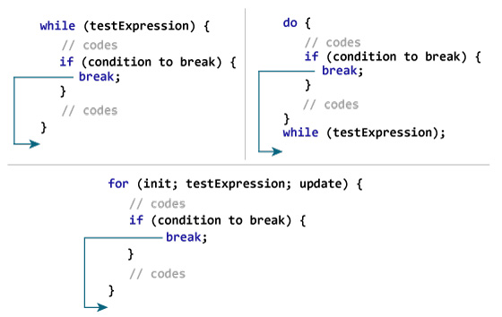
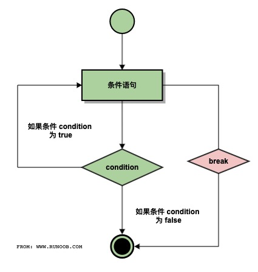

# C break 语句

C 语言中 **break** 语句有以下两种用法：

1. 当 **break** 语句出现在一个循环内时，循环会立即终止，且程序流将继续执行紧接着循环的下一条语句。
2. 它可用于终止 **switch** 语句中的一个 case。

如果您使用的是嵌套循环（即一个循环内嵌套另一个循环），break 语句会停止执行最内层的循环，然后开始执行该块之后的下一行代码。

## 语法

C 语言中 **break** 语句的语法：

```
break;
```



## 流程图



## 实例

```c
#include <stdio.h>
 
int main ()
{
   /* 局部变量定义 */
   int a = 10;

   /* while 循环执行 */
   while( a < 20 )
   {
      printf("a 的值： %d\n", a);
      a++;
      if( a > 15)
      {
         /* 使用 break 语句终止循环 */
          break;
      }
   }
 
   return 0;
}
```


当上面的代码被编译和执行时，它会产生下列结果：

```
a 的值： 10
a 的值： 11
a 的值： 12
a 的值： 13
a 的值： 14
a 的值： 15
```
