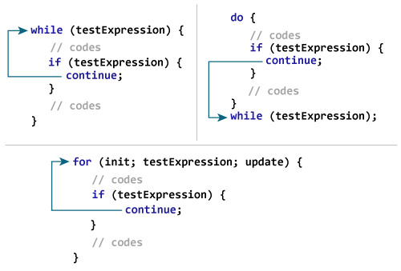
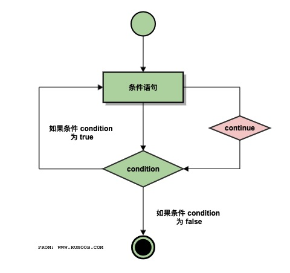

# C continue 语句


C 语言中的 **continue** 语句有点像 **break** 语句。但它不是强制终止，continue 会跳过当前循环中的代码，强迫开始下一次循环。

对于 **for** 循环，**continue** 语句执行后自增语句仍然会执行。对于 **while** 和 **do...while** 循环，**continue** 语句重新执行条件判断语句。

## 语法

C 语言中 **continue** 语句的语法：

```
continue;
```



## 流程图



## 实例

```c
#include <stdio.h>
 
int main ()
{
   /* 局部变量定义 */
   int a = 10;

   /* do 循环执行 */
   do
   {
      if( a == 15)
      {
         /* 跳过迭代 */
         a = a + 1;
         continue;
      }
      printf("a 的值： %d\n", a);
      a++;
     
   }while( a < 20 );
 
   return 0;
}
```


当上面的代码被编译和执行时，它会产生下列结果：

```
a 的值： 10
a 的值： 11
a 的值： 12
a 的值： 13
a 的值： 14
a 的值： 16
a 的值： 17
a 的值： 18
a 的值： 19
```
