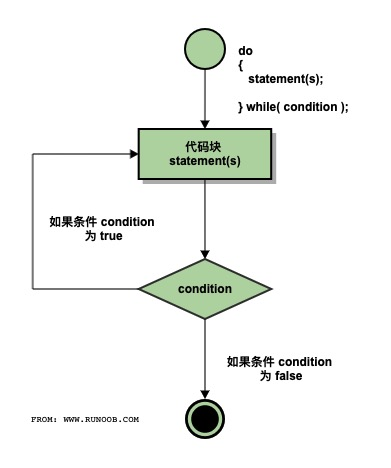

# C do...while 循环

不像 **for** 和 **while** 循环，它们是在循环头部测试循环条件。在 C 语言中，**do...while** 循环是在循环的尾部检查它的条件。

**do...while** 循环与 while 循环类似，但是 do...while 循环会确保至少执行一次循环。

## 语法

C 语言中 **do...while** 循环的语法：

```c
do
{
   statement(s);

}while( condition );
```

请注意，条件表达式出现在循环的尾部，所以循环中的 statement(s) 会在条件被测试之前至少执行一次。

如果条件为真，控制流会跳转回上面的 do，然后重新执行循环中的 statement(s)。这个过程会不断重复，直到给定条件变为假为止。

## 流程图




## 实例

```c
#include <stdio.h>
 
int main ()
{
   /* 局部变量定义 */
   int a = 10;

   /* do 循环执行，在条件被测试之前至少执行一次 */
   do
   {
       printf("a 的值： %d\n", a);
       a = a + 1;
   }while( a < 20 );
 
   return 0;
}
```


当上面的代码被编译和执行时，它会产生下列结果：

```
a 的值： 10
a 的值： 11
a 的值： 12
a 的值： 13
a 的值： 14
a 的值： 15
a 的值： 16
a 的值： 17
a 的值： 18
a 的值： 19
```
