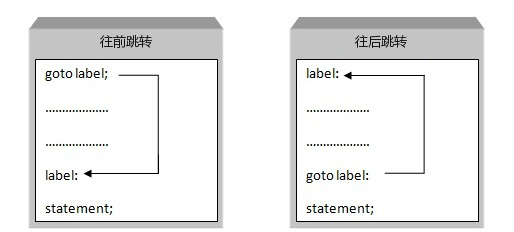
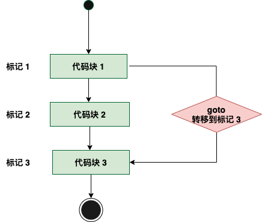

# C goto 语句

# 建议不使用goto

C 语言中的 **goto** 语句允许把控制无条件转移到同一函数内的被标记的语句。

**注意：**在任何编程语言中，都不建议使用 goto 语句。因为它使得程序的控制流难以跟踪，使程序难以理解和难以修改。任何使用 goto 语句的程序可以改写成不需要使用 goto 语句的写法。

## 语法

C 语言中 **goto** 语句的语法：

```
goto label;
..
.
label: statement;
```

在这里，**label** 可以是任何除 C 关键字以外的纯文本，它可以设置在 C 程序中 **goto** 语句的前面或者后面。



## 流程图



## 实例

```c
#include <stdio.h>
 
int main ()
{
   /* 局部变量定义 */
   int a = 10;

   /* do 循环执行 */
   LOOP:do
   {
      if( a == 15)
      {
         /* 跳过迭代 */
         a = a + 1;
         goto LOOP;
      }
      printf("a 的值： %d\n", a);
      a++;
     
   }while( a < 20 );
 
   return 0;
}
```

当上面的代码被编译和执行时，它会产生下列结果：

```
a 的值： 10
a 的值： 11
a 的值： 12
a 的值： 13
a 的值： 14
a 的值： 16
a 的值： 17
a 的值： 18
a 的值： 19
```
