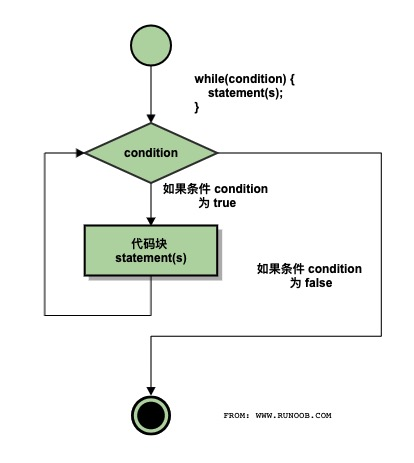

# C while 循环

只要给定的条件为真，C 语言中的 **while** 循环语句会重复执行一个目标语句。

## 语法

C 语言中 **while** 循环的语法：

```c
while(condition)
{
   statement(s);
}
```

在这里，**statement(s)** 可以是一个单独的语句，也可以是几个语句组成的代码块。

**condition** 可以是任意的表达式，当为任意非零值时都为 true。当条件为 true 时执行循环。 当条件为 false 时，退出循环，程序流将继续执行紧接着循环的下一条语句。

## 流程图



在这里，*while* 循环的关键点是循环可能一次都不会执行。当条件为 false 时，会跳过循环主体，直接执行紧接着 while 循环的下一条语句。


## 实例

```c
#include <stdio.h>
 
int main ()
{
   /* 局部变量定义 */
   int a = 10;

   /* while 循环执行 */
   while( a < 20 )
   {
      printf("a 的值： %d\n", a);
      a++;
   }
 
   return 0;
}
```


当上面的代码被编译和执行时，它会产生下列结果：

```
a 的值： 10
a 的值： 11
a 的值： 12
a 的值： 13
a 的值： 14
a 的值： 15
a 的值： 16
a 的值： 17
a 的值： 18
a 的值： 19
```
