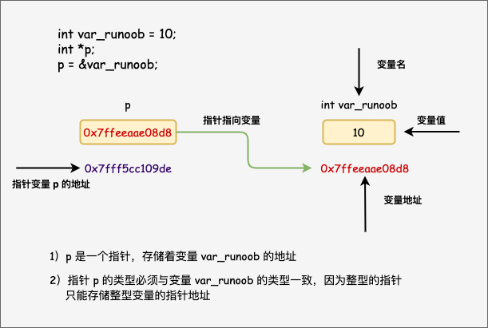

# C 指针

学习 C 语言的指针既简单又有趣。通过指针，可以简化一些 C 编程任务的执行，还有一些任务，如动态内存分配，没有指针是无法执行的。所以，想要成为一名优秀的 C 程序员，学习指针是很有必要的。

正如您所知道的，每一个变量都有一个内存位置，每一个内存位置都定义了可使用 **&** 运算符访问的地址，它表示了在内存中的一个地址。

请看下面的实例，它将输出定义的变量地址：

## 实例

```c
#include <stdio.h>
 
int main ()
{
    int var_runoob = 10;
    int *p;              // 定义指针变量
    p = &var_runoob;
 
   printf("var_runoob 变量的地址： %p\n", p);
   return 0;
}
```


当上面的代码被编译和执行时，它会产生下列结果：

```
var_runoob 变量的地址： 0x7ffeeaae08d8
```



通过上面的实例，我们了解了什么是内存地址以及如何访问它。接下来让我们看看什么是指针。

## 什么是指针？

**指针也就是内存地址**，指针变量是用来存放内存地址的变量。就像其他变量或常量一样，您必须在使用指针存储其他变量地址之前，对其进行声明。指针变量声明的一般形式为：

```
type *var_name;
```

在这里，**type** 是指针的基类型，它必须是一个有效的 C 数据类型，**var_name** 是指针变量的名称。用来声明指针的星号 ***** 与乘法中使用的星号是相同的。但是，在这个语句中，星号是用来指定一个变量是指针。以下是有效的指针声明：

```c
int    *ip;    /* 一个整型的指针 */
double *dp;    /* 一个 double 型的指针 */
float  *fp;    /* 一个浮点型的指针 */
char   *ch;    /* 一个字符型的指针 */
```


所有实际数据类型，不管是整型、浮点型、字符型，还是其他的数据类型，对应指针的值的类型都是一样的，都是一个代表内存地址的长的十六进制数。

不同数据类型的指针之间唯一的不同是，指针所指向的变量或常量的数据类型不同。

## 如何使用指针？

使用指针时会频繁进行以下几个操作：定义一个指针变量、把变量地址赋值给指针、访问指针变量中可用地址的值。这些是通过使用一元运算符 ***** 来返回位于操作数所指定地址的变量的值。下面的实例涉及到了这些操作：

## 实例

```c
int    *ip;    /* 一个整型的指针 */
double *dp;    /* 一个 double 型的指针 */
float  *fp;    /* 一个浮点型的指针 */
char   *ch;    /* 一个字符型的指针 */
```


当上面的代码被编译和执行时，它会产生下列结果：

```
var 变量的地址: 0x7ffeeef168d8
ip 变量存储的地址: 0x7ffeeef168d8
*ip 变量的值: 20
```

## C 中的 NULL 指针

在变量声明的时候，如果没有确切的地址可以赋值，为指针变量赋一个 NULL 值是一个良好的编程习惯。赋为 NULL 值的指针被称为**空**指针。

NULL 指针是一个定义在标准库中的值为零的常量。请看下面的程序：

## 实例

```c
#include <stdio.h>
 
int main ()
{
   int  *ptr = NULL;
 
   printf("ptr 的地址是 %p\n", ptr  );
 
   return 0;
}
```

当上面的代码被编译和执行时，它会产生下列结果：

```
ptr 的地址是 0x0
```

在大多数的操作系统上，程序不允许访问地址为 0 的内存，因为该内存是操作系统保留的。然而，内存地址 0 有特别重要的意义，它表明该指针不指向一个可访问的内存位置。但按照惯例，如果指针包含空值（零值），则假定它不指向任何东西。

如需检查一个空指针，您可以使用 if 语句，如下所示：

```c
if(ptr)     /* 如果 p 非空，则完成 */
if(!ptr)    /* 如果 p 为空，则完成 */
```


## C 指针详解

在 C 中，有很多指针相关的概念，这些概念都很简单，但是都很重要。下面列出了 C 程序员必须清楚的一些与指针相关的重要概念：

| 概念                                                         | 描述                                                     |
| :----------------------------------------------------------- | :------------------------------------------------------- |
| [指针的算术运算](https://www.runoob.com/cprogramming/c-pointer-arithmetic.html) | 可以对指针进行四种算术运算：++、--、+、-                 |
| [指针数组](https://www.runoob.com/cprogramming/c-array-of-pointers.html) | 可以定义用来存储指针的数组。                             |
| [指向指针的指针](https://www.runoob.com/cprogramming/c-pointer-to-pointer.html) | C 允许指向指针的指针。                                   |
| [传递指针给函数](https://www.runoob.com/cprogramming/c-passing-pointers-to-functions.html) | 通过引用或地址传递参数，使传递的参数在调用函数中被改变。 |
| [从函数返回指针](https://www.runoob.com/cprogramming/c-return-pointer-from-functions.html) | C 允许函数返回指针到局部变量、静态变量和动态内存分配。   |
