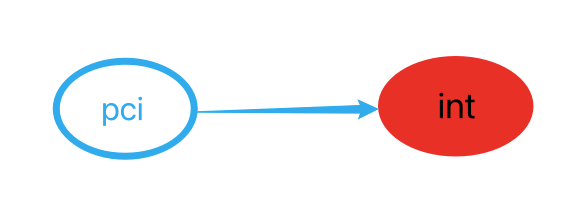
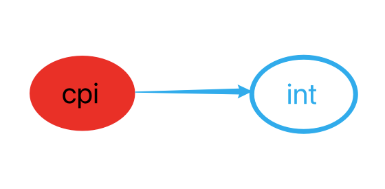

# 2.变量和基础类型

## 2.1 基本内置类型
* C++是一种静态数据类型语言，在编译时进行类型检查
* C++定义了：算术类型、空类型

### 算术类型

| 类型          | 含义           | 最小尺寸(bit) | 说明                                                         |
| ------------- | -------------- | ------------- | ------------------------------------------------------------ |
| `bool`        | 布尔类型       | 未定义        | 取值为真 (true）或假 (false)                                 |
| `char`        | 字符           | 8位           | 1个 char 的大小和一个机器字节一样                            |
| `wchat_t`     | 宽字符         | 16位          | 用于扩展字符集，确保可以存放机器最大，扩展字符集中的任意一个字符 |
| `char16_t`    | Unicode 字符   | 16位          | 用于扩展字符集，为 Unicode 字符集服务                        |
| `char32_t`    | Unicode 字符   | 32位          | 用于扩展字符集，为 Unicode 字符集服务                        |
| `shor`        | 短整型         | 16位          |                                                              |
| `int`         | 整型           | 16位          | 一个 int 至少和一个 short 一样大                             |
| `long`        | 长整型         | 32位          | 一个 long 至少和一个 int 一样大                              |
| `long long`   | 长整型         | 64位          | C++11中新定义，一个 long long 至少和一个 long一样大          |
| `float`       | 单精度浮点数   | 6位有效数字   |                                                              |
| `double`      | 双精度浮点数   | 10位有效数字  |                                                              |
| `long double` | 扩展精度浮点型 | 10位有效数字  | 常常用于有特殊浮点需求的硬件                                 |


> 计算机以比特序列存储数据，每个比特非0即1，
> 可寻址的最小内存块称为“字节（byte）”，内存的基本单元称为“字(word）
> 大多数机器的字节由8比特构成，字则由32或64比特构成

#### 无符号类型

* int、 short、 long和long long都是带符号的,前面加上unsigned就可以得到无符号类型,例如unsigned long
* unsigned int可以缩与成unsigned
* char比较特殊,类型分为三种:char、signed char、 unsigned char
  * char是signed char或unsigned char的其中一种（编译器决定）


### 类型转換

```cpp
	bool b = 42;		  // b为真
	int i = b;			  // i=1
	i = 3.14;			  // i=3
	double pi = i;		  // pi的值为3.0
	unsigned char c = -1; // 假设char占8比特,c的值为255
	signed char c2 = 256; // 假设char占8比特,c2的值未定义
```


> 注意：char在一些环境是有符号的，而在另一些环境是无符号的，所以这里面程序移植后可能会有问题

> 注意：切勿混用带符号类型和无符号类型，比如让两个数相加，转换由编译器决定，程序结果不受控（编译器可能不同）
>


### 字面值常量

一个型如42的值被称为字面值常量 (literal)

#### 整形和浮点型字面值

* 可以将整形写成十进制、八进制或十六进制

```cpp
  20  //十进制
  024 //八进制
  0x14//十六进制
```


* 浮点型字面值是一个double类型的值，表现为一个小数或科学计数法的指数形式

```cpp
3.14159
3.14169E0 
0. 
0e0
.001
```


* 字符和字符串字面值

```cpp
'a'//char
"Hello World" //string
```


* 转义序列，C++定义的转义序列包括：

```
//常见转义字符
\n
\t
\a
\v
\b
\?
\r
\f
```


* 泛化的转义序列，其形式是\x后紧跟1个或多个十六进制的数字，或后面紧跟1、2或3个八进制的数字。假设使用的是Latin-1字符集，以下是一些示例：

```
\7 响铃
\12 换行
\40 空格
\0 空字符
\115 字符M
\x4d 字符M
```


#### 指定字面值的类型(显式)

* 字符和字符串字面值

| 前缀 | 含义                         | 类型     |
| ---- | ---------------------------- | -------- |
| u    | Unicode 16字符               | char16_t |
| U    | Unicode 32字符               | char32_t |
| L    | 宽字符                       | wchat_t  |
| u8   | UTF8（仅用于字符串字面常量） | char     |


* 整型字面值

| 后缀     | 最小匹配类型 |
| -------- | ------------ |
| u or U   | unsigned     |
| l or L   | long         |
| ll or LL | long long    |


* 浮点型字面值

| 后缀     | 类型        |
| -------- | ----------- |
| f or F   | float       |
| l or L   | long double |


## 2.2 变量

### 变量定义

* 变量：具有类型、具有名称、可操作的存储空间。
  * 类型决定了变量所需要的内存空间、布局方式、以及能够表示值的范围。

```cpp
	int sum=0,value;
	string book;
	Sales_item item;
```

> 对于C++程序员来说，变量(variable）和对象（object）一般是可以互换的。


#### 传统初始化 和 列表初始化

作为C++(11)新标准的一部分，使用花括号来初始化变量(列表初始化)得到了全面应用；

旧版本使用=

```cpp
	int units_sold = 0;
	int units_sold = {0}; //列表初始化
	int units_sold{0};	  //列表初始化
	int units_sold(0);
```

* 如果我们使用列表初始化，且初始值存在丢失信息的风险，则编译器将报错。

```cpp
	double d=3.14;
	int a{d};//报错：转换未执行，因为存在丢失信息的风险
	int a=d; //正常
```


#### 默认初始化

* 如果定义变量没有定义初始值，则变量被赋予默认值。
* 默认值是由变量类型决定的，同时定义变量的位置也会有影响。
  * 内置类型：由定义的位置决定，函数体之外初始化为0
  * 每个类各自决定其初始化对象的方式

> 未初始化的变量含有一个不确定的值，将带来无法预计的后果，应该避免。


### 变量声明和定义的关系


* C++是一种静态类型语言。要求在使用某个变量之前必须先声明。
* 如果想声明一个变量而非定义它，就在变量名前添加extern关键字，而且不要显示的初始化。
* 声明在前，定义在后

extern 不是定义，是引入(声明)在其它源文件中定义的非 static 全局变量


> 变量能且只能定义一次，但可以被声明多次。

定义了一个函数，需要在其它文件中使用，那么需要在其它文件中声明这个函数，所以定义只有一次，声明可以多次

可以把声明理解为一个快捷方式（链接文件），不太恰当


### 标识符

C++标识符(identifier）由字母、数字和下划线组成，其中必须以字母或下划线开头。标识符的长度没有限制，但对大小写敏感。
C++语言保留了一些名字供语言本身使用，这些名字不能作为标识符。


### 名字的作用域

* 同一个名字如果出现在程序的不同位置，也可能指向不同的实体。
* C++中大多数作用域都以花括号分隔。
* 名字的有效区域始于名字的声明语句，以声明语句所在的作用域末端为结束。

> 建议：如果函数有可能用到某全局变量，则不宜再定义一个同名的局部变量。


## 2.3 复合类型

是指基于其它类型定义的类型。

### 引用（reference）

引用是为对象起的别名

* 定义引用时，把引用和它的初始值绑定在一起，而不是将初始值拷贝给引用
* 可以理解引用是一张贴纸，贴在对象盒子上的，一个对象盒子上可以有很多贴纸（别名、引用）
* **引用本身并不是对象**，所以不能定义引用的引用


> C++11中新增了 “右值引用”；当我们使用术语“引用”时，一般指的是“左值引用”


### 指针（pointer）

指针是对地址的封装，**本身是一个对象**

* 定义指针类型的方法是将声明符写成*d的形式
* 如果一条语句中定义了几个指针变量，每个变量前面都必须加上*符号
* 和其他内置类型一样，在块作用域内定义指针如果没有初始化，将拥有一个不确定的值


* 可以使用取地址符（运算符&）获取指针所封装的地址
* 可以使用解引用符（运算符*）利用指针访问对象

> 注意：引用不是对象，不存在地址，所以不能定义一个指针指向引用

> 在声明（左值）中，*和&用于组成复合类型，他们是表示指针和引用；
>
> 在表达式（右值）中，他们是运算。他们是表示取值和取址


#### 空指针（null pointer）

* 不指向任何对象
* 在使用一个指针之前，可以首先检查它是否为空

```cpp
int *p1 = nullptr;//c++11
int *p2 = 0;
int *p3 = NULL;//需要#include cstdlib

int p1 = 0;//正常
int zero = 0;
p1 = zero;//错误：类型不匹配
```

> 为了避免野指针，应该在指针使用前确定指针的值；很多回调函数中不能确定值，建议使用void指针


#### void * 指针

纯粹的地址封裝，与类型无关。可以用于存放任意对象的地址。


#### 小小讨论

```cpp
int* i=1;//风格1
int *j=2;//风格2

int& i=refVal;//风格1
int &j=refVal;//风格2
```

\*& 符号靠近类型符和靠近声明符，形成了两种风格，编译器都允许，以上两种风格各有优点。

^_^ 我个人倾向于风格2 ，因为它让我觉得*i是一个int，所以i是一个int pointer。`int *i,j,k`风格2遇到这种情况可读性高


#### 


### 理解复合类型的声明


#### 指针的指针

通过*的个数可以区分指针的级别。

```cpp
int ival = 100;
int *pi = &ival;
int **ppi = &pi; // ppi指向一个int类型的指针
```


#### 指针的引用

指针是对象，可以定义引用

```cpp
	int i = 100;
	int *p;
	int *&r = p; // r是一个对指针p的引用

	r = &i; // r是p的一个别名(引用),等同于p=&i
	*r = 0; // r是p的一个别名(引用),等同于*p=i
```


## 2.4 const 限定符

* 把变量定义成一个常量（其实更好的理解是只读变量）
* 使用const对变量的类型加以限定，变量的值不能被改变。
* const对象必须初始化（其他时候不能出现在等号左边）

```cpp
//不能更改const只读变量的值
const int j = 100;
j = 200;//cannot assign to variable 'j' with const-qualified type 'const int'


//必须初始化
const int i=100;//normal
const int k;//default initialization of an object of const type 'const int'

```


> 默认状态下，const对象仅在文件内有效
>
> 如果想在多个文件之间共享const对象，必须在变量的定义之前添加extern关键字


### const的引用

对常量的引用

判断常量的引用是否正确，判断是否有更改这个常量（const）的风险

```cpp
const int ci = 100;
const int &r1 = ci; //正确

r1 = 200;	  //错误,尝试修改const变量
int &r2 = ci; //错误,ci是const变量,存在通过r2改变ci(const)的风险

//不能使用变量引用指向常量（const）
int &r3 = r1;
```


```cpp
double dval = 3.14;
const int &ri = dval;//正常
int &ri = dval;//错误
// 因为底层执行是
// int temp = (int)dval；
// int &ri = temp;
// 所以引用ri是temp的别名，如果引用是变量，更改temp这个没有意义，所以编译器直接报错，阻止了这种情况的发生
// 第二行正常的原因是，ri是常量（const），底层执行是，const int &ri = 3；

```


### 指针和const


#### 指向常量的指针

* 常量值不能改（指针指向的值）
* 指针值可以改（指针的地址pci可以更改）

```cpp
int const *pci;
```




#### const指针

* 指针是常量（指针地址cpi不能改）
* 指针解引用的值可以改

```cpp
int * const cpi;


int *p,a,b;

```



> 注意：const 指针必须初始化，指针当然最好都要初始化~


### 顶层const

* 顶层const：变量本身是常量（const）
* 底层const：指针所指向的对象是常量（const）


### constexpr 和常量表达式

* 常量表达式(const expression）是指：值个会改交开且在编译过程就能得到计算结果的表达式。

```cpp
const int max_files = 20;//是
const int min_files = get_size();//不是
```


#### constexpr变量

* C++11标准规定，允许将变量声明为constexpr类型，以便由编译器来验证变量的值是否是一个常量表达式。
  * 一定是一个 常量
  * 必须用常量表达式初始化

> 需要在编译时就得到计算，声明constexpr时用到的类型必须显而易见，容易得到（称为：字面值类型）
>
> 自定义类型（例如：Sales_ item）、IO库、string等类型不能被定义为constexpr

* 指针和constexpr
  * 限定符仅对指针有效，对指针所指对象无关
  * constexpr 修饰的是顶层const


## 2.5 处理类型

随着程序越来越复杂，程序中的用到的类型也越来越复杂。

* 无法明确表示真实含义。
* 搞不清楚变量到底需要什么类型。

### 类型别名

提高可读性

```cpp
typedef double wages;
typedef wages base,*p;//base是double的同义词，p是double的同义词

using SI = Sales_item;//C++11，别名声明
wages hourly,weekly;
SI item;//等价于Sale_item item
```

对于指针这样的复合类型，类型别名的使用可能会产生意想不到的结果：

```cpp
typedef char *pstring;
const pstring cstr = 0;//指向char的常量指针
const pstring *ps;//ps是指针变量，它的对象是指向char的常量指针

const char *cstr = 0;//是对const pstring cstr = 0 的错误理解
```


### auto 类型说明符

C++11，让编译器通过初始值推断变量的类型

```cpp
auto item = val1 + val2;//根据val1和val2相加后的类型，推导item的类型

auto sz = 0,pi=3.14;//错误：类型推导需要一致性
```

> C++ auto提供了灵活性，自动推断类型最好是知道可能是哪些类型，避免一些风险


### decitype类型指示符

* 选择并返回操作数的数据类型
* 只要数据类型，不要其值

```cpp
decltype(f()) sum = x; // sum的类型就是函数f返回的类型

const ci = 0, &cj = ci;
decltype(ci) x = 0;
decltype(cj) y = x; // y的类型是 const int &,此时y必须初始化
```

decltype（引用）结果是引用，所以必须初始化


## 2.6 自定义数据结构。

一组数据和函数的集合


### 定义 Sales_data 类型

类定义：class或者struct

* 二者默认的继承、访间权限不同
* struct是public的,class是private的

```cpp
struct Sales_data
{
	std::string bookNo;
	double revenue = 0.0;
};
```


### 使用 Sales_data类

```cpp
#include <iostream>
#include <string>
#include "Sales_data.h"

int main()
{
	Sales_data data1, data2;

	// code to read into data1 and data2
	double price = 0;  // price per book, used to calculate total revenue

	// read the first transactions: ISBN, number of books sold, price per book
	std::cin >> data1.bookNo >> data1.units_sold >> price;
	// calculate total revenue from price and units_sold
	data1.revenue = data1.units_sold * price;

	// read the second transaction
	std::cin >> data2.bookNo >> data2.units_sold >> price;
	data2.revenue = data2.units_sold * price;

	// code to check whether data1 and data2 have the same ISBN
	//        and if so print the sum of data1 and data2
	if (data1.bookNo == data2.bookNo) {
		unsigned totalCnt = data1.units_sold + data2.units_sold;
		double totalRevenue = data1.revenue + data2.revenue;

		// print: ISBN, total sold, total revenue, average price per book
		std::cout << data1.bookNo << " " << totalCnt 
		          << " " << totalRevenue << " ";
		if (totalCnt != 0)
			std::cout << totalRevenue/totalCnt << std::endl;
		else
			std::cout  << "(no sales)" << std::endl;

		return 0;  // indicate success
	} else {  // transactions weren't for the same ISBN
		std::cerr << "Data must refer to the same ISBN" 
		          << std::endl;
		return -1; // indicate failure
	}
}

```


### 编写自己的头文件

```h
#ifndef SALES_DATA_H
#define SALES_DATA_H

#include <string>

struct Sales_data {
	std::string bookNo;
	unsigned units_sold = 0;
	double revenue = 0.0;
};

#endif

```

> 预处理器(preprocessor)
> 在编译之前执行的代码。
> 这里的作用是：头文件保护

* 预处理变量有两种状态
  * 已定义#define SALES_DATA_H
  * 未定义#ifndef SALES_DATA_H

* 避免重复引入某个头文件

