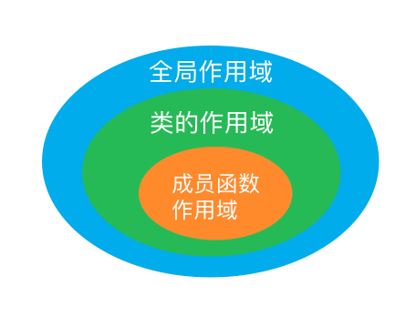

# 7.类

## 7.1定义抽象数据类型

类的基本思想是数据抽象（接口与实现分离）和封裝（把实现藏起来）

### 设计 Sales_data 类


设计Sales_data类

1. 一个isbn成员函数，用于返回对象的ISBN编号
2. 一个combine成员函数，用户一个Sales_data对象加到另一个对象上
3. 一个名为add的函数，指向两个Sales_data对象的加法
4. 一个read函数，将数据从istream读入到Sales_data对象中
5. 一个print函数，将Sales_data对象的值输出到ostream

> 类的用户，即类的使用者，也是开发人员，包括类的开发人员本人。
>
> 但设计类的接口时，需要假设类的用户对类的细节并不知情。


* 成员函数的声明必须在类的内部，定义可以在类内部也可以在类外部
* 常量成员函数：类的成员函数后面加 const，表明这个函数不会修改这个类对象的数据成员


- 常量指针:const int *PtrConst; ---pci
- 指针常量 int *const ConstPtr=&a;/必明初始化---cpi
- 常量指针和指针常量参考【2.变量和基本类型】


```cpp
#ifndef SALESITEM_H
// we're here only if SALESITEM_H has not yet been defined 
#define SALESITEM_H

// Definition of Sales_item class and related functions goes here
#include <iostream>
#include <string>

class Sales_item {
// these declarations are explained section 7.2.1, p. 270 
// and in chapter 14, pages 557, 558, 561
friend std::istream& operator>>(std::istream&, Sales_item&);
friend std::ostream& operator<<(std::ostream&, const Sales_item&);
friend bool operator<(const Sales_item&, const Sales_item&);
friend bool 
operator==(const Sales_item&, const Sales_item&);
public:
    // constructors are explained in section 7.1.4, pages 262 - 265
    // default constructor needed to initialize members of built-in type
    Sales_item() = default;
    Sales_item(const std::string &book): bookNo(book) { }
    Sales_item(std::istream &is) { is >> *this; }
public:
    // operations on Sales_item objects
    // member binary operator: left-hand operand bound to implicit this pointer
    Sales_item& operator+=(const Sales_item&);
    
    // operations on Sales_item objects
    std::string isbn() const { return bookNo; }
    double avg_price() const;
// private members as before
private:
    std::string bookNo;      // implicitly initialized to the empty string
    unsigned units_sold = 0; // explicitly initialized
    double revenue = 0.0;
};

// used in chapter 10
inline
bool compareIsbn(const Sales_item &lhs, const Sales_item &rhs) 
{ return lhs.isbn() == rhs.isbn(); }

// nonmember binary operator: must declare a parameter for each operand
Sales_item operator+(const Sales_item&, const Sales_item&);

inline bool 
operator==(const Sales_item &lhs, const Sales_item &rhs)
{
    // must be made a friend of Sales_item
    return lhs.units_sold == rhs.units_sold &&
           lhs.revenue == rhs.revenue &&
           lhs.isbn() == rhs.isbn();
}

inline bool 
operator!=(const Sales_item &lhs, const Sales_item &rhs)
{
    return !(lhs == rhs); // != defined in terms of operator==
}

// assumes that both objects refer to the same ISBN
Sales_item& Sales_item::operator+=(const Sales_item& rhs) 
{
    units_sold += rhs.units_sold; 
    revenue += rhs.revenue; 
    return *this;
}

// assumes that both objects refer to the same ISBN
Sales_item 
operator+(const Sales_item& lhs, const Sales_item& rhs) 
{
    Sales_item ret(lhs);  // copy (|lhs|) into a local object that we'll return
    ret += rhs;           // add in the contents of (|rhs|) 
    return ret;           // return (|ret|) by value
}

std::istream& 
operator>>(std::istream& in, Sales_item& s)
{
    double price;
    in >> s.bookNo >> s.units_sold >> price;
    // check that the inputs succeeded
    if (in)
        s.revenue = s.units_sold * price;
    else 
        s = Sales_item();  // input failed: reset object to default state
    return in;
}

std::ostream& 
operator<<(std::ostream& out, const Sales_item& s)
{
    out << s.isbn() << " " << s.units_sold << " "
        << s.revenue << " " << s.avg_price();
    return out;
}

double Sales_item::avg_price() const
{
    if (units_sold) 
        return revenue/units_sold; 
    else 
        return 0;
}
#endif
```


### 定义改进的 Sales_data 类


类作用域和成员函数

* 成员体可以随意使用类中的其他成员而无需在意这些成员出现的次序。

> 编译器分两步处理类：首先编译成员的声明，然后才轮到成员函数体。


### 定义类相关的非成员函数

* 如果非成员函数是类接口的组成部分，则应该与类在同一个头文件中声明

### 构造函数

- 构造函数与类名同名，没有返回值，它的任务是初始化类对象的数据成员
- 类可以包括多个构造函数，和重载函数差不多
- 构造函数不能被声明为const的
  - 直到构造函数完成初始化，对象才能真正得到“常量”属性。

* 只有当类没有声明任何构造函数，并且所有类类型的成员都有默认构造函数是，编译器才会自动地生成默认构造函数。

### 拷贝、赋值和析构

- 如果没有定义，编译器将会提供合成的默认版本

> 管理动态内存的类通常不能依赖于编译器合成的版本。使用vector或string除外！

## 7.2 访问控制与封裝

使用访问说明符加强类的封装性

- public：类的接口，在整个程序内可以被访问。
- private：封装（即隐藏）类的实现细节。

> class和struct定义类唯一的区别就是默认的访问权限不同。

### 友元

友元：允许其他类或函数访问自己的非公有成员

关键词：friend

## 7.3 类的其他特性

### 类成员再探


### 返回*this的成员函数


### 类类型


### 友元再探


## 7.4 类的作用域

#### 名字查找与类的作用域

一个类就是一个作用域



## 7.5 构造函数再探


### 构造函数初始值列表

构造函数初始值列表中的顺序，不会影响实际的初始化顺序

### 委托构造函数

### 默认构造函数的作用

一个构造函数为所有参数都提供了默认实参，也就定义了默认构造函数

### 隐式的类类型转换

### 聚合类

> 如果成员是const、引用、或者属于某种未提供默认构造函数的类类型，必须通过构造函数初始列表提供初始值

## 7.6 类的静态成员
