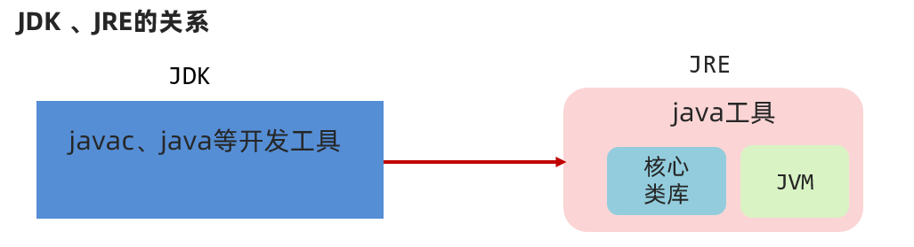
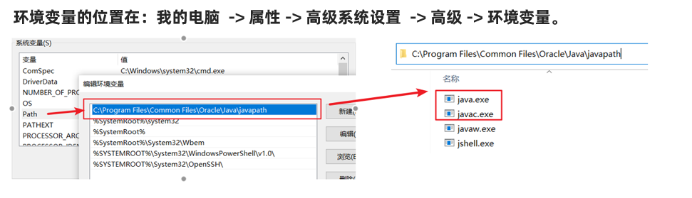

# day01 - java基础语法

test

## 1. Java概述

### 1.1 Java语言发展史（了解）

语言：人与人交流沟通的表达方式

计算机语言：人与计算机之间进行信息交流沟通的一种特殊语言

Java语言是美国Sun公司（Stanford University Network）在1995年推出的计算机语言

Java之父：詹姆斯·高斯林（James Gosling）

2009年，Sun公司被甲骨文公司收购，所以我们现在访问oracle官网即可：[https://www.oracle.com](https://www.oracle.com/) 

当前，我们课程使用的JDK版本：11.0

### 1.2 Java语言跨平台原理（理解）

Java程序并非是直接运行的，Java编译器将Java源程序编译成与平台无关的字节码文件(class文件)，然后由Java虚拟机（JVM）对字节码文件解释执行。所以在不同的操作系统下，只需安装不同的Java虚拟机即可实现java程序的跨平台。


### 1.3 JRE和JDK（记忆）



JVM（Java Virtual Machine），Java虚拟机

JRE（Java Runtime Environment），Java运行环境，包含了JVM和Java的核心类库（Java API）

JDK（Java Development Kit）称为Java开发工具，包含了JRE和开发工具

总结：我们只需安装JDK即可，它包含了java的运行环境和虚拟机。


### 1.4 JDK的下载和安装（应用）

#### 1.4.1 下载

通过官方网站获取JDK

[http://www.oracle.com](http://www.oracle.com/)

**注意**：针对不同的操作系统，需要下载对应版本的JDK。

具体下载步骤请参见《JDK下载及安装说明文档》

#### 1.4.2 安装

傻瓜式安装，下一步即可。但默认的安装路径是在C:\Program Files下，为方便统一管理建议修改安装路径，将与开发相关的软件都安装到一个目录下，例如：E:\develop。

**注意**：安装路径不要包含中文或者空格等特殊字符（使用纯英文目录）。

具体安装步骤请参见《JDK下载及安装说明文档》

#### 1.4.3 JDK的安装目录介绍

| 目录名称 | 说明                                                         |
| -------- | ------------------------------------------------------------ |
| bin      | 该路径下存放了JDK的各种工具命令。javac和java就放在这个目录。 |
| conf     | 该路径下存放了JDK的相关配置文件。                            |
| include  | 该路径下存放了一些平台特定的头文件。                         |
| jmods    | 该路径下存放了JDK的各种模块。                                |
| legal    | 该路径下存放了JDK各模块的授权文档。                          |
| lib      | 该路径下存放了JDK工具的一些补充JAR包。                       |


## 2. 入门程序HelloWorld

### 2.1 常用DOS命令（应用）

在接触集成开发环境之前，我们需要使用命令行窗口对java程序进行编译和运行，所以需要知道一些常用DOS命令。

1、打开命令行窗口的方式：win + r打开运行窗口，输入cmd，回车。

2、常用命令及其作用

| 操作               | 说明                              |
| ------------------ | --------------------------------- |
| 盘符名称:          | 盘符切换。E:回车，表示切换到E盘。 |
| dir                | 查看当前路径下的内容。            |
| cd 目录            | 进入单级目录。cd itheima          |
| cd ..              | 回退到上一级目录。                |
| cd 目录1\目录2\... | 进入多级目录。cd itheima\JavaSE   |
| cd \               | 回退到盘符目录。                  |
| cls                | 清屏。                            |
| exit               | 退出命令提示符窗口。              |

### 2.2 Path环境变量的配置（应用）

#### 2.2.1 为什么配置环境变量

开发Java程序，需要使用JDK提供的开发工具（比如javac.exe、java.exe等命令），而这些工具在JDK的安装目录的bin目录下，如果不配置环境变量，那么这些命令只可以在该目录下执行。我们不可能把所有的java文件都放到JDK的bin目录下，所以配置环境变量的作用就是可以使bin目录下的java相关命令可以在任意目录下使用。

注意：目前较新的JDK安装时会自动配置javac、java命令的路径到Path环境变量中去 ，所以javac、java可以直接使用。




但是以前下载的老版本的JDK是没有自动配置的，此时必需要自己配置Path环境变量。

①**JAVA_HOME**：告诉操作系统JDK安装在了哪个位置（未来其他技术要通过这个找JDK）


②**Path**：告诉操作系统JDK提供的javac(编译)、java(执行)命令安装到了哪个位置


**注意：新版本的JDK只是自动配置了Path，没有自动配置JAVA_HOME。**

### 2.3 HelloWorld案例（应用）

HelloWorld案例是指在计算机屏幕上输出“HelloWorld”这行文字。各种计算机语言都习惯使用该案例作为第一个演示案例。

#### 2.3.1 Java程序开发运行流程

开发Java程序，需要三个步骤：编写程序，编译程序，运行程序。

#### 2.3.2 HelloWorld案例的编写

1、新建文本文档文件，修改名称为HelloWorld.java。

2、用记事本打开HelloWorld.java文件，输写程序内容。

~~~java
public class HelloWorld {
	public static void main(String[] args) {
		System.out.println("HelloWorld");
	}
}
~~~

#### 2.3.3 HelloWorld案例的编译和运行

存文件，打开命令行窗口，将目录切换至java文件所在目录，编译java文件生成class文件，运行class文件。

> 编译：javac 文件名.java
>
> 范例：javac HelloWorld.java
>
> 执行：java 类名
>
> 范例：java HelloWorld

### 2.4 HelloWorld案例常见问题（理解）

#### 2.4.1 BUG

在电脑系统或程序中，隐藏着的一些未被发现的缺陷或问题统称为bug（漏洞）。

#### 2.4.2 BUG的解决

1、具备识别BUG的能力：多看

2、具备分析BUG的能力：多思考，多查资料

3、具备解决BUG的能力：多尝试，多总结

#### 2.4.3 HelloWorld案例常见问题

1、非法字符问题。Java中的符号都是英文格式的。

2、大小写问题。Java语言对大小写敏感（区分大小写）。

3、在系统中显示文件的扩展名，避免出现HelloWorld.java.txt文件。

4、编译命令后的java文件名需要带文件后缀.java

5、运行命令后的class文件名（类名）不带文件后缀.class

...


## 3、IDEA安装使用

参见**“IDEA安装详解.pdf”**



## 4. java基础语法

#### 4.1 注释

注释是对代码的解释和说明文字，可以提高程序的可读性，因此在程序中添加必要的注释文字十分重要。Java中的注释分为三种：

单行注释。单行注释的格式是使用//，从//开始至本行结尾的文字将作为注释文字。

~~~java
// 这是单行注释文字
~~~

多行注释。多行注释的格式是使用/* 和 */将一段较长的注释括起来。

~~~java
/*
这是多行注释文字
这是多行注释文字
这是多行注释文字
*/
注意：多行注释不能嵌套使用。
~~~

文档注释。文档注释以`/**`开始，以`*/`结束。


#### 4.2 字面量（应用）

作用：告诉程序员，数据在程序中的书写格式。

| **字面量类型** | **说明**                                  | **程序中的写法**           |
| -------------- | ----------------------------------------- | -------------------------- |
| 整数           | 不带小数的数字                            | 666，-88                   |
| 小数           | 带小数的数字                              | 13.14，-5.21               |
| 字符           | 必须使用单引号，有且仅能一个字符          | ‘A’，‘0’，   ‘我’          |
| 字符串         | 必须使用双引号，内容可有可无              | “HelloWorld”，“黑马程序员” |
| 布尔值         | 布尔值，表示真假，只有两个值：true，false | true 、false               |
| 空值           | 一个特殊的值，空值                        | 值是：null                 |

~~~java
public class Demo {
    public static void main(String[] args) {
        System.out.println(10); // 输出一个整数
        System.out.println(5.5); // 输出一个小数
        System.out.println('a'); // 输出一个字符
        System.out.println(true); // 输出boolean值true
        System.out.println("靓仔"); // 输出字符串
    }
}
~~~


#### 4.3 数据类型（记忆、应用）

##### 3.4.1 计算机存储单元

l计算机底层都是一些数字电路(理解成开关)，用开表示0、关表示1，这些01的形式就是二进制。

数据在计算机底层都是采用二进制存储的，l在计算机中认为一个开关表示的0|1称为1位（b），每8位称为一个字节（B）， 所以1B=8b

字节是计算机中数据的最小单位。

我们知道计算机是可以用来存储数据的，但是无论是内存还是硬盘，计算机存储设备的最小信息单元叫“位（bit）”，我们又称之为“比特位”，通常用小写的字母”b”表示。而计算机中最基本的存储单元叫“字节（byte）”，

通常用大写字母”B”表示，字节是由连续的8个位组成。

除了字节外还有一些常用的存储单位，其换算单位如下：

1B（字节） = 8bit

1KB = 1024B

1MB = 1024KB

1GB = 1024MB

1TB = 1024GB

##### 3.4.2 Java中的数据类型

Java是一个强类型语言，Java中的数据必须明确数据类型。在Java中的数据类型包括基本数据类型和引用数据类型两种。

Java中的基本数据类型：

| 数据类型 | 关键字  | 内存占用 |                 取值范围                  |
| :------: | :-----: | :------: | :---------------------------------------: |
|   整数   |  byte   |    1     |    负的2的7次方 ~ 2的7次方-1(-128~127)    |
|          |  short  |    2     | 负的2的15次方 ~ 2的15次方-1(-32768~32767) |
|          |   int   |    4     |        负的2的31次方 ~ 2的31次方-1        |
|          |  long   |    8     |        负的2的63次方 ~ 2的63次方-1        |
|  浮点数  |  float  |    4     |        1.401298e-45 ~ 3.402823e+38        |
|          | double  |    8     |      4.9000000e-324 ~ 1.797693e+308       |
|   字符   |  char   |    2     |                  0-65535                  |
|   布尔   | boolean |    1     |                true，false                |

说明：

​	为什么是 2^7-1？ 这8位分为符号位（最高位）和数值位（剩余七位），符号位0表示正数，1表示负数。所以1 byte数值表示负的2的7次方 ~ 2的7次方-1(-128~127)

​	e+38表示是乘以10的38次方，同样，e-45表示乘以10的负45次方。

​	在java中整数默认是int类型，浮点数默认是double类型。

#### 4.4 变量（应用）

##### 3.5.1 变量的定义

变量：在程序运行过程中，其值可以发生改变的量。

从本质上讲，变量是内存中的一小块区域，其值可以在一定范围内变化。

变量的定义格式：

```java
数据类型 变量名 = 初始化值; // 声明变量并赋值
int age = 18;
System.out.println(age);
```

或者

```java
// 先声明，后赋值（使用前赋值即可）
数据类型 变量名;
变量名 = 初始化值;
double money;
money = 55.5;
System.out.println(money);
```

还可以在同一行定义多个同一种数据类型的变量，中间使用逗号隔开。但不建议使用这种方式，降低程序的可读性。

```java
int a = 10, b = 20; // 定义int类型的变量a和b，中间使用逗号隔开
System.out.println(a);
System.out.println(b);

int c,d; // 声明int类型的变量c和d，中间使用逗号隔开
c = 30;
d = 40;
System.out.println(c);
System.out.println(d);
```

变量的使用：通过变量名访问即可。

##### 3.5.2 使用变量时的注意事项

1. 在同一对花括号中，变量名不能重复。
2. 变量在使用之前，必须初始化（赋值）。
3. 定义long类型的变量时，需要在整数的后面加L（大小写均可，建议大写）。因为整数默认是int类型，整数太大可能超出int范围。
4. 定义float类型的变量时，需要在小数的后面加F（大小写均可，建议大写）。因为浮点数的默认类型是double， double的取值范围是大于float的，类型不兼容。

#### 4.5 关键字、标志符

**关键字**

Java自己保留的一些单词，作为特殊功能的，例如：public、class、byte、short、int、long、double… 

我们不能用来作为类名或者是变量名称，否则报错。

注意：关键字很多，不用刻意去记。

| **abstract**   | **assert**       | **boolean**   | **break**      | **byte**   |
| -------------- | ---------------- | ------------- | -------------- | ---------- |
| **case**       | **catch**        | **char**      | **class**      | **const**  |
| **continue**   | **default**      | **do**        | **double**     | **else**   |
| **enum**       | **extends**      | **final**     | **finally**    | **float**  |
| **for**        | **goto**         | **if**        | **implements** | **import** |
| **instanceof** | **int**          | **interface** | **long**       | **native** |
| **new**        | **package**      | **private**   | **protected**  | **public** |
| **return**     | **strictfp**     | **short**     | **static**     | **super**  |
| **switch**     | **synchronized** | **this**      | **throw**      | **throws** |
| **transient**  | **try**          | **void**      | **volatile**   | **while**  |

**标志符**

标志符就是由一些字符、符号组合起来的名称，用于给类，方法，变量等起名字的规矩。

基本要求：由数字、字母、下划线(_)和美元符($)等组成

强制要求：不能以数字开头、不能是关键字、区分大小写

**基本命令规范**


变量名称：满足标识符规则，建议全英文、有意义、首字母小写，满足“驼峰模式”，例如：int studyNumber = 59。

类名称： 满足标识符规则，建议全英文、有意义、首字母大写，满足“驼峰模式”，例如：HelloWorld.java。

