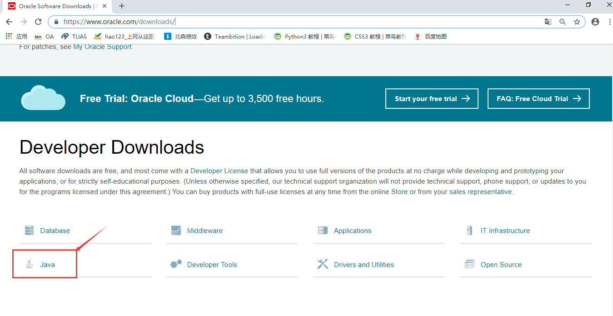
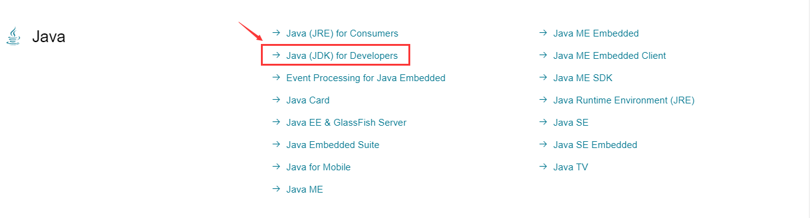
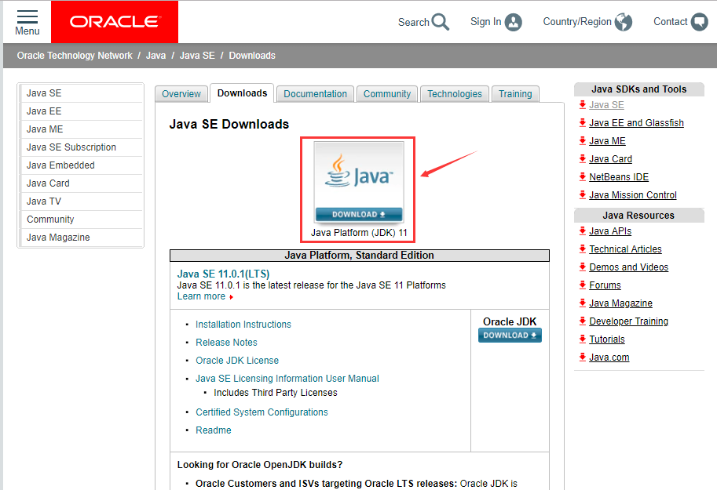
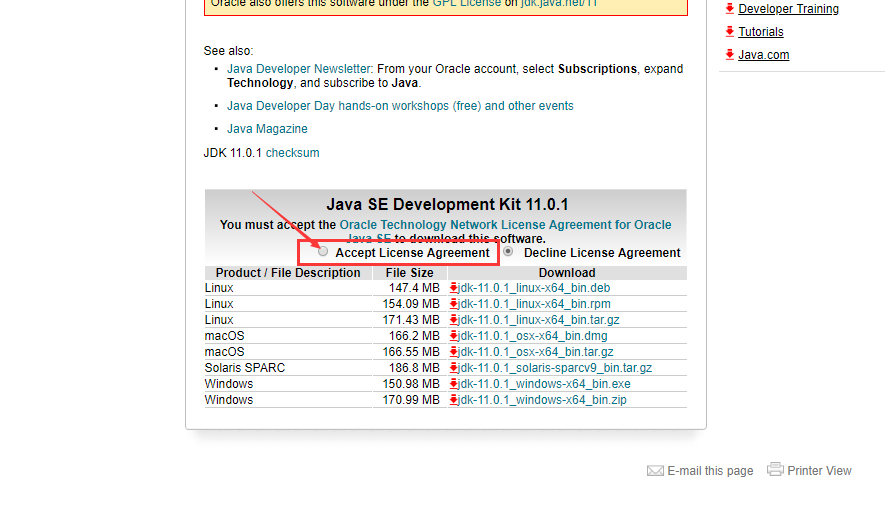
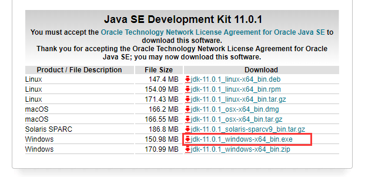
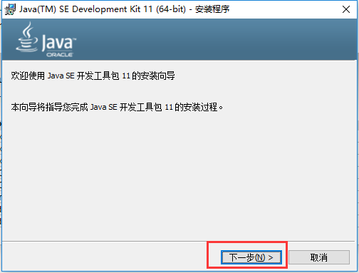
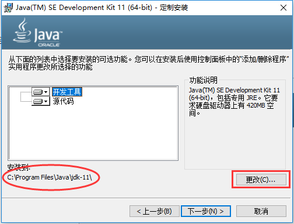
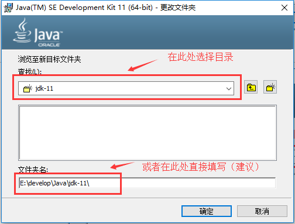
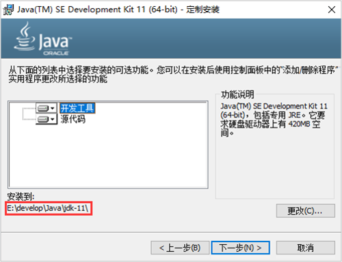
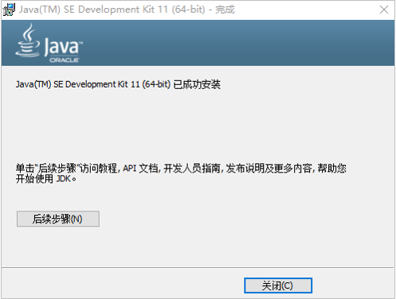

下面以Windows10系统下的JDK下载和安装为例进行说明。

## 1．   JDK下载

访问oracle官网：[http://www.oracle.com](http://www.oracle.com/)

在首页点击Downloads，进入oracle软件下载页。

在下载页面，点击Java。

选择Java (JDK) for Developers，点击。

在 Java SE Downloads 页面，点击中间的DOWNLOAD按钮。

在JDK下载页，首先勾选**Accept License Agreement****，同意****Oracle Java SE****的****Oracle****技术网许可协议。**

最后，根据操作系统选择合适的版本下载，以课程为例，我们选择Windows系统64位版本，exe是安装程序，点击下载即可。

## 2．   JDK安装

Windows版JDK安装，基本是傻瓜式安装，直接下一步即可。但默认的安装路径是在C:\Program Files下，为方便统一管理，最好修改下安装路径，将与开发相关的软件都安装到一个文件夹下，例如E:\develop。注意，安装路径不要包含中文或者空格等特殊字符（使用纯英文目录）。

首先双击打开安装程序，点击下一步。

默认安装目录为C盘，点击更改，修改安装路径。

将目录更改至E:\develop，要注意不要修改后面的Java\jdk-11\目录结构。点击确定，进入下一步。

点击下一步，开始安装。

看到安装成功界面，点击关闭，完成安装。

