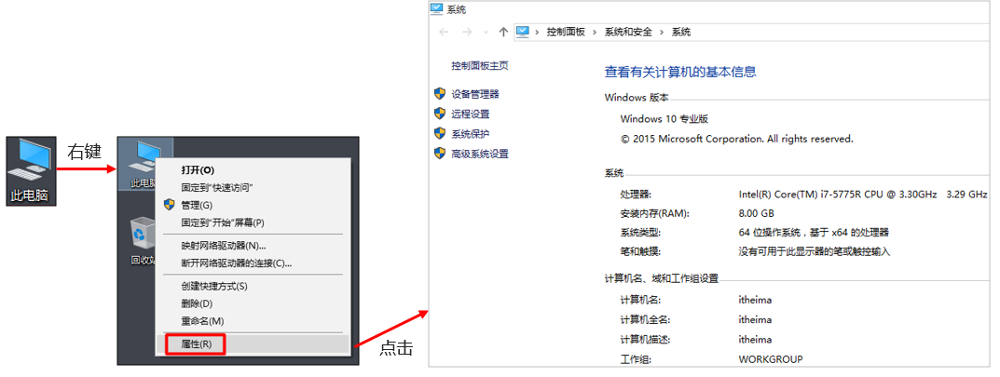
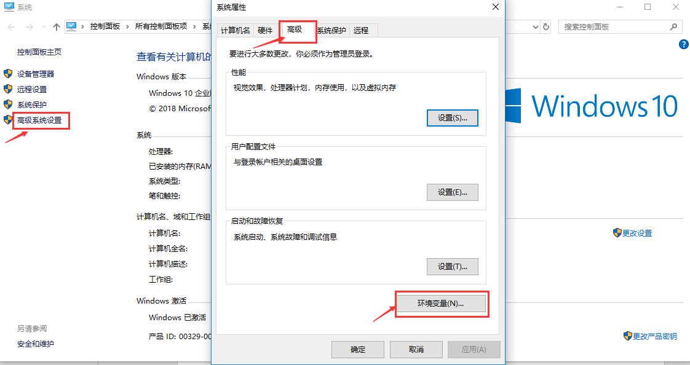
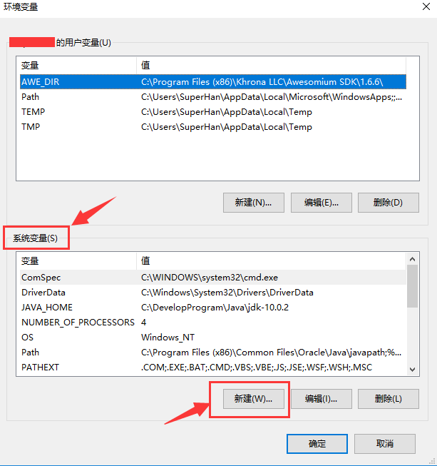
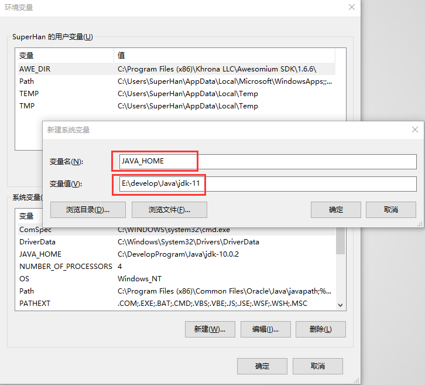
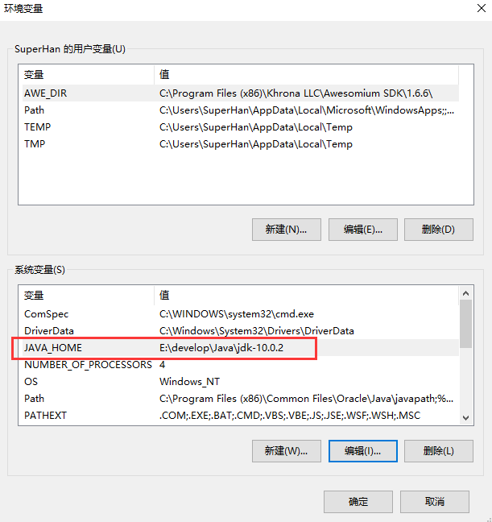
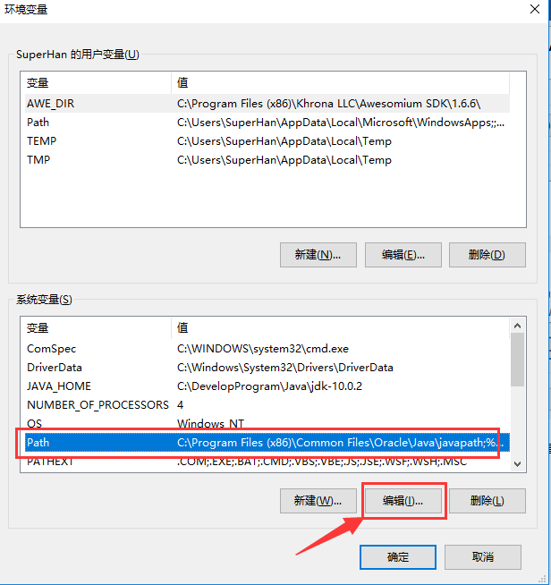
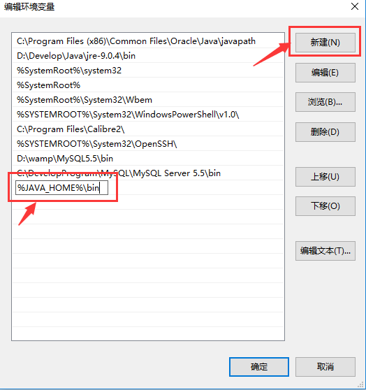
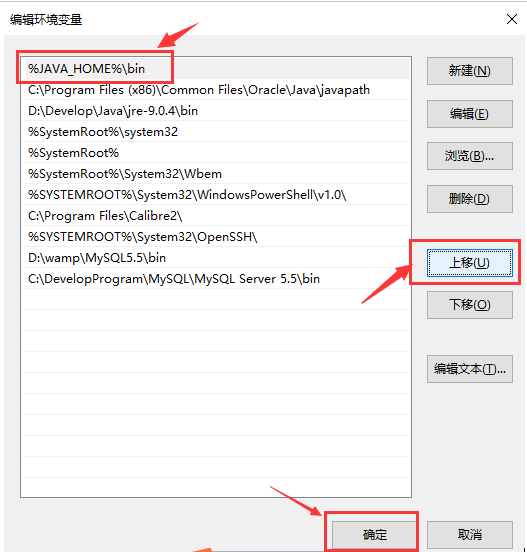
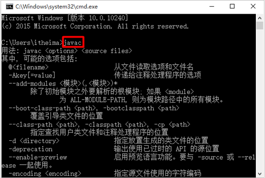

下面以Windows10系统下的Java环境变量配置为例进行说明。

1、 右键点击“此电脑”，选择“属性”项。

2、 点击“高级系统设置”，在弹出的系统属性框中，选择“高级”选项卡（默认即显示该选项卡），点击“环境变量”。

3、 在弹出的“环境变量”框，中选择下方的系统变量，点击新建。

4、 在弹出的“新建系统变量”框中，输入变量名和变量值，点击确定。

变量名为：JAVA_HOME

变量值为JDK的安装路径，到bin目录的上一层即可。比如E:\develop\Java\jdk-11

注意：为防止路径输入错误，可以打开文件夹，拷贝路径。

点击确定后，系统变量中会出现一条新的记录。

5、 然后选中“系统变量”中的“Path”变量，点击“编辑”按钮，将刚才创建的JAVA_HOME变量添加到“Path”变量中。

在弹出的“编辑系统变量”框中，点击“新建”，输入%JAVA_HOME%\bin。

输入完毕，点击“上移”按钮，将该值移动到第一行。点击确定。

6、 至此，java环境变量配置完毕，打开命令行窗口，验证配置是否成功。

如果之前已经打开命令行窗口，需要关闭重新启动才可。在非JDK安装的bin目录下，输入java或者javac命令，查看效果。

