# ATM系统开发前说明

## 项目演示环节

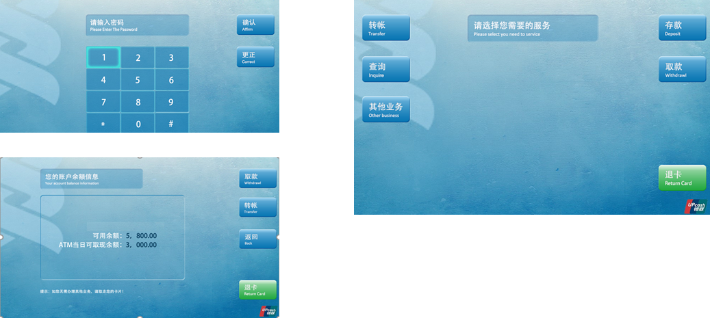

建议读者先把项目代码执行起来，玩一下每个功能，再观看本文档，这样思路会非常清晰

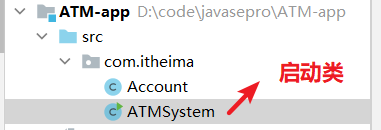


## 项目技术选型

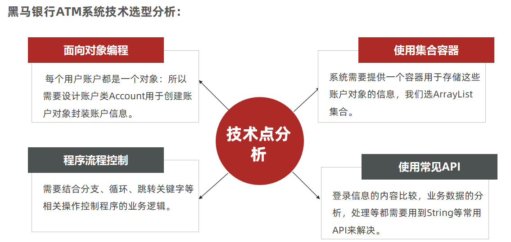


## 项目收获

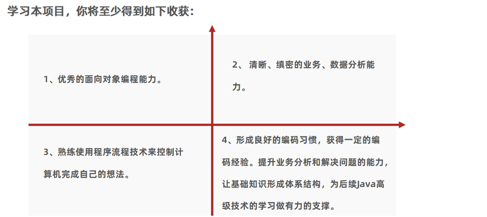

# ATM系统功能实战

## 系统准备、首页设计

**系统准备内容分析：**

①每个用户的账户信息都是一个对象，需要提供账户类。

②需要准备一个容器，用于存储系统全部账户对象信息。

③首页只需要包含：登录和注册2个功能。

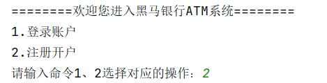

**实现步骤：**

①定义账户类，用于后期创建账户对象封装用户的账户信息。

②账户类中的信息至少需要包含（卡号、姓名、密码、余额、取现额度）

③需要准备一个ArrayList的集合，用于存储系统用户的账户对象。

④定义一个系统启动类ATMSystem需要展示欢迎页包含2个功能：开户功能、登录账户。

```java
public class Account {
    private String cardId;  // 卡号
    private String userName;  // 客户名称
    private String passWord;  // 密码
    private double money;  // 余额
    private double quotaMoney;  // 当次取现限额

    public Account() {
    }

    public Account(String cardId, String userName, String passWord, double quotaMoney) {
        this.cardId = cardId;
        this.userName = userName;
        this.passWord = passWord;
        this.quotaMoney = quotaMoney;
    }

    public String getCardId() {
        return cardId;
    }

    public void setCardId(String cardId) {
        this.cardId = cardId;
    }

    public String getUserName() {
        return userName;
    }

    public void setUserName(String userName) {
        this.userName = userName;
    }

    public String getPassWord() {
        return passWord;
    }

    public void setPassWord(String passWord) {
        this.passWord = passWord;
    }

    public double getMoney() {
        return money;
    }

    public void setMoney(double money) {
        this.money = money;
    }

    public double getQuotaMoney() {
        return quotaMoney;
    }

    public void setQuotaMoney(double quotaMoney) {
        this.quotaMoney = quotaMoney;
    }
}
```

```java
public class ATMSystem {
    public static void main(String[] args) {
        // 1、准备系统需要的容器对象，用于存储账户对象
        ArrayList<Account> accounts = new ArrayList<>();

        // 2、准备系统的首页：登录 开户
        showMain(accounts);
    }

    public static void showMain(ArrayList<Account> accounts) {
        System.out.println("=============欢迎进入首页=================");
        Scanner sc = new Scanner(System.in);
        while (true) {
            System.out.println("请您输入您想做的操作：");
            System.out.println("1、登录");
            System.out.println("2、开户");
            System.out.print("您可以输入命令了：");
            int command = sc.nextInt();
            switch (command) {
                case 1:
                    // 登录
                    login(accounts, sc);
                    break;
                case 2:
                    // 开户
                    register(accounts, sc);
                    break;
                default:
                    System.out.println("您当前输入的操作命令不被支持！");
            }
        }
    }
}
```


## 用户开户功能实现

l开户功能其实就是就是往系统的集合容器中存入一个新的账户对象的信息。

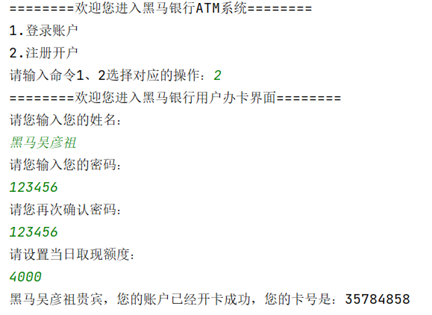

**开户功能实现步骤**

①定义方法完成开户：

②键盘录入姓名、密码、确认密码（需保证两次密码一致）

③生成账户卡号，卡号必须由系统自动生成8位数字（必须保证卡号的唯一）

④创建Account账户类对象用于封装账户信息（姓名、密码、卡号）

⑤把Account账户类对象存入到集合accounts中去。

```java
/**
 * 用户开户功能
 * @param accounts 账户的集合对象
 */
private static void register(ArrayList<Account> accounts, Scanner sc) {
    System.out.println("===============用户开户功能==============");
    // 2、键盘录入 姓名 密码 确认密码
    System.out.println("请您输入开户名称：");
    String name = sc.next();

    String password = "";
    while (true) {
        System.out.println("请您输入开户密码：");
        password = sc.next();

        System.out.println("请您输入确认密码：");
        String okPassword = sc.next();
        // 判断两次输入的密码是否一致
        if(okPassword.equals(password)){
            break;
        }else {
            System.out.println("两次密码必须一致~~~");
        }
    }

    System.out.println("请您输入当次限额：");
    double quotaMoney = sc.nextDouble();

    // 3、生成账户的卡号，卡号是8位，而且不能与其他账户卡号重复。
    String cardId = createCardId(accounts);

    // 4、创建一个账户对象封装账户的信息
    //   public Account(String cardId, String userName, String passWord, double money, double quotaMoney)
    Account account = new Account(cardId, name, password,quotaMoney);

    // 5、把账户对象添加到集合中去
    accounts.add(account);
    System.out.println("恭喜您，您开户成功，您的卡号是：" + account.getCardId() +"。请您妥善保管");
}

public static String createCardId(ArrayList<Account> accounts){
    while (true) {
        // 生成8位随机的数字代表卡号
        String cardId = "";
        Random r = new Random();
        for (int i = 0; i < 8; i++) {
            cardId += r.nextInt(10);
        }

        // 判断卡号是否重复了
        Account acc = getAccountByCardId(cardId, accounts);
        if(acc == null){
            // 说明当前卡号没有重复
            return cardId;
        }
    }
}

public static Account getAccountByCardId(String cardId , ArrayList<Account> accounts){
    // 根据卡号查询账户对象
    for (int i = 0; i < accounts.size(); i++) {
        Account acc = accounts.get(i);
        if(acc.getCardId().equals(cardId)){
            return acc;
        }
    }
    return null; // 查无此账户，说明卡号没有重复了！
}
```

## 用户登录功能实现

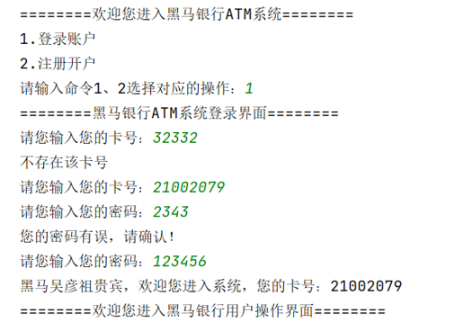

**分析**

①定义方法：

②让用户键盘录入卡号，根据卡号查询账户对象。

③如果没有找到了账户对象，说明卡号不存在，提示继续输入卡号。

④如果找到了账户对象，说明卡号存在，继续输入密码。

⑤如果密码不正确，提示继续输入密码

⑥如果密码正确，提示登陆成功！！

```java
/**
 * 完成用户登录
 * @param accounts
 */
private static void login(ArrayList<Account> accounts, Scanner sc) {
    // 必须系统中存在账户才可以登录
    if(accounts.size() == 0){
        // 没有任何账户
        System.out.println("当前系统中无任何账户，您需要先注册！");
        return; // 直接结束方法的执行！
    }

    // 2、让用户键盘录入卡号，
    while (true) {
        System.out.println("请您输入登录的卡号：");
        String cardId = sc.next();
        // 根据卡号查询账户对象。
        Account acc = getAccountByCardId(cardId , accounts);

        // 3、判断账户对象是否存在，存在说明卡号没问题
        if(acc != null){
            while (true) {
                // 4、让用户继续输入密码
                System.out.println("请您输入登录的密码：");
                String password = sc.next();
                // 5、判断密码是否正确
                if(acc.getPassWord().equals(password)){
                    // 密码正确，登录成功
                    // 展示系统登录后的操作界面（下节课继续完成的功能！！）
                    System.out.println("恭喜您，" + acc.getUserName() +"先生/女士成功进入系统，您的卡号是：" + acc.getCardId());
                    // 展示操作页面
                    showUserCommand(sc, acc , accounts);
                    return; // 继续结束登录方法
                }else {
                    System.out.println("您的密码有误，请确认！");
                }
            }
        }else {
            System.out.println("对不起，不存在该卡号的账户！");
        }
    }
}
```

## 用户操作页设计、查询账户、退出账户功能实现


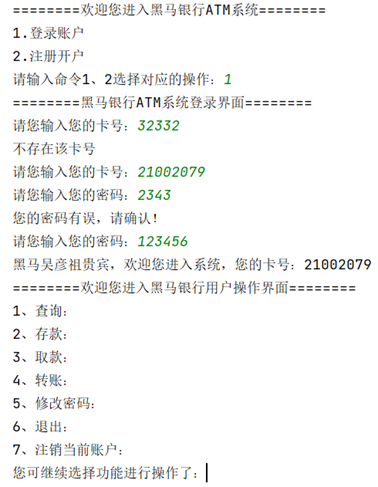

①用户登录成功后，需要进入用户操作页，退出账户是需要回到首页的。

```java
private static void showUserCommand(Scanner sc, Account acc , ArrayList<Account> accounts) {
    while (true) {
        System.out.println("==================用户操作界面===================");
        System.out.println("1、查询账户");
        System.out.println("2、存款");
        System.out.println("3、取款");
        System.out.println("4、转账");
        System.out.println("5、修改密码");
        System.out.println("6、退出");
        System.out.println("7、注销账户");
        System.out.println("请您输入操作命令：");
        int command = sc.nextInt();
        switch (command) {
                case 1:
                    // 查询账户
                    showAccount(acc);
                    break;
                case 2:
                    // 存款
                    depositMoney(acc, sc);
                    break;
                case 3:
                    // 取款
                    drawMoney(acc,sc);
                    break;
                case 4:
                    // 转账
                    transferMoney(accounts, acc , sc);
                    break;
                case 5:
                    // 修改密码
                    updatePassWord(acc,sc);
                    return; // 结束当前操作的方法
                case 6:
                    // 退出
                    System.out.println("欢迎下次光临！！");
                    return; // 结束当前操作的方法！
                case 7:
                    // 注销账户
                    // 从当前集合中抹掉当前账户对象即可
                    accounts.remove(acc);
                    System.out.println("销户成功了！！");
                    return;// 结束当前操作的方法！
                default:
                    System.out.println("您的命令输入有误~~~");
            }
    }
}
```

②查询就是直接展示当前登录成功的账户对象的信息。

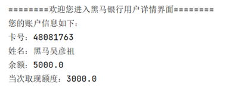

```java
private static void showAccount(Account acc) {
    System.out.println("==================当前账户详情===================");
    System.out.println("卡号：" + acc.getCardId());
    System.out.println("姓名：" + acc.getUserName());
    System.out.println("余额：" + acc.getMoney());
    System.out.println("当次限额：" + acc.getQuotaMoney());
}
```

## 用户存款功能实现

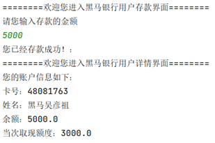

①存款就是拿到当前账户对象。

②然后让用户输入存款的金额。

③调用账户对象的setMoney方法将账户余额修改成存钱后的余额。

④存钱后需要查询一下账户信息，确认是否存钱成功了！

```java
/**
   存钱的
 * @param acc
 */
private static void depositMoney(Account acc, Scanner sc) {
    System.out.println("==================存钱操作===================");
    System.out.println("请您输入存款的金额：");
    double money = sc.nextDouble();

    // 直接把金额修改到账户对象的money属性中去
    acc.setMoney(acc.getMoney() + money);
    System.out.println("存款完成！！");
    showAccount(acc);
}
```

## 用户取款功能实现

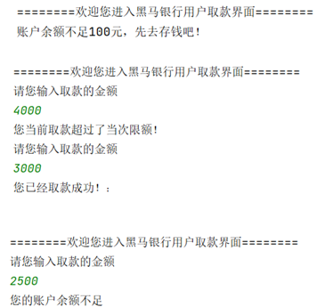

**取款分析**

①取款需要先判断账户是否有钱。

②有钱则拿到自己账户对象。

③然后让用户输入取款金额

④判断取款金额是否超过了当次限额，以及余额是否足够

⑤满足要求则调用账户对象的setMoney方法完成金额的修改。

```java
/**
   取款
 * @param acc
 * @param sc
 */
private static void drawMoney(Account acc, Scanner sc) {
    System.out.println("==================取款操作===================");
    // 1、判断它的账户是否足够100元
    if(acc.getMoney() >= 100){
        while (true) {
            System.out.println("请您输入取款的金额：");
            double money = sc.nextDouble();
            // 2、判断这个金额有没有超过当次限额
            if(money > acc.getQuotaMoney()){
                System.out.println("您当次取款金额超过每次限额，不要取那么多，每次最多可以取：" + acc.getQuotaMoney());
            }else {
                // 3、判断当前余额是否足够你取钱
                if(acc.getMoney() >= money){
                    // 够钱，可以取钱了
                    acc.setMoney(acc.getMoney() - money);
                    System.out.println("恭喜您，取钱" + money + "成功了！当前账户还剩余：" + acc.getMoney());
                    return;// 取钱后干掉取钱方法
                }else {
                    System.out.println("余额不足啊！");
                }
            }
        }
    }else {
        System.out.println("您自己的金额没有超过100元，就别取了~~~");
    }
}
```

## 用户转账功能实现

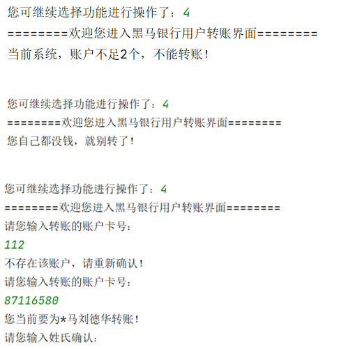

**分析**

①转账功能需要判断系统中是否有2个账户对象及以上。

②同时还要判断自己账户是否有钱。

③接下来需要输入对方卡号，判断对方账户是否存在。

④对方账户存在还需要认证对方户主的姓氏。

⑤满足要求则可以把自己账户对象的金额修改到对方账户对象中去。

```java
/**
  转账功能
 * @param accounts
 * @param acc
 * @param sc
 */
private static void transferMoney(ArrayList<Account> accounts, Account acc, Scanner sc) {
    // 1、判断系统中是否有2个账户及以上
    if(accounts.size() < 2){
        System.out.println("对不起，系统中无其他账户，您不可以转账！");
        return;
    }

    // 2、判断自己的账户对象中是否有钱
    if(acc.getMoney() == 0){
        System.out.println("对不起，您自己都没钱，就别转了~~");
        return;
    }

    // 3、开始转账逻辑
    while (true) {
        System.out.println("请您输入对方账户的卡号：");
        String cardId = sc.next();
        Account account = getAccountByCardId(cardId , accounts);
        // 判断这个账户对象是否存在，存在说明对方卡号输入正确
        if(account != null){
            // 判断这个账户对象是否是当前登录的账户自己
            if(account.getCardId().equals(acc.getCardId())){
                // 正在给自己转账
                System.out.println("您不可以为自己转账！");
            }else {
                // 确认对方的姓氏
                String name = "*" + account.getUserName().substring(1);
                System.out.print("请您确认【" + name + "】的姓氏：");
                String preName = sc.next(); // 王
                // 判断        黑马关之琳
                if(account.getUserName().startsWith(preName)){
                    // 真正开始转账了
                    System.out.println("请您输入转账的金额：");
                    double money = sc.nextDouble();
                    // 判断这个金额是否超过了自己的余额
                    if(money > acc.getMoney() ){
                        System.out.println("对不起，您要转账的金额太多，您最多可以转账多少：" + acc.getMoney());
                    }else {
                        // 真的可以转了
                        acc.setMoney(acc.getMoney() - money);
                        account.setMoney(account.getMoney() + money);
                        System.out.println("恭喜您，转账成功了，已经为" + account.getUserName() +"转账多少：" + money);
                        showAccount(acc);
                        return;
                    }
                }else {
                    System.out.println("对不起，您认证的信息有误~~~");
                }
            }
        }else {
            System.out.println("对不起，您输入的转账卡号有问题！");
        }
    }
}
```

## 用户密码修改、销户功能实现

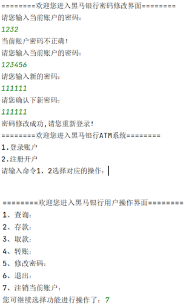

**分析**

①修改密码就是把当前对象的密码属性使用set方法进行更新。

```java
private static void updatePassWord(Account acc, Scanner sc) {
    System.out.println("===========修改密码=======================");
    while (true) {
        System.out.println("请您输入正确的密码：");
        String okPassWord = sc.next();
        // 判断密码是否正确
        if(acc.getPassWord().equals(okPassWord)){
            while (true) {
                // 可以输入新密码
                System.out.println("请您输入新的密码：");
                String newPassWord = sc.next();

                System.out.println("请您输入确认密码：");
                String okNewPassWord = sc.next();

                if(newPassWord.equals(okNewPassWord)) {
                    // 修改账户对象的密码为新密码
                    acc.setPassWord(newPassWord);
                    return; // 直接结束掉！！
                }else {
                    System.out.println("您两次输入的密码不一致~~");
                }
            }

        }else {
            System.out.println("当前输入的密码不正确~~~");
        }
    }

}
```

②销户是从集合对象中删除当前对象，并回到首页。

```java
case 7:
    // 注销账户
    // 从当前集合中抹掉当前账户对象即可
    accounts.remove(acc);
    System.out.println("销户成功了！！");
    return;// 结束当前操作的方法！
```

