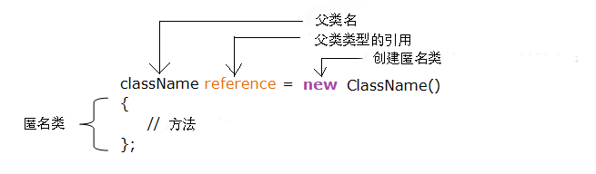

# 1. 什么是内部类

## 1.1 Java 一个类中可以嵌套另外一个类，语法格式如下：

```java
classOuterClass{// 外部类
    // ...
    classNestedClass{// 嵌套类，或称为内部类
        // ...
    }
}
```

要访问内部类，可以通过创建外部类的对象，然后创建内部类的对象来实现。

嵌套类有两种类型：

* 非静态内部类
* 静态内部类

## 1.2 非静态内部类

非静态内部类是一个类中嵌套着另外一个类。 它有访问外部类成员的权限， 通常被称为内部类。

由于内部类嵌套在外部类中，因此必须首先实例化外部类，然后创建内部类的对象来实现

```java
class OuterClass {
  int x = 10;

  class InnerClass {
    int y = 5;
  }
}

public class MyMainClass {
  public static void main(String[] args) {
    OuterClass myOuter = new OuterClass();
    OuterClass.InnerClass myInner = myOuter.new InnerClass();
    System.out.println(myInner.y + myOuter.x);
  }
}
```

## 1.3 私有的内部类

内部类可以使用 private 或 protected 来修饰，如果你不希望内部类被外部类访问可以使用 private 修饰符：

```java
class OuterClass {
  int x = 10;

  private class InnerClass {
    int y = 5;
  }
}

public class MyMainClass {
  public static void main(String[] args) {
    OuterClass myOuter = new OuterClass();
    OuterClass.InnerClass myInner = myOuter.new InnerClass();
    System.out.println(myInner.y + myOuter.x);
  }
}
```

以上实例 InnerClass 设置为私有内部类，执行会报错：

```java
MyMainClass.java:12: error: OuterClass.InnerClass has private access in OuterClass
    OuterClass.InnerClass myInner = myOuter.new InnerClass();
             ^
```

## 1.4 静态内部类

静态内部类可以使用 static 关键字定义，静态内部类我们不需要创建外部类来访问，可以直接访问它：

```java
class OuterClass {
  int x = 10;

  static class InnerClass {
    int y = 5;
  }
}

public class MyMainClass {
  public static void main(String[] args) {
    OuterClass.InnerClass myInner = new OuterClass.InnerClass();
    System.out.println(myInner.y);
  }
}
```

### 注意

静态内部类无法访问外部类的成员。

## 1.5 从内部类访问外部类成员

内部类一个高级的用法就是可以访问外部类的属性和方法：

```java
class OuterClass {
  int x = 10;

  class InnerClass {
    public int myInnerMethod() {
      return x;
    }
  }
}

public class MyMainClass {
  public static void main(String[] args) {
    OuterClass myOuter = new OuterClass();
    OuterClass.InnerClass myInner = myOuter.new InnerClass();
    System.out.println(myInner.myInnerMethod());
  }
}
```

# 2. 匿名类

## 2.1 什么是匿名类

Java 中可以实现一个类中包含另外一个类，且不需要提供任何的类名直接实例化。

主要是用于在我们需要的时候创建一个对象来执行特定的任务，可以使代码更加简洁。

匿名类是不能有名字的类，它们不能被引用，只能在创建时用 **new** 语句来声明它们。

匿名类语法格式：

```java
class outerClass {

    // 定义一个匿名类
    object1 = new Type(parameterList) {
         // 匿名类代码
    };
}
```

以上的代码创建了一个匿名类对象 object1，匿名类是表达式形式定义的，所以末尾以分号 **;** 来结束。

匿名类通常继承一个父类或实现一个接口。



## 2.2 匿名类继承一个父类

以下实例中，创建了 Polygon 类，该类只有一个方法 display()，AnonymousDemo 类继承了 Polygon 类并重写了 Polygon 类的 display() 方法:

```java
class Polygon {
   public void display() {
      System.out.println("在 Polygon 类内部");
   }
}

class AnonymousDemo {
   public void createClass() {

      // 创建的匿名类继承了 Polygon 类
      Polygon p1 = new Polygon() {
         public void display() {
            System.out.println("在匿名类内部。");
         }
      };
      p1.display();
   }
}

class Main {
   public static void main(String[] args) {
       AnonymousDemo an = new AnonymousDemo();
       an.createClass();
   }
}
```


执行以上代码，匿名类的对象 p1 会被创建，该对象会调用匿名类的 display() 方法，输出结果为

```
在匿名类内部。
```


## 2.3 匿名类实现一个接口

以下实例创建的匿名类实现了 Polygon 接口：

```java
interface Polygon {
   public void display();
}

class AnonymousDemo {
   public void createClass() {

      // 匿名类实现一个接口
      Polygon p1 = new Polygon() {
         public void display() {
            System.out.println("在匿名类内部。");
         }
      };
      p1.display();
   }
}

class Main {
   public static void main(String[] args) {
      AnonymousDemo an = new AnonymousDemo();
      an.createClass();
   }
}
```

输出结果为：

```
在匿名类内部。
```
