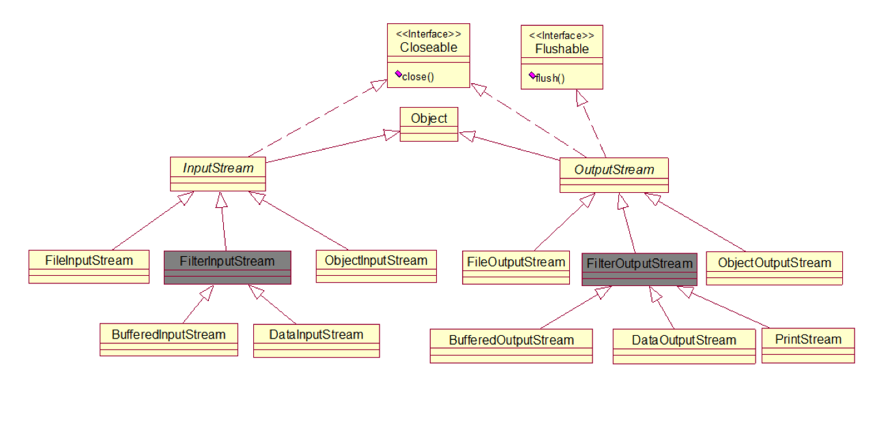
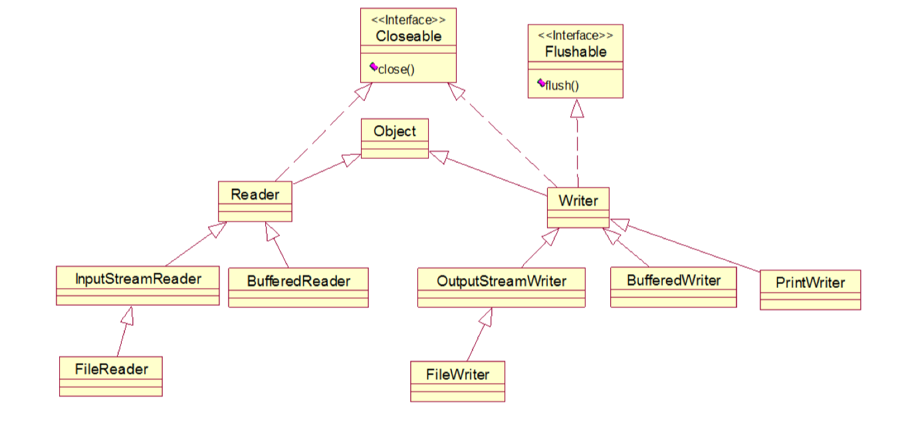
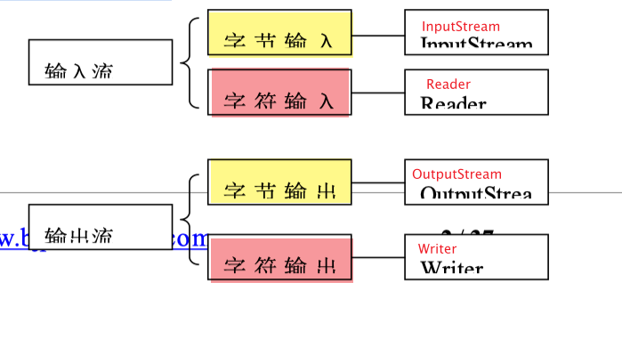
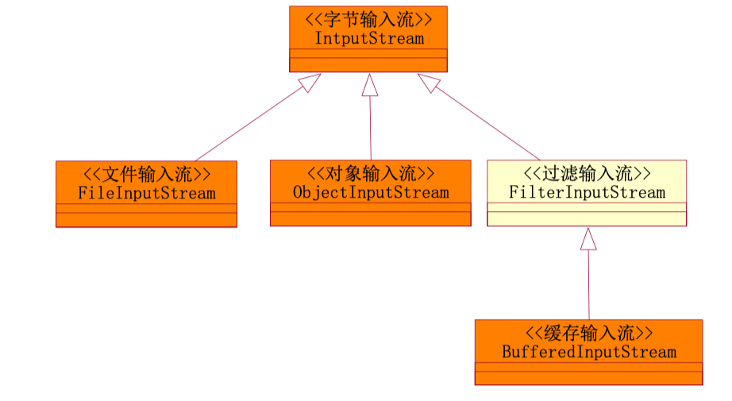
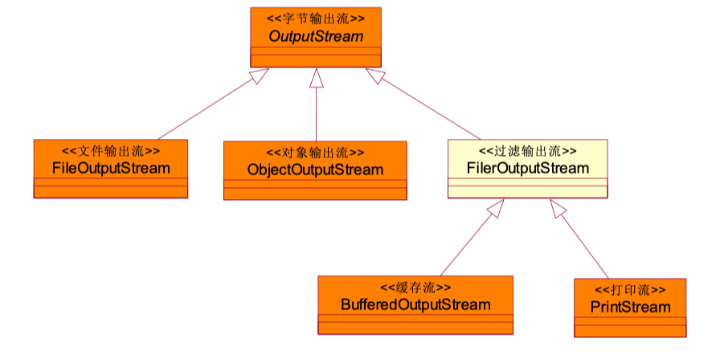
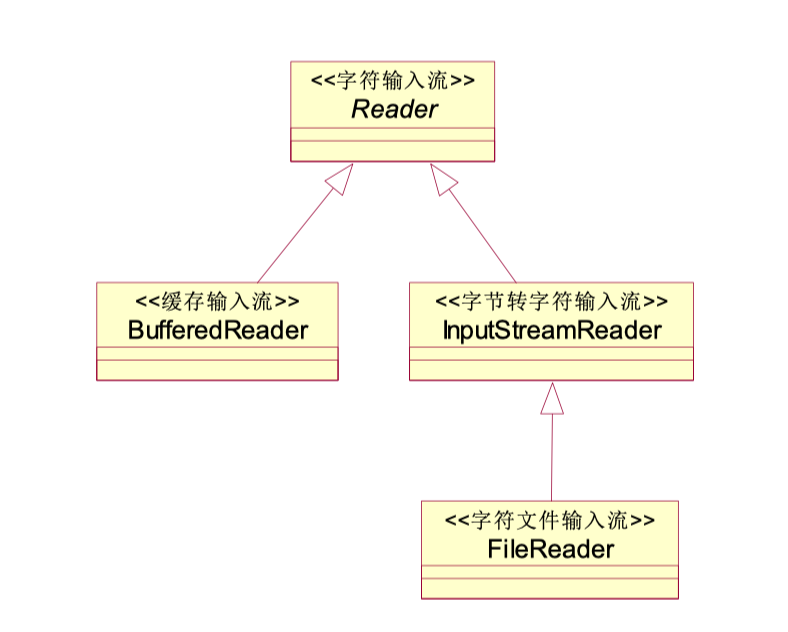
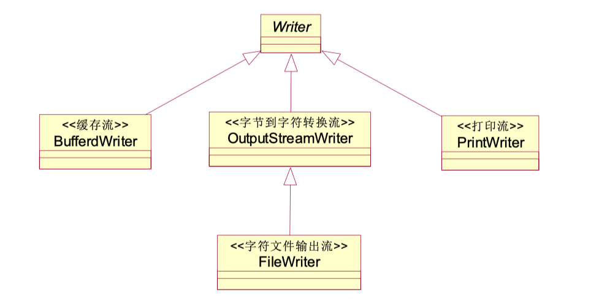
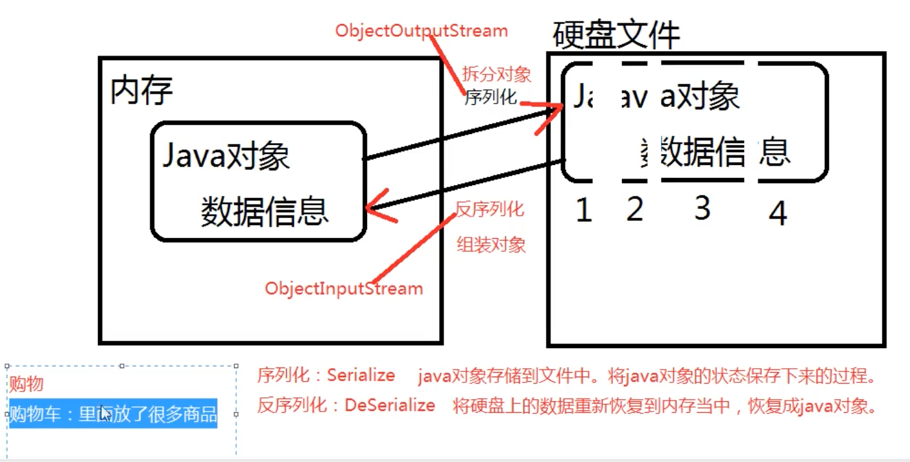

[^版权说明]: 以下笔记总结归纳自 *动力节点* 相关课程，没有经过作者同意，禁止转载


[toc]

## 1. Java 流概述

### InputStream 和 OutputStream 继承结构图：




### Reader 和 Writer 继承结构图：



### 概念

文件通常是由一连串的字节或字符构成，组成文件的字节序列称为字节流，组成文件的字符 序列称为字符流。Java 中根据流的方向可以分为输入流和输出流。输入流是将文件或其它输入 设备的数据加载到内存的过程；输出流恰恰相反，是将内存中的数据保存到文件或其他输出设 备，详见下图：


文件是由字符或字节构成，那么将文件加载到内存或再将文件输出到文件，需要有输入和输出 流的支持，那么在 Java 语言中又把输入和输出流分为了两个，字节输入和输出流，字符输入 和输出流，见下表：




### 1. InputStream(字节输入流)

InputStream 是字节输入流，InputStream 是一个抽象类，所有继承了 InputStream 的类都是 字节输入流，主要了解以下子类即可：




#### 主要方法介绍：

| 返回值类型  | 介绍                                                         |
| ----------- | ------------------------------------------------------------ |
| void        | close()关闭此输入流并释放与该流关联的所有系统资源。          |
| abstractint | read ()从输入流读取下一个数据字节。                          |
| int         | read (byte[]b)从输入流中读取一定数量的字节并将其存储在缓冲区数组 b 中。 |
| int         | read (byte[] b, int ff, int len)中最多 len 个数据字节读入字节数组。 |


#### 示例代码

```java
try{
  fis = new FileInputStream("D:/course/JavaProjects/02-JavaSE/temp");
  // 开始读
  int readData = fis.read(); // 这个方法的返回值是：读取到的“字节”本身。

  // 已经读到文件的末尾了，再读的时候读取不到任何数据，返回-1.
  readData = fis.read();

  // 改造while循环
  int readData = 0;
  while((readData = fis.read()) != -1){
    System.out.println(readData);
  }

  // 开始读，采用byte数组，一次读取多个字节。最多读取“数组.length”个字节。
  byte[] bytes = new byte[4]; // 准备一个4个长度的byte数组，一次最多读取4个字节。


}catch (FileNotFoundException e) {
  e.printStackTrace();
} catch (IOException e) {
  e.printStackTrace();
} finally {
  // 在finally语句块当中确保流一定关闭。
  if (fis != null) { // 避免空指针异常！
    // 关闭流的前提是：流不是空。流是null的时候没必要关闭。
    try {
      fis.close();
    } catch (IOException e) {
      e.printStackTrace();
    }
  }
}
```


#### 最终版，需要掌握***

```java
public class FileInputStreamTest04 {
  public static void main(String[] args) {
    FileInputStream fis = null;
    try {
      fis = new FileInputStream("chapter23/src/tempfile3");
      // 准备一个byte数组
      byte[] bytes = new byte[4];
      /*while(true){
                int readCount = fis.read(bytes);
                if(readCount == -1){
                    break;
                }
                // 把byte数组转换成字符串，读到多少个转换多少个。
                System.out.print(new String(bytes, 0, readCount));
            }*/

      int readCount = 0;
      while((readCount = fis.read(bytes)) != -1) {
        System.out.print(new String(bytes, 0, readCount));
      }

    } catch (FileNotFoundException e) {
      e.printStackTrace();
    } catch (IOException e) {
      e.printStackTrace();
    } finally {
      if (fis != null) {
        try {
          fis.close();
        } catch (IOException e) {
          e.printStackTrace();
        }
      }
    }
  }
}
```


#### FileInputStream类的其它常用方法：

​    int available()：返回流当中剩余的没有读到的字节数量
​    long skip(long n)：跳过几个字节不读。

```java
fis = new FileInputStream("tempfile");
System.out.println("总字节数量：" + fis.available());

//byte[] bytes = new byte[fis.available()]; // 这种方式不太适合太大的文件，因为byte[]数组不能太大。

// skip跳过几个字节不读取，这个方法也可能以后会用！
fis.skip(3);
System.out.println(fis.read()); //100
```


### 2. OutputStream(字节输出流)

所有继承了 OutputStream 都是字节输出流




#### 主要方法简介

| 返回值类型   | 简介                                                         |
| ------------ | ------------------------------------------------------------ |
| void         | close()关闭此输出流并释放与此流有关的所有系统资源。          |
| void         | flush()刷新此输出流并强制写出所有缓冲的输出字节。            |
| void         | write(byte[] b)将 b.length 个字节从指定的字节数组写入此输出流。 |
| void         | write(byte[] b, intoff, intlen)将指定字节数组中从偏移量 off 开始的 len 个字节写入此输出流。 |
| abstractvoid | write(int b) 将指定的字节写入此输出流。                      |


#### 示例代码

```java
/**
 * 文件字节输出流，负责写。
 * 从内存到硬盘。
 */
public class FileOutputStreamTest01 {
  public static void main(String[] args) {
    FileOutputStream fos = null;
    try {
      // myfile文件不存在的时候会自动新建！
      // 这种方式谨慎使用，这种方式会先将原文件清空，然后重新写入。
      //fos = new FileOutputStream("myfile");
      //fos = new FileOutputStream("chapter23/src/tempfile3");

      // 以追加的方式在文件末尾写入。不会清空原文件内容。
      fos = new FileOutputStream("chapter23/src/tempfile3", true);
      // 开始写。
      byte[] bytes = {97, 98, 99, 100};
      // 将byte数组全部写出！
      fos.write(bytes); // abcd
      // 将byte数组的一部分写出！
      fos.write(bytes, 0, 2); // 再写出ab

      // 字符串
      String s = "我是一个中国人，我骄傲！！！";
      // 将字符串转换成byte数组。
      byte[] bs = s.getBytes();
      // 写
      fos.write(bs);

      // 写完之后，最后一定要刷新
      fos.flush();
    } catch (FileNotFoundException e) {close
      e.printStackTrace();
                                      } catch (IOException e) {
      e.printStackTrace();
    } finally {
      if (fos != null) {
        try {
          fos.close();
        } catch (IOException e) {
          e.printStackTrace();
        }
      }
    }
  }
}

```


### 3. Reader(字符输入流)




#### 主要方法介绍

| 返回值类型   | 简介                                                         |
| ------------ | ------------------------------------------------------------ |
| abstractvoid | close()关闭该流。                                            |
| int          | read ()读取单个字符。                                        |
| in t         | read (char[] cbuf)将字符读入数组。                           |
| abstractint  | read (char[] cbuf, intoff, intlen)将字符读入数组的某一部分。 |


#### 示例代码

```java
/*
FileReader：
    文件字符输入流，只能读取普通文本。
    读取文本内容时，比较方便，快捷。
 */
public class FileReaderTest {
    public static void main(String[] args) {
        FileReader reader = null;
        try {
            // 创建文件字符输入流
            reader = new FileReader("tempfile");

            //准备一个char数组
            char[] chars = new char[4];
            // 往char数组中读
            reader.read(chars); // 按照字符的方式读取：第一次e，第二次f，第三次 风....
            for(char c : chars) {
                System.out.println(c);
            }

            /*// 开始读
            char[] chars = new char[4]; // 一次读取4个字符
            int readCount = 0;
            while((readCount = reader.read(chars)) != -1) {
                System.out.print(new String(chars,0,readCount));
            }*/
        } catch (FileNotFoundException e) {
            e.printStackTrace();
        } catch (IOException e) {
            e.printStackTrace();
        } finally {
            if (reader != null) {
                try {
                    reader.close();
                } catch (IOException e) {
                    e.printStackTrace();
                }
            }
        }
    }
}

```


### 4. Writer(字符输出流)




#### 主要方法

| 返回值类型   | 简介                                                      |
| :----------- | --------------------------------------------------------- |
| Writer       | append(char c)将指定字符追加到此 writer。                 |
| abstractvoid | close()关闭此流，但要先刷新它。                           |
| abstractvoid | flush()刷新此流。                                         |
| void         | write(char[]cbuf)写入字符数组。                           |
| abstractvoid | write(char[]cbuf, intoff, intlen)写入字符数组的某一部分。 |
| void         | write(intc)写入单个字符。                                 |
| void         | write(Stringstr)写入字符串。                              |
| void         | write(Stringstr, intoff, intlen)写入字符串的某一部分。    |


## 2. 文件流

文件流主要分为：文件字节输入流、文件字节输出流、文件字符输入流、文件字符输出流

### 1. FileInputStream(文件字节输入流)

```java
/*
  java.io.FileInputStream:
    1、文件字节输入流，万能的，任何类型的文件都可以采用这个流来读。
    2、字节的方式，完成输入的操作，完成读的操作（硬盘---> 内存）
 */

```

### 2. FileOutputStream(文件字节输出流)

```java
package com.bjpowernode.java.io;

import java.io.FileNotFoundException;
import java.io.FileOutputStream;
import java.io.IOException;

/**
 * 文件字节输出流，负责写。
 * 从内存到硬盘。
 */
public class FileOutputStreamTest01 {
    public static void main(String[] args) {
        FileOutputStream fos = null;
        try {
            // myfile文件不存在的时候会自动新建！
            // 这种方式谨慎使用，这种方式会先将原文件清空，然后重新写入。
            //fos = new FileOutputStream("myfile");
            //fos = new FileOutputStream("chapter23/src/tempfile3");

            // 以追加的方式在文件末尾写入。不会清空原文件内容。
            fos = new FileOutputStream("chapter23/src/tempfile3", true);
            // 开始写。
            byte[] bytes = {97, 98, 99, 100};
            // 将byte数组全部写出！
            fos.write(bytes); // abcd
            // 将byte数组的一部分写出！
            fos.write(bytes, 0, 2); // 再写出ab

            // 字符串
            String s = "我是一个中国人，我骄傲！！！";
            // 将字符串转换成byte数组。
            byte[] bs = s.getBytes();
            // 写
            fos.write(bs);

            // 写完之后，最后一定要刷新
            fos.flush();
        } catch (FileNotFoundException e) {close
            e.printStackTrace();
        } catch (IOException e) {
            e.printStackTrace();
        } finally {
            if (fos != null) {
                try {
                    fos.close();
                } catch (IOException e) {
                    e.printStackTrace();
                }
            }
        }
    }
}

```


### 3. FileReader(文件字符输入流)

```java
package com.bjpowernode.java.io;

import java.io.FileNotFoundException;
import java.io.FileReader;
import java.io.IOException;

/*
FileReader：
    文件字符输入流，只能读取普通文本。
    读取文本内容时，比较方便，快捷。
 */
public class FileReaderTest {
    public static void main(String[] args) {
        FileReader reader = null;
        try {
            // 创建文件字符输入流
            reader = new FileReader("tempfile");

            //准备一个char数组
            char[] chars = new char[4];
            // 往char数组中读
            reader.read(chars); // 按照字符的方式读取：第一次e，第二次f，第三次 风....
            for(char c : chars) {
                System.out.println(c);
            }

            /*// 开始读
            char[] chars = new char[4]; // 一次读取4个字符
            int readCount = 0;
            while((readCount = reader.read(chars)) != -1) {
                System.out.print(new String(chars,0,readCount));
            }*/
        } catch (FileNotFoundException e) {
            e.printStackTrace();
        } catch (IOException e) {
            e.printStackTrace();
        } finally {
            if (reader != null) {
                try {
                    reader.close();
                } catch (IOException e) {
                    e.printStackTrace();
                }
            }
        }
    }
}

```


### 4. FileWriter(文件字符输出流)

```java
package com.bjpowernode.java.io;

import java.io.FileWriter;
import java.io.IOException;

/*
FileWriter:
    文件字符输出流。写。
    只能输出普通文本。
 */
public class FileWriterTest {
    public static void main(String[] args) {
        FileWriter out = null;
        try {
            // 创建文件字符输出流对象
            //out = new FileWriter("file");
            out = new FileWriter("file", true);

            // 开始写。
            char[] chars = {'我','是','中','国','人'};
            out.write(chars);
            out.write(chars, 2, 3);

            out.write("我是一名java软件工程师！");
            // 写出一个换行符。
            out.write("\n");
            out.write("hello world!");

            // 刷新
            out.flush();
        } catch (IOException e) {
            e.printStackTrace();
        } finally {
            if (out != null) {
                try {
                    out.close();
                } catch (IOException e) {
                    e.printStackTrace();
                }
            }
        }
    }
}

```


## 3. 缓冲流

缓冲流主要是为了提高效率而存在的，减少物理读取次数，缓冲流主要有：BufferedInputStream、 BufferedOutputStream、BufferedReader、BufferedWriter，并且 BufferedReader 提供了实用方法 readLine()，可以直接读取一行，BufferWriter 提供了 newLine()可以写换行符。

### 1. 字节缓冲流(BufferedInputStream & BufferedOutputStream)

**输入**：采用 BufferedInputStream 对 InputStream 进行装饰，BufferedInputStream 会将数 据先读到缓存里，Java 程序再次读取数 据时， 直接到缓存中读取，减少 Java 程序物理读取的次数，提高性能


**输出**：采 用 BufferedOutputStream 对 FileOutputStream 进行装饰，每次写 文件的时候，先放到缓存了，然后再 一次性的将 缓存中的内容保存到文 件中，这样会减少写物理磁盘的次数，提高性能


### 2. 字符缓冲流(BufferedReader & BufferedWriter)


```java
package com.bjpowernode.java.io;

import java.io.BufferedReader;
import java.io.FileReader;

/*
BufferedReader:
    带有缓冲区的字符输入流。
    使用这个流的时候不需要自定义char数组，或者说不需要自定义byte数组。自带缓冲。
 */
public class BufferedReaderTest01 {
    public static void main(String[] args) throws Exception{

        FileReader reader = new FileReader("Copy02.java");
        // 当一个流的构造方法中需要一个流的时候，这个被传进来的流叫做：节点流。
        // 外部负责包装的这个流，叫做：包装流，还有一个名字叫做：处理流。
        // 像当前这个程序来说：FileReader就是一个节点流。BufferedReader就是包装流/处理流。
        BufferedReader br = new BufferedReader(reader);

        // 读一行
        /*String firstLine = br.readLine();
        System.out.println(firstLine);

        String secondLine = br.readLine();
        System.out.println(secondLine);

        String line3 = br.readLine();
        System.out.println(line3);*/

        // br.readLine()方法读取一个文本行，但不带换行符。
        String s = null;
        while((s = br.readLine()) != null){
            System.out.print(s);
        }

        // 关闭流
        // 对于包装流来说，只需要关闭最外层流就行，里面的节点流会自动关闭。（可以看源代码。）
        br.close();
    }
}

```


```java
/*
BufferedWriter：带有缓冲的字符输出流。
OutputStreamWriter：转换流
 */
public class BufferedWriterTest {
    public static void main(String[] args) throws Exception{
        // 带有缓冲区的字符输出流
        //BufferedWriter out = new BufferedWriter(new FileWriter("copy"));

        BufferedWriter out = new BufferedWriter(new OutputStreamWriter(new FileOutputStream("copy", true)));
        // 开始写。
        out.write("hello world!");
        out.write("\n");
        out.write("hello kitty!");
        // 刷新
        out.flush();
        // 关闭最外层
        out.close();
    }
}
```


## 4. 转换流（用的少）

将字节流转换成字符流

```java
/*
    转换流：InputStreamReader
 */
public class BufferedReaderTest02 {
    public static void main(String[] args) throws Exception{

        /*// 字节流
        FileInputStream in = new FileInputStream("Copy02.java");

        // 通过转换流转换（InputStreamReader将字节流转换成字符流。）
        // in是节点流。reader是包装流。
        InputStreamReader reader = new InputStreamReader(in);

        // 这个构造方法只能传一个字符流。不能传字节流。
        // reader是节点流。br是包装流。
        BufferedReader br = new BufferedReader(reader);*/

        // 合并
        BufferedReader br = new BufferedReader(new InputStreamReader(new FileInputStream("Copy02.java")));

        String line = null;
        while((line = br.readLine()) != null){
            System.out.println(line);
        }

        // 关闭最外层
        br.close();
    }
}

```


## 5. 数据流（不常用）

#### DataInputStream

```java
package com.bjpowernode.java.io;

import java.io.DataInputStream;
import java.io.FileInputStream;

/*
DataInputStream:数据字节输入流。
DataOutputStream写的文件，只能使用DataInputStream去读。并且读的时候你需要提前知道写入的顺序。
读的顺序需要和写的顺序一致。才可以正常取出数据。

 */
public class DataInputStreamTest01 {
    public static void main(String[] args) throws Exception{
        DataInputStream dis = new DataInputStream(new FileInputStream("data"));
        // 开始读
        byte b = dis.readByte();
        short s = dis.readShort();
        int i = dis.readInt();
        long l = dis.readLong();
        float f = dis.readFloat();
        double d = dis.readDouble();
        boolean sex = dis.readBoolean();
        char c = dis.readChar();

        System.out.println(b);
        System.out.println(s);
        System.out.println(i + 1000);
        System.out.println(l);
        System.out.println(f);
        System.out.println(d);
        System.out.println(sex);
        System.out.println(c);

        dis.close();
    }
}

```


#### DataOutputStream

```java
package com.bjpowernode.java.io;

import java.io.DataOutputStream;
import java.io.FileOutputStream;

/*
java.io.DataOutputStream：数据专属的流。
这个流可以将数据连同数据的类型一并写入文件。
注意：这个文件不是普通文本文档。（这个文件使用记事本打不开。）
 */
public class DataOutputStreamTest {
    public static void main(String[] args) throws Exception{
        // 创建数据专属的字节输出流
        DataOutputStream dos = new DataOutputStream(new FileOutputStream("data"));
        // 写数据
        byte b = 100;
        short s = 200;
        int i = 300;
        long l = 400L;
        float f = 3.0F;
        double d = 3.14;
        boolean sex = false;
        char c = 'a';
        // 写
        dos.writeByte(b); // 把数据以及数据的类型一并写入到文件当中。
        dos.writeShort(s);
        dos.writeInt(i);
        dos.writeLong(l);
        dos.writeFloat(f);
        dos.writeDouble(d);
        dos.writeBoolean(sex);
        dos.writeChar(c);

        // 刷新
        dos.flush();
        // 关闭最外层
        dos.close();
    }
}

```


## 6. 打印流

PrintStream

```java
package com.bjpowernode.java.io;

import java.io.FileOutputStream;
import java.io.PrintStream;

/*
java.io.PrintStream：标准的字节输出流。默认输出到控制台。
 */
public class PrintStreamTest {
    public static void main(String[] args) throws Exception{

        // 联合起来写
        System.out.println("hello world!");

        // 分开写
        PrintStream ps = System.out;
        ps.println("hello zhangsan");
        ps.println("hello lisi");
        ps.println("hello wangwu");

        // 标准输出流不需要手动close()关闭。
        // 可以改变标准输出流的输出方向吗？ 可以
        /*
        // 这些是之前System类使用过的方法和属性。
        System.gc();
        System.currentTimeMillis();
        PrintStream ps2 = System.out;
        System.exit(0);
        System.arraycopy(....);
         */

        // 标准输出流不再指向控制台，指向“log”文件。
        PrintStream printStream = new PrintStream(new FileOutputStream("log"));
        // 修改输出方向，将输出方向修改到"log"文件。
        System.setOut(printStream);
        // 再输出
        System.out.println("hello world");
        System.out.println("hello kitty");
        System.out.println("hello zhangsan");

    }
}

```


## 7. 对象流

### 序列化和反序列化




### ObjectOutputStream

```java
package com.bjpowernode.java.io;

import com.bjpowernode.java.bean.Student;

import java.io.FileOutputStream;
import java.io.ObjectOutputStream;

/*
1、java.io.NotSerializableException:
    Student对象不支持序列化！！！！

2、参与序列化和反序列化的对象，必须实现Serializable接口。

3、注意：通过源代码发现，Serializable接口只是一个标志接口：
    public interface Serializable {
    }
    这个接口当中什么代码都没有。
    那么它起到一个什么作用呢？
        起到标识的作用，标志的作用，java虚拟机看到这个类实现了这个接口，可能会对这个类进行特殊待遇。
        Serializable这个标志接口是给java虚拟机参考的，java虚拟机看到这个接口之后，会为该类自动生成
        一个序列化版本号。

4、序列化版本号有什么用呢？
    java.io.InvalidClassException:
        com.bjpowernode.java.bean.Student;
        local class incompatible:
            stream classdesc serialVersionUID = -684255398724514298（十年后）,
            local class serialVersionUID = -3463447116624555755（十年前）

    java语言中是采用什么机制来区分类的？
        第一：首先通过类名进行比对，如果类名不一样，肯定不是同一个类。
        第二：如果类名一样，再怎么进行类的区别？靠序列化版本号进行区分。

    小鹏编写了一个类：com.bjpowernode.java.bean.Student implements Serializable
    胡浪编写了一个类：com.bjpowernode.java.bean.Student implements Serializable
    不同的人编写了同一个类，但“这两个类确实不是同一个类”。这个时候序列化版本就起上作用了。
    对于java虚拟机来说，java虚拟机是可以区分开这两个类的，因为这两个类都实现了Serializable接口，
    都有默认的序列化版本号，他们的序列化版本号不一样。所以区分开了。（这是自动生成序列化版本号的好处）

    请思考？
        这种自动生成序列化版本号有什么缺陷？
            这种自动生成的序列化版本号缺点是：一旦代码确定之后，不能进行后续的修改，
            因为只要修改，必然会重新编译，此时会生成全新的序列化版本号，这个时候java
            虚拟机会认为这是一个全新的类。（这样就不好了！）

    最终结论：
        凡是一个类实现了Serializable接口，建议给该类提供一个固定不变的序列化版本号。
        这样，以后这个类即使代码修改了，但是版本号不变，java虚拟机会认为是同一个类。

 */
public class ObjectOutputStreamTest01 {
    public static void main(String[] args) throws Exception{
        // 创建java对象
        Student s = new Student(1111, "zhangsan");
        // 序列化
        ObjectOutputStream oos = new ObjectOutputStream(new FileOutputStream("students"));

        // 序列化对象
        oos.writeObject(s);

        // 刷新
        oos.flush();
        // 关闭
        oos.close();
    }
}

```

一次性序列化多个对象

```java
/*
一次序列化多个对象呢？
    可以，可以将对象放到集合当中，序列化集合。
提示：
    参与序列化的ArrayList集合以及集合中的元素User都需要实现 java.io.Serializable接口。
 */
public class ObjectOutputStreamTest02 {
    public static void main(String[] args) throws Exception{
        List<User> userList = new ArrayList<>();
        userList.add(new User(1,"zhangsan"));
        userList.add(new User(2, "lisi"));
        userList.add(new User(3, "wangwu"));
        ObjectOutputStream oos = new ObjectOutputStream(new FileOutputStream("users"));

        // 序列化一个集合，这个集合对象中放了很多其他对象。
        oos.writeObject(userList);

        oos.flush();
        oos.close();
    }
}

```


### ObjectInputStream

```java
/*
反序列化
 */
public class ObjectInputStreamTest01 {
    public static void main(String[] args) throws Exception{
        ObjectInputStream ois = new ObjectInputStream(new FileInputStream("students"));
        // 开始反序列化，读
        Object obj = ois.readObject();
        // 反序列化回来是一个学生对象，所以会调用学生对象的toString方法。
        System.out.println(obj);
        ois.close();
    }
}

```

使用集合反序列化多个对象

```java
/*
反序列化集合
 */
public class ObjectInputStreamTest02 {
    public static void main(String[] args) throws Exception{
        ObjectInputStream ois = new ObjectInputStream(new FileInputStream("users"));
        //Object obj = ois.readObject();
        //System.out.println(obj instanceof List);
        List<User> userList = (List<User>)ois.readObject();
        for(User user : userList){
            System.out.println(user);
        }
        ois.close();
    }
}

```


#### IO+properties

这里更多是想说是一个理念，IO+Properties的联合应用。
非常好的一个设计理念：
    以后经常改变的数据，可以单独写到一个文件中，使用程序动态读取。
    将来只需要修改这个文件的内容，java代码不需要改动，不需要重新
    编译，服务器也不需要重启。就可以拿到动态的信息。

属性配置文件建议以.properties结尾

```java
package com.bjpowernode.java.io;

import java.io.FileReader;
import java.util.Properties;

/*
IO+Properties的联合应用。
非常好的一个设计理念：
    以后经常改变的数据，可以单独写到一个文件中，使用程序动态读取。
    将来只需要修改这个文件的内容，java代码不需要改动，不需要重新
    编译，服务器也不需要重启。就可以拿到动态的信息。

    类似于以上机制的这种文件被称为配置文件。
    并且当配置文件中的内容格式是：
        key1=value
        key2=value
    的时候，我们把这种配置文件叫做属性配置文件。

    java规范中有要求：属性配置文件建议以.properties结尾，但这不是必须的。
    这种以.properties结尾的文件在java中被称为：属性配置文件。
    其中Properties是专门存放属性配置文件内容的一个类。
 */
public class IoPropertiesTest01 {
    public static void main(String[] args) throws Exception{
        /*
        Properties是一个Map集合，key和value都是String类型。
        想将userinfo文件中的数据加载到Properties对象当中。
         */
        // 新建一个输入流对象
        FileReader reader = new FileReader("chapter23/userinfo.properties");

        // 新建一个Map集合
        Properties pro = new Properties();

        // 调用Properties对象的load方法将文件中的数据加载到Map集合中。
        pro.load(reader); // 文件中的数据顺着管道加载到Map集合中，其中等号=左边做key，右边做value

        // 通过key来获取value呢？
        String username = pro.getProperty("username");
        System.out.println(username);

        String password = pro.getProperty("password");
        System.out.println(password);

        String data = pro.getProperty("data");
        System.out.println(data);

        String usernamex = pro.getProperty("usernamex");
        System.out.println(usernamex);
    }
}

```


## 8. File 类

File 提供了大量的文件操作：删除文件，修改文件，得到文件修改日期，建立目录、列表文件 等等。

```java
package com.bjpowernode.java.io;

import java.io.File;

/*
File
    1、File类和四大家族没有关系，所以File类不能完成文件的读和写。
    2、File对象代表什么？
        文件和目录路径名的抽象表示形式。
        C:\Drivers 这是一个File对象
        C:\Drivers\Lan\Realtek\Readme.txt 也是File对象。
        一个File对象有可能对应的是目录，也可能是文件。
        File只是一个路径名的抽象表示形式。
    3、需要掌握File类中常用的方法
 */
public class FileTest01 {
  public static void main(String[] args) throws Exception {
    // 创建一个File对象
    File f1 = new File("D:\\file");

    // 判断是否存在！
    System.out.println(f1.exists());

    // 如果D:\file不存在，则以文件的形式创建出来
    /*if(!f1.exists()) {
            // 以文件形式新建
            f1.createNewFile();
        }*/

    // 如果D:\file不存在，则以目录的形式创建出来
    /*if(!f1.exists()) {
            // 以目录的形式新建。
            f1.mkdir();
        }*/

    // 可以创建多重目录吗？
    File f2 = new File("D:/a/b/c/d/e/f");
    /*if(!f2.exists()) {
            // 多重目录的形式新建。
            f2.mkdirs();
        }*/

    File f3 = new File("D:\\course\\01-开课\\学习方法.txt");
    // 获取文件的父路径
    String parentPath = f3.getParent();
    System.out.println(parentPath); //D:\course\01-开课
    File parentFile = f3.getParentFile();
    System.out.println("获取绝对路径：" + parentFile.getAbsolutePath());

    File f4 = new File("copy");
    System.out.println("绝对路径：" + f4.getAbsolutePath()); // C:\Users\Administrator\IdeaProjects\javase\copy

  }
}


File f1 = new File("D:\\course\\01-开课\\开学典礼.ppt");
// 获取文件名
System.out.println("文件名：" + f1.getName());

// 判断是否是一个目录
System.out.println(f1.isDirectory()); // false

// 判断是否是一个文件
System.out.println(f1.isFile()); // true

// 获取文件最后一次修改时间
long haoMiao = f1.lastModified(); // 这个毫秒是从1970年到现在的总毫秒数。
// 将总毫秒数转换成日期?????
Date time = new Date(haoMiao);
SimpleDateFormat sdf = new SimpleDateFormat("yyyy-MM-dd HH:mm:ss SSS");
String strTime = sdf.format(time);
System.out.println(strTime);

// 获取文件大小
System.out.println(f1.length()); //216064字节。


package com.bjpowernode.java.io;

import java.io.File;

/*
File中的listFiles方法。
 */
public class FileTest03 {
  public static void main(String[] args) {
    // File[] listFiles()
    // 获取当前目录下所有的子文件。
    File f = new File("D:\\course\\01-开课");
    File[] files = f.listFiles();
    // foreach
    for(File file : files){
      //System.out.println(file.getAbsolutePath());
      System.out.println(file.getName());
    }
  }
}

```


## 9. zip 格式

参见：

java.util.zip.* 包下的 api


