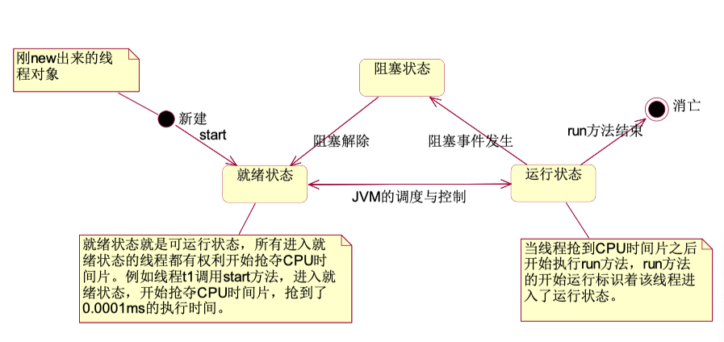
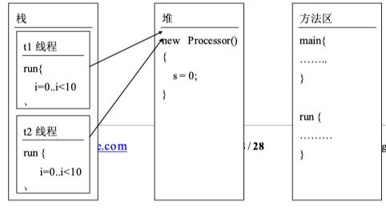
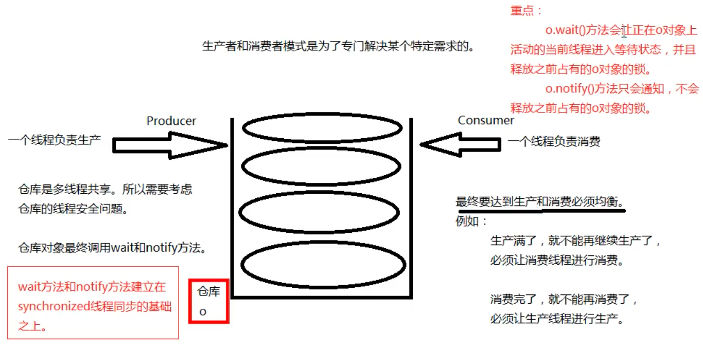

[^版权说明]: 以下笔记总结归纳自 *动力节点* 相关课程，没有经过作者同意，禁止转载


[toc]

## 1. 多线程的基本概念


#### 什么事进程

一个进程就是一个应用程序。在操作系统中每启动一个应用程序就会相应的启动一个进 程。


#### 什么是线程

线程指进程中的一个执行场景，也就是执行流程，那么进程和线程有什么区别呢？一个进程中有多个线程

1. 每个进程是一个应用程序，都有独立的内存空间
2. 同一个进程中的线程共享其进程中的内存和资源
   1. （共享的内存是堆内存和方法区内存，栈内存不共享，每个线程有自己的。）


#### 单核计算机如何实现多进程

对于单核的计算机来讲，在某一个时间点上只能做一件事情，但是由于计算机的处理速度 很高，多个进程之间完成频繁的切换执行，这个切换速度使人类产生了错觉，人类的错觉是：

多个进程在同时运行。计算机引入多进程的作用：提高 CPU 的使用率。 **重点：进程和进程之间的内存独立。**


#### 进程引入多线程的作用

提高进程的使用率。 重点：线程和线程之间栈内存独立，堆内存和方法区内存共享。一个线程一个栈。


#### java 程序执行原理

java 命令执行会启动 JVM，JVM 的启动表示启动一个应用程序，表示启动了一个进程。 该进程会自动启动一个“主线程”，然后主线程负责调用某个类的 main 方法。所以 main 方法 的执行是在主线程中执行的。然后通过 main 方法代码的执行可以启动其他的“分支线程”。 所以，main 方法结束程序不一定结束，因为其他的分支线程有可能还在执行。


## 2. 线程的创建和启动

Java 虚拟机的主线程入口是 main 方法，用户可以自己创建线程，创建方式有两种

1. 继承 Thread 类
2. 实现 Runnable 接口（推荐使用 Runnable 接口）


### 继承 Thread 类

采用 Thread 类创建线程，用户只需要继承 Thread，覆盖 Thread 中的 run 方法，父类 Thread 中 的 run 方法没有抛出异常，那么子类也不能抛出异常，最后采用 start 启动线程即可

```java
package com.bjpowernode.java.thread;
/*
实现线程的第一种方式：
    编写一个类，直接继承java.lang.Thread，重写run方法。

    怎么创建线程对象？ new就行了。
    怎么启动线程呢？ 调用线程对象的start()方法。

注意：
    亘古不变的道理：
        方法体当中的代码永远都是自上而下的顺序依次逐行执行的。

以下程序的输出结果有这样的特点：
    有先有后。
    有多有少。
    这是咋回事？这里画一个问号？？？？？？？？？？？？？？？？？？？？？？？
 */
public class ThreadTest02 {
    public static void main(String[] args) {
        // 这里是main方法，这里的代码属于主线程，在主栈中运行。
        // 新建一个分支线程对象
        MyThread t = new MyThread();
        // 启动线程
        //t.run(); // 不会启动线程，不会分配新的分支栈。（这种方式就是单线程。）
        // start()方法的作用是：启动一个分支线程，在JVM中开辟一个新的栈空间，这段代码任务完成之后，瞬间就结束了。
        // 这段代码的任务只是为了开启一个新的栈空间，只要新的栈空间开出来，start()方法就结束了。线程就启动成功了。
        // 启动成功的线程会自动调用run方法，并且run方法在分支栈的栈底部（压栈）。
        // run方法在分支栈的栈底部，main方法在主栈的栈底部。run和main是平级的。
        t.start();
        // 这里的代码还是运行在主线程中。
        for(int i = 0; i < 1000; i++){
            System.out.println("主线程--->" + i);
        }
    }
}

class MyThread extends Thread {
    @Override
    public void run() {
        // 编写程序，这段程序运行在分支线程中（分支栈）。
        for(int i = 0; i < 1000; i++){
            System.out.println("分支线程--->" + i);
        }
    }
}

```


### 实现 Runnable 接口（推荐使用 Runnable 接口）

```java
/*
实现线程的第二种方式，编写一个类实现java.lang.Runnable接口。
 */
public class ThreadTest03 {
    public static void main(String[] args) {
        // 创建一个可运行的对象
        //MyRunnable r = new MyRunnable();
        // 将可运行的对象封装成一个线程对象
        //Thread t = new Thread(r);
        Thread t = new Thread(new MyRunnable()); // 合并代码
        // 启动线程
        t.start();

        for(int i = 0; i < 100; i++){
            System.out.println("主线程--->" + i);
        }
    }
}

// 这并不是一个线程类，是一个可运行的类。它还不是一个线程。
class MyRunnable implements Runnable {

    @Override
    public void run() {
        for(int i = 0; i < 100; i++){
            System.out.println("分支线程--->" + i);
        }
    }
}

```


## 3. 线程的生命周期

### 线程的生命周期



线程状态会经常在**就绪**和**运行**之间切换

1. 新建：采用 new 语句创建完成
2. 就绪：执行 start 后 
3. 运行：占用 CPU 时间 
4. 阻塞：执行了 wait 语句、执行了 sleep 语句和等待某个对象锁，等待输入的场合 
5. 终止：退出 run()方法


## 4. 线程的调度

Java 虚拟机要负责线程的调度，取得 CPU 的使用权，目前有两种调度模型：

1. 分式调度模型
   1. 所有线程**轮流使用** CPU 的使用权，**平均分配**每个线程占用 CPU 的时间片
2. 抢占式调度模型
   1. **优先级高**的线程获取 CPU 的时间片相对多一些，如果**线程的优先级相同， 那么会随机选择一个**


## 5. 线程控制

### 线程优先级

1. MAX_PRIORITY( 最 高 级 )
2. MIN_PRIORITY （ 最 低 级 ） 
3. NOM_PRIORITY(标准)默认


### Thread.sleep

sleep 设置休眠的时间,单位毫秒，当一个线程遇到 sleep 的时候，就会睡眠，进入到阻塞状态, 放弃 CPU，腾出 cpu 时间片，给其他线程用，所以在开发中通常我们会这样做，使其他的线 程能够取得 CPU 时间片，当睡眠时间到达了，线程会进入可运行状态，得到 CPU 时间片继续 执行，如果线程在睡眠状态被中断了，将会抛出 IterruptedException


### Thread.yield

它与 sleep()类似，只是不能由用户指定暂停多长时间，并且 yield()方法只能让同优先级的线程 有执行的机会


### t.join();

当前线程可以调用另一个线程的 join 方法，调用后当前线程会被阻塞不再执行，直到被调用的 线程执行完毕，当前线程才会执行


### 如何正确的停止一个线程

通常定义一个标记，来判断标记的状态停止线程的执行

```java
package com.bjpowernode.java.thread;
/*
怎么合理的终止一个线程的执行。这种方式是很常用的。
 */
public class ThreadTest10 {
    public static void main(String[] args) {
        MyRunable4 r = new MyRunable4();
        Thread t = new Thread(r);
        t.setName("t");
        t.start();

        // 模拟5秒
        try {
            Thread.sleep(5000);
        } catch (InterruptedException e) {
            e.printStackTrace();
        }
        // 终止线程
        // 你想要什么时候终止t的执行，那么你把标记修改为false，就结束了。
        r.run = false;
    }
}

class MyRunable4 implements Runnable {

    // 打一个布尔标记
    boolean run = true;

    @Override
    public void run() {
        for (int i = 0; i < 10; i++){
            if(run){
                System.out.println(Thread.currentThread().getName() + "--->" + i);
                try {
                    Thread.sleep(1000);
                } catch (InterruptedException e) {
                    e.printStackTrace();
                }
            }else{
                // return就结束了，你在结束之前还有什么没保存的。
                // 在这里可以保存呀。
                //save....

                //终止当前线程
                return;
            }
        }
    }
}

```


### 

## 6. 线程的同步

### 线程安全（最重要）

多线程并发带来的安全问题

1. 多线程并发

2. 数据共享

3. 共享的数据有修改的行为



### 线程的同步（加锁）

线程同步，指某一个时刻，指允许一个线程来访问共享资源，线程同步其实是对对象加锁，如 果对象中的方法都是同步方法，那么某一时刻只能执行一个方法，采用线程同步解决以上的问 题，我们只要保证线程一操作 s 时，线程 2 不允许操作即可，只有线程一使用完成 s 后，再让 线程二来使用 s 变量


1. 异步编程模型
2. 同步编程模型


### 示例代码

synchronized 中填写的对象很重要，要是线程共享的对象，不能是局部变量，

这个里面的对象，是不是你让线程排队的对象，对象只有一把锁

##### java 中三大变量【重要！】

参考：[局部变量、实例变量和静态变量的区别_weixin_34342905的博客-CSDN博客](https://blog.csdn.net/weixin_34342905/article/details/91468559)

1. 成员变量-实例变量：堆中
2. 成员变量-静态变量：方法区中
3. 局部变量：栈中-局部变量永远都不会存在线程安全问题。 因为局部变量不共享。(一个线程一个機。) 局部变量在栽中。所以局部变量永远都不会共享

```java
package com.bjpowernode.java.threadsafe2;
/*
银行账户
    使用线程同步机制，解决线程安全问题。
 */
public class Account {
    // 账号
    private String actno;
    // 余额
    private double balance; //实例变量。

    //对象
    Object obj = new Object(); // 实例变量。（Account对象是多线程共享的，Account对象中的实例变量obj也是共享的。）

    public Account() {
    }

    public Account(String actno, double balance) {
        this.actno = actno;
        this.balance = balance;
    }

    public String getActno() {
        return actno;
    }

    public void setActno(String actno) {
        this.actno = actno;
    }

    public double getBalance() {
        return balance;
    }

    public void setBalance(double balance) {
        this.balance = balance;
    }

    //取款的方法
    public void withdraw(double money){

        //int i = 100;
        //i = 101;

        // 以下这几行代码必须是线程排队的，不能并发。
        // 一个线程把这里的代码全部执行结束之后，另一个线程才能进来。
        /*
        线程同步机制的语法是：
            synchronized(){
                // 线程同步代码块。
            }
            synchronized后面小括号中传的这个“数据”是相当关键的。
            这个数据必须是多线程共享的数据。才能达到多线程排队。

            ()中写什么？
                那要看你想让哪些线程同步。
                假设t1、t2、t3、t4、t5，有5个线程，
                你只希望t1 t2 t3排队，t4 t5不需要排队。怎么办？
                你一定要在()中写一个t1 t2 t3共享的对象。而这个
                对象对于t4 t5来说不是共享的。

            这里的共享对象是：账户对象。
            账户对象是共享的，那么this就是账户对象吧！！！
            不一定是this，这里只要是多线程共享的那个对象就行。

            在java语言中，任何一个对象都有“一把锁”，其实这把锁就是标记。（只是把它叫做锁。）
            100个对象，100把锁。1个对象1把锁。

            以下代码的执行原理？
                1、假设t1和t2线程并发，开始执行以下代码的时候，肯定有一个先一个后。
                2、假设t1先执行了，遇到了synchronized，这个时候自动找“后面共享对象”的对象锁，
                找到之后，并占有这把锁，然后执行同步代码块中的程序，在程序执行过程中一直都是
                占有这把锁的。直到同步代码块代码结束，这把锁才会释放。
                3、假设t1已经占有这把锁，此时t2也遇到synchronized关键字，也会去占有后面
                共享对象的这把锁，结果这把锁被t1占有，t2只能在同步代码块外面等待t1的结束，
                直到t1把同步代码块执行结束了，t1会归还这把锁，此时t2终于等到这把锁，然后
                t2占有这把锁之后，进入同步代码块执行程序。

                这样就达到了线程排队执行。
                这里需要注意的是：这个共享对象一定要选好了。这个共享对象一定是你需要排队
                执行的这些线程对象所共享的。
         */
        //Object obj2 = new Object();
        //synchronized (this){
        //synchronized (obj) {
        //synchronized ("abc") { // "abc"在字符串常量池当中。
        //synchronized (null) { // 报错：空指针。
        //synchronized (obj2) { // 这样编写就不安全了。因为obj2不是共享对象。
            double before = this.getBalance();
            double after = before - money;
            try {
                Thread.sleep(1000);
            } catch (InterruptedException e) {
                e.printStackTrace();
            }
            this.setBalance(after);
        //}
    }
}
```

在实例方法上使用 synchronize，可以的，对象只能是 this，不灵活，不常用

然而优点是，代码写的少，简洁了


### 排它锁

### 互斥锁


### 死锁

```java
package com.bjpowernode.java.deadlock;
/*
死锁代码要会写。
一般面试官要求你会写。
只有会写的，才会在以后的开发中注意这个事儿。
因为死锁很难调试。
 */
public class DeadLock {
    public static void main(String[] args) {
        Object o1 = new Object();
        Object o2 = new Object();

        // t1和t2两个线程共享o1,o2
        Thread t1 = new MyThread1(o1,o2);
        Thread t2 = new MyThread2(o1,o2);

        t1.start();
        t2.start();
    }
}

class MyThread1 extends Thread{
    Object o1;
    Object o2;
    public MyThread1(Object o1,Object o2){
        this.o1 = o1;
        this.o2 = o2;
    }
    public void run(){
        synchronized (o1){
            try {
                Thread.sleep(1000);
            } catch (InterruptedException e) {
                e.printStackTrace();
            }
            synchronized (o2){

            }
        }
    }
}

class MyThread2 extends Thread {
    Object o1;
    Object o2;
    public MyThread2(Object o1,Object o2){
        this.o1 = o1;
        this.o2 = o2;
    }
    public void run(){
        synchronized (o2){
            try {
                Thread.sleep(1000);
            } catch (InterruptedException e) {
                e.printStackTrace();
            }
            synchronized (o1){

            }
        }
    }
}
```


### 怎么解决线程安全问题

是一上来就选择线程同步吗？synchronized
	不是，synchronized会让程序的执行效率降低，用户体验不好。
	系统的用户吞吐量降低。用户体验差。在不得已的情况下再选择
	线程同步机制。

第一种方案：尽量使用局部变量代替“实例变量和静态变量”。

第二种方案：如果必须是实例变量，那么可以考虑创建多个对象，这样
实例变量的内存就不共享了。（一个线程对应1个对象，100个线程对应100个对象，
对象不共享，就没有数据安全问题了。）

第三种方案：如果不能使用局部变量，对象也不能创建多个，这个时候
就只能选择synchronized了。线程同步机制。


## 7. 守护线程

守护线程和用户线程

守护线程最经典就是垃圾回收器 

守护线程。守护线程 是这样的，所有的用户线程结束生命周期，守护线程才会结束生命周期，只要有一个用户线程 存在，那么守护线程就不会结束，

设置为守护线程后，当主线程结束后，守护线程并没有把所有的数据输出完就结束了，也即是 说守护线程是为用户线程服务的，当用户线程全部结束，守护线程会自动结束

```java
//将当前线程修改为守护线程 //在线程没有启动时可以修改以下参数 
t1.setDaemon(true);
```


## 8. 定时器的使用

关于日程有专门的第三方开源产品，如：Quartz、


#### 定时器的作用：

	间隔特定的时间，执行特定的程序。
每周要进行银行账户的总账操作。
每天要进行数据的备份操作。

在实际的开发中，每隔多久执行一段特定的程序，这种需求是很常见的，
那么在java中其实可以采用多种方式实现：
可以使用sleep方法，睡眠，设置睡眠时间，没到这个时间点醒来，执行
任务。这种方式是最原始的定时器。（比较low）

在java的类库中已经写好了一个定时器：java.util.Timer，可以直接拿来用。
不过，这种方式在目前的开发中也很少用，因为现在有很多高级框架都是支持
定时任务的。

在实际的开发中，目前使用较多的是Spring框架中提供的SpringTask框架，
这个框架只要进行简单的配置，就可以完成定时器的任务。


#### 实现线程的第三种方式：实现Callable接口。（JDK8新特性。）

		这种方式实现的线程可以获取线程的返回值。
		之前讲解的那两种方式是无法获取线程返回值的，因为run方法返回void。
	
		思考：
			系统委派一个线程去执行一个任务，该线程执行完任务之后，可能
			会有一个执行结果，我们怎么能拿到这个执行结果呢？
				使用第三种方式：实现Callable接口方式。


#### 关于Object类中的wait和notify方法。（生产者和消费者模式！）

第一：wait和notify方法不是线程对象的方法，是java中任何一个java对象都有的方法，因为这两个方式是Object类中自带的。
			wait方法和notify方法不是通过线程对象调用，
			不是这样的：t.wait()，也不是这样的：t.notify()..不对。
第二：wait()方法作用？
		Object o = new Object();
		o.wait();

	表示：
		让正在o对象上活动的线程进入等待状态，无期限等待，
		直到被唤醒为止。
		o.wait();方法的调用，会让“当前线程（正在o对象上
		活动的线程）”进入等待状态。

第三：notify()方法作用？
	Object o = new Object();
	o.notify();

	表示：
		唤醒正在o对象上等待的线程。
	
	还有一个notifyAll()方法：
		这个方法是唤醒o对象上处于等待的所有线程。





#### 生产者和消费者示例代码

```java
package com.bjpowernode.java.thread;

import java.util.ArrayList;
import java.util.List;

/*
1、使用wait方法和notify方法实现“生产者和消费者模式”

2、什么是“生产者和消费者模式”？
    生产线程负责生产，消费线程负责消费。
    生产线程和消费线程要达到均衡。
    这是一种特殊的业务需求，在这种特殊的情况下需要使用wait方法和notify方法。

3、wait和notify方法不是线程对象的方法，是普通java对象都有的方法。

4、wait方法和notify方法建立在线程同步的基础之上。因为多线程要同时操作一个仓库。有线程安全问题。

5、wait方法作用：o.wait()让正在o对象上活动的线程t进入等待状态，并且释放掉t线程之前占有的o对象的锁。

6、notify方法作用：o.notify()让正在o对象上等待的线程唤醒，只是通知，不会释放o对象上之前占有的锁。

7、模拟这样一个需求：
    仓库我们采用List集合。
    List集合中假设只能存储1个元素。
    1个元素就表示仓库满了。
    如果List集合中元素个数是0，就表示仓库空了。
    保证List集合中永远都是最多存储1个元素。

    必须做到这种效果：生产1个消费1个。
 */
public class ThreadTest16 {
    public static void main(String[] args) {
        // 创建1个仓库对象，共享的。
        List list = new ArrayList();
        // 创建两个线程对象
        // 生产者线程
        Thread t1 = new Thread(new Producer(list));
        // 消费者线程
        Thread t2 = new Thread(new Consumer(list));

        t1.setName("生产者线程");
        t2.setName("消费者线程");

        t1.start();
        t2.start();
    }
}

// 生产线程
class Producer implements Runnable {
    // 仓库
    private List list;

    public Producer(List list) {
        this.list = list;
    }
    @Override
    public void run() {
        // 一直生产（使用死循环来模拟一直生产）
        while(true){
            // 给仓库对象list加锁。
            synchronized (list){
                if(list.size() > 0){ // 大于0，说明仓库中已经有1个元素了。
                    try {
                        // 当前线程进入等待状态，并且释放Producer之前占有的list集合的锁。
                        list.wait();
                    } catch (InterruptedException e) {
                        e.printStackTrace();
                    }
                }
                // 程序能够执行到这里说明仓库是空的，可以生产
                Object obj = new Object();
                list.add(obj);
                System.out.println(Thread.currentThread().getName() + "--->" + obj);
                // 唤醒消费者进行消费
                list.notifyAll();
            }
        }
    }
}

// 消费线程
class Consumer implements Runnable {
    // 仓库
    private List list;

    public Consumer(List list) {
        this.list = list;
    }

    @Override
    public void run() {
        // 一直消费
        while(true){
            synchronized (list) {
                if(list.size() == 0){
                    try {
                        // 仓库已经空了。
                        // 消费者线程等待，释放掉list集合的锁
                        list.wait();
                    } catch (InterruptedException e) {
                        e.printStackTrace();
                    }
                }
                // 程序能够执行到此处说明仓库中有数据，进行消费。
                Object obj = list.remove(0);
                System.out.println(Thread.currentThread().getName() + "--->" + obj);
                // 唤醒生产者生产。
                list.notifyAll();
            }
        }
    }
}

```


## 9. windows 的任务计划