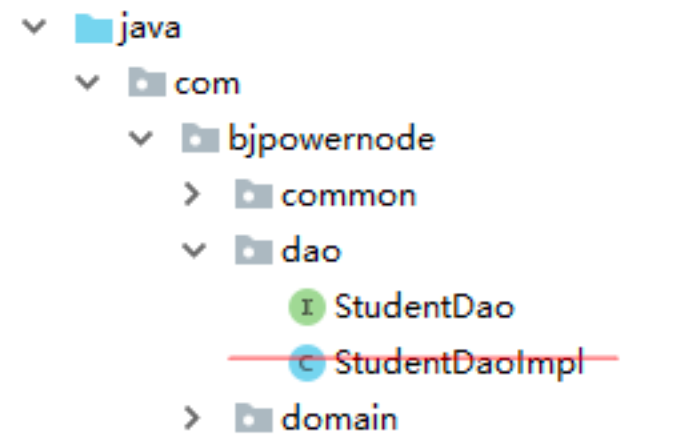
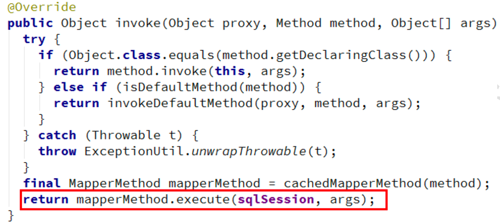
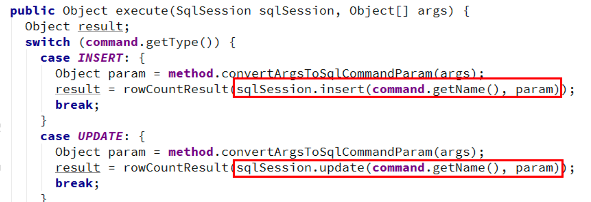

# mybatis

> MyBatis 框架:
> MyBatis 是一个优秀的基于 java 的持久层框架，内部封装了 jdbc，开发者只需要关注 sql 语句本身，而不需要处理加载驱动、创建连接、创建 statement、关闭连接，资源等繁杂的过程。 MyBatis 通过 xml 或注解两种方式将要执行的各种 sql 语句配置起来，并通过 java 对象和 sql 的 动态参数进行映射生成最终执行的 sql 语句，最后由 mybatis 框架执行 sql 并将结果映射为 java 对象并返回。

[toc]

## 1. JDBC

```java
    public void findStudent() {
        Connection conn = null;
        Statement stmt = null;
        ResultSet rs = null;
        try {
//注册 mysql 驱动
            Class.forName("com.mysql.jdbc.Driver");
//连接数据的基本信息 url ，username，password
            String url = "jdbc:mysql://localhost:3306/springdb";
            String username = "root";
            String password = "123456";
//创建连接对象
            conn = DriverManager.getConnection(url, username, password);
//保存查询结果
            List<Student> stuList = new ArrayList<>();
//创建 Statement, 用来执行 sql 语句
            stmt = conn.createStatement();
//执行查询，创建记录集，
            rs = stmt.executeQuery("select * from student");
            while (rs.next()) {
                Student stu = new Student();
                stu.setId(rs.getInt("id"));
                stu.setName(rs.getString("name"));
                stu.setAge(rs.getInt("age"));
//从数据库取出数据转为 Student 对象，封装到 List 集合
                stuList.add(stu);
            }
        } catch (Exception e) {
            e.printStackTrace();
        } finally {
            try {
//关闭资源
                if (rs != null) ;
                {
                    rs.close();
                }
                if (stmt != null) {
                    stmt.close();
                }
                if (conn != null) {
                    conn.close();
                }
            } catch (Exception e) {
                e.printStackTrace();
            }
        }
    }

```

#### 缺点:

1. 代码比较多，开发效率低
2. 需要关注 Connection ,Statement, ResultSet 对象创建和销毁
3. 对 ResultSet 查询的结果，需要自己封装为 List
4. 重复的代码比较多些
5. 业务代码和数据库的操作混在一起


## 2. mybatis框架

### 2.1 **MyBatis** 解决的主要问题

减轻使用 JDBC 的复杂性，不用编写重复的创建 Connetion , Statement ; 不用编写关闭资源代码。

直接使用 java 对象，表示结果数据。让开发者专注 SQL 的处理。 其他分心的工作由 MyBatis 代劳。


#### MyBatis 可以完成:

1. 注册数据库的驱动，例如 Class.forName(“com.mysql.jdbc.Driver”))

2. 创建 JDBC 中必须使用的 Connection ， Statement， ResultSet 对象

3. 从 xml 中获取 sql，并执行 sql 语句，把 ResultSet 结果转换 java 对象

   1. ```java
      List<Student> list = new ArrayLsit<>();
      ResultSet rs = state.executeQuery(“select * from student”); while(rs.next){
      Student student = new Student(); student.setName(rs.getString(“name”)); student.setAge(rs.getInt(“age”)); list.add(student);
      }
      ```

4. 关闭资源

```java
ResultSet.close() , Statement.close() , Conenection.close()
```


### 2.2 使用mybatis

下载 mybatis

https://github.com/mybatis/mybatis-3/releases

#### 搭建 **MyBatis** 开发环境

maven依赖

```xml
    <dependency>
        <groupId>org.mybatis</groupId>
        <artifactId>mybatis</artifactId>
        <version>3.5.1</version>
    </dependency>
```

maven插件

```xml
    <build>
        <resources>
            <resource>
                <directory>src/main/java</directory><!--所在的目录-->
                <includes><!--包括目录下的.properties,.xml 文件都会扫描到-->
                    <include>**/*.properties</include>
                    <include>**/*.xml</include>
                </includes>
                <filtering>false</filtering>
            </resource>
        </resources>
        <plugins>
            <plugin>
                <artifactId>maven-compiler-plugin</artifactId>
                <version>3.1</version>
                <configuration>
                    <source>1.8</source>
                    <target>1.8</target>
                </configuration>
            </plugin>
        </plugins>
    </build>

```


### 开发时注意

要求:

1. 在 dao 包中创建文件 StudentDao.xml

2. 要 StudentDao.xml 文件名称和接口 StudentDao 一样，区分大小写的一样

3. namespace:必须有值，自定义的唯一字符串 推荐使用:dao 接口的全限定名称

4. ```
   <select>: 查询数据， 标签中必须是 select 语句
   id: sql 语句的自定义名称，推荐使用 dao 接口中方法名称，
   使用名称表示要执行的 sql 语句
   resultType: 查询语句的返回结果数据类型，使用全限定类名
   ```


### 创建 **MyBatis** 主配置文件

项目 src/main 下创建 resources 目录，设置 resources 目录为 resources root 创建主配置文件:名称为 mybatis.xml 说明:主配置文件名称是自定义的，内容如下:

```xml
<configuration>
    <!--配置 mybatis 环境-->
    <environments default="mysql">
        <!--id:数据源的名称-->
        <environment id="mysql">
            <!--配置事务类型:使用 JDBC 事务(使用 Connection 的提交和回滚)-->
            <transactionManager type="JDBC"/>
            <!--数据源 dataSource:创建数据库 Connection 对象
            type: POOLED 使用数据库的连接池
            -->
            <dataSource type="POOLED">
                <!--连接数据库的四个要素-->
                <property name="driver" value="com.mysql.jdbc.Driver"/>
                <property name="url" value="jdbc:mysql://localhost:3306/ssm"/>
                <property name="username" value="root"/>
                <property name="password" value="123456"/>
            </dataSource>
        </environment>
    </environments>
    <mappers>
        <!--告诉 mybatis 要执行的 sql 语句的位置-->
        <mapper resource="com/bjpowernode/dao/StudentDao.xml"/>
    </mappers>
</configuration>
```


### 测试

```java
    /*
     * mybatis 入门
     */
    @Test
    public void testStart() throws IOException {
//1.mybatis 主配置文件
        String config = "mybatis-config.xml";
//2.读取配置文件
        InputStream in = Resources.getResourceAsStream(config);
//3.创建 SqlSessionFactory 对象,目的是获取 SqlSession
        SqlSessionFactory factory = new SqlSessionFactoryBuilder().build(in);
//4.获取 SqlSession,SqlSession 能执行 sql 语句
        SqlSession session = factory.openSession();
//5.执行 SqlSession 的 selectList()
        List<Student> studentList = session.selectList("com.bjpowernode.dao.StudentDao.selectStudents");
//6.循环输出查询结果
        studentList.forEach(student -> System.out.println(student));
//7.关闭 SqlSession，释放资源
        session.close();
    }
```

### 2.3 MyBatis 对象分析

#### **2.3.1** 对象使用

SqlSession , SqlSessionFactory 等 

(**1**) **Resources** 类

Resources 类，顾名思义就是资源，用于读取资源文件。其有很多方法通过加载并解析资源文件，返 回不同类型的 IO 流对象。

(**2**) **SqlSessionFactoryBuilder** 类

SqlSessionFactory 的创建，需要使用 SqlSessionFactoryBuilder 对象的 build()方法。由于 SqlSessionFactoryBuilder 对象在创建完工厂对象后，就完成了其历史使命，即可被销毁。所以，一般会将 该 SqlSessionFactoryBuilder 对象创建为一个方法内的局部对象，方法结束，对象销毁。

(**3**) **SqlSessionFactory** 接口

SqlSessionFactory 接口对象是一个重量级对象(系统开销大的对象)，是线程安全的，所以一个应用 只需要一个该对象即可。创建 SqlSession 需要使用 SqlSessionFactory 接口的的 openSession()方法。

- ➢  openSession(true):创建一个有自动提交功能的SqlSession
- ➢  openSession(false):创建一个非自动提交功能的SqlSession，需手动提交
- ➢  openSession():同openSession(false)

(**4**) **SqlSession** 接口

SqlSession 接口对象用于执行持久化操作。一个 SqlSession 对应着一次数据库会话，一次会话以 SqlSession 对象的创建开始，以 SqlSession 对象的关闭结束。

SqlSession 接口对象是线程不安全的，所以每次数据库会话结束前，需要马上调用其 close()方法，将 其关闭。再次需要会话，再次创建。 SqlSession 在方法内部创建，使用完毕后关闭。


#### **MyBatisUtil**工具类

```java
/**
 * <p>Description: 实体类 </p>
 * <p>Company: http://www.bjpowernode.com
 */
public class MyBatisUtil {
    //定义 SqlSessionFactory
    private static SqlSessionFactory factory = null;

    static {
//使用 静态块 创建一次 SqlSessionFactory
        try {
            String config = "mybatis-config.xml";
//读取配置文件
            InputStream in = Resources.getResourceAsStream(config);
//创建 SqlSessionFactory 对象
            factory = new SqlSessionFactoryBuilder().build(in);
        } catch (Exception e) {
            factory = null;
            e.printStackTrace();
        }
    }

    /* 获取 SqlSession 对象 */
    public static SqlSession getSqlSession() {
        SqlSession session = null;
        if (factory != null) {
            session = factory.openSession();
        }
        return session;
    }
}
```

#### 使用 MyBatisUtil 类

```java
@Test
public void testUtils() throws IOException {
    SqlSession session = MyBatisUtil.getSqlSession();
    List<Student> studentList = session.selectList("com.bjpowernode.dao.StudentDao.selectStudents");
    studentList.forEach(student -> System.out.println(student));
    session.close();
}
```


### 2.4 **MyBatis** 使用传统 **Dao** 开发方式与Dao动态代理

使用 Dao 的实现类,操作数据库

```java
public int insertStudent(Student student) {
    SqlSession session = MyBatisUtil.getSqlSession();
    int nums = session.insert(
            "com.bjpowernode.dao.StudentDao.insertStudent",student);
    session.commit();
    session.close();
    return nums;
}
```

在这个例子中自定义 Dao 接口实现类时发现一个问题:Dao 的实现类其实并没有干什么实质性的工 作，它仅仅就是通过 SqlSession 的相关 API 定位到映射文件 mapper 中相应 id 的 SQL 语句，真正对 DB 进 行操作的工作其实是由框架通过 mapper 中的 SQL 完成的。

所以，MyBatis 框架就抛开了 Dao 的实现类，直接定位到映射文件 mapper 中的相应 SQL 语句，对 DB 进行操作。这种对 Dao 的实现方式称为 Mapper 的动态代理方式。

Mapper 动态代理方式无需程序员实现 Dao 接口。接口是由 MyBatis 结合映射文件自动生成的动态代理实现的。


## 3. **MyBatis**框架**Dao**代理

### 3.1 **Dao** 代理实现 **CURD**

(**1**)  去掉 **Dao** 接口实现类



(**2**)  **getMapper** 获取代理对象

只需调用 SqlSession 的 getMapper()方法，即可获取指定接口的实现类对象。该方法的参数为指定 Dao接口类的 class 值。

```java
SqlSession session = factory.openSession();
StudentDao dao = session.getMapper(StudentDao.class);
StudentDao studentDao = MyBatisUtil.getSqlSession().getMapper(StudentDao.class);
```

(**3**) 使用 **Dao** 代理对象方法执行 **sql** 语句

```java
@Test
public void testSelect() throws IOException {
    final List<Student> studentList = studentDao.selectStudents();
    studentList.forEach( stu -> System.out.println(stu));
}
```

#### **3.1.1** 原理

动态代理


MapperProxy 类定义:


invoke()方法:



重点方法:




### **3.2** 深入理解参数

#### **3.2.1** **parameterType**

parameterType: 接口中方法参数的类型， 类型的完全限定名或别名。这个属性是可选的，因为 MyBatis 可以推断出具体传入语句的参数，默认值为未设置(unset)。接口中方法的参数从 java 代码传入到mapper 文件的 sql 语句。

int 或 java.lang.Integer

hashmap 或 java.util.HashMap

list 或 java.util.ArrayList

student 或 com.bjpowernode.domain.Student

#### **3.2.2** **MyBatis** 传递参数

 从 java 代码中把参数传递到 mapper.xml 文件。


#### 一个简单参数(建议)

Dao 接口中方法的参数只有一个简单类型(java 基本类型和 String)，占位符 **#{** 任意字符 **}**


#### 多个参数**-**使用**@Param**(建议)

当 Dao 接口方法多个参数，需要通过名称使用参数。在方法形参前面加入@Param(“自定义参数名”)， mapper 文件使用#{自定义参数名}。


#### 多个参数**-**使用对象(建议)

构建查询对象reqVo


#### 多个参数**-**按位置(不建议使用)

参数位置从 0 开始， 引用参数语法 **#{ arg** 位置 **}** ， 第一个参数是#{arg0}, 第二个是#{arg1}

注意:mybatis-3.3 版本和之前的版本使用#{0},#{1}方式， 从 mybatis3.4 开始使用#{arg0}方式。


#### 多个参数**-**使用 **Map**(建议)

Map集合可以存储多个值，使用Map向mapper文件一次传入多个参数。Map集合使用String的key，

Object 类型的值存储参数。 mapper 文件使用 # { key } 引用参数值。


#### 注意: # 和 $

**#**:占位符，告诉 mybatis 使用实际的参数值代替。并使用 repareStatement 对象执行 sql 语句, #{...}代替sql 语句的“?”。这样做更安全，更迅速，通常也是首选做法，

**$** 字符串替换，告诉 mybatis 使用$包含的“字符串”替换所在位置。使用 Statement 把 sql 语句和${}的 内容连接起来。主要用在替换表名，列名，不同列排序等操作。


### **3.3** 封装**MyBatis**输出结果

resultType 和 resultMap，不能同时使用。

从经验上看,项目中构建dto,然后使用resultMap会多些

#### **3.3.1** **resultType**

resultType:

执行 sql 得到 ResultSet 转换的类型，使用类型的完全限定名或别名。 注意如果返回的是集合，那应该设置为集合包含的类型，而不是集合本身。

1. 简单类型
2. 对象类型
   1. 框架的处理: 使用构造方法创建对象。调用 setXXX 给属性赋值。
3. Map
   1. sql 的查询结果作为 Map 的 key 和 value。推荐使用 Map<Object,Object>。
   2. 注意:Map 作为接口返回值，sql 语句的查询结果最多只能有一条记录。大于一条记录是错误。

#### **3.3.2** **resultMap**

resultMap 可以自定义 sql 的结果和 java 对象属性的映射关系。更灵活的把列值赋值给指定属性。 常用在列名和 java 对象属性名不一样的情况。


使用方式:

1. 先定义 resultMap,指定列名和属性的对应关系。 
2. 在<select>中把 resultType 替换为 resultMap。


#### **3.3.3** 实体类属性名和列名不同的处理方式

(1) 使用列别名和**<resultType>**

(2) 使用**<resultMap>**(推荐)


### **3.4** 模糊 like

模糊查询的实现有两种方式， 一是 java 代码中给查询数据加上“%” ; 二是在 mapper 文件 sql 语句的条件位置加上“%”

mysql索引机制让左模糊查询不走索引


## 4. **MyBatis**框架动态**SQL**

动态 SQL，通过 MyBatis 提供的各种标签对条件作出判断以实现动态拼接 SQL 语句。这里的条件判 断使用的表达式为 OGNL 表达式。常用的动态 SQL 标签有<if>、<where>、<choose/>、<foreach>等。


### **4.1** 注意

在 mapper 的动态 SQL 中若出现大于号(>)、小于号(<)、大于等于号(>=)，小于等于号(<=)等 符号，最好将其转换为实体符号。否则，XML 可能会出现解析出错问题。

特别是对于小于号(<)，在 XML 中是绝不能出现的。否则解析 mapper 文件会出错。


### **4.2**动态 **SQL** 之<if>

对于该标签的执行，当 test 的值为 true 时，会将其包含的 SQL 片断拼接到其所在的 SQL 语句中。

语法:<if test="条件"> sql 语句的部分 </if>


### **4.3**动态 **SQL** 之**<where>**

<if/>标签的中存在一个比较麻烦的地方:需要在 where 后手工添加 1=1 的子句。因为，若 where 后 的所有<if/>条件均为 false，而 where 后若又没有 1=1 子句，则 SQL 中就会只剩下一个空的 where，SQL 出错。所以，在 where 后，需要添加永为真子句 1=1，以防止这种情况的发生。但当数据量很大时，会 严重影响查询效率。

使用<where/>标签，在有查询条件时，可以自动添加上 where 子句;没有查询条件时，不会添加 where 子句。需要注意的是，第一个<if/>标签中的 SQL 片断，可以不包含 and。不过，写上 and 也不错， 系统会将多出的 and 去掉。但其它<if/>中 SQL 片断的 and，必须要求写上。否则 SQL 语句将拼接出错

语法:<where> 其他动态 sql </where>


### **4.4**动态 **SQL** 之**<foreach>**

<foreach/>标签用于实现对于数组与集合的遍历。对其使用，需要注意: 

1. collection 表示要遍历的集合类型, list ，array 等。
2. open、close、separator为对遍历内容的SQL拼接。


语法:

```xml
 <foreach collection="集合类型" open="开始的字符" close="结束的字符"
 item="集合中的成员" separator="集合成员之间的分隔符">
	 #{item 的值}
 </foreach>
```

(**1**) 遍历 **List<**简单类型>

```xml
<if test="list !=null and list.size > 0 ">
    where id in
    <foreach collection="list" open="(" close=")"
             item="stuid" separator=",">
        #{stuid}
    </foreach>
</if>
```

(**2**) 遍历 **List<**对象类型**>**

```xml
<if test="list !=null and list.size > 0 ">
    where id in
    <foreach collection="list" open="(" close=")"
             item="stuobject" separator=",">
        #{stuobject.id}
    </foreach>
</if>
```


### **4.5**动态 **SQL** 之代码片段

<sql/>标签用于定义 SQL 片断，以便其它 SQL 标签复用。而其它标签使用该 SQL 片断，需要使用 <include/>子标签。该<sql/>标签可以定义 SQL 语句中的任何部分，所以<include/>子标签可以放在动态 SQL 的任何位置。

```xml
<!--创建 sql 片段 id:片段的自定义名称-->
<sql id="studentSql">
    select id,name,email,age from student
</sql>
```

```xml
<!-- 引用 sql 片段 -->
<include refid="studentSql"/>
```

## 5. **MyBatis**配置文件

```xml
<?xml version="1.0" encoding="UTF-8" ?>
<!DOCTYPE configuration
        PUBLIC "-//mybatis.org//DTD Config 3.0//EN"
        "http://mybatis.org/dtd/mybatis-3-config.dtd">
<configuration>

    <properties resource="db.properties"/>

    <typeAliases>
        <!-- <typeAlias type="com.bjpowernode.mybatis.domain.Student" alias="student"/> -->
        <package name="com.test.mybatis.domain"/>
    </typeAliases>

    <environments default="development">
        <environment id="development">
            <transactionManager type="JDBC"/>
            <dataSource type="POOLED">
                <property name="driver" value="${jdbc.driver}"/>
                <property name="url" value="${jdbc.url}"/>
                <property name="username" value="${jdbc.username}"/>
                <property name="password" value="${jdbc.password}"/>
            </dataSource>
        </environment>
    </environments>
    <mappers>
        <!-- <mapper resource="com/bjpowernode/mybatis/dao/StudentDao.xml" /> -->
        <package name="com.bjpowernode.mybatis.dao"/>
    </mappers>
</configuration>
```

### **5.1** 主配置文件

1. xml 文件，需要在头部使用约束文件
2. 根元素，<**configuration**>
3. 主要包含内容:
   1. 定义别名
   2. 数据源
   3. mapper文件


### **5.2** **dataSource** 标签

Mybatis 中访问数据库，可以连接池技术，但它采用的是自己的连接池技术。在 Mybatis 的 mybatis.xml

配置文件中，通过<dataSource type="pooled">来实现 Mybatis 中连接池的配置。


#### **5.2.1** **dataSource** 类型

Mybatis 将数据源分为三类

1. UNPOOLED 不使用连接池的数据源
2. POOLED 使用连接池的数据源
3. JNDI 使用 JNDI 实现的数据源


#### 5.2.2 dataSource 配置

```xml
        <dataSource type="POOLED">
            <property name="driver" value="${jdbc.driver}"/>
            <property name="url" value="${jdbc.url}"/>
            <property name="username" value="${jdbc.username}"/>
            <property name="password" value="${jdbc.password}"/>
        </dataSource>
```

MyBatis 在初始化时，根据<dataSource>的 type 属性来创建相应类型的的数据源 DataSource，即: type=”POOLED”:MyBatis 会创建 PooledDataSource 实例


### 5.3 事务

#### (**1**) 默认需要手动提交事务

Mybatis 框架是对 JDBC 的封装，所以 Mybatis 框架的事务控制方式，本身也是用 JDBC 的 Connection 对象的 commit(), rollback() .

Connection 对象的 setAutoCommit()方法来设置事务提交方式的。自动提交和手工提交、

```xml
<transactionManager type="JDBC"/>
```

该标签用于指定 MyBatis 所使用的事务管理器。MyBatis 支持两种事务管理器类型:**JDBC** 与 **MANAGED**。

JDBC:使用JDBC的事务管理机制。即，通过Connection的commit()方法提交，通过rollback()方法 回滚。但默认情况下，MyBatis 将自动提交功能关闭了，改为了手动提交。即程序中需要显式的对事务进行提交或回滚。从日志的输出信息中可以看到。

```
autocommit to false lon JDBC Connection
```

MANAGED:由容器来管理事务的整个生命周期(如 Spring 容器)。

#### (**2**) 自动提交事务

设置自动提交的方式，factory 的 openSession() 分为有参数和无参数的。

有参数为 true，使用自动提交，可以修改 MyBatisUtil 的 getSqlSession()方法。

session = *factory*.openSession(**true**);

再执行 insert 操作，无需执行 session.commit(),事务是自动提交的


### **5.4** 使用数据库属性配置文件

为了方便对数据库连接的管理，DB连接四要素数据一般都是存放在一个专门的属性文件中的。MyBatis 主配置文件需要从这个属性文件中读取这些数据。

(**1**) 在 **classpath** 路径下，创建 **properties** 文件

(**2**) 使用 **properties** 标签

​    <properties resource="db.properties"/>

(**3**) 使用 **key** 指定值


### **5.5** **typeAliases**(类型别名)

不建议使用

```xml
<typeAliases>
  <typeAlias type="com.bjpowernode.domain.Student" alias="mystudent"/>
    <!-- <typeAlias type="com.bjpowernode.mybatis.domain.Student" alias="student"/> -->
    <package name="com.test.mybatis.domain"/>
</typeAliases>
```


### **5.6** **mappers**(映射器)

(**1**) **<mapper resource=" " />**

使用相对于类路径的资源,从 classpath 路径查找文件 

例如:<mapper resource="com/bjpowernode/dao/StudentDao.xml" />

(**2**) **<package name=""/>**

指定包下的所有 Dao 接口
如:<package name="com.bjpowernode.dao"/>
注意:此种方法要求 Dao 接口名称和 mapper 映射文件名称相同，且在同一个目录中


## 6. 扩展

我们在项目中时常要用到分页

### **6.1** **PageHelper**

https://github.com/pagehelper/Mybatis-PageHelper

PageHelper 支持多种数据库:

1. Oracle
2. Mysql
3. MariaDB
4. SQLite
5. Hsqldb
6. PostgreSQL 
7. DB2
8. SqlServer(2005,2008) 
9. Informix
10. H2
11. SqlServer2012
12. Derby 13. Phoenix


#### **6.1.2** 基于 **PageHelper** 分页:

实现步骤:

(**1**) **maven** 坐标

```xml
<dependency>
    <groupId>com.github.pagehelper</groupId>
    <artifactId>pagehelper</artifactId>
    <version>5.1.10</version>
</dependency>
```


(**2**)  加入 **plugin** 配置

```xml
<plugins>
    <plugin interceptor="com.github.pagehelper.PageInterceptor" />
</plugins>
```


(**3**)  **PageHelper** 对象

查询语句之前调用PageHelper.startPage 静态方法。 除了PageHelper.startPage方法外，还提供了类似用法的 PageHelper.offsetPage 方法。 在你需要进行分页的 MyBatis 查询方法前调用 PageHelper.startPage 静态方法即可，紧跟在这个 方法后的第一个 MyBatis 查询方法会被进行分页。

```java
@Test
public void testSelect() throws IOException {
    //获取第 1 页，3 条内容
    PageHelper.startPage(1, 3);
    List<Student> studentList = studentDao.selectStudents();
    studentList.forEach(stu -> System.out.println(stu));
}
```
