# Redis 

 

#  1.  NoSQL  简介 

##  1.1  数据库应用的演变历程 

单机数据库时代、Memcached时代、读写分离时代、分表分库时代(集群)、nosql时代。

##  1.2  NoSQL数据库 

NoSQL = Not Only SQL(不仅仅是SQL) ，泛指non-relational(非关系型数据库)。今天随着互联网web2.0网站的兴起，比如谷歌或Facebook每天为他们的用户收集万亿比特的数据，这些类型的数据存储不需要固定的模式，无需多余操作就可以横向扩展，就是一个数据量超大。传统的SQL语句库不再适应这些应用了。NoSQL数据库是为了解决大规模数据集合多重数据种类带来的挑战，特别是超大规模数据的存储。

NoSQL数据库的一个显著特点就是去掉了关系数据库的关系型特性，数据之间一旦没有关系，使得扩展性、读写性能都大大提高。

##  1.3  当前NoSQL的使用 

NoSQL和传统的关系型数据库不是排斥和取代的关系，在一个分布式应用中往往是结合使用的。复杂的互联网应用通常都是多数据源、多数据类型，应该根据数据的使用情况和特点，存放在合适的数据库中。

##  1.4  No  SQ  L数据模型 

####  传统关系型数据库： 表。

t_student、t_address、t_course

#### 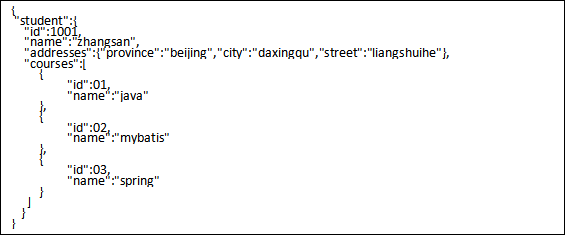 NoSql数据库： 聚合结构。

#  

##  1.5  Redis简介 

Remote Dictionary Server(远程字典服务器),是一个用C语言编写的、开源的、基于内存运行并支持持久化的、高性能的NoSQL[数据库](https://baike.baidu.com/item/数据库).也是当前热门的NoSQL数据库之一。

##  1.6  Redis的特点 

1、支持数据持久化

​	Redis支持数据的持久化，可以将内存中的数据保持在磁盘中，重启的时候可以再次加载进行使用。

2、支持多种数据结构

Redis不仅仅支持简单的key-value类型的数据，同时还提供list，set，zset，hash等数据结构的存储。

3、支持数据备份

​	Redis支持数据的备份，即master-slave模式的数据备份。

 

 

##  1.7  Linux上安装Redis 

第一步：下载redis

https://redis.io/

 

第二步：使用Xftp工具上传redis-5.0.2.tar.gz到linux 系统。

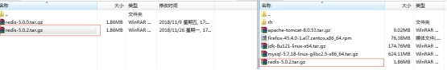 

第三步：解压redis-5.0.2.tar.gz到/opt目录

 

第四步：编译redis，进入解压目录，并且执行make命令：

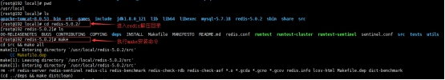 

报错：gcc命令未找到

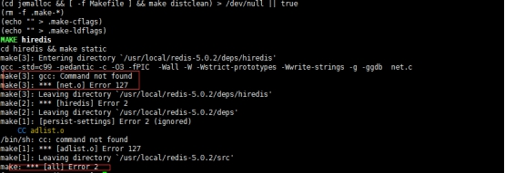 

第五步：安装gcc。

什么是 gcc ? 

gcc是GNU compiler collection的缩写，它是Linux下一个编译器集合(相当于javac )，是c或c++程序的编译器。

怎么安装gcc ? 

方式一：在有外网的情况下，使用yum进行安装。执行命令：yum -y install gcc。

方式二：在没有外网的情况下，从光盘里进行安装。

​	1、从终端进入目录：/run/media/root/CentOS 7 x86_64/Packages

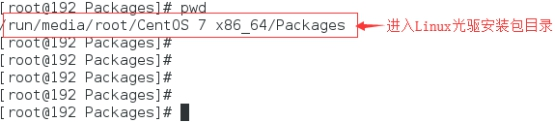 

2、依次执行命令：

​	rpm -ivh libmpc-1.0.1-3.el7.x86_64.rpm 回车

​	rpm -ivh cpp-4.8.5-11.el7.x86_64.rpm 回车

rpm -ivh kernel-headers-3.10.0-514.el7.x86_64.rpm 回车

rpm -ivh glibc-headers-2.17-157.el7.x86_64.rpm 回车

rpm -ivh glibc-devel-2.17-157.el7.x86_64.rpm回车

rpm -ivh libgomp-4.8.5-11.el7.x86_64.rpm回车

rpm -ivh gcc-4.8.5-11.el7.x86_64.rpm回车

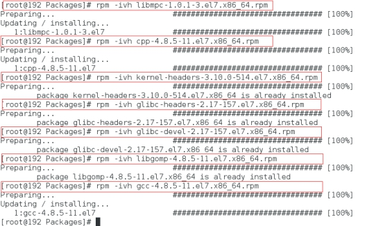 

3、执行gcc –v查看Linux内核版本

​	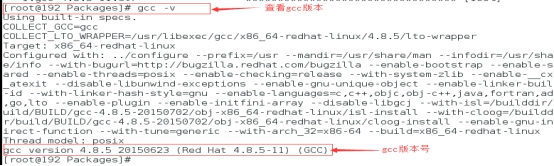

第六步：再次回到redis解压目录执行make命令进行编译

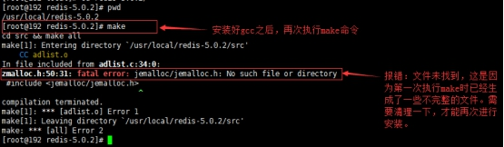 

第七步：进行清理工作

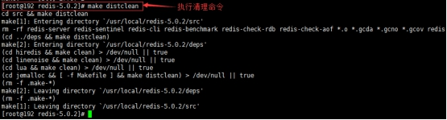 

第八步：再次执行make指令进行编译：

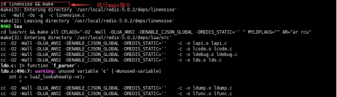 

第九步：执行make install安装redis：

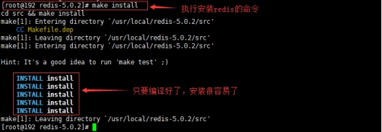 

注意：在make执行之后再执行 make install，该操作则将 src下的许多可执行文件复制到/usr/local/bin 目录下，这样做可以在任意目录执行redis的软件的命令（例如启动，停止，客户端连接服务器等）， make install 可以不用执行，看个人习惯。

查看make编译结果，cd src目录

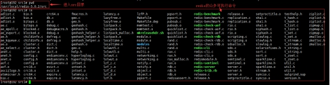 

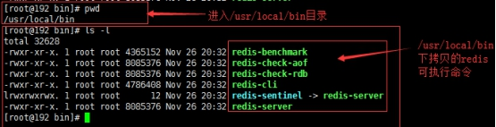 

第十步：启动Redis

 启动方式： 

① 前台启动 redis-server

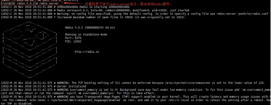 

②后台启动 redis-server &

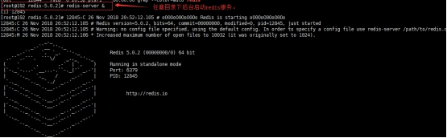 

③根据配置文件启动 启动命令 配置文件 & 

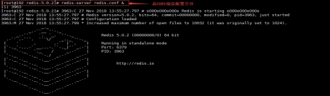 

注意：如果修改了redis的配置文件redis.conf，必须在启动时指定配置文件，否则修改无效！

第十一步：关闭Redis服务

关闭方式：

①使用redis客户端关闭，向服务器发出关闭命令

任意目录下执行 指令redis-cli shutdown

推荐使用这种方式， redis先完成数据操作，然后再关闭。

例如：

 

 

②kill pid 或者 kill -9 pid

这种不会考虑当前应用是否有数据正在执行操作，直接就关闭应用。

先使用 ps -ef | grep redis 查出进程号，在使用 kill pid

 

##  1.8  Re  dis  客户  端 

Redis客户端是一个程序，通过网络连接到Redis服务器，从而实现跟 Redis服务器的交互。

Redis客户端发送命令，同时显示Redis服务器的处理结果。

redis-cli（Redis Command Line Interface）是Redis自带的基于命令行的Redis客户端，用于与服务端交互，我们可以使用该客户端来执行redis的各种命令。

\1. 启动Redis客户端：

\1) 直接连接redis (默认ip127.0.0.1，端口6379)：redis-cli

在任意目录执行  redis-cli

此命令是连接本机127.0.0.1 ，端口6379的redis

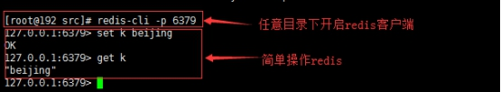 

 

\2) 指定IP和端口连接redis：redis-cli –h 127.0.0.1 -p 6379

-h redis主机IP（可以指定任意的redis服务器）

-p端口号（不同的端口表示不同的redis应用）

 

在任意目录下执行  redis-cli -h 127.0.0.1 -p 6379

 

\2. 退出Redis客户端：exit或者quit指令。

 

##  1.9  Redis  基本  知识 

1） 测试Redis性能

 

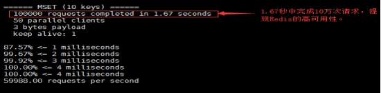 

2） Redis沟通命令，查看状态

redis >ping 返回PONG

解释：输入ping，redis给我们返回PONG，表示redis服务运行正常

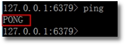 

3） 查看redis服务器的统计信息：info

语法：info [section]

作用：以一种易于解释且易于阅读的格式，返回关于 Redis 服务器的各种信息和统计数值。section 用来返回指定部分的统计信息。 section的值：server , clients ，memory等等。不加section 返回全部统计信息

返回值：指定section的统计信息或全部信息

 

例1：统计server的信息

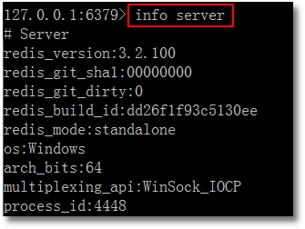 

 

例2：统计全部信息

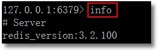 

4） redis默认使用16个库

Redis默认使用16个库，从0到15。 对数据库个数的修改，在redis.conf文件中databases 16，理论上可以配置无限多个。

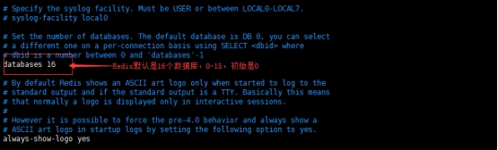 

Redis的库和关系型数据库中的数据库实例类似，但又有一些不同，比如redis中各个库不能自定义命名，只能用序号表示，redis中各个库不是完全独立的，使用时最好一个应用使用一个redis实例，不建议一个redis实例中保存多个应用的数据。Redis实例本身所占存储空间其实是非常小的，因此不会造成存储空间的浪费。

5） 切换库命令：select db

默认使用第0个，如果要使用其他数据库，命令是 select index

 

 

6） 查看当前数据库中key的数目：dbsize

语法：dbsize

作用：返回当前数据库的 key 的数量。

返回值：数字，key的数量

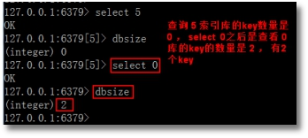 

7） 查看当前数据库中有哪些key：keys *

 

8） 清空当前库：flushdb

 

9） 清空所有数据库：flushall

 

这也体现出redis中的库并不是完全无关的。

10） config get * 获得redis的所有配置值

语法：config get parameter

作用：获取运行中Redis服务器的配置参数， 获取全部配置可以使用*。参数信息来自redis.conf 文件的内容。

 

例1：获取数据库个数 config get databases

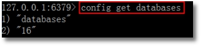 

例2：获取端口号config get port

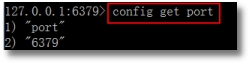 

手册地址：

redis英文版命令大全：https://redis.io/commands

redis中文版命令大全：http://redisdoc.com/

##  1.10  Redis的5种  数据  结构 

#####  A、  字符串类型   string 

字符串类型是Redis中最基本的数据结构，它能存储任何类型的数据，包括二进制数

据，序列化后的数据，JSON化的对象甚至是一张图片。最大512M。

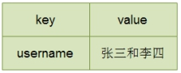 

#####  B、  列表类型   list 

Redis列表是简单的字符串列表，按照插入顺序排序，元素可以重复。你可以添加一个元素到列表的头部（左边）或者尾部（右边）,底层是个链表结构。

 

#####  C、  集合类型   set 

Redis的Set是string类型的无序无重复集合。

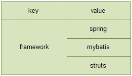 

#####  D、  哈希类型   hash 

​	Redis hash 是一个string类型的field和value的映射表，hash特别适合用于存储对象。

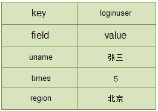 

#####  E、  有序集合类型   zset   （  sorted set  ） 

Redis 有序集合zset和集合set一样也是string类型元素的集合，且不允许重复的成员。

不同的是zset的每个元素都会关联一个分数（分数可以重复），redis通过分数来为集合中的成员进行从小到大的排序。

 

##  1.11  Redis的常用操作命令 

###  1.1.1  R  edis  的  Key  的操作  命令 

####  1.11.1.1  keys 

语法：keys pattern

作用：查找所有符合模式pattern的key.  pattern可以使用通配符。

通配符：

l *：表示0或多个字符，例如：keys * 查询所有的key。

l ？：表示单个字符，例如：wo?d , 匹配 word , wood

l [] ：表示选择[]内的一个字符，例如wo[or]d, 匹配word, wood, 不匹配wold、woord

 

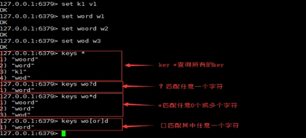 

####  1.11.1.2  exi  sts 

语法：exists key [key…]

作用：判断key是否存在

返回值：整数，存在key返回1，其他返回0。使用多个key，返回存在的key的数量。

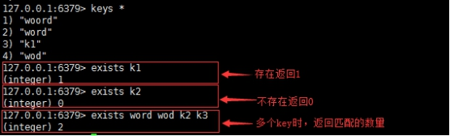 

####  1.11.1.3  move 

语法：move key db

作用：移动key到指定的数据库，移动的key在原库被删除。

返回值：移动成功返回1，失败返回0.

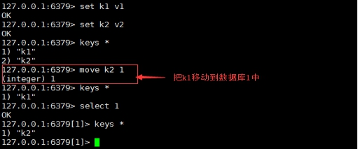 

####  1.11.1.4  ttl 

语法：ttl key

作用：查看key的剩余生存时间（ttl: time to live），以秒为单位。

返回值：

l -1 ：没有设置key的生存时间， key永不过期。

l -2：key不存在

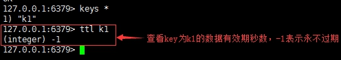 

 

####  1.11.1.5  expire 

语法：expire key seconds

作用：设置key的生存时间，超过时间，key自动删除。单位是秒。

返回值：设置成功返回数字 1，其他情况是 0 。

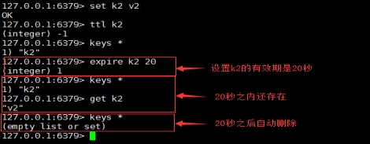 

####  1.11.1.6  type 

语法：type key

作用：查看key所存储值的数据类型

返回值：字符串表示的数据类型

l none (key不存在)

l string (字符串)

l list (列表)

l set (集合)

l zset (有序集)

l hash (哈希表)

 

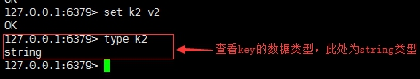 

####  1.11.1.7  r  e  name 

语法：rename key newkey

作用：将key改为名newkey。当 key 和 newkey 相同，或者 key 不存在时，返回一个错误。

当 newkey 已经存在时， RENAME 命令将覆盖旧值。

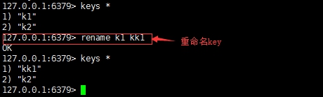 

####  1.11.1.8  del 

语法：del key [key…]

作用：删除存在的key，不存在的key忽略。

返回值：数字，删除的key的数量。

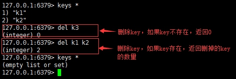 

###  1.11.1  字符  串类型（  string  ） 

字符串类型是Redis中最基本的数据类型，它能存储任何形式的字符串，包括二进制数

据，序列化后的数据，JSON化的对象甚至是一张图片。

字符串类型的数据操作总的思想是通过key操作value，key是数据标识，value是我们感

兴趣的业务数据。

####  1.11.1.1  set 

语法：set key value

功能：将字符串值 value 设置到 key 中，如果key已存在，后放的值会把前放的值覆盖掉。

返回值：OK表示成功

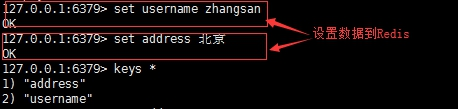 

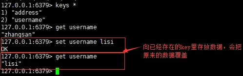 

####  1.11.1.2  get 

语法：get key

功能：获取 key 中设置的字符串值

返回值：key存在，返回key对应的value；

​		key不存在，返回nil

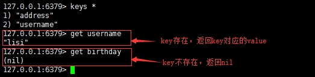 

####  1.11.1.3  append 

语法：append key value

功能：如果 key 存在，则将 value 追加到 key 原来旧值的末尾

​	 如果 key 不存在，则将key 设置值为 value

返回值：追加字符串之后的总长度(字符个数)

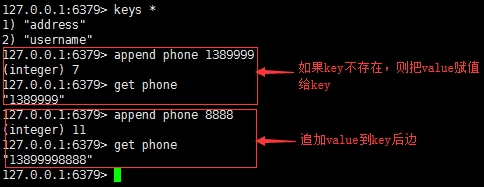 

####  1.11.1.4  strlen 

语法：strlen key

功能：返回 key 所储存的字符串值的长度

返回值：如果key存在，返回字符串值的长度；

​		key不存在，返回0

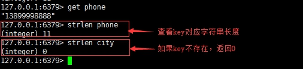 

####  1.11.1.5  incr 

语法：incr key

功能：将 key 中储存的数字值加1，如果 key 不存在，则 key 的值先被初始化为 0 再执行incr操作。

返回值：返回加1后的key值

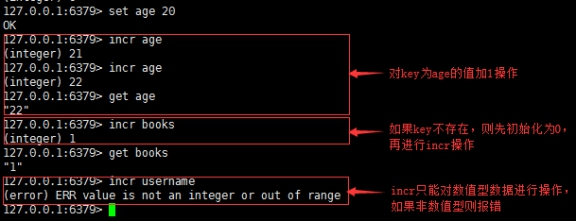 

####  1.11.1.6  decr 

语法：decr key

功能：将 key 中储存的数字值减1，如果 key 不存在，则么 key 的值先被初始化为 0 再执行 decr 操作。

返回值：返回减1后的key值

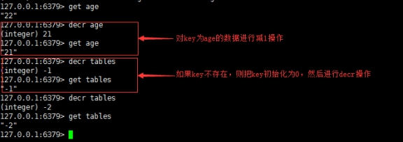 

####  1.11.1.7  incrby 

语法：incrby key offset

功能：将 key 所储存的值加上增量值，如果 key 不存在，则 key 的值先被初始化为 0 再执行 INCRBY 命令。

返回值：返回增量之后的key值。

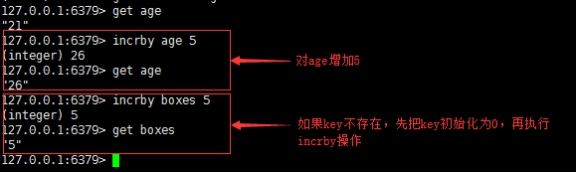 

####  1.11.1.8  decrby 

语法：decrby key offset

功能：将 key 所储存的值减去减量值，如果 key 不存在，则 key 的值先被初始化为 0 再执行 DECRBY 命令。

返回值：返回减量之后的key值。

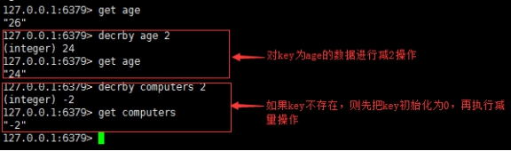 

####  1.11.1.9  getrange 

语法：getrange key startIndex endIndex

功能：获取 key 中字符串值从 startIndex 开始到 endIndex 结束的子字符串,包括startIndex和endIndex, 负数表示从字符串的末尾开始，-1 表示最后一个字符。

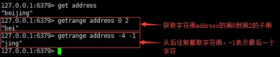 

####  1.11.1.10  setrange 

语法：setrange key offsetIndex value

功能：用value覆盖key的存储的值从offset开始。

返回值：修改后的字符串的长度。

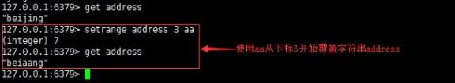 

####  1.11.1.11  setex 

语法：setex key seconds value

功能：设置key的值，并将 key 的生存时间设为 seconds (以秒为单位)  ，如果key已经存在，将覆盖旧值。

返回值：设置成功，返回OK。

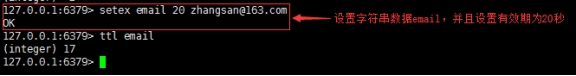 

####  1.11.1.12  setnx 

语法：setnx key value

功能：setnx 是 set if not exists 的简写，如果key不存在，则 set 值，存在则不设置值。

返回值：设置成功，返回1

设置失败，返回0

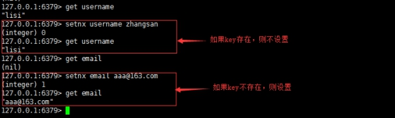 

####  1.11.1.13  mset 

语法：mset key value [key value…]

功能：同时设置一个或多个 key-value 对

返回值：设置成功，返回OK。

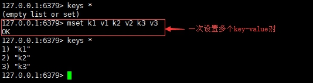 

####  1.11.1.14  mget 

语法：mget key [key …]

功能：获取所有(一个或多个)给定 key 的值

返回值：包含所有key的列表，如果key不存在，则返回nil。

 

####  1.11.1.15  msetnx 

语法：msetnx key value[key value…]

功能：同时设置一个或多个 key-value 对，如果有一个key是存在的，则设置不成功。

返回值：设置成功，返回1

设置失败，返回0

 

###  1.1.2  列表  （  List  ） 

Redis列表是简单的字符串列表，按照插入顺序排序，左边（头部）、右边（尾部）或者中间都可以添加元素。链表的操作无论是头或者尾效率都极高，但是如果对中间元素进行操作，那效率会大大降低了。

列表类型的数据操作总的思想是通过key和下标操作value，key是数据标识，下标是数据在列表中的位置，value是我们感兴趣的业务数据。

 

####  1.11.1.16  lpush 

语法：lpush key value [value…]

功能：将一个或多个值 value 插入到列表 key 的最左边（表头），各个value值依次插入到表头位置。

返回值：插入之后的列表的长度。

 

####  1.11.1.17  rpush 

语法：rpush key value [value…]

功能：将一个或多个值 value 插入到列表 key 的最右边（表尾），各个 value 值按依次插入到表尾。

返回值：插入之后的列表的长度。

 

####  1.11.1.18  lrange 

语法：lrange key startIndex endIndex

功能：获取列表 key 中指定下标区间内的元素，下标从0开始，到列表长度-1；下标也可以是负数，表示列表从后往前取，-1表示倒数第一个元素，-2表示倒数第二个元素，以此类推；startIndex和endIndex超出范围不会报错。

返回值：获取到的元素列表。

 

####  1.11.1.19  lpop 

语法：lpop key

功能：移除并返回列表key头部第一个元素，即列表左侧的第一个元素。

返回值：列表左侧第一个元素的值；列表key不存在，返回nil。

 

####  1.11.1.20  rpop 

语法：rpop key

功能：移除并返回列表key尾部第一个元素，即列表右侧的第一个元素。

返回值：列表右侧第一个元素的值；列表key不存在，返回nil。

 

####  1.11.1.21  lindex 

语法：lindex key index

功能：获取列表 key 中下标为指定 index 的元素，列表元素不删除，只是查询。0 表示列表的第一个元素，1 表示列表的第二个元素；index也可以负数的下标， -1 表示列表的最后一个元素， -2 表示列表的倒数第二个元素，以此类推。

返回值：key存在时，返回指定元素的值；

​	Key不存在时，返回nil。

 

####  1.11.1.22  llen 

语法：llen key

功能：获取列表 key 的长度

返回值：数值，列表的长度；key不存在返回0

 

####  1.11.1.23  lrem 

语法：lrem key count value

功能：根据参数 count 的值，移除列表中与参数 value 相等的元素，

count >0 ，从列表的左侧向右开始移除；

count < 0 从列表的尾部开始移除；

count = 0移除表中所有与 value 相等的值。

返回值：数值，移除的元素个数

 

####  1.11.1.24  ltrim 

语法：ltrim key startIndex endIndex

功能：截取key的指定下标区间的元素，并且赋值给key。下标从0开始，一直到列表长度-1；下标也可以是负数，表示列表从后往前取，-1表示倒数第一个元素，-2表示倒数第二个元素，以此类推；startIndex和endIndex超出范围不会报错。

返回值：执行成功返回ok

 

####  1.11.1.25  lset 

语法：lset key index value

功能：将列表 key 下标为 index 的元素的值设置为 value。

功能：设置成功返回ok ; key不存在或者index超出范围返回错误信息。

 

####  1.11.1.26  linsert 

语法：linsert key before/after pivot value

功能：将值 value 插入到列表 key 当中位于值 pivot 之前或之后的位置。key不存在或者pivot不在列表中，不执行任何操作。

返回值：命令执行成功，返回新列表的长度。没有找到pivot返回 -1， key不存在返回0。

 

###  1.11.2  集合类型(set) 

Redis的Set是string类型的无序不重复集合。

集合类型的数据操作总的思想是通过key确定集合，key是集合标识，元素没有下标，只有直接操作业务数据和数据的个数。

 

####  1.11.2.1  s  ad  d 

语法：sadd key member [member…]

功能：将一个或多个 member 元素加入到集合 key 当中，已经存在于集合的 member 元素将被忽略，不会再加入。

返回值：加入到集合的新元素的个数(不包括被忽略的元素)。

 

####  1.11.2.2  smembers 

语法：smembers key

功能：获取集合 key 中的所有成员元素，不存在的key视为空集合。

返回值：返回指定集合的所有元素集合，不存在的key，返回空集合。

 

####  1.11.2.3  sismember 

语法：sismember key member

功能：判断 member 元素是否是集合 key 的元素

返回值：member是集合成员返回1，其他返回 0 。

 

####  1.11.2.4  scard 

语法：scard key

功能：获取集合里面的元素个数

返回值：数字，key的元素个数。其他情况返回 0 。

 

####  1.11.2.5  srem 

语法：srem key member [member…]

功能：移除集合中一个或多个元素，不存在的元素被忽略。

返回值：数字，成功移除的元素个数，不包括被忽略的元素。

 

####  1.11.2.6  srandmember 

语法：srandmember key[count]

功能：只提供key，随机返回集合中一个元素，元素不删除，依然在集合中；

​	 提供了count时，count 正数, 返回包含count个数元素的集合，集合元素各不重复。count是负数，返回一个count绝对值的长度的集合，集合中元素可能会重复多次。

返回值：一个元素或者多个元素的集合

 

####  1.11.2.7  spop 

语法：spop key[count]

功能：随机从集合中删除一个或count个元素。

返回值：被删除的元素，key不存在或空集合返回nil。

 

####  1.11.2.8  smove 

语法：smove src dest member

功能：将 member 元素从src集合移动到dest集合，member不存在，smove不执行操作，返回0，如果dest存在member，则仅从src中删除member。

返回值：成功返回 1 ，其他返回 0 。

 

####  1.11.2.9  sdiff 

语法：sdiff key key [key…]

功能：返回指定集合的差集，以第一个集合为准进行比较，即第一个集合中有但在其它任何集合中都没有的元素组成的集合。

返回值：返回第一个集合中有而后边集合中都没有的元素组成的集合，如果第一个集合中的元素在后边集合中都有则返回空集合。

 

####  1.11.2.10  sinter 

语法：sinter key key [key…]

功能：返回指定集合的交集，即指定的所有集合中都有的元素组成的集合。

返回值：交集元素组成的集合，如果没有则返回空集合。

 

####  1.11.2.11  sunion 

语法：sunion key key [key…]

功能：返回指定集合的并集，即指定的所有集合元素组成的大集合，如果元素有重复，则保留一个。

返回值：返回所有集合元素组成的大集合，如果所有key都不存在，返回空集合。

 

###  1.11.3  哈希类型(hash) 

Redis的hash 是一个string类型的key和value的映射表，这里的value是一系列的键值对，hash特别适合用于存储对象。

哈希类型的数据操作总的思想是通过key和field操作value，key是数据标识，field是域，value是我们感

兴趣的业务数据。

 

####  1.11.3.1  hset 

语法：hset  key  field  value [field  value …]

功能：将键值对field-value设置到哈希列表key中，如果key不存在，则新建哈希列表，然后执行赋值，如果key下的field已经存在，则value值覆盖。

返回值：返回设置成功的键值对个数。

 

####  1.11.3.2  hget 

语法：hget key field

功能：获取哈希表 key 中给定域 field 的值。

返回值：field域的值，如果key不存在或者field不存在返回nil。

 

####  1.11.3.3  hmset 

语法：hmset key  field value [field value…]

功能：同时将多个 field-value (域-值)设置到哈希表 key 中，此命令会覆盖已经存在的field，hash表key不存在，创建空的hash表，再执行hmset.

返回值：设置成功返回ok，如果失败返回一个错误。

 

####  1.11.3.4  hmget 

语法：hmget key field [field…]

功能：获取哈希表 key 中一个或多个给定域的值

返回值：返回和field顺序对应的值，如果field不存在，返回nil。

 

####  1.11.3.5  hgetall 

语法：hgetall key

功能：获取哈希表 key 中所有的域和值

返回值：以列表形式返回hash中域和域的值，key不存在，返回空hash.

 

####  1.11.3.6  hdel 

语法：hdel key field [field…]

功能：删除哈希表 key 中的一个或多个指定域field，不存在field直接忽略。

返回值：成功删除的field的数量。

 

####  1.11.3.7  hlen 

语法：hlen key

功能：获取哈希表 key 中域field的个数

返回值：数值，field的个数。key不存在返回0.

 

####  1.11.3.8  hexists 

语法：hexists key field

功能：查看哈希表 key 中，给定域 field 是否存在

返回值：如果field存在，返回1，其他返回0。

 

####  1.11.3.9  hkeys 

语法：hkeys key

功能：查看哈希表 key 中的所有field域列表

返回值：包含所有field的列表，key不存在返回空列表

 

####  1.11.3.10  hvals 

语法：hvals key

功能：返回哈希表 中所有域的值列表

返回值：包含哈希表所有域值的列表，key不存在返回空列表。

 

####  1.11.3.11  hincrby 

语法：hincrby key field int

功能：给哈希表key中的field域增加int

返回值：返回增加之后的field域的值

 

####  1.11.3.12  hincrbyfloat 

语法：hincrbyfloat key field float

功能：给哈希表key中的field域增加float

返回值：返回增加之后的field域的值

 

####  1.11.3.13  hsetnx 

语法：hsetnx key field value

功能：将哈希表 key 中的域 field 的值设置为 value ，当且仅当域 field 不存在的时候才设置，否则不设置。

返回值：设值成功返回1，其他返回0.

 

###  1.11.4  有序集合类型(Zset) 

Redis 有序集合zset和集合set一样也是string类型元素的集合，且不允许重复的成员。

不同的是zset的每个元素都会关联一个分数（分数可以重复），redis通过分数来为集合中的成员进行从小到大的排序。

####  1.11.4.1  zadd 

语法：zadd key score member [score member…]

功能：将一个或多个 member 元素及其 score 值加入到有序集合 key 中，如果member存在集合中，则覆盖原来的值；score可以是整数或浮点数.

返回值：数字，新添加的元素个数.

 

####  1.11.4.2  zrange 

语法：zrange key startIndex endIndex [WITHSCORES]

功能：查询有序集合，指定区间的内的元素。集合成员按score值从小到大来排序；startIndex和endIndex都是从0开始表示第一个元素，1表示第二个元素，以此类推； startIndex和endIndex都可以取负数，表示从后往前取，-1表示倒数第一个元素；WITHSCORES选项让score和value一同返回。

返回值：指定区间的成员组成的集合。

 

####  1.11.4.3  zrangebyscore 

语法：zrangebyscore key min max [WITHSCORES ] [LIMIT offset count]

功能：获取有序集 key 中，所有 score 值介于 min 和 max 之间（包括min和max）的成员，有序成员是按递增（从小到大）排序；

​	 使用符号”(“ 表示包括min但不包括max；

​	 withscores 显示score和 value；

   limit用来限制返回结果的数量和区间，在结果集中从第offset个开始，取count个。

返回值：指定区间的集合数据

 

 

####  1.11.4.4  zrem 

语法：zrem key member [member…]

功能：删除有序集合 key 中的一个或多个成员，不存在的成员被忽略。

返回值：被成功删除的成员数量，不包括被忽略的成员。

 

####  1.11.4.5  zcard 

语法：zcard key

作用：获取有序集 key 的元素成员的个数。

返回值：key存在，返回集合元素的个数； key不存在，返回0。

 

####  1.11.4.6  zcount 

语法：zcount key min max

功能：返回有序集 key 中， score 值在 min 和 max 之间(包括 score 值等于 min 或 max )的成员的数量。

返回值：指定有序集合中分数在指定区间内的元素数量。

 

####  1.11.4.7  zrank 

语法：zrank key member

功能：获取有序集 key 中成员 member 的排名，有序集成员按 score 值从小到大顺序排列，从0开始排名，score最小的是0 。

返回值：指定元素在有序集合中的排名；如果指定元素不存在，返回nil。

 

####  1.11.4.8  zscore 

语法：zscore key member

功能：获取有序集合key中元素member的分数。

返回值：返回指定有序集合元素的分数。

 

####  1.11.4.9  zrevrank 

语法：zrevrank key member

功能：获取有序集 key 中成员 member 的排名，有序集成员按 score 值从大到小顺序排列，从0开始排名，score最大的是0 。

返回值：指定元素在有序集合中的排名；如果指定元素不存在，返回nil。

 

####  1.11.4.10  z  rev  range 

语法：zrevrange key startIndex endIndex [WITHSCORES]

功能：查询有序集合，指定区间的内的元素。集合成员按score值从大到小来排序；startIndex和endIndex都是从0开始表示第一个元素，1表示第二个元素，以此类推； startIndex和endIndex都可以取负数，表示从后往前取，-1表示倒数第一个元素；WITHSCORES选项让score和value一同返回。

返回值：指定区间的成员组成的集合。

 

####  1.11.4.11  zrevrangebyscore 

语法：zrevrangebyscore key max min  [WITHSCORES ] [LIMIT offset count]

功能：获取有序集 key 中，所有 score 值介于 max 和 min 之间（包括max和min）的成员，有序成员是按递减（从大到小）排序；

​	 使用符号”(“ 表示不包括min和max；

​	 withscores 显示score和 value；

   limit用来限制返回结果的数量和区间，在结果集中从第offset个开始，取count个。

返回值：指定区间的集合数据

 

##  1.12  Redis的配置文件 

###  1.12.1  r  edis.conf存放位置： 

Redis的安装根目录下(/opt/redis-5.0.2)，Redis在启动时会加载这个配置文件，在运行时按照配置进行工作。 这个文件有时候我们会拿出来，单独存放在某一个位置，启动的时候必须明确指定使用哪个配置文件，此文件才会生效。

###  1.12.2  Redis 的网络相关配置 

1、 bind：绑定IP地址，其它机器可以通过此IP访问Redis，默认绑定127.0.0.1，也可以修改为本机的IP地址。

2、port：配置Redis占用的端口，默认是6379。

3、tcp-keepalive：TCP连接保活策略，可以通过tcp-keepalive配置项来进行设置，单位为秒，假如设置为60秒，则server端会每60秒向连接空闲的客户端发起一次ACK请求，以检查客户端是否已经挂掉，对于无响应的客户端则会关闭其连接。如果设置为0，则不会进行保活检测。

###  1.12.3  Redis的常规配置 

1、loglevel：日志级别，开发阶段可以设置成debug，生产阶段通常设置为notice或者warning.

2、logfile：指定日志文件名，如果不指定，Redis只进行标准输出。要保证日志文件所在的目录必须存在，文件可以不存在。还要在redis启动时指定所使用的配置文件，否则配置不起作用。

3、databases：配置Redis数据库的个数，默认是16个。

###  1.12.4  Redis的安全配置 

1、requirepass：配置Redis的访问密码。默认不配置密码，即访问不需要密码验证。此配置项需要在protected-mode=yes时起作用。使用密码登录客户端：redis-cli -h ip -p 6379 -a pwd

###  1.12.5  Redis的RDB配置 

1、save <seconds> <changes>：配置复合的快照触发条件，即Redis 在seconds秒内key改变changes次，Redis把快照内的数据保存到磁盘中一次。默认的策略是：

1分钟内改变了1万次

或者5分钟内改变了10次

或者15分钟内改变了1次

如果要禁用Redis的持久化功能，则把所有的save配置都注释掉。

2、stop-writes-on-bgsave-error：当bgsave快照操作出错时停止写数据到磁盘，这样能保证内存数据和磁盘数据的一致性，但如果不在乎这种一致性，要在bgsave快照操作出错时继续写操作，这里需要配置为no。

3、rdbcompression：设置对于存储到磁盘中的快照是否进行压缩，设置为yes时，Redis会采用LZF算法进行压缩；如果不想消耗CPU进行压缩的话，可以设置为no，关闭此功能。

4、rdbchecksum：在存储快照以后，还可以让Redis使用CRC64算法来进行数据校验，但这样会消耗一定的性能，如果系统比较在意性能的提升，可以设置为no，关闭此功能。

5、dbfilename：Redis持久化数据生成的文件名，默认是dump.rdb，也可以自己配置。

6、dir：Redis持久化数据生成文件保存的目录，默认是./即redis的启动目录，也可以自己配置。

###  1.12.6  Redis AOF配置 

1、appendonly：配置是否开启AOF，yes表示开启，no表示关闭。默认是no。

2、appendfilename：AOF保存文件名

3、appendfsync：AOF异步持久化策略

always：同步持久化，每次发生数据变化会立刻写入到磁盘中。性能较差但数据完整性比较好（慢，安全）
everysec：出厂默认推荐，每秒异步记录一次（默认值）
no：不即时同步，由操作系统决定何时同步。

4、no-appendfsync-on-rewrite：重写时是否可以运用appendsync，默认no，可以保证数据的安全性。

5、auto-aof-rewrite-percentage：设置重写的基准百分比

6、auto-aof-rewrite-min-size：设置重写的基准值

 

##  1.13  Redis的持久化 

redis是内存数据库，它把数据存储在内存中，这样在加快读取速度的同时也对数据安全性产生了新的问题，即当redis所在服务器发生宕机后，redis数据库里的所有数据将会全部丢失。为了解决这个问题，redis提供了持久化功能——RDB和AOF（Append Only File）。

###  1.13.1  RDB 

RDB（Redis DataBase）是 Redis 默认的持久化方案。在指定的时间间隔内，执行指定次数的写操作，则会将内存中的数据写入到磁盘中。即在指定目录下生成一个dump.rdb文件。Redis重启会通过加载dump.rdb文件来恢复数据。

####  1.13.1.1  RDB原理： 

Redis会复制一个与当前进程一样的进程。新进程的所有数据（变量、环境变量、程序计数器等）数值都和原进程一致，但是是一个全新的进程，并作为原进程的子进程，来进行持久化。

整个过程中，主进程是不进行任何IO操作的，这就确保了极高的性能。

如果需要进行大规模数据的恢复，且对于数据恢复的完整性不是非常敏感，那RDB方式要比AOF方式更加的高效。RDB的缺点是最后一次持久化后的数据可能丢失。

####  1.13.1.2  RDB保存的文件： 

RDB保存的文件是dump.rdb文件 ,位置保存在Redis的启动目录。Redis每次同步数据到磁盘都会生成一个dump.rdb文件，新的dump.rdb会覆盖旧的dump.rdb文件。

####  1.13.1.3  配置RDB 持久化策略 

在redis.conf的快照配置中，配置RDB保存的策略。

在客户端执行FLUSHDB或者FLUSHALL或者SHUTDOWN时，也会把快照中的数据保存到dump.rdb，只不过这种操作已经把数据清空了，保存的也是空文件，没有意义。

####  1.13.1.4  手动保存RDB快照 

save命令执行一个同步保存操作，将当前 Redis 实例的所有数据快照(snapshot)以 RDB 文件的形式保存到硬盘。

由于save指令会阻塞所有客户端，所以保存数据库的任务通常由 [BGSAVE](#bgsave) 命令异步地执行，而save作为保存数据的最后手段来使用，当负责保存数据的后台子进程不幸出现问题时使用。

####  1.13.1.5  RDB数据恢复 

通过脚本将Redis产生的dump.rdb文件备份(cp dump.rdb dump_bak.rdb)，每次启动Redis前，把备份的dump.rdb文件替换到Redis相应的目录(在redis.conf中配的的dir目录)下，Redis启动时会加载dump.rdb文件，并且把数据读到内存中。

####  1.13.1.6  RDB小结 

Redis默认开启RDB持久化方式，适合大规模的数据恢复但它的数据一致性和完整性较差。

###  1.13.2  AOF 

AOF(Append Only File)，Redis 默认不开启。它的出现是为了弥补RDB的不足（数据的不一致性），所以它采用日志的形式来记录每个 写操作 ，并 追加 到文件中。Redis 重启会根据日志文件的内容将写指令从前到后执行一次以完成数据的恢复工作。

####  1.13.2.1  AOF原理 

Redis以日志的形式来记录每个写操作，将Redis执行过的所有写指令记录下来(读操作不记录)，

只许追加文件但不可以改写文件，redis启动之初会读取该文件重新构建数据，换言之，redis重启的话就根据日志文件的内容将写指令从前到后执行一次以完成数据的恢复工作。

####  1.13.2.2  AOF保存的文件 

AOF保存的文件是appendonly.aof文件 ,位置保存在Redis的启动目录。如果开启了AOF，Redis每次记录写操作都会往appendonly.aof文件追加新的日志内容。

####  1.13.2.3  配置AOF持久化策略 

在redis.conf的“APPEND ONLY MODE”配置模块中，配置AOF保存策略。

####  1.13.2.4  AOF数据恢复 

通过脚本将Redis产生的appendonly.aof文件备份(cp appendonly.aof appendonly_bak.aof)，每次启动Redis前，把备份的appendonly.aof文件替换到Redis相应的目录(在redis.conf中配的的dir目录)下，只要开启AOF的功能，Redis每次启动，会根据日志文件的内容将写指令从前到后执行一次以完成数据的恢复工作。

但在实际开发中，可能因为某些原因导致appendonly.aof 文件格式异常，从而导致数据还原失败，可以通过命令redis-check-aof --fix appendonly.aof 进行修复 。会把出现异常的部分往后所有写操作日志去掉。

####  1.13.2.5  AOF的重写 

AOF采用文件追加方式，文件会越来越大为避免出现此种情况，新增了重写机制,当AOF文件的大小超过所设定的阈值时，Redis就会启动AOF文件的内容压缩，只保留可以恢复数据的最小指令集。

​	AOF文件持续增长而过大时，会fork出一条新进程来将文件重写(也是先写临时文件最后再rename)，遍历新进程的内存中数据，每条记录有一条的Set语句。重写aof文件的操作，并没有读取旧的aof文件，而是将整个内存中的数据库内容用命令的方式重写了一个新的aof文件，这点和快照有点类似。

Redis会记录上次重写时的AOF大小，默认配置是当AOF文件大小是上次rewrite后大小的一倍且文件大于64M时触发。当然，也可以在配置文件中进行配置。

####  1.13.2.6  AOF小结： 

Redis 需要手动开启AOF持久化方式，AOF 的数据完整性比RDB高，但记录内容多了，会影响数据恢复的效率。

 

 关于Redis持久化的使用：  若只打算用Redis 做缓存，可以关闭持久化。若打算使用Redis 的持久化  ，  建议RDB和AOF都开启。其实RDB更适合做数据的备份，留一后手。AOF出问题了，还有RDB。 

AOF与RDB模式可以同时启用，这并不冲突。如果AOF是可用的，那Redis启动时将自动加载AOF，这个文件能够提供更好的持久性保障。

##  1.14  Redis的事务 

###  1.14.1  Redis的事务 

Redis的事务允许在一次单独的步骤中执行一组命令，并且能够保证将一个事务中的所有命令序列化，然后按顺序执行；在一个Redis事务中，Redis要么执行其中的所有命令，要么什么都不执行。即Redis的事务要能够保证序列化和原子性。

###  1.14.2  Redis事务的常用命令： 

####  1.14.2.1  multi 

​	语法：multi

功能：用于标记事务块的开始。Redis会将后续的命令逐个放入队列中，然后才能使用EXEC命令原子化地执行这个命令序列。

返回值：开启成功返回OK

 

####  1.14.2.2  exec 

语法：exec

功能：在一个事务中执行所有先前放入队列的命令，然后恢复正常的连接状态。

如果在把命令压入队列的过程中报错，则整个队列中的命令都不会执行，执行结果报错；

如果在压队列的过程中正常，在执行队列中某一个命令报错，则只会影响本条命令的执行结果，其它命令正常运行；

当使用WATCH命令时，只有当受监控的键没有被修改时，EXEC命令才会执行事务中的命令;而一旦执行了exec命令，之前加的所有watch监控全部取消。

返回值：这个命令的返回值是一个数组，其中的每个元素分别是原子化事务中的每个命令的返回值。 当使用WATCH命令时，如果事务执行中止，那么EXEC命令就会返回一个Null值。

 

####  1.14.2.3  discard 

语法：discard

功能：清除所有先前在一个事务中放入队列的命令，并且结束事务。

如果使用了WATCH命令，那么DISCARD命令就会将当前连接监控的所有键取消监控。

返回值：清除成功，返回OK。

 

####  1.14.2.4  watch 

语法：watch key [key …]

功能：当某个事务需要按条件执行时，就要使用这个命令将给定的键设置为受监控的。如果被监控的key值在本事务外有修改时，则本事务所有指令都不会被执行。Watch命令相当于关系型数据库中的乐观锁。

返回值：监控成功，返回OK。

 

####  1.14.2.5  unwatch 

语法：unwatch

功能：清除所有先前为一个事务监控的键。

​	 如果在watch命令之后你调用了EXEC或DISCARD命令，那么就不需要手动调用UNWATCH命令。

返回值：清除成功，返回OK。

 

###  1.14.3  Redis事务小结： 

1、单独的隔离操作：事务中的所有命令都会序列化、顺序地执行。事务在执行过程中，不会被其它客户端发来的命令请求所打断，除非使用watch命令监控某些键。

2、不保证事务的原子性：redis同一个事务中如果一条命令执行失败，其后的命令仍然可能会被执行，redis的事务没有回滚。Redis已经在系统内部进行功能简化，这样可以确保更快的运行速度，因为Redis不需要事务回滚的能力。

 

##  1.15  Redis消息的发布与订阅(了解) 

###  1.15.1  Redis发布订阅 

Redis 发布订阅(pub/sub)是一种消息通信模式：发送者(pub)发送消息，订阅者(sub)接收消息。Redis 客户端可以订阅任意数量的频道。

###  1.15.2  Redis发布订阅示意图 

图一：消息订阅者(client2 、 client5 和 client1)订阅频道 channel1：

 

图二：消息发布者发布消息到频道channel1，会被发送到三个订阅者：

 

###  1.15.3  Redis发布订阅的常用命令 

####  1.15.3.1  subscribe 

语法：subscribe channel [channel…]

功能：订阅一个或多个频道的信息

返回值：订阅的消息

 

####  1.15.3.2  publish 

语法：publish chanel message

功能：将信息发送到指定的频道。

返回值：数字。接收到消息订阅者的数量。

 

####  1.15.3.3  psubscribe 

语法：psubscribe pattern [pattern]

功能：订阅一个或多个符合给定模式的频道。模式以 * 作为通配符，例如：news.* 匹配所有以 news. 开头的频道。

返回值：订阅的信息。

 

##  1.16  Redis的主从复制 

###  1.16.1  主从复制 

主机数据更新后根据配置和策略，自动同步到从机的master/slave机制，Master以写为主，Slave以读为主。

###  1.16.2  一主二从 

####  1.16.2.1  一主二从原理 

1、配从(库)不配主(库)

2、配从(库): slaveof 主库IP 主库端口

3、主写从读、读写分离

4、从连前后同

5、主断从待命、从断重新连

####  1.16.2.2  一主二从搭建 

1、一台服务器模拟三台主机：

第一步：将redis.conf 拷贝三份，名字分别是，redis6379.conf，redis6380.conf，redis6381.conf
第二步：修改三个文件的port端口，pid文件名，日志文件名，rdb文件名

​		如：

port 6379

pidfile /var/run/redis_6379.pid

logfile "6379.log"

dbfilename dump6379.rdb
第三步：分别打开三个窗口模拟三台服务器，开启redis服务。

 

 

 

2、查询主从信息：info replication

 

3、写操作6379：

  

4、设置主从关系：

在6380和6381主机上分别执行命令：slaveof 127.0.0.1 6379

 

 

另一种方式，就是修改6380和6381的配置文件，在最后加上：

 

注意：如果主redis设置了密码，从库的redis.conf中还需要设置masterauth为主redis的密码。

5、全量复制：在6380和6381分别执行命令get k1

 

 

6、增量复制：6379执行命令：set k2 v2。然后6380端口和6381端口，分别执行命令：get k2

 

 

 

7、主写从读、读写分离：在6380和6381上执行写操作set k3 v3

 

 

8、主机宕机：6379执行指令shutdown，并查看6380和6381的redis信息

 

 

 

从机原地待命。

9、主机宕机后恢复：重启6379，并且执行写命令set k4 v4；6380和6381上分别执行get k4

 

 

 

主机重启后，一切正常。

10、从机宕机：6380执行指令shutdown，并查看6379和6381的redis信息

 

 

 

11、从机宕机后恢复：重启6380，并查看6380、6379和6381的redis信息

 

 

 

注意：从机跟master断开联系，必须重新连接，除非写进配置文件。

12、从机恢复连主机前，主机写操作：6379执行写命令set k5 v5，6380和6381分别执行命令get k5

 

 

 

13、从机恢复连接主机，6380执行命令：slaveof 127.0.0.1 6379，并且执行命令：get k5

 

14、从机上位：

第一步：主机宕机，6379执行命令：shutdown

 

第二步：6380断开主从关系，执行命令：SLAVEOF no one

 

第三步：重新搭建主从，6381执行命令：info replication，SLAVEOF 127.0.0.1 6380

 

第四步：之前主机恢复，重启6379的Redis服务，并执行命令：info replication

 

在6379主机宕机后，6380从机断开主从关系，6381开始还在原地待命；后来6380从机上位，6381投靠6380，6379主机即使回来但它已是孤寡老人，空头司令。

15、天堂变地狱：6379执行命令saveof 127.0.0.1 6381，并在6379和6381执行info replication

 

 

一台主机配多台从机，一台从机再配多台从机，从而实现了庞大的集群架构。同时也减轻了一台主机的压力，缺点是增加了服务器间的延迟。

###  1.16.3  复制原理 

####  1.16.3.1  全量复制 

slave启动成功连接到master后会发送一个sync命令；Master接到命令启动后台的存盘进程，同时收集所有接收到的用于修改数据集命令，在后台进程执行完毕之后，master将传送整个数据文件到slave,以完成一次完全同步；slave服务在接收到数据库文件数据后，将其存盘并加载到内存中。

只要是重新连接master,一次完全同步（全量复制)将被自动执行。

####  1.16.3.2  增量复制 

Master将新的所有收集到的修改命令依次传给slave,完成同步。

 

###  1.16.4  哨兵模式 

####  1.16.4.1  哨兵模式原理 

从机上位的自动版。Redis提供了哨兵的命令，哨兵命令是一个独立的进程，哨兵通过发送命令，来监控主从服务器的运行状态，如果检测到master故障了根据投票数自动将某一个slave转换master，然后通过消息订阅模式通知其它slave，让它们切换主机。然而，一个哨兵进程对Redis服务器进行监控，可能会出现问题，为此，我们可以使用多哨兵进行监控。

####  1.16.4.2  哨兵模式搭建 

1—7步跟1.17.2.2一主二从搭建一样：一台服务器模拟三台主机、查询主从信息、写操作6379、设置主从关系、全量复制、增量复制、主写从读、读写分离。

8、创建redis_sentinel.conf文件，并编辑里边的内容：sentinel monitor dc-redis 127.0.0.1 6379 1，表示：指定监控主机的ip地址，port端口，得到哨兵的投票数(当哨兵投票数大于或者等于此数时切换主从关系)。

9、新开窗口，启动哨兵：redis-sentinel /opt/redis-5.0.2/redis_sentinel.conf

 

10、主机宕机：

 

11、等待从机投票，在sentinel窗口中查看打印信息。

 

12、查看6380和6381的redis信息：

 

 

13、原主机恢复，启动6379：

 

 

####  1.16.4.3  哨兵模式搭建(配置文件模式) 

1—7步跟1.17.2.2一主二从搭建一样：一台服务器模拟三台主机、查询主从信息、写操作6379、设置主从关系、全量复制、增量复制、主写从读、读写分离。

8、复制三份redis_ sentinel.conf文件为redis_sentinel26379.conf、redis_sentinel26380.conf、redis_sentinel 26381.conf，并修改内容：

端口分别修改为26379、26380、26381

哨兵监控策略都修改为：

sentinel monitor mymaster 192.168.235.128 6379 2，表示：指定监控主机的ip地址，port端口，得票数多于2时表示需要切换主从关系。

如果设置密码了，都还需要设置密码：

sentinel auth-pass mymaster 123456

9、新开三个窗口，启动哨兵：./redis-sentinel ../myconfs/sentinel26379.conf

 

10、主机宕机：

 

11、等待从机投票，在sentinel窗口中查看打印信息。

 

12、查看6380和6381的redis信息：

 

 

13、原主机恢复，：

 

 

 

###  1.16.5  小结 

####  1.16.5.1  操作： 

1 查看主从复制关系命令：info replication
2 设置主从关系命令：slaveof 主机ip 主机port
3 开启哨兵模式命令：./redis-sentinel sentinel.conf
4 主从复制原则：开始是全量复制，之后是增量复制
5 哨兵模式三大任务：监控，提醒，自动故障迁移

####  1.16.5.2  缺点 

Redis的主从复制最大的缺点就是延迟，主机负责写，从机负责备份，这个过程有一定的延迟，当系统很繁忙的时候，延迟问题会更加严重，从机器数量的增加也会使这个问题更加严重。

##  1.17  Jedis操作Redis 

###  1.17.1  Jedis简介： 

使用Redis官方推荐的Jedis，在java应用中操作Redis。Jedis几乎涵盖了Redis的所有命令。操作Redis的命令在Jedis中以方法的形式出现。

###  1.17.2  Jedis操作Redis 

####  1.17.2.1  Jedis操作key 

####  1.17.2.2  Jedis操作字符串(string)类型数据 

####  1.17.2.3  Jedis操作列表(list)类型数据 

####  1.17.2.4  Jedis操作哈希(hash)类型数据 

####  1.17.2.5  Jedis操作集合(set)类型数据 

####  1.17.2.6  Jedis操作有序集合(zset)类型数据 

####  1.17.2.7  Jedis操作事务 
