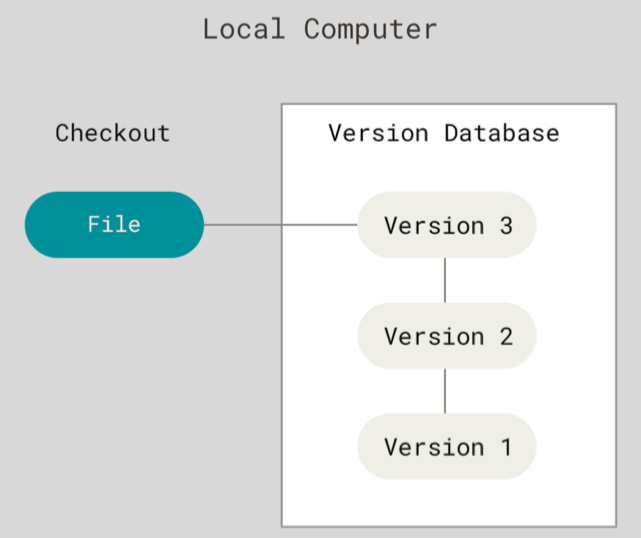
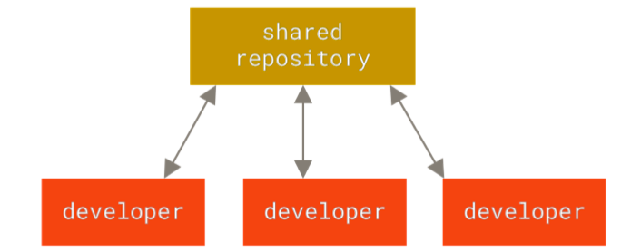
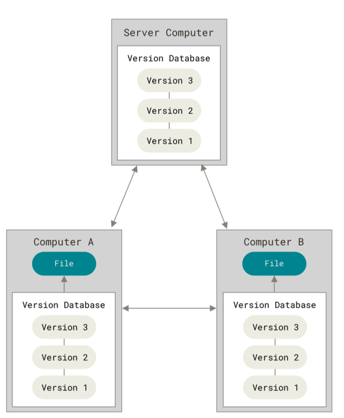
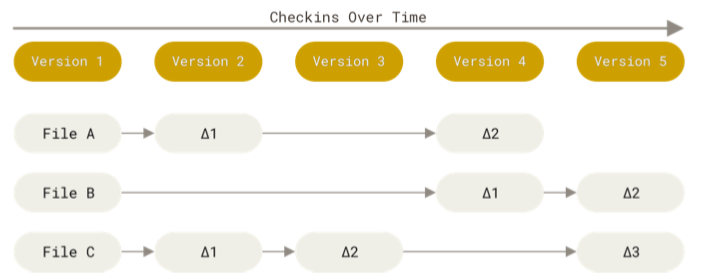
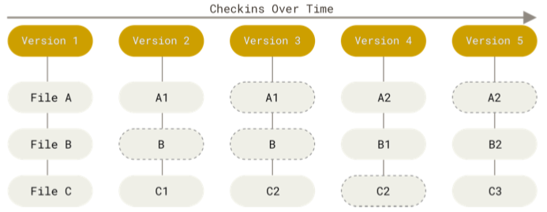
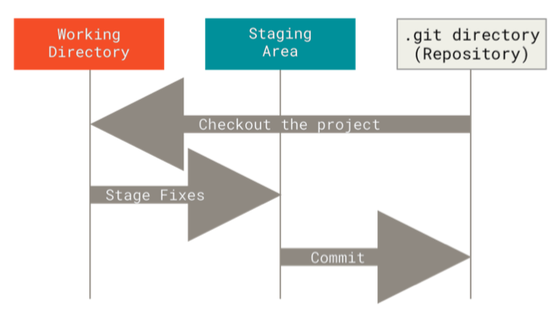
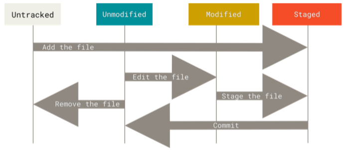

[^版权说明]: Author：*Jerry Xie*，没有经过作者同意，禁止转载，违者必究

[toc]

# Git


# 1. 起步

## 1. 版本控制

1. 本地版本控制
2. 集中版本控制
3. 分布式版本控制

抽象出来可以理解是一对一；一对多；多对多








## 2. Git 简史

诞生于2005

BitKeeper

Linus Torvalds 牛批！！！

• 速度

• 简单的设计

• 对非线性开发模式的强力支持（允许成千上万个并行开发的分支）

• 完全分布式

• 有能力高效管理类似 Linux 内核一样的超大规模项目（速度和数据量）

以上是 git 的特点，但是 git 的最重要的特点是：***直接记录快照，而非差异比较***

后续会详细说，这里还是简单说一下，以免后面忘了


## 3. Git 与其它版本控制的差异

### 其它的版本控制：

相比 Git ，其它大部分系统以文件变更列表的方式存储信息，这类系统（CVS、Subversion、Perforce、Bazaar 等 等） 将它们存储的信息看作是一组基本文件和每个文件随时间逐步累积的差异 （它们通常称作 基于差异 （delta-based） 的版本控制）。***存储每个文件与初始版本的差异***




### Git 版本控制：

Git 不按照以上方式对待或保存数据。反之，Git 更像是把数据看作是对小型文件系统的一系列快照。 在 Git 中，每当你提交更新或保存项目状态时，它基本上就会***对当时的全部文件创建一个快照并保存这个快照的索引***。 为了效率，如果文件没有修改，Git 不再重新存储该文件，而是只保留一个链接指向之前存储的文件。 Git 对待 数据更像是一个 ***快照流***。



这个**快照**是保存在本地，近乎所有操作都是本地执行，如果是想查看历史版本之间的差异，会调本地的快照做差异计算，不用去远程查看


## 4. Git 特性

### 近乎所有操作都是本地执行

在 Git 中的绝大多数操作都只需要访问本地文件和资源，一般不需要来自网络上其它计算机的信息。 如果你习惯 于所有操作都有网络延时开销的集中式版本控制系统，Git 在这方面会让你感到速度之神赐给了 Git 超凡的能 量。 因为你在本地磁盘上就有项目的完整历史，所以大部分操作看起来瞬间完成。

### Git 保证完整性(这个我目前不太理解)

Git 中所有的数据在存储前都计算校验和，然后以校验和来引用。 这意味着不可能在 Git 不知情时更改任何文件 内容或目录内容。 这个功能建构在 Git 底层，是构成 Git 哲学不可或缺的部分。 若你在传送过程中丢失信息或损 坏文件，Git 就能发现。

Git 用以计算校验和的机制叫做 SHA-1 散列（hash，哈希）。 这是一个由 40 个十六进制字符（0-9 和 a-f）组 成的字符串，基于 Git 中文件的内容或目录结构计算出来。 SHA-1 哈希看起来是这样：

> 24b9da6552252987aa493b52f8696cd6d3b00373

Git 中使用这种哈希值的情况很多，你将经常看到这种哈希值。 实际上，Git 数据库中保存的信息都是以文件内 容的哈希值来索引，而不是文件名。

### Git 一般只添加数据

你执行的 Git 操作，几乎只往 Git 数据库中 添加 数据。 你很难使用 Git 从数据库中删除数据，也就是说 Git 几乎 不会执行任何可能导致文件不可恢复的操作。


### 三种状态（重点）

现在请注意，如果你希望后面的学习更顺利，请记住下面这些关于 Git 的概念。 Git 有三种状态，你的文件可能 处于其中之一： 已暂存（staged）、已修改（modified） 和已提交（committed） 。

• 已修改表示修改了文件，但还没保存到数据库中。

• 已暂存表示对一个已修改文件的当前版本做了标记，使之包含在下次提交的快照中。

• 已提交表示数据已经安全地保存在本地数据库中。

这会让我们的 Git 项目拥有三个阶段：工作区、暂存区以及 Git 目录。




## 5. 安装

略


## 6. 初次运行 Git 前的配置

Git 自带一个 git config 的工具来帮助设置控制 Git 外观和行为的配置变量。 这些变量存储在三个不同的位 置：

1. /etc/gitconfig 文件: 包含系统上每一个用户及他们仓库的通用配置。 如果在执行 git config 时带上 --system 选项，那么它就会读写该文件中的配置变量。 （由于它是系统配置文件，因此你需要管理员或 超级用户权限来修改它。）

2. ~/.gitconfig 或 ~/.config/git/config 文件：只针对当前用户。 你可以传递 --global 选项让 Git 读写此文件，这会对你系统上 所有 的仓库生效。

3. 当前使用仓库的 Git 目录中的 config 文件（即 .git/config）：针对该仓库。 你可以传递 --local 选 项让 Git 强制读写此文件，虽然默认情况下用的就是它。。 （当然，你需要进入某个 Git 仓库中才能让该选 项生效。）

每一个级别会覆盖上一级别的配置，所以 .git/config 的配置变量会覆盖 /etc/gitconfig 中的配置变量。


### 用户信息

安装完 Git 之后，要做的第一件事就是设置你的用户名和邮件地址。 这一点很重要，因为每一个 Git 提交都会使 用这些信息，它们会写入到你的每一次提交中，不可更改：

```
$ git config --global user.name "John Doe"
$ git config --global user.email johndoe@example.com
```

再次强调，如果使用了 --global 选项，那么该命令只需要运行一次，因为之后无论你在该系统上做任何事 情， Git 都会使用那些信息。 当你想针对特定项目使用不同的用户名称与邮件地址时，可以在那个项目目录下运 行没有 --global 选项的命令来配置。

很多 GUI 工具都会在第一次运行时帮助你配置这些信息。比如 sourcetree，推荐这个 Git GUI 工具

# 2. Git 基础

获取 Git 仓库

初始化仓库或者克隆一个仓库

在已存在目录中**初始化仓库**

```
$ git init
```

开始追踪这些文件并进行初始提交。 可以通过 git add 命令来指定所需的文件来进行追踪，然后执行 git commit

```
$ git add *.c 
$ git add LICENSE 
$ git commit -m 'initial project version'
```


**克隆仓库**的命令是 git clone <url> 。 比如，要克隆 Git 的链接库 libgit2，可以用下面的命令：

```
$ git clone https://github.com/libgit2/libgit2
```

当你执行 git clone 命令的时候，默认配置 下远程 Git 仓库中的每一个文件的每一个版本都将被拉取下来。 事实上，如果你的服务器的磁盘坏掉了，你通常 可以使用任何一个克隆下来的用户端来重建服务器上的仓库 （虽然可能会丢失某些服务器端的钩子（hook）设 置，但是所有版本的数据仍在，详见 在服务器上搭建 Git ）。----NB again


## 1. Git 工作流程

请记住，你工作目录下的每一个文件都不外乎这两种状态：**已跟踪** 或 **未跟踪**。

已跟踪分为未修改和已修改，未跟踪是新增的文件

编辑过某些文件之后，由于自上次提交后你对它们做了修改，Git 将它们标记为已修改文件。 在工作时，你可以 选择性地将这些修改过的文件放入暂存区，然后提交所有已暂存的修改，如此反复。




### 查看当前文件状态

```
$ git status
选项：[-s][-short]
```

新添加的未跟踪文件前面有 ?? 标记，新添加到暂存区中的文件前面有 A 标记，修改过的文件前面有 M 标记。

### 跟踪新文件

```
$ git add README
```

add 之后是暂存状态，这是个多功能命令：可以用它开 始跟踪新文件，或者把已跟踪的文件放到暂存区，还能用于合并时把有冲突的文件标记为已解决状态等。 将这 个命令理解为“精确地将内容添加到下一次提交中”

### 忽略文件

文件 .gitignore 的格式规范如下：

• 所有空行或者以 # 开头的行都会被 Git 忽略。

• 可以使用标准的 glob 模式匹配，它会递归地应用在整个工作区中。

• 匹配模式可以以（/）开头防止递归。

• 匹配模式可以以（/）结尾指定目录。

• 要忽略指定模式以外的文件或目录，可以在模式前加上叹号（!）取反。


### 查看已暂存和未暂存的修改

想知道具体修改了什么地方，可以用 git diff 命 令。

此命令比较的是工作目录中当前文件和暂存区域快照之间的差异。 也就是修改之后还没有暂存起来的变化内 容。

选项：

[--staged] 比对已暂存 文件与最后一次提交的文件差异

[--cached] 查看已经暂存起来的变化


### 跳过使用暂存区域

尽管使用暂存区域的方式可以精心准备要提交的细节，但有时候这么做略显繁琐。

只要在提交的时候，给 git commit 加上 **-a 选项**，Git 就会自动把所有已经跟踪过的文件暂存 起来一并提交，从而跳过 git add 步骤


### 移除文件

要从 Git 中移除某个文件，就必须要从已跟踪文件清单中移除（确切地说，是从暂存区域移除），然后提交。 可以用 git rm 命令完成此项工作，并连带从工作目录中删除指定的文件，这样以后就不会出现在未跟踪文件清 单中了。

另外一种情况是，我们想把文件从 Git 仓库中删除（亦即从暂存区域移除），但仍然希望保留在当前工作目录 中。 换句话说，你想让文件保留在磁盘，但是并不想让 Git 继续跟踪。这种情况，使用 --cached 选项


### 移动文件

重命名

```
$ git mv file_from file_to
```

其实，运行 git mv 就相当于运行了下面三条命令：

```
$ mv README.md README 
$ git rm README.md
$ git add README
```


### 查看提交历史

```
$ git log
```

#### 选项总览

| 选项            | 说明                                                         |
| --------------- | ------------------------------------------------------------ |
| -p              | 按补丁格式显示每个提交引入的差异。                           |
| --stat          | 显示每次提交的文件修改统计信息。                             |
| --shortstat     | 只显示 --stat 中最后的行数修改添加移除统计。                 |
| --name-only     | 仅在提交信息后显示已修改的文件清单。                         |
| --name-status   | 显示新增、修改、删除的文件清单。                             |
| --abbrev-commit | 仅显示 SHA-1 校验和所有 40 个字符中的前几个字符。            |
| --relative-date | 使用较短的相对时间而不是完整格式显示日期（比如“2 weeks ago”）。 |
| --graph         | 在日志旁以 ASCII 图形显示分支与合并历史。                    |
| --pretty        | 使用其他格式显示历史提交信息。可用的选项包括 oneline、short、full、fuller 和 format（用来定义自己的格式）。 |
| --oneline       | --pretty=oneline --abbrev-commit 合用的简写。                |

#### 选项细节

其中一个比较有用的选项是 -p 或 --patch ，它会显示每次提交所引入的差异（按 补丁 的格式输出）。

比如你想看到每 次提交的简略统计信息，可以使用 --stat 选项


另一个非常有用的选项是 --pretty。 这个选项可以使用不同于默认格式的方式展示提交历史，

子选项：[oneline] [fuller] [full] 

oneline 会将每个提交放在一行显示，在浏览大量的提交时非常有用。 另外还 有 short，full 和 fuller 选项，它们展示信息的格式基本一致，但是详尽程度不一

```
$ git log --pretty=oneline
```

子选项：[format]

```
$ git log --pretty=format:"%h - %an, %ar : %s"
```

| 选项 | 说明                                          |
| ---- | --------------------------------------------- |
| %H   | 提交的完整哈希值                              |
| %h   | 提交的简写哈希值                              |
| %T   | 树的完整哈希值                                |
| %t   | 树的简写哈希值                                |
| %P   | 父提交的完整哈希值                            |
| %p   | 父提交的简写哈希值                            |
| %an  | 作者名字                                      |
| %ae  | 作者的电子邮件地址                            |
| %ad  | 作者修订日期（可以用 --date=选项 来定制格式） |
| %ar  | 作者修订日期，按多久以前的方式显示            |
| %cn  | 提交者的名字                                  |
| %ce  | 提交者的电子邮件地址                          |
| %cd  | 提交日期                                      |
| %cr  | 提交日期（距今多长时间）                      |
| %s   | 提交说明                                      |


子选项：[--graph],增加一些图标的样式显示分支的合并的历史记录


#### 限制输出长度

| 选项              | 说明                                       |
| ----------------- | ------------------------------------------ |
| -<n>              | 仅显示最近的 n 条提交。                    |
| --since, --after  | 仅显示指定时间之后的提交。                 |
| --until, --before | 仅显示指定时间之前的提交。                 |
| --author          | 仅显示作者匹配指定字符串的提交。           |
| --committer       | 仅显示提交者匹配指定字符串的提交。         |
| --grep            | 仅显示提交说明中包含指定字符串的提交。     |
| -S                | 仅显示添加或删除内容匹配指定字符串的提交。 |

除了定制输出格式的选项之外，git log 还有许多非常实用的限制输出长度的选项，也就是只输出一部分的提 交。 之前你已经看到过 -2 选项了，它只会显示最近的两条提交， 实际上，你可以使用类似 -<n> 的选项，其中 的 n 可以是任何整数，表示仅显示最近的 n 条提交。 不过实践中这个选项不是很常用，因为 Git 默认会将所有 的输出传送到分页程序中，所以你一次只会看到一页的内容。

但是，类似 [--since] 和 [--until] 这种按照时间作限制的选项很有用。 例如，下面的命令会列出最近两周的所 有提交：

```
$ git log --since=2.weeks
```

用 --author 选项显示指定作者的提交，用 --grep 选项搜索提交说明中 的关键字。

最后一个很实用的 git log 选项是路径（path）， 如果只关心某些文件或者目录的历史提交，可以在 git log 选项的最后指定它们的路径。 因为是放在最后位置上的选项，所以用两个短划线（--）隔开之前的选项和后面限 定的路径名。

### 取消暂存的文件(危险的命令)

使用 git reset HEAD <file>... 来取消暂存。 所 以，我们可以这样来取消暂存 CONTRIBUTING.md 文件：

```
$ git reset HEAD CONTRIBUTING.md
```

### 撤消对文件的修改(危险的命令)

如果你并不想保留对 CONTRIBUTING.md 文件的修改怎么办？ 你该如何方便地撤消修改——将它还原成上次提 交时的样子（或者刚克隆完的样子，或者刚把它放入工作目录时的样子）？ 幸运的是，git status 也告诉了 你应该如何做。

```
$ git checkout -- CONTRIBUTING.md
```

你对那个文件在本地的任何修 改都会消失——Git 会用最近提交的版本覆盖掉它。 除非你确实清楚不想要对那个文件的本地 修改了，否则请不要使用这个命令。


## 2. 远程仓库的使用

（GitHub&Gitee）

### 查看远程仓库

如果想查看你已经配置的远程仓库服务器，可以运行 git remote 命令。 它会列出你指定的每一个远程服务器 的简写。 如果你已经克隆了自己的仓库，那么至少应该能看到 origin ——这是 Git 给你克隆的仓库服务器的默认 名字

```
$ git remote
```

选项 -v，会显示需要读写远程仓库使用的 Git 保存的简写与其对应的 **URL**


### 添加远程仓库

```
$ git remote add <shortname> <url>
```


### 从远程仓库中抓取与拉取

```
$ git fetch <remote>
$ git pull
```

这个命令会访问远程仓库，从中拉取所有你还没有的数据。 执行完成后，你将会拥有那个远程仓库中所有分支 的引用，可以随时合并或查看。

如果你的当前分支设置了跟踪远程分支（阅读下一节和 Git 分支 了解更多信息）， 那么可以用 git pull 命令 来自动抓取后合并该远程分支到当前分支。 这或许是个更加简单舒服的工作流程。默认情况下，git clone 命 令会自动设置本地 master 分支跟踪克隆的远程仓库的 master 分支（或其它名字的默认分支）。 运行 git pull 通常会从最初克隆的服务器上抓取数据并自动尝试合并到当前所在的分支。


### 推送到远程仓库

当你想分享你的项目时，必须将其推送到上游。 这个命令很简单：git push <remote> <branch>。 当你 想要将 master 分支推送到 origin 服务器时（再次说明，克隆时通常会自动帮你设置好那两个名字）， 那么 运行这个命令就可以将你所做的备份到服务器：

```
$ git push origin master
```

只有当你有所克隆服务器的写入权限，并且之前没有人推送过时，这条命令才能生效。 当你和其他人在同一时 间克隆，他们先推送到上游然后你再推送到上游，你的推送就会毫无疑问地被拒绝。 你必须先抓取他们的工作 并将其合并进你的工作后才能推送。 阅读 Git 分支 了解如何推送到远程仓库服务器的详细信息。

### 查看某个远程仓库

```
$ git remote show origin
```

### 远程仓库的重命名与移除

```
$ git remote rename pb paul
```

## 3. 打标签

像其他版本控制系统（VCS）一样，Git 可以给仓库历史中的某一个提交打上标签，以示重要。 比较有代表性的 是人们会使用这个功能来标记发布结点（ v1.0 、 v2.0 等等）。 在本节中，你将会学习如何列出已有的标签、 如何创建和删除新的标签、以及不同类型的标签分别是什么。

### 列出标签

在 Git 中列出已有的标签非常简单，只需要输入 git tag （可带上可选的 -l 选项 --list）：

### 创建标签

Git 支持两种标签：轻量标签（lightweight）与附注标签（annotated）。

轻量标签很像一个不会改变的分支——它只是某个特定提交的引用。

而附注标签是存储在 Git 数据库中的一个完整对象， 它们是可以被校验的，其中包含打标签者的名字、电子邮件 地址、日期时间， 此外还有一个标签信息，并且可以使用 GNU Privacy Guard （GPG）签名并验证。 通常会建 议创建附注标签，这样你可以拥有以上所有信息。但是如果你只是想用一个临时的标签， 或者因为某些原因不 想要保存这些信息，那么也可以用轻量标签。

### 标签的增删改查

这个用到的时候查询就可以了，这里不做展开

## 4. Git 命令别名

这个用的应该较少

Git 并不会在你输入部分命令时自动推断出你想要的命令。 如果不想每次都输入完整的 Git 命令，可以通过 git config 文件来轻松地为每一个命令设置一个别名。 这里有一些例子你可以试试：

```
$ git config --global alias.co checkout 
$ git config --global alias.br branch 
$ git config --global alias.ci commit 
$ git config --global alias.st status
```


# 3. Git 分支

## 1. 分支简介

为了真正理解 Git 处理分支的方式，我们需要回顾一下 Git 是如何保存数据的。

Git 保存的不是文件的变化或者差异，而是一系列不同时刻的 快照 。  