# MySQL索引优化及性能调优1-8


[toc]

# 1\. 写在前面

学习链接：[https://www.bilibili.com/video/av59623481](https://www.bilibili.com/video/av59623481)

# 2\. MySQL的架构介绍

## 2.1 mysql简介

> 概述:
>
> *   mysql是一个关系型数据库管理系统,由瑞典Mysql AB公司开发,目前属于Oracle.
> *   mysql是一种关系型数据库管理系统,将保存在不同的表中,而不是将所有数据放在一个大仓库内,这样就增加了速度并提高了灵活性.
> *   mysql是开源的,所以你不需要支付额外的费用.
> *   mysql支持大型的数据库,可以处理拥有上万条记录的大型数据库.
> *   mysql使用标准的SQL数据语言形式.
> *   mysql可以运行于多个系统上,并且支持多种语言,这些编程语言包括C,C++,Python,Java,Perl,Eiffel,Ruby和Tcl等.
> *   mysql对PHP有很好的支持,PHP是目前最流行的WEB开发语言.
> *   mysql支持大型数据库,支持5000万条记录的数据库仓库,32为系统表文件最大可支持4GB,64为系统支持最大的表文件8TB.
> *   mysql是可以定制的,采用了GPL协议,你可以修改源码来开发资金的mysql系统.

*   高级Mysql

> 完整的mysql优化需要很深的功底，大公司甚至有专门的DBA写上述
>
> *   mysql内核
> *   sql优化工程师
> *   mysql服务器的优化
> *   各种参数常量设定
> *   查询语句优化
> *   主从复制
> *   软硬件升级
> *   容灾备份
> *   sql编程

## 2.2 MySQL\_Linux版的安装

MySQL5.5下载地址：[MySQL5.5下载地址](https://dev.mysql.com/downloads/mysql/5.5.html#downloads)

> 检查当前系统是否安装过mysql：
>
> *   查询命令：rpm -qa|grep -i mysql
> *   删除命令：rpm -e RPM软件包名称
>     *   删除自带的mysql：yum -y remove mysql-libs-5.1.73-7.el6.x86\_64

> 安装mysql服务端（注意提示）：
>
> *   rpm -ivh MySQL-server-5.5.48-1.linux2.6.i386.rpm
>     *   如果报错libc.so.6：[查看日志](https://blog.csdn.net/xiyuliuyang/article/details/90750049)
>     *   如果警告key ID 5072e1f5: NOKEY： [查看日志](https://blog.csdn.net/Aaron960214/article/details/78451321)

> 安装mysql客户端
>
> *   rpm -ivh MySQL-client-5.5.48-1.linux2.6.i386.rpm

> 查看MySQL安装时创建的mysql用户和mysql组
>
> *   cat /etc/passwd|grep mysql
> *   cat /etc/group|grep mysql
> *   mysqladmin --version

> mysql服务的启动与停止：
>
> *   service mysql start
> *   service mysql stop
>     *   如果报错ERROR! The server quit without updating PID file (/var/lib/mysql/localhost.localdomain.pid).  
>         解决办法：[查看日志](https://www.cnblogs.com/bingco/p/8068243.html)
>     *   查看mysql的进程：ps -ef|grep mysql

```
 mysql_install_db --datadir=/var/lib/mysql
	chown mysql:mysql /var/lib/mysql -R 
```

> mysql服务启动后，开始连接
>
> *   首次连接成功：mysql（不需要输入密码）
> *   给root用户设置密码：/usr/bin/mysqladmin -u root password 123456

> 自启动mysql服务
>
> *   设置开机自启动mysql：chkconfig mysql on
>     *   查看mysql的等级：chkconfig --list | grep mysql
>     *   查看不同等级代表的含义：cat /etc/inittab
>     *   查看开机自动服务有哪些：ntsysv

> 修改配置文件位置
>
> *   版本5.5：cp /usr/share/mysql/my-huge.cnf /etc/my.cnf
> *   版本5.6：cp /usr/share/mysql/my-default.cnf /etc/my.cnf

> 修改字符集和数据存储路径
>
> *   查看字符集
>     *   show variables like ‘character%’;
>     *   show variables like ‘%char%’;
>     *   由于默认的是客户端和服务器都使用的latin1，所以都是乱码
> *   修改

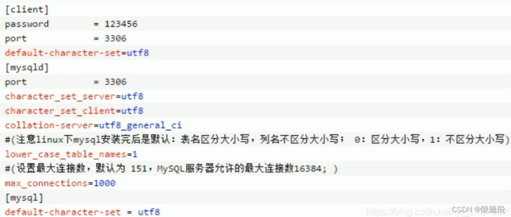

> *   重启mysql
> *   重新连接后，原来的库由于建立于修改字符集之前，所以中文依然是乱码，而新建表中文不是乱码

> *   MySQL的安装位置
>     *   /var/lib/mysql：mysql数据库文件的存放路径
>     *   /usr/share/mysql：配置文件目录
>     *   /usr/bin：相关命令目录
>     *   /etc/init.d/mysql：启停相关脚本

> mysql工具远程连接mysql,连接不上的问题
>
> *   可能是你的帐号不允许从远程登陆，只能在localhost。这个时候只要在localhost的那台电脑，登入mysql后，更改”mysql” 数据库里的 “user” 表里的 “host”项从”localhost”改称”%

```
 mysql>use mysql;
	mysql>update user set host = '%' where user = 'root';
	mysql>select host, user from user;
	mysql>FLUSH RIVILEGES
	//注意一定要重启才生效
	sudo service mysql restart; 
```

## 2.3 MySQL配置文件

> 主要配置文件
>
> *   二进制日志log-bin
>     *   主从复制
> *   错误日志log-error
>     *   默认是关闭的，记录严重的警告和错误信息，每次启动和关闭的详细信息等。
> *   查询日志log
>     *   默认关闭，记录查询的sql语句，如果开启会降低mysql的整体性能，因为记录日志也是需要消耗系统资源的。
> *   数据文件
>     *   两系统
>         *   windows：D:\\devSoft\\MySQLServer5.5\\data目录下可以挑选很多库
>         *   linux
>             *   看看当前系统中的全部库后再进去
>             *   默认路径：/var/lib/mysql
>         *   frm文件：存放表结构
>         *   myd文件：存放表数据
>         *   myi文件：存放表索引
>     *   如何配置
>         *   windows：my.ini文件
>         *   Linux：/etc/my.cnf文件

## 2.4 mysql逻辑架构介绍

> 和其它数据库相比，MySQL有点与众不同，它的架构可以在多种不同场景中应用并发挥良好作用。主要体现在存储引擎的架构上，**插件式的存储引擎架构将查询处理和其它的系统任务以及数据的存储提取相分离**。这种架构可以根据业务的需求和时机需要选择合适的存储引擎。

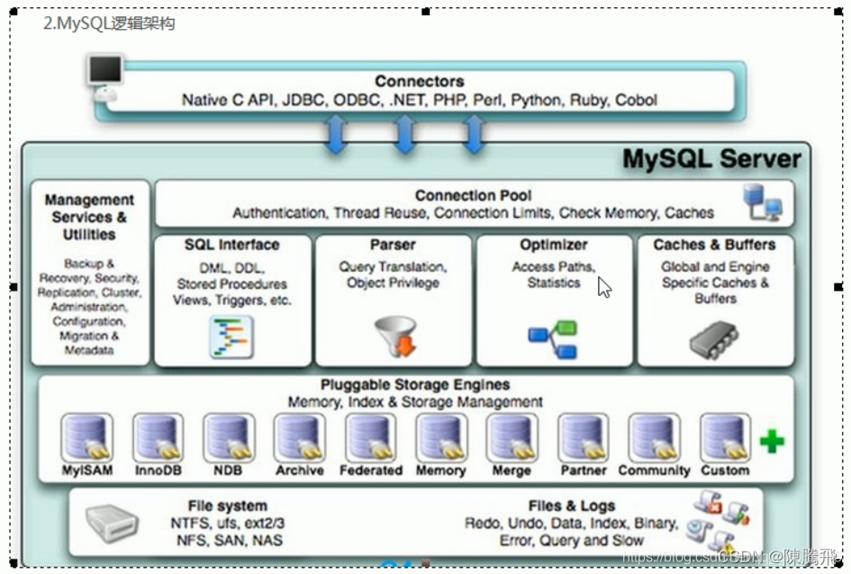

*   从上到下，连接层，服务层，引擎层，存储层  
    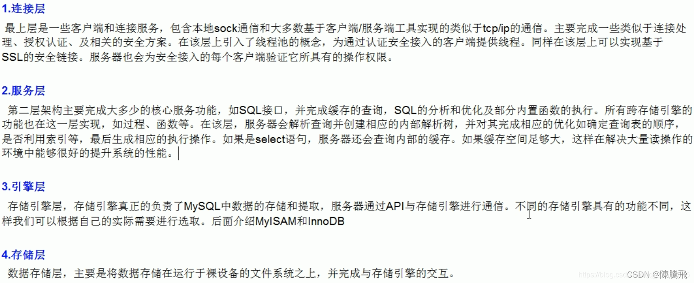

## 2.5 mysql存储引擎

> *   查看命令
> *   如何用命令查看
> *   看你的mysql现在已提供什么存储引擎：show engines;
> *   看你的mysql当前默认的存储引擎：show variables like ‘%storage\_engine%’;

*   MyISAM和InnoDB对比  
    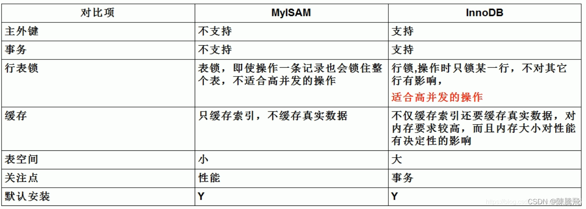
*   阿里巴巴、淘宝用哪个  
    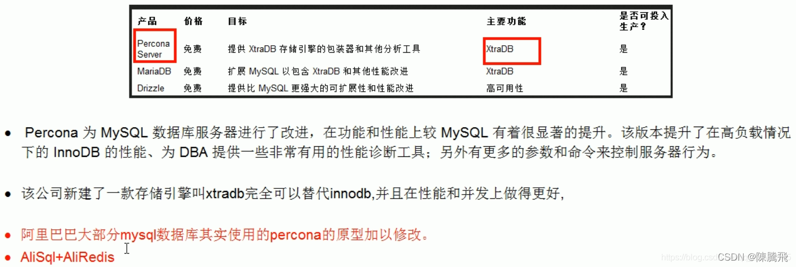

# 3\. 索引优化分析

## 3.1 性能下降SQL慢

> *   执行时间长，等待时间长
>     *   查询语句写的烂
>     *   索引失效
>         *   单值索引
>         *   复合索引
>     *   关联查询太多join（设计缺陷或不得已的需求）
>     *   服务器调优及各个参数设置（缓冲、线程数等）

*   SQL执行顺序
    *   手写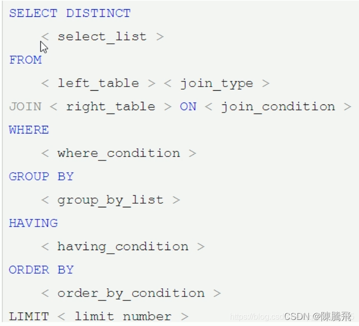
    *   机读  
        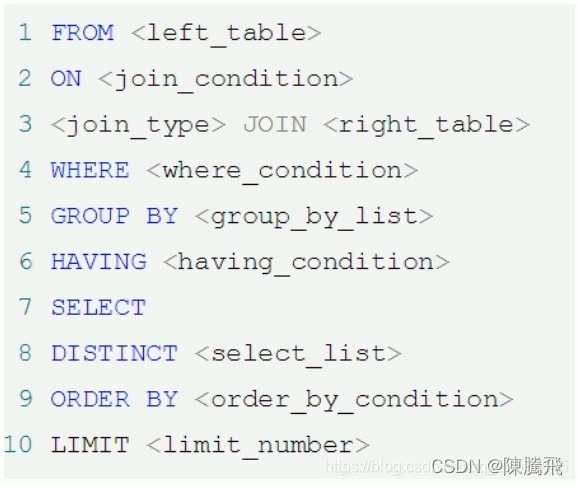

> 可以看到，一共有十一个步骤，最先执行的是FROM操作，最后执行的是LIMIT操作。每个操作都会产生一个虚拟表，该虚拟表作为一个处理的输入，看下执行顺序：
>
> 1.  FROM:对FROM子句中的左表<left\_table>和右表<right\_table>执行笛卡儿积，产生虚拟表VT1;
> 2.  ON: 对虚拟表VT1进行ON筛选，只有那些符合<join\_condition>的行才被插入虚拟表VT2;
> 3.  JOIN: 如果指定了OUTER JOIN(如LEFT OUTER JOIN、RIGHT OUTER JOIN)，那么保留表中未匹配的行作为外部行添加到虚拟表VT2，产生虚拟表VT3。如果FROM子句包含两个以上的表，则对上一个连接生成的结果表VT3和下一个表重复执行步骤1~步骤3，直到处理完所有的表;
> 4.  WHERE: 对虚拟表VT3应用WHERE过滤条件，只有符合<where\_condition>的记录才会被插入虚拟表VT4;
> 5.  GROUP By: 根据GROUP BY子句中的列，对VT4中的记录进行分组操作，产生VT5;
> 6.  CUBE|ROllUP: 对VT5进行CUBE或ROLLUP操作，产生表VT6;
> 7.  HAVING: 对虚拟表VT6应用HAVING过滤器，只有符合<having\_condition>的记录才会被插入到VT7;
> 8.  SELECT: 第二次执行SELECT操作，选择指定的列，插入到虚拟表VT8中;
> 9.  DISTINCT: 去除重复，产生虚拟表VT9;
> 10.  ORDER BY: 将虚拟表VT9中的记录按照<order\_by\_list>进行排序操作，产生虚拟表VT10;
> 11.  LIMIT: 取出指定街行的记录，产生虚拟表VT11，并返回给查询用户

*   总结  
    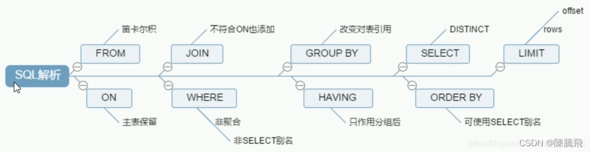
*   Join图-7种JOIN  
    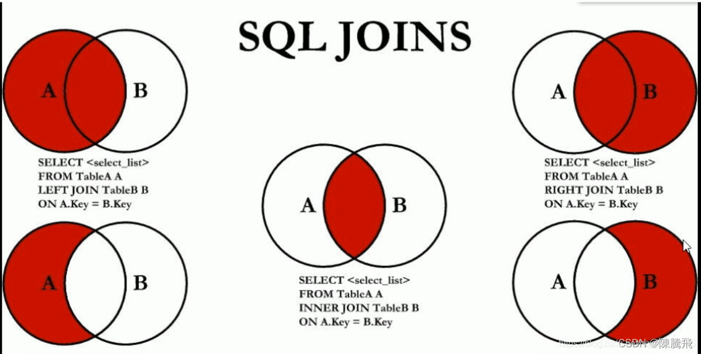

## 3.2 索引简介

**索引是什么**？

> MySQL官方对索引的定义为：索引（Index）是帮助MySQL高效获取数据的数据结构。可以得到索引的本质：索引是数据结构。

> *   索引的目的在于提高查询速度，可以类别字典
> *   如果要查询"mySql"这个单词，我们肯定需要定位到m字母，然后从上往下找到y字母，在找到剩下的Sql
> *   如果没有索引，那么你可能乣a—z，如果我想找到Java开头的单词呢？或者Oracle开头的单词呢？
> *   是不是觉得没有索引，这个事情根本无法完成？

> 你可以简单理解为“排好序的快速查找数据结构”

**详解（B树）**  
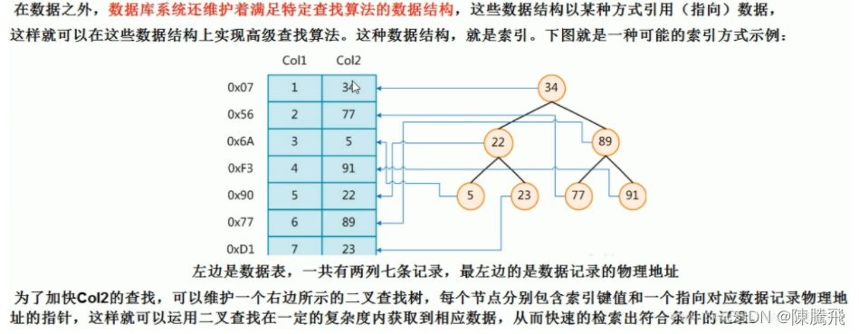  
**结论:**

> 数据本身之外，数据库还维护着一个满足特定查找算法的数据结构，这些数据结构以某种方式指向数据，这样就可以在这些数据结构的基础上实现高级查找算法，这种数据结构就是索引。
>
> *   一般来说索引本身也很大，不可能全部存储在内存中，因此索引往往以索引文件的形式存储在磁盘上。
> *   **我们平常所说的索引，如果没有特别指明，都是指B树（多路搜索树，并不一定是二叉的）结构组织的索引**。其中`聚集索引，次要索引，覆盖索引，复合索引，前缀索引，唯一索引默认的都是使用B+树索引，统称索引`。当然，除了B+树这种类型的索引之外，还有哈希索引（hash index）等。

**优势:**

> *   类似大学图书馆建书目索引，**提高数据检索的效率**，降低数据库的IO成本。
> *   通过索引列对数据进行排序，**降低数据排序的成本**，降低了CPU的消耗。

**劣势:**

> *   实际上索引也是一张表，该表保存了主键与索引字段，并指向实体表的记录，所以索引列也是要占用空间的。
> *   虽然索引大大提高了查询速度，同时却会降低更新表的速度，如对表进行INSERT、UPDATE和DELETE。因为更新表时，MySQL不仅要保存数据，还要保存一下索引文件每次更新添加了索引列的字段，都会调整因为更新所带来的键值变化后的索引信息。
> *   索引只是提高效率的一个因素，如果你的MySQL有大数据量的表，就需要花时间研究建立最优秀的索引，或者优化查询。

**mySql索引分类:**

> *   `单值索引`：即一个索引只包含单个列，一个表可以有多个单列索引
> *   `唯一索引`：索引列的值必须唯一，但允许有空值
> *   `复合索引`：即一个索引包含多个列

**基本语法:**

```
-- 创建索引
create [unique] index indexname on mytable(columnname(length));

alter mytable add [unique] index [indexname] on (columnname(length)); 
```

> 如果是char，varchar类型，length可以小于字段实际长度；如果是blob和text类型，必须指定length。

```
--删除索引
drop index [indexname] on mytable; 
```
```
-- 查看索引
show index from table_name\G 
```

**使用alter命令:**

```
-- 有四种方式来添加数据库表的索引
-- 该语句添加一个主键，这意味着索引值必须是唯一的，且不能为NULL
ALTER TABLE tbl_name ADD PRIMARY KEY(column_list);
-- 这条语句创建索引的值必须是唯一的（除了NULL外，NULL可能会出现多次）
ALTER TABLE tbl_name ADD UNIQUE index_name(column_list);
-- 添加普通索引，索引值可出现多次
ALTER TABLE tbl_name ADD INDEX index_name(column_list);
-- 该语句指定了索引为FULL TEXT，用于全文索引
ALTER TABLE tbl_name ADD FULLTEXT index_name(column_list); 
```

**mySql索引结构:**  
BTree索引原理  
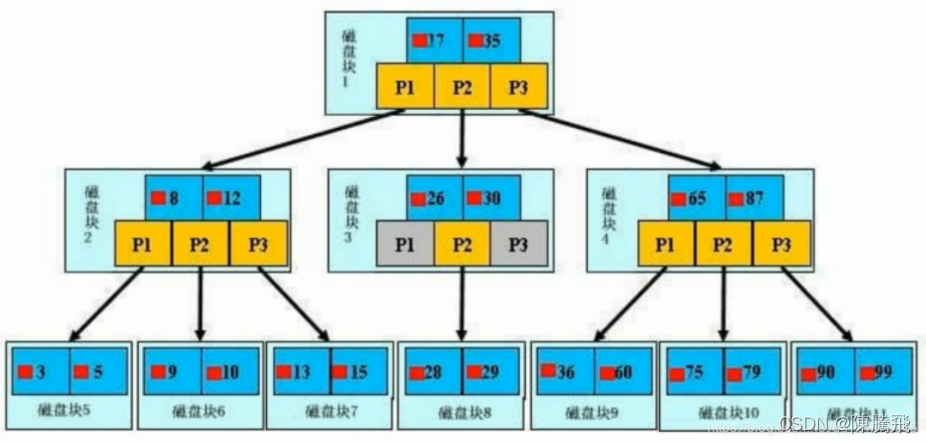  
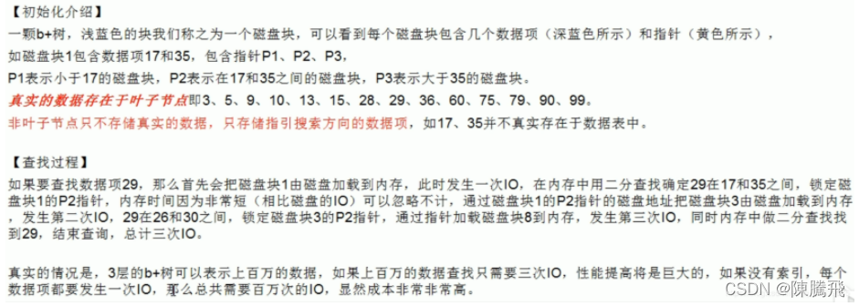

> BTree索引，Hash索引，full-text全文索引，R-Tree索引

**哪些情况需要创建索引：**

> *   主键自动建立唯一索引
> *   频繁作为查询条件的字段应该创建索引
> *   查询中与其它表关联的字段，外键关系建立索引
> *   频繁更新的字段不适合创建索引，因为每次更新不单单是更新了记录，还会更新索引，加重IO负担
> *   where条件里用不到的字段不创建索引
> *   单键/组合索引的选择问题，who？（在高并发下倾向创建组合索引）
> *   查询中排序的字段，排序字段若通过索引去访问将大大提高排序速度
> *   查询中统计或者分组字段

**哪些情况不需要创建索引:**

> *   表记录太少
> *   经常增删改的表
>     *   Why：提高了查询速度，同时却会降低更新表的速度，如对表进行INSERT、UPDATE和DELETE。因为更新表时，MySQL不仅要保存数据，还要保存一下索引文件。
> *   数据重复且分布平均的表字段，因此应该只为最经常查询和最经常排序的数据列建立索引。注意，如果某个数据列包含许多重复的内容，为它建立索引就没有太大的实际效果。

> *   假设一个表有10万行记录，有一个字段A只有T和F两种值，且每个值的分布概率大约为50%，那么对这种表A字段建索引一般不会提高数据库的查询速度。
> *   索引的选择性是指索引列中不同值的数目与表中记录数的比。如果一个表中有2000条记录，表索引列有1980个不同的值，那么这个索引的选择性就是11980/2000=0.99。一个索引的选择性月接近1，这个索引的效率就越高。

# 4\. 性能分析

*   MySQL Query Optimizer

> 1.  Mysql中有专门负责优化SELECT语句的优化器模块，主要功能：通过计算分析系统中手机到的统计信息，为客户端请求的Query提供他认为最优的执行计划（他认为最优的数据检索方式，但不见得DBA认为是最优的，这部分最耗费时间）
> 2.  当客户端想Mysql请求一条Query，命令解析器模块完成请求分类，区别出是SELECT并转发Mysql Query Optimizer时，Mysql Query Optimizer寿险会对整条Query进行优化，处理掉一些常量表达式的预算，直接换算成常量值。并对Query中的查询条件进行简化和转换，如去掉一些无用或显而易见的条件，结构调整等。然后分析Query中的Hint信息（如果有），看显示Hint信息是否可以完全确定该Query的执行计划。如果没有Hint或者Hint信息还不足以完全确定执行计划，则会读取所涉及对象的统计信息，根据Query进行写相应的计算分析，然后再得出最后的执行计划

*   MySQL常见瓶颈

> *   CPU：CPU在饱和的时候一般发生在数据装入内存或从磁盘上读取数据时候
> *   IO：磁盘I/O瓶颈发生在装入数据远大于内存容量的时候
> *   服务器硬件的性能瓶颈：top，free，iostat和vmstat来查看系统的性能状态

*   **Explain**

> 是什么（查看执行计划）？  
> 使用EXPLAIN关键字可以模拟优化器执行SQL查询语句，从而知MySQL是如何处理你的SQL语句的。分析你的查询语句或是表结构的性能瓶颈。

> 能干嘛?
>
> *   表的读取顺序
> *   数据读取操作的操作类型
> *   哪些索引可以使用
> *   哪些索引被实际使用
> *   表之间的应用
> *   每张表有多少行被优化器查询

> 怎么玩?
>
> *   Explain+SQL语句
> *   执行计划包含的信息

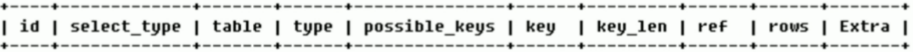  
各字段解释：  
`id：`

> select查询的序列号，包含一组数字，表示查询中执行select子句或操作表的顺序  
> 三种情况：
>
> *   id相同，执行顺序由上至下
> *   id不同，如果是子查询，id的序号会递增，id值越大优先级越高，越先被执行
> *   id相同不同，同时存在
>
> 衍生：DERIVED

`select_type：`  
有哪些:

| id   | select\_type |
| ---- | ------------ |
| 1    | SIMPLE       |
| 2    | PRIMARY      |
| 3    | SUBQUERY     |
| 4    | DERIVED      |
| 5    | UNION        |
| 6    | UNION RESULT |

> 查询的类型，主要是用于区别`普通查询、联合查询、子查询`等的复杂查询
>
> *   **SIMPLE**：简单的select查询，查询中不包含子查询或者UNION。
> *   **PRIMARY**：查询中包含任何复杂的子部分，最外层查询则被标记为PRIMARY。
> *   **SUBQUERY**：在FROM列表中包含的子查询被标记为DERIVED（衍生），MySQL会递归执行这些子查询，把结果放在临时表里。
> *   **DERIVED**：在FROM列表中包含的子查询被标记为DERIVED（衍生）。MySQL会递归执行这些子查询，把结果放在临时表里。
> *   **UNION**：若第二个SELECT出现在UNION之后，则被标记为UNION；若UNION包含在FROM子句的子查询中，外层SELECT将被标记为：DERIVED。
> *   **UNION RESULT**：从UNION表中获取结果的SELECT。

`table:`

> 显示这一行的数据是关于哪些表的

`type:`  
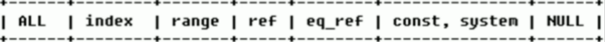

> 访问类型排序
>
> *   `type显示的是访问类型`，是较为重要的一个指标，结果值从最好到最坏依次是：  
>     system>const>eq\_ref>ref>fulltext>ref\_or\_null>index\_merge>unique\_subquery>index\_subquery>range>index>All
> *   显示查询使用了何种类型，从最好到最差依此是：  
>     `system>const>eq_ref>ref>range>index>All`
> *   system：表只有一行记录（等于系统表），这是const类型的特例，平时不会出现，这个也可以忽略不计。
> *   const：表示通过索引一次就找到了，const用于比较primary key或则unique索引。因为只匹配一行数据，所以很快。如将主键置于where列表中，MySQL就能将该查询转换为一个常量。
> *   eq\_ref：唯一性索引扫描，对于每个索引键，表中只有一条记录与之匹配。常见于主键或唯一索引扫描。
> *   ref：非唯一性索引扫描，返回匹配某个单独值的所有行。本质上也是一种索引访问，它返回所有匹配某个单独值的行，然而，它可能会找到多个符合条件的行，所以它应该属于查找和扫描的混合体。
> *   range：只检索给定范围的行，使用一个索引来选择行。key列显示使用了哪个索引。一般就是在你的where语句中出现了between、<、>、in等的查询。这种范围扫描索引扫描比全表扫描要好，因为它只需要开始于索引的某一点，而结束于另一点，不会扫描全部索引。
> *   index：Full Index Scan，index与All区别为index类型只遍历索引树。这通常比All快，因为索引文件通常比数据文件小。（也就是说虽然all和index都是读全表，但index是从索引中读取的，而all是从硬盘中读的）
> *   all：Full Table Scan，将遍历全表以找到匹配的行。
>
> `一般来说，得保证查询至少达到range级别，最好能达到ref。`

`possible_keys:`

> 显示可能应用在这张表中的索引，一个或多个。查询涉及到的字段上若存在索引，则该索引将被列出。`但不一定被查询实际使用`

`key:`

> 实际使用的索引。如果为NULL，则没有使用索引。`查询中若使用了覆盖索引，则该索引仅出现在key列表中，不会出现在possible_keys列表中`。（覆盖索引：查询的字段与建立的复合索引的个数一一吻合）

`key_len:`

> 表示索引中使用的字节数，可通过该列计算查询中使用的索引的长度。在不损失精确性的情况下，长度越短越好。key\_len显示的值为索引字段的最大可能长度，`并非实际使用长度`，即key\_len是根据表定义计算而得，不是通过表内检索出的。

`ref:`

> 显示索引的哪一列被使用了，如果可能的话，是一个常数。哪些列或常量被用于查找索引列上的值。`查询中与其它表关联的字段，外键关系建立索引`。

`rows:`

> 根据表统计信息及索引选用情况，大致估算出找到所需的记录所需要读取的行数。

`Extra:`

> 包含不适合在其他列中显示但十分重要的额外信息
>
> *   Using filesort：说明mysql会对数据使用一个外部的索引排序，而不是按照表内的索引顺序进行读取。MySQL中无法利用索引完成的排序操作成为“文件排序”。
> *   Using temporary：使用了临时表保存中间结果，MySQL在对查询结果排序时使用临时表。常见于排序order by和分组查询group by。
> *   Using index：表示相应的select操作中使用了覆盖索引（Covering Index），避免访问了表的数据行，效率不错！如果同时出现using where，表明索引被用来执行索引键值的查找；如果没有同时出现using where，表明索引用来读取数据而非执行查找动作。
>     *   覆盖索引:
>         *   覆盖索引（Covering Index）：一说为索引覆盖.
>         *   理解方式一：就是select的数据列只用从索引中就能够取得，不必读取数据行，Mysql可以利用索引返回select列表中的字段，而不必根据索引再次读取数据文件，换句话说`查询列要被所建的所有覆盖`.
>         *   理解方式二：索引是高效找到行的一个方法，但是一般数据库也能使用索引找到一个列的数据，因此它不必读取整个行。毕竟索引叶子节点存储了它们索引的数据；当能通过读取索引就可以得到想要的数据，那就不需要读取行了。一个索引包含了（或覆盖了）满足查询结果的数据就叫做覆盖索引。
>     *   `注意：`
>         *   如果要使用覆盖索引，一定要注意select列表中只取出需要的列，不可select \*
>         *   因为如果将所有字段一起做索引会导致索引文件过大，查询性能下降
> *   Using where：表明使用了where过滤。
> *   Using join buffer：使用了连接缓存。
> *   impossible where：where子句的值总是false，不能用来获取任何元组。（查询语句中where的条件不可能被满足，恒为False）
> *   select tables optimized away：在没有GROUPBY子句的情况下，基于索引优化MIN/MAX操作或者对于MyISAM存储引擎优化COUNT(\*)操作，不必等到执行阶段再进行计算，查询执行计划生成的阶段即完成优化。
> *   distinct：优化distinct操作，在找到第一匹配的元组后即停止找相同值的动作。

*   热身Case  
    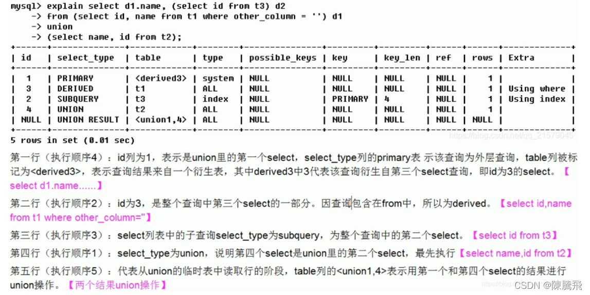

# 5 索引优化

## 5.1 `单表`

*   建表SQL

```
DROP TABLE IF EXISTS `article`;
CREATE TABLE `article` (
  `id` INT(10) NOT NULL AUTO_INCREMENT,
  `author_id` INT(10) NOT NULL,
  `category_id` INT(10) NOT NULL,
  `views` INT(10) NOT NULL,
  `comments` INT(10) NOT NULL,
  `title` VARBINARY(255) NOT NULL,
  `content` TEXT NOT NULL,
  PRIMARY KEY (`id`)
) ENGINE=INNODB AUTO_INCREMENT=4 DEFAULT CHARSET=utf8;

INSERT INTO `article` VALUES ('1', '1', '1', '1', '1', 0x31, '1');
INSERT INTO `article` VALUES ('2', '2', '2', '2', '2', 0x32, '2');
INSERT INTO `article` VALUES ('3', '3', '3', '3', '3', 0x33, '3'); 
```

*   案例

```
查询category_id为1且comments大于1的情况,views最多的article_id.
EXPLAIN SELECT id,author_id FROM article WHERE category_id=1 AND comments>1 ORDER BY views DESC LIMIT 1; 
```


> 结论：很明显type是ALL,即最坏的情况,Extra里还出现了Using filesort,也是最坏的情况,优化是必须的

### 5.1.1开始优化

*   新建索引 + 删除索引

```
#查看索引
SHOW INDEX FROM article;
#第一种方式创建索引
CREATE INDEX idx_article_ccv ON article(category_id,comments,views);
#第二种方式创建索引
ALTER TABLE article ADD INDEX idx_article_ccv(category_id,comments,views);
#删除索引
DROP INDEX idx_article_ccv ON article; 
```

*   第2次explain

```
EXPLAIN SELECT id,author_id FROM article WHERE category_id=1 AND comments>1 ORDER BY views DESC LIMIT 1; 
```


```
EXPLAIN SELECT id,author_id FROM article WHERE category_id=3 AND comments=1 ORDER BY views DESC LIMIT 1; 
```


> 结论:
>
> *   type变成了range,这是可以忍受的,但是extra里使用了Using filesort仍是无法接受的.
>
> 但是我们已经建立了索引,为啥没用呢?
>
> *   这是因为按照BTree索引的工作原理,
> *   先排序category\_id,
> *   如果遇到相同的category\_id,则再排序comments,如果遇到相同的comments,则再排序views.
> *   当comments字段在联合索引里处于中间位置时,
> *   因comments >1条件是一个范围值(所谓range),
> *   MySQL无法利用索引再对后面的views部分进行检索,即range类型查询字段后面的索引无效.

*   删除第一次建立的索引

```
#删除索引
DROP INDEX idx_article_ccv ON article; 
```

*   重新第二次建立新的索引

```
#查看索引
SHOW INDEX FROM article;
#第一种方式创建索引
CREATE INDEX idx_article_ccv ON article(category_id,views);
#第二种方式创建索引
ALTER TABLE article ADD INDEX idx_article_ccv(category_id,views);
#删除索引
DROP INDEX idx_article_ccv ON article; 
```

*   第3次explain

```
EXPLAIN SELECT id,author_id FROM article WHERE category_id=1 AND comments>1 ORDER BY views DESC LIMIT 1; 
```


> 结论：可以看出来type变成了ref,Extra中的Using filesort也消失了,结果非常理想.

## 5.2 `两表`

*   建表SQL

```
CREATE TABLE IF NOT EXISTS class(
	id INT(10) UNSIGNED NOT NULL AUTO_INCREMENT,
	card INT(10) UNSIGNED NOT NULL,
	PRIMARY KEY(id)
);

CREATE TABLE IF NOT EXISTS book(
	bookid INT(10) UNSIGNED NOT NULL AUTO_INCREMENT,
	card INT(10) UNSIGNED NOT NULL,
	PRIMARY KEY(bookid)
);

INSERT INTO class(card) VALUE(FLOOR(1+(RAND()*20)));
INSERT INTO class(card) VALUE(FLOOR(1+(RAND()*20)));
INSERT INTO class(card) VALUE(FLOOR(1+(RAND()*20)));
INSERT INTO class(card) VALUE(FLOOR(1+(RAND()*20)));
INSERT INTO class(card) VALUE(FLOOR(1+(RAND()*20)));
INSERT INTO class(card) VALUE(FLOOR(1+(RAND()*20)));
INSERT INTO class(card) VALUE(FLOOR(1+(RAND()*20)));
INSERT INTO class(card) VALUE(FLOOR(1+(RAND()*20)));
INSERT INTO book(card) VALUE(FLOOR(1+(RAND()*20)));
INSERT INTO book(card) VALUE(FLOOR(1+(RAND()*20)));
INSERT INTO book(card) VALUE(FLOOR(1+(RAND()*20)));
INSERT INTO book(card) VALUE(FLOOR(1+(RAND()*20)));
INSERT INTO book(card) VALUE(FLOOR(1+(RAND()*20)));
INSERT INTO book(card) VALUE(FLOOR(1+(RAND()*20)));
INSERT INTO book(card) VALUE(FLOOR(1+(RAND()*20)));
INSERT INTO book(card) VALUE(FLOOR(1+(RAND()*20))); 
```

*   案例
*   下面开始explain分析

```
EXPLAIN SELECT * FROM class 
		LEFT JOIN book ON class.`card`=book.`card`; 
```

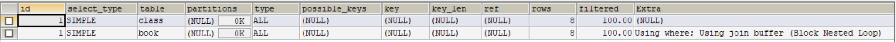

> 结论:type出现了ALL全表扫描

*   添加索引优化

```
ALTER TABLE book ADD INDEX Y(card); 
```

*   第2次explain

```
EXPLAIN SELECT * FROM class 
	LEFT JOIN book ON class.`card`=book.`card`; 
```

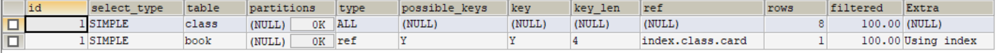

> *   可以看到第二行的type变成了ref，rows也变成了优化比较明显。
> *   这是由左连接特性决定的。left join条件用于确定如何从右表搜索行，左边一定要有，所以右边是我们的关键点,一定需要建立索引。

*   删除旧索引 + 新建 + 第3次explain

```
#删除旧索引
DROP INDEX Y ON book;
#新建索引
ALTER TABLE class ADD INDEX X(card);
SHOW INDEX FROM class;
#第3次explain
EXPLAIN SELECT * FROM  book
	LEFT JOIN class ON book.`card`=class.`card`; 
```

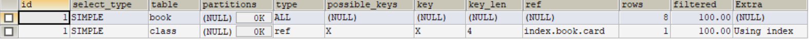

> 然后来看一个右连接查询.优化较为明显,这是因为right join条件用于确定如何从左表搜索行,右边一定都有,所以左边是我们的关键点,一定需要建立索引.

> *   `总结:左连接建立右表索引.右连接建立左表索引`.
> *   `理由: 以左连接为例,左表的信息全都有,所以右表需要查找,所以建立右表index`.

## 5.3 `三表`

*   建表SQL

```
CREATE TABLE IF NOT EXISTS phone(
	phoneid INT(10) UNSIGNED NOT NULL AUTO_INCREMENT,
	card INT(10) UNSIGNED NOT NULL,
	PRIMARY KEY(phoneid)
)ENGINE=INNODB;

INSERT INTO phone(card) VALUE(FLOOR(1+(RAND()*20)));
INSERT INTO phone(card) VALUE(FLOOR(1+(RAND()*20)));
INSERT INTO phone(card) VALUE(FLOOR(1+(RAND()*20)));
INSERT INTO phone(card) VALUE(FLOOR(1+(RAND()*20)));
INSERT INTO phone(card) VALUE(FLOOR(1+(RAND()*20)));
INSERT INTO phone(card) VALUE(FLOOR(1+(RAND()*20)));
INSERT INTO phone(card) VALUE(FLOOR(1+(RAND()*20)));
INSERT INTO phone(card) VALUE(FLOOR(1+(RAND()*20)));
INSERT INTO phone(card) VALUE(FLOOR(1+(RAND()*20)));
INSERT INTO phone(card) VALUE(FLOOR(1+(RAND()*20)));
INSERT INTO phone(card) VALUE(FLOOR(1+(RAND()*20)));
INSERT INTO phone(card) VALUE(FLOOR(1+(RAND()*20)));
INSERT INTO phone(card) VALUE(FLOOR(1+(RAND()*20)));
INSERT INTO phone(card) VALUE(FLOOR(1+(RAND()*20))); 
```

*   案例
*   建立索引

```
ALTER TABLE phone ADD INDEX z(card);
ALTER TABLE book ADD INDEX Y(card); 
```

*   使用explain

```
EXPLAIN SELECT * FROM class
	LEFT JOIN book ON class.`card`=book.`card`
	LEFT JOIN phone ON book.`card`=phone.`card`; 
```

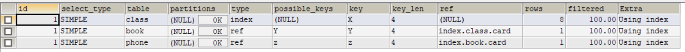

> 后2行的type都是ref且总rows优化很好，效果不错，因此索引最好设置在需要经常查询的字段中。

> 总结: JOIN语句的优化
>
> *   尽可能减少join语句中的NestedLoop的循环总次数:`永远用小结果驱动大的结果集`
> *   优先优化NestedLoop的内层循环.
> *   保证join语句中被驱动表上join条件字段已经被索引.
> *   当无法保证被驱动表的join条件字段被索引且内层资源充足的前提下,不要太吝惜joinbuffer的设置.

# 6 索引失效（应该避免）

*   建表SQL

```
CREATE TABLE staffs(
	id INT PRIMARY KEY AUTO_INCREMENT,
	NAME VARCHAR(24) NOT NULL DEFAULT '' COMMENT '姓名',
	age INT NOT NULL DEFAULT 0 COMMENT '年龄',
	pos VARCHAR(20) NOT NULL DEFAULT '' COMMENT '职位',
	add_time TIMESTAMP NOT NULL DEFAULT CURRENT_TIMESTAMP COMMENT '入职时间'
)CHARSET utf8 COMMENT '员工记录表';

INSERT INTO staffs(NAME,age,pos,add_time) VALUES('z3',22,'manage',NOW());
INSERT INTO staffs(NAME,age,pos,add_time) VALUES('july',22,'dev',NOW());
INSERT INTO staffs(NAME,age,pos,add_time) VALUES('2000',23,'dev',NOW());

#创建索引
ALTER TABLE staffs ADD INDEX idx_staffs_nameAgePos(NAME,age,pos); 
```
```
# 查看索引
SHOW INDEX FROM staffs; 
```

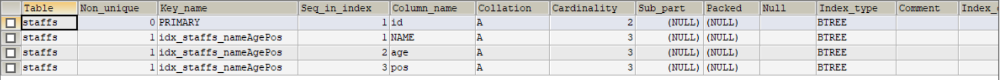

*   案例（索引失效）

1.  `全值匹配我最爱`

```
EXPLAIN SELECT * FROM staffs WHERE age=25 AND pos='dev'; 
```


```
EXPLAIN SELECT * FROM staffs WHERE pos='dev'; 
```


```
EXPLAIN SELECT * FROM staffs WHERE NAME='july'; 
```


```
EXPLAIN SELECT * FROM staffs WHERE NAME='july' AND age=25 AND pos='dev'; 
```


2.  `最佳左前缀法则`

> 如果索引了多列，要遵循最左前缀法则。指的是查询从索引的最左前列开始并且不跳过索引中的列(`带头大哥不能死,中间兄弟不能断`).

3.  `不在索引列上作任何操作(计算,函数,(自动or手动),类型转换),会导致索引失效会转向全表扫描`

```
EXPLAIN SELECT * FROM staffs WHERE NAME='july'; 
```


```
EXPLAIN SELECT * FROM staffs WHERE LEFT(NAME,4)='july'; 
```


4.  `存储引擎不能使用索引中范围条件右边的列.(中间兄弟别搞范围,要搞等值.)`

```
EXPLAIN SELECT * FROM staffs WHERE NAME='july' AND age=25 AND pos='dev'; 
```


```
EXPLAIN SELECT * FROM staffs WHERE NAME='july' AND age>25 AND pos='dev'; 
```

  
5\. `尽量使用覆盖索引(只访问索引的查询(索引列和查询列一致)),减少使用select *`

> *   按需取数据,用多少取多少,尽量与索引一致.
> *   Extra中出现了using index很好.

```
EXPLAIN SELECT NAME,age,pos FROM staffs WHERE NAME='july' AND age=25 AND pos='dev'; 
```


```
EXPLAIN SELECT * FROM staffs WHERE NAME='july' AND age=25 AND pos='dev'; 
```


```
EXPLAIN SELECT NAME,age,pos FROM staffs WHERE NAME='july' AND age>25 AND pos='dev'; 
```

  
6\. `mysql在使用不等于(!=或者<>)的时候无法使用索引,会导致全表扫描.`

```
EXPLAIN SELECT * FROM staffs WHERE NAME='july'; 
```


```
EXPLAIN SELECT * FROM staffs WHERE NAME!='july'; 
```


```
EXPLAIN SELECT * FROM staffs WHERE NAME<>'july'; 
```

  
7\. `is null, is not null也无法使用索引.`

```
EXPLAIN SELECT * FROM staffs WHERE NAME IS NULL; 
```


```
EXPLAIN SELECT * FROM staffs WHERE NAME IS NOT NULL; 
```

  
8\. `like以通配符开头('%abc...'),mysql索引失效会变成全表扫描的操作.`

```
EXPLAIN SELECT * FROM staffs WHERE NAME LIKE '%july%'; 
```


```
EXPLAIN SELECT * FROM staffs WHERE NAME LIKE '%july'; 
```


```
EXPLAIN SELECT * FROM staffs WHERE NAME LIKE 'july%'; 
```


> *   like%加在右边,左边不加.
> *   利用覆盖索引解决两边%的优化问题.

9.  `字符串不加单引号,索引会失效.`  
    字符串如果不加单引号。MySQL底层会自动在索引列上做类型转换.

```
EXPLAIN SELECT * FROM staffs WHERE NAME='2000'; 
```


```
EXPLAIN SELECT * FROM staffs WHERE NAME=2000; 
```

  
10\. `少用or,用它来连接时会索引失效.`

```
EXPLAIN SELECT * FROM staffs WHERE NAME='July' OR NAME='Z3'; 
```

  
`小总结:`  
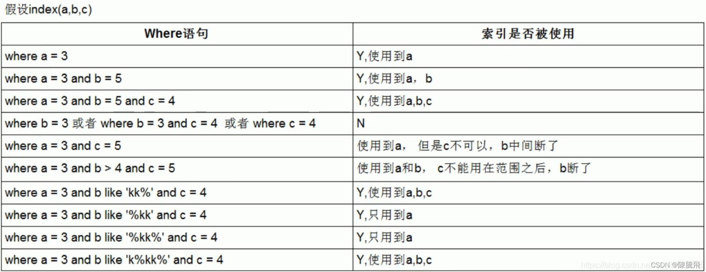

> `优化总结口诀`:
>
> *   全值匹配我最爱,最左前缀要遵守;
> *   带头大哥不能死,中间兄弟不能断;
> *   索引列上少计算,范围之后全失效;
> *   LIKE百分写最右,覆盖索引不写星;
> *   不等控制还有or,索引失效要少用;
> *   var引号不可丢,SQL高级也不难!

# 7 面试题讲解

*   题目SQL

```
CREATE TABLE test03(
	id INT PRIMARY KEY NOT NULL AUTO_INCREMENT,
	c1 CHAR(10),
	c2 CHAR(10),
	c3 CHAR(10),
	c4 CHAR(10),
	c5 CHAR(10)
);

INSERT INTO test03(c1,c2,c3,c4,c5) VALUES('a1','a2','a3','a4','a5');
INSERT INTO test03(c1,c2,c3,c4,c5) VALUES('b1','b2','b3','b4','b5');
INSERT INTO test03(c1,c2,c3,c4,c5) VALUES('c1','c2','c3','c4','c5');
INSERT INTO test03(c1,c2,c3,c4,c5) VALUES('d1','d2','d3','d4','d5');
INSERT INTO test03(c1,c2,c3,c4,c5) VALUES('e1','e2','e3','e4','e5'); 
```

*   建索引

```
#创建索引
CREATE INDEX idx_test03_c1234 ON test03(c1,c2,c3,c4);
#查看索引
SHOW INDEX FROM test03; 
```

*   问题: 我们创建了复合索引idx\_test03\_c11234,根据以下SQL分析索引使用情况?

```
EXPLAIN SELECT * FROM test03 WHERE c1='a1'; 
```


```
EXPLAIN SELECT * FROM test03 WHERE c1='a1' AND c2='a2'; 
```


```
EXPLAIN SELECT * FROM test03 WHERE c1='a1' AND c2='a2' AND c3='a3'; 
```


```
EXPLAIN SELECT * FROM test03 WHERE c1='a1' AND c2='a2' AND c3='a3' AND c4='a4'; 
```


```
EXPLAIN SELECT * FROM test03 WHERE c1='a1' AND c2='a2' AND c3='a3' AND c4='a4'; 
```

按照最左前缀原则,用到了索引,理想状态  


```
EXPLAIN SELECT * FROM test03 WHERE c1='a1' AND c2='a2' AND c4='a4' AND c3='a3'; 
```

此sql虽然没有按照索引顺序查询，但是sql内部查询优化器会优化改sql。  


```
EXPLAIN SELECT * FROM test03 WHERE c1='a1' AND c2='a2' AND c3>'a3' AND c4='a4'; 
```

因为c3用了范围查询，导致后面c4无法使用到索引。  


```
EXPLAIN SELECT * FROM test03 WHERE c1='a1' AND c2='a2' AND c4>'a4' AND c3='a3'; 
```

使用了范围查询，虽然使用了索引，但是具体列并没有被使用。  
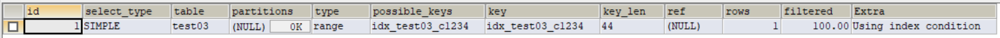

```
EXPLAIN SELECT * FROM test03 WHERE c1='a1' AND c2='a2' AND c4='a4' ORDER BY c3; 
```

只用到了c1，c2,c3的作用在排序而不是查找，用到了但是没有统计在结果中.  


```
EXPLAIN SELECT * FROM test03 WHERE c1='a1' AND c2='a2' ORDER BY c4; 
```

出现了filesort排序，原因是排序未安装索引建立顺序，sql内部产生了排序。  
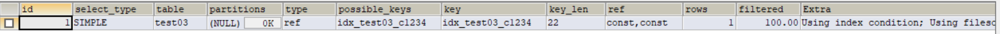

```
EXPLAIN SELECT * FROM test03 WHERE c1='a1' AND c5='a5' ORDER BY c2,c3; 
```

只用到了c1一个字段索引，但是c2,c3用于排序，无filesort。  


```
EXPLAIN SELECT * FROM test03 WHERE c1='a1' AND c5='a5' ORDER BY c3,c2; 
```

出现了filesort，我们建的索引是1234，它没有按照顺序来，3和2颠倒了。  


```
EXPLAIN SELECT * FROM test03 WHERE c1='a1' AND c2='a2' ORDER BY c2,c3; 
```

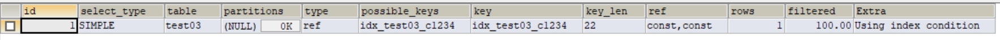

```
EXPLAIN SELECT * FROM test03 WHERE c1='a1' AND c2='a2' AND c5='a5' ORDER BY c2,c3; 
```

用了c1,c2两个字段索引，但是c2,c3用于排序，没有filesort。因为有常量c2的情况,因为排序就相当于order by c3,c2(常量)，所以没有出现filesort的情况。  


```
EXPLAIN SELECT * FROM test03 WHERE c1='a1' AND c4='a4' GROUP BY c2,c3; 
```


```
EXPLAIN SELECT * FROM test03 WHERE c1='a1' AND c4='a4' GROUP BY c3,c2; 
```

定值，范围还是排序，一般order by是给个范围  
group by基本上都需要进行排序,会有临时表产生  
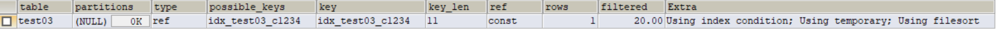

> `一般性建议:`
>
> *   对于单键索引,尽量选择针对当前query过滤性更好的索引.
> *   在选择组合索引的时候,当前query中过滤性最好的字段在索引字段顺序中,位置越靠前越好.
> *   在选择组合索引的时候,尽量选择可以能搞包含当前query中的where字句中更多字段的索引.
> *   尽可能通过分析统计信息和调整query的写法来达到合适索引的目的.

# 8 查询优化

> `分析`
>
> *   观察，至少跑1天，看看生产的慢SQL情况。
> *   开启慢查询日志，设置阈值，比如超过5秒钟的就是慢SQL，并将它抓取出来。
> *   explain+慢SQL分析
> *   show profile
> *   运维经理 or DBA，进行SQL数据库服务器参数调优。

> `总结`
>
> *   慢查询的开启并捕获
> *   explain+慢SQL分析
> *   show profile查询SQL在Mysql服务器里面的执行细节和生命周期情况
> *   SQL数据库服务器的参数调优

*   `永远小表驱动大表`，类似嵌套循环Nested Loop

```
for(int = 5;...){
	for(int j = 1000){
	}
}
----------------------------------------------------------
for(int = 1000;...){
	for(int j = 5){
	}
} 
```

*   优化原则：`小表驱动大表，即小的数据集驱动大的数据集`。

```
select * from A where id in(select id from B)
等价于:
for select id from B
for select * from A where A.id = B.id 
```

`当B表的数据集小于A表的数据集时,用in优于exists`

```
select * from A where exists(select 1 from B where B.id = A.id)
等价于:
for select * from A
for select * from B where B.id = A.id 
```

`当A表的数据集小于B表的数据集时,用exists优于in`

> 注意：A表与B表的ID字段应建立索引.
>
> *   当B表的数据集必须小于A表的数据集时，用in优于exists
> *   当A表的数据集必须小于B表的数据集时，用exists优于in
> *   注意：A表与B表的ID字段应建立索引。
> *   EXISTS
>     *   SELECT … FROM table WHERE EXISTS(subquery)
>     *   该语法可以理解为：`将主查询的数据，放到子查询中做条件验证，根据验证结果（TRUE或FALSE）来决定主查询的数据结果是否得以保留`。
>
> 提示：
>
> *   EXISTS（subquery）只返回TRUE或FALSE，因此子查询中的SELECT \*也可以是SELECT 1或SELECT ‘X’，官方说法是实际执行时会忽略SELECT清单，因此没有区别。
> *   EXISTS子查询的实际执行过程可能经过了优化而不是我们理解上的逐条对比，如果担心效率问题，可进行实际检验以确定是否有效率问题。
> *   EXISTS子查询往往也可以用条件表达式/其他子查询或者JOIN来替代，何种最优需要具体问题具体分析。
>
> 总结：
>
> *   下面结论都是针对in或者exists的.
> *   `in后面跟着的是小表,exists后面跟的是大表.`
> *   间记: in小,exists大.
> *   对于exists  
>     select …from table where exists(subquery);
> *   可以理解为：将主查询的数据放入子查询中做条件验证,根据验证结果(true或false)来决定主查询的数据是否得以保留.

**ORDER BY关键字优化**

*   `ORDER BY子句，尽量使用Index方式排序，避免使用FileSort方式排序`
*   建表SQL

```
CREATE TABLE tblA(
	id INT PRIMARY KEY NOT NULL AUTO_INCREMENT,
	age INT,
	birth TIMESTAMP NOT NULL
);

INSERT INTO tblA(age,birth) VALUES(22,NOW());
INSERT INTO tblA(age,birth) VALUES(23,NOW());
INSERT INTO tblA(age,birth) VALUES(24,NOW());

CREATE INDEX idx_A_ageBirth ON tblA(age,birth);
SHOW INDEX FROM tblA;
SELECT * FROM tblA; 
```
```
EXPLAIN SELECT * FROM tblA WHERE age>20 ORDER BY age; 
```


```
EXPLAIN SELECT * FROM tblA WHERE age>20 ORDER BY age,birth; 
```


```
EXPLAIN SELECT * FROM tblA WHERE age>20 ORDER BY birth; 
```


> MySQL支持两种方式的排序
>
> *   FileSort和Index，Index效率高。FileSort方式效率较低。
> *   Using Index，它指MySQL扫描索引本身完成排序。
>
> ORDER BY满足两种情况，会使用Index方式排序：
>
> *   ORDER BY语句使用索引最左前列
> *   使用Where子句与ORDER BY子句条件列组合满足索引最左前列
>
> 尽可能在索引列上完成排序操作，遵照索引建的最佳最前缀  
> 如果不在索引列上，filesort有两种算法：
>
> *   mysql就要启动双路排序和单路排序
>     *   `双路排序`
>         *   MySQL4.1之前是使用双路排序，字面意思就是`两次`扫描磁盘，最终得到数据。读取行指针和order by列，对他们进行排序，然后扫描已经排好序的列表，按照列表中的值重新从列表中读取对应的数据输出。
>         *   从磁盘取排序字段，在buffer进行排序，再从磁盘读取其他字段。
>         *   取一批数据，要对磁盘进行了两次扫描，众所周知，I\\O是很耗时的，所以在mysql4.1之后，出现了第二种改进的算法，就是单路排序
>     *   `单路排序`
>         *   从磁盘读取查询需要的所有列，按照order by列在buffer对它们进行排序，然后扫描排序后的列表进行输出，它的效率更快一些，避免了第二次读取数据。并且把随机IO变成了顺序IO，但是它会使用更多的空间。
>     *   结论及引申出的问题
>         *   由于单路是后出的，总体而言好过双路
>         *   但是用单路有问题
>             *   在sort\_buffer中，方法B比方法A要多占用很多空间，因为方法B是把所有字段都取出，所以有可能取出的数据的总大小超出了sort\_buffer的容量，导致每次只能取sort\_buffer容量大小的数据，进行排序（创建tmp文件，多路合并），拍完再取sort\_buffer容量大小，再排…从而多次I/O.
>             *   本来想省一次I/O操作，反而导致了大量的I/O操作，反而得不偿失（原因：数据的总大小查过sort\_buffer的容量）

> 优化策略：
>
> *   增大sort\_buffer\_size参数的设置
> *   增大max\_length\_for\_sort\_data参数的设置
> *   Why(提高Order By的建度)
>     *   Order by时select \* 是一个大忌Query需要的字段，这点非常重要，在这里的影响是：
>         *   当Query的字段你大小总和小于max\_length\_for\_sort\_data，而且排序字段不是TEXT|BLOB类型时，会用改进后的算法----单独排序，否则用老算法----多路排序。
>         *   两种算法的数据都有可能超出sort\_buffer的容量，超出之后，会创建tmp文件进行合并排序，导致多次I/O，但是用单路排序算法的风险会更大一些，所以要提高sort\_buffer\_size.
> *   尝试提高sort\_buffer\_size
>     *   不管用哪种算法，提高这个参数都会提高效率，当然，要根据系统的能力去提高，因为这个参数时针对每个进程的。
> *   尝试提高max\_length\_for\_sort\_data
>     *   提高这个参数，会增加用改进算法的概率。但是如果设的太高，数据总容量超出sort\_buffer\_size的概率就增大，明显症状是高的磁盘I/O活动和低的处理器使用率。

> 小总结：  
> 为排序使用索引
>
> *   Mysql两种排序方式：文件排序或扫描有序索引排序
> *   Mysql能为排序与查询使用相同的索引

```
key a_b_c(a,b,c)
# order by能使用索引最左前缀
order by a
order by a,b
order by a,b,c
order by a desc,b desc,c desc

# 如果where使用索引的最左前缀定义为常量，则order by能使用索引
where a = const order by b,c
where a = const and b = const order by c
where a = const order by b,c
where a = const and b > const order by b,c

#不能使用索引进行排序
order by a asc,b desc,c desc //排序不一致
where g = const order by b,c //丢失a索引
where a = const order by c //丢失b索引
where a = const order by a,d //d不是索引的一部分
where a in(...) order by b,c //对于排序来说，多个相等条件也是范围查询 
```

> GROUP BY关键字优化：
>
> *   group by实质是先排序后进行分组，遵照索引建的最佳左前缀。
> *   当无法使用索引列，增大max\_length\_for\_sort\_data参数的设置+增大sort\_buffer\_size参数的设置。
> *   where高于having，能写在where限定的条件就不要去having限定了
