# MySQL索引优化及性能调优9-14

# 9 慢查询日志

> **是什么**
>
> *   MySQL的慢查询日志是MySQL提供的一种日志记录，`它用来记录在MySQL中响应时间超过阈值的语句，具体指运行时间超过long_query_time值的SQL`，则会被记录到慢查询日志中。
> *   long\_query\_time的默认值是10，意思是运行10秒以上的语句。
> *   由它来查看哪些SQL超出了我们的最大忍耐时间值，比如一条sql执行超过5秒钟，我们就算慢SQL，希望能收集超过5秒的sql，结合之前的explain进行全面分析。

> **怎么玩**
>
> *   说明
>     *   默认情况下，MySQL数据库没有开启慢查询日志，需要我们手动来设置这个参数。
>     *   当然，如果不是调优需要的话，一般不建议启动该参数，因为开启慢查询日志会或多或少带来一定的性能影响。慢查询日志支持将日志记录写入文件。
> *   查看是否开启及如何开启
>     *   默认：SHOW VARIABLES LIKE ‘%slow\_query\_log%’;
>     *   默认情况下slow\_query\_log的值为off,表示慢查询日志是禁用的,可以通过设置slow\_query\_log的值来开启.

```sql
SHOW VARIABLES LIKE '%slow_query_log%'; 
```

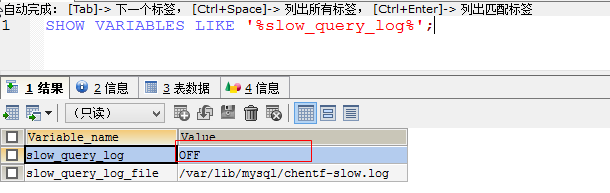

```
SET GLOBAL slow_query_log = 1 
```

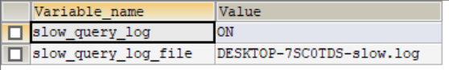

> 开启：set global slow\_query\_log=1;
>
> *   使用set global slow\_query\_log=1开始了慢查询日志`只对当前数据库生效`，如果Mysql重启后则会失效。
> *   如果要永久生效，就必须修改配置文件my.cnf（其它系统变量也是如此）

```
# 修改my.cnf文件，[mysqlId]下增加或修改参数
# slow_query_log 和 slow_query_log_file后，然后重启Mysql服务器，也即将如下两行配置进my.cnf文件：
slow_query_log = 1
slow_query_log_file = /var/lib/mysql/atguigu-slow.log
# 关于慢查询的参数slow_query_log_file，它指定慢查询日志文件的存放路径，系统默认会给一个缺省的文件host_name-slow.log(如果没有指定参数slow_quert_log_file的话) 
```

> 那么开启了慢查询日志后，什么样的SQL才会记录到慢查询日志里面呢
>
> *   这个是由参数long\_query\_time控制，默认清下long\_query\_time的值为10秒，命令：show variables like ‘long\_query\_time%’,可以使用命令修改，也可以在my.cnf参数里面修改。
> *   假如运行时间正好等于long\_query\_time的情况，并不会被记录下来。也就是说,在Mysql源码里是`判断大于long_query_time,而非大于等于`.

> Case
>
> *   查看当前多少秒算慢：SHOW VARIABLES LIKE ‘long\_query\_time%’;
> *   设置慢的阈值时间：set global long\_query\_time=3;  
>     为什么设置后看不出变化（设置3之后，查询依然显示10）：
>     *   需要重新连接或新开一个会话才能看到修改值。
>     *   SHOW VARIABLES LIEK ‘long\_query\_time%’;
>     *   show global variables like ‘long\_query\_time’;
> *   记录慢SQL并后续分析  
>     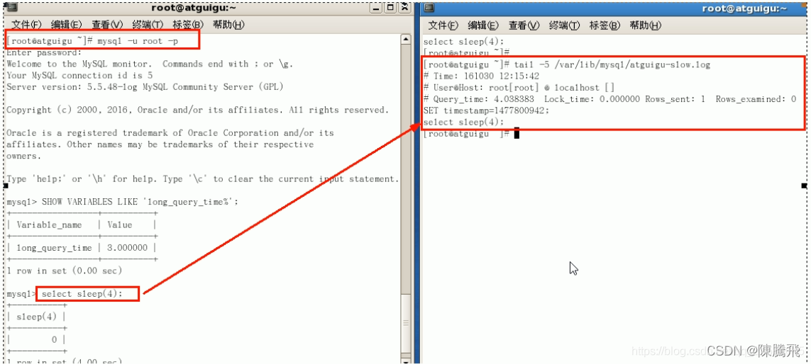
> *   查询当前系统中有多少条慢查询记录：  
>     show global status like ‘%Slow\_queries%’;

配置版

```
[mysqlId]下配置:
slow_query_log = 1;
slow_query_log_file = /var/lib/mysql/atguigu-slow.log
long_query_time = 3;
log_output = FILE 
```

> 日志分析工具mysqldumpslow
>
> *   在生产环境中，如果要手工分析日志，查找、分析SQL，显然是个体力活，MySQL提供了日志分析工具mysqldumpslow。
> *   查看mysqldumpslow的帮助信息

```
mysqldumpslow --help
s：是表示按照何种方式排序
c：访问次数
I：锁定时间
r：返回记录
t：查询时间
al：平均锁定时间
ar：平均返回记录数
at：平均查询时间
t：即为返回前面多少条的数据
g：后边搭配一个正则匹配模式，大小写不敏感 
```

工作常用参考:

```
# 得到返回记录集最多的10个sql
mysqldumpslow -s r -t 10 /var/lib/mysql/atguigu-slow.log
# 得到访问次数最多的10个sql
mysqldumpslow -s c -t 10 /var/lib/mysql/atguigu-slow.log
# 得到按照时间排序的前10条里面含有左连接的查询语句
mysqldumpslow -s t -t 10 -g "left join" /var/lib/mysql/atguigu-slow.log
# 另外建议在使用这些命名时结合|和more使用，否则有可能出现爆屏的情况
mysqldumpslow -s r -t 10 /var/lib/mysql/atguigu-slow.log |more 
```

# 10 批量数据脚本

往表里插入1000w数据

```
# 建库
CREATE DATABASE bigData;
USE bigData; 
```
```
# 建表dept
CREATE TABLE dept(
	id INT UNSIGNED PRIMARY KEY AUTO_INCREMENT,
	deptno MEDIUMINT UNSIGNED NOT NULL DEFAULT 0,
	dname VARCHAR(20) NOT NULL DEFAULT '',
	loc VARCHAR(13) NOT NULL DEFAULT ''
)ENGINE=INNODB DEFAULT CHARSET=gbk; 
```
```
#建表emp
CREATE TABLE emp(
	id INT UNSIGNED PRIMARY KEY AUTO_INCREMENT,
	empno MEDIUMINT UNSIGNED NOT NULL DEFAULT 0, /*编号*/
	ename VARCHAR(20) NOT NULL DEFAULT '',/*名字*/
	job VARCHAR(9) NOT NULL DEFAULT '',/*工作*/
	mgr MEDIUMINT UNSIGNED NOT NULL DEFAULT 0,/*上级编码*/
	hiredate DATE NOT NULL,/*入职时间*/
	sal DECIMAL(7,2) NOT NULL,/*薪水*/
	comm DECIMAL(7,2) NOT NULL,/*红利*/
	deptno MEDIUMINT UNSIGNED NOT NULL DEFAULT 0 /*部门编号*/	
)ENGINE=INNODB DEFAULT CHARSET=gbk; 
```

*   设置参数log\_bin\_trust\_function\_creators

```
创建函数，假如报错：This function has none of DETERMINISTIC...
# 由于开启过慢查询日志，因为我们开启了bin-log，我们就必须为我们的function指定一个参数。
show variables liek 'log_bin_trust_function_creators';
set global log_bin_trust_function_creators = 1;
# 这样添加了参数以后，如果Mysql重启，上述参数又会消失，永久方法：
window下my.ini【mysqlId】加上log_bin_trust_function_creators = 1;
linux下/etc/my.cnf下my.cnf【mysqlId】加上log_bin_trust_function_creators = 1; 
```
```
SHOW VARIABLES LIKE 'log_bin_trust_function_creators';
SET GLOBAL log_bin_trust_function_creators=1; 
```

*   创建函数，保证每条数据都不同
*   随机产生字符串

```
DELIMITER $$
CREATE FUNCTION rand_string(n INT)
RETURNS VARCHAR(255)
BEGIN
  DECLARE chars_str VARCHAR(100) DEFAULT 'abcdefghijklmnopqrstuvwxyzABCDEFJHIJKLMNOPQRSTUVWXYZ';
  DECLARE return_str VARCHAR(255) DEFAULT '';
  DECLARE i INT DEFAULT 0;
  WHILE i<n DO
    SET return_str=CONCAT(return_str,SUBSTRING(chars_str,FLOOR(1+RAND()*52),1));
    SET i=i+1;
    END WHILE;
    RETURN return_Str;
END$$ 
```

*   随机产生部门编号

```
DELIMITER$$
CREATE FUNCTION rand_num()
RETURNS INT(5)
BEGIN
  DECLARE i INT DEFAULT 0;
  SET i = FLOOR(100+RAND()*10);
  RETURN i;
END$$ 
```

*   假如要删除

```
drop function rand_num; 
```

*   创建存储过程

```
DELIMITER$$
CREATE PROCEDURE insert_emp(IN START INT(10),IN max_num INT(10))
BEGIN
  DECLARE i INT DEFAULT 0;
  #set autocommit=0 把autocommit设置成0
  SET autocommit = 0;
  REPEAT
  SET i = i+1;
  INSERT INTO emp(empno,ename,job,mgr,hiredate,sal,comm,deptno)
  VALUES((START+i),rand_string(6),'salesman',0001,CURDATE(),2000,400,rand_num());
  UNTIL i = max_num
  END REPEAT;
  COMMIT;
END$$ 
```
```
#执行存储过程,往dept表添加随机数据
DELIMITER$$
CREATE PROCEDURE insert_dept(IN START INT(10),IN max_num INT(10))
BEGIN
  DECLARE i INT DEFAULT 0;
  SET autocommit = 0;
  REPEAT
  SET i = i+1;
  INSERT INTO dept(deptno,dname,loc) VALUES((START+i),rand_string(10),rand_string(8));
  UNTIL i = max_num
  END REPEAT;
  COMMIT;
END$$ 
```

*   调用存储过程
*   dept

```
DELIMITER;
CALL insert_dept(100,10); 
```

*   emp

```
 DELIMITER;
CALL insert_emp(100001,500000); 
```

# 11 Show Profile

> **是什么**：是Mysql提供的可以用来分析当前会话中语句执行的资源消耗情况，可以用于SQL的调优的测量  
> 默认情况下，参数处于关闭状态，并保存最近15次的运行结果。

分析步骤

*   是否支持，看看当前的mysql版本是否支持

```
SHOW VARIABLES LIKE 'profiling';
或者
SHOW VARIABLES LIKE 'profiling%';
默认时关闭的，使用前需要开启 
```

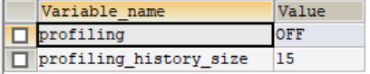

*   开启功能，默认是关闭，使用前需要开启

```
set profiling = on; 
```

*   运行SQL

```
select * from emp group by id%10 limit 150000;
select * from emp group by id%20 order by 5; 
```

*   查看结果

```
show profiles; 
```

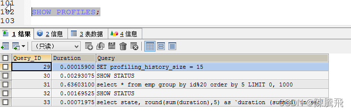

*   诊断SQL

```
show profile cpu, block io for query #上一步前面的问题SQL数字号码; 
```

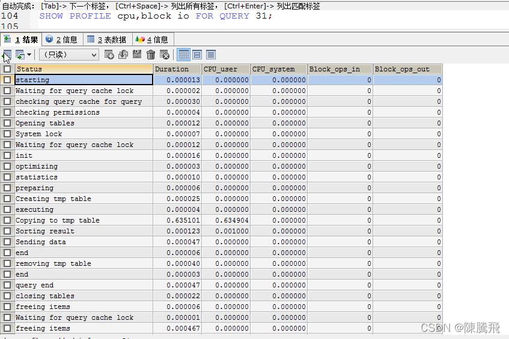

*   参数备注

> type：
>
> *   ALL 显示所有的开销信息
> *   BLOCK IO 显示块IO相关开销
> *   CONTEXT SWITCHES 上下文切换相关开销
> *   CPU 显示CPU相关开销信息
> *   IPC 显示发送和接受相关开销信息
> *   MEMORY 显示内存相关开销信息
> *   PAGE FAULTS 显示页面错误相关开销信息
> *   SOURCE 显示和Source\_function,Source\_file,Source\_line相关的开销信息
> *   SWAPS 显示交换次数相关开销的信息

> 日常开发需要注意的结论
>
> *   converting HEAP to MyISAM：查询结果太大，内存都不够用了往磁盘上搬了
> *   Creating tmp table：创建临时表
>     *   拷贝数据到临时表
>     *   用完再删除
> *   Copying to tmp table on disk：把内存中临时表复制到磁盘，危险！！
> *   locked

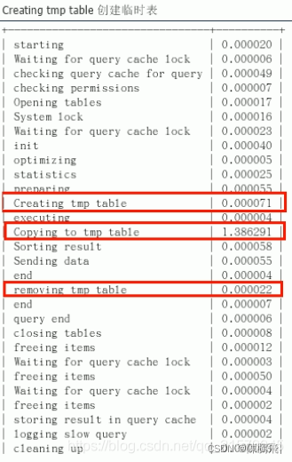

# 12 全局查询日志

*   配置启用

```
在Mysql的my.cnf中，设置如下：
# 开启
general_log=1
# 记录日志文件的路径
general_log_file=/path/logfile
# 输出格式
log_output=FILE 
```

*   编码启用

```
set global general_log=1;
set global log_output='TABLE';
# 此后，你所编写的sql语句，将会记录到Mysql库里的general_log表，可以用下面的命令查看
select * from mysql.general_log; 
```

`永远不要在生产环境开启这个功能！`

# 13 Mysql锁机制

## 13.1 概述

> **定义**：
>
> *   锁是计算机协调多个进程并发访问某一资源的机制。
> *   在数据库中，除了传统的计算资源(如CPU,RAM,I/O等)的争用意外，数据也是一种供许多用户共享的资源。如何保证数据并发访问的一致性，有效性是所有数据库必须解决的一个问题，锁冲突也是影响数据库并发访问性能的一个重要因素。从这绝对来说。锁对数据库而言显得尤其重要，也更加复杂。

*   生活购物  
    

> 锁的分类：
>
> *   从对数据操作的类型（读/写）分：
>     *   读锁（共享锁）：针对同一份数据，多个读操作可以同时进行而不会互相影响。
>     *   写锁（排它锁）：当前写操作没有完成前，它会阻断其他写锁和读锁。
> *   从对数据操作的粒度分：
>     *   表锁
>     *   行锁

## 13.2 三锁

> 开销、加锁速度、死锁、粒度、并发性能  
> 只能就具体应用的特点来说那种锁更合适

## 13.3 表锁（偏读）

> 特点：偏向`MyISAM存储引擎`，开销小，加锁快；无死锁；锁定粒度大，发生锁冲突的概率最高，并发度最低。

*   案例分析

```
CREATE TABLE mylock(
	id INT NOT NULL PRIMARY KEY AUTO_INCREMENT,
	NAME VARCHAR(20)
)ENGINE MYISAM;
INSERT INTO mylock(NAME) VALUES('a');
INSERT INTO mylock(NAME) VALUES('b');
INSERT INTO mylock(NAME) VALUES('c');
INSERT INTO mylock(NAME) VALUES('d');
INSERT INTO mylock(NAME) VALUES('e');

SELECT * FROM mylock; 
```
```
# 手动增加表锁
lock table 表名字 read(write), 表名字2 read(write), 其他;
# 查看表上加过的锁
show open tables;
# 释放表锁
unlock tables; 
```

**加读锁（我们为mylock表加read锁（读阻塞写例子））**  
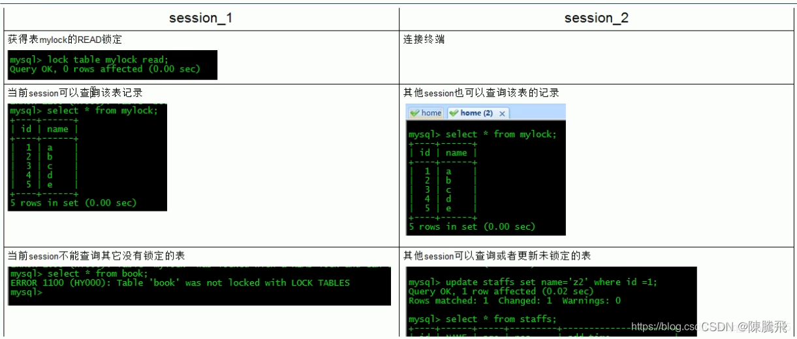  
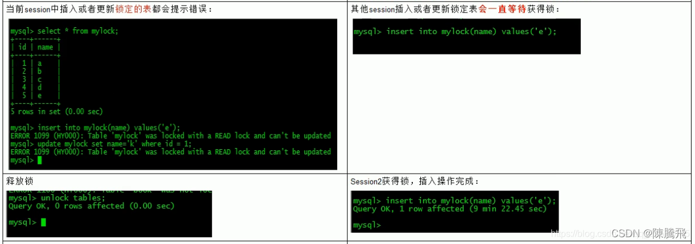  
**加写锁（我们为mylock表加write锁（MyISAM存储引擎的写阻塞读例子））**  
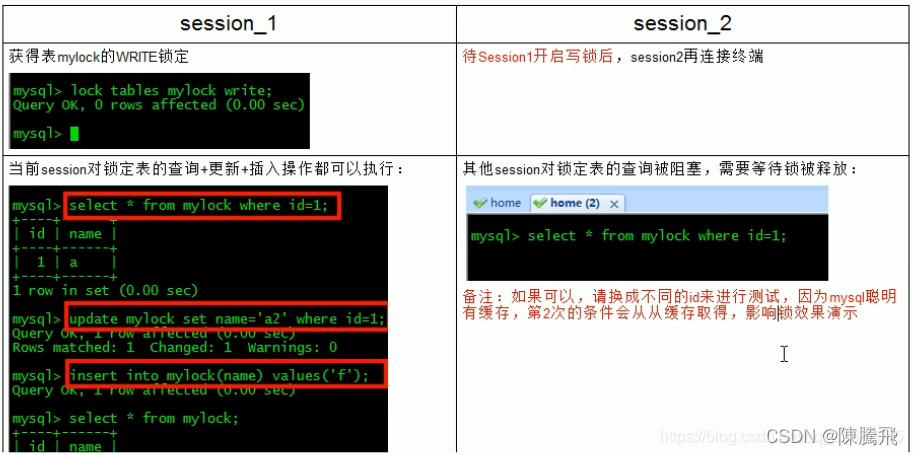  
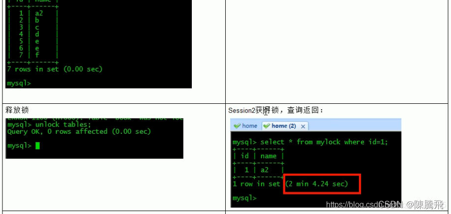

*   案例结论  
    **简而言之，就是读锁会阻塞写，但是不会阻塞读。而写锁则会把读和写都阻塞。**  
    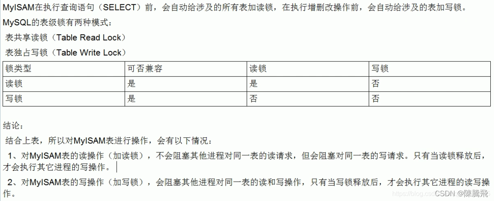

> 表锁分析
>
> *   看看哪些表被加锁了：show open tables;
> *   如何分析表锁定：可以通过检查table\_locks\_waited和table\_locks\_immediate状态变量来分析系统上的表锁定。
>     *   show status like ‘table%’;
>     *   这里有两个状态变量记录MySQL内部表级锁定的情况，两个变量的说明如下：
>         *   Table\_locks\_immediate：产生表级锁定的次数，表示可以立即获取锁的查询次数，每立即获取锁值加1；
>         *   Table\_locks\_waited：出现表级锁定争用而发生等待的次数（不能立即获取锁的次数，每等待一次锁值加1），此值高则说明存在着较严重的表级锁争用情况。
>     *   **此外，MyISAM的读写锁调度是写优先，这也是MyISAM不适合做写为主表的引擎。因为写锁后，其他线程不能做任何操作，大量的更新会使查询很难得到锁，从而造成永远阻塞**。

## 13.4 行锁（偏写）

> 特点
>
> *   偏向Innodb存储引擎，开销大，加锁慢；会出现死锁；锁定粒度小，发生锁冲突的概率最低，并发度也最高。
> *   Innodb与MyISAM的最大不同有两点：
>     *   一是支持事务（TRANSACTION）
>     *   而是采用了行级锁

> 由于行锁支持事务，复习老知识  
> 事务（Transaction）及其ACID属性：事务是由一组SQL语句组成的逻辑处理单元，事务具有以下4个属性，通常简称为事务的ACID属性。
>
> *   `原子性（Atomicity）`：事务是一个原子操作单元，其对数据的修改，要么全都执行，要么全都不执行。
> *   `一致性（Consistent）`：在事务开始和完成时，数据都必须保持一致状态。这意味着所有相关的数据规则都必须应用于事务的修改，以保持数据的完整性，事务结束时，所有的内部数据结构（如B树索引或双向链表）也都必须是正确的。
> *   `隔离性（Isolation）`：数据库系统提供一定的隔离机制，保证事务在不受外部并发操作影响的“独立”环境执行。这意味着事务处理过程中的中间状态对外部是不可见的，反之亦然。
> *   `持久性（Durable）`：事务完成之后，它对于数据的修改是永久性的，即使出现系统故障也能够保持。

**并发事务处理带来的问题**

*   **更新丢失（Lost Update）**  
    
*   **脏读（Dirty Reads）**  
    
*   **不可重复读（Non-Repeatable Reads）**  
    
*   **幻读（Phantom Reads）**  
      
    **事务隔离级别**：  
    
*   案例分析

```
# 建表SQL
CREATE TABLE test_innodb_lock(
	a INT(11),
	b VARCHAR(16)
)ENGINE=INNODB;

INSERT INTO test_innodb_lock VALUES(1,'b2');
INSERT INTO test_innodb_lock VALUES(3,'3');
INSERT INTO test_innodb_lock VALUES(4,'4000');
INSERT INTO test_innodb_lock VALUES(5,'5000');
INSERT INTO test_innodb_lock VALUES(6,'6000');
INSERT INTO test_innodb_lock VALUES(7,'7000');
INSERT INTO test_innodb_lock VALUES(8,'8000');
INSERT INTO test_innodb_lock VALUES(9,'9000');
INSERT INTO test_innodb_lock VALUES(1,'b1');

CREATE INDEX test_innodb_a_ind ON test_innodb_lock(a);
CREATE INDEX test_innodb_b_ind ON test_innodb_lock(b); 
```

*   行锁定基本演示  
    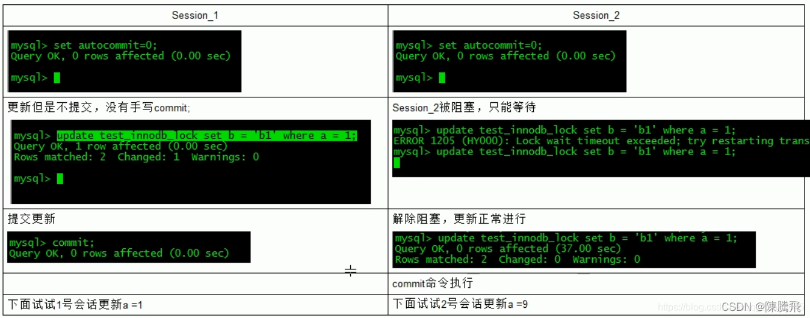

> *   无索引行锁升级为表锁
>     *   如果在更新数据的时候出现了强制类型转换导致索引失效，使得行锁变表锁，即在操作不同行的时候，会出现阻塞的现象。
> *   间隙锁危害  
>     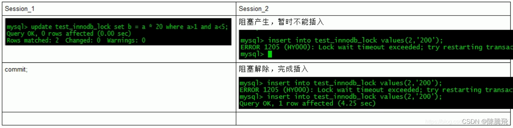
> *   什么是间隙锁：当我们用范围条件而不是相等条件索引数据，并请求共享或排他锁时，InnoDB会给符合条件的已有数据记录的索引项加锁；对于键值在条件范围内但并不存在的记录，叫做“间隙（GAP）”。InnoDB也会对这个“间隙”加锁，这种锁机制就是所谓的间隙锁（Next-Key锁）。
> *   危害：
>     *   因为Query执行过程中通过范围查找的话，会锁定整个范围内所有的索引键值，即使这个键值并不存在。
>     *   间隙锁有一个比较致命的弱点，就是当锁定一个范围键值之后，即使某些不存在的键值也会被无辜的锁定，而造成在锁定的时候无法插入锁定键值范围内的任何数据。在某些场景下这可能会对性能造成很大的危害。

试题：常考如何锁定一行

```
select * from 表 where 某一行的条件 for update; 
```

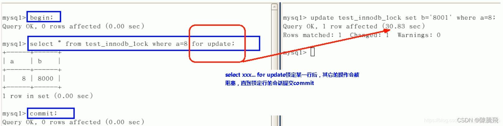

> 案例结论
>
> *   InnoDB存储引擎由于实现了行级锁定，虽然在锁定机制的实现方面所带来的性能损耗可能比表级锁定会更高一些，但是在整体并发处理能力方面要远远优于MyISAM的表级锁定的。当系统并发量较高的时候，InnoDB的整体性能和MyISAM相比就会有比较明显的优势了。
> *   但是，InnoDB的行级锁定同样也有其脆弱的一面，当我们使用不当的时候，可能会让InnoDB的整体性能表现不仅不能比MyISAM高，甚至可能会更差。

> 行锁分析
>
> *   如何分析行锁定
>     *   通过检查InnoDB\_row\_lock状态变量来分析系统上的行锁的争夺情况  
>         show status like ‘innodb\_row\_lock%’;  
>         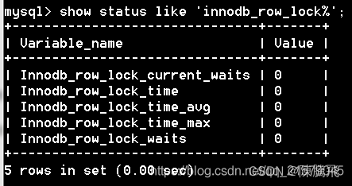
>     *   对各个状态量的说明如下：
>         *   Innodb\_row\_lock\_current\_waits：当前正在等待锁定的数量；
>         *   innodb\_row\_lock\_time：从系统启动到现在锁定总时间长度；
>         *   innodb\_row\_lock\_time\_avg：每次等待所花平均时间；
>         *   innodb\_row\_lock\_time\_max：从系统启动到现在等待最长的一次所花的时间；
>         *   innodb\_row\_lock\_waits：系统启动后到现在总共等待的次数。
>     *   对于这5个变量，比较重要的是
>         *   innodb\_row\_lock\_time\_avg（等待平均时长）
>         *   innodb\_row\_lock\_waits（等待总次数）
>         *   innodb\_row\_lock\_time（等待总时长）
>         *   这三项
>         *   尤其是当等待次数很高，而且每次等待时长也不小的时候，我们就需要分析系统中为什么会有如此多的等待，然后根据分析结果着手制定优化计划。

> 优化建议
>
> *   尽可能让所有数据检索都通过索引来完成，避免无索引行锁升级为表锁。
> *   合理设计索引，尽量缩小锁的范围。
> *   尽可能减少索引条件，避免间隙锁。
> *   尽量控制事务大小，减少锁定资源量和时间长度。
> *   尽可能低级别事务隔离。

## 13.5 页锁

> *   开销和加锁时间介于表锁和行锁之间。
> *   会出现死锁。
> *   锁定粒度介于表锁和行锁之间。
> *   并发度一般

# 14 主从复制

> 复制的基本原理
>
> *   slave会从master读取binlog来进行数据同步
> *   三步骤+原理图

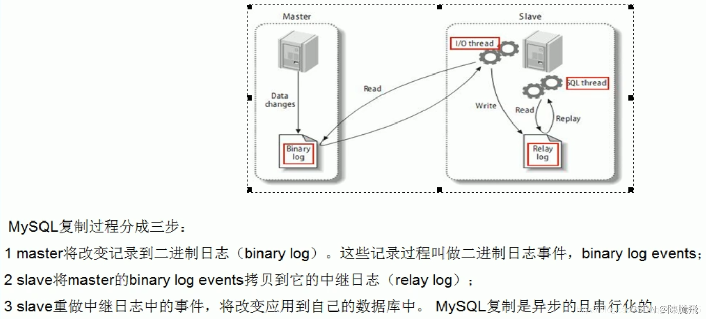

> **复制的基本原则**
>
> *   每个slave只有一个master
> *   每个slave只能有一个唯一的服务器ID
> *   每个master可以有多个slave

> **复制的最大问题**
>
> *   延时

> **一主一从常见配置**
>
> *   mysql版本一致且后台以服务运行
> *   主从都配置在\[mysqld\]结点下，都是小写
> *   主机修改my.ini配置文件
>     *   【必须】主服务器唯一ID  
>         server-id=1
>     *   【必须】启用二进制日志  
>         log-bin=自己本地的路径/mysqlbin  
>         log-bin=D:/devSoft/MySQLServer5.5/data/mysqlbin
>     *   【可选】启用错误日志  
>         log-err=自己本地的路径/mysqlerr  
>         log-err=D:/devSoft/MySQLServer5.5/data/mysqlerr
>     *   【可选】根目录  
>         basedir=自己本地路径  
>         basedir=“D:/devSoft/MySQLServer5.5/”
>     *   【可选】临时目录  
>         temdir=自己本地路径  
>         temdir=“D:/devSoft/MySQLServer5.5/”  
>         \-【可选】数据目录  
>         datadir=自己本地路径/Data/  
>         datadir=“D:/devSoft/MySQLServer5.5/Data/”
>     *   read-only=0  
>         主机，读写都可以
>     *   【可选】设置不要复制的数据库  
>         binlog-ignore-db=mysql
>     *   【可选】设置需要复制的数据库  
>         binlog-do-db=需要复制的主数据库名字
> *   从机修改my.cnf配置文件
>     *   【必须】从服务器唯一ID  
>         server-id=2
>     *   【可选】启用二进制日志
> *   因修改过配置文件，请主机+从机都重启后台mysql服务
> *   主机从机都关闭防火墙
>     *   windows手动关闭
>     *   关闭虚拟机linux防火墙：service iptables stop
> *   在Windows主机上建立账户并授权slave
>     *   `GRANT REPLICATION SLAVE ON *.* TO 'zhangsan' @ '192.168.14.167【从机数据库IP】' IDENTIFIED BY '123456';`
>     *   flush privileges;
>     *   查询master的状态
>         *   show master status  
>             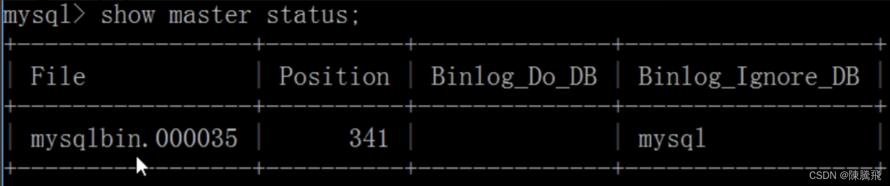
>         *   记录下File和Position的值
>     *   执行完此步骤后不要再操作主服务器MYSQL，防止主服务器状态值变化
> *   在Linux从机上配置需要复制的主机
>     *   `CHANGE MASTER TO MASTER_HOST='主机IP', MASTER_USER='zhangsan', MASTER_PASSWORD='123456', MASTER_LOG_FILE='file名字', MASTER_LOG_POS=position数字;`  
>         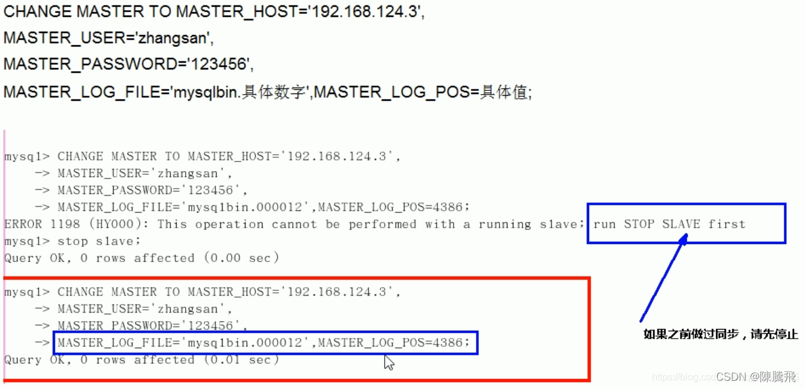  
>         eg  
>         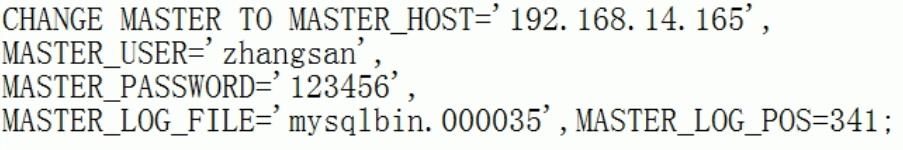
>     *   启动从服务器复制功能
>         *   start slave;
>     *   show slave status\\G【\\G是为了以键值的形式显示，好看一些】
>         *   下面两个参数都是Yes，则说明主从配置成功！
>         *   Slave\_IO\_Running：Yes
>         *   Slave\_SQL\_Running：Yes  
>             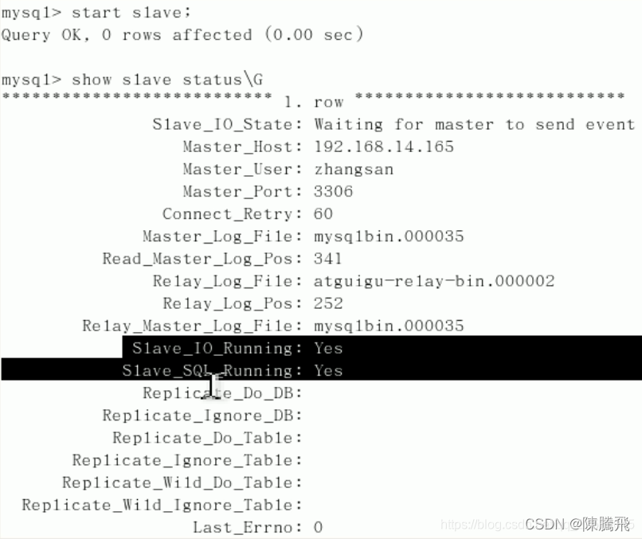
> *   主机新建库、新建表、insert记录，从机复制
> *   如何停止从服务复制功能
>     *   stop slave;
