[^版权说明]: 北京动力节点  [www.bjpowernode.com](http://www.bjpowernode.com)，该笔记整理自    动力节点    ，没有经过作者同意，禁止转载，禁止商业用途，违者必究

[toc]

# mysql

#      内容     

##      1、数据库概述及数据准备     

###      1.1、SQL概述      

SQL，一般发音为sequel，SQL的全称Structured Query Language)，SQL用来和数据库打交道，完成和数据库的通信，SQL是一套标准。但是每一个数据库都有自己的特性别的数据库没有,当使用这个数据库特性相关的功能,这时SQL语句可能就不是标准了.(90%以上的SQL都是通用的)

###      1.2、什么是数据库      

数据库，通常是一个或一组文件，保存了一些符合特定规格的数据,数据库对应的英语单词是DataBase,简称:DB,数据库软件称为数据库管理系统（DBMS），全称为DataBase Management System，如：Oracle、SQL Server、MySql、Sybase、informix、DB2、interbase、PostgreSql 。

 

###      1.3、MySql概述      

MySQL最初是由“MySQL AB”公司开发的一套关系型数据库管理系统（RDBMS-Relational Database Mangerment System）。

MySQL不仅是最流行的开源数据库，而且是业界成长最快的数据库，每天有超过7万次的下载量，其应用范围从大型企业到专有的嵌入应用系统。

MySQL AB是由两个瑞典人和一个芬兰人：David Axmark、Allan Larsson和Michael “Monty” Widenius在瑞典创办的。

在2008年初，Sun Microsystems收购了MySQL AB公司。在2009年，Oracle收购了Sun公司，使MySQL并入Oracle的数据库产品线。 

 

###      1.4、MySql的安装      

打开下载的mysql安装文件mysql-essential-5.0.22-win32.msi，双击运行，出现如下界面

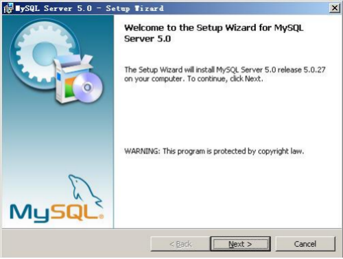 

按“Next”继续

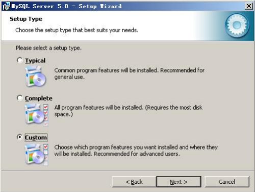 

选择安装类型，有“Typical（默认）”、“Complete（完全）”、“Custom（用户自定义）”三个选项，我们选择“Custom”，有更多的选项，也方便熟悉安装过程

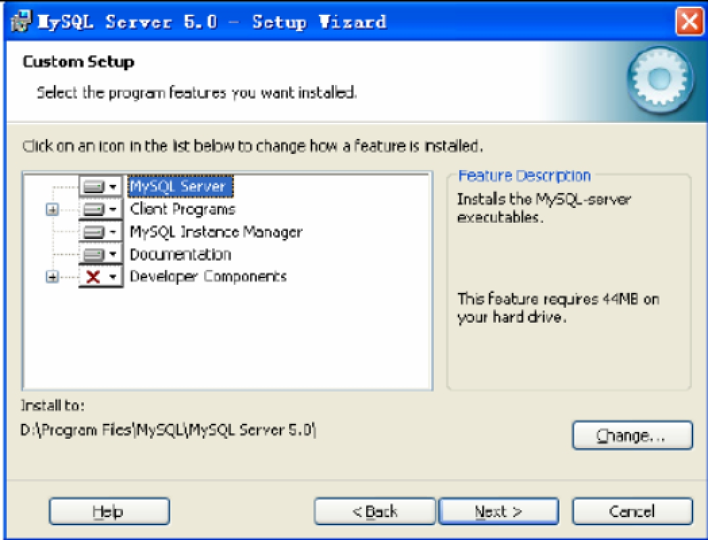 

上一步选择了 Custom 安装，这里将设定 MySQL 的组件包和安装路径，设定好之后，单击 Next 继续安装。

 

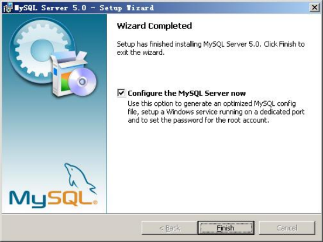 

现在软件安装完成了，出现上面的界面，将 “Configure the Mysql Server now”前面的勾打上，点“Finish”结束软件的安装并启动mysql配置向导。

mysql配置向导启动界面，按“Next”继续。

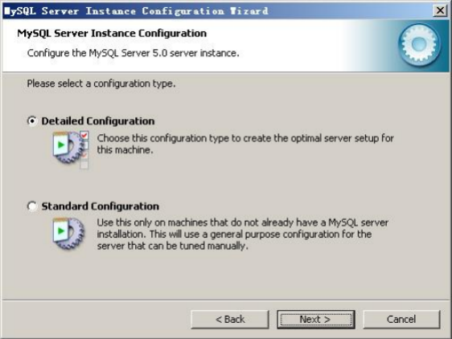 

选择配置方式，“Detailed Configuration（手动精确配置）”、“Standard Configuration（标准配置）”，我们选择“Detailed Configuration”，方便熟悉配置过程。

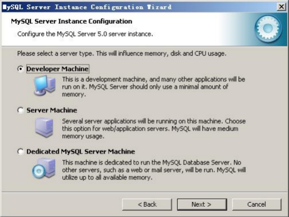 

选择服务器类型，“Developer Machine（开发测试类，mysql占用很少资源）”、“Server Machine（服务器类型，mysql占用较多资源）”、“Dedicated MySQL Server Machine（专门的数据库服务器，mysql占用所有可用资源）”，大家根据自己的类型选择了，一般选“Server Machine”，不会太少，也不会占满。

 

选择mysql数据库的大致用途，“Multifunctional Database（通用多功能型，能很好的支持InnoDB与MyISAM存储引擎）”、“Transactional Database Only（服务器类型，专注于事务处理，一般）”、“Non-Transactional Database Only（非事务处理型，较简单，主要做一些监控、记数用，对MyISAM数据类型的支持仅限于non-transactional），随自己的用途而选择了，我这里选择“Multifunctional Database”， 按“Next”继续。

 

对InnoDB Tablespace进行配置，就是为InnoDB 数据库文件选择一个存储空间，如果修改了，要记住位置，重装的时候要选择一样的地方，否则可能会造成数据库损坏，当然，对数据库做个备份就没问题了，这里不详述。我这里没有修改，使用用默认位置，直接按“Next”继续。

 

选择您的网站的一般mysql访问量，同时连接的数目，“Decision Support(DSS)/OLAP（20个左右）”、“Online Transaction Processing(OLTP)（500个左右）”、“Manual Setting（手动设置，自己输一个数）”，我这里选“Decision Support(DSS)/OLAP)”，按“Next”继续

 

是否启用TCP/IP连接，设定端口，如果不启用，就只能在自己的机器上访问mysql数据库了，我这里启用，把前面的勾打上，Port Number：3306，在这个页面上，您还可以选择“启用标准模式”（Enable Strict Mode），按“Next”继续。

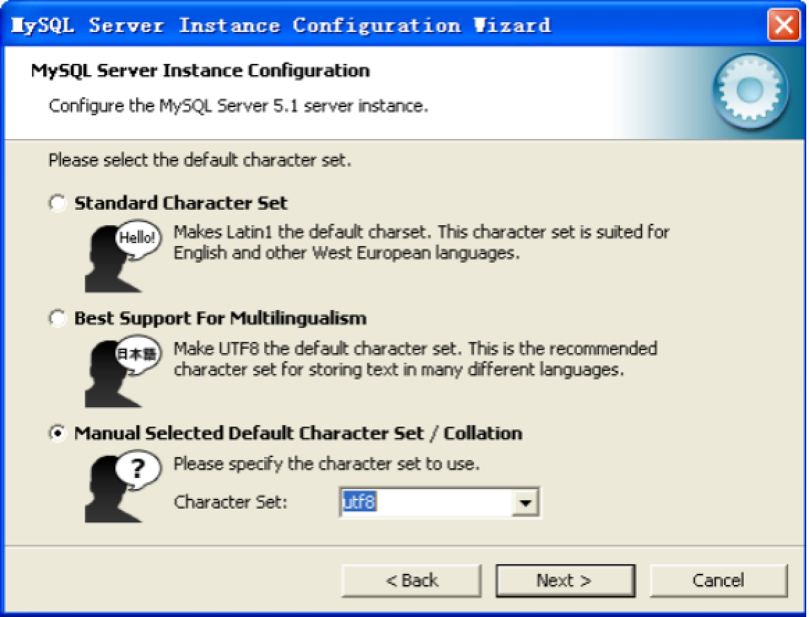 

这个比较重要，就是对mysql默认数据库语言编码进行设置，第一个是西文编码，我们要设置的是utf8编码，按 “Next”继续。

 

选择是否将mysql安装为windows服务，还可以指定Service Name（服务标识名称），是否将mysql的bin目录加入到Windows PATH（加入后，就可以直接使用bin下的文件，而不用指出目录名，比如连接，“mysql.exe -uusername -ppassword;”就可以了，不用指出mysql.exe的完整地址，很方便），我这里全部打上了勾，Service Name不变。按“Next”继续。

 

设置完毕，按“Next”继续。

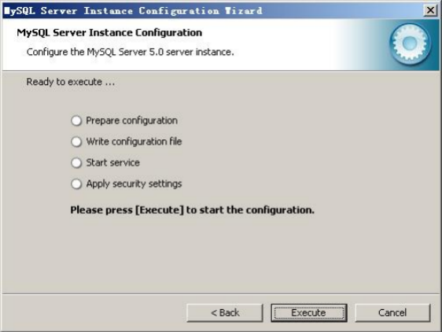 

确认设置无误，如果有误，按“Back”返回检查。按“Execute”使设置生效。

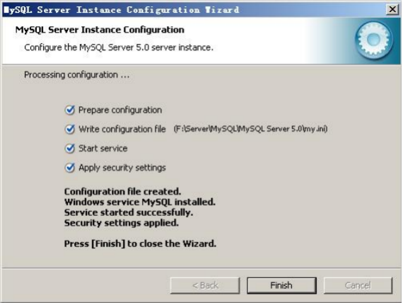 

设置完毕，按“Finish”结束mysql的安装与配置

 

可以通过服务管理器管理 MYSQL 的服务。

通过命令调用服务管理器:services.msc

停止 MYSQL 的服务。

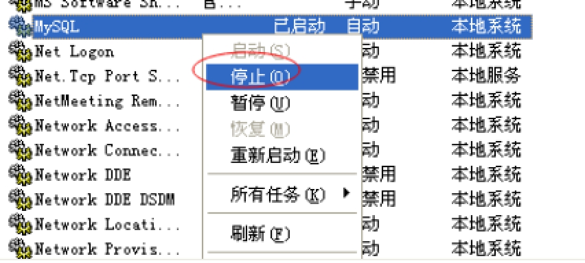 

启动 MYSQL 的服务。

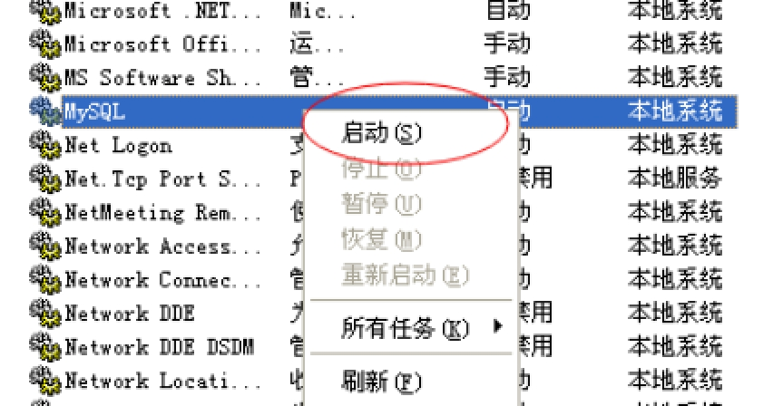 

 

也可以在 DOS 中直接通过命令行的形式进行控制。

停止 MYSQL 的服务。

 

启动 MYSQL 的服务。 

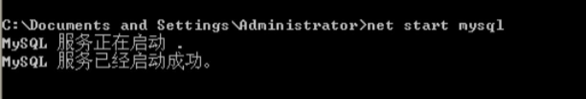 

###      1.5、表     

表(table)是一种     结构化的文件     ，可以用来存储特定类型的数据，如：学生信息，课程信息，都可以放到表中。另外表都有特定的名称，而且不能重复。表中具有几个概念：列、行、主键。 列叫做字段(Column),行叫做表中的记录,每一个字段都有:字段名称/字段数据类型/字段约束/字段长度

学生信息表

| 学号（主键） | 姓名 | 性别 | 年龄 |
| ------------ | ---- | ---- | ---- |
| 00001        | 张三 | 男   | 20   |
| 00002        | 李四 | 女   | 20   |

###      1.6、SQL的分类     

数据查询语言(DQL-Data Query Language)  

代表关键字:select 

数据操纵语言(DML-Data Manipulation Language)

代表关键字:insert,delete,update 

数据定义语言(DDL-Data Definition Language)

代表关键字:create ,drop,alter,

事务控制语言(TCL-Transactional Control Language)

代表关键字:commit ,rollback;

数据控制语言(DCL-Data Control Language)

代表关键字:grant,revoke.

###      1.7、导入演示数据     

使用MySQL命令行客户端来装载数据库。

1) 连接MySql

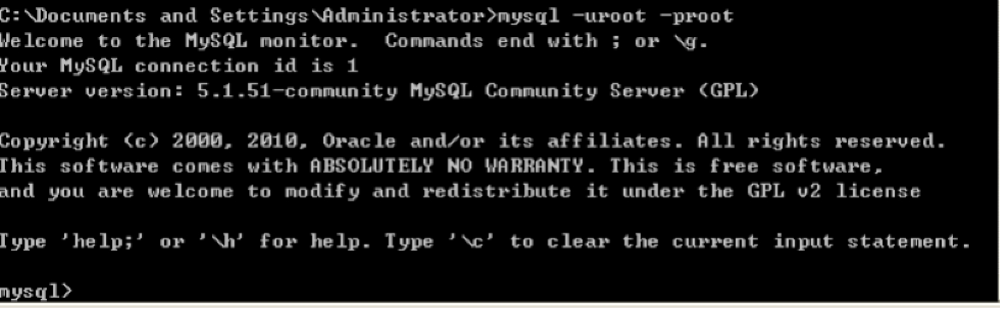 

2) 创建“bjpowernode”数据库

mysql> create database bjpowernode;

3) 选择数据库

mysql> use bjpowernode

4) 导入数据

mysql>source D:  bjpowernode.sql

5) 删除数据库(这里不要做!)

mysql> drop database bjpowernode;

###      1.8、表结构描述     

表名称：dept

描述：部门信息表

| 英文字段名称 | 中文描述 | 类型        |
| ------------ | -------- | ----------- |
| DEPTNO       | 部门编号 | INT(2)      |
| DNAME        | 部门名称 | VARCHAR(14) |
| LOC          | 位置     | VARCHAR(13) |

 

表名称：emp

描述：员工信息表

 

| 英文字段名称 | 中文描述 | 类型         |
| ------------ | -------- | ------------ |
| EMPNO        | 员工编号 | INT (4)      |
| ENAME        | 员工姓名 | VARCHAR(10)  |
| JOB          | 工作岗位 | VARCHAR(9)   |
| MGR          | 上级领导 | INT (4)      |
| HIREDATE     | 入职日期 | DATE         |
| SAL          | 薪水     | DOUBLE(7,2)  |
| COMM         | 津贴     | DOUBLE (7,2) |
| DEPTNO       | 部门编号 | INT(2)       |

注：DEPTNO字段是外键，DEPTNO的值来源于dept表的主键，起到了约束的作用

表名称：salgrade

描述：薪水等级信息表

| 英文字段名称 | 中文描述 | 类型 |
| ------------ | -------- | ---- |
| GRADE        | 等级     | INT  |
| LOSAL        | 最低薪水 | INT  |
| HISAL        | 最高薪水 | INT  |

 

##      2、常用命令     

###      2.1、查看msyql版本     

• MySQL程序选项具有以下两种通用形式：

– 长选项，由单词之前加两个减号组成

– 短选项，由单个字母之前加一个减号组成

C: Users Administrator>mysql --version

mysql  Ver 14.14 Distrib 5.5.36, for Win32 (x86)

C: Users Administrator>mysql -V

mysql  Ver 14.14 Distrib 5.5.36, for Win32 (x86)

###      2.2、创建数据库     

  1. create database 数据库名称;

create database  bjpowernode;

  2. use 数据库名称

use bjpowernode;

在数据库中建立表，因此创建表的时候必须要先选择数据库。

###      2.3、查询当前使用的数据库     

select  database();

查询数据库版本也可以使用

select  version();

###      2.4、终止一条语句     

如果想要终止一条正在编写的语句，可键入 c。

###      2.5、退出          mysql     

可使用 q、QUIT或EXIT：

如：

mysql>  q (ctrl+c)

##      3、查看“演示数据”的表结构     

###      3.1、查看和指定现有的数据库     

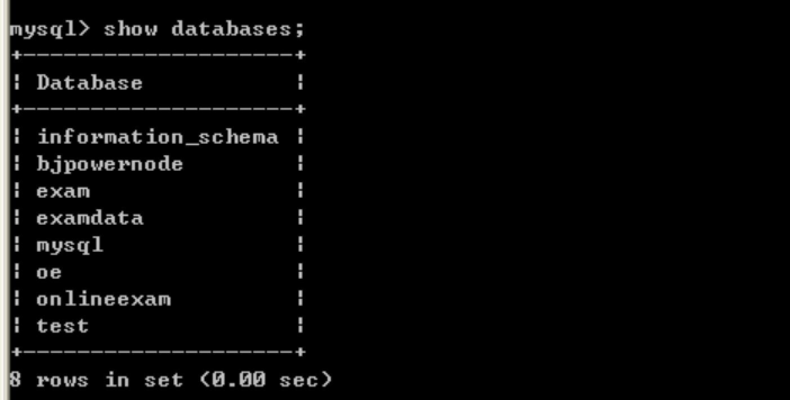 

###      3.2、指定当前缺省数据库     

 

###      3.3、查看当前使用的库     

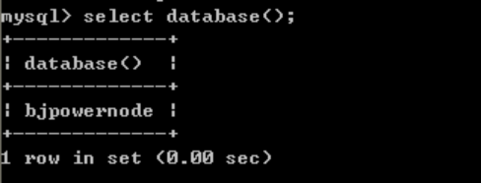 

###      3.4、查看当前库中的表     

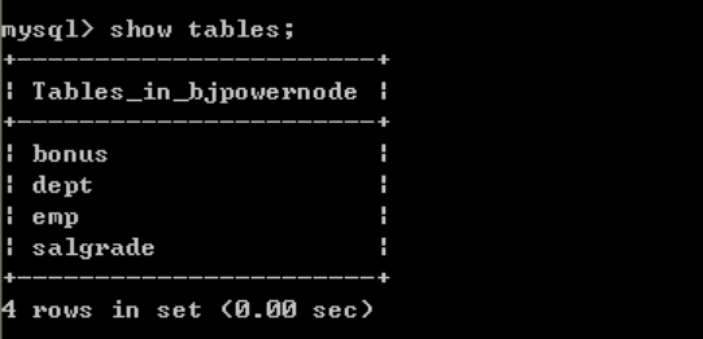 

###      3.5、查看其他库中的表     

show tables from <database name>;

如查看exam库中的表

 

 

 

 

###      3.6、查看表的结构     

desc <table name>;

如：

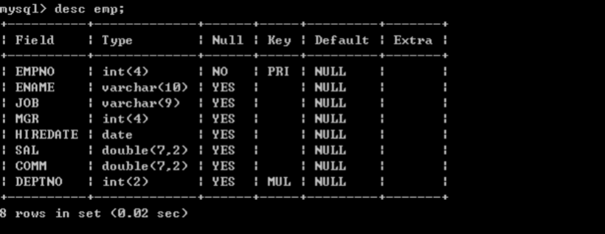 

###      3.7、查看表的创建语句     

show create table <table name>;

如：

  

 

 

##      4、简单的查询     

###      4.1、查询一个字段     

l 查询员工姓名

| select ename from emp;    |
| ------------------------- |
|  |

Select语句后面跟的是字段名称，select是关键字，select和字段名称之间采用空格隔开，from表示将要查询的表，它和字段之间采用空格隔开

 

###      4.2、查询多个字段     

l 查询员工的编号和姓名

select empno, ename from emp;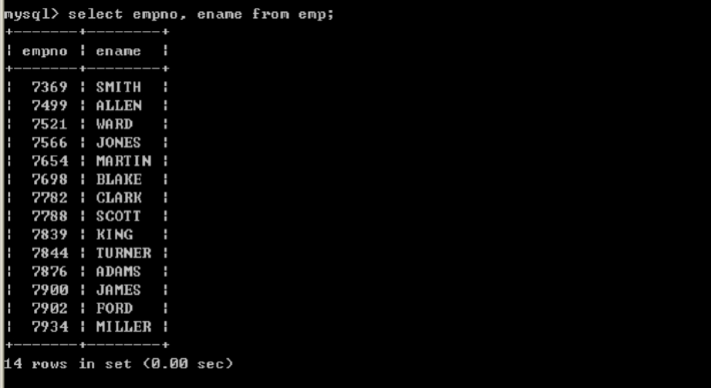 

查询多个字段，select中的字段采用逗号间隔即可，最后一个字段，也就是在from前面的字段不能使用逗号了。

 

###      4.3、查询全部字段     

可以将所有的字段放到select语句的后面，这种方案不方便，但是比较清楚，我们可以采用如下便捷的方式查询全部字段

select   from emp;

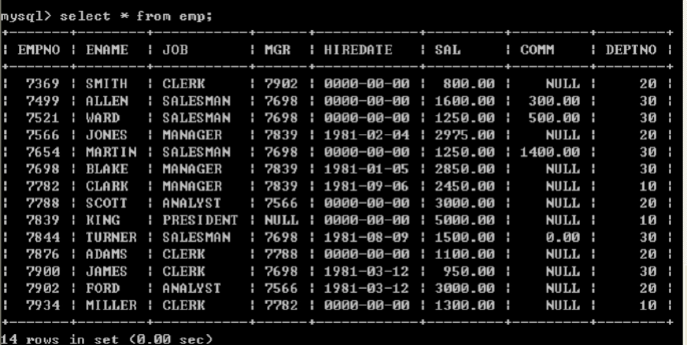 

采用select   from emp，虽然简单，但是 号不是很明确，建议查询全部字段将相关字段写到select语句的后面,在以后java连接数据库的时候,是需要在java程序中编写SQL语句的,这个时候编写的SQL语句不建议使用select    这种形式,建议写明字段,这样可读性强.

 

###      4.4、计算员工的年薪     

l 列出员工的编号，姓名和年薪

select empno, ename, sal 12 from emp;

 

在select语句中可以使用运算符，以上存在一些问题，年薪的字段名称不太明确

 

###      4.5、将查询出来的字段显示为中文     

 

select empno as ‘员工编号’, ename as ‘员工姓名’, sal 12 as ‘年薪’ from emp;注意:字符串必须添加单引号 | 双引号

 

可以采用as关键字重命名表字段，其实as也可以省略，如：

select empno  "员工编号", ename  "员工姓名", sal 12  "年薪" from emp;

##      5、条件查询     

条件查询需要用到where语句，where必须放到from语句表的后面

支持如下运算符

| 运算符           | 说明                                                         |
| ---------------- | ------------------------------------------------------------ |
| =                | 等于                                                         |
| <>或!=           | 不等于                                                       |
| <                | 小于                                                         |
| <=               | 小于等于                                                     |
| >                | 大于                                                         |
| >=               | 大于等于                                                     |
| between … and …. | 两个值之间,***\*等同于 >= and <=\****                        |
| is null          | 为null（is not null 不为空）                                 |
| ***\*and\****    | 并且                                                         |
| ***\*or\****     | 或者                                                         |
| in               | 包含，相当于多个or（not in不在这个范围中）                   |
| not              | not可以取非，主要用在is 或in中                               |
| like             | like称为模糊查询，支持%或下划线匹配%匹配任意个字符下划线，一个下划线只匹配一个字符 |

 

###      5.1、等号操作符     

l 查询薪水为5000的员工

select empno, ename, sal from emp where sal=5000;

 

l 查询job为MANAGER的员工

select empno, ename from emp where job=manager;

 

以上查询出现错误，因为job为字符串，所以出现了以上错误

select empno, ename from emp where job="manager";

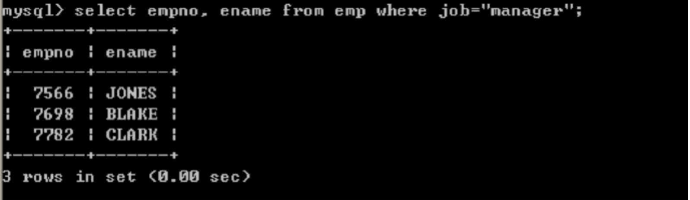 

select empno, ename from emp where job=’manager’;

 

 

也可以使用单引号

select empno, ename from emp where job='MANAGER';

 

以上输出正确，Mysql默认情况下大小写是不敏感的。

 

注意：

MySQL在windows下是不区分大小写的，将script文件导入MySQL后表名也会自动转化为小写，结果再 想要将数据库导出放到linux服务器中使用时就出错了。因为在linux下表名区分大小写而找不到表，查了很多都是说在linux下更改MySQL的设置使其也不区分大小写，但是有没有办法反过来让windows 下大小写敏感呢。其实方法是一样的，相应的更改windows中MySQL的设置就行了。

    具体操作：
    
    在MySQL的配置文件my.ini中增加一行：
    
    lower_case_table_names = 0
    
    其中 0：区分大小写，1：不区分大小写
    
    MySQL在Linux下数据库名、表名、列名、别名大小写规则是这样的：

　　  1、数据库名与表名是严格区分大小写的；

　　  2、表的别名是严格区分大小写的；

　　  3、列名与列的别名在所有的情况下均是忽略大小写的；

　　  4、变量名也是严格区分大小写的；  MySQL在Windows下都不区分大小写

 

 

 

 

###      5.2、     	     <>操作符     

l 查询薪水不等于5000的员工

select empno, ename, sal from emp where sal <> 5000;

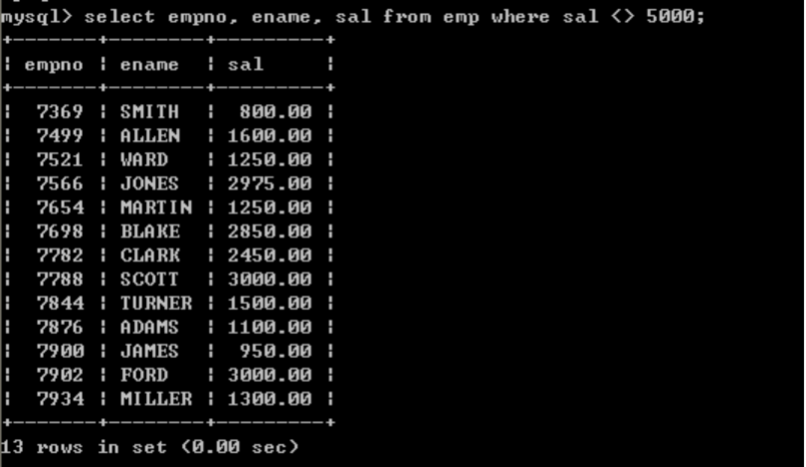 

一下写法等同于以上写法，建议使用第一种写法

select empno, ename, sal from emp where sal != 5000;

 

数值也可以采用单引号引起来，如一下语句是正确的(不建议这么写)：

select empno, ename, sal from emp where sal <> '5000';

l 查询工作岗位不等于MANAGER的员工

select empno, ename from emp where job <> 'MANAGER';

 

###      5.3、between           …           and           …          操作符     

l 查询薪水为1600到3000的员工(第一种方式，采用>=和<=)

select empno, ename, sal from emp where sal >= 1600 and sal <= 3000;

 

l 查询薪水为1600到3000的员工(第一种方式，采用between … and …)

select empno, ename, sal from emp where sal between 1600 and 3000;

 

关于between … and …，它是包含最大值和最小值的

 

###      5.4、is null     

l Null为空，但不是空串，为null可以设置这个字段不填值，如果查询为null的字段，采用is null

l 查询津贴为空的员工

select   from emp where comm=null;

 

以上也无法查询出符合条件的数据，因为null类型比较特殊，必须使用 is来比较

select   from emp where comm is null;

 

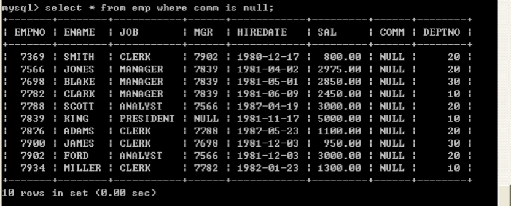 

以上查询正确

 

###      5.5、 and     

and表示并且的含义，表示所有的条件必须满足

l 工作岗位为MANAGER,薪水大于2500的员工

select   from emp where job='MANAGER' and sal > 2500;

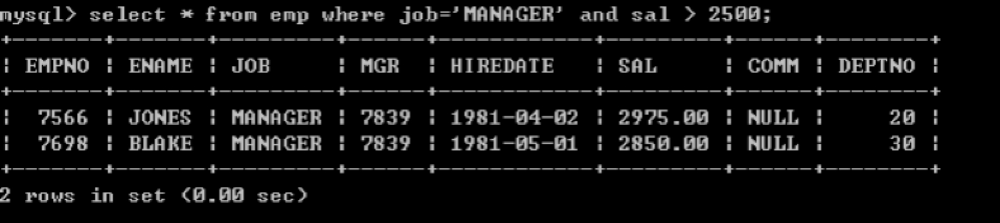 

 

 

 

###      5.6、or     

or，只要满足条件即可,相当于包含

l 查询出job为manager或者job为salesman的员工

select   from emp where job='MANAGER' or job='SALESMAN';

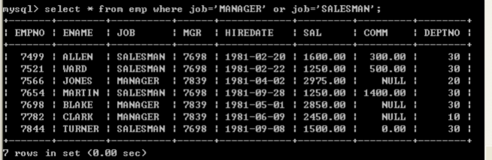 

###      5.7、表达式的优先级     

l 查询薪水大于1800，并且部门代码为20或30的员工（错误的写法）

select   from emp where sal > 1800 and deptno = 20 or deptno = 30;

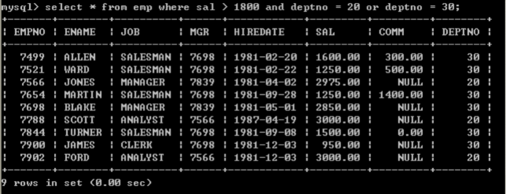 

以上输出不是预期结果，薪水小于1800的数据也被查询上来了，原因是表达式的优先级导致的，首先过滤sal > 1800 and deptno = 20，然后再将deptno = 30员工合并过来，所以是不对的

l 查询薪水大于1800，并且部门代码为20或30的（正确的写法）

select   from emp where sal > 1800 and (deptno = 20 or deptno = 30);

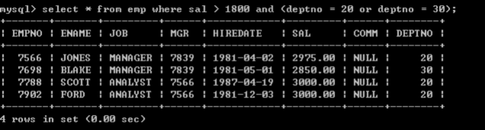 

关于运算符的问题：不用记，没有把握尽量采用括号

###      5.8、in     

in表示包含的意思，完全可以采用or来表示，采用in会更简洁一些

l 查询出job为manager或者job为salesman的员工

select   from emp where job in ('manager','salesman');

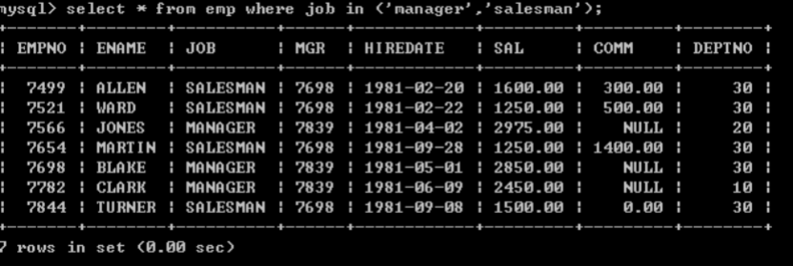 

 

l 查询出薪水包含1600和薪水包含3000的员工

select   from emp where sal in(1600, 3000);

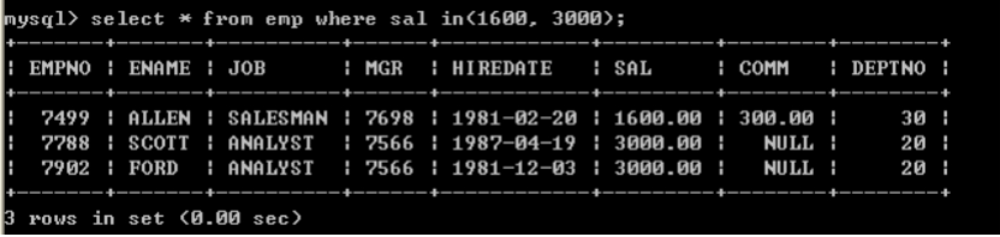 

###      5.9、not     

l 查询出薪水不包含1600和薪水不包含3000的员工（第一种写法）

select   from emp where sal <> 1600 and sal <> 3000;

 

 

l 查询出薪水不包含1600和薪水不包含3000的员工（第二种写法

select   from emp where not (sal = 1600 or sal = 3000);

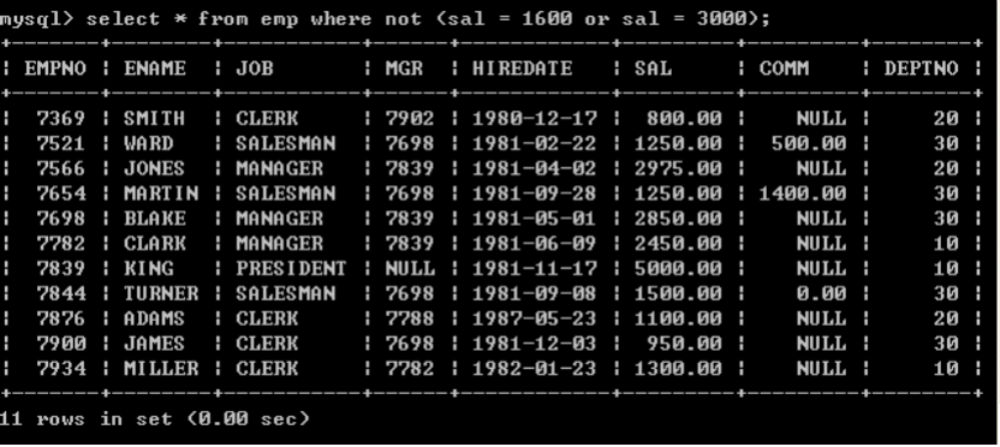 

l 查询出薪水不包含1600和薪水不包含3000的员工（第三种写法）

select   from emp where sal not in (1600, 3000);

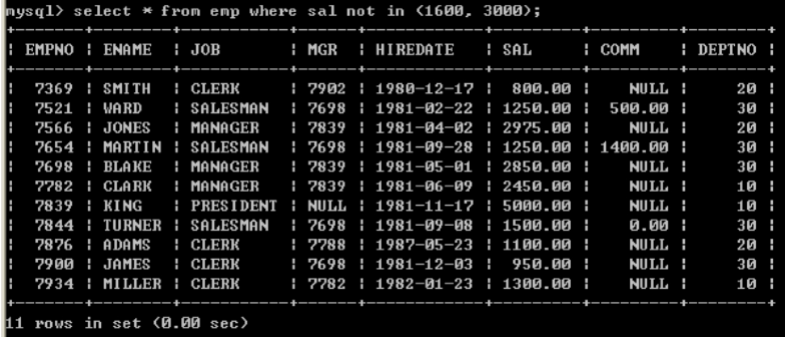 

 

l 查询出津贴不为null的所有员工

select   from emp where comm is not  null;

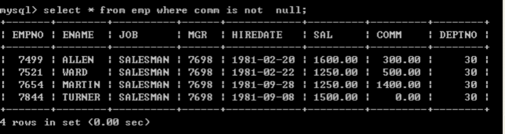 

 

###      5.10、like     

l Like可以实现模糊查询，like支持%和下划线匹配

l 查询姓名以M开头所有的员工

select   from emp where ename like 'M%';

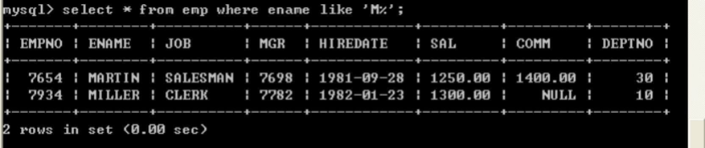 

l 查询姓名以N结尾的所有的员工

select   from emp where ename like '%N';

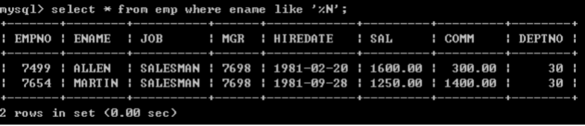 

l 查询姓名中包含O的所有的员工

select   from emp where ename like '%O%';

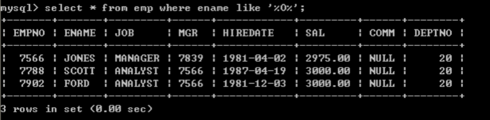 

l 查询姓名中第二个字符为A的所有员工

select   from emp where ename like '_A%';

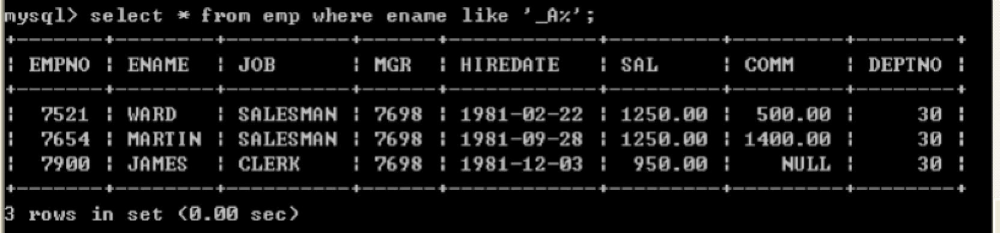Like中%和下划线的差别？

%匹配任意字符出现的个数

下划线只匹配一个字符

Like 中的表达式必须放到单引号中|双引号中，以下写法是错误的：

select   from emp where ename like _A%

 

 

##      6、排序数据     

 

###      6.1、单一字段排序     

排序采用order by子句，order by后面跟上排序字段，排序字段可以放多个，多个采用逗号间隔，order by默认采用升序，如果存在where子句那么order by必须放到where语句的后面

l 按照薪水由小到大排序(系统默认由小到大)

select   from emp order by sal;

 

l 取得job为MANAGER的员工，按照薪水由小到大排序(系统默认由小到大)

select   from emp where job='MANAGER' order by sal;

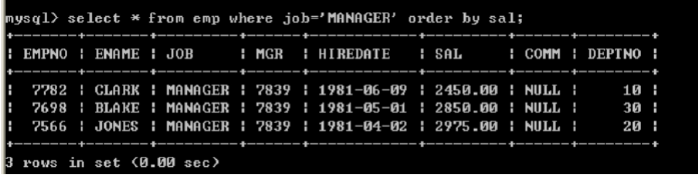 

如果包含where语句order by必须放到where后面，如果没有where语句order by放到表的后面

以下写法是错误的：

select   from emp order by sal where job='MANAGER';

l 按照多个字段排序，如：首先按照job排序，再按照sal排序

select   from emp order by job,sal;

 

 

 

 

###      6.2、手动指定排序顺序     

l 手动指定按照薪水由小到大排序

select   from emp order by sal asc;

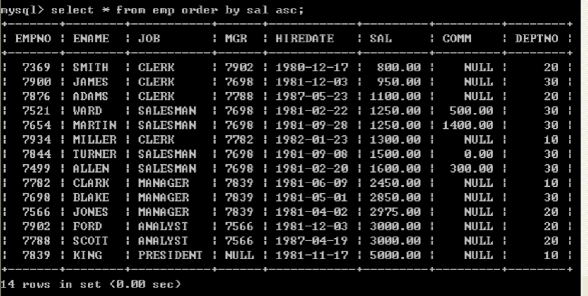 

l 手动指定按照薪水由大到小排序

select   from emp order by sal desc;

 

 

###      6.3、多个字段排序     

l 按照job和薪水倒序

select   from emp order by job desc, sal desc;

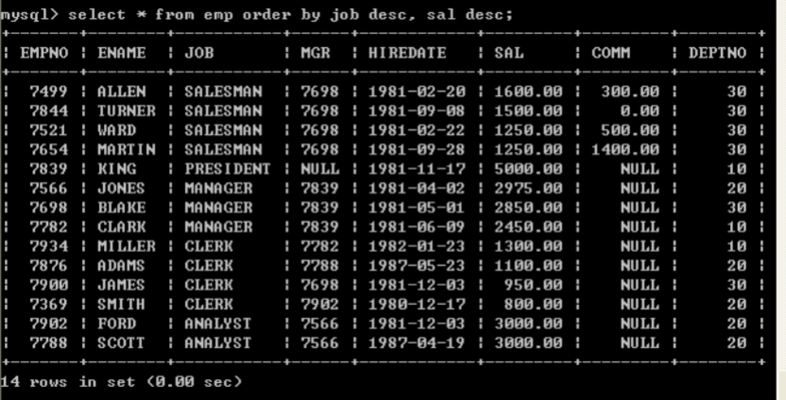 

如果采用多个字段排序，如果根据第一个字段排序重复了，会根据第二个字段排序

###      6.4、使用字段的位置来排序     

l 按照薪水升序

select   from emp order by 6;

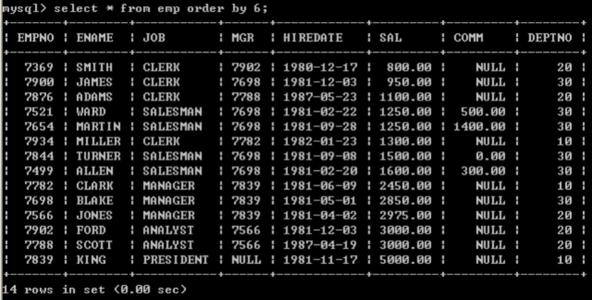 

 

不建议使用此种方式，采用数字含义不明确，程序不健壮

##      7、分组函数/聚合函数/多行处理函数     

| count | 取得记录数 |
| ----- | ---------- |
| sum   | 求和       |
| avg   | 取平均     |
| max   | 取最大的数 |
| min   | 取最小的数 |

 

     注意：分组函数自动忽略空值，不需要手动的加where条件排除空值。     
    
     select count(  ) from emp           where xxx          ;     			     符合条件的所有记录总数。     
    
     select count(comm) from emp;     	       comm这个字段中不为空的元素总数。     

 

注意：分组函数不能直接使用在where关键字后面。

mysql> select ename,sal from emp where sal > avg(sal);

ERROR 1111 (HY000): Invalid use of group function

###      7.1、count     

l 取得所有的员工数

select count( ) from emp;

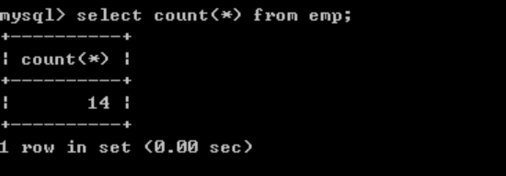Count( )表示取得所有记录，忽略null，为null的值也会取得

l 取得津贴不为null员工数

select count(comm) from emp;

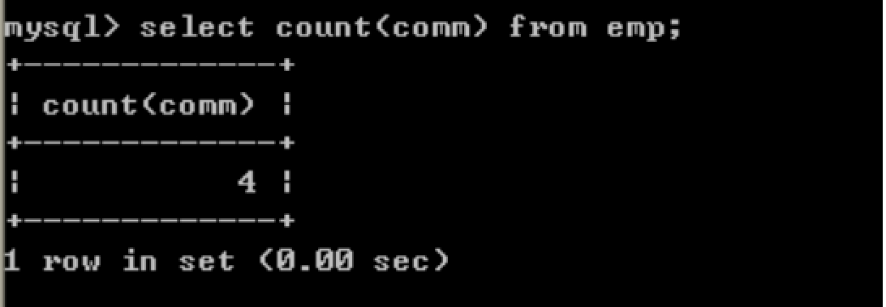 

采用count(字段名称)，不会取得为null的记录

l 取得工作岗位的个数

select count(distinct job ) from emp;

 

 

###      7.2、sum     

l Sum可以取得某一个列的和，null会被忽略

l 取得薪水的合计

select sum(sal) from emp;

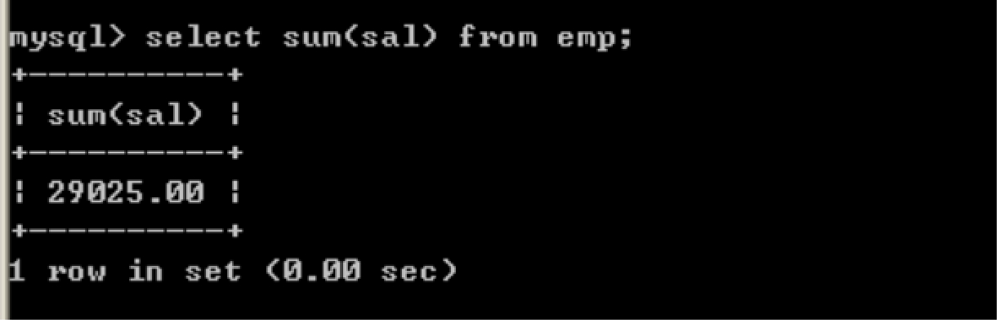 

l 取得津贴的合计

select sum(comm) from emp;

 

null会被忽略

l 取得薪水的合计（sal+comm）

select sum(sal+comm) from emp; 

从以上结果来看，不正确，原因在于comm字段有null值，所以无法计算，sum会忽略掉，正确的做法是将comm字段转换成0

select sum(sal+IFNULL(comm, 0)) from emp;

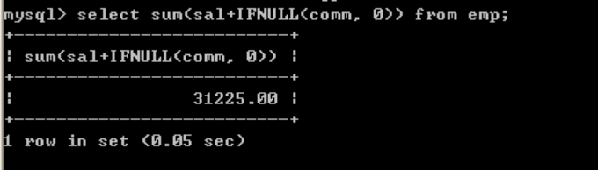 

###      7.3、avg     

取得某一列的平均值

l 取得平均薪水

select avg(sal) from emp;

 

 

###      7.4、max     

取得某个一列的最大值

l 取得最高薪水

select max(sal) from emp;

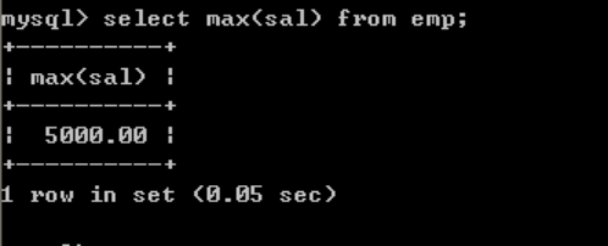 

 

l 取得最晚入职得员工

select max(str_to_date (hiredate, '%Y-%m-%d')) from emp;

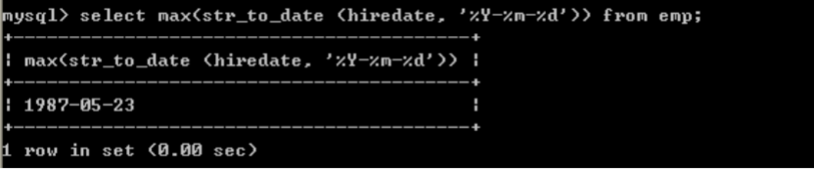 

###      7.5、min     

取得某个一列的最小值

l 取得最低薪水

select min(sal) from emp;

 

l 取得最早入职得员工（可以不使用str_to_date转换）

select min(str_to_date(hiredate, '%Y-%m-%d')) from emp;

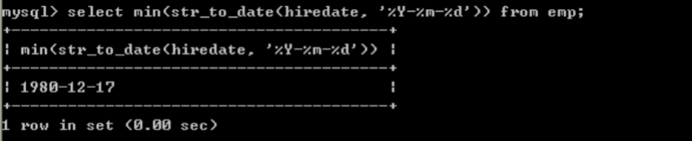 

 

###      7.6、组合聚合函数     

可以将这些聚合函数都放到select中一起使用

select count( ),sum(sal),avg(sal),max(sal),min(sal) from emp;

 

 

##      8、分组查询     

分组查询主要涉及到两个子句，分别是：group by和having

###      8.1、group by     

l 取得每个工作岗位的工资合计，要求显示岗位名称和工资合计

select job, sum(sal) from emp group by job;

 

 

如果使用了order by，order by必须放到group by后面

 

l 按照工作岗位和部门编码分组，取得的工资合计

n 原始数据

 

 

n 分组语句

select job,deptno,sum(sal) from emp group by job,deptno;

 

 

mysql> select empno,deptno,avg(sal) from emp group by deptno;

+-------+--------+-------------+

| empno | deptno | avg(sal)   |

+-------+--------+-------------+

|  7782 |   10 | 2916.666667 |

|  7369 |   20 | 2175.000000 |

|  7499 |   30 | 1566.666667 |

+-------+--------+-------------+

以上SQL语句在Oracle数据库中无法执行，执行报错。

以上SQL语句在Mysql数据库中可以执行，但是执行结果矛盾。

在SQL语句中若有group by 语句，那么在select语句后面只能跟     分组函数          +          参与分组的字段     。

###      8.2、having     

如果想对分组数据再进行过滤需要使用having子句

取得每个岗位的平均工资大于2000

select job, avg(sal) from emp group by job having avg(sal) >2000;

 

分组函数的执行顺序：

根据条件查询数据

分组

采用having过滤，取得正确的数据

###      8.3、select语句总结     

一个完整的select语句格式如下

select 字段from 表名where …….group by ……..having …….(就是为了过滤分组后的数据而存在的—不可以单独的出现)order by ……..

以上语句的执行顺序

  1. 首先执行where语句过滤原始数据

  2. 执行group by进行分组

  3. 执行having对分组数据进行操作

  4. 执行select选出数据

  5. 执行order by排序

 

原则：能在where中过滤的数据，尽量在where中过滤，效率较高。having的过滤是专门对分组之后的数据进行过滤的。

 

 

 

##      9、连接查询     

###      9.1、SQL92语法     

连接查询：也可以叫跨表查询，需要关联多个表进行查询

l 显示每个员工信息，并显示所属的部门名称

| select ename, dname from emp, dept;                          |
| ------------------------------------------------------------ |
| SQL> select ename, dname from emp, dept; ENAME    DNAME---------- --------------SMITH    ACCOUNTINGALLEN    ACCOUNTINGWARD    ACCOUNTINGJONES    ACCOUNTINGMARTIN   ACCOUNTINGBLAKE    ACCOUNTINGCLARK    ACCOUNTINGSCOTT    ACCOUNTINGKING    ACCOUNTINGTURNER   ACCOUNTINGADAMS    ACCOUNTINGJAMES    ACCOUNTINGFORD    ACCOUNTINGMILLER   ACCOUNTINGSMITH    RESEARCHALLEN    RESEARCHWARD    RESEARCHJONES    RESEARCHMARTIN   RESEARCHBLAKE    RESEARCHCLARK    RESEARCHSCOTT    RESEARCHKING    RESEARCHTURNER   RESEARCHADAMS    RESEARCHJAMES    RESEARCHFORD    RESEARCHMILLER   RESEARCHSMITH    SALESALLEN    SALESWARD    SALESJONES    SALESMARTIN   SALESBLAKE    SALESCLARK    SALESSCOTT    SALESKING    SALESTURNER   SALESADAMS    SALESJAMES    SALESFORD    SALESMILLER   SALESSMITH    OPERATIONSALLEN    OPERATIONSWARD    OPERATIONSJONES    OPERATIONSMARTIN   OPERATIONSBLAKE    OPERATIONSCLARK    OPERATIONSSCOTT    OPERATIONSKING    OPERATIONSTURNER   OPERATIONSADAMS    OPERATIONSJAMES    OPERATIONSFORD    OPERATIONSMILLER   OPERATIONS 已选择56行。 |

以上输出，不正确，输出了56条数据，其实就是两个表记录的成绩，这种情况我们称为：“笛卡儿乘积”，出现错误的原因是：没有指定连接条件

指定连接条件

select emp.ename, dept.dname from emp, dept where emp.deptno=dept.deptno;也可以使用别名select e.ename, d.dname from emp e, dept d where e.deptno=d.deptno;

 

以上结果输出正确，因为加入了正确的连接条件

以上查询也称为 “内连接”，只查询相等的数据（连接条件相等的数据）

l 取得员工和所属的领导的姓名

| select e.ename, m.ename from emp e, emp m where e.mgr=m.empno; |
| ------------------------------------------------------------ |
| SQL> select * from emp;（普通员工）   EMPNO ENAME    JOB        MGR HIREDATE        SAL    COMM   DEPTNO---------- ---------- --------- ---------- -------------- ---------- ---------- ----------   7369 SMITH    CLERK      7902 17-12月-80       800           20   7499 ALLEN    SALESMAN     7698 20-2月 -81      1600     300     30   7521 WARD    SALESMAN     7698 22-2月 -81      1250     500     30   7566 JONES    MANAGER     7839 02-4月 -81      2975           20   7654 MARTIN   SALESMAN     7698 28-9月 -81      1250    1400     30   7698 BLAKE    MANAGER     7839 01-5月 -81      2850           30   7782 CLARK    MANAGER     7839 09-6月 -81      2450           10   7788 SCOTT    ANALYST     7566 19-4月 -87      3000           20   7839 KING    PRESIDENT       17-11月-81      5000           10   7844 TURNER   SALESMAN     7698 08-9月 -81      1500      0     30   7876 ADAMS    CLERK      7788 23-5月 -87      1100           20   7900 JAMES    CLERK      7698 03-12月-81       950           30   7902 FORD    ANALYST     7566 03-12月-81      3000           20   7934 MILLER   CLERK      7782 23-1月 -82      1300           10 已选择14行。 SQL> select * from emp;（管理者）   EMPNO ENAME    JOB        MGR HIREDATE        SAL    COMM   DEPTNO---------- ---------- --------- ---------- -------------- ---------- ---------- ----------   7369 SMITH    CLERK      7902 17-12月-80       800           20   7499 ALLEN    SALESMAN     7698 20-2月 -81      1600     300     30   7521 WARD    SALESMAN     7698 22-2月 -81      1250     500     30   7566 JONES    MANAGER     7839 02-4月 -81      2975           20   7654 MARTIN   SALESMAN     7698 28-9月 -81      1250    1400     30   7698 BLAKE    MANAGER     7839 01-5月 -81      2850           30   7782 CLARK    MANAGER     7839 09-6月 -81      2450           10   7788 SCOTT    ANALYST     7566 19-4月 -87      3000           20   7839 KING    PRESIDENT       17-11月-81      5000           10   7844 TURNER   SALESMAN     7698 08-9月 -81      1500      0     30   7876 ADAMS    CLERK      7788 23-5月 -87      1100           20   7900 JAMES    CLERK      7698 03-12月-81       950           30   7902 FORD    ANALYST     7566 03-12月-81      3000           20   7934 MILLER   CLERK      7782 23-1月 -82      1300           10 已选择14行。 SQL> select e.ename, m.ename from emp e, emp m where e.mgr=m.empno; ENAME    ENAME---------- ----------SMITH    FORDALLEN    BLAKEWARD    BLAKEJONES    KINGMARTIN   BLAKEBLAKE    KINGCLARK    KINGSCOTT    JONESTURNER   BLAKEADAMS    SCOTTJAMES    BLAKEFORD    JONESMILLER   CLARK 已选择13行。 |

以上称为“自连接”，只有一张表连接，具体的查询方法，把一张表看作两张表即可，如以上示例：第一个表emp e代码了员工表，emp m代表了领导表，相当于员工表和部门表一样

###      9.2、SQL99语法     

l （内连接）显示薪水大于2000的员工信息，并显示所属的部门名称

采用SQL92语法：select e.ename, e.sal, d.dname from emp e, dept d where e.deptno=d.deptno and  e.sal > 2000;采用SQL99语法：select e.ename, e.sal, d.dname from emp e join dept d on e.deptno=d.deptno where e.sal>2000;或select e.ename, e.sal, d.dname from emp e inner join dept d on e.deptno=d.deptno where e.sal>2000;在实际中一般不加inner关键字

Sql92语法和sql99语法的区别：99语法可以做到表的连接和查询条件分离，特别是多个表进行连接的时候，会比sql92更清晰

l （外连接）显示员工信息，并显示所属的部门名称，如果某一个部门没有员工，那么该部门也必须显示出来

右连接：select e.ename, e.sal, d.dname from emp e right join dept d on e.deptno=d.deptno;左连接：select e.ename, e.sal, d.dname from dept d left join emp e on e.deptno=d.deptno;以上两个查询效果相同

 

连接分类：

内链接

   表1  inner join  表2  on  关联条件

    做连接查询的时候一定要写上关联条件
    
    inner 可以省略

外连接

 左外连接

   表1  left  outer  join  表2  on  关联条件

    做连接查询的时候一定要写上关联条件
    
    outer  可以省略 右外连接

   表1  right  outer  join  表2  on  关联条件

    做连接查询的时候一定要写上关联条件
    
    outer  可以省略

 左外连接（左连接）和右外连接（右连接）的区别：

 左连接以左面的表为准和右边的表比较，和左表相等的不相等都会显示出来，右表符合条件的显示,不符合条件的不显示

 右连接恰恰相反，以上左连接和右连接也可以加入outer关键字，但一般不建议这种写法，如：

select e.ename, e.sal, d.dname from emp e right outer join dept d on e.deptno=d.deptno;select e.ename, e.sal, d.dname from dept d left outer join emp e on e.deptno=d.deptno;

左连接能完成的功能右连接一定可以完成

 

 

##      10、子查询     

子查询就是嵌套的select语句，可以理解为子查询是一张表

###      10.1、在where语句中使用子查询，也就是在where语句中加入select语句     

l 查询员工信息，查询哪些人是管理者，要求显示出其员工编号和员工姓名

实现思路：

l 1、首先取得管理者的编号，去除重复的

select distinct mgr from emp where mgr is not null; distinct 去除重复行

l 2、查询员工编号包含管理者编号的

select empno, ename from emp where empno in(select mgr from emp where mgr is not null);

 

l 查询哪些人的薪水高于员工的平均薪水，需要显示员工编号，员工姓名，薪水

实现思路

1、 取得平均薪水

select avg(sal) from emp;

2、 取得大于平均薪水的员工

select empno, ename, sal from emp where sal > (select avg(sal) from emp);

	

###      10.2、在from语句中使用子查询，可以将该子查询看做一张表     

l 查询员工信息，查询哪些人是管理者，要求显示出其员工编号和员工姓名

首先取得管理者的编号，去除重复的

select distinct mgr from emp where mgr is not null;

将以上查询作为一张表，放到from语句的后面

使用92语法：select e.empno, e.ename from emp e, (select distinct mgr from emp where mgr is not null) m where e.empno=m.mgr;使用99语法：select e.empno, e.ename from emp e join (select distinct mgr from emp where mgr is not null) m on e.empno=m.mgr;

 

l 查询各个部门的平均薪水所属等级，需要显示部门编号，平均薪水，等级编号

实现思路

1、首先取得各个部门的平均薪水

select deptno, avg(sal) avg_sal from emp group by deptno;

 

2、将部门的平均薪水作为一张表与薪水等级表建立连接，取得等级

 

| select deptno,avg(sal) avg_sal from emp group by deptno;     |
| ------------------------------------------------------------ |
| select * from salgrade;                                      |
| select a.deptno,a.avg_sal,g.grade from (select deptno,avg(sal) avg_sal from emp group by deptno ) a join salgrade g on a.avg_sal between g.losal and hisal; |

 

 

###      10.3、在select语句中使用子查询     

l 查询员工信息，并显示出员工所属的部门名称

第一种做法，将员工表和部门表连接

select e.ename, d.dname from emp e, dept d where e.deptno=d.deptno;

第二种做法，在select语句中再次嵌套select语句完成部分名称的查询

select e.ename, (select d.dname from dept d where e.deptno=d.deptno) as dname from emp e;

 

 

##      11、union     

###      11.1、union可以合并集合（相加）     

1、查询job包含MANAGER和包含SALESMAN的员工

select   from emp where job in('MANAGER', 'SALESMAN');

 

2、采用union来合并

select   from emp where job='MANAGER'unionselect   from emp where job='SALESMAN'

 

合并结果集的时候，需要查询字段对应个数相同。  在Oracle中更严格，不但要求个数相同，而且还要求类型对应相同  。

##      12、          limit           的使用     

mySql提供了limit ，主要用于提取前几条或者中间某几行数据

select   from table limit m,n
其中m是指记录开始的index，从0开始，表示第一条记录
n是指从第m+1条开始，取n条。
select   from tablename limit 2,4
即取出第3条至第6条，4条记录

###      12.1、取得前5条数据     

select   from emp  limit 5;

 

 

 

 

###      12.2、从第二条开始取两条数据     

select   from emp  limit 1,2;

 

###      12.3、取得薪水最高的前5名      

select    from emp e order by e.sal desc limit 5;

 

 

 

##      13、表     

###      13.1、创建表     

l 语法格式

create table tableName(  columnName dataType(length),  ………………..  columnName dataType(length));set character_set_results='gbk'; show variables like '%char%'; 创建表的时候，表中有字段，每一个字段有：     字段名     字段数据类型     字段长度限制     字段约束 

l MySql常用数据类型

| 类型                         | 描述                                             |
| ---------------------------- | ------------------------------------------------ |
| Char(长度)                   | 定长字符串，存储空间大小固定，适合作为主键或外键 |
| Varchar(长度)                | 变长字符串，存储空间等于实际数据空间             |
| double(有效数字位数，小数位) | 数值型                                           |
| Float(有效数字位数，小数位)  | 数值型                                           |
| Int( 长度)                   | 整型                                             |
| bigint(长度)                 | 长整型                                           |
| Date                         | 日期型 年月日                                    |
| DateTime                     | 日期型 年月日 时分秒 毫秒                        |
| time                         | 日期型 时分秒                                    |
| BLOB                         | Binary Large OBject（二进制大对象）              |
| CLOB                         | Character Large OBject（字符大对象）             |
| 其它…………………                  |                                                  |

l 建立学生信息表，字段包括：学号、姓名、性别、出生日期、email、班级标识

create table t_student(	student_id  int(10),	student_name 	varchar(20),	sex		char(2),	birthday	date,	email		varchar(30),	classes_id	int(3)	)

 

l 向t_student表中加入数据,（必须使用客户端软件，我们的cmd默认是GBK编码,数据中设置的编码是UTF-8）

insert into t_student(student_id, student_name, sex, birthday, email, classes_id) values(1001, 'zhangsan', 'm', '1988-01-01', 'qqq@163.com', 10)

 

 

l 向t_student表中加入数据（使用默认值）

drop table if exists t_student; create table t_student(	student_id  int(10),	student_name 	varchar(20),	sex		char(2)  default  'm',	birthday	date, 	email		varchar(30),	classes_id	int(3)	) insert into t_student(student_id, student_name, birthday, email, classes_id) values(1002, 'zhangsan', '1988-01-01', 'qqq@163.com', 10)  

 

 

###      13.2、增加/删除/修改表结构     

采用alter table来增加/删除/修改表结构，不影响表中的数据

####      13.2.1、添加字段     

如：需求发生改变，需要向t_student中加入联系电话字段，字段名称为：contatct_tel 类型为varchar(40)

alter table t_student add  contact_tel varchar(40);

 

####      13.2.2、修改字段     

如：student_name无法满足需求，长度需要更改为100

alter table t_student modify student_name varchar(100) ;

 

如sex字段名称感觉不好，想用gender那么就需要更爱列的名称

 

####      13.2.3、删除字段     

如：删除联系电话字段

alter table t_student drop contact_tel;

 

###      13.3、添加、修改和删除     

####      13.3.1、insert     

添加、修改和删出都属于DML，主要包含的语句：insert、update、delete

l Insert语法格式

Insert into 表名(字段，。。。。) values(值,………..)

l 省略字段的插入

insert into emp values(9999,'zhangsan','MANAGER', null, null,3000, 500, 10);

 

 

不建议使用此种方式，因为当数据库表中的字段位置发生改变的时候会影响到insert语句

l 指定字段的插入(建议使用此种方式)

insert into emp (empno,ename,job,mgr,hiredate,sal,comm,deptno) values(9999,'zhangsan','MANAGER', null, null,3000, 500, 10);

 

出现了主键重复的错误，主键表示了记录的唯一性，不能重复

 

如何插入日期：

第一种方法，插入的日期格式和显示的日期格式一致

insert into emp(empno, ename, job, mgr, hiredate, sal, comm, deptno) values(9997,'zhangsan','MANAGER', null, '1981-06-12',3000, 500, 10);

 

第二种方法，采用str_to_date

 

insert into emp(empno, ename, job, mgr, hiredate, sal, comm, deptno) values(9996,'zhangsan','MANAGER',null,str_to_date('1981-06-12','%Y-%m-%d'),3000, 500, 10);

 

第三种方法，添加系统日期（now()）

 

insert into emp(empno, ename, job, mgr, hiredate, sal, comm, deptno) values(9995,'zhangsan','MANAGER',null,now() ,3000, 500, 10);

 

 

l 表复制

create table emp_bak as select empno,ename,sal from emp;

 

 

以上方式，会自动创建表，将符合查询条件的数据自动复制到创建的表中

l 如何将查询的数据直接放到已经存在的表中，可以使用条件

insert into emp_bak select   from emp where sal=3000;

 

####      13.3.2、update     

可以修改数据，可以根据条件修改数据

l 语法格式：

update 表名 set 字段名称1=需要修改的值1, 字段名称2=需要修改的值2 where …….

l 将job为manager的员工的工资上涨10%

update emp set sal=sal+sal 0.1 where job='MANAGER';

####      13.3.3、delete     

可以删除数据，可以根据条件删除数据

l 语法格式：

Delete from表名 where 。。。。。

l 删除津贴为500的员工

delete from emp where comm=500;

l 删除津贴为null的员工

delete from emp where comm is null;

###      13.4、创建表加入约束     

l 常见的约束

a) 非空约束，not null

b) 唯一约束，unique 

c) 主键约束，primary key

d) 外键约束，foreign key

e) 自定义检查约束，check（不建议使用）(在mysql中现在还不支持)

####      13.4.1、非空约束，not null     

非空约束，针对某个字段设置其值不为空，如：学生的姓名不能为空

drop table if exists t_student; create table t_student(	student_id  int(10),	student_name 	varchar(20) not null,	sex		char(2)  default  'm',	birthday	date, 	email		varchar(30),	classes_id	int(3)	) insert into t_student(student_id, birthday, email, classes_id) values(1002, '1988-01-01', 'qqq@163.com', 10)

 

以上错误为加入的学生姓名为空。

####      13.4.2、唯一约束，unique     

唯一性约束，它可以使某个字段的值不能重复，如：email不能重复：

 

drop table if exists t_student; create table t_student(	student_id  int(10),	student_name 	varchar(20) not null,	sex		char(2)  default  'm',	birthday	date, 	email		varchar(30) unique,	classes_id	int(3)	)insert into t_student(student_id, student_name , sex, birthday, email, classes_id) values(1001,'zhangsan','m', '1988-01-01', 'qqq@163.com', 10)

 

以上插入了重复的email，所以出现了“违反唯一约束错误”，所以unique起作用了

同样可以为唯一约束起个约束名

 

l 我们可以查看一下约束

 

mysql> use information_schema;

 

mysql> select   from table_constraints where table_name = 't_student';

 

关于约束名称可以到table_constraints中查询

以上约束的名称我们也可以自定义。

drop table if exists t_student; create table t_student(	student_id  int(10),	student_name 	varchar(20) not null,	sex		char(2)  default  'm',	birthday	date, 	email		varchar(30)  ,	classes_id	int(3)	,constraint email_unique unique(email)/ 表级约束 /)

####      13.4.3、主键约束，primary key     

每个表应该具有主键，主键可以标识记录的唯一性，主键分为单一主键和复合（联合）主键，单一主键是由一个字段构成的，复合（联合）主键是由多个字段构成的

drop table if exists t_student; create table t_student()	student_id  int(10)  primary key,/ 列级约束 /	student_name 	varchar(20) not null,	sex		char(2)  default  'm',	birthday	date, 	email		varchar(30)  ,	classes_id	int(3)	)insert into t_student(student_id, student_name , sex, birthday, email, classes_id) values(1001,'zhangsan','m', '1988-01-01', 'qqq@163.com', 10)

向以上表中加入学号为1001的两条记录，出现如下错误，因为加入了主键约束

 

 

我们也可以通过表级约束为约束起个名称：

drop table if exists t_student; create table t_student(	student_id  int(10),	student_name 	varchar(20) not null,	sex		char(2)  default  'm',	birthday	date, 	email		varchar(30)  ,	classes_id	int(3),  CONSTRAINT p_id PRIMARY key (student_id))insert into t_student(student_id, student_name , sex, birthday, email, classes_id) values(1001,'zhangsan','m', '1988-01-01', 'qqq@163.com', 10)

####      13.4.4、外键约束，foreign  key     

外键主要是维护表之间的关系的，主要是为了保证参照完整性，如果表中的某个字段为外键字段，那么该字段的值必须来源于参照的表的主键，如：emp中的deptno值必须来源于dept表中的deptno字段值。

建立学生和班级表之间的连接

首先建立班级表t_classes

drop table if exists t_classes;create table t_classes(	classes_id int(3),	classes_name varchar(40),	constraint pk_classes_id primary key(classes_id))

在t_student中加入外键约束

drop table if exists t_student;create table t_student(	student_id  int(10),	student_name 	varchar(20),	sex		char(2),	birthday	date,	email		varchar(30),	classes_id	int(3),	constraint    student_id_pk primary key(student_id),constraint	fk_classes_id foreign key(classes_id) references t_classes(classes_id)	  )

向t_student中加入数据

insert into t_student(student_id, student_name, sex, birthday, email, classes_id) values(1001, 'zhangsan', 'm', '1988-01-01', 'qqq@163.com', 10)

 

出现错误，因为在班级表中不存在班级编号为10班级，外键约束起到了作用

存在外键的表就是子表，参照的表就是父表，所以存在一个父子关系，也就是主从关系，主表就是班级表，从表就是学生表 

 

 

以上成功的插入了学生信息，当时classes_id没有值，这样会影响参照完整性，所以我们建议将外键字段设置为非空

drop table if exists t_student;create table t_student(	student_id  int(10),	student_name 	varchar(20),	sex		char(2),	birthday	date,	email		varchar(30),	classes_id	int (3) not null,	constraint    student_id_pk primary key(student_id),	constraint	fk_classes_id foreign key(classes_id) references t_classes(classes_id)	   )insert into t_student(student_id, student_name, sex, birthday, email, classes_id) values(1001, 'zhangsan', 'm', '1988-01-01', 'qqq@163.com', null);

再次插入班级编号为null的数据

 

 

添加数据到班级表，添加数据到学生表，删除班级数据，将会出现如下错误：

insert into t_classes (classes_id,classes_name) values (10,'366'); insert into t_student(student_id, student_name, sex, birthday, email, classes_id) values(1001, 'zhangsan', 'm', '1988-01-01', 'qqq@163.com', 10) mysql> update t_classes set  classes_id = 20 where classes_name = '366'; 因为子表（t_student）存在一个外键classes_id，它参照了父表（t_classes）中的主键，所以先删除子表中的引用记录，再修改父表中的数据。我们也可以采取以下措施 级联更新。mysql> delete from t_classes where classes_id = 10; 因为子表（t_student）存在一个外键classes_id，它参照了父表（t_classes）中的主键，所以先删除父表，那么将会影响子表的参照完整性，所以正确的做法是，先删除子表中的数据，再删除父表中的数据，采用drop table也不行，必须先drop子表，再drop父表我们也可以采取以下措施 级联删除。

####      13.4.5、级联更新与级联删除     

#####      13.4.5.1、on           update           cascade;     

mysql对有些约束的修改比较麻烦，所以我们可以先删除，再添加 alter table t_student drop foreign key fk_classes_id; alter table t_student add constraint fk_classes_id_1 foreign key(classes_id) references t_classes(classes_id) on update cascade; 我们只修改了父表中的数据，但是子表中的数据也会跟着变动。

 

#####      13.4.5.2、on delete cascade          ;      

mysql对有些约束的修改时不支持的，所以我们可以先删除，再添加 alter table t_student drop foreign key fk_classes_id; alter table t_student add constraint fk_classes_id_1 foreign key(classes_id) references t_classes(classes_id) on delete cascade;delete from t_classes where classes_id = 20; 我们只删除了父表中的数据，但是子表也会中的数据也会删除。

 

 

###      13.5、t_student和t_classes完整示例     

drop table if exists t_classes;create table t_classes(	classes_id	int (3),	classes_name	varchar(30)	not null,	constraint	pk_classes_id	primary key(classes_id) ) drop table if exists t_student;create table t_student(	student_id	int(10),	student_name 	varchar(50) not null,	sex		char(2) not null,	birthday	date not null,	email		varchar(30) unique,	classes_id	int (3) not null,	constraint	pk_student_id	primary key(student_id),	constraint	fk_classes_id	foreign key(classes_id) references t_classes(classes_id) ) 

 

##      14、存储引擎（了解）     

###      14.1、存储引擎的使用     

• 数据库中的各表均被（在创建表时）指定的存储引擎来处理。 

• 服务器可用的引擎依赖于以下因素： 

• MySQL的版本 

• 服务器在开发时如何被配置 

• 启动选项

• 为了解当前服务器中有哪些存储引擎可用，可使用SHOW ENGINES语句：

	mysql> SHOW ENGINES G

 

• 在创建表时，可使用ENGINE选项为CREATE TABLE语句显式指定存储引擎。

CREATE TABLE TABLENAME (NO INT) ENGINE = MyISAM;

• 如果在创建表时没有显式指定存储引擎，则该表使用当前默认的存储引擎 

• 默认的存储引擎可在my.ini配置文件中使用default-storage-engine选项指定。

• 现有表的存储引擎可使用ALTER TABLE语句来改变：ALTER TABLE TABLENAME ENGINE = INNODB;

• 为确定某表所使用的存储引擎，可以使用SHOW CREATE TABLE或SHOW TABLE STATUS语句：

mysql> SHOW CREATE TABLE emp G

mysql> SHOW TABLE STATUS LIKE 'emp'  G

###      14.2、常用的存储引擎     

####      14.2.1、          MyISAM          存储引擎     

• MyISAM存储引擎是MySQL最常用的引擎。 

• 它管理的表具有以下特征：

– 使用三个文件表示每个表：

• 格式文件 — 存储表结构的定义（mytable.frm） 

• 数据文件 — 存储表行的内容（mytable.MYD） 

• 索引文件 — 存储表上索引（mytable.MYI）

– 灵活的AUTO_INCREMENT字段处理

– 可被转换为压缩、只读表来节省空间 

####      14.2.2、          InnoDB          存储引擎     

• InnoDB存储引擎是MySQL的缺省引擎。 

• 它管理的表具有下列主要特征：

– 每个InnoDB表在数据库目录中以.frm格式文件表示

– InnoDB表空间tablespace被用于存储表的内容

– 提供一组用来记录事务性活动的日志文件

– 用COMMIT(提交)、SAVEPOINT及ROLLBACK(回滚)支持事务处理

– 提供全ACID兼容

– 在MySQL服务器崩溃后提供自动恢复

– 多版本（MVCC）和行级锁定

– 支持外键及引用的完整性，包括级联删除和更新 

####      14.2.3、          MEMORY          存储引擎  

• 使用MEMORY存储引擎的表，其数据存储在内存中，且行的长度固定，这两个特点使得MEMORY存储引擎非常快。

• MEMORY存储引擎管理的表具有下列特征：

– 在数据库目录内，每个表均以.frm格式的文件表示。

– 表数据及索引被存储在内存中。

– 表级锁机制。

– 不能包含TEXT或BLOB字段。

• MEMORY存储引擎以前被称为HEAP引擎。 

###      14.3、选择合适的存储引擎     

• MyISAM表最适合于大量的数据读而少量数据更新的混合操作。MyISAM表的另一种适用情形是使用压缩的只读表。

• 如果查询中包含较多的数据更新操作，应使用InnoDB。其行级锁机制和多版本的支持为数据读取和更新的混合操作提供了良好的并发机制。

• 可使用MEMORY存储引擎来存储非永久需要的数据，或者是能够从基于磁盘的表中重新生成的数据。 

#### 锁：

##      15、事务     

###  15.1、概述

事务可保证多个操作原子性，要么全成功，要么全失败。对于数据库来说事务保证批量的DML要么全成功，要么全失败。事务具有四个特征ACID

f) 原子性（Atomicity）

l 整个事务中的所有操作，必须作为一个单元全部完成（或全部取消）。

g) 一致性（Consistency）

l 在事务开始之前与结束之后，数据库都保持一致状态。

h) 隔离性(Isolation)

l 一个事务不会影响其他事务的运行。

i) 持久性(Durability)

l 在事务完成以后，该事务对数据库所作的更改将持久地保存在数据库之中，并不会被回滚。

事务中存在一些概念：

a) 事务（Transaction）：一批操作（一组DML）

b) 开启事务（Start Transaction）

c) 回滚事务（rollback）

d) 提交事务（commit）

e) SET AUTOCOMMIT：禁用或启用事务的自动提交模式

 

当执行DML语句是其实就是开启一个事务

关于事务的回滚需要注意：只能回滚insert、delete和update语句，不能回滚select（回滚select没有任何意义），对于create、drop、alter这些无法回滚.

事务只对DML有效果。

 

注意：rollback，或者commit后事务就结束了。

###      15.2、事务的提交与回滚演示      

1) 创建表

 

| create table user(id int (11) primary key not null auto_increment ,    username varchar(30),password varchar(30))  ENGINE=InnoDB DEFAULT CHARSET=utf8 |
| ------------------------------------------------------------ |
|                                                              |

 

2) 查询表中数据

 

3) 开启事务START TRANSACTION;

4) 插入数据

insert into user (username,password) values ('zhangsan','123');

 

5) 查看数据

 

6) 修改数据

 

7) 查看数据

 

8) 回滚事务

 

 

9) 查看数据

 

###      15.3、自动提交模式     

• 自动提交模式用于决定新事务如何及何时启动。 

• 启用自动提交模式：

– 如果自动提交模式被启用，则单条DML语句将缺省地开始一个新的事务。 

– 如果该语句执行成功，事务将自动提交，并永久地保存该语句的执行结果。 

– 如果语句执行失败，事务将自动回滚，并取消该语句的结果。 

– 在自动提交模式下，仍可使用START TRANSACTION语句来显式地启动事务。这时，一个事务仍可包含多条语句，直到这些语句被统一提交或回滚。 

• 禁用自动提交模式： 

– 如果禁用自动提交，事务可以跨越多条语句。 

– 在这种情况下，事务可以用COMMIT和ROLLBACK语句来显式地提交或回滚。 

• 自动提交模式可以通过服务器变量AUTOCOMMIT来控制。 

• 例如：

mysql> SET AUTOCOMMIT = OFF； 

mysql> SET AUTOCOMMIT = ON； 

或

mysql> SET SESSION AUTOCOMMIT = OFF； 

mysql> SET SESSION AUTOCOMMIT = ON； 

show variables like '%auto%'; -- 查看变量状态

###      15.4、事务的隔离级别     

####      15.4.1、隔离级别     

• 事务的隔离级别决定了事务之间可见的级别。

• 当多个客户端并发地访问同一个表时，可能出现下面的一致性问题：

– 脏读取（Dirty Read） 

	一个事务开始读取了某行数据，但是另外一个事务已经更新了此数据但没有能够及时提交，这就出现了脏读取。

– 不可重复读（Non-repeatable Read） 

	在同一个事务中，同一个读操作对同一个数据的前后两次读取产生了不同的结果，这就是不可重复读。

– 幻像读（Phantom Read） 

	幻像读是指在同一个事务中以前没有的行，由于其他事务的提交而出现的新行。

####      15.4.2、四个隔离级别     

• InnoDB 实现了四个隔离级别，用以控制事务所做的修改，并将修改通告至其它并发的事务：

– 读未提交（READ UMCOMMITTED） 

	允许一个事务可以看到其他事务未提交的修改。

– 读已提交（READ COMMITTED） 

	允许一个事务只能看到其他事务已经提交的修改，未提交的修改是不可见的。

– 可重复读（REPEATABLE READ） 

	确保如果在一个事务中执行两次相同的SELECT语句，都能得到相同的结果，不管其他事务是否提交这些修改。 （银行总账）
	
	该隔离级别为InnoDB的缺省设置。

– 串行化（SERIALIZABLE） 【序列化】

	将一个事务与其他事务完全地隔离。 

 

例:A可以开启事物,B也可以开启事物

A在事物中执行DML语句时,未提交

B不以执行DML,DQL语句

####      15.4.3、隔离级别与一致性问题的关系     

 

 

 

####      15.4.4、设置服务器缺省隔离级别     

#####      通过修改配置文件设置      

• 可以在my.ini文件中使用transaction-isolation选项来设置服务器的缺省事务隔离级别。 

• 该选项值可以是： 

– READ-UNCOMMITTED

– READ-COMMITTED

– REPEATABLE-READ

– SERIALIZABLE

• 例如：

[mysqld]

transaction-isolation = READ-COMMITTED

#####      通过命令动态设置隔离级别     

• 隔离级别也可以在运行的服务器中动态设置，应使用SET TRANSACTION ISOLATION LEVEL语句。 

• 其语法模式为：

	SET [GLOBAL | SESSION] TRANSACTION ISOLATION LEVEL <isolation-level>
	
	其中的<isolation-level>可以是：

– READ UNCOMMITTED

– READ COMMITTED

– REPEATABLE READ

– SERIALIZABLE

• 例如： SET TRANSACTION ISOLATION LEVEL      REPEATABLE READ     ;

####      15.4.5、隔离级别的作用范围     

• 事务隔离级别的作用范围分为两种： 

– 全局级：对所有的会话有效 

– 会话级：只对当前的会话有效 

• 例如，设置会话级隔离级别为READ COMMITTED ：

mysql> SET TRANSACTION ISOLATION LEVEL READ COMMITTED；

或：

mysql> SET SESSION TRANSACTION ISOLATION LEVEL READ COMMITTED；

• 设置全局级隔离级别为READ COMMITTED ： 

mysql> SET GLOBAL TRANSACTION ISOLATION LEVEL READ COMMITTED；

####      15.4.6、查看隔离级别     

• 服务器变量tx_isolation（包括会话级和全局级两个变量）中保存着当前的会话隔离级别。 

• 为了查看当前隔离级别，可访问tx_isolation变量： 

– 查看会话级的当前隔离级别：

	mysql> SELECT @@tx_isolation;
	
	或： 
	
	mysql> SELECT @@session.tx_isolation;

– 查看全局级的当前隔离级别： 

	mysql> SELECT @@global.tx_isolation;

####      15.4.7、并发事务与隔离级别示例     

#####      read uncommitted(未提交读) --脏读(Drity Read)：     

| 会话一                                                      | 会话二                 |
| ----------------------------------------------------------- | ---------------------- |
| mysql> prompt s1>                                           | mysql> use bjpowernode |
| s1>use bjpowernode                                          | mysql> prompt s2>      |
| s1>create table tx (id int(11),num int (10));               |                        |
| s1>set global transaction isolation level read uncommitted; |                        |
| s1>start transaction;                                       |                        |
|                                                             | s2>start transaction;  |
| s1>insert into tx values (1,10);                            |                        |
|                                                             | s2>select * from tx;   |
| s1>rollback;                                                |                        |
|                                                             | s2>select * from tx;   |

 

#####      read committed(已提交读)     

| 会话一                                                     | 会话二                |
| ---------------------------------------------------------- | --------------------- |
| s1> set global transaction isolation level read committed; |                       |
| s1>start transaction;                                      |                       |
|                                                            | s2>start transaction; |
| s1>insert into tx values (1,10);                           |                       |
| s1>select * from tx;                                       |                       |
|                                                            | s2>select * from tx;  |
| s1>commit;                                                 |                       |
|                                                            | s2>select * from tx;  |

#####      repeatable read(可重复读)      

| 会话一                                                      | 会话二                |
| ----------------------------------------------------------- | --------------------- |
| s1> set global transaction isolation level repeatable read; |                       |
| s1>start transaction;                                       | s2>start transaction; |
| s1>select * from tx;                                        |                       |
| s1>insert into tx values (1,10);                            |                       |
|                                                             | s2>select * from tx;  |
| s1>commit;                                                  |                       |
|                                                             | s2>select * from tx;  |

 

##      16、索引     

####      16.1、索引原理     

索引被用来快速找出在一个列上用一特定值的行。没有索引，MySQL不得不首先以第一条记录开始，然后读完整个表直到它找出相关的行。表越大，花费时间越多。对于一个有序字段，可以运用二分查找（Binary Search），这就是为什么性能能得到本质上的提高。MYISAM和INNODB都是用B+Tree作为索引结构

（主键，unique 都会默认的添加索引）

####      16.2、索引的应用     

##### 16.2.1、创建索引

如果未使用索引，我们查询 工资大于 1500的会执行全表扫描

 

 

     什么时候需要给字段添加索引：     
    
     -表中该字段中的数据量庞大     
    
       -经常被检索，经常出现在where子句中的字段     
    
       -经常被DML操作的字段不建议添加索引     

 

     索引等同于一本书的目录     
    
     主键会自动添加索引，所以尽量根据主键查询效率较高。     

 

如经常根据sal进行查询，并且遇到了性能瓶颈，首先查看程序是否存算法问题，再考虑对sal建立索引，建立索引如下：

1、create unique index 索引名 on 表名(列名); 

create unique index u_ename on emp(ename);
2、alter table 表名 add unique index 索引名 (列名); 

create index test_index on emp (sal);

 

 

 

##### 16.2.2、查看索引

show index from emp;

 

 

##### 16.2.3、使用索引

注意一定不可以用select   … 可以看到type!=all了，说明使用了索引

explain select sal from emp where sal > 1500;

条件中的sal使用了索引

 

如下图：假如我们要查找sal大于1500的所有行，那么可以扫描索引，索引时排序的，结果得出7行，我们知道不会再有匹配的记录，可以退出了。
如果查找一个值，它在索引表中某个中间点以前不会出现，那么也有找到其第一个匹配索引项的定位算法，而不用进行表的顺序扫描（如二分查找法）。
这样，可以快速定位到第一个匹配的值，以节省大量搜索时间。数据库利用了各种各样的快速定位索引值的技术，通常这些技术都属于DBA的工作。

 

##### 16.2.4、删除索引

DROP INDEX index_name ON talbe_nameALTER TABLE table_name DROP INDEX index_nameALTER TABLE table_name DROP PRIMARY KEY其中，前两条语句是等价的，删除掉table_name中的索引index_name。第3条语句只在删除PRIMARY KEY索引时使用，因为一个表只可能有一个PRIMARY KEY索引， mysql> ALTER TABLE EMP DROP INDEX test_index; 删除后就不再使用索引了，查询会执行全表扫描。 

##      17、视图     

###      17.1、什么是视图     

• 视图是一种根据查询（也就是SELECT表达式）定义的数据库对象，用于获取想要看到和使用的局部数据。 

• 视图有时也被成为“虚拟表”。 

• 视图可以被用来从常规表（称为“基表”）或其他视图中查询数据。

• 相对于从基表中直接获取数据，视图有以下好处：

– 访问数据变得简单

– 可被用来对不同用户显示不同的表的内容

用来协助适配表的结构以适应前端现有的应用程序

视图作用：

 - 提高检索效率

 - 隐藏表的实现细节【面向视图检索】

 

 

###      17.2、创建视图     

如下示例：查询员工的姓名，部门，工资入职信息等信息。

select ename,dname,sal,hiredate,e.deptno from emp e,dept d where e.deptno = e.deptno and e.deptno = 10;

为什么使用视图？因为需求决定以上语句需要在多个地方使用，如果频繁的拷贝以上代码，会给维护带来成本，视图可以解决这个问题

| create view v_dept_emp as select ename,dname,sal,hiredate,e.deptno from emp e,dept d where e.deptno = e.deptno and e.deptno = 10; |
| ------------------------------------------------------------ |
| create view v_dept_avg_sal_grade as select a.deptno, a.avg_sal, b.grade from (select deptno, avg(sal) avg_sal from emp group by deptno) a, salgrade b where a.avg_sal between b.losal and b.hisal; /*注意mysql不支持子查询创建视图*/ |

###      17.3、修改视图     

alter view  v_dept_emp as select ename,dname,sal,hiredate,e.deptno from emp e,dept d where e.deptno = 20; 

 

###      17.4、删除视图     

 

drop view if exists v_dept_emp;

##      18、DBA命令（了解）     

###      18.1、新建用户     

 

CREATE USER username IDENTIFIED BY 'password';说明:username——你将创建的用户名, password——该用户的登陆密码,密码可以为空,如果为空则该用户可以不需要密码登陆服务器.例如：create user p361 identified by '123';--可以登录但是只可以看见一个库  information_schema

###      18.2、授权     

命令详解mysql> grant all privileges on dbname.tbname to 'username'@'login ip' identified by 'password' with grant option;1) dbname= 表示所有[数据库](http://www.2cto.com/database/)2) tbname= 表示所有表3) login ip=%表示任何ip4) password为空，表示不需要密码即可登录5) with grant option;  表示该用户还可以授权给其他用户l 细粒度授权首先以root用户进入mysql，然后键入命令：grant select,insert,update,delete on  .  to p361 @localhost Identified by "123"; 如果希望该用户能够在任何机器上登陆mysql，则将localhost改为 "%" 。l 粗粒度授权我们测试用户一般使用该命令授权，GRANT ALL PRIVILEGES ON  .  TO 'p361'@'%' Identified by "123"; 注意:用以上命令授权的用户不能给其它用户授权,如果想让该用户可以授权,用以下命令: GRANT ALL PRIVILEGES ON  .  TO 'p361'@'%' Identified by "123"  WITH GRANT OPTION; privileges包括：1)   alter：修改数据库的表2)   create：创建新的数据库或表3)   delete：删除表数据4)   drop：删除数据库/表5)   index：创建/删除索引6)   insert：添加表数据7)   select：查询表数据8)   update：更新表数据9)   all：允许任何操作10)   usage：只允许登录 

###      18.3、回收权限     

命令详解revoke privileges on dbname[.tbname] from username;revoke all privileges on  .  from p361; use mysqlselect   from user进入 mysql库中修改密码;update user set password =  password('qwe') where user = 'p646';刷新权限;flush privileges

###      18.4、导出导入     

####      18.4.1、导出     

#####      18.4.1.1、          导出整个数据库      

在windows的dos命令窗口中执行：mysqldump bjpowernode>D: bjpowernode.sql -uroot -p123

#####      18.4.1.2、          导出          指定库下的指定表      

在windows的dos命令窗口中执行：mysqldump bjpowernode emp> D:  bjpowernode.sql -uroot –p123

####      18.4.2、导入     

登录MYSQL数据库管理系统之后执行：source D:  bjpowernode.sql

 

##      19、数据库设计的三范式     

###      19.1、第一范式      

数据库表中不能出现重复记录，每个字段是原子性的不能再分

不符合第一范式的示例

| 学生编号 | 学生姓名 | 联系方式                                        |
| -------- | -------- | ----------------------------------------------- |
| 1001     | 张三     | zs@gmail.com,1359999999                         |
| 1002     | 李四     | [ls@gmail.com](mailto:ls@gmail.com),13699999999 |
| 1001     | 王五     | ww@163.net,13488888888                          |

存在问题：

n 最后一条记录和第一条重复（不唯一，没有主键）

n 联系方式字段可以再分，不是原子性的

| 学生编号(pk) | 学生姓名 | email                               | 联系电话    |
| ------------ | -------- | ----------------------------------- | ----------- |
| 1001         | 张三     | zs@gmail.com                        | 1359999999  |
| 1002         | 李四     | [ls@gmail.com](mailto:ls@gmail.com) | 13699999999 |
| 1003         | 王五     | [ww@163.net](mailto:ww@163.net)     | 13488888888 |

关于第一范式，每一行必须唯一，也就是每个表必须有主键，这是我们数据库设计的最基本要求，主要通常采用数值型或定长字符串表示，关于列不可再分，应该根据具体的情况来决定。如联系方式，为了开发上的便利行可能就采用一个字段了。

###      19.2、第二范式     

第二范式是建立在第一范式基础上的，另外要求所有非主键字段完全依赖主键，不能产生部分依赖

示例：

| 学生编号 | 学生姓名 | 教师编号 | 教师姓名 |
| -------- | -------- | -------- | -------- |
| 1001     | 张三     | 001      | 王老师   |
| 1002     | 李四     | 002      | 赵老师   |
| 1003     | 王五     | 001      | 王老师   |
| 1001     | 张三     | 002      | 赵老师   |

 

确定主键：

| 学生编号(PK) | 教师编号(PK) | 学生姓名 | 教师姓名 |
| ------------ | ------------ | -------- | -------- |
| 1001         | 001          | 张三     | 王老师   |
| 1002         | 002          | 李四     | 赵老师   |
| 1003         | 001          | 王五     | 王老师   |
| 1001         | 002          | 张三     | 赵老师   |

以上虽然确定了主键，但此表会出现大量的冗余，主要涉及到的冗余字段为“学生姓名”和“教师姓名”，出现冗余的原因在于，学生姓名部分依赖了主键的一个字段学生编号，而没有依赖教师编号，而教师姓名部门依赖了主键的一个字段教师编号，这就是第二范式部分依赖。

解决方案如下：

学生信息表

| 学生编号（PK） | 学生姓名 |
| -------------- | -------- |
| 1001           | 张三     |
| 1002           | 李四     |
| 1003           | 王五     |

 

教师信息表

| 教师编号（PK） | 教师姓名 |
| -------------- | -------- |
| 001            | 王老师   |
| 002            | 赵老师   |

 

教师和学生的关系表

| 学生编号(PK)  fkà学生表的学生编号 | 教师编号(PK) fkà教师表的教师编号 |
| --------------------------------- | -------------------------------- |
| 1001                              | 001                              |
| 1002                              | 002                              |
| 1003                              | 001                              |
| 1001                              | 002                              |

 

如果一个表是单一主键，那么它就复合第二范式，部分依赖和主键有关系

     以上是一种典型的“多对多”的设计     

 

###      19.3、第三范式     

建立在第二范式基础上的，非主键字段不能传递依赖于主键字段。（     不要产生传递依赖     ）

| 学生编号（PK） | 学生姓名 | 班级编号 | 班级名称 |
| -------------- | -------- | -------- | -------- |
| 1001           | 张三     | 01       | 一年一班 |
| 1002           | 李四     | 02       | 一年二班 |
| 1003           | 王五     | 03       | 一年三班 |
| 1004           | 六       | 03       | 一年三班 |

从上表可以看出，班级名称字段存在冗余，因为班级名称字段没有直接依赖于主键，班级名称字段依赖于班级编号，班级编号依赖于学生编号，那么这就是传递依赖，解决的办法是将冗余字段单独拿出来建立表，如：

学生信息表

| 学生编号（PK） | 学生姓名 | 班级编号（FK） |
| -------------- | -------- | -------------- |
| 1001           | 张三     | 01             |
| 1002           | 李四     | 02             |
| 1003           | 王五     | 03             |
| 1004           | 六       | 03             |

 

班级信息表

| 班级编号（PK） | 班级名称 |
| -------------- | -------- |
| 01             | 一年一班 |
| 02             | 一年二班 |
| 03             | 一年三班 |

     以上设计是一种典型的一对多的设计，一存储在一张表中，多存储在一张表中，在多的那张表中添加外键指向一的一方的主键     

###      19.4、三范式总结     

第一范式：有主键，具有原子性，字段不可分割

第二范式：完全依赖，没有部分依赖

第三范式：没有传递依赖

数据库设计尽量遵循三范式，但是还是根据实际情况进行取舍，有时可能会拿冗余换速度，最终用目的要满足客户需求。

 

     一对一设计，有两种设计方案：     
    
         第一种设计方案：主键共享     
    
     第二种设计方案：外键唯一     

##      20、mysql 常用函数

#### 常见函数

1. concat函数：concat('字符1','字符2','字符3')
2. ifnull函数：功能：判断字段是否有值，有值则显示本身的值，为null则显示null或者自己指定的字符或者数值。
   1. IFNULL(bonus,'a')
3. isnull：功能：判断字段是否有值，有值返回0，为null返回1（类似boolean类型，0为true，1为false）。
   1. ISNULL(bonus)
4. upper函数：转为大写
5. lower函数：转为小写
6. length函数：返回字符的字节长度（在字符编码为UTF-8时，一个汉字返回3个字节。其它字符编码集中，一个汉字返回2个字节）
7. substr函数：MySQL的索引从1开始
8. instr函数：作用：返回子串第一次出现的索引位置。
9. trim函数：作用：去除字符首尾的空格。
10. lpad函数&rpad函数：左填充和右填充
11. replace替换函数：作用：替换指定字符。
12. if函数：作用：流程控制函数，相当于Java中的if
13. case when表达式：类似 Java中的 Switch

#### 数学函数

1. round 函数：作用：四舍五入，取整函数
2. ceil函数：作用：向上取整
3. floor函数：作用：向下取整
4. truncate函数：作用：截断函数（该函数不会进行四舍五入运算）
5. mod函数：作用：取余数的函数，和%的作用一样（%也是取余数）

#### 日期函数：

| 序号 | 格式符 | 功能             |
| ---- | ------ | ---------------- |
| 1    | %Y     | 四位的年份       |
| 2    | %y     | 二位的年份       |
| 3    | %m     | 月份 0-11        |
| 4    | %c     | 月份 1-12        |
| 5    | %d     | 日期0-31         |
| 6    | %H     | 小时（24小时制） |
| 7    | %h     | 小时（12小时制） |
| 8    | %i     | 分钟00-59        |
| 9    | %s     | 秒00-59          |

1. now函数：作用：返回当前时间
2. curdate函数：作用：返回当前日期/不带时间
3. curtime函数：作用：返回当前时间/不带日期
4. year函数：作用：只返回年份的时间。
5. month函数：作用：返回月份。
6. str_to_date函数：作用：将指定字符转换为指定的日期格式。
7. date_format函数：作用：将指定的日期转换为字符

#### 其它函数

1. select database()：查看当前数据库
2. show databases()：查看所有数据库
3. select user()：查看当前用户
4. select version()：查看当前MySQL的版本

#      、作业     

##      1、取得每个部门最高薪水的人员名称     

|      |
| ---- |
|      |

 

##      2、哪些人的薪水在部门的平均薪水之上     

 

 

 

 

##      3、取得部门中（所有人的）平均的薪水等级，如下：     

 

 

 

 

##      4、不准用组函数（Max），取得最高薪水     

 

 

##      5、取得平均薪水最高的部门的部门编号     

 

|      |
| ---- |
|      |

 

 

 

 

##      6、取得平均薪水最高的部门的部门名称     

 

 

##      7、求平均薪水的等级最低的部门的部门名称     

 

 

 

##      8、取得比普通员工(员工代码没有在mgr字段上出现的)的最高薪水还要高的领导人姓名     

 

 

 

 

 

 

##      9、取得薪水最高的前五名员工     

 

 

 

 

##      10、取得薪水最高的第六到第十名员工     

 

 

 

##      11、取得最后入职的5名员工     

 

 

 

 

##      12、取得每个薪水等级有多少员工     

 

 

 

 

 

 

##      13、面试题     

有3个表S(学生表)，C（课程表），SC（学生选课表）

S（SNO，SNAME）代表（学号，姓名）  

C（CNO，CNAME，CTEACHER）代表（课号，课名，教师）

SC（SNO，CNO，SCGRADE）代表（学号，课号，成绩）

问题：

1，找出没选过“黎明”老师的所有学生姓名。

2，列出2门以上（含2门）不及格学生姓名及平均成绩。

3，即学过1号课程又学过2号课所有学生的姓名。

请用标准SQL语言写出答案，方言也行（请说明是使用什么方言）。

-----------------------------------------------------------------------------

CREATE TABLE SC( SNO    VARCHAR(200), CNO    VARCHAR(200), SCGRADE  VARCHAR(200)); CREATE TABLE S( SNO   VARCHAR(200 ), SNAME  VARCHAR(200)); CREATE TABLE C( CNO    VARCHAR(200), CNAME   VARCHAR(200), CTEACHER  VARCHAR(200)); INSERT INTO C ( CNO, CNAME, CTEACHER ) VALUES ( '1', '语文', '张'); INSERT INTO C ( CNO, CNAME, CTEACHER ) VALUES ( '2', '政治', '王'); INSERT INTO C ( CNO, CNAME, CTEACHER ) VALUES ( '3', '英语', '李'); INSERT INTO C ( CNO, CNAME, CTEACHER ) VALUES ( '4', '数学', '赵'); INSERT INTO C ( CNO, CNAME, CTEACHER ) VALUES ( '5', '物理', '黎明'); commit; INSERT INTO S ( SNO, SNAME ) VALUES ( '1', '学生1'); INSERT INTO S ( SNO, SNAME ) VALUES ( '2', '学生2'); INSERT INTO S ( SNO, SNAME ) VALUES ( '3', '学生3'); INSERT INTO S ( SNO, SNAME ) VALUES ( '4', '学生4'); commit; INSERT INTO SC ( SNO, CNO, SCGRADE ) VALUES ( '1', '1', '40'); INSERT INTO SC ( SNO, CNO, SCGRADE ) VALUES ( '1', '2', '30'); INSERT INTO SC ( SNO, CNO, SCGRADE ) VALUES ( '1', '3', '20'); INSERT INTO SC ( SNO, CNO, SCGRADE ) VALUES ( '1', '4', '80'); INSERT INTO SC ( SNO, CNO, SCGRADE ) VALUES ( '1', '5', '60'); INSERT INTO SC ( SNO, CNO, SCGRADE ) VALUES ( '2', '1', '60'); INSERT INTO SC ( SNO, CNO, SCGRADE ) VALUES ( '2', '2', '60'); INSERT INTO SC ( SNO, CNO, SCGRADE ) VALUES ( '2', '3', '60'); INSERT INTO SC ( SNO, CNO, SCGRADE ) VALUES ( '2', '4', '60'); INSERT INTO SC ( SNO, CNO, SCGRADE ) VALUES ( '2', '5', '40'); INSERT INTO SC ( SNO, CNO, SCGRADE ) VALUES ( '3', '1', '60'); INSERT INTO SC ( SNO, CNO, SCGRADE ) VALUES ( '3', '3', '80'); commit;

 

问题1.找出没选过“黎明”老师的所有学生姓名。

即:

 

 

 

问题2:列出2门以上（含2门）不及格学生姓名及平均成绩。

 

 

问题3:即学过1号课程又学过2号课所有学生的姓名。

 

 

 

 

##      14、列出所有员工及领导的姓名     

|                                                              |
| ------------------------------------------------------------ |
|  |

 

##      15、列出受雇日期早于其直接上级的所有员工的编号,姓名,部门名称     

 

 

##      16、列出部门名称和这些部门的员工信息,同时列出那些没有员工的部门.     

 

 

##      17、列出至少有5个员工的所有部门     

 

 

##      18、列出薪金比"SMITH"多的所有员工信息.     

 

 

##      19、列出所有"CLERK"(办事员)的姓名及其部门名称,部门的人数.     

 

 

 

##      20、列出最低薪金大于1500的各种工作及从事此工作的全部雇员人数.     

 

 

##      21、列出在部门"SALES"<销售部>工作的员工的姓名,假定不知道销售部的部门编号.     

 

 

##      22、列出薪金高于公司平均薪金的所有员工,所在部门,上级领导,雇员的工资等级.     

 

 

 

##      23、列出与"SCOTT"从事相同工作的所有员工及部门名称.     

 

 

##      24、列出薪金等于部门30中员工的薪金的其他员工的姓名和薪金.     

 

 

##      25、列出薪金高于在部门30工作的所有员工的薪金的员工姓名和薪金.部门名称.     

 

##      26、列出在每个部门工作的员工数量,平均工资和平均服务期限.     

 

 

##      27、列出所有员工的姓名、部门名称和工资。     

 

 

##      28、列出所有部门的详细信息和人数     

 

 

##      29、列出各种工作的最低工资及从事此工作的雇员姓名     

 

 

##      30、列出各个部门的MANAGER(领导)的最低薪金     

 

 

##      31、列出所有员工的年工资,按年薪从低到高排序     

 

 

##      32、求出员工领导的薪水超过3000的员工名称与领导名称     

 

 

##      33、求出部门名称中,带'S'字符的部门员工的工资合计、部门人数.     

|      |
| ---- |
|      |

 

##      34、给任职日期超过30年的员工加薪10%.     

 

##  

 

 

 

 
