# mysq详细笔记

[toc]

第1章 数据库概述
=========

1.1. 为什么要使用数据库
--------------

> *   持久化(persistence)：**把数据保存到可掉电式存储设备中以供之后使用**。大多数情况下，特别是企业级应用，**数据持久化意味着将内存中的数据保存到硬盘上加以”固化”**，而持久化的实现过程大多通过各种关系数据库来完成。
> *   持久化的主要作用是**将内存中的数据存储在关系型数据库中**，当然也可以存储在磁盘文件、XML数据文件中。

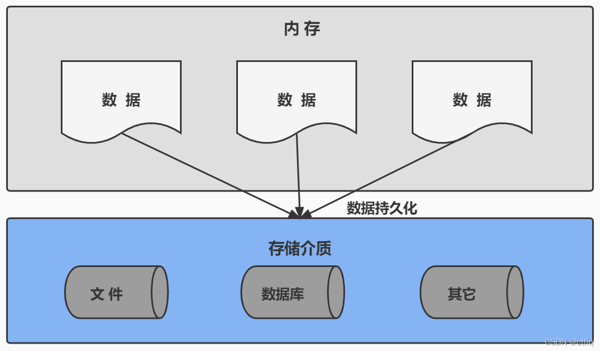

1.2. 数据库与数据库管理系统
----------------

### 1.2.1 数据库的相关概念

**DB：数据库（Database）**

即存储数据的“仓库”，其本质是一个文件系统。它保存了一系列有组织的数据。

**DBMS：数据库管理系统（Database Management System）**

是一种操纵和管理数据库的大型软件，用于建立、使用和维护数据库，对数据库进行统一管理和控制。用户通过数据库管理系统访问数据库中表内的数据。

**SQL：结构化查询语言（Structured Query Language）**

专门用来与数据库通信的语言。

### 1.2.2 数据库与数据库管理系统的关系

> *   数据库管理系统(DBMS)可以管理多个数据库，一般开发人员会针对每一个应用创建一个数据库。为保存应用中实体的数据，一般会在数据库创建多个表，以保存程序中实体用户的数据。

数据库管理系统、数据库和表的关系如图所示：  
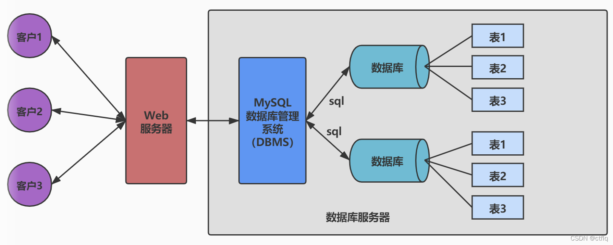  
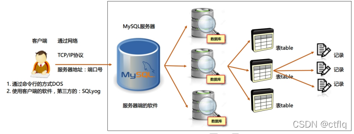

### 1.2.3 常见的数据库管理系统排名(DBMS)

> *   目前互联网上常见的数据库管理软件有Oracle、MySQL、MS SQL Server、DB2、PostgreSQL、Access、Sybase、Informix这几种。以下是2021年**DB-Engines Ranking** 对各数据库受欢迎程度进行调查后的统计结果：（查看数据库最新排名:https://db-engines.com/en/ranking）

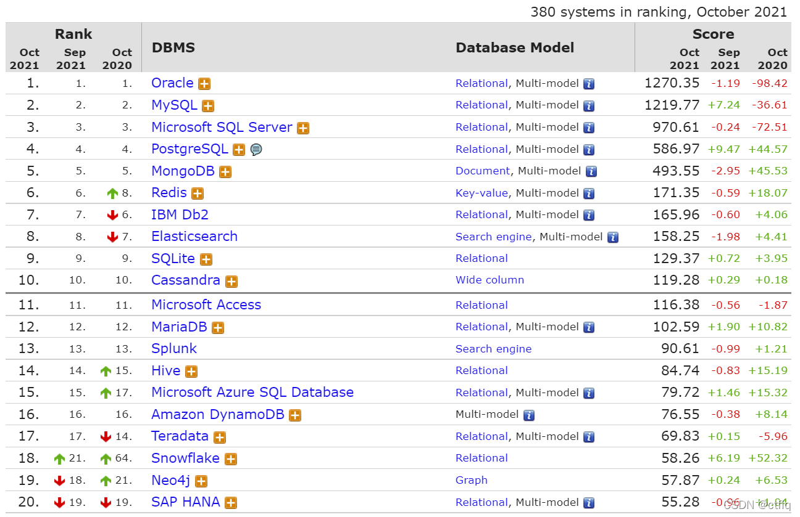  
对应的走势图：（https://db-engines.com/en/ranking\_trend)

### 1.2.4 常见的数据库介绍

> **Oracle**
>
> *   1979 年，Oracle 2 诞生，它是第一个商用的 RDBMS（关系型数据库管理系统）。随着 Oracle 软件的名气越来越大，公司也改名叫 Oracle 公司。
> *   2007年，总计85亿美金收购BEA Systems。
> *   2009年，总计74亿美金收购SUN。此前的2008年，SUN以10亿美金收购MySQL。意味着Oracle 同时拥有了 MySQL 的管理权，至此 Oracle 在数据库领域中成为绝对的领导者。
> *   2013年，甲骨文超越IBM，成为继Microsoft后全球第二大软件公司。
> *   如今 Oracle 的年收入达到了 400 亿美金，足以证明商用（收费）数据库软件的价值。  
>     **SQL Server**
> *   SQL Server 是微软开发的大型商业数据库，诞生于 1989 年。C#、.net等语言常使用，与WinNT完全集成，也可以很好地与Microsoft BackOffice产品集成。

> **DB2**
>
> *   IBM公司的数据库产品,收费的。常应用在银行系统中。

> **PostgreSQL**
>
> *   PostgreSQL 的稳定性极强，最符合SQL标准，开放源码，具备商业级DBMS质量。PG对数据量大的文本以及SQL处理较快。

> **SyBase**
>
> *   已经淡出历史舞台。提供了一个非常专业数据建模的工具PowerDesigner。

> **SQLite**
>
> *   嵌入式的小型数据库，应用在手机端。 零配置，SQlite3不用安装，不用配置，不用启动，关闭或者配置数据库实例。当系统崩溃后不用做任何恢复操作，再下次使用数据库的时候自动恢复。

> **informix**
>
> *   IBM公司出品，取自Information 和Unix的结合，它是第一个被移植到Linux上的商业数据库产品。仅运行于unix/linux平台，命令行操作。 性能较高，支持集群，适应于安全性要求极高的系统，尤其是银行，证券系统的应用。

1.3. MySQL介绍
------------

### 1.3.1 概述

> *   MySQL是一个`开放源代码的关系型数据库管理系统`，由瑞典MySQL AB（创始人Michael Widenius）公司1995年开发，迅速成为开源数据库的 No.1。
> *   2008被`Sun`收购（10亿美金），2009年Sun被`Oracle`收购。`MariaDB`应运而生。（MySQL 的创造者担心 MySQL 有闭源的风险，因此创建了 MySQL 的分支项目 MariaDB）
> *   MySQL6.x 版本之后分为`社区版`和`商业版`。
> *   MySQL是一种关联数据库管理系统，将数据保存在不同的表中，而不是将所有数据放在一个大仓库内，这样就增加了速度并提高了灵活性。
> *   MySQL是开源的，所以你不需要支付额外的费用。
> *   MySQL是可以定制的，采用了`GPL（GNU General Public License）`协议，你可以修改源码来开发自己的MySQL系统。
> *   MySQL支持大型的数据库。可以处理拥有上千万条记录的大型数据库。
> *   MySQL支持大型数据库，支持5000万条记录的数据仓库，32位系统表文件最大可支持`4GB`，64位系统支持最大的表文件为`8TB`。
> *   MySQL使用`标准的SQL数据语言`形式。
> *   MySQL可以允许运行于多个系统上，并且支持多种语言。这些编程语言包括C、C++、Python、Java、Perl、PHP和Ruby等。

### 1.3.2 MySQL发展史重大事件

> MySQL的历史就是整个互联网的发展史。互联网业务从社交领域、电商领域到金融领域的发展，推动着应用对数据库的需求提升，对传统的数据库服务能力提出了挑战。高并发、高性能、高可用、轻资源、易维护、易扩展的需求，促进了MySQL的长足发展。

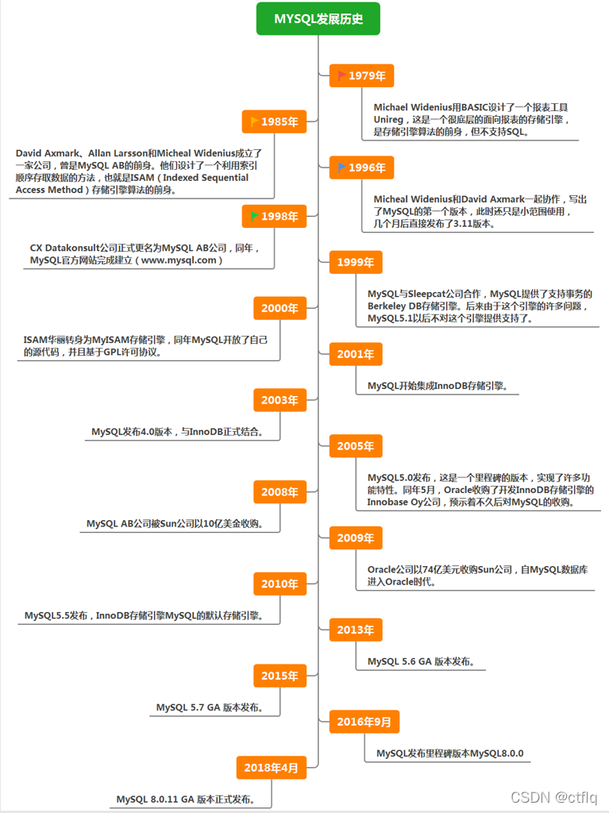

### 1.3.3 关于MySQL 8.0

> `MySQL从5.7版本直接跳跃发布了8.0版本`，可见这是一个令人兴奋的里程碑版本。MySQL 8版本在功能上做了显著的改进与增强，开发者对MySQL的源代码进行了重构，最突出的一点是多MySQL Optimizer优化器进行了改进。不仅在速度上得到了改善，还为用户带来了更好的性能和更棒的体验。

### 1.3.4 Why choose MySQL?

> 为什么如此多的厂商要选用MySQL？大概总结的原因主要有以下几点：
>
> 1.  开放源代码，使用成本低。
> 2.  性能卓越，服务稳定。
> 3.  软件体积小，使用简单，并且易于维护。
> 4.  历史悠久，社区用户非常活跃，遇到问题可以寻求帮助。
> 5.  许多互联网公司在用，经过了时间的验证。

### 1.3.5 Oracle vs MySQL

> *   Oracle 更适合大型跨国企业的使用，因为他们对费用不敏感，但是对性能要求以及安全性有更高的要求。
> *   MySQL 由于其**体积小、速度快、总体拥有成本低，可处理上千万条记录的大型数据库，尤其是开放源码这一特点，使得很多互联网公司、中小型网站选择了MySQL作为网站数据库**（Facebook，Twitter，YouTube，阿里巴巴/蚂蚁金服，去哪儿，美团外卖，腾讯）。

1.4. RDBMS 与 非RDBMS
-------------------

> *   从排名中我们能看出来，关系型数据库绝对是 DBMS 的主流，其中使用最多的 DBMS 分别是 Oracle、MySQL 和 SQL Server。这些都是关系型数据库（RDBMS）。

### 1.4.1 关系型数据库(RDBMS)

#### 1.4.1.1 实质

> *   这种类型的数据库是`最古老`的数据库类型，关系型数据库模型是把复杂的数据结构归结为简单的`二元关系`（即二维表格形式）。

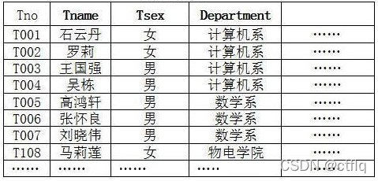

> *   关系型数据库以`行(row)`和`列(column)`的形式存储数据，以便于用户理解。这一系列的行和列被称为`表(table)`，一组表组成了一个库(database)。
> *   表与表之间的数据记录有关系(relationship)。现实世界中的各种实体以及实体之间的各种联系均用`关系模型`来表示。关系型数据库，就是建立在`关系模型`基础上的数据库。
> *   SQL 就是关系型数据库的查询语言。  
>     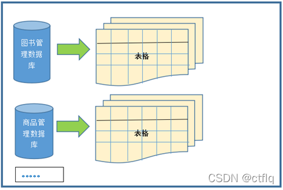

#### 1.4.1.2 优势

> *   **复杂查询**
>
> 1.  可以用SQL语句方便的在一个表以及多个表之间做非常复杂的数据查询。
>
> *   **事务支持**
>
> 1.  使得对于安全性能很高的数据访问要求得以实现。

### 1.4.2 非关系型数据库(非RDBMS)

#### 1.4.2.1 介绍

> *   **非关系型数据库**，可看成传统关系型数据库的功能`阉割版本`，基于键值对存储数据，不需要经过SQL层的解析，`性能非常高`。同时，通过减少不常用的功能，进一步提高性能。
> *   目前基本上大部分主流的非关系型数据库都是免费的。

#### 1.4.2.2 有哪些非关系型数据库

> *   相比于 SQL，NoSQL 泛指非关系型数据库，包括了榜单上的键值型数据库、文档型数据库、搜索引擎和列存储等，除此以外还包括图形数据库。也只有用 NoSQL 一词才能将这些技术囊括进来。

> **键值型数据库**
>
> *   键值型数据库通过 Key-Value 键值的方式来存储数据，其中 Key 和 Value 可以是简单的对象，也可以是复杂的对象。Key 作为唯一的标识符，优点是查找速度快，在这方面明显优于关系型数据库，缺点是无法像关系型数据库一样使用条件过滤（比如 WHERE），如果你不知道去哪里找数据，就要遍历所有的键，这就会消耗大量的计算。
> *   键值型数据库典型的使用场景是作为`内存缓存`。`Redis` 是最流行的键值型数据库。

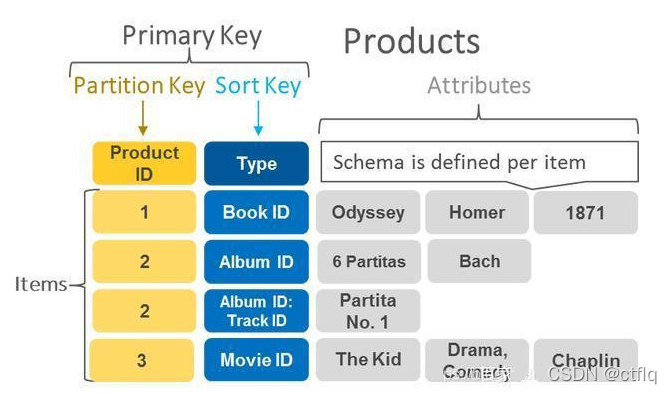

> **文档型数据库**
>
> *   此类数据库可存放并获取文档，可以是XML、JSON等格式。在数据库中文档作为处理信息的基本单位，一个文档就相当于一条记录。文档数据库所存放的文档，就相当于键值数据库所存放的“值”。MongoDB 是最流行的文档型数据库。此外，还有CouchDB等。

**搜索引擎数据库**

> *   虽然关系型数据库采用了索引提升检索效率，但是针对全文索引效率却较低。搜索引擎数据库是应用在搜索引擎领域的数据存储形式，由于搜索引擎会爬取大量的数据，并以特定的格式进行存储，这样在检索的时候才能保证性能最优。核心原理是“倒排索引”。
> *   典型产品：Solr、Elasticsearch、Splunk 等。

> **列式数据库**
>
> *   列式数据库是相对于行式存储的数据库，Oracle、MySQL、SQL Server 等数据库都是采用的行式存储（Row-based），而列式数据库是将数据按照列存储到数据库中，这样做的好处是可以大量降低系统的 I/O，适合于分布式文件系统，不足在于功能相对有限。典型产品：HBase等。  
>     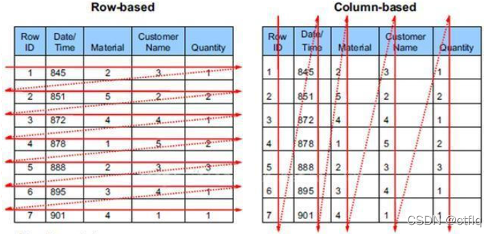

> **图形数据库**

> *   图形数据库，利用了图这种数据结构存储了实体（对象）之间的关系。图形数据库最典型的例子就是社交网络中人与人的关系，数据模型主要是以节点和边（关系）来实现，特点在于能高效地解决复杂的关系问题。
> *   图形数据库顾名思义，就是一种存储图形关系的数据库。它利用了图这种数据结构存储了实体（对象）之间的关系。关系型数据用于存储明确关系的数据，但对于复杂关系的数据存储却有些力不从心。如社交网络中人物之间的关系，如果用关系型数据库则非常复杂，用图形数据库将非常简单。典型产品：Neo4J、InfoGrid等。

#### 1.4.2.3 NoSQL的演变

> *   由于 SQL 一直称霸 DBMS，因此许多人在思考是否有一种数据库技术能远离 SQL，于是 NoSQL 诞生了，但是随着发展却发现越来越离不开 SQL。到目前为止 NoSQL 阵营中的 DBMS 都会有实现类似 SQL 的功能。下面是“NoSQL”这个名词在不同时期的诠释，从这些释义的变化中可以看出 `NoSQL 功能的演变`：  
>     1970：NoSQL = We have no SQL  
>     1980：NoSQL = Know SQL  
>     2000：NoSQL = No SQL!  
>     2005：NoSQL = Not only SQL  
>     2013：NoSQL = No, SQL!
> *   NoSQL 对 SQL 做出了很好的补充，比如实际开发中，有很多业务需求，其实并不需要完整的关系型数据库功能，非关系型数据库的功能就足够使用了。这种情况下，使用`性能更高`、`成本更低`的非关系型数据库当然是更明智的选择。比如：日志收集、排行榜、定时器等。

### 1.4.3 小结

> *   NoSQL 的分类很多，即便如此，在 DBMS 排名中，还是 SQL 阵营的比重更大，影响力前 5 的 DBMS 中有 4 个是关系型数据库，而排名前 20 的 DBMS 中也有 12 个是关系型数据库。所以说，掌握 SQL 是非常有必要的。整套课程将围绕 SQL 展开。

1.5. 关系型数据库设计规则
---------------

> *   关系型数据库的典型数据结构就是`数据表`，这些数据表的组成都是结构化的（Structured）。
> *   将数据放到表中，表再放到库中。
> *   一个数据库中可以有多个表，每个表都有一个名字，用来标识自己。表名具有唯一性。
> *   表具有一些特性，这些特性定义了数据在表中如何存储，类似Java和Python中 “类”的设计。

### 1.5.1 表、记录、字段

> *   E-R（entity-relationship，实体-联系）模型中有三个主要概念是：`实体集`、`属性`、`联系集`。
> *   一个实体集（class）对应于数据库中的一个表（table），一个实体（instance）则对应于数据库表中的一行（row），也称为一条记录（record）。一个属性（attribute）对应于数据库表中的一列（column），也称为一个字段（field）。  
>     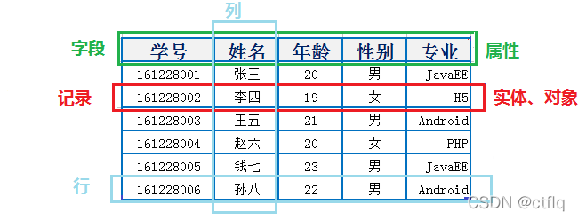

    ORM思想 (Object Relational Mapping)体现：
    数据库中的一个表 <---> Java或Python中的一个类
    表中的一条数据   <---> 类中的一个对象（或实体）
    表中的一个列     <---> 类中的一个字段、属性(field)

### 1.5.2 表的关联关系

> *   表与表之间的数据记录有关系(relationship)。现实世界中的各种实体以及实体之间的各种联系均用关系模型来表示。
> *   四种：一对一关联、一对多关联、多对多关联、自我引用

#### 1.5.2.1 一对一关联（one-to-one）

> *   在实际的开发中应用不多，因为一对一可以创建成一张表。
> *   举例：设计`学生表`：学号、姓名、手机号码、班级、系别、身份证号码、家庭住址、籍贯、紧急联系人、…
>
> 1.  拆为两个表：两个表的记录是一一对应关系。
> 2.  `基础信息表`（常用信息）：学号、姓名、手机号码、班级、系别
> 3.  `档案信息表`（不常用信息）：学号、身份证号码、家庭住址、籍贯、紧急联系人、…

> *   两种建表原则：
>
> 1.  外键唯一：主表的主键和从表的外键（唯一），形成主外键关系，外键唯一。
> 2.  外键是主键：主表的主键和从表的主键，形成主外键关系。

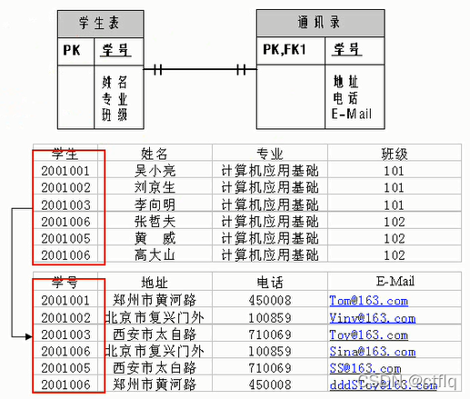

#### 1.5.2.2 一对多关系（one-to-many）

> *   常见实例场景：`客户表和订单表`，`分类表和商品表`，`部门表和员工表`。
> *   举例：
>
> 1.  员工表：编号、姓名、…、所属部门
> 2.  部门表：编号、名称、简介
>
> *   一对多建表原则：在从表(多方)创建一个字段，字段作为外键指向主表(一方)的主键

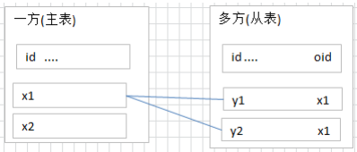  
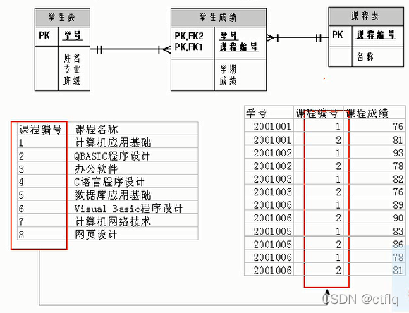  
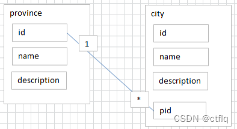

#### 1.5.2.3 多对多（many-to-many）

> *   要表示多对多关系，必须创建第三个表，该表通常称为`联接表`，它将多对多关系划分为两个一对多关系。将这两个表的主键都插入到第三个表中。

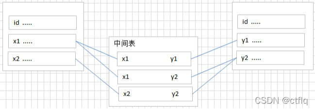

> *   **举例1：学生-课程**
>     *   `学生信息表`：一行代表一个学生的信息（学号、姓名、手机号码、班级、系别…）
>     *   `课程信息表`：一行代表一个课程的信息（课程编号、授课老师、简介…）
>     *   `选课信息表`：一个学生可以选多门课，一门课可以被多个学生选择

    学号     课程编号  
    1        1001
    2        1001
    1        1002

> *   **举例2：产品-订单**  
>     “订单”表和“产品”表有一种多对多的关系，这种关系是通过与“订单明细”表建立两个一对多关系来定义的。一个订单可以有多个产品，每个产品可以出现在多个订单中。
>     *   `产品表`：“产品”表中的每条记录表示一个产品。
>     *   `订单表`：“订单”表中的每条记录表示一个订单。
>     *   `订单明细表`：每个产品可以与“订单”表中的多条记录对应，即出现在多个订单中。一个订单可以与“产品”表中的多条记录对应，即包含多个产品。  
>         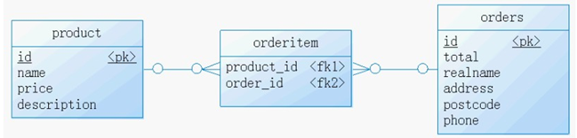

> *   **举例3：用户-角色**
>     *   多对多关系建表原则：需要创建第三张表，中间表中至少两个字段，这两个字段分别作为外键指向各自一方的主键。

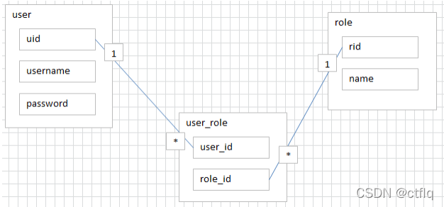

#### 1.5.2.4 自我引用(Self reference)

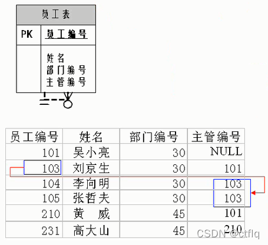

第2章\_MySQL环境搭建
==============

2.1. MySQL的卸载(win)
-------------

**步骤1：停止MySQL服务**

> *   在卸载之前，先停止MySQL8.0的服务。按键盘上的“Ctrl + Alt + Delete”组合键，打开“任务管理器”对话框，可以在“服务”列表找到“MySQL8.0”的服务，如果现在“正在运行”状态，可以右键单击服务，选择“停止”选项停止MySQL8.0的服务，如图所示。

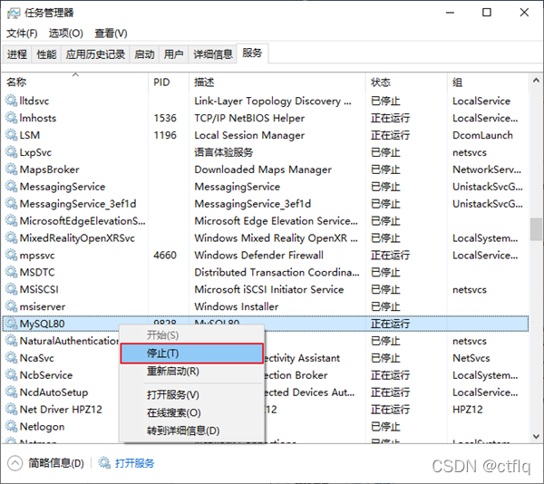  
**步骤2：软件的卸载**

> **方式1：通过控制面板方式**
>
> *   卸载MySQL8.0的程序可以和其他桌面应用程序一样直接在“控制面板”选择“卸载程序”，并在程序列表中找到MySQL8.0服务器程序，直接双击卸载即可，如图所示。这种方式删除，数据目录下的数据不会跟着删除。

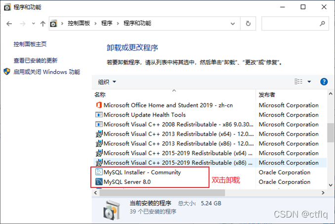

> **方式2：通过360或电脑管家等软件卸载**

> **方式3：通过安装包提供的卸载功能卸载**  
> 你也可以通过安装向导程序进行MySQL8.0服务器程序的卸载。
>
> 1.  再次双击下载的mysql-installer-community-8.0.26.0.msi文件，打开安装向导。安装向导会自动检测已安装的MySQL服务器程序。
> 2.  选择要卸载的MySQL服务器程序，单击“Remove”（移除），即可进行卸载。

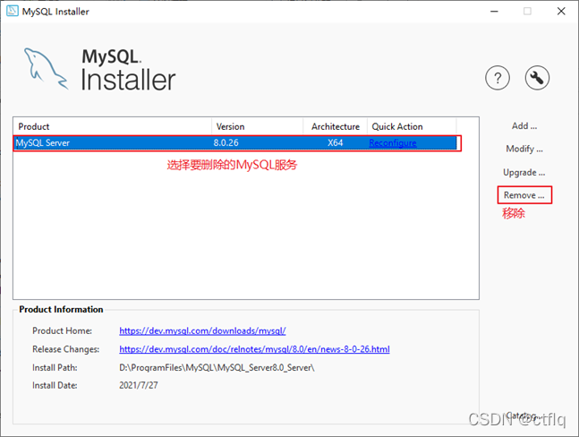

> 3.  单击“Next”（下一步）按钮，确认卸载。

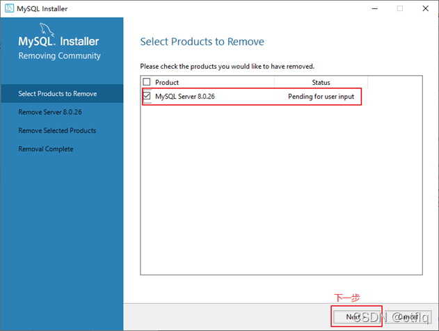

> 4.  弹出是否同时移除数据目录选择窗口。如果想要同时删除MySQL服务器中的数据，则勾选“Remove the data directory”，如图所示。

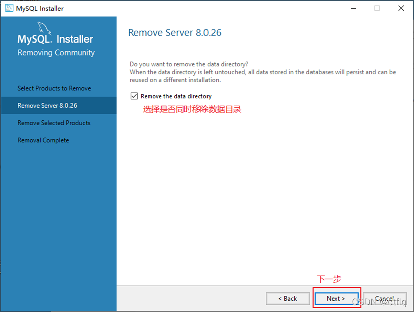

> 5.  执行卸载。单击“Execute”（执行）按钮进行卸载。

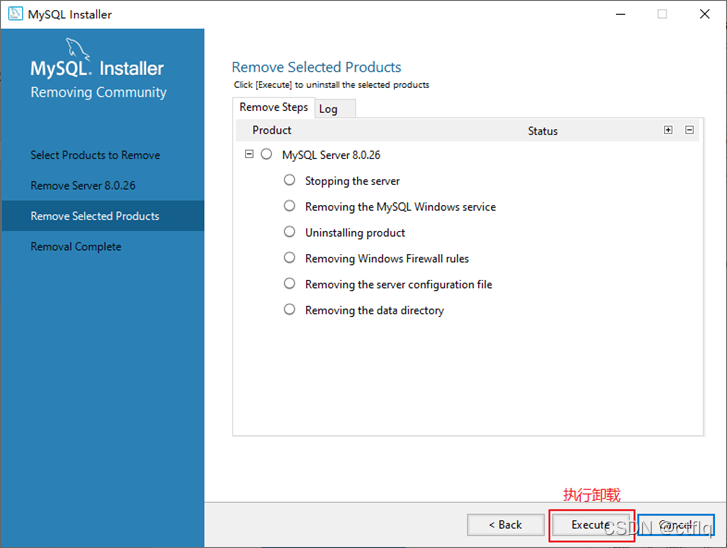

> 6.  完成卸载。单击“Finish”（完成）按钮即可。如果想要同时卸载MySQL8.0的安装向导程序，勾选“Yes，Uninstall MySQL Installer”即可，如图所示。

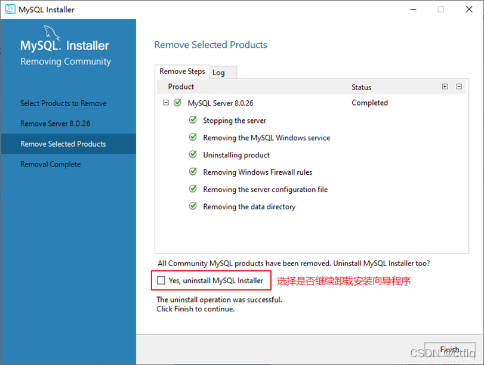  
**步骤3：残余文件的清理**

> *   如果再次安装不成功，可以卸载后对残余文件进行清理后再安装。
>
> 1.  服务目录：mysql服务的安装目录
> 2.  数据目录：默认在C:\\ProgramData\\MySQL
>
> *   如果自己单独指定过数据目录，就找到自己的数据目录进行删除即可。
> *   注意：请在卸载前做好数据备份
> *   在操作完以后，需要重启计算机，然后进行安装即可。**如果仍然安装失败，需要继续操作如下步骤4。**

**步骤4：清理注册表（选做）**

> *   如果前几步做了，再次安装还是失败，那么可以清理注册表。
> *   如何打开注册表编辑器：在系统的搜索框中输入`regedit`

    HKEY_LOCAL_MACHINE\SYSTEM\ControlSet001\Services\Eventlog\Application\MySQL服务 目录删除
    HKEY_LOCAL_MACHINE\SYSTEM\ControlSet001\Services\MySQL服务 目录删除
    HKEY_LOCAL_MACHINE\SYSTEM\ControlSet002\Services\Eventlog\Application\MySQL服务 目录删除
    HKEY_LOCAL_MACHINE\SYSTEM\ControlSet002\Services\MySQL服务 目录删除
    HKEY_LOCAL_MACHINE\SYSTEM\CurrentControlSet\Services\Eventlog\Application\MySQL服务目录删除
    HKEY_LOCAL_MACHINE\SYSTEM\CurrentControlSet\Services\MySQL服务删除

> 注册表中的ControlSet001,ControlSet002,不一定是001和002,可能是ControlSet005、006之类

**步骤5：删除环境变量配置**

> *   找到path环境变量，将其中关于mysql的环境变量删除，**切记不要全部删除。**
> *   例如：删除 D:\\develop\_tools\\mysql\\MySQLServer8.0.26\\bin; 这个部分

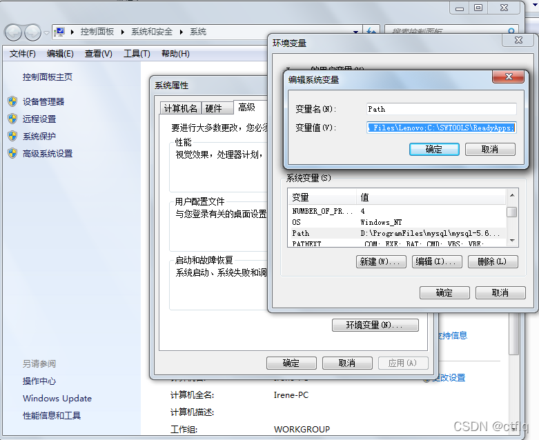

2.2. MySQL的下载、安装、配置
-------------------

### 2.2.1 MySQL的4大版本

> *   **MySQL Community Server 社区版本**，开源免费，自由下载，但不提供官方技术支持，适用于大多数普通用户。
> *   **MySQL Enterprise Edition 企业版本**，需付费，不能在线下载，可以试用30天。提供了更多的功能和更完备的技术支持，更适合于对数据库的功能和可靠性要求较高的企业客户。
> *   **MySQL Cluster 集群版**，开源免费。用于架设集群服务器，可将几个MySQL Server封装成一个Server。需要在社区版或企业版的基础上使用。
> *   **MySQL Cluster CGE 高级集群版**，需付费。

> *   目前最新版本为`8.0.27`，发布时间`2021年10月`。此前，8.0.0 在 2016.9.12日就发布了。
> *   本课程中使用`8.0.26版本`。
> *   此外，官方还提供了`MySQL Workbench`（GUITOOL）一款专为MySQL设计的`图形界面管理工具`。MySQLWorkbench又分为两个版本，分别是`社区版`（MySQL Workbench OSS）、`商用版`（MySQL WorkbenchSE）。

### 2.2.2 软件的下载

**1\. 下载地址**

> 官网：[https://www.mysql.com](https://www.mysql.com/)

**2\. 打开官网，点击DOWNLOADS**

> 然后，点击`MySQL Community(GPL) Downloads`

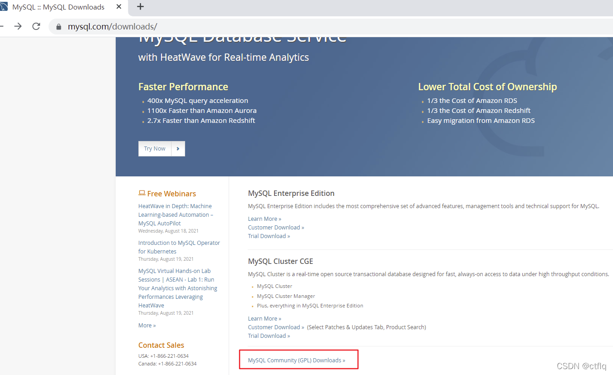  
**3\. 点击 MySQL Community Server**  
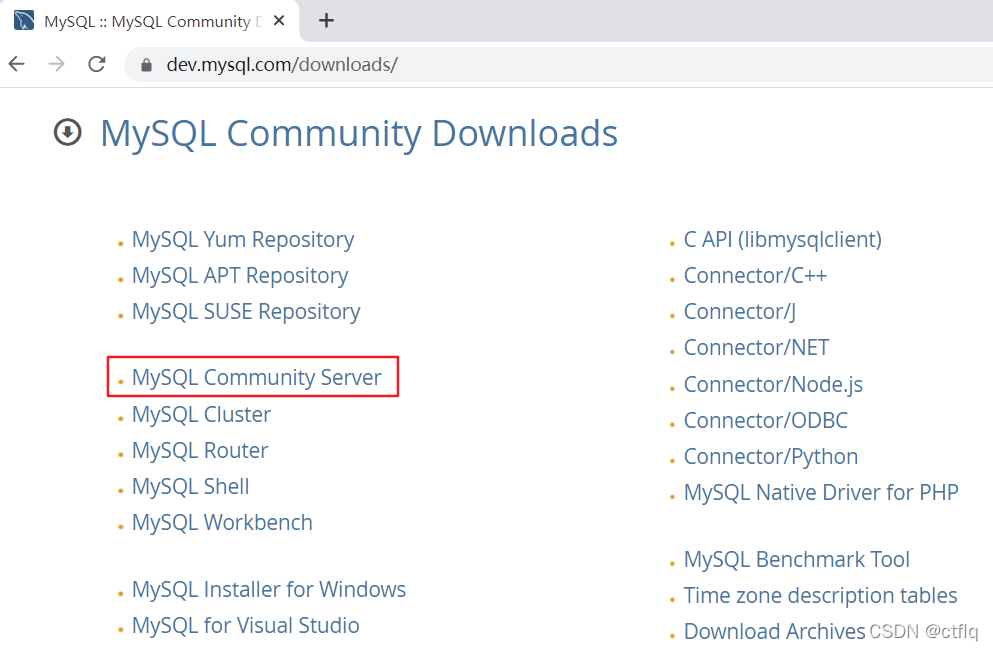  
**4\. 在General Availability(GA) Releases中选择适合的版本**

> Windows平台下提供两种安装文件：MySQL二进制分发版（.msi安装文件）和免安装版（.zip压缩文件）。一般来讲，应当使用二进制分发版，因为该版本提供了图形化的安装向导过程，比其他的分发版使用起来要简单，不再需要其他工具启动就可以运行MySQL。
>
> *   这里在Windows 系统下推荐下载`MSI安装程序`；点击`Go to Download Page`进行下载即可

  

> *   Windows下的MySQL8.0安装有两种安装程序
>     *   `mysql-installer-web-community-8.0.26.0.msi` 下载程序大小：2.4M；安装时需要联网安装组件。
>     *   `mysql-installer-community-8.0.26.0.msi` 下载程序大小：450.7M；安装时离线安装即可。**推荐。**
> *   如果安装MySQL5.7版本的话，选择`Archives`，接着选择MySQL5.7的相应版本即可。这里下载最近期的MySQL5.7.34版本。

### 2.2.3 MySQL8.0 版本的安装

> MySQL下载完成后，找到下载文件，双击进行安装，具体操作步骤如下。
>
> *   步骤1：双击下载的mysql-installer-community-8.0.26.0.msi文件，打开安装向导。
> *   步骤2：打开“Choosing a Setup Type”（选择安装类型）窗口，在其中列出了5种安装类型，分别是Developer Default（默认安装类型）、Server only（仅作为服务器）、Client only（仅作为客户端）、Full（完全安装）、Custom（自定义安装）。这里选择“Custom（自定义安装）”类型按钮，单击“Next(下一步)”按钮。

> *   步骤3：打开“Select Products” （选择产品）窗口，可以定制需要安装的产品清单。例如，选择“MySQL Server 8.0.26-X64”后，单击“→”添加按钮，即可选择安装MySQL服务器，如图所示。采用通用的方法，可以添加其他你需要安装的产品。

> *   此时如果直接“Next”（下一步），则产品的安装路径是默认的。如果想要自定义安装目录，则可以选中对应的产品，然后在下面会出现“Advanced Options”（高级选项）的超链接。

> *   单击“Advanced Options”（高级选项）则会弹出安装目录的选择窗口，如图所示，此时你可以分别设置MySQL的服务程序安装目录和数据存储目录。如果不设置，默认分别在C盘的Program Files目录和ProgramData目录（这是一个隐藏目录）。如果自定义安装目录，请避免“中文”目录。另外，建议服务目录和数据目录分开存放。

> *   步骤4：在上一步选择好要安装的产品之后，单击“Next”（下一步）进入确认窗口，如图所示。单击“Execute”（执行）按钮开始安装。

> *   步骤5：安装完成后在“Status”（状态）列表下将显示“Complete”（安装完成），如图所示。

### 2.2.4 配置MySQL8.0

> MySQL安装之后，需要对服务器进行配置。具体的配置步骤如下。
>
> *   步骤1：在上一个小节的最后一步，单击“Next”（下一步）按钮，就可以进入产品配置窗口。

> *   步骤2：单击“Next”（下一步）按钮，进入MySQL服务器类型配置窗口，如图所示。端口号一般选择默认端口号3306。

> *   其中，“Config Type”选项用于设置服务器的类型。单击该选项右侧的下三角按钮，即可查看3个选项，如图所示。

> *   `Development Machine（开发机器）`：该选项代表典型个人用桌面工作站。此时机器上需要运行多个应用程序，那么MySQL服务器将占用最少的系统资源。
> *   `Server Machine（服务器）`：该选项代表服务器，MySQL服务器可以同其他服务器应用程序一起运行，例如Web服务器等。MySQL服务器配置成适当比例的系统资源。
> *   `Dedicated Machine（专用服务器）`：该选项代表只运行MySQL服务的服务器。MySQL服务器配置成使用所有可用系统资源。

> *   步骤3：单击“Next”（下一步）按钮，打开设置授权方式窗口。其中，上面的选项是MySQL8.0提供的新的授权方式，采用SHA256基础的密码加密方法；下面的选项是传统授权方法（保留5.x版本兼容性）。

> *   步骤4：单击“Next”（下一步）按钮，打开设置服务器root超级管理员的密码窗口，如图所示，需要输入两次同样的登录密码。也可以通过“Add User”添加其他用户，添加其他用户时，需要指定用户名、允许该用户名在哪台/哪些主机上登录，还可以指定用户角色等。此处暂不添加用户，用户管理在MySQL高级特性篇中讲解。

> *   步骤5：单击“Next”（下一步）按钮，打开设置服务器名称窗口，如图所示。该服务名会出现在Windows服务列表中，也可以在命令行窗口中使用该服务名进行启动和停止服务。本书将服务名设置为“MySQL80”。如果希望开机自启动服务，也可以勾选“Start the MySQL Server at System Startup”选项（推荐）。

> *   下面是选择以什么方式运行服务？可以选择“Standard System Account”(标准系统用户)或者“Custom User”(自定义用户)中的一个。这里推荐前者。

> *   步骤6：单击“Next”（下一步）按钮，打开确认设置服务器窗口，单击“Execute”（执行）按钮。

> *   步骤7：完成配置，如图所示。单击“Finish”（完成）按钮，即可完成服务器的配置。

> *   步骤8：如果还有其他产品需要配置，可以选择其他产品，然后继续配置。如果没有，直接选择“Next”（下一步），直接完成整个安装和配置过程。

> *   步骤9：结束安装和配置。

### 2.2.5 配置MySQL8.0 环境变量

> 如果不配置MySQL环境变量，就不能在命令行直接输入MySQL登录命令。下面说如何配置MySQL的环境变量：
>
> *   步骤1：在桌面上右击【此电脑】图标，在弹出的快捷菜单中选择【属性】菜单命令。
> *   步骤2：打开【系统】窗口，单击【高级系统设置】链接。
> *   步骤3：打开【系统属性】对话框，选择【高级】选项卡，然后单击【环境变量】按钮。
> *   步骤4：打开【环境变量】对话框，在系统变量列表中选择path变量。
> *   步骤5：单击【编辑】按钮，在【编辑环境变量】对话框中，将MySQL应用程序的bin目录（C:\\Program Files\\MySQL\\MySQL Server 8.0\\bin）添加到变量值中，用分号将其与其他路径分隔开。
> *   步骤6：添加完成之后，单击【确定】按钮，这样就完成了配置path变量的操作，然后就可以直接输入MySQL命令来登录数据库了。

### 2.2.6 MySQL5.7 版本的安装、配置

> *   安装  
>     此版本的安装过程与上述过程除了版本号不同之外，其它环节都是相同的。所以这里省略了MySQL5.7.34版本的安装截图。

> *   配置  
>     配置环节与MySQL8.0版本确有细微不同。大部分情况下直接选择“Next”即可，不影响整理使用。  
>     这里配置MySQL5.7时，重点强调：与前面安装好的MySQL8.0不能使用相同的端口号。

### 2.2.7 安装失败问题

> MySQL的安装和配置是一件非常简单的事，但是在操作过程中也可能出现问题，特别是初学者。

> **问题1：无法打开MySQL8.0软件安装包或者安装过程中失败，如何解决？**  
> 在运行MySQL8.0软件安装包之前，用户需要确保系统中已经安装了.Net Framework相关软件，如果缺少此软件，将不能正常地安装MySQL8.0软件。

> 解决方案：到这个地址https://www.microsoft.com/en-us/download/details.aspx?id=42642下载Microsoft .NET Framework 4.5并安装后，再去安装MySQL。  
> 另外，还要确保Windows Installer正常安装。windows上安装mysql8.0需要操作系统提前已安装好Microsoft Visual C++ 2015-2019。

  

> 解决方案同样是，提前到微软官网https://support.microsoft.com/en-us/topic/the-latest-supported-visual-c-downloads-2647da03-1eea-4433-9aff-95f26a218cc0，下载相应的环境。

> **问题2：卸载重装MySQL失败？**  
> 该问题通常是因为MySQL卸载时，没有完全清除相关信息导致的。  
> 解决办法是，把以前的安装目录删除。如果之前安装并未单独指定过服务安装目录，则默认安装目录是“C:\\Program Files\\MySQL”，彻底删除该目录。同时删除MySQL的Data目录，如果之前安装并未单独指定过数据目录，则默认安装目录是“C:\\ProgramData\\MySQL”，该目录一般为隐藏目录。删除后，重新安装即可。

> **问题3：如何在Windows系统删除之前的未卸载干净的MySQL服务列表？**  
> 操作方法如下，在系统“搜索框”中输入“cmd”，按“Enter”（回车）键确认，弹出命令提示符界面。然后输入“sc delete MySQL服务名”,按“Enter”（回车）键，就能彻底删除残余的MySQL服务了。

2.3. MySQL的登录
-------------

### 2.3.1 服务的启动与停止

> MySQL安装完毕之后，需要启动服务器进程，不然客户端无法连接数据库。  
> 在前面的配置过程中，已经将MySQL安装为Windows服务，并且勾选当Windows启动、停止时，MySQL也自动启动、停止。

**方式1：使用图形界面工具**

> *   步骤1：打开windows服务
>     *   方式1：计算机（点击鼠标右键）→ 管理（点击）→ 服务和应用程序（点击）→ 服务（点击）
>     *   方式2：控制面板（点击）→ 系统和安全（点击）→ 管理工具（点击）→ 服务（点击）
>     *   方式3：任务栏（点击鼠标右键）→ 启动任务管理器（点击）→ 服务（点击）
>     *   方式4：单击【开始】菜单，在搜索框中输入“services.msc”，按Enter键确认
> *   步骤2：找到MySQL80（点击鼠标右键）→ 启动或停止（点击）

  
**方式2：使用命令行工具**

    # 启动 MySQL 服务命令：
    net start MySQL服务名
    # 停止 MySQL 服务命令：
    net stop MySQL服务名

> 说明：
>
> 1.  start和stop后面的服务名应与之前配置时指定的服务名一致。
> 2.  如果当你输入命令后，提示“拒绝服务”，请以系统管理员身份打开命令提示符界面重新尝试。

### 2.3.2 自带客户端的登录与退出

> 当MySQL服务启动完成后，便可以通过客户端来登录MySQL数据库。注意：确认服务是开启的。

**登录方式1：MySQL自带客户端**

> 开始菜单 → 所有程序 → MySQL → MySQL 8.0 Command Line Client

> 说明：仅限于root用户

**登录方式2：windows命令行**加粗样式\*\*

    格式：
    	mysql -h 主机名 -P 端口号 -u 用户名 -p密码
    举例：
    	mysql -h localhost -P 3306 -u root -pabc123  # 这里我设置的root用户的密码是abc123

> 注意：  
> (1). -p与密码之间不能有空格，其他参数名与参数值之间可以有空格也可以没有空格。如：

        mysql -hlocalhost -P3306 -uroot -pabc123

> (2). 密码建议在下一行输入，保证安全

    	mysql -h localhost -P 3306 -u root -p
    	Enter password:****

> (3). 客户端和服务器在同一台机器上，所以输入localhost或者IP地址127.0.0.1。同时，因为是连接本机：  
> \-hlocalhost就可以省略，如果端口号没有修改：-P3306也可以省略

     简写成：
     	mysql -u root -p
    	Enter password:****

> 连接成功后，有关于MySQL Server服务版本的信息，还有第几次连接的id标识。  
> 也可以在命令行通过以下方式获取MySQL Server服务版本的信息：

    	c:\> mysql -V
    	c:\> mysql --version

> 或登录后，通过以下方式查看当前版本信息：

    	mysql> select version();

**退出登录**

    	exit 或 quit

2.4. MySQL演示使用
--------------

### 2.4.1 MySQL的使用演示

**1、查看所有的数据库**

    	show databases;

> *   “information\_schema”是 MySQL 系统自带的数据库，主要保存 MySQL 数据库服务器的系统信息，比如数据库的名称、数据表的名称、字段名称、存取权限、数据文件 所在的文件夹和系统使用的文件夹，等等
> *   “performance\_schema”是 MySQL 系统自带的数据库，可以用来监控 MySQL 的各类性能指标。
> *   “sys”数据库是 MySQL 系统自带的数据库，主要作用是以一种更容易被理解的方式展示 MySQL 数据库服务器的各类性能指标，帮助系统管理员和开发人员监控 MySQL 的技术性能。
> *   “mysql”数据库保存了 MySQL 数据库服务器运行时需要的系统信息，比如数据文件夹、当前使用的字符集、约束检查信息，等等

> 为什么 Workbench 里面我们只能看到“demo”和“sys”这 2 个数据库呢？  
> 这是因为，Workbench 是图形化的管理工具，主要面向开发人 员，“demo”和“sys”这 2 个数据库已经够用了。如果有特殊需求，比如，需要监控 MySQL 数据库各项性能指标、直接操作 MySQL 数据库系统文件等，可以由 DBA 通过 SQL 语句，查看其它的系统数据库。

**2、创建自己的数据库**

    	create database 数据库名;
    	#创建atguigudb数据库，该名称不能与已经存在的数据库重名。
    	create database atguigudb;

**3、使用自己的数据库**

    	use 数据库名;
    	#使用atguigudb数据库
    	use atguigudb;

> 说明：如果没有使用use语句，后面针对数据库的操作也没有加“数据名”的限定，那么会报“ERROR 1046 (3D000): No database selected”（没有选择数据库）  
> 使用完use语句之后，如果接下来的SQL都是针对一个数据库操作的，那就不用重复use了，如果要针对另一个数据库操作，那么要重新use。

**4、查看某个库的所有表格**

    	show tables;  #要求前面有use语句
    	show tables from 数据库名;

**5、创建新的表格**

    	create table 表名称(
    		字段名  数据类型,
    		字段名 数据类型
    	);

> 说明：如果是最后一个字段，后面就用加逗号，因为逗号的作用是分割每个字段。

    	#创建学生表
    	create table student(
    		id int,
    	    name varchar(20)  #说名字最长不超过20个字符
    	);

**6、查看一个表的数据**

    	select * from 数据库表名称;
    	#查看学生表的数据
    	select * from student;

**7、添加一条记录**

    	insert into 表名称 values(值列表);
    	#添加两条记录到student表中
    	insert into student values(1,'张三');
    	insert into student values(2,'李四');

    报错：字符集的问题。
    	mysql> insert into student values(1,'张三');
    	ERROR 1366 (HY000): Incorrect string value: '\xD5\xC5\xC8\xFD' for column 'name' at row 1
    	mysql> insert into student values(2,'李四');
    	ERROR 1366 (HY000): Incorrect string value: '\xC0\xEE\xCB\xC4' for column 'name' at row 1
    	mysql> show create table student;

**8、查看表的创建信息**

    	show create table 表名称\G
    	#查看student表的详细创建信息
    	show create table student\G

    #结果如下
    	*************************** 1. row ***************************
    	       Table: student
    	Create Table: CREATE TABLE `student` (
    	  `id` int(11) DEFAULT NULL,
    	  `name` varchar(20) DEFAULT NULL
    	) ENGINE=InnoDB DEFAULT CHARSET=latin1
    	1 row in set (0.00 sec)

> 上面的结果显示student的表格的默认字符集是“latin1”不支持中文。

**10、删除表格**

    	drop table 表名称;
    	#删除学生表
    	drop table student;

**11、删除数据库**

    	drop database 数据库名;
    	#删除atguigudb数据库
    	drop database atguigudb;

### 2.4.2 MySQL的编码设置

**MySQL5.7中**  
**问题再现：命令行操作sql乱码问题**

    	mysql> INSERT INTO t_stu VALUES(1,'张三','男');
    	ERROR 1366 (HY000): Incorrect string value: '\xD5\xC5\xC8\xFD' for column 'sname' at row 1

**问题解决**  
步骤1：查看编码命令

    	show variables like 'character_%';
    	show variables like 'collation_%';

步骤2：修改mysql的数据目录下的my.ini配置文件

    	[mysql]  #大概在63行左右，在其下添加
    	... 
    	default-character-set=utf8  #默认字符集
    
    	[mysqld]  # 大概在76行左右，在其下添加
    	...
    	character-set-server=utf8
    	collation-server=utf8_general_ci

步骤3：重启服务  
步骤4：查看编码命令

    	show variables like 'character_%';
    	show variables like 'collation_%';

> 如果是以上配置就说明对了。接着我们就可以新创建数据库、新创建数据表，接着添加包含中文的数据了。

**MySQL8.0中**

> 在MySQL 8.0版本之前，默认字符集为latin1，utf8字符集指向的是utf8mb3。网站开发人员在数据库设计的时候往往会将编码修改为utf8字符集。如果遗忘修改默认的编码，就会出现乱码的问题。从MySQL 8.0开始，数据库的默认编码改为**utf8mb4**，从而避免了上述的乱码问题。

2.5. MySQL图形化管理工具
-----------------

> MySQL图形化管理工具极大地方便了数据库的操作与管理，常用的图形化管理工具有：MySQL Workbench、phpMyAdmin、Navicat Preminum、MySQLDumper、SQLyog、dbeaver、MySQL ODBC Connector。

**工具1. MySQL Workbench**

> MySQL官方提供的图形化管理工具MySQL Workbench完全支持MySQL 5.0以上的版本。MySQL Workbench分为社区版和商业版，社区版完全免费，而商业版则是按年收费。  
> MySQL Workbench 为数据库管理员、程序开发者和系统规划师提供可视化设计、模型建立、以及数据库管理功能。它包含了用于创建复杂的数据建模ER模型，正向和逆向数据库工程，也可以用于执行通常需要花费大量时间的、难以变更和管理的文档任务。  
> 下载地址：[http://dev.mysql.com/downloads/workbench/。](http://dev.mysql.com/downloads/workbench/)

> 使用：  
> 首先，我们点击 Windows 左下角的“开始”按钮，如果你是 Win10 系统，可以直接看到所有程序。接着，找到“MySQL”，点开，找到“MySQL Workbench 8.0 CE”。点击打开 Workbench，如下图所示：

> 左下角有个本地连接，点击，录入 Root 的密码，登录本地 MySQL 数据库服务器，如下图所示：

  
  

> 这是一个图形化的界面，我来给你介绍下这个界面。
>
> *   上方是菜单。左上方是导航栏，这里我们可以看到 MySQL 数据库服务器里面的数据 库，包括数据表、视图、存储过程和函数；左下方是信息栏，可以显示上方选中的数据 库、数据表等对象的信息。
> *   中间上方是工作区，你可以在这里写 SQL 语句，点击上方菜单栏左边的第三个运行按 钮，就可以执行工作区的 SQL 语句了。
> *   中间下方是输出区，用来显示 SQL 语句的运行情况，包括什么时间开始运行的、运行的 内容、运行的输出，以及所花费的时长等信息。
> *   好了，下面我们就用 Workbench 实际创建一个数据库，并且导入一个 Excel 数据文件， 来生成一个数据表。数据表是存储数据的载体，有了数据表以后，我们就能对数据进行操作了。

**工具2. Navicat**

> Navicat MySQL是一个强大的MySQL数据库服务器管理和开发工具。它可以与任何3.21或以上版本的MySQL一起工作，支持触发器、存储过程、函数、事件、视图、管理用户等，对于新手来说易学易用。其精心设计的图形用户界面（GUI）可以让用户用一种安全简便的方式来快速方便地创建、组织、访问和共享信息。Navicat支持中文，有免费版本提供。  
> 下载地址：[http://www.navicat.com/](http://www.navicat.com/)

  
  
**工具3. SQLyog**  
SQLyog 是业界著名的 Webyog 公司出品的一款简洁高效、功能强大的图形化 MySQL 数据库管理工具。这款工具是使用C++语言开发的。该工具可以方便地创建数据库、表、视图和索引等，还可以方便地进行插入、更新和删除等操作，同时可以方便地进行数据库、数据表的备份和还原。该工具不仅可以通过SQL文件进行大量文件的导入和导出，还可以导入和导出XML、HTML和CSV等多种格式的数据。  
下载地址：[http://www.webyog.com/](http://www.webyog.com/)，读者也可以搜索中文版的下载地址。

  
  
**工具4：dbeaver**

> *   DBeaver是一个通用的数据库管理工具和 SQL 客户端，支持所有流行的数据库：MySQL、PostgreSQL、SQLite、Oracle、DB2、SQL Server、 Sybase、MS Access、Teradata、 Firebird、Apache Hive、Phoenix、Presto等。DBeaver比大多数的SQL管理工具要轻量，而且支持中文界面。DBeaver社区版作为一个免费开源的产品，和其他类似的软件相比，在功能和易用性上都毫不逊色。
> *   唯一需要注意是 DBeaver 是用Java编程语言开发的，所以需要拥有 JDK（Java Development ToolKit）环境。如果电脑上没有JDK，在选择安装DBeaver组件时，勾选“Include Java”即可。
> *   下载地址：[https://dbeaver.io/download/](https://dbeaver.io/download/)

  
  
  

> **可能出现连接问题：**  
> 有些图形界面工具，特别是旧版本的图形界面工具，在连接MySQL8时出现“Authentication plugin ‘caching\_sha2\_password’ cannot be loaded”错误。

> 出现这个原因是MySQL8之前的版本中加密规则是mysql\_native\_password，而在MySQL8之后，加密规则是caching\_sha2\_password。解决问题方法有两种，第一种是升级图形界面工具版本，第二种是把MySQL8用户登录密码加密规则还原成mysql\_native\_password。

> 第二种解决方案如下，用命令行登录MySQL数据库之后，执行如下命令修改用户密码加密规则并更新用户密码，这里修改用户名为“root@localhost”的用户密码规则为“mysql\_native\_password”，密码值为“123456”，如图所示。

    	#使用mysql数据库
    	USE mysql; 
    	#修改'root'@'localhost'用户的密码规则和密码
    	ALTER USER 'root'@'localhost' IDENTIFIED WITH mysql_native_password BY 'abc123'; 
    	#刷新权限
    	FLUSH PRIVILEGES;

2.6. MySQL目录结构与源码
-----------------

> *   首先，你要进入 MySQL下载界面。 这里你不要选择用默认的“Microsoft Windows”，而是要通过下拉栏，找到“Source Code”，在下面的操作系统版本里面， 选择 Windows（Architecture Independent），然后点击下载。
> *   接下来，把下载下来的压缩文件解压，我们就得到了 MySQL 的源代码。
> *   MySQL 是用 C++ 开发而成的，我简单介绍一下源代码的组成。
> *   mysql-8.0.22 目录下的各个子目录，包含了 MySQL 各部分组件的源代码：

> *   sql 子目录是 MySQL 核心代码；
> *   libmysql 子目录是客户端程序 API；
> *   mysql-test 子目录是测试工具；
> *   mysys 子目录是操作系统相关函数和辅助函数；

> 源代码可以用记事本打开查看，如果你有 C++ 的开发环境，也可以在开发环境中打开查看。

> 如上图所示，源代码并不神秘，就是普通的 C++ 代码，跟你熟悉的一样，而且有很多注释，可以帮助你理解。阅读源代码就像在跟 MySQL 的开发人员对话一样，十分有趣。

2.7. 常见问题的解决
------------

**问题1：root用户密码忘记，重置的操作**

> *   1: 通过任务管理器或者服务管理，关掉mysqld(服务进程)
> *   2: 通过命令行+特殊参数开启mysqld
>     *   mysqld --defaults-file=“D:\\ProgramFiles\\mysql\\MySQLServer5.7Data\\my.ini” --skip-grant-tables
> *   3: 此时，mysqld服务进程已经打开。并且不需要权限检查
> *   4: mysql -uroot 无密码登陆服务器。另启动一个客户端进行
> *   5: 修改权限表
>     *   use mysql;
>     *   update user set authentication\_string=password(‘新密码’) where user=‘root’ and Host=‘localhost’;
>     *   flush privileges;
> *   6: 通过任务管理器，关掉mysqld服务进程。
> *   7: 再次通过服务管理，打开mysql服务。
> *   8: 即可用修改后的新密码登陆。

**问题2：mysql命令报“不是内部或外部命令”**

> 如果输入mysql命令报“不是内部或外部命令”，把mysql安装目录的bin目录配置到环境变量path中。如下：  
> 

**问题3：错误ERROR ：没有选择数据库就操作表格和数据**

    	mysql> INSERT INTO t_stu VALUES(1,'张三','男');
    	ERROR 1366 (HY000): Incorrect string value: '\xD5\xC5\xC8\xFD' for column 'sname' at row 1

> 原因：服务器端认为你的客户端的字符集是utf-8，而实际上你的客户端的字符集是GBK。

> 查看所有字符集：SHOW VARIABLES LIKE ‘character\_set\_%’;

> 解决方案，设置当前连接的客户端字符集 “SET NAMES GBK;”

  
**问题5：修改数据库和表的字符编码**

> *   修改编码：
>     *   （1)先停止服务，（2）修改my.ini文件（3）重新启动服务
> *   说明：
>     *   如果是在修改my.ini之前建的库和表，那么库和表的编码还是原来的Latin1，要么删了重建，要么使用alter语句修改编码。

    	mysql> create database 0728db charset Latin1;
    	Query OK, 1 row affected (0.00 sec)

    	mysql> use 0728db;
    	Database changed

    	mysql> create table student (id int , name varchar(20)) charset Latin1;
    	Query OK, 0 rows affected (0.02 sec)
    
    	mysql> show create table student\G
    	*************************** 1. row ***************************
    	       Table: student
    	Create Table: CREATE TABLE `student` (
    	  `id` int(11) NOT NULL,
    	  `name` varchar(20) DEFAULT NULL,
    	  PRIMARY KEY (`id`)
    	) ENGINE=InnoDB DEFAULT CHARSET=latin1
    	1 row in set (0.00 sec)

    	mysql> alter table student charset utf8; #修改表字符编码为UTF8
    	Query OK, 0 rows affected (0.01 sec)
    	Records: 0  Duplicates: 0  Warnings: 0
    
    	mysql> show create table student\G
    	*************************** 1. row ***************************
    	       Table: student
    	Create Table: CREATE TABLE `student` (
    	  `id` int(11) NOT NULL,
    	  `name` varchar(20) CHARACTER SET latin1 DEFAULT NULL,  #字段仍然是latin1编码
    	  PRIMARY KEY (`id`)
    	) ENGINE=InnoDB DEFAULT CHARSET=utf8
    	1 row in set (0.00 sec)
    	
    	mysql> alter table student modify name varchar(20) charset utf8; #修改字段字符编码为UTF8
    	Query OK, 0 rows affected (0.05 sec)
    	Records: 0  Duplicates: 0  Warnings: 0
    	
    	mysql> show create table student\G
    	*************************** 1. row ***************************
    	       Table: student
    	Create Table: CREATE TABLE `student` (
    	  `id` int(11) NOT NULL,
    	  `name` varchar(20) DEFAULT NULL,
    	  PRIMARY KEY (`id`)
    	) ENGINE=InnoDB DEFAULT CHARSET=utf8
    	1 row in set (0.00 sec)

    	mysql> show create database 0728db;;
    	+--------+-----------------------------------------------------------------+
    	|Database| Create Database                                                 |
    	+------+-------------------------------------------------------------------+
    	|0728db| CREATE DATABASE `0728db` /*!40100 DEFAULT CHARACTER SET latin1 */ |
    	+------+-------------------------------------------------------------------+
    	1 row in set (0.00 sec)
    
    ​	
    	mysql> alter database 0728db charset utf8; #修改数据库的字符编码为utf8
    	Query OK, 1 row affected (0.00 sec)

    	mysql> show create database 0728db;
    	+--------+-----------------------------------------------------------------+
    	|Database| Create Database                                                 |
    	+--------+-----------------------------------------------------------------+
    	| 0728db | CREATE DATABASE `0728db` /*!40100 DEFAULT CHARACTER SET utf8 */ |
