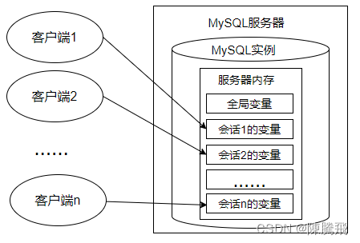
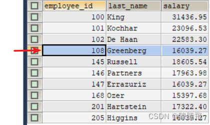

第15章 存储过程与函数
============

15.1 存储过程概述
-----------

### 15.1.1 理解

> MySQL从5.0版本开始支持存储过程和函数。存储过程和函数能够将复杂的SQL逻辑封装在一起，应用程序无须关注存储过程和函数内部复杂的SQL逻辑，而只需要简单地调用存储过程和函数即可。

> **含义**：存储过程的英文是 `Stored Procedure`。它的思想很简单，就是一组经过`预先编译`的 SQL 语句的封装。

> 执行过程：存储过程预先存储在 MySQL 服务器上，需要执行的时候，客户端只需要向服务器端发出调用存储过程的命令，服务器端就可以把预先存储好的这一系列 SQL 语句全部执行。

> **好处**：
>
> *   简化操作，提高了sql语句的重用性，减少了开发程序员的压力
> *   减少操作过程中的失误，提高效率
> *   减少网络传输量（客户端不需要把所有的 SQL 语句通过网络发给服务器）
> *   减少了 SQL 语句暴露在网上的风险，也提高了数据查询的安全性

> **和视图、函数的对比**：
>
> *   它和视图有着同样的优点，清晰、安全，还可以减少网络传输量。不过它和视图不同，视图是`虚拟表`，通常不对底层数据表直接操作，而存储过程是程序化的 SQL，可以`直接操作底层数据表`，相比于面向集合的操作方式，能够实现一些更复杂的数据处理。
> *   一旦存储过程被创建出来，使用它就像使用函数一样简单，我们直接通过调用存储过程名即可。相较于函数，存储过程是`没有返回值`的。

### 15.1.2 分类

> 存储过程的参数类型可以是IN、OUT和INOUT。根据这点分类如下：
>
> *   没有参数（无参数无返回）
> *   仅仅带 IN 类型（有参数无返回）
> *   仅仅带 OUT 类型（无参数有返回）
> *   既带 IN 又带 OUT（有参数有返回）
> *   带 INOUT（有参数有返回）
>
> 注意：IN、OUT、INOUT 都可以在一个存储过程中带多个

15.2 创建存储过程
-----------

### 15.2.1 语法分析

    -- 语法：
    CREATE PROCEDURE 存储过程名(IN|OUT|INOUT 参数名 参数类型,...)
    [characteristics ...]
    BEGIN
    	存储过程体
    END

类似于Java中的方法：

    修饰符 返回类型 方法名(参数类型 参数名,...){
    
    	方法体;
    }

说明：

> 1、参数前面的符号的意思
>
> *   `IN`：当前参数为输入参数，也就是表示入参；
> *   存储过程只是读取这个参数的值。如果没有定义参数种类，`默认就是 IN`，表示输入参数。
> *   `OUT`：当前参数为输出参数，也就是表示出参；
> *   执行完成之后，调用这个存储过程的客户端或者应用程序就可以读取这个参数返回的值了。
> *   `INOUT`：当前参数既可以为输入参数，也可以为输出参数。

> 2、形参类型可以是 MySQL数据库中的任意类型。

> 3、`characteristics` 表示创建存储过程时指定的对存储过程的约束条件，其取值信息如下：

    LANGUAGE SQL
    | [NOT] DETERMINISTIC
    | { CONTAINS SQL | NO SQL | READS SQL DATA | MODIFIES SQL DATA }
    | SQL SECURITY { DEFINER | INVOKER }
    | COMMENT 'string'

> *   `LANGUAGE SQL`：说明存储过程执行体是由SQL语句组成的，当前系统支持的语言为SQL。
> *   `[NOT] DETERMINISTIC`：指明存储过程执行的结果是否确定。DETERMINISTIC表示结果是确定的。每次执行存储过程时，相同的输入会得到相同的输出。NOT DETERMINISTIC表示结果是不确定的，相同的输入可能得到不同的输出。如果没有指定任意一个值，默认为NOT DETERMINISTIC。
> *   `{ CONTAINS SQL | NO SQL | READS SQL DATA | MODIFIES SQL DATA }`：指明子程序使用SQL语句的限制。
>     *   CONTAINS SQL表示当前存储过程的子程序包含SQL语句，但是并不包含读写数据的SQL语句；
>     *   NO SQL表示当前存储过程的子程序中不包含任何SQL语句；
>     *   READS SQL DATA表示当前存储过程的子程序中包含读数据的SQL语句；
>     *   MODIFIES SQL DATA表示当前存储过程的子程序中包含写数据的SQL语句。
>     *   默认情况下，系统会指定为CONTAINS SQL。
> *   `SQL SECURITY { DEFINER | INVOKER }`：执行当前存储过程的权限，即指明哪些用户能够执行当前存储过程。
>     *   `DEFINER`表示只有当前存储过程的创建者或者定义者才能执行当前存储过程；
>     *   `INVOKER`表示拥有当前存储过程的访问权限的用户能够执行当前存储过程。
>     *   如果没有设置相关的值，则MySQL默认指定值为DEFINER。
> *   `COMMENT 'string'`：注释信息，可以用来描述存储过程。

> 4、存储过程体中可以有多条 SQL 语句，如果仅仅一条SQL 语句，则可以省略 BEGIN 和 END编写存储过程并不是一件简单的事情，可能存储过程中需要复杂的 SQL 语句。

    1. BEGIN…END：BEGIN…END 中间包含了多个语句，每个语句都以（;）号为结束符。
    2. DECLARE：DECLARE 用来声明变量，使用的位置在于 BEGIN…END 语句中间，而且需要在其他语句使用之前进行变量的声明。
    3. SET：赋值语句，用于对变量进行赋值。
    4. SELECT… INTO：把从数据表中查询的结果存放到变量中，也就是为变量赋值。

> 5、需要设置新的结束标记

    DELIMITER 新的结束标记

> 因为MySQL默认的语句结束符号为分号‘;’。为了避免与存储过程中SQL语句结束符相冲突，需要使用DELIMITER改变存储过程的结束符。  
> 比如：“DELIMITER //”语句的作用是将MySQL的结束符设置为//，并以“END //”结束存储过程。存储过程定义完毕之后再使用“DELIMITER ;”恢复默认结束符。DELIMITER也可以指定其他符号作为结束符。  
> 当使用DELIMITER命令时，应该避免使用反斜杠（‘\\’）字符，因为反斜线是MySQL的转义字符。

    -- 示例：
    DELIMITER $
    
    CREATE PROCEDURE 存储过程名(IN|OUT|INOUT 参数名  参数类型,...)
    [characteristics ...]
    BEGIN
    	sql语句1;
    	sql语句2;
    END $

### 15.2.2 代码举例

举例1：创建存储过程select\_all\_data()，查看 emps 表的所有数据

    DELIMITER $
    
    CREATE PROCEDURE select_all_data()
    BEGIN
    	SELECT * FROM emps;
    	
    END $
    
    DELIMITER ;

举例2：创建存储过程avg\_employee\_salary()，返回所有员工的平均工资

    DELIMITER //
    
    CREATE PROCEDURE avg_employee_salary ()
    BEGIN
    	SELECT AVG(salary) AS avg_salary FROM emps;
    END //
    
    DELIMITER ;

举例3：创建存储过程show\_max\_salary()，用来查看“emps”表的最高薪资值。

    CREATE PROCEDURE show_max_salary()
    	LANGUAGE SQL
    	NOT DETERMINISTIC
    	CONTAINS SQL
    	SQL SECURITY DEFINER
    	COMMENT '查看最高薪资'
    	BEGIN
    		SELECT MAX(salary) FROM emps;
    	END //
    
    DELIMITER ;

举例4：创建存储过程show\_min\_salary()，查看“emps”表的最低薪资值。并将最低薪资通过OUT参数“ms”输出

    DELIMITER //
    
    CREATE PROCEDURE show_min_salary(OUT ms DOUBLE)
    	BEGIN
    		SELECT MIN(salary) INTO ms FROM emps;
    	END //
    
    DELIMITER ;

举例5：创建存储过程show\_someone\_salary()，查看“emps”表的某个员工的薪资，并用IN参数empname输入员工姓名。

    DELIMITER //
    
    CREATE PROCEDURE show_someone_salary(IN empname VARCHAR(20))
    	BEGIN
    		SELECT salary FROM emps WHERE ename = empname;
    	END //
    
    DELIMITER ;

举例6：创建存储过程show\_someone\_salary2()，查看“emps”表的某个员工的薪资，并用IN参数empname输入员工姓名，用OUT参数empsalary输出员工薪资。

    DELIMITER //
    
    CREATE PROCEDURE show_someone_salary2(IN empname VARCHAR(20),OUT empsalary DOUBLE)
    	BEGIN
    		SELECT salary INTO empsalary FROM emps WHERE ename = empname;
    	END //
    
    DELIMITER ;

举例7：创建存储过程show\_mgr\_name()，查询某个员工领导的姓名，并用INOUT参数“empname”输入员工姓名，输出领导的姓名。

    DELIMITER //
    
    CREATE PROCEDURE show_mgr_name(INOUT empname VARCHAR(20))
    	BEGIN
    		SELECT ename INTO empname FROM emps
    		WHERE eid = (SELECT MID FROM emps WHERE ename=empname);
    	END //
    
    DELIMITER ;

15.3 调用存储过程
-----------

### 15.3.1 调用格式

> 存储过程有多种调用方法。存储过程必须使用CALL语句调用，并且存储过程和数据库相关，如果要执行其他数据库中的存储过程，需要指定数据库名称，例如CALL dbname.procname。

    CALL 存储过程名(实参列表)

**格式：**  
1、调用in模式的参数：

    CALL sp1('值');

2、调用out模式的参数：

    SET @name;
    CALL sp1(@name);
    SELECT @name;

3、调用inout模式的参数：

    SET @name=值;
    CALL sp1(@name);
    SELECT @name;

### 15.3.2 代码举例

**举例1：**

    DELIMITER //
    
    CREATE PROCEDURE CountProc(IN sid INT,OUT num INT)
    BEGIN
    	SELECT COUNT(*) INTO num FROM fruits 
    	WHERE s_id = sid;
    END //
    
    DELIMITER ;

调用存储过程：

    mysql> CALL CountProc (101, @num);
    Query OK, 1 row affected (0.00 sec)

查看返回结果：

    mysql> SELECT @num;

> 该存储过程返回了指定 s\_id=101 的水果商提供的水果种类，返回值存储在num变量中，使用SELECT查看，返回结果为3。

**举例2**：创建存储过程，实现累加运算，计算 1+2+…+n 等于多少。具体的代码如下：

    DELIMITER //
    CREATE PROCEDURE `add_num`(IN n INT)
    BEGIN
           DECLARE i INT;
           DECLARE sum INT;
    
           SET i = 1;
           SET sum = 0;
           WHILE i <= n DO
                  SET sum = sum + i;
                  SET i = i +1;
           END WHILE;
           SELECT sum;
    END //
    DELIMITER ;

> 如果你用的是 Navicat 工具，那么在编写存储过程的时候，Navicat 会自动设置 DELIMITER 为其他符号，我们不需要再进行 DELIMITER 的操作。  
> 直接使用 `CALL add_num(50);`即可。这里我传入的参数为 50，也就是统计 1+2+…+50 的积累之和。

### 15.3.3 如何调试

> 在 MySQL 中，存储过程不像普通的编程语言（比如 VC++、Java 等）那样有专门的集成开发环境。因此，你可以通过 SELECT 语句，把程序执行的中间结果查询出来，来调试一个 SQL 语句的正确性。调试成功之后，把 SELECT 语句后移到下一个 SQL 语句之后，再调试下一个 SQL 语句。这样`逐步推进`，就可以完成对存储过程中所有操作的调试了。当然，你也可以把存储过程中的 SQL 语句复制出来，逐段单独调试。

15.4 存储函数的使用
------------

> 前面学习了很多函数，使用这些函数可以对数据进行的各种处理操作，极大地提高用户对数据库的管理效率。MySQL支持自定义函数，定义好之后，调用方式与调用MySQL预定义的系统函数一样。

### 15.4.1 语法分析

学过的函数：LENGTH、SUBSTR、CONCAT等  
语法格式：

    CREATE FUNCTION 函数名(参数名 参数类型,...) 
    RETURNS 返回值类型
    [characteristics ...]
    BEGIN
    	函数体   #函数体中肯定有 RETURN 语句
    
    END

> 说明：
>
> *   1、参数列表：指定参数为IN、OUT或INOUT只对PROCEDURE是合法的，FUNCTION中总是默认为IN参数。
> *   2、RETURNS type 语句表示函数返回数据的类型；  
>     RETURNS子句只能对FUNCTION做指定，对函数而言这是`强制`的。它用来指定函数的返回类型，而且函数体必须包含一个`RETURN value`语句。
> *   3、characteristic 创建函数时指定的对函数的约束。取值与创建存储过程时相同，这里不再赘述。
> *   4、函数体也可以用BEGIN…END来表示SQL代码的开始和结束。如果函数体只有一条语句，也可以省略BEGIN…END。

### 15.4.2 调用存储函数

> 在MySQL中，存储函数的使用方法与MySQL内部函数的使用方法是一样的。换言之，用户自己定义的存储函数与MySQL内部函数是一个性质的。区别在于，存储函数是`用户自己定义`的，而内部函数是MySQL的`开发者定义`的。

    SELECT 函数名(实参列表)

### 15.4.3 代码举例

**举例1**：创建存储函数，名称为email\_by\_name()，参数定义为空，该函数查询Abel的email，并返回，数据类型为字符串型。

    DELIMITER //
    
    CREATE FUNCTION email_by_name()
    RETURNS VARCHAR(25)
    DETERMINISTIC
    CONTAINS SQL
    BEGIN
    	RETURN (SELECT email FROM employees WHERE last_name = 'Abel');
    END //
    
    DELIMITER ;

调用：

    SELECT email_by_name();

**举例2**：创建存储函数，名称为email\_by\_id()，参数传入emp\_id，该函数查询emp\_id的email，并返回，数据类型为字符串型。

    DELIMITER //
    
    CREATE FUNCTION email_by_id(emp_id INT)
    RETURNS VARCHAR(25)
    DETERMINISTIC
    CONTAINS SQL
    BEGIN
    	RETURN (SELECT email FROM employees WHERE employee_id = emp_id);
    END //
    
    DELIMITER ;

调用：

    SET @emp_id = 102;
    SELECT email_by_id(102);

**举例3**：创建存储函数count\_by\_id()，参数传入dept\_id，该函数查询dept\_id部门的员工人数，并返回，数据类型为整型。

    DELIMITER //
    
    CREATE FUNCTION count_by_id(dept_id INT)
    RETURNS INT
    	LANGUAGE SQL
    	NOT DETERMINISTIC
    	READS SQL DATA
    	SQL SECURITY DEFINER
    	COMMENT '查询部门平均工资'
    BEGIN
    	RETURN (SELECT COUNT(*) FROM employees WHERE department_id = dept_id);
    	
    END //
    
    DELIMITER ;

调用：

    SET @dept_id = 50;
    SELECT count_by_id(@dept_id);

> **注意：**  
> 若在创建存储函数中报错“`you might want to use the less safe log_bin_trust_function_creators variable`”，有两种处理方法：
>
> *   方式1：加上必要的函数特性“\[NOT\] DETERMINISTIC”和“{CONTAINS SQL | NO SQL | READS SQL DATA | MODIFIES SQL DATA}”
> *   方式2：

    mysql> SET GLOBAL log_bin_trust_function_creators = 1;

### 15.4.4 对比存储函数和存储过程

关键字

调用语法

返回值

应用场景

存储过程

PROCEDURE

CALL 存储过程()

理解为有0个或多个

一般用于更新

存储函数

FUNCTION

SELECT 函数()

只能是一个

一般用于查询结果为一个值并返回时

> 此外，**存储函数可以放在查询语句中使用，存储过程不行**。反之，存储过程的功能更加强大，包括能够执行对表的操作（比如创建表，删除表等）和事务操作，这些功能是存储函数不具备的。

15.5. 存储过程和函数的查看、修改、删除
----------------------

### 15.5.1 查看

> 创建完之后，怎么知道我们创建的存储过程、存储函数是否成功了呢？  
> MySQL存储了存储过程和函数的状态信息，用户可以使用SHOW STATUS语句或SHOW CREATE语句来查看，也可直接从系统的information\_schema数据库中查询。这里介绍3种方法。

**1\. 使用SHOW CREATE语句查看存储过程和函数的创建信息**  
基本语法结构如下：

    SHOW CREATE {PROCEDURE | FUNCTION} 存储过程名或函数名

举例：

    SHOW CREATE FUNCTION test_db.CountProc \G

**2\. 使用SHOW STATUS语句查看存储过程和函数的状态信息**  
基本语法结构如下：

    SHOW {PROCEDURE | FUNCTION} STATUS [LIKE 'pattern']

> 这个语句返回子程序的特征，如数据库、名字、类型、创建者及创建和修改日期。  
> \[LIKE ‘pattern’\]：匹配存储过程或函数的名称，可以省略。当省略不写时，会列出MySQL数据库中存在的所有存储过程或函数的信息。

举例：SHOW STATUS语句示例，代码如下：

    mysql> SHOW PROCEDURE STATUS LIKE 'SELECT%' \G 
    *************************** 1. row ***************************
                      Db: test_db
                    Name: SelectAllData
                    Type: PROCEDURE
                 Definer: root@localhost
                Modified: 2021-10-16 15:55:07
                 Created: 2021-10-16 15:55:07
           Security_type: DEFINER
                 Comment: 
    character_set_client: utf8mb4
    collation_connection: utf8mb4_general_ci
      Database Collation: utf8mb4_general_ci
    1 row in set (0.00 sec)

**3\. 从information\_schema.Routines表中查看存储过程和函数的信息**

> MySQL中存储过程和函数的信息存储在information\_schema数据库下的Routines表中。可以通过查询该表的记录来查询存储过程和函数的信息。其基本语法形式如下：

    SELECT * FROM information_schema.Routines
    WHERE ROUTINE_NAME='存储过程或函数的名' [AND ROUTINE_TYPE = {'PROCEDURE|FUNCTION'}];

> 说明：如果在MySQL数据库中存在存储过程和函数名称相同的情况，最好指定ROUTINE\_TYPE查询条件来指明查询的是存储过程还是函数。

举例：从Routines表中查询名称为CountProc的存储函数的信息，代码如下：

    SELECT * FROM information_schema.Routines
    WHERE ROUTINE_NAME='count_by_id'　AND　ROUTINE_TYPE = 'FUNCTION' \G

### 15.5.2 修改

修改存储过程或函数，不影响存储过程或函数功能，只是修改相关特性。使用ALTER语句实现。

    ALTER {PROCEDURE | FUNCTION} 存储过程或函数的名 [characteristic ...]

其中，characteristic指定存储过程或函数的特性，其取值信息与创建存储过程、函数时的取值信息略有不同。

    { CONTAINS SQL | NO SQL | READS SQL DATA | MODIFIES SQL DATA }
    | SQL SECURITY { DEFINER | INVOKER }
    | COMMENT 'string'

> *   `CONTAINS SQL`，表示子程序包含SQL语句，但不包含读或写数据的语句。
> *   `NO SQL`，表示子程序中不包含SQL语句。
> *   `READS SQL DATA`，表示子程序中包含读数据的语句。
> *   `MODIFIES SQL DATA`，表示子程序中包含写数据的语句。
> *   `SQL SECURITY { DEFINER | INVOKER }`，指明谁有权限来执行。
>     *   `DEFINER`，表示只有定义者自己才能够执行。  
>         \-`INVOKER`，表示调用者可以执行。
> *   `COMMENT 'string'`，表示注释信息。

> 修改存储过程使用ALTER PROCEDURE语句，修改存储函数使用ALTER FUNCTION语句。但是，这两个语句的结构是一样的，语句中的所有参数也是一样的。

**举例1：**  
修改存储过程CountProc的定义。将读写权限改为MODIFIES SQL DATA，并指明调用者可以执行，代码如下：

    ALTER　PROCEDURE　CountProc
    MODIFIES SQL DATA
    SQL SECURITY INVOKER ;

查询修改后的信息：

    SELECT specific_name,sql_data_access,security_type
    FROM information_schema.`ROUTINES`
    WHERE routine_name = 'CountProc' AND routine_type = 'PROCEDURE';

> 结果显示，存储过程修改成功。从查询的结果可以看出，访问数据的权限（SQL\_DATA\_ ACCESS）已经变成MODIFIES SQL DATA，安全类型（SECURITY\_TYPE）已经变成INVOKER。

**举例2：**  
修改存储函数CountProc的定义。将读写权限改为READS SQL DATA，并加上注释信息“FIND NAME”，代码如下：

    ALTER　FUNCTION　CountProc
    READS SQL DATA
    COMMENT 'FIND NAME' ;

> 存储函数修改成功。从查询的结果可以看出，访问数据的权限（SQL\_DATA\_ACCESS）已经变成READS SQL DATA，函数注释（ROUTINE\_COMMENT）已经变成FIND NAME。

### 15.5.3 删除

删除存储过程和函数，可以使用DROP语句，其语法结构如下：

    DROP {PROCEDURE | FUNCTION} [IF EXISTS] 存储过程或函数的名

IF EXISTS：如果程序或函数不存储，它可以防止发生错误，产生一个用SHOW WARNINGS查看的警告。

举例：

    DROP PROCEDURE CountProc;

    DROP FUNCTION CountProc;

15.6 关于存储过程使用的争议
----------------

> 尽管存储过程有诸多优点，但是对于存储过程的使用，**一直都存在着很多争议**，比如有些公司对于大型项目要求使用存储过程，而有些公司在手册中明确禁止使用存储过程，为什么这些公司对存储过程的使用需求差别这么大呢？

### 15.6.1 优点

> *   **1、存储过程可以一次编译多次使用**。存储过程只在创建时进行编译，之后的使用都不需要重新编译，这就提升了 SQL 的执行效率。
> *   **2、可以减少开发工作量**。将代码`封装`成模块，实际上是编程的核心思想之一，这样可以把复杂的问题拆解成不同的模块，然后模块之间可以`重复使用`，在减少开发工作量的同时，还能保证代码的结构清晰。
> *   **3、存储过程的安全性强**。我们在设定存储过程的时候可以`设置对用户的使用权限`，这样就和视图一样具有较强的安全性。
> *   **4、可以减少网络传输量**。因为代码封装到存储过程中，每次使用只需要调用存储过程即可，这样就减少了网络传输量。
> *   **5、良好的封装性**。在进行相对复杂的数据库操作时，原本需要使用一条一条的 SQL 语句，可能要连接多次数据库才能完成的操作，现在变成了一次存储过程，只需要`连接一次即可`。

### 15.6.2 缺点

> 基于上面这些优点，不少大公司都要求大型项目使用存储过程，比如微软、IBM 等公司。但是国内的阿里并不推荐开发人员使用存储过程，这是为什么呢？

> **阿里开发规范**  
> 【强制】禁止使用存储过程，存储过程难以调试和扩展，更没有移植性。

> 存储过程虽然有诸如上面的好处，但缺点也是很明显的。
>
> *   **1、可移植性差**。存储过程不能跨数据库移植，比如在 MySQL、Oracle 和 SQL Server 里编写的存储过程，在换成其他数据库时都需要重新编写。
> *   **2、调试困难**。只有少数 DBMS 支持存储过程的调试。对于复杂的存储过程来说，开发和维护都不容易。虽然也有一些第三方工具可以对存储过程进行调试，但要收费。
> *   **3、存储过程的版本管理很困难**。比如数据表索引发生变化了，可能会导致存储过程失效。我们在开发软件的时候往往需要进行版本管理，但是存储过程本身没有版本控制，版本迭代更新的时候很麻烦。
> *   **4、它不适合高并发的场景**。高并发的场景需要减少数据库的压力，有时数据库会采用分库分表的方式，而且对可扩展性要求很高，在这种情况下，存储过程会变得难以维护，`增加数据库的压力`，显然就不适用了。

> **小结**：存储过程既方便，又有局限性。尽管不同的公司对存储过程的态度不一，但是对于我们开发人员来说，不论怎样，掌握存储过程都是必备的技能之一。

第16章 变量、流程控制与游标
===============

16.1 变量
-------

> 在MySQL数据库的存储过程和函数中，可以使用变量来存储查询或计算的中间结果数据，或者输出最终的结果数据。  
> 在 MySQL 数据库中，变量分为`系统变量`以及`用户自定义变量`。

### 16.1.1 系统变量

#### 16.1.1.1 系统变量分类

> 变量由系统定义，不是用户定义，属于`服务器`层面。启动MySQL服务，生成MySQL服务实例期间，MySQL将为MySQL服务器内存中的系统变量赋值，这些系统变量定义了当前MySQL服务实例的属性、特征。这些系统变量的值要么是`编译MySQL时参数`的默认值，要么是`配置文件`（例如my.ini等）中的参数值。大家可以通过网址 [https://dev.mysql.com/doc/refman/8.0/en/server-system-variables.html](https://dev.mysql.com/doc/refman/8.0/en/server-system-variables.html) 查看MySQL文档的系统变量。

> 系统变量分为全局系统变量（需要添加`global` 关键字）以及会话系统变量（需要添加 `session` 关键字），有时也把全局系统变量简称为全局变量，有时也把会话系统变量称为local变量。\*\*如果不写，默认会话级别。\*\*静态变量（在 MySQL 服务实例运行期间它们的值不能使用 set 动态修改）属于特殊的全局系统变量。

> 每一个MySQL客户机成功连接MySQL服务器后，都会产生与之对应的会话。会话期间，MySQL服务实例会在MySQL服务器内存中生成与该会话对应的会话系统变量，这些会话系统变量的初始值是全局系统变量值的复制。如下图：

> *   全局系统变量针对于所有会话（连接）有效，但`不能跨重启`
> *   会话系统变量仅针对于当前会话（连接）有效。会话期间，当前会话对某个会话系统变量值的修改，不会影响其他会话同一个会话系统变量的值。
> *   会话1对某个全局系统变量值的修改会导致会话2中同一个全局系统变量值的修改。

> 在MySQL中有些系统变量只能是全局的，例如 max\_connections 用于限制服务器的最大连接数；有些系统变量作用域既可以是全局又可以是会话，例如 character\_set\_client 用于设置客户端的字符集；有些系统变量的作用域只能是当前会话，例如 pseudo\_thread\_id 用于标记当前会话的 MySQL 连接 ID。

#### 16.1.1.2 查看系统变量

*   **查看所有或部分系统变量**

    #查看所有全局变量
    SHOW GLOBAL VARIABLES;
    
    #查看所有会话变量
    SHOW SESSION VARIABLES;
    或
    SHOW VARIABLES;
    

    #查看满足条件的部分系统变量。
    SHOW GLOBAL VARIABLES LIKE '%标识符%';
    
    #查看满足条件的部分会话变量
    SHOW SESSION VARIABLES LIKE '%标识符%';
    

    举例:
    SHOW GLOBAL VARIABLES LIKE 'admin_%';
    
*   **查看指定系统变量**

> 作为 MySQL 编码规范，MySQL 中的系统变量以`两个“@”`开头，其中“@@global”仅用于标记全局系统变量，“@@session”仅用于标记会话系统变量。“@@”首先标记会话系统变量，如果会话系统变量不存在，则标记全局系统变量。

    #查看指定的系统变量的值
    SELECT @@global.变量名;
    
    #查看指定的会话变量的值
    SELECT @@session.变量名;
    #或者
    SELECT @@变量名;

*   **修改系统变量的值**

> 有些时候，数据库管理员需要修改系统变量的默认值，以便修改当前会话或者MySQL服务实例的属性、特征。具体方法：
>
> *   方式1：修改MySQL`配置文件`，继而修改MySQL系统变量的值（该方法需要重启MySQL服务）
> *   方式2：在MySQL服务运行期间，使用“set”命令重新设置系统变量的值

    #为某个系统变量赋值
    #方式1：
    SET @@global.变量名=变量值;
    #方式2：
    SET GLOBAL 变量名=变量值;

​    
    #为某个会话变量赋值
    #方式1：
    SET @@session.变量名=变量值;
    #方式2：
    SET SESSION 变量名=变量值;

举例：

    SELECT @@global.autocommit;
    SET GLOBAL autocommit=0;

    SELECT @@session.tx_isolation;
    SET @@session.tx_isolation='read-uncommitted';

    SET GLOBAL max_connections = 1000;
    SELECT @@global.max_connections;

### 16.1.2 用户变量

#### 16.1.2.1 用户变量分类

> 用户变量是用户自己定义的，作为 MySQL 编码规范，MySQL 中的用户变量以`一个“@”`开头。根据作用范围不同，又分为`会话用户变量`和`局部变量`。
>
> *   会话用户变量：作用域和会话变量一样，只对`当前连接`会话有效。
> *   局部变量：只在 BEGIN 和 END 语句块中有效。局部变量只能在`存储过程和函数`中使用。

#### 16.1.2.2 会话用户变量

*   变量的定义

    #方式1：“=”或“:=”
    SET @用户变量 = 值;
    SET @用户变量 := 值;
    
    #方式2：“:=” 或 INTO关键字
    SELECT @用户变量 := 表达式 [FROM 等子句];
    SELECT 表达式 INTO @用户变量  [FROM 等子句];
    
*   查看用户变量的值 （查看、比较、运算等）

    SELECT @用户变量
    

举例:

    SET @a = 1;
    
    SELECT @a;

    SELECT @num := COUNT(*) FROM employees;
    
    SELECT @num;

    SELECT AVG(salary) INTO @avgsalary FROM employees;
    
    SELECT @avgsalary;

    SELECT @big;  #查看某个未声明的变量时，将得到NULL值

#### 16.1.2.3 局部变量

> 定义：可以使用`DECLARE`语句定义一个局部变量  
> 作用域：仅仅在定义它的 BEGIN … END 中有效  
> 位置：只能放在 BEGIN … END 中，而且只能放在第一句

    BEGIN
    	#声明局部变量
    	DECLARE 变量名1 变量数据类型 [DEFAULT 变量默认值];
    	DECLARE 变量名2,变量名3,... 变量数据类型 [DEFAULT 变量默认值];
    
    	#为局部变量赋值
    	SET 变量名1 = 值;
    	SELECT 值 INTO 变量名2 [FROM 子句];
    	
    	#查看局部变量的值
    	SELECT 变量1,变量2,变量3;
    END

*   **定义变量**

    DECLARE 变量名 类型 [default 值];  # 如果没有DEFAULT子句，初始值为NULL
    

举例：

    DECLARE　myparam　INT　DEFAULT 100;

*   **变量赋值**

方式1：一般用于赋简单的值

    SET 变量名=值;
    SET 变量名:=值;

方式2：一般用于赋表中的字段值

    SELECT 字段名或表达式 INTO 变量名 FROM 表;

*   **使用变量(查看、比较、运算等)**

    SELECT 局部变量名;
    

举例1：声明局部变量，并分别赋值为employees表中employee\_id为102的last\_name和salary

    DELIMITER //
    
    CREATE PROCEDURE set_value()
    BEGIN
    	DECLARE emp_name VARCHAR(25);
    	DECLARE sal DOUBLE(10,2);
    	
    	SELECT last_name,salary INTO emp_name,sal
    	FROM employees 
    	WHERE employee_id = 102;
    	
    	SELECT emp_name,sal;
    END //
    
    DELIMITER ;

举例2：声明两个变量，求和并打印 （分别使用会话用户变量、局部变量的方式实现）

    #方式1：使用用户变量
    SET @m=1;
    SET @n=1;
    SET @sum=@m+@n;
    
    SELECT @sum;

    #方式2：使用局部变量
    DELIMITER //
    
    CREATE PROCEDURE add_value()
    BEGIN
    	#局部变量
    	DECLARE m INT DEFAULT 1;
    	DECLARE n INT DEFAULT 3;
    	DECLARE SUM INT;
    	
    	SET SUM = m+n;
    	SELECT SUM;
    END //
    
    DELIMITER ;

举例3：创建存储过程“different\_salary”查询某员工和他领导的薪资差距，并用IN参数emp\_id接收员工id，用OUT参数dif\_salary输出薪资差距结果。

    #声明
    DELIMITER //
    
    CREATE PROCEDURE different_salary(IN emp_id INT,OUT dif_salary DOUBLE)
    BEGIN
    	#声明局部变量
    	DECLARE emp_sal,mgr_sal DOUBLE DEFAULT 0.0;
    	DECLARE mgr_id INT;
    	
    	SELECT salary INTO emp_sal FROM employees WHERE employee_id = emp_id;
    	SELECT manager_id INTO mgr_id FROM employees WHERE employee_id = emp_id;
    	SELECT salary INTO mgr_sal FROM employees WHERE employee_id = mgr_id;
    	SET dif_salary = mgr_sal - emp_sal;
    
    END //
    
    DELIMITER ;
    
    #调用
    SET @emp_id = 102;
    CALL different_salary(@emp_id,@diff_sal);

​    
    #查看
    SELECT @diff_sal;

#### 16.1.2.4 对比会话用户变量与局部变量

作用域

定义位置

语法

会话用户变量

当前会话

会话的任何地方

加@符号，不用指定类型

局部变量

定义它的BEGIN END中

BEGIN END的第一句话

一般不用加@,需要指定类型

16.2 定义条件与处理程序
--------------

> `定义条件`是事先定义程序执行过程中可能遇到的问题，`处理程序`定义了在遇到问题时应当采取的处理方式，并且保证存储过程或函数在遇到警告或错误时能继续执行。这样可以增强存储程序处理问题的能力，避免程序异常停止运行。  
> 说明：定义条件和处理程序在存储过程、存储函数中都是支持的。

### 16.2.1 案例分析

\*\*案例分析：\*\*创建一个名称为“UpdateDataNoCondition”的存储过程。代码如下：

    DELIMITER //
    
    CREATE PROCEDURE UpdateDataNoCondition()
    	BEGIN
    		SET @x = 1;
    		UPDATE employees SET email = NULL WHERE last_name = 'Abel';
    		SET @x = 2;
    		UPDATE employees SET email = 'aabbel' WHERE last_name = 'Abel';
    		SET @x = 3;
    	END //
    
    DELIMITER ;

调用存储过程：

    mysql> CALL UpdateDataNoCondition();
    ERROR 1048 (23000): Column 'email' cannot be null
    
    mysql> SELECT @x;
    +------+
    | @x   |
    +------+
    |   1  |
    +------+
    1 row in set (0.00 sec)

> 可以看到，此时@x变量的值为1。结合创建存储过程的SQL语句代码可以得出：在存储过程中未定义条件和处理程序，且当存储过程中执行的SQL语句报错时，MySQL数据库会抛出错误，并退出当前SQL逻辑，不再向下继续执行。

### 16.2.2 定义条件

> 定义条件就是给MySQL中的错误码命名，这有助于存储的程序代码更清晰。它将一个`错误名字`和`指定的错误条件`关联起来。这个名字可以随后被用在定义处理程序的`DECLARE HANDLER`语句中。

定义条件使用DECLARE语句，语法格式如下：

    DECLARE 错误名称 CONDITION FOR 错误码（或错误条件）

> 错误码的说明：
>
> *   `MySQL_error_code`和`sqlstate_value`都可以表示MySQL的错误。
>     *   MySQL\_error\_code是数值类型错误代码。
>     *   sqlstate\_value是长度为5的字符串类型错误代码。
> *   例如，在ERROR 1418 (HY000)中，1418是MySQL\_error\_code，'HY000’是sqlstate\_value。
> *   例如，在ERROR 1142（42000）中，1142是MySQL\_error\_code，'42000’是sqlstate\_value。

**举例1**：定义“Field\_Not\_Be\_NULL”错误名与MySQL中违反非空约束的错误类型是“ERROR 1048 (23000)”对应。

    #使用MySQL_error_code
    DECLARE Field_Not_Be_NULL CONDITION FOR 1048;
    
    #使用sqlstate_value
    DECLARE Field_Not_Be_NULL CONDITION FOR SQLSTATE '23000';

**举例2**：定义"ERROR 1148(42000)"错误，名称为command\_not\_allowed。

    #使用MySQL_error_code
    DECLARE command_not_allowed CONDITION FOR 1148;
    
    #使用sqlstate_value
    DECLARE command_not_allowed CONDITION FOR SQLSTATE '42000';

### 16.2.3 定义处理程序

> 可以为SQL执行过程中发生的某种类型的错误定义特殊的处理程序。定义处理程序时，使用DECLARE语句的语法如下：

    DECLARE 处理方式 HANDLER FOR 错误类型 处理语句

> *   **处理方式**：处理方式有3个取值：CONTINUE、EXIT、UNDO。
>     *   `CONTINUE`：表示遇到错误不处理，继续执行。
>     *   `EXIT`：表示遇到错误马上退出。
>     *   `UNDO`：表示遇到错误后撤回之前的操作。MySQL中暂时不支持这样的操作。
> *   **错误类型**（即条件）可以有如下取值：
>     *   `SQLSTATE '字符串错误码'`：表示长度为5的sqlstate\_value类型的错误代码；
>     *   `MySQL_error_code`：匹配数值类型错误代码；
>     *   `错误名称`：表示DECLARE … CONDITION定义的错误条件名称。
>     *   `SQLWARNING`：匹配所有以01开头的SQLSTATE错误代码；
>     *   `NOT FOUND`：匹配所有以02开头的SQLSTATE错误代码；
>     *   `SQLEXCEPTION`：匹配所有没有被SQLWARNING或NOT FOUND捕获的SQLSTATE错误代码；
> *   **处理语句**：如果出现上述条件之一，则采用对应的处理方式，并执行指定的处理语句。语句可以是像“`SET 变量 = 值`”这样的简单语句，也可以是使用`BEGIN ... END`编写的复合语句。

定义处理程序的几种方式，代码如下：

    #方法1：捕获sqlstate_value
    DECLARE CONTINUE HANDLER FOR SQLSTATE '42S02' SET @info = 'NO_SUCH_TABLE';
    
    #方法2：捕获mysql_error_value
    DECLARE CONTINUE HANDLER FOR 1146 SET @info = 'NO_SUCH_TABLE';
    
    #方法3：先定义条件，再调用
    DECLARE no_such_table CONDITION FOR 1146;
    DECLARE CONTINUE HANDLER FOR NO_SUCH_TABLE SET @info = 'NO_SUCH_TABLE';
    
    #方法4：使用SQLWARNING
    DECLARE EXIT HANDLER FOR SQLWARNING SET @info = 'ERROR';
    
    #方法5：使用NOT FOUND
    DECLARE EXIT HANDLER FOR NOT FOUND SET @info = 'NO_SUCH_TABLE';
    
    #方法6：使用SQLEXCEPTION
    DECLARE EXIT HANDLER FOR SQLEXCEPTION SET @info = 'ERROR';

### 16.2.4 案例解决

> 在存储过程中，定义处理程序，捕获sqlstate\_value值，当遇到MySQL\_error\_code值为1048时，执行CONTINUE操作，并且将@proc\_value的值设置为-1。

    DELIMITER //
    
    CREATE PROCEDURE UpdateDataNoCondition()
    	BEGIN
    		#定义处理程序
    		DECLARE CONTINUE HANDLER FOR 1048 SET @proc_value = -1;
    		
    		SET @x = 1;
    		UPDATE employees SET email = NULL WHERE last_name = 'Abel';
    		SET @x = 2;
    		UPDATE employees SET email = 'aabbel' WHERE last_name = 'Abel';
    		SET @x = 3;
    	END //
    
    DELIMITER ;

调用过程：

    mysql> CALL UpdateDataWithCondition();
    Query OK, 0 rows affected (0.01 sec)
    
    mysql> SELECT @x,@proc_value;
    +------+-------------+
    | @x   | @proc_value |
    +------+-------------+
    |    3 |       	 -1  |
    +------+-------------+
    1 row in set (0.00 sec)

**举例：**

> 创建一个名称为“InsertDataWithCondition”的存储过程，代码如下。

> 在存储过程中，定义处理程序，捕获sqlstate\_value值，当遇到sqlstate\_value值为23000时，执行EXIT操作，并且将@proc\_value的值设置为-1。

    #准备工作
    CREATE TABLE departments
    AS
    SELECT * FROM atguigudb.`departments`;
    
    ALTER TABLE departments
    ADD CONSTRAINT uk_dept_name UNIQUE(department_id);

    DELIMITER //
    
    CREATE PROCEDURE InsertDataWithCondition()
    	BEGIN
    		DECLARE duplicate_entry CONDITION FOR SQLSTATE '23000' ;
    		DECLARE EXIT HANDLER FOR duplicate_entry SET @proc_value = -1;
    		
    		SET @x = 1;
    		INSERT INTO departments(department_name) VALUES('测试');
    		SET @x = 2;
    		INSERT INTO departments(department_name) VALUES('测试');
    		SET @x = 3;
    	END //
    
    DELIMITER ;

调用存储过程：

    mysql> CALL InsertDataWithCondition();
    Query OK, 0 rows affected (0.01 sec)
    
    mysql> SELECT @x,@proc_value;
    +------+-------------+
    | @x   | @proc_value |
    +------+-------------+
    |    2 |       	 -1  |
    +------+-------------+
    1 row in set (0.00 sec)

16.3 流程控制
---------

> 解决复杂问题不可能通过一个 SQL 语句完成，我们需要执行多个 SQL 操作。流程控制语句的作用就是控制存储过程中 SQL 语句的执行顺序，是我们完成复杂操作必不可少的一部分。只要是执行的程序，流程就分为三大类：
>
> *   `顺序结构`：程序从上往下依次执行
> *   `分支结构`：程序按条件进行选择执行，从两条或多条路径中选择一条执行
> *   `循环结构`：程序满足一定条件下，重复执行一组语句
>
> 针对于MySQL 的流程控制语句主要有 3 类。注意：只能用于存储程序。
>
> *   `条件判断语句`：IF 语句和 CASE 语句
> *   `循环语句`：LOOP、WHILE 和 REPEAT 语句
> *   `跳转语句`：ITERATE 和 LEAVE 语句

### 16.3.1 分支结构之 IF

*   IF 语句的语法结构是：

    IF 表达式1 THEN 操作1
    [ELSEIF 表达式2 THEN 操作2]……
    [ELSE 操作N]
    END IF
    

根据表达式的结果为TRUE或FALSE执行相应的语句。这里“\[\]”中的内容是可选的。  
`特点：① 不同的表达式对应不同的操作 ② 使用在begin end中`  
**举例1：**

    IF val IS NULL 
    	THEN SELECT 'val is null';
    ELSE SELECT 'val is not null';
    
    END IF;

**举例2**：声明存储过程“update\_salary\_by\_eid1”，定义IN参数emp\_id，输入员工编号。判断该员工薪资如果低于8000元并且入职时间超过5年，就涨薪500元；否则就不变。

    DELIMITER //
    
    CREATE PROCEDURE update_salary_by_eid1(IN emp_id INT)
    BEGIN
    	DECLARE emp_salary DOUBLE;
    	DECLARE hire_year DOUBLE;
    
    	SELECT salary INTO emp_salary FROM employees WHERE employee_id = emp_id;
    	
    	SELECT DATEDIFF(CURDATE(),hire_date)/365 INTO hire_year
    	FROM employees WHERE employee_id = emp_id;
    	
    	IF emp_salary < 8000 AND hire_year > 5
    	THEN UPDATE employees SET salary = salary + 500 WHERE employee_id = emp_id;
    	END IF;
    END //

​    
    DELIMITER ;

**举例3**：声明存储过程“update\_salary\_by\_eid2”，定义IN参数emp\_id，输入员工编号。判断该员工薪资如果低于9000元并且入职时间超过5年，就涨薪500元；否则就涨薪100元。

    DELIMITER //
    
    CREATE PROCEDURE update_salary_by_eid2(IN emp_id INT)
    BEGIN
    	DECLARE emp_salary DOUBLE;
    	DECLARE hire_year DOUBLE;
    
    	SELECT salary INTO emp_salary FROM employees WHERE employee_id = emp_id;
    	
    	SELECT DATEDIFF(CURDATE(),hire_date)/365 INTO hire_year
    	FROM employees WHERE employee_id = emp_id;
    	
    	IF emp_salary < 8000 AND hire_year > 5
    		THEN UPDATE employees SET salary = salary + 500 WHERE employee_id = emp_id;
    	ELSE 
    		UPDATE employees SET salary = salary + 100 WHERE employee_id = emp_id;
    	END IF;
    END //

​    
    DELIMITER ;

**举例4**：声明存储过程“update\_salary\_by\_eid3”，定义IN参数emp\_id，输入员工编号。判断该员工薪资如果低于9000元，就更新薪资为9000元；薪资如果大于等于9000元且低于10000的，但是奖金比例为NULL的，就更新奖金比例为0.01；其他的涨薪100元。

    DELIMITER //
    
    CREATE PROCEDURE update_salary_by_eid3(IN emp_id INT)
    BEGIN
    	DECLARE emp_salary DOUBLE;
    	DECLARE bonus DECIMAL(3,2);
    
    	SELECT salary INTO emp_salary FROM employees WHERE employee_id = emp_id;
    	SELECT commission_pct INTO bonus FROM employees WHERE employee_id = emp_id;
    	
    	IF emp_salary < 9000
    		THEN UPDATE employees SET salary = 9000 WHERE employee_id = emp_id;
    	ELSEIF emp_salary < 10000 AND bonus IS NULL
    		THEN UPDATE employees SET commission_pct = 0.01 WHERE employee_id = emp_id;
    	ELSE
    		UPDATE employees SET salary = salary + 100 WHERE employee_id = emp_id;
    	END IF;
    END //
    
    DELIMITER ;

### 16.3.2 分支结构之 CASE

CASE 语句的语法结构1：

    #情况一：类似于switch
    CASE 表达式
    WHEN 值1 THEN 结果1或语句1(如果是语句，需要加分号) 
    WHEN 值2 THEN 结果2或语句2(如果是语句，需要加分号)
    ...
    ELSE 结果n或语句n(如果是语句，需要加分号)
    END [case]（如果是放在begin end中需要加上case，如果放在select后面不需要）

CASE 语句的语法结构2：

    #情况二：类似于多重if
    CASE 
    WHEN 条件1 THEN 结果1或语句1(如果是语句，需要加分号) 
    WHEN 条件2 THEN 结果2或语句2(如果是语句，需要加分号)
    ...
    ELSE 结果n或语句n(如果是语句，需要加分号)
    END [case]（如果是放在begin end中需要加上case，如果放在select后面不需要）

**举例1：**  
使用CASE流程控制语句的第1种格式，判断val值等于1、等于2，或者两者都不等。

    CASE val
    　　　WHEN 1 THEN SELECT 'val is 1';
    　　　WHEN 2 THEN SELECT 'val is 2';
    　　　ELSE SELECT 'val is not 1 or 2';
    END CASE;

**举例2：**

使用CASE流程控制语句的第2种格式，判断val是否为空、小于0、大于0或者等于0。

    CASE
    	WHEN val IS NULL THEN SELECT 'val is null';
    	WHEN val < 0 THEN SELECT 'val is less than 0';
    	WHEN val > 0 THEN SELECT 'val is greater than 0';
    	ELSE SELECT 'val is 0';
    END CASE;

\*\*举例3：\*\*声明存储过程“update\_salary\_by\_eid4”，定义IN参数emp\_id，输入员工编号。判断该员工薪资如果低于9000元，就更新薪资为9000元；薪资大于等于9000元且低于10000的，但是奖金比例为NULL的，就更新奖金比例为0.01；其他的涨薪100元。

    DELIMITER //
    
    CREATE PROCEDURE update_salary_by_eid4(IN emp_id INT)
    BEGIN
    	DECLARE emp_sal DOUBLE;
    	DECLARE bonus DECIMAL(3,2);
    
    	SELECT salary INTO emp_sal FROM employees WHERE employee_id = emp_id;
    	SELECT commission_pct INTO bonus FROM employees WHERE employee_id = emp_id;
    	
    	CASE
    	WHEN emp_sal<9000
    		THEN UPDATE employees SET salary=9000 WHERE employee_id = emp_id;
    	WHEN emp_sal<10000 AND bonus IS NULL
    		THEN UPDATE employees SET commission_pct=0.01 WHERE employee_id = emp_id;
    	ELSE
    		UPDATE employees SET salary=salary+100 WHERE employee_id = emp_id;
    	END CASE;
    END //
    
    DELIMITER ;

**举例4**：声明存储过程update\_salary\_by\_eid5，定义IN参数emp\_id，输入员工编号。判断该员工的入职年限，如果是0年，薪资涨50；如果是1年，薪资涨100；如果是2年，薪资涨200；如果是3年，薪资涨300；如果是4年，薪资涨400；其他的涨薪500。

    DELIMITER //
    
    CREATE PROCEDURE update_salary_by_eid5(IN emp_id INT)
    BEGIN
    	DECLARE emp_sal DOUBLE;
    	DECLARE hire_year DOUBLE;
    
    	SELECT salary INTO emp_sal FROM employees WHERE employee_id = emp_id;
    	
    	SELECT ROUND(DATEDIFF(CURDATE(),hire_date)/365) INTO hire_year FROM employees WHERE employee_id = emp_id;
    	
    	CASE hire_year
    		WHEN 0 THEN UPDATE employees SET salary=salary+50 WHERE employee_id = emp_id;
    		WHEN 1 THEN UPDATE employees SET salary=salary+100 WHERE employee_id = emp_id;
    		WHEN 2 THEN UPDATE employees SET salary=salary+200 WHERE employee_id = emp_id;
    		WHEN 3 THEN UPDATE employees SET salary=salary+300 WHERE employee_id = emp_id;
    		WHEN 4 THEN UPDATE employees SET salary=salary+400 WHERE employee_id = emp_id;
    		ELSE UPDATE employees SET salary=salary+500 WHERE employee_id = emp_id;
    	END CASE;
    END //
    
    DELIMITER ;

### 16.3.3 循环结构之LOOP

> LOOP循环语句用来重复执行某些语句。LOOP内的语句一直重复执行直到循环被退出（使用LEAVE子句），跳出循环过程。

LOOP语句的基本格式如下：

    [loop_label:] LOOP
    	循环执行的语句
    END LOOP [loop_label]

其中，loop\_label表示LOOP语句的标注名称，该参数可以省略。  
**举例1**：使用LOOP语句进行循环操作，id值小于10时将重复执行循环过程。

    DECLARE id INT DEFAULT 0;
    add_loop:LOOP
    	SET id = id +1;
    	IF id >= 10 THEN LEAVE add_loop;
    	END IF;
    
    END LOOP add_loop;

**举例2**：当市场环境变好时，公司为了奖励大家，决定给大家涨工资。声明存储过程“update\_salary\_loop()”，声明OUT参数num，输出循环次数。存储过程中实现循环给大家涨薪，薪资涨为原来的1.1倍。直到全公司的平均薪资达到12000结束。并统计循环次数。

    DELIMITER //
    
    CREATE PROCEDURE update_salary_loop(OUT num INT)
    BEGIN
    	DECLARE avg_salary DOUBLE;
    	DECLARE loop_count INT DEFAULT 0;
    	
    	SELECT AVG(salary) INTO avg_salary FROM employees;
    	
    	label_loop:LOOP
    		IF avg_salary >= 12000 THEN LEAVE label_loop;
    		END IF;
    		
    		UPDATE employees SET salary = salary * 1.1;
    		SET loop_count = loop_count + 1;
    		SELECT AVG(salary) INTO avg_salary FROM employees;
    	END LOOP label_loop;
    	
    	SET num = loop_count;
    
    END //
    
    DELIMITER ;

### 16.3.4 循环结构之WHILE

> WHILE语句创建一个带条件判断的循环过程。WHILE在执行语句执行时，先对指定的表达式进行判断，如果为真，就执行循环内的语句，否则退出循环。WHILE语句的基本格式如下：

    [while_label:] WHILE 循环条件  DO
    	循环体
    END WHILE [while_label];

> while\_label为WHILE语句的标注名称；如果循环条件结果为真，WHILE语句内的语句或语句群被执行，直至循环条件为假，退出循环。

**举例1**：WHILE语句示例，i值小于10时，将重复执行循环过程，代码如下：

    DELIMITER //
    
    CREATE PROCEDURE test_while()
    BEGIN	
    	DECLARE i INT DEFAULT 0;
    	
    	WHILE i < 10 DO
    		SET i = i + 1;
    	END WHILE;
    	
    	SELECT i;
    END //
    
    DELIMITER ;
    #调用
    CALL test_while();

**举例2**：市场环境不好时，公司为了渡过难关，决定暂时降低大家的薪资。声明存储过程“update\_salary\_while()”，声明OUT参数num，输出循环次数。存储过程中实现循环给大家降薪，薪资降为原来的90%。直到全公司的平均薪资达到5000结束。并统计循环次数。

    DELIMITER //
    
    CREATE PROCEDURE update_salary_while(OUT num INT)
    BEGIN
    	DECLARE avg_sal DOUBLE ;
    	DECLARE while_count INT DEFAULT 0;
    	
    	SELECT AVG(salary) INTO avg_sal FROM employees;
    	
    	WHILE avg_sal > 5000 DO
    		UPDATE employees SET salary = salary * 0.9;
    		
    		SET while_count = while_count + 1;
    		
    		SELECT AVG(salary) INTO avg_sal FROM employees;
    	END WHILE;
    	
    	SET num = while_count;
    
    END //
    
    DELIMITER ;

### 16.3.5 循环结构之REPEAT

> REPEAT语句创建一个带条件判断的循环过程。与WHILE循环不同的是，REPEAT 循环首先会执行一次循环，然后在 UNTIL 中进行表达式的判断，如果满足条件就退出，即 END REPEAT；如果条件不满足，则会就继续执行循环，直到满足退出条件为止。

REPEAT语句的基本格式如下：

    [repeat_label:] REPEAT
    　　　　循环体的语句
    UNTIL 结束循环的条件表达式
    END REPEAT [repeat_label]

> repeat\_label为REPEAT语句的标注名称，该参数可以省略；REPEAT语句内的语句或语句群被重复，直至expr\_condition为真。

**举例1**：

    DELIMITER //
    
    CREATE PROCEDURE test_repeat()
    BEGIN	
    	DECLARE i INT DEFAULT 0;
    	
    	REPEAT 
    		SET i = i + 1;
    	UNTIL i >= 10
    	END REPEAT;
    	
    	SELECT i;
    END //
    
    DELIMITER ;

**举例2**：当市场环境变好时，公司为了奖励大家，决定给大家涨工资。声明存储过程“update\_salary\_repeat()”，声明OUT参数num，输出循环次数。存储过程中实现循环给大家涨薪，薪资涨为原来的1.15倍。直到全公司的平均薪资达到13000结束。并统计循环次数。

    DELIMITER //
    
    CREATE PROCEDURE update_salary_repeat(OUT num INT)
    BEGIN
    	DECLARE avg_sal DOUBLE ;
    	DECLARE repeat_count INT DEFAULT 0;
    	
    	SELECT AVG(salary) INTO avg_sal FROM employees;
    	
    	REPEAT
    		UPDATE employees SET salary = salary * 1.15;
    		
    		SET repeat_count = repeat_count + 1;
    		
    		SELECT AVG(salary) INTO avg_sal FROM employees;
    	UNTIL avg_sal >= 13000
    	END REPEAT;
    	
    	SET num = repeat_count;
    
    END //
    
    DELIMITER ;

> **对比三种循环结构：**
>
> *   这三种循环都可以省略名称，但如果循环中添加了循环控制语句（LEAVE或ITERATE）则必须添加名称。
> *   LOOP：一般用于实现简单的"死"循环  
>     WHILE：先判断后执行  
>     REPEAT：先执行后判断，无条件至少执行一次

### 16.3.6 跳转语句之LEAVE语句

> LEAVE语句：可以用在循环语句内，或者以 BEGIN 和 END 包裹起来的程序体内，表示跳出循环或者跳出程序体的操作。如果你有面向过程的编程语言的使用经验，你可以把 LEAVE 理解为 break。

基本格式如下：

    LEAVE 标记名

> 其中，label参数表示循环的标志。LEAVE和BEGIN … END或循环一起被使用。

**举例1**：创建存储过程 “leave\_begin()”，声明INT类型的IN参数num。给BEGIN…END加标记名，并在BEGIN…END中使用IF语句判断num参数的值。

*   如果num<=0，则使用LEAVE语句退出BEGIN…END；
*   如果num=1，则查询“employees”表的平均薪资；
*   如果num=2，则查询“employees”表的最低薪资；
*   如果num>2，则查询“employees”表的最高薪资。

IF语句结束后查询“employees”表的总人数。

    DELIMITER //
    
    CREATE PROCEDURE leave_begin(IN num INT)
    
    	begin_label: BEGIN
    		IF num<=0 
    			THEN LEAVE begin_label;
    		ELSEIF num=1 
    			THEN SELECT AVG(salary) FROM employees;
    		ELSEIF num=2 
    			THEN SELECT MIN(salary) FROM employees;
    		ELSE 
    			SELECT MAX(salary) FROM employees;
    		END IF;
    		
    		SELECT COUNT(*) FROM employees;
    	END //

​    
    DELIMITER ;

**举例2**：当市场环境不好时，公司为了渡过难关，决定暂时降低大家的薪资。声明存储过程“leave\_while()”，声明OUT参数num，输出循环次数，存储过程中使用WHILE循环给大家降低薪资为原来薪资的90%，直到全公司的平均薪资小于等于10000，并统计循环次数。

    DELIMITER //
    CREATE PROCEDURE leave_while(OUT num INT)
    
    BEGIN 
    	#
    	DECLARE avg_sal DOUBLE;#记录平均工资
    	DECLARE while_count INT DEFAULT 0; #记录循环次数
    	
    	SELECT AVG(salary) INTO avg_sal FROM employees; #① 初始化条件
    	
    	while_label:WHILE TRUE DO  #② 循环条件
    		
    		#③ 循环体
    		IF avg_sal <= 10000 THEN
    			LEAVE while_label;
    		END IF;
    		
    		UPDATE employees SET salary  = salary * 0.9;
    		SET while_count = while_count + 1;
    		
    		#④ 迭代条件
    		SELECT AVG(salary) INTO avg_sal FROM employees;
    	
    	END WHILE;
    	
    	#赋值
    	SET num = while_count;
    
    END //
    
    DELIMITER ;

### 16.3.7 跳转语句之ITERATE语句

> ITERATE语句：只能用在循环语句（LOOP、REPEAT和WHILE语句）内，表示重新开始循环，将执行顺序转到语句段开头处。如果你有面向过程的编程语言的使用经验，你可以把 ITERATE 理解为 continue，意思为“再次循环”。

语句基本格式如下：

    ITERATE label

> label参数表示循环的标志。ITERATE语句必须跟在循环标志前面。

**举例**： 定义局部变量num，初始值为0。循环结构中执行num + 1操作。

*   如果num < 10，则继续执行循环；
*   如果num > 15，则退出循环结构；

    DELIMITER //
    
    CREATE PROCEDURE test_iterate()
    
    BEGIN
    	DECLARE num INT DEFAULT 0;
    	
    	my_loop:LOOP
    		SET num = num + 1;
    	
    		IF num < 10 
    			THEN ITERATE my_loop;
    		ELSEIF num > 15 
    			THEN LEAVE my_loop;
    		END IF;
    	
    		SELECT '尚硅谷：让天下没有难学的技术';
    	
    	END LOOP my_loop;
    
    END //
    
    DELIMITER ;
    

16.4 游标
-------

### 16.4.1 什么是游标（或光标）

> 虽然我们也可以通过筛选条件 WHERE 和 HAVING，或者是限定返回记录的关键字 LIMIT 返回一条记录，但是，却无法在结果集中像指针一样，向前定位一条记录、向后定位一条记录，或者是`随意定位到某一条记录`，并对记录的数据进行处理。

> 这个时候，就可以用到游标。游标，提供了一种灵活的操作方式，让我们能够对结果集中的每一条记录进行定位，并对指向的记录中的数据进行操作的数据结构。**游标让 SQL 这种面向集合的语言有了面向过程开发的能力。**

> 在 SQL 中，游标是一种临时的数据库对象，可以指向存储在数据库表中的数据行指针。这里游标`充当了指针的作用`，我们可以通过操作游标来对数据行进行操作。

> MySQL中游标可以在存储过程和函数中使用。

比如，我们查询了 employees 数据表中工资高于15000的员工都有哪些：

    SELECT employee_id,last_name,salary FROM employees
    WHERE salary > 15000;

> 这里我们就可以通过游标来操作数据行，如图所示此时游标所在的行是“108”的记录，我们也可以在结果集上滚动游标，指向结果集中的任意一行。

### 16.4.2 使用游标步骤

> 游标必须在声明处理程序之前被声明，并且变量和条件还必须在声明游标或处理程序之前被声明。  
> 如果我们想要使用游标，一般需要经历四个步骤。不同的 DBMS 中，使用游标的语法可能略有不同。

**第一步，声明游标**  
在MySQL中，使用DECLARE关键字来声明游标，其语法的基本形式如下：

    DECLARE cursor_name CURSOR FOR select_statement; 

这个语法适用于 MySQL，SQL Server，DB2 和 MariaDB。如果是用 Oracle 或者 PostgreSQL，需要写成：

    DECLARE cursor_name CURSOR IS select_statement;

要使用 SELECT 语句来获取数据结果集，而此时还没有开始遍历数据，这里 select\_statement 代表的是 SELECT 语句，返回一个用于创建游标的结果集。  
比如：

    DECLARE cur_emp CURSOR FOR 
    SELECT employee_id,salary FROM employees;

    DECLARE cursor_fruit CURSOR FOR 
    SELECT f_name, f_price FROM fruits ;

**第二步，打开游标**  
打开游标的语法如下：

    OPEN cursor_name

当我们定义好游标之后，如果想要使用游标，必须先打开游标。打开游标的时候 SELECT 语句的查询结果集就会送到游标工作区，为后面游标的`逐条读取`结果集中的记录做准备。

    OPEN　cur_emp ;

**第三步，使用游标（从游标中取得数据）**  
语法如下：

    FETCH cursor_name INTO var_name [, var_name] ...

这句的作用是使用 cursor\_name 这个游标来读取当前行，并且将数据保存到 var\_name 这个变量中，游标指针指到下一行。如果游标读取的数据行有多个列名，则在 INTO 关键字后面赋值给多个变量名即可。

注意：var\_name必须在声明游标之前就定义好。

    FETCH　cur_emp INTO emp_id, emp_sal ;

注意：**游标的查询结果集中的字段数，必须跟 INTO 后面的变量数一致**，否则，在存储过程执行的时候，MySQL 会提示错误。

**第四步，关闭游标**

    CLOSE cursor_name

有 OPEN 就会有 CLOSE，也就是打开和关闭游标。当我们使用完游标后需要关闭掉该游标。因为游标会`占用系统资源`，如果不及时关闭，**游标会一直保持到存储过程结束**，影响系统运行的效率。而关闭游标的操作，会释放游标占用的系统资源。

关闭游标之后，我们就不能再检索查询结果中的数据行，如果需要检索只能再次打开游标。

    CLOSE　cur_emp;

### 16.4.3 举例

> 创建存储过程“get\_count\_by\_limit\_total\_salary()”，声明IN参数 limit\_total\_salary，DOUBLE类型；声明OUT参数total\_count，INT类型。函数的功能可以实现累加薪资最高的几个员工的薪资值，直到薪资总和达到limit\_total\_salary参数的值，返回累加的人数给total\_count。

    DELIMITER //
    
    CREATE PROCEDURE get_count_by_limit_total_salary(IN limit_total_salary DOUBLE,OUT total_count INT)
    
    BEGIN
    	DECLARE sum_salary DOUBLE DEFAULT 0;  #记录累加的总工资
    	DECLARE cursor_salary DOUBLE DEFAULT 0; #记录某一个工资值
    	DECLARE emp_count INT DEFAULT 0; #记录循环个数
    	#定义游标
    	DECLARE emp_cursor CURSOR FOR SELECT salary FROM employees ORDER BY salary DESC;
    	#打开游标
    	OPEN emp_cursor;
    	
    	REPEAT
    		#使用游标（从游标中获取数据）
    		FETCH emp_cursor INTO cursor_salary;
    		
    		SET sum_salary = sum_salary + cursor_salary;
    		SET emp_count = emp_count + 1;
    		
    		UNTIL sum_salary >= limit_total_salary
    	END REPEAT;
    	
    	SET total_count = emp_count;
    	#关闭游标
    	CLOSE emp_cursor;
    
    END //
    
    DELIMITER ;

### 16.4.5 小结

> 游标是 MySQL 的一个重要的功能，为`逐条读取`结果集中的数据，提供了完美的解决方案。跟在应用层面实现相同的功能相比，游标可以在存储程序中使用，效率高，程序也更加简洁。

> 但同时也会带来一些性能问题，比如在使用游标的过程中，会对数据行进行`加锁`，这样在业务并发量大的时候，不仅会影响业务之间的效率，还会`消耗系统资源`，造成内存不足，这是因为游标是在内存中进行的处理。

> 建议：养成用完之后就关闭的习惯，这样才能提高系统的整体效率。

### 16.4.6 MySQL 8.0的新特性—全局变量的持久化

> 在MySQL数据库中，全局变量可以通过SET GLOBAL语句来设置。例如，设置服务器语句超时的限制，可以通过设置系统变量max\_execution\_time来实现：

    SET GLOBAL MAX_EXECUTION_TIME=2000;

使用SET GLOBAL语句设置的变量值只会`临时生效`。`数据库重启`后，服务器又会从MySQL配置文件中读取变量的默认值。

MySQL 8.0版本新增了`SET PERSIST`命令。例如，设置服务器的最大连接数为1000：

    SET PERSIST global max_connections = 1000;

MySQL会将该命令的配置保存到数据目录下的`mysqld-auto.cnf`文件中，下次启动时会读取该文件，用其中的配置来覆盖默认的配置文件。

举例：  
查看全局变量max\_connections的值，结果如下：

    mysql> show variables like '%max_connections%';
    +------------------------+-------+
    | Variable_name          | Value |
    +------------------------+-------+
    | max_connections        | 151   |
    | mysqlx_max_connections | 100   |
    +------------------------+-------+
    2 rows in set, 1 warning (0.00 sec)

设置全局变量max\_connections的值：

    mysql> set persist max_connections=1000;
    Query OK, 0 rows affected (0.00 sec)

`重启MySQL服务器`，再次查询max\_connections的值：

    mysql> show variables like '%max_connections%';
    +------------------------+-------+
    | Variable_name          | Value |
    +------------------------+-------+
    | max_connections        | 1000  |
    | mysqlx_max_connections | 100   |
    +------------------------+-------+
    2 rows in set, 1 warning (0.00 sec)

