# mysq详细笔记

[toc]


第3章 基本的SELECT语句
===============

3.1. SQL概述
----------

### 3.1.1 SQL背景知识

> *   1946 年，世界上第一台电脑诞生，如今，借由这台电脑发展起来的互联网已经自成江湖。在这几十年里，无数的技术、产业在这片江湖里沉浮，有的方兴未艾，有的已经几幕兴衰。但在这片浩荡的波动里，有一门技术从未消失，甚至“老当益壮”，那就是 SQL。
> *   45 年前，也就是 1974 年，IBM 研究员发布了一篇揭开数据库技术的论文《SEQUEL：一门结构化的英语查询语言》，直到今天这门结构化的查询语言并没有太大的变化，相比于其他语言，`SQL 的半衰期可以说是非常长`了。
> *   不论是前端工程师，还是后端算法工程师，都一定会和数据打交道，都需要了解如何又快又准确地提取自己想要的数据。更别提数据分析师了，他们的工作就是和数据打交道，整理不同的报告，以便指导业务决策。
> *   SQL（Structured Query Language，结构化查询语言）是使用关系模型的数据库应用语言，`与数据直接打交道`，由`IBM`上世纪70年代开发出来。后由美国国家标准局（ANSI）开始着手制定SQL标准，先后有`SQL-86`，`SQL-89`，`SQL-92`，`SQL-99`等标准。
> *   SQL 有两个重要的标准，分别是 SQL92 和 SQL99，它们分别代表了 92 年和 99 年颁布的 SQL 标准，我们今天使用的 SQL 语言依然遵循这些标准。
> *   不同的数据库生产厂商都支持SQL语句，但都有特有内容。

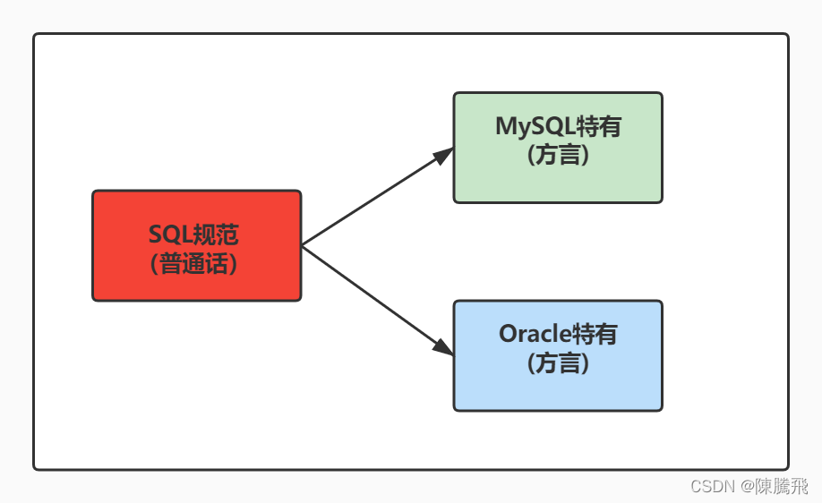

### 3.1.2 SQL 分类

> *   SQL语言在功能上主要分为如下3大类：
>     *   **DDL（Data Definition Languages、数据定义语言）**，这些语句定义了不同的数据库、表、视图、索引等数据库对象，还可以用来创建、删除、修改数据库和数据表的结构。
>         *   主要的语句关键字包括`CREATE`、`DROP`、`ALTER`等。
>     *   **DML（Data Manipulation Language、数据操作语言）**，用于添加、删除、更新和查询数据库记录，并检查数据完整性。
>         *   主要的语句关键字包括`INSERT`、`DELETE`、`UPDATE`、`SELECT`等。
>         *   **SELECT是SQL语言的基础，最为重要。**
>     *   **DCL（Data Control Language、数据控制语言）**，用于定义数据库、表、字段、用户的访问权限和安全级别。
>         *   主要的语句关键字包括`GRANT`、`REVOKE`、`COMMIT`、`ROLLBACK`、`SAVEPOINT`等。

> *   因为查询语句使用的非常的频繁，所以很多人把查询语句单拎出来一类：DQL（数据查询语言）。
> *   还有单独将`COMMIT`、`ROLLBACK` 取出来称为TCL （Transaction Control Language，事务控制语言）

3.2. SQL语言的规则与规范
----------------

### 3.2.1 基本规则

> *   SQL 可以写在一行或者多行。为了提高可读性，各子句分行写，必要时使用缩进
> *   每条命令以 ; 或 \\g 或 \\G 结束
> *   关键字不能被缩写也不能分行
> *   关于标点符号
>     *   必须保证所有的()、单引号、双引号是成对结束的
>     *   必须使用英文状态下的半角输入方式
>     *   字符串型和日期时间类型的数据可以使用单引号（’ '）表示
>     *   列的别名，尽量使用双引号（" "），而且不建议省略as

### 3.2.2 SQL大小写规范 （建议遵守）

> *   **MySQL 在 Windows 环境下是大小写不敏感的**
> *   **MySQL 在 Linux 环境下是大小写敏感的**
>     *   数据库名、表名、表的别名、变量名是严格区分大小写的
>     *   关键字、函数名、列名(或字段名)、列的别名(字段的别名) 是忽略大小写的。
> *   **推荐采用统一的书写规范：**
>     *   数据库名、表名、表别名、字段名、字段别名等都小写
>     *   SQL 关键字、函数名、绑定变量等都大写

### 3.2.3 注 释

可以使用如下格式的注释结构

    单行注释：#注释文字(MySQL特有的方式)
    单行注释：-- 注释文字(--后面必须包含一个空格。)
    多行注释：/* 注释文字  */


### 3.2.4 命名规则（暂时了解）

> *   数据库、表名不得超过30个字符，变量名限制为29个
> *   必须只能包含 A–Z, a–z, 0–9, \_共63个字符
> *   数据库名、表名、字段名等对象名中间不要包含空格
> *   同一个MySQL软件中，数据库不能同名；同一个库中，表不能重名；同一个表中，字段不能重名
> *   必须保证你的字段没有和保留字、数据库系统或常用方法冲突。如果坚持使用，请在SQL语句中使用\`（着重号）引起来
> *   保持字段名和类型的一致性，在命名字段并为其指定数据类型的时候一定要保证一致性。假如数据类型在一个表里是整数，那在另一个表里可就别变成字符型了

举例：

    #以下两句是一样的，不区分大小写
    show databases;
    SHOW DATABASES;
    
    #创建表格
    #create table student info(...); #表名错误，因为表名有空格
    create table student_info(...); 
    
    #其中order使用``飘号，因为order和系统关键字或系统函数名等预定义标识符重名了
    CREATE TABLE `order`(
        id INT,
        lname VARCHAR(20)
    );
    
    select id as "编号", `name` as "姓名" from t_stu; #起别名时，as都可以省略
    select id as 编号, `name` as 姓名 from t_stu; #如果字段别名中没有空格，那么可以省略""
    select id as 编 号, `name` as 姓 名 from t_stu; #错误，如果字段别名中有空格，那么不能省略""


### 3.2.5 数据导入指令

在命令行客户端登录mysql，使用source指令导入

    mysql> source d:\mysqldb.sql


    mysql> desc employees;
    +----------------+-------------+------+-----+---------+-------+
    | Field          | Type        | Null | Key | Default | Extra |
    +----------------+-------------+------+-----+---------+-------+
    | employee_id    | int(6)      | NO   | PRI | 0       |       |
    | first_name     | varchar(20) | YES  |     | NULL    |       |
    | last_name      | varchar(25) | NO   |     | NULL    |       |
    | email          | varchar(25) | NO   | UNI | NULL    |       |
    | phone_number   | varchar(20) | YES  |     | NULL    |       |
    | hire_date      | date        | NO   |     | NULL    |       |
    | job_id         | varchar(10) | NO   | MUL | NULL    |       |
    | salary         | double(8,2) | YES  |     | NULL    |       |
    | commission_pct | double(2,2) | YES  |     | NULL    |       |
    | manager_id     | int(6)      | YES  | MUL | NULL    |       |
    | department_id  | int(4)      | YES  | MUL | NULL    |       |
    +----------------+-------------+------+-----+---------+-------+
    11 rows in set (0.00 sec)


3.3. 基本的SELECT语句
----------------

### 3.3.1 SELECT…

    SELECT 1; #没有任何子句
    SELECT 9/2; #没有任何子句


### 3.3.2 SELECT … FROM

* 语法：

  SELECT   标识选择哪些列
  FROM     标识从哪个表中选择

* 选择全部列：

  SELECT * FROM   departments;

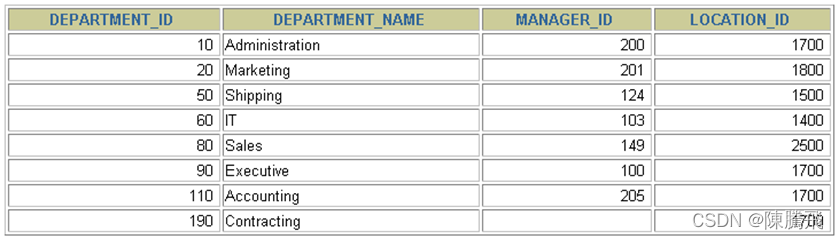

> *   一般情况下，除非需要使用表中所有的字段数据，最好不要使用通配符‘\*’。使用通配符虽然可以节省输入查询语句的时间，但是获取不需要的列数据通常会降低查询和所使用的应用程序的效率。通配符的优势是，当不知道所需要的列的名称时，可以通过它获取它们。
> *   在生产环境下，不推荐你直接使用`SELECT *`进行查询。

* 选择特定的列：

  SELECT department_id, location_id FROM departments;

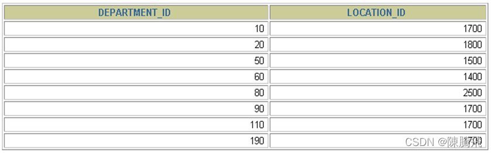

> MySQL中的SQL语句是不区分大小写的，因此SELECT和select的作用是相同的，但是，许多开发人员习惯将关键字大写、数据列和表名小写，读者也应该养成一个良好的编程习惯，这样写出来的代码更容易阅读和维护。

### 3.3.3 列的别名

> *   重命名一个列
> *   便于计算
> *   紧跟列名，也可以**在列名和别名之间加入关键字AS，别名使用双引号**，以便在别名中包含空格或特殊的字符并区分大小写。
> *   AS 可以省略
> *   建议别名简短，见名知意

* 举例

  SELECT last_name AS name, commission_pct comm FROM	employees;


### 3.3.4 去除重复行

默认情况下，查询会返回全部行，包括重复行。

    SELECT department_id FROM employees;

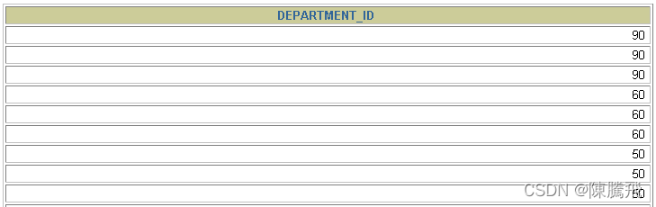  
**在SELECT语句中使用关键字DISTINCT去除重复行**

    SELECT DISTINCT department_id FROM employees;

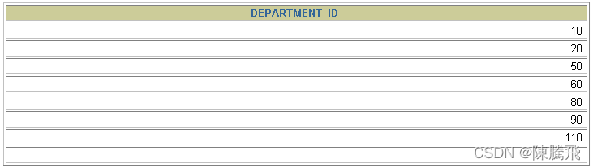  
针对于：

    SELECT DISTINCT department_id,salary FROM employees;


> 这里有两点需要注意：
>
> 1.  DISTINCT 需要放到所有列名的前面，如果写成`SELECT salary, DISTINCT department_id FROM employees`会报错。
> 2.  DISTINCT 其实是对后面所有列名的组合进行去重，你能看到最后的结果是 74 条，因为这 74 个部门id不同，都有 salary 这个属性值。如果你想要看都有哪些不同的部门（department\_id），只需要写`DISTINCT department_id`即可，后面不需要再加其他的列名了。

### 3.3.5 空值参与运算

* 所有运算符或列值遇到null值，运算的结果都为null

  SELECT employee_id,salary,commission_pct,12 * salary * (1 + commission_pct) "annual_sal"
  FROM employees;

> 这里一定要注意，在 MySQL 里面， 空值不等于空字符串。一个空字符串的长度是 0，而一个空值的长度是空。而且，在 MySQL 里面，空值是占用空间的。

### 3.3.6 着重号

* 错误的

  mysql> SELECT * FROM ORDER;
  ERROR 1064 (42000): You have an error in your SQL syntax; check the manual that corresponds to your MySQL server version for the right syntax to use near 'ORDER' at line 1

* 正确的

  mysql> SELECT * FROM `ORDER`;
  +----------+------------+
  | order_id | order_name |
  +----------+------------+
  |        1 | shkstart   |
  |        2 | tomcat     |
  |        3 | dubbo      |
  +----------+------------+
  3 rows in set (0.00 sec)

  mysql> SELECT * FROM `order`;
  +----------+------------+
  | order_id | order_name |
  +----------+------------+
  |        1 | shkstart   |
  |        2 | tomcat     |
  |        3 | dubbo      |
  +----------+------------+
  3 rows in set (0.00 sec)

* 结论

> 我们需要保证表中的字段、表名等没有和保留字、数据库系统或常用方法冲突。如果真的相同，请在SQL语句中使用一对\`\`（着重号）引起来。

### 3.3.7 查询常数

> *   SELECT 查询还可以对常数进行查询。对的，就是在 SELECT 查询结果中增加一列固定的常数列。这列的取值是我们指定的，而不是从数据表中动态取出的。
> *   你可能会问为什么我们还要对常数进行查询呢？
> *   SQL 中的 SELECT 语法的确提供了这个功能，一般来说我们只从一个表中查询数据，通常不需要增加一个固定的常数列，但如果我们想整合不同的数据源，用常数列作为这个表的标记，就需要查询常数。
> *   比如说，我们想对 employees 数据表中的员工姓名进行查询，同时增加一列字段`corporation`，这个字段固定值为“尚硅谷”，可以这样写：

    SELECT '尚硅谷' as corporation, last_name FROM employees;


3.4. 显示表结构
----------

使用DESCRIBE 或 DESC 命令，表示表结构。

    DESCRIBE employees; 或 DESC employees;


    mysql> desc employees;
    +----------------+-------------+------+-----+---------+-------+
    | Field          | Type        | Null | Key | Default | Extra |
    +----------------+-------------+------+-----+---------+-------+
    | employee_id    | int(6)      | NO   | PRI | 0       |       |
    | first_name     | varchar(20) | YES  |     | NULL    |       |
    | last_name      | varchar(25) | NO   |     | NULL    |       |
    | email          | varchar(25) | NO   | UNI | NULL    |       |
    | phone_number   | varchar(20) | YES  |     | NULL    |       |
    | hire_date      | date        | NO   |     | NULL    |       |
    | job_id         | varchar(10) | NO   | MUL | NULL    |       |
    | salary         | double(8,2) | YES  |     | NULL    |       |
    | commission_pct | double(2,2) | YES  |     | NULL    |       |
    | manager_id     | int(6)      | YES  | MUL | NULL    |       |
    | department_id  | int(4)      | YES  | MUL | NULL    |       |
    +----------------+-------------+------+-----+---------+-------+
    11 rows in set (0.00 sec)


> 其中，各个字段的含义分别解释如下：
>
> *   Field：表示字段名称。
> *   Type：表示字段类型，这里 barcode、goodsname 是文本型的，price 是整数类型的。
> *   Null：表示该列是否可以存储NULL值。
> *   Key：表示该列是否已编制索引。PRI表示该列是表主键的一部分；UNI表示该列是UNIQUE索引的一部分；MUL表示在列中某个给定值允许出现多次。
> *   Default：表示该列是否有默认值，如果有，那么值是多少。
> *   Extra：表示可以获取的与给定列有关的附加信息，例如AUTO\_INCREMENT等。

3.5. 过滤数据
---------

* 背景：  
  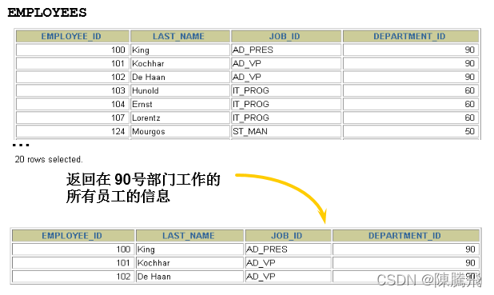

* 语法：

  SELECT 字段1,字段2 FROM 表名 WHERE 过滤条件

> *   使用WHERE 子句，将不满足条件的行过滤掉
> *   **WHERE子句紧随 FROM子句**

* 举例

  SELECT employee_id, last_name, job_id, department_id
  FROM   employees
  WHERE  department_id = 90 ;

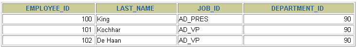


## 3.6. 练习sql

```sql
#第03章_基本的SELECT语句

#1. SQL的分类
/*
DDL:数据定义语言。CREATE \ ALTER \ DROP \ RENAME \ TRUNCATE


DML:数据操作语言。INSERT \ DELETE \ UPDATE \ SELECT （重中之重）


DCL:数据控制语言。COMMIT \ ROLLBACK \ SAVEPOINT \ GRANT \ REVOKE


学习技巧：大处着眼、小处着手。

*/

/*
2.1 SQL的规则 ----必须要遵守
- SQL 可以写在一行或者多行。为了提高可读性，各子句分行写，必要时使用缩进
- 每条命令以 ; 或 \g 或 \G 结束
- 关键字不能被缩写也不能分行
- 关于标点符号
  - 必须保证所有的()、单引号、双引号是成对结束的
  - 必须使用英文状态下的半角输入方式
  - 字符串型和日期时间类型的数据可以使用单引号（' '）表示
  - 列的别名，尽量使用双引号（" "），而且不建议省略as

2.2 SQL的规范  ----建议遵守
- MySQL 在 Windows 环境下是大小写不敏感的
- MySQL 在 Linux 环境下是大小写敏感的
  - 数据库名、表名、表的别名、变量名是严格区分大小写的
  - 关键字、函数名、列名(或字段名)、列的别名(字段的别名) 是忽略大小写的。
- 推荐采用统一的书写规范：
  - 数据库名、表名、表别名、字段名、字段别名等都小写
  - SQL 关键字、函数名、绑定变量等都大写


3. MySQL的三种注释的方式


*/

USE dbtest2;

-- 这是一个查询语句
SELECT * FROM emp;

INSERT INTO emp 
VALUES(1002,'Tom'); #字符串、日期时间类型的变量需要使用一对''表示

INSERT INTO emp 
VALUES(1003,'Jerry');

# SELECT * FROM emp\G

SHOW CREATE TABLE emp\g

/*
4. 导入现有的数据表、表的数据。
方式1：source 文件的全路径名
举例：source d:\atguigudb.sql;


方式2：基于具体的图形化界面的工具可以导入数据
比如：SQLyog中 选择 “工具” -- “执行sql脚本” -- 选中xxx.sql即可。
*/

#5. 最基本的SELECT语句： SELECT 字段1,字段2,... FROM 表名 
SELECT 1 + 1,3 * 2;

SELECT 1 + 1,3 * 2
FROM DUAL; #dual：伪表

# *:表中的所有的字段（或列）
SELECT * FROM employees;

SELECT employee_id,last_name,salary
FROM employees;


#6. 列的别名
# as:全称：alias(别名),可以省略
# 列的别名可以使用一对""引起来，不要使用''。
SELECT employee_id emp_id,last_name AS lname,department_id "部门id",salary * 12 AS "annual sal"
FROM employees;

# 7. 去除重复行
#查询员工表中一共有哪些部门id呢？
#错误的:没有去重的情况
SELECT department_id
FROM employees;
#正确的：去重的情况
SELECT DISTINCT department_id
FROM employees;

#错误的：
SELECT salary,DISTINCT department_id
FROM employees;

#仅仅是没有报错，但是没有实际意义。
SELECT DISTINCT department_id,salary
FROM employees;

#8. 空值参与运算
# 1. 空值：null
# 2. null不等同于0，''，'null'
SELECT * FROM employees;

#3. 空值参与运算：结果一定也为空。
SELECT employee_id,salary "月工资",salary * (1 + commission_pct) * 12 "年工资",commission_pct
FROM employees;
#实际问题的解决方案：引入IFNULL
SELECT employee_id,salary "月工资",salary * (1 + IFNULL(commission_pct,0)) * 12 "年工资",commission_pct
FROM `employees`;

#9. 着重号 ``

SELECT * FROM `order`;

#10. 查询常数
SELECT '尚硅谷',123,employee_id,last_name
FROM employees;

#11.显示表结构

DESCRIBE employees; #显示了表中字段的详细信息

DESC employees;

DESC departments;

#12.过滤数据

#练习：查询90号部门的员工信息
SELECT * 
FROM employees
#过滤条件,声明在FROM结构的后面
WHERE department_id = 90;

#练习：查询last_name为'King'的员工信息
SELECT * 
FROM EMPLOYEES
WHERE LAST_NAME = 'King'; 


```


```sql
#第03章_基本的SELECT语句的课后练习

# 1.查询员工12个月的工资总和，并起别名为ANNUAL SALARY
#理解1：计算12月的基本工资
SELECT employee_id,last_name,salary * 12 "ANNUAL SALARY"
FROM employees;

#理解2：计算12月的基本工资和奖金
SELECT employee_id,last_name,salary * 12 * (1 + IFNULL(commission_pct,0)) "ANNUAL SALARY"
FROM employees;


# 2.查询employees表中去除重复的job_id以后的数据
SELECT DISTINCT job_id
FROM employees;

# 3.查询工资大于12000的员工姓名和工资

```


第4章 运算符
=======

4.1. 算术运算符
----------

> 算术运算符主要用于数学运算，其可以连接运算符前后的两个数值或表达式，对数值或表达式进行加（+）、减（-）、乘（\*）、除（/）和取模（%）运算。


### 4.1.1 加法与减法运算符

    mysql> SELECT 100, 100 + 0, 100 - 0, 100 + 50, 100 + 50 -30, 100 + 35.5, 100 - 35.5 FROM dual;
    +-----+---------+---------+----------+--------------+------------+------------+
    | 100 | 100 + 0 | 100 - 0 | 100 + 50 | 100 + 50 -30 | 100 + 35.5 | 100 - 35.5 |
    +-----+---------+---------+----------+--------------+------------+------------+
    | 100 |     100 |     100 |      150 |          120 |      135.5 |       64.5 |
    +-----+---------+---------+----------+--------------+------------+------------+
    1 row in set (0.00 sec)


由运算结果可以得出如下结论：

> *   一个整数类型的值对整数进行加法和减法操作，结果还是一个整数；
> *   一个整数类型的值对浮点数进行加法和减法操作，结果是一个浮点数；
> *   加法和减法的优先级相同，进行先加后减操作与进行先减后加操作的结果是一样的；
> *   在Java中，+的左右两边如果有字符串，那么表示字符串的拼接。但是在MySQL中+只表示数值相加。如果遇到非数值类型，先尝试转成数值，如果转失败，就按0计算。（补充：MySQL中字符串拼接要使用字符串函数CONCAT()实现）

### 4.1.2 乘法与除法运算符

    mysql> SELECT 100, 100 * 1, 100 * 1.0, 100 / 1.0, 100 / 2,100 + 2 * 5 / 2,100 /3, 100 DIV 0 FROM dual;
    +-----+---------+-----------+-----------+---------+-----------------+---------+-----------+
    | 100 | 100 * 1 | 100 * 1.0 | 100 / 1.0 | 100 / 2 | 100 + 2 * 5 / 2 | 100 /3  | 100 DIV 0 |
    +-----+---------+-----------+-----------+---------+-----------------+---------+-----------+
    | 100 |     100 |     100.0 |  100.0000 | 50.0000 |        105.0000 | 33.3333 |      NULL |
    +-----+---------+-----------+-----------+---------+-----------------+---------+-----------+
    1 row in set (0.00 sec)


    #计算出员工的年基本工资
    SELECT employee_id,salary,salary * 12 annual_sal FROM employees;


由运算结果可以得出如下结论：

> *   一个数乘以整数1和除以整数1后仍得原数；
> *   一个数乘以浮点数1和除以浮点数1后变成浮点数，数值与原数相等；
> *   一个数除以整数后，不管是否能除尽，结果都为一个浮点数；
> *   一个数除以另一个数，除不尽时，结果为一个浮点数，并保留到小数点后4位；
> *   乘法和除法的优先级相同，进行先乘后除操作与先除后乘操作，得出的结果相同。
> *   在数学运算中，0不能用作除数，在MySQL中，一个数除以0为NULL。

### 4.1.3．求模（求余）运算符

将t22表中的字段i对3和5进行求模（求余）运算。

    mysql> SELECT 12 % 3, 12 MOD 5 FROM dual;
    +--------+----------+
    | 12 % 3 | 12 MOD 5 |
    +--------+----------+
    |      0 |        2 |
    +--------+----------+
    1 row in set (0.00 sec)


    #筛选出employee_id是偶数的员工
    SELECT * FROM employees WHERE employee_id MOD 2 = 0;


> 可以看到，100对3求模后的结果为3，对5求模后的结果为0。

4.2. 比较运算符
----------

> *   比较运算符用来对表达式左边的操作数和右边的操作数进行比较，比较的结果为真则返回1，比较的结果为假则返回0，其他情况则返回NULL。
> *   比较运算符经常被用来作为SELECT查询语句的条件来使用，返回符合条件的结果记录。


### 4.2.1 等号运算符

> *   等号运算符（=）判断等号两边的值、字符串或表达式是否相等，如果相等则返回1，不相等则返回0。
> *   在使用等号运算符时，遵循如下规则：
>     *   如果等号两边的值、字符串或表达式都为字符串，则MySQL会按照字符串进行比较，其比较的是每个字符串中字符的ANSI编码是否相等。
>     *   如果等号两边的值都是整数，则MySQL会按照整数来比较两个值的大小。
>     *   如果等号两边的值一个是整数，另一个是字符串，则MySQL会将字符串转化为数字进行比较。
>     *   如果等号两边的值、字符串或表达式中有一个为NULL，则比较结果为NULL。
> *   对比：SQL中赋值符号使用 :=

    mysql> SELECT 1 = 1, 1 = '1', 1 = 0, 'a' = 'a', (5 + 3) = (2 + 6), '' = NULL , NULL = NULL; 
    +-------+---------+-------+-----------+-------------------+-----------+-------------+
    | 1 = 1 | 1 = '1' | 1 = 0 | 'a' = 'a' | (5 + 3) = (2 + 6) | '' = NULL | NULL = NULL |
    +-------+---------+-------+-----------+-------------------+-----------+-------------+
    |    1  |     1   |   0   |      1    |             1     |    NULL   |        NULL  |
    +-------+---------+-------+-----------+-------------------+-----------+-------------+
    1 row in set (0.00 sec)


    mysql> SELECT 1 = 2, 0 = 'abc', 1 = 'abc' FROM dual;
    +-------+-----------+-----------+
    | 1 = 2 | 0 = 'abc' | 1 = 'abc' |
    +-------+-----------+-----------+
    |     0 |         1 |         0 |
    +-------+-----------+-----------+
    1 row in set, 2 warnings (0.00 sec)


    #查询salary=10000，注意在Java中比较是==
    SELECT employee_id,salary FROM employees WHERE salary = 10000;


### 4.2.2 安全等于运算符

> 安全等于运算符（<=>）与等于运算符（=）的作用是相似的，`唯一的区别`是‘<=>’可以用来对NULL进行判断。在两个操作数均为NULL时，其返回值为1，而不为NULL；当一个操作数为NULL时，其返回值为0，而不为NULL。

    mysql> SELECT 1 <=> '1', 1 <=> 0, 'a' <=> 'a', (5 + 3) <=> (2 + 6), '' <=> NULL,NULL <=> NULL FROM dual;
    +-----------+---------+-------------+---------------------+-------------+---------------+
    | 1 <=> '1' | 1 <=> 0 | 'a' <=> 'a' | (5 + 3) <=> (2 + 6) | '' <=> NULL | NULL <=> NULL |
    +-----------+---------+-------------+---------------------+-------------+---------------+
    |         1 |       0 |           1 |                   1 |           0 |             1 |
    +-----------+---------+-------------+---------------------+-------------+---------------+
    1 row in set (0.00 sec)


    #查询commission_pct等于0.40
    SELECT employee_id,commission_pct FROM employees WHERE commission_pct = 0.40;
    SELECT employee_id,commission_pct FROM employees WHERE commission_pct <=> 0.40;
    #如果把0.40改成 NULL 呢？


> 可以看到，使用安全等于运算符时，两边的操作数的值都为NULL时，返回的结果为1而不是NULL，其他返回结果与等于运算符相同。

### 4.2.3 不等于运算符

> 不等于运算符（<>和!=）用于判断两边的数字、字符串或者表达式的值是否不相等，如果不相等则返回1，相等则返回0。不等于运算符不能判断NULL值。如果两边的值有任意一个为NULL，或两边都为NULL，则结果为NULL。

    SQL语句示例如下：
    mysql> SELECT 1 <> 1, 1 != 2, 'a' != 'b', (3+4) <> (2+6), 'a' != NULL, NULL <> NULL; 
    +--------+--------+------------+----------------+-------------+--------------+
    | 1 <> 1 | 1 != 2 | 'a' != 'b' | (3+4) <> (2+6) | 'a' != NULL | NULL <> NULL |
    +--------+--------+------------+----------------+-------------+--------------+
    |      0 |   1    |       1    |            1   |     NULL    |         NULL |
    +--------+--------+------------+----------------+-------------+--------------+
    1 row in set (0.00 sec)


此外，还有非符号类型的运算符：  


### 4.2.4 空运算符

> 空运算符（IS NULL或者ISNULL）判断一个值是否为NULL，如果为NULL则返回1，否则返回0。

    SQL语句示例如下：
    mysql> SELECT NULL IS NULL, ISNULL(NULL), ISNULL('a'), 1 IS NULL;
    +--------------+--------------+-------------+-----------+
    | NULL IS NULL | ISNULL(NULL) | ISNULL('a') | 1 IS NULL |
    +--------------+--------------+-------------+-----------+
    |            1 |            1 |           0 |         0 |
    +--------------+--------------+-------------+-----------+
    1 row in set (0.00 sec)


    #查询commission_pct等于NULL。比较如下的四种写法
    SELECT employee_id,commission_pct FROM employees WHERE commission_pct IS NULL;
    SELECT employee_id,commission_pct FROM employees WHERE commission_pct <=> NULL;
    SELECT employee_id,commission_pct FROM employees WHERE ISNULL(commission_pct);
    SELECT employee_id,commission_pct FROM employees WHERE commission_pct = NULL;


    SELECT last_name, manager_id FROM   employees WHERE  manager_id IS NULL;


### 4.2.5 非空运算符

> 非空运算符（IS NOT NULL）判断一个值是否不为NULL，如果不为NULL则返回1，否则返回0。

    SQL语句示例如下：
    mysql> SELECT NULL IS NOT NULL, 'a' IS NOT NULL,  1 IS NOT NULL; 
    +------------------+-----------------+---------------+
    | NULL IS NOT NULL | 'a' IS NOT NULL | 1 IS NOT NULL |
    +------------------+-----------------+---------------+
    |                0 |               1 |             1 |
    +------------------+-----------------+---------------+
    1 row in set (0.01 sec)


    #查询commission_pct不等于NULL
    SELECT employee_id,commission_pct FROM employees WHERE commission_pct IS NOT NULL;
    SELECT employee_id,commission_pct FROM employees WHERE NOT commission_pct <=> NULL;
    SELECT employee_id,commission_pct FROM employees WHERE NOT ISNULL(commission_pct);


### 4.2.6 最小值运算符

> 语法格式为：LEAST(值1，值2，…，值n)。其中，“值n”表示参数列表中有n个值。在有两个或多个参数的情况下，返回最小值。

    mysql> SELECT LEAST (1,0,2), LEAST('b','a','c'), LEAST(1,NULL,2);
    +---------------+--------------------+-----------------+
    | LEAST (1,0,2) | LEAST('b','a','c') | LEAST(1,NULL,2) |
    +---------------+--------------------+-----------------+
    |       0       |        a           |      NULL       |
    +---------------+--------------------+-----------------+
    1 row in set (0.00 sec)


> 由结果可以看到，当参数是整数或者浮点数时，LEAST将返回其中最小的值；当参数为字符串时，返回字母表中顺序最靠前的字符；当比较值列表中有NULL时，不能判断大小，返回值为NULL。

### 4.2.7 最大值运算符

> 语法格式为：GREATEST(值1，值2，…，值n)。其中，n表示参数列表中有n个值。当有两个或多个参数时，返回值为最大值。假如任意一个自变量为NULL，则GREATEST()的返回值为NULL。

    mysql> SELECT GREATEST(1,0,2), GREATEST('b','a','c'), GREATEST(1,NULL,2);
    +-----------------+-----------------------+--------------------+
    | GREATEST(1,0,2) | GREATEST('b','a','c') | GREATEST(1,NULL,2) |
    +-----------------+-----------------------+--------------------+
    |               2 | c                     |               NULL |
    +-----------------+-----------------------+--------------------+
    1 row in set (0.00 sec)


> 由结果可以看到，当参数中是整数或者浮点数时，GREATEST将返回其中最大的值；当参数为字符串时，返回字母表中顺序最靠后的字符；当比较值列表中有NULL时，不能判断大小，返回值为NULL。

### 4.2.8 BETWEEN AND运算符

> BETWEEN运算符使用的格式通常为SELECT D FROM TABLE WHERE C BETWEEN A AND B，此时，当C大于或等于A，并且C小于或等于B时，结果为1，否则结果为0。

    mysql> SELECT 1 BETWEEN 0 AND 1, 10 BETWEEN 11 AND 12, 'b' BETWEEN 'a' AND 'c';+-------------------+----------------------+-------------------------+| 1 BETWEEN 0 AND 1 | 10 BETWEEN 11 AND 12 | 'b' BETWEEN 'a' AND 'c' |+-------------------+----------------------+-------------------------+|                 1 |                    0 |                       1 |+-------------------+----------------------+-------------------------+1 row in set (0.00 sec)


    SELECT last_name, salary FROM   employees WHERE salary BETWEEN 2500 AND 3500;


### 4.2.9 IN运算符

> IN运算符用于判断给定的值是否是IN列表中的一个值，如果是则返回1，否则返回0。如果给定的值为NULL，或者IN列表中存在NULL，则结果为NULL。

    mysql> SELECT 'a' IN ('a','b','c'), 1 IN (2,3), NULL IN ('a','b'), 'a' IN ('a', NULL);
    +----------------------+------------+-------------------+--------------------+
    | 'a' IN ('a','b','c') | 1 IN (2,3) | NULL IN ('a','b') | 'a' IN ('a', NULL) |
    +----------------------+------------+-------------------+--------------------+
    |            1         |        0   |         NULL      |         1          |
    +----------------------+------------+-------------------+--------------------+
    1 row in set (0.00 sec)


    SELECT employee_id, last_name, salary, manager_id
    FROM   employees
    WHERE  manager_id IN (100, 101, 201);


### 4.2.10 NOT IN运算符

> NOT IN运算符用于判断给定的值是否不是IN列表中的一个值，如果不是IN列表中的一个值，则返回1，否则返回0。

    mysql> SELECT 'a' NOT IN ('a','b','c'), 1 NOT IN (2,3);
    +--------------------------+----------------+
    | 'a' NOT IN ('a','b','c') | 1 NOT IN (2,3) |
    +--------------------------+----------------+
    |                 0        |            1   |
    +--------------------------+----------------+
    1 row in set (0.00 sec)


### 4.2.11 LIKE运算符

> LIKE运算符主要用来匹配字符串，通常用于模糊匹配，如果满足条件则返回1，否则返回0。如果给定的值或者匹配条件为NULL，则返回结果为NULL。

    LIKE运算符通常使用如下通配符：
    “%”：匹配0个或多个字符。
    “_”：只能匹配一个字符。


SQL语句示例如下：

    mysql> SELECT NULL LIKE 'abc', 'abc' LIKE NULL;  
    +-----------------+-----------------+
    | NULL LIKE 'abc' | 'abc' LIKE NULL |
    +-----------------+-----------------+
    |          NULL   |          NULL   |
    +-----------------+-----------------+
    1 row in set (0.00 sec)


    SELECT	first_name
    FROM 	employees
    WHERE	first_name LIKE 'S%';
    
    SELECT last_name
    FROM   employees
    WHERE  last_name LIKE '_o%';

**ESCAPE**

* 回避特殊符号的：**使用转义符**。例如：将\[%\]转为\[ ​ ​ ​ %\]、\[\]转为\[ ​ \]，然后再加上\[ESCAPE‘$’\]即可。

  SELECT job_id
  FROM   jobs
  WHERE  job_id LIKE ‘IT\_%‘;

* 如果使用\\表示转义，要省略ESCAPE。如果不是\\，则要加上ESCAPE。

  SELECT job_id
  FROM   jobs
  WHERE  job_id LIKE ‘IT$_%‘ escape ‘$‘;

### 4.2.12 REGEXP运算符

> REGEXP运算符用来匹配字符串，语法格式为：`expr REGEXP 匹配条件`。如果expr满足匹配条件，返回1；如果不满足，则返回0。若expr或匹配条件任意一个为NULL，则结果为NULL。

> REGEXP运算符在进行匹配时，常用的有下面几种通配符：
>
> 1.  ‘^’匹配以该字符后面的字符开头的字符串。
> 2.  ‘$’匹配以该字符前面的字符结尾的字符串。
> 3.  ‘.’匹配任何一个单字符。
> 4.  “\[…\]”匹配在方括号内的任何字符。例如，“\[abc\]”匹配“a”或“b”或“c”。为了命名字符的范围，使用一个‘-’。“\[a-z\]”匹配任何字母，而“\[0-9\]”匹配任何数字。
> 5.  ‘_’匹配零个或多个在它前面的字符。例如，“x_”匹配任何数量的‘x’字符，“\[0-9\]_”匹配任何数量的数字，而“_”匹配任何数量的任何字符。

SQL语句示例如下：

    mysql> SELECT 'shkstart' REGEXP '^s', 'shkstart' REGEXP 't$', 'shkstart' REGEXP 'hk';
    +------------------------+------------------------+-------------------------+
    | 'shkstart' REGEXP '^s' | 'shkstart' REGEXP 't$' | 'shkstart' REGEXP 'hk'  |
    +------------------------+------------------------+-------------------------+
    |                      1 |                      1 |                       1 |
    +------------------------+------------------------+-------------------------+
    1 row in set (0.01 sec)


    mysql> SELECT 'atguigu' REGEXP 'gu.gu', 'atguigu' REGEXP '[ab]';
    +--------------------------+-------------------------+
    | 'atguigu' REGEXP 'gu.gu' | 'atguigu' REGEXP '[ab]' |
    +--------------------------+-------------------------+
    |                        1 |                       1 |
    +--------------------------+-------------------------+
    1 row in set (0.00 sec)


4.3. 逻辑运算符
----------

> 逻辑运算符主要用来判断表达式的真假，在MySQL中，逻辑运算符的返回结果为1、0或者NULL。

MySQL中支持4种逻辑运算符如下：  


### 4.3.1 逻辑非运算符

> 逻辑非（NOT或!）运算符表示当给定的值为0时返回1；当给定的值为非0值时返回0；当给定的值为NULL时，返回NULL。

    mysql> SELECT NOT 1, NOT 0, NOT(1+1), NOT !1, NOT NULL;    
    +-------+-------+----------+--------+----------+
    | NOT 1 | NOT 0 | NOT(1+1) | NOT !1 | NOT NULL |
    +-------+-------+----------+--------+----------+
    |     0 |     1 |        0 |      1 |     NULL |
    +-------+-------+----------+--------+----------+
    1 row in set, 1 warning (0.00 sec)


    SELECT last_name, job_id
    FROM   employees
    WHERE  job_id NOT IN ('IT_PROG', 'ST_CLERK', 'SA_REP');


### 4.3.2 逻辑与运算符

> 逻辑与（AND或&&）运算符是当给定的所有值均为非0值，并且都不为NULL时，返回1；当给定的一个值或者多个值为0时则返回0；否则返回NULL。

    mysql> SELECT 1 OR -1, 1 OR 0, 1 OR NULL, 0 || NULL, NULL || NULL;     
    +---------+--------+-----------+-----------+--------------+
    | 1 OR -1 | 1 OR 0 | 1 OR NULL | 0 || NULL | NULL || NULL |
    +---------+--------+-----------+-----------+--------------+
    |       1 |      1 |         1 |    NULL   |       NULL   |
    +---------+--------+-----------+-----------+--------------+
    1 row in set, 2 warnings (0.00 sec)


    SELECT employee_id, last_name, job_id, salary
    FROM   employees
    WHERE  salary >=10000
    AND    job_id LIKE '%MAN%';


### 4.3.3 逻辑或运算符

> 逻辑或（OR或||）运算符是当给定的值都不为NULL，并且任何一个值为非0值时，则返回1，否则返回0；当一个值为NULL，并且另一个值为非0值时，返回1，否则返回NULL；当两个值都为NULL时，返回NULL。

    mysql> SELECT 1 OR -1, 1 OR 0, 1 OR NULL, 0 || NULL, NULL || NULL;     
    +---------+--------+-----------+-----------+--------------+
    | 1 OR -1 | 1 OR 0 | 1 OR NULL | 0 || NULL | NULL || NULL |
    +---------+--------+-----------+-----------+--------------+
    |       1 |      1 |         1 |    NULL   |       NULL   |
    +---------+--------+-----------+-----------+--------------+
    1 row in set, 2 warnings (0.00 sec)


    #查询基本薪资不在9000-12000之间的员工编号和基本薪资
    SELECT employee_id,salary FROM employees 
    WHERE NOT (salary >= 9000 AND salary <= 12000);
    
    SELECT employee_id,salary FROM employees 
    WHERE salary <9000 OR salary > 12000;
    
    SELECT employee_id,salary FROM employees 
    WHERE salary NOT BETWEEN 9000 AND 12000;


    SELECT employee_id, last_name, job_id, salary
    FROM   employees
    WHERE  salary >= 10000
    OR     job_id LIKE '%MAN%';


> 注意：OR可以和AND一起使用，但是在使用时要注意两者的优先级，**由于AND的优先级高于OR**，因此先对AND两边的操作数进行操作，再与OR中的操作数结合。

### 4.3.4 逻辑异或运算符

> 逻辑异或（XOR）运算符是当给定的值中任意一个值为NULL时，则返回NULL；如果两个非NULL的值都是0或者都不等于0时，则返回0；如果一个值为0，另一个值不为0时，则返回1。

    mysql> SELECT 1 XOR -1, 1 XOR 0, 0 XOR 0, 1 XOR NULL, 1 XOR 1 XOR 1, 0 XOR 0 XOR 0;
    +----------+---------+---------+------------+---------------+---------------+
    | 1 XOR -1 | 1 XOR 0 | 0 XOR 0 | 1 XOR NULL | 1 XOR 1 XOR 1 | 0 XOR 0 XOR 0 |
    +----------+---------+---------+------------+---------------+---------------+
    |        0 |       1 |       0 |       NULL |             1 |             0 |
    +----------+---------+---------+------------+---------------+---------------+
    1 row in set (0.00 sec)


    select last_name,department_id,salary 
    from employees
    where department_id in (10,20) XOR salary > 8000;


4.4. 位运算符
---------

> 位运算符是在二进制数上进行计算的运算符。位运算符会先将操作数变成二进制数，然后进行位运算，最后将计算结果从二进制变回十进制数。

MySQL支持的位运算符如下：  
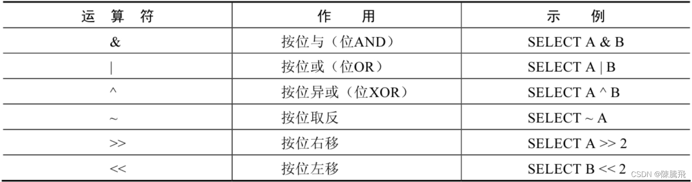

### 4.4.1 按位与运算符

> 按位与（&）运算符将给定值对应的二进制数逐位进行逻辑与运算。当给定值对应的二进制位的数值都为1时，则该位返回1，否则返回0。

    mysql> SELECT 1 & 10, 20 & 30;
    +--------+---------+
    | 1 & 10 | 20 & 30 |
    +--------+---------+
    |      0 |      20 |
    +--------+---------+
    1 row in set (0.00 sec)


> 1的二进制数为0001，10的二进制数为1010，所以1 & 10的结果为0000，对应的十进制数为0。20的二进制数为10100，30的二进制数为11110，所以20 & 30的结果为10100，对应的十进制数为20。

### 4.4.2 按位或运算符

> 按位或（|）运算符将给定的值对应的二进制数逐位进行逻辑或运算。当给定值对应的二进制位的数值有一个或两个为1时，则该位返回1，否则返回0。

    mysql> SELECT 1 | 10, 20 | 30; 
    +--------+---------+
    | 1 | 10 | 20 | 30 |
    +--------+---------+
    |     11 |      30 |
    +--------+---------+
    1 row in set (0.00 sec)


> 1的二进制数为0001，10的二进制数为1010，所以1 | 10的结果为1011，对应的十进制数为11。20的二进制数为10100，30的二进制数为11110，所以20 | 30的结果为11110，对应的十进制数为30。

### 4.4.3. 按位异或运算符

> 按位异或（^）运算符将给定的值对应的二进制数逐位进行逻辑异或运算。当给定值对应的二进制位的数值不同时，则该位返回1，否则返回0。

    mysql> SELECT 1 ^ 10, 20 ^ 30; 
    +--------+---------+
    | 1 ^ 10 | 20 ^ 30 |
    +--------+---------+
    |     11 |      10 |
    +--------+---------+
    1 row in set (0.00 sec)


> 1的二进制数为0001，10的二进制数为1010，所以1 ^ 10的结果为1011，对应的十进制数为11。20的二进制数为10100，30的二进制数为11110，所以20 ^ 30的结果为01010，对应的十进制数为10。

再举例：

    mysql> SELECT 12 & 5, 12 | 5,12 ^ 5 FROM DUAL;
    +--------+--------+--------+
    | 12 & 5 | 12 | 5 | 12 ^ 5 |
    +--------+--------+--------+
    |      4 |     13 |      9 |
    +--------+--------+--------+
    1 row in set (0.00 sec)


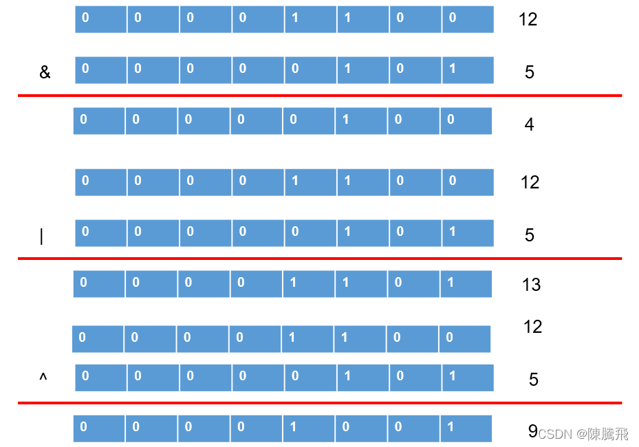

### 4.4.4 按位取反运算符

> 按位取反（~）运算符将给定的值的二进制数逐位进行取反操作，即将1变为0，将0变为1。

    mysql> SELECT 10 & ~1;
    +---------+
    | 10 & ~1 |
    +---------+
    |      10 |
    +---------+
    1 row in set (0.00 sec)


> 由于按位取反（~）运算符的优先级高于按位与（&）运算符的优先级，所以10 & ~1，首先，对数字1进行按位取反操作，结果除了最低位为0，其他位都为1，然后与10进行按位与操作，结果为10。

### 4.4.5 按位右移运算符

> 按位右移（>>）运算符将给定的值的二进制数的所有位右移指定的位数。右移指定的位数后，右边低位的数值被移出并丢弃，左边高位空出的位置用0补齐。

    mysql> SELECT 1 >> 2, 4 >> 2;
    +--------+--------+
    | 1 >> 2 | 4 >> 2 |
    +--------+--------+
    |      0 |      1 |
    +--------+--------+
    1 row in set (0.00 sec)


> 1的二进制数为0000 0001，右移2位为0000 0000，对应的十进制数为0。4的二进制数为0000 0100，右移2位为0000 0001，对应的十进制数为1。

### 4.4.6 按位左移运算符

> 按位左移（<<）运算符将给定的值的二进制数的所有位左移指定的位数。左移指定的位数后，左边高位的数值被移出并丢弃，右边低位空出的位置用0补齐。

    mysql> SELECT 1 << 2, 4 << 2;  
    +--------+--------+
    | 1 << 2 | 4 << 2 |
    +--------+--------+
    |      4 |     16 |
    +--------+--------+
    1 row in set (0.00 sec)


> 1的二进制数为0000 0001，左移两位为0000 0100，对应的十进制数为4。4的二进制数为0000 0100，左移两位为0001 0000，对应的十进制数为16。

4.5. 运算符的优先级
------------

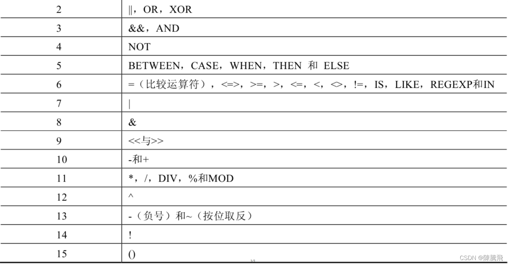

> 数字编号越大，优先级越高，优先级高的运算符先进行计算。可以看到，赋值运算符的优先级最低，使用“()”括起来的表达式的优先级最高。

4.6. 拓展:使用正则表达式查询
-----------------

> *   正则表达式通常被用来检索或替换那些符合某个模式的文本内容，根据指定的匹配模式匹配文本中符合要求的特殊字符串。例如，从一个文本文件中提取电话号码，查找一篇文章中重复的单词或者替换用户输入的某些敏感词语等，这些地方都可以使用正则表达式。正则表达式强大而且灵活，可以应用于非常复杂的查询。
> *   MySQL中使用REGEXP关键字指定正则表达式的字符匹配模式。下表列出了REGEXP操作符中常用字符匹配列表。

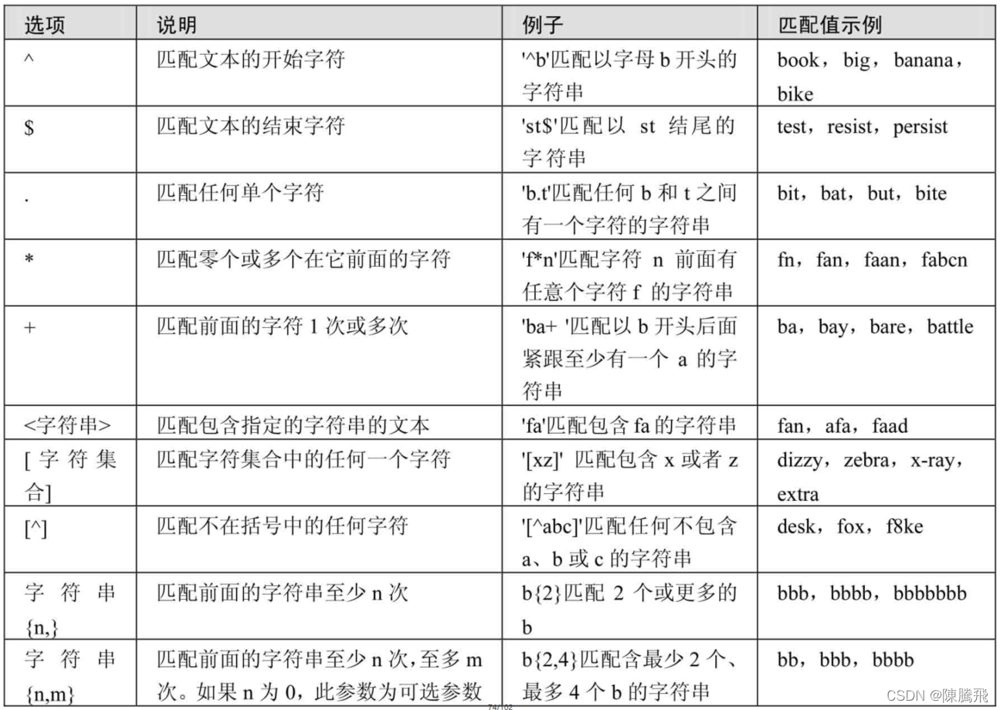  
**4.6.1 查询以特定字符或字符串开头的记录**

> 字符‘^’匹配以特定字符或者字符串开头的文本。

    在fruits表中，查询f_name字段以字母‘b’开头的记录，SQL语句如下：
    mysql> SELECT * FROM fruits WHERE f_name REGEXP '^b';


**4.6.2 查询以特定字符或字符串结尾的记录**

> 字符‘$’匹配以特定字符或者字符串结尾的文本。

    在fruits表中，查询f_name字段以字母‘y’结尾的记录，SQL语句如下：
    mysql> SELECT * FROM fruits WHERE f_name REGEXP 'y$';

**4.6.3 用符号"."来替代字符串中的任意一个字符**  
字符‘.’匹配任意一个字符。  
在fruits表中，查询f\_name字段值包含字母‘a’与‘g’且两个字母之间只有一个字母的记录，SQL语句如下：

    mysql> SELECT * FROM fruits WHERE f_name REGEXP 'a.g';

**4.6.4 使用"\*“和”+"来匹配多个字符**

> 星号‘\*’匹配前面的字符任意多次，包括0次。加号‘+’匹配前面的字符至少一次。

    在fruits表中，查询f_name字段值以字母‘b’开头且‘b’后面出现字母‘a’的记录，SQL语句如下：
    mysql> SELECT * FROM fruits WHERE f_name REGEXP '^ba*';


    在fruits表中，查询f_name字段值以字母‘b’开头且‘b’后面出现字母‘a’至少一次的记录，SQL语句如下：
    mysql> SELECT * FROM fruits WHERE f_name REGEXP '^ba+';


**4.6.5 匹配指定字符串**

> 正则表达式可以匹配指定字符串，只要这个字符串在查询文本中即可，如要匹配多个字符串，多个字符串之间使用分隔符‘|’隔开。

    在fruits表中，查询f_name字段值包含字符串“on”的记录，SQL语句如下：
    mysql> SELECT * FROM fruits WHERE f_name REGEXP 'on';


    在fruits表中，查询f_name字段值包含字符串“on”或者“ap”的记录，SQL语句如下：
    mysql> SELECT * FROM fruits WHERE f_name REGEXP 'on|ap';


> 之前介绍过，LIKE运算符也可以匹配指定的字符串，但与REGEXP不同，LIKE匹配的字符串如果在文本中间出现，则找不到它，相应的行也不会返回。REGEXP在文本内进行匹配，如果被匹配的字符串在文本中出现，REGEXP将会找到它，相应的行也会被返回。对比结果如下所示。

    在fruits表中，使用LIKE运算符查询f_name字段值为“on”的记录，SQL语句如下：
    mysql> SELECT * FROM fruits WHERE f_name like 'on';
    Empty set(0.00 sec)


**4.6.6 匹配指定字符中的任意一个**

> 方括号“\[\]”指定一个字符集合，只匹配其中任何一个字符，即为所查找的文本。

    在fruits表中，查找f_name字段中包含字母‘o’或者‘t’的记录，SQL语句如下：
    mysql> SELECT * FROM fruits WHERE f_name REGEXP '[ot]';


    在fruits表中，查询s_id字段中包含4、5或者6的记录，SQL语句如下：
    mysql> SELECT * FROM fruits WHERE s_id REGEXP '[456]';


**4.6.7 匹配指定字符以外的字符**

> `“[^字符集合]”`匹配不在指定集合中的任何字符。

    在fruits表中，查询f_id字段中包含字母a~e和数字1~2以外字符的记录，SQL语句如下：
    mysql> SELECT * FROM fruits WHERE f_id REGEXP '[^a-e1-2]';


**4.6.8 使用{n,}或者{n,m}来指定字符串连续出现的次数**

> “字符串{n,}”表示至少匹配n次前面的字符；“字符串{n,m}”表示匹配前面的字符串不少于n次，不多于m次。例如，a{2,}表示字母a连续出现至少2次，也可以大于2次；a{2,4}表示字母a连续出现最少2次，最多不能超过4次。

    在fruits表中，查询f_name字段值出现字母‘x’至少2次的记录，SQL语句如下：
    mysql> SELECT * FROM fruits WHERE f_name REGEXP 'x{2,}';


    在fruits表中，查询f_name字段值出现字符串“ba”最少1次、最多3次的记录，SQL语句如下：
    mysql> SELECT * FROM fruits WHERE f_name REGEXP 'ba{1,3}';


## 4.7. 练习sql

```sql
# 第04章_运算符
#1. 算术运算符： +  -  *  /  div  % mod

SELECT 100, 100 + 0, 100 - 0, 100 + 50, 100 + 50 * 30, 100 + 35.5, 100 - 35.5 
FROM DUAL;

# 在SQL中，+没有连接的作用，就表示加法运算。此时，会将字符串转换为数值（隐式转换）
SELECT 100 + '1'  # 在Java语言中，结果是：1001。 
FROM DUAL;

SELECT 100 + 'a' #此时将'a'看做0处理
FROM DUAL;

SELECT 100 + NULL  # null值参与运算，结果为null
FROM DUAL;

SELECT 100, 100 * 1, 100 * 1.0, 100 / 1.0, 100 / 2,
100 + 2 * 5 / 2,100 / 3, 100 DIV 0  # 分母如果为0，则结果为null
FROM DUAL;

# 取模运算： % mod
SELECT 12 % 3,12 % 5, 12 MOD -5,-12 % 5,-12 % -5
FROM DUAL;

#练习：查询员工id为偶数的员工信息
SELECT employee_id,last_name,salary
FROM employees
WHERE employee_id % 2 = 0;

#2. 比较运算符
#2.1 =  <=>  <> !=  <  <=  >  >= 

# = 的使用
SELECT 1 = 2,1 != 2,1 = '1',1 = 'a',0 = 'a' #字符串存在隐式转换。如果转换数值不成功，则看做0
FROM DUAL;

SELECT 'a' = 'a','ab' = 'ab','a' = 'b' #两边都是字符串的话，则按照ANSI的比较规则进行比较。
FROM DUAL;

SELECT 1 = NULL,NULL = NULL # 只要有null参与判断，结果就为null
FROM DUAL;

SELECT last_name,salary,commission_pct
FROM employees
#where salary = 6000;
WHERE commission_pct = NULL;  #此时执行，不会有任何的结果

# <=> ：安全等于。 记忆技巧：为NULL而生。

SELECT 1 <=> 2,1 <=> '1',1 <=> 'a',0 <=> 'a'
FROM DUAL;

SELECT 1 <=> NULL, NULL <=> NULL
FROM DUAL;

#练习：查询表中commission_pct为null的数据有哪些
SELECT last_name,salary,commission_pct
FROM employees
WHERE commission_pct <=> NULL;

SELECT 3 <> 2,'4' <> NULL, '' != NULL,NULL != NULL
FROM DUAL;

#2.2 
#① IS NULL \ IS NOT NULL \ ISNULL
#练习：查询表中commission_pct为null的数据有哪些
SELECT last_name,salary,commission_pct
FROM employees
WHERE commission_pct IS NULL;
#或
SELECT last_name,salary,commission_pct
FROM employees
WHERE ISNULL(commission_pct);

#练习：查询表中commission_pct不为null的数据有哪些
SELECT last_name,salary,commission_pct
FROM employees
WHERE commission_pct IS NOT NULL;
#或
SELECT last_name,salary,commission_pct
FROM employees
WHERE NOT commission_pct <=> NULL;

#② LEAST() \ GREATEST 

SELECT LEAST('g','b','t','m'),GREATEST('g','b','t','m')
FROM DUAL;

SELECT LEAST(first_name,last_name),LEAST(LENGTH(first_name),LENGTH(last_name))
FROM employees;

#③ BETWEEN 条件下界1 AND 条件上界2  （查询条件1和条件2范围内的数据，包含边界）
#查询工资在6000 到 8000的员工信息
SELECT employee_id,last_name,salary
FROM employees
#where salary between 6000 and 8000;
WHERE salary >= 6000 && salary <= 8000;

#交换6000 和 8000之后，查询不到数据
SELECT employee_id,last_name,salary
FROM employees
WHERE salary BETWEEN 8000 AND 6000;

#查询工资不在6000 到 8000的员工信息
SELECT employee_id,last_name,salary
FROM employees
WHERE salary NOT BETWEEN 6000 AND 8000;
#where salary < 6000 or salary > 8000;

#④ in (set)\ not in (set)

#练习：查询部门为10,20,30部门的员工信息
SELECT last_name,salary,department_id
FROM employees
#where department_id = 10 or department_id = 20 or department_id = 30;
WHERE department_id IN (10,20,30);

#练习：查询工资不是6000,7000,8000的员工信息
SELECT last_name,salary,department_id
FROM employees
WHERE salary NOT IN (6000,7000,8000);

#⑤ LIKE :模糊查询
# % : 代表不确定个数的字符 （0个，1个，或多个）

#练习：查询last_name中包含字符'a'的员工信息
SELECT last_name
FROM employees
WHERE last_name LIKE '%a%';

#练习：查询last_name中以字符'a'开头的员工信息
SELECT last_name
FROM employees
WHERE last_name LIKE 'a%';

#练习：查询last_name中包含字符'a'且包含字符'e'的员工信息
#写法1：
SELECT last_name
FROM employees
WHERE last_name LIKE '%a%' AND last_name LIKE '%e%';
#写法2：
SELECT last_name
FROM employees
WHERE last_name LIKE '%a%e%' OR last_name LIKE '%e%a%';

# _ ：代表一个不确定的字符

#练习：查询第3个字符是'a'的员工信息
SELECT last_name
FROM employees
WHERE last_name LIKE '__a%';

#练习：查询第2个字符是_且第3个字符是'a'的员工信息
#需要使用转义字符: \ 
SELECT last_name
FROM employees
WHERE last_name LIKE '_\_a%';

#或者  (了解)
SELECT last_name
FROM employees
WHERE last_name LIKE '_$_a%' ESCAPE '$';

#⑥ REGEXP \ RLIKE :正则表达式

SELECT 'shkstart' REGEXP '^shk', 'shkstart' REGEXP 't$', 'shkstart' REGEXP 'hk'
FROM DUAL;

SELECT 'atguigu' REGEXP 'gu.gu','atguigu' REGEXP '[ab]'
FROM DUAL;

#3. 逻辑运算符： OR ||  AND && NOT ! XOR

# or  and 
SELECT last_name,salary,department_id
FROM employees
#where department_id = 10 or department_id = 20;
#where department_id = 10 and department_id = 20;
WHERE department_id = 50 AND salary > 6000;

# not 
SELECT last_name,salary,department_id
FROM employees
#where salary not between 6000 and 8000;
#where commission_pct is not null;
WHERE NOT commission_pct <=> NULL;

# XOR :追求的"异"
SELECT last_name,salary,department_id
FROM employees
WHERE department_id = 50 XOR salary > 6000;

#注意：AND的优先级高于OR

#4. 位运算符： & |  ^  ~  >>   <<

SELECT 12 & 5, 12 | 5,12 ^ 5 
FROM DUAL;

SELECT 10 & ~1 FROM DUAL;

#在一定范围内满足：每向左移动1位，相当于乘以2；每向右移动一位，相当于除以2。
SELECT 4 << 1 , 8 >> 1
FROM DUAL;


```


```sql
# 第04章_运算符课后练习

# 1.选择工资不在5000到12000的员工的姓名和工资

SELECT last_name,salary
FROM employees
#where salary not between 5000 and 12000;
WHERE salary < 5000 OR salary > 12000;

# 2.选择在20或50号部门工作的员工姓名和部门号
SELECT last_name,department_id
FROM employees
# where department_id in (20,50);
WHERE department_id = 20 OR department_id = 50;

# 3.选择公司中没有管理者的员工姓名及job_id

SELECT last_name,job_id,manager_id
FROM employees
WHERE manager_id IS NULL;

SELECT last_name,job_id,manager_id
FROM employees
WHERE manager_id <=> NULL;

# 4.选择公司中有奖金的员工姓名，工资和奖金级别
SELECT last_name,salary,commission_pct
FROM employees
WHERE commission_pct IS NOT NULL;


SELECT last_name,salary,commission_pct
FROM employees
WHERE NOT commission_pct <=> NULL;


# 5.选择员工姓名的第三个字母是a的员工姓名

SELECT last_name
FROM employees
WHERE last_name LIKE '__a%';


# 6.选择姓名中有字母a和k的员工姓名

SELECT last_name
FROM employees
WHERE last_name LIKE '%a%k%' OR last_name LIKE '%k%a%';
#where last_name like '%a%' and last_name LIKE '%k%';

# 7.显示出表 employees 表中 first_name 以 'e'结尾的员工信息

SELECT first_name,last_name
FROM employees
WHERE first_name LIKE '%e';

SELECT first_name,last_name
FROM employees
WHERE first_name REGEXP 'e$'; # 以e开头的写法：'^e'

# 8.显示出表 employees 部门编号在 80-100 之间的姓名、工种
SELECT last_name,job_id
FROM employees
#方式1：推荐
WHERE department_id BETWEEN 80 AND 100;
#方式2：推荐，与方式1相同
#where department_id >= 80 and department_id <= 100;
#方式3：仅适用于本题的方式。
#where department_id in (80,90,100);

SELECT * FROM departments;

# 9.显示出表 employees 的 manager_id 是 100,101,110 的员工姓名、工资、管理者id

SELECT last_name,salary,manager_id
FROM employees
WHERE manager_id IN (100,101,110);


```
