# mysq详细笔记

[toc]
第5章 排序与分页
=========

5.1 排序数据
--------

### 5.1.1 排序规则

> *   使用 order by 子句排序
>     *   ASC(ascend): 升序
>     *   DESC(descend) :降序
> *   order by 子句在select预警的结尾.

### 5.1.2 单列排序

    	SELECT   last_name, job_id, department_id, hire_date
    	FROM     employees
    	ORDER BY hire_date ;


    SELECT   last_name, job_id, department_id, hire_date
    FROM     employees
    ORDER BY hire_date DESC ;


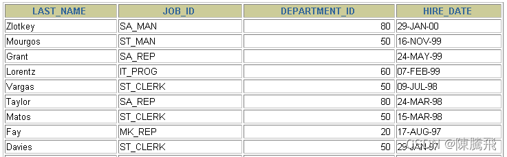

### 5.1.3 多列排序

    SELECT last_name, department_id, salary
    FROM   employees
    ORDER BY department_id, salary DESC;


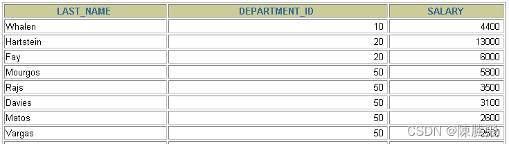

> *   可以使用不在select列表中的列排序.
> *   在对多列进行排序的时候,首先排序的第一列必须有相同的列值，才会对第二列进行排序。如果第一列数据中所有值都是唯一的，将不再对第二列进行排序。

5.2 分页
------

### 5.2.1 背景

> *   背景1：查询返回的记录太多了，查看起来很不方便，怎么样能够实现分页查询呢？
> *   背景2：表里有 4 条数据，我们只想要显示第 2、3 条数据怎么办呢？

### 5.2.2 实现规则

> *   分页原理  
>     所谓分页显示，就是将数据库中的结果集，一段一段显示出来需要的条件。
> *   **MySQL中使用 LIMIT 实现分页**

    格式：
    	LIMIT [位置偏移量,] 行数


> 第一个“位置偏移量”参数指示MySQL从哪一行开始显示，是一个可选参数，如果不指定“位置偏移量”，将会从表中的第一条记录开始（第一条记录的位置偏移量是0，第二条记录的位置偏移量是1，以此类推）；第二个参数“行数”指示返回的记录条数。

* 示例

  --前10条记录：
  SELECT * FROM 表名 LIMIT 0,10;
  或者
  SELECT * FROM 表名 LIMIT 10;

  --第11至20条记录：
  SELECT * FROM 表名 LIMIT 10,10;

  --第21至30条记录： 
  SELECT * FROM 表名 LIMIT 20,10;

> MySQL 8.0中可以使用“LIMIT 3 OFFSET 4”，意思是获取从第5条记录开始后面的3条记录，和“LIMIT 4,3;”返回的结果相同。

* 分页显式公式：\*_（当前页数-1）_每页条数，每页条数__

  SELECT * FROM table 
  LIMIT(PageNo - 1)*PageSize,PageSize;

> 注意：LIMIT 子句必须放在整个SELECT语句的最后！

> 使用 LIMIT 的好处
>
> *   约束返回结果的数量可以减少数据表的网络传输量，也可以提升查询效率。如果我们知道返回结果只有 1 条，就可以使用LIMIT 1，告诉 SELECT 语句只需要返回一条记录即可。这样的好处就是 SELECT 不需要扫描完整的表，只需要检索到一条符合条件的记录即可返回。

### 5.2.3 扩展

> 在不同的 DBMS 中使用的关键字可能不同。在 MySQL、PostgreSQL、MariaDB 和 SQLite 中使用 LIMIT 关键字，而且需要放到 SELECT 语句的最后面。

* 如果是 SQL Server 和 Access，需要使用 TOP 关键字，比如：

  SELECT TOP 5 name, hp_max FROM heros ORDER BY hp_max DESC

* 如果是 DB2，使用**FETCH FIRST 5 ROWS ONLY**这样的关键字：

  SELECT name, hp_max FROM heros ORDER BY hp_max DESC FETCH FIRST 5 ROWS ONLY

* 如果是 Oracle，你需要基于 ROWNUM 来统计行数

  SELECT rownum,last_name,salary FROM employees WHERE rownum < 5 ORDER BY salary DESC;

> 需要说明的是，这条语句是先取出来前 5 条数据行，然后再按照 hp\_max 从高到低的顺序进行排序。但这样产生的结果和上述方法的并不一样。我会在后面讲到子查询，你可以使用如下方式得到与上述方法一直的结果.

    SELECT rownum, last_name,salary
    FROM (
        SELECT last_name,salary
        FROM employees
        ORDER BY salary DESC)
    WHERE rownum < 10;


## 5.3. 练习sql

```sql
#第05章_排序与分页

#1. 排序

# 如果没有使用排序操作，默认情况下查询返回的数据是按照添加数据的顺序显示的。
SELECT * FROM employees;


# 1.1 基本使用
# 使用 ORDER BY 对查询到的数据进行排序操作。
# 升序：ASC (ascend)
# 降序：DESC (descend)

# 练习：按照salary从高到低的顺序显示员工信息
SELECT employee_id,last_name,salary
FROM employees
ORDER BY salary DESC;

# 练习：按照salary从低到高的顺序显示员工信息
SELECT employee_id,last_name,salary
FROM employees
ORDER BY salary ASC;


SELECT employee_id,last_name,salary
FROM employees
ORDER BY salary; # 如果在ORDER BY 后没有显式指名排序的方式的话，则默认按照升序排列。


#2. 我们可以使用列的别名，进行排序
SELECT employee_id,salary,salary * 12 annual_sal
FROM employees
ORDER BY annual_sal;

#列的别名只能在 ORDER BY 中使用，不能在WHERE中使用。
#如下操作报错！
SELECT employee_id,salary,salary * 12 annual_sal
FROM employees
WHERE annual_sal > 81600;

#3. 强调格式：WHERE 需要声明在FROM后，ORDER BY之前。
SELECT employee_id,salary
FROM employees
WHERE department_id IN (50,60,70)
ORDER BY department_id DESC;

#4. 二级排序

#练习：显示员工信息，按照department_id的降序排列，salary的升序排列
SELECT employee_id,salary,department_id
FROM employees
ORDER BY department_id DESC,salary ASC;


#2. 分页
#2.1 mysql使用limit实现数据的分页显示

# 需求1：每页显示20条记录，此时显示第1页
SELECT employee_id,last_name
FROM employees
LIMIT 0,20;


# 需求2：每页显示20条记录，此时显示第2页
SELECT employee_id,last_name
FROM employees
LIMIT 20,20;


# 需求3：每页显示20条记录，此时显示第3页
SELECT employee_id,last_name
FROM employees
LIMIT 40,20;

#需求：每页显示pageSize条记录，此时显示第pageNo页：
#公式：LIMIT (pageNo-1) * pageSize,pageSize;


#2.2 WHERE ... ORDER BY ...LIMIT 声明顺序如下：

# LIMIT的格式： 严格来说：LIMIT 位置偏移量,条目数
# 结构"LIMIT 0,条目数" 等价于 "LIMIT 条目数"

SELECT employee_id,last_name,salary
FROM employees
WHERE salary > 6000
ORDER BY salary DESC
#limit 0,10;
LIMIT 10;

#练习：表里有107条数据，我们只想要显示第 32、33 条数据怎么办呢？

SELECT employee_id,last_name
FROM employees
LIMIT 31,2;

#2.3 MySQL8.0新特性：LIMIT ... OFFSET ...

#练习：表里有107条数据，我们只想要显示第 32、33 条数据怎么办呢？

SELECT employee_id,last_name
FROM employees
LIMIT 2 OFFSET 31;

#练习：查询员工表中工资最高的员工信息
SELECT employee_id,last_name,salary
FROM employees
ORDER BY salary DESC
#limit 0,1
LIMIT 1;

#2.4 LIMIT 可以使用在MySQL、PGSQL、MariaDB、SQLite 等数据库中使用，表示分页。
# 不能使用在SQL Server、DB2、Oracle！

```


```sql
#第05章_排序与分页的课后练习


#1. 查询员工的姓名和部门号和年薪，按年薪降序,按姓名升序显示 

SELECT last_name,department_id,salary * 12 annual_salary
FROM employees
ORDER BY annual_salary DESC,last_name ASC;

#2. 选择工资不在 8000 到 17000 的员工的姓名和工资，按工资降序，显示第21到40位置的数据 

SELECT last_name,salary
FROM employees
WHERE salary NOT BETWEEN 8000 AND 17000
ORDER BY salary DESC
LIMIT 20,20;


#3. 查询邮箱中包含 e 的员工信息，并先按邮箱的字节数降序，再按部门号升序

SELECT employee_id,last_name,email,department_id
FROM employees
#where email like '%e%'
WHERE email REGEXP '[e]'
ORDER BY LENGTH(email) DESC,department_id;


```


第6章 多表查询
========

> 多表查询，也称为关联查询，指两个或更多个表一起完成查询操作。  
> 前提条件：这些一起查询的表之间是有关系的（一对一、一对多），它们之间一定是有关联字段，这个关联字段可能建立了外键，也可能没有建立外键。比如：员工表和部门表，这两个表依靠“部门编号”进行关联。

6.1 一个案例引发的多表连接
---------------

### 6.1.1 案例说明

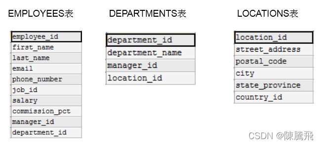  
从多个表中获取数据:  
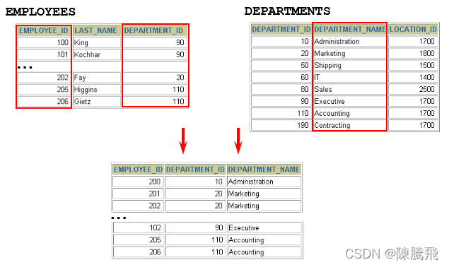

    #案例：查询员工的姓名及其部门名称
    SELECT last_name, department_name
    FROM employees, departments;

  
查询结果:

    +-----------+----------------------+
    | last_name | department_name      |
    +-----------+----------------------+
    | King      | Administration       |
    | King      | Marketing            |
    | King      | Purchasing           |
    | King      | Human Resources      |
    | King      | Shipping             |
    | King      | IT                   |
    | King      | Public Relations     |
    | King      | Sales                |
    | King      | Executive            |
    | King      | Finance              |
    | King      | Accounting           |
    | King      | Treasury             |
    ...
    | Gietz     | IT Support           |
    | Gietz     | NOC                  |
    | Gietz     | IT Helpdesk          |
    | Gietz     | Government Sales     |
    | Gietz     | Retail Sales         |
    | Gietz     | Recruiting           |
    | Gietz     | Payroll              |
    +-----------+----------------------+
    2889 rows in set (0.01 sec)


**分析错误情况：**

    SELECT COUNT(employee_id) FROM employees;
    #输出107行
    
    SELECT COUNT(department_id)FROM departments;
    #输出27行
    
    SELECT 107*27 FROM dual;


> 我们把上述多表查询中出现的问题称为：笛卡尔积的错误。

### 6.1.2 笛卡尔积(交叉连接)的理解

> 笛卡尔乘积是一个数学运算。假设我有两个集合 X 和 Y，那么 X 和 Y 的笛卡尔积就是 X 和 Y 的所有可能组合，也就是第一个对象来自于 X，第二个对象来自于 Y 的所有可能。组合的个数即为两个集合中元素个数的乘积数。

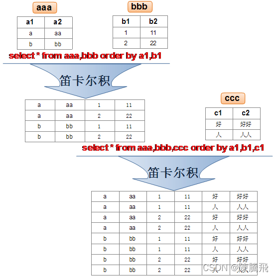

> SQL92中，笛卡尔积也称为交叉连接，英文是 CROSS JOIN。在 SQL99 中也是使用 CROSS JOIN表示交叉连接。它的作用就是可以把任意表进行连接，即使这两张表不相关。在MySQL中如下情况会出现笛卡尔积：

    #查询员工姓名和所在部门名称
    SELECT last_name,department_name FROM employees,departments;
    SELECT last_name,department_name FROM employees CROSS JOIN departments;
    SELECT last_name,department_name FROM employees INNER JOIN departments;
    SELECT last_name,department_name FROM employees JOIN departments;


### 6.1.3 案例分析与问题解决

> *   **笛卡尔积的错误会在下面条件下产生：**
>     *   省略多个表的连接条件（或关联条件）
>     *   连接条件（或关联条件）无效
>     *   所有表中的所有行互相连接
> *   为了避免笛卡尔积， **可以在 WHERE 加入有效的连接条件。**
> *   加入连接条件后，查询语法：

    SELECT	table1.column, table2.column
    FROM	table1, table2
    WHERE	table1.column1 = table2.column2;  #连接条件


* 正确写法

  #案例：查询员工的姓名及其部门名称
  SELECT last_name, department_name
  FROM employees, departments
  WHERE employees.department_id = departments.department_id;

* **在表中有相同列时，在列名之前加上表名前缀。**

6.2 多表查询分类讲解
------------

### 6.2.1 等值连接 vs 非等值连接

* **等值连接**  
  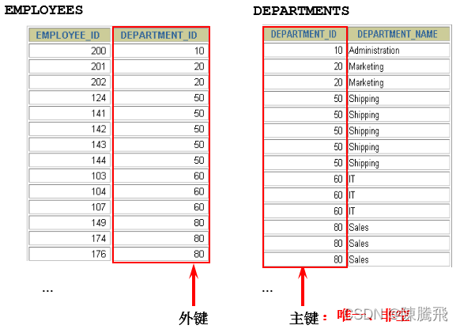

  ```sql
  SELECT employees.employee_id, employees.last_name, 
        employees.department_id, departments.department_id,
        departments.location_id
  FROM   employees, departments
  WHERE  employees.department_id = departments.department_id;
  ```
  
  

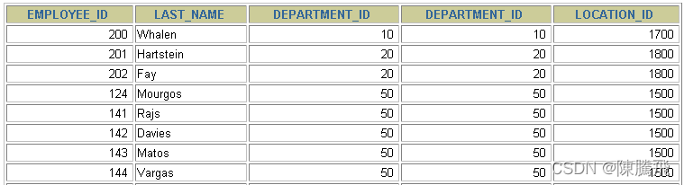

*   \*\* 拓展1：多个连接条件与 AND 操作符 \*\*  
    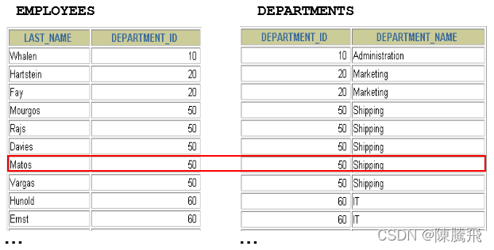
*   **拓展2：区分重复的列名**

> *   **多个表中有相同列时，必须在列名之前加上表名前缀。**
> *   在不同表中具有相同列名的列可以用表名加以区分。

    SELECT employees.last_name, departments.department_name,employees.department_id
    FROM employees, departments
    WHERE employees.department_id = departments.department_id;


*   **拓展3：表的别名**

> *   使用别名可以简化查询。
> *   列名前使用表名前缀可以提高查询效率。

```sql
SELECT e.employee_id, e.last_name, e.department_id,
       d.department_id, d.location_id
FROM   employees e , departments d
WHERE  e.department_id = d.department_id;
```


> 需要注意的是，如果我们使用了表的别名，在查询字段中、过滤条件中就只能使用别名进行代替，不能使用原有的表名，否则就会报错。

> 阿里开发规范：  
> 【强制】对于数据库中表记录的查询和变更，只要涉及多个表，都需要在列名前加表的别名（或 表名）进行限定。  
> 说明：对多表进行查询记录、更新记录、删除记录时，如果对操作列没有限定表的别名（或表名），并且操作列在多个表中存在时，就会抛异常。  
> 正例：select t1.name from table\_first as t1 , table\_second as t2 where t1.id=t2.id;  
> 反例：在某业务中，由于多表关联查询语句没有加表的别名（或表名）的限制，正常运行两年后，最近在 某个表中增加一个同名字段，在预发布环境做数据库变更后，线上查询语句出现出 1052 异常：Column ‘name’ in field list is ambiguous。

*   **拓展4：连接多个表**  
    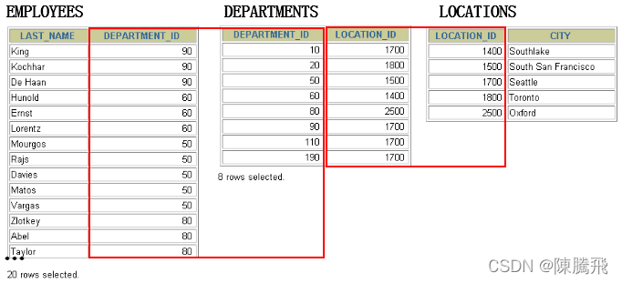

> \*\*总结：连接 n个表,至少需要n-1个连接条件。\*\*比如，连接三个表，至少需要两个连接条件。

* **非等值连接**  
  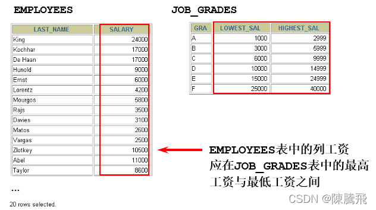

  ```sql
  SELECT e.last_name, e.salary, j.grade_level
  FROM   employees e, job_grades j
  WHERE  e.salary BETWEEN j.lowest_sal AND j.highest_sal;
  ```
  
  

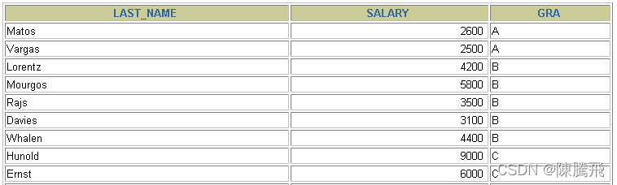

### 6.2.2 自连接 vs 非自连接

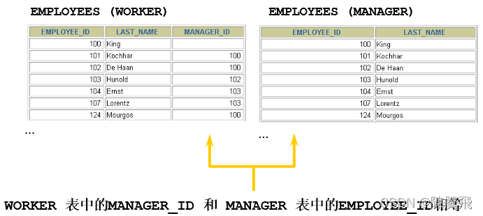

> 当table1和table2本质上是同一张表，只是用取别名的方式虚拟成两张表以代表不同的意义。然后两个表再进行内连接，外连接等查询。

**题目：查询employees表，返回“Xxx works for Xxx”**

```sql
SELECT CONCAT(worker.last_name ,' works for ' 
       , manager.last_name)
FROM   employees worker, employees manager
WHERE  worker.manager_id = manager.employee_id ;
```


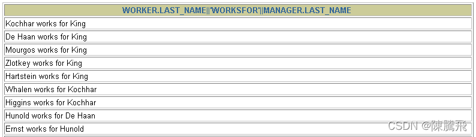

### 6.2.3 内连接 vs 外连接

除了查询满足条件的记录以外，外连接还可以查询某一方不满足条件的记录。  
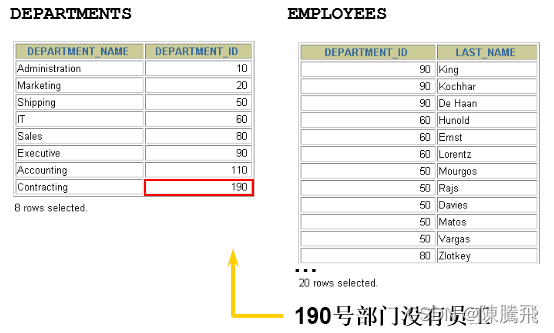

> *   内连接: 合并具有同一列的两个以上的表的行, **结果集中不包含一个表与另一个表不匹配的行**
> *   外连接: 两个表在连接过程中除了返回满足连接条件的行以外\*\*还返回左（或右）表中不满足条件的行 ，这种连接称为左（或右） 外连接。\*\*没有匹配的行时, 结果表中相应的列为空(NULL)。
> *   如果是左外连接，则连接条件中左边的表也称为**主表**，右边的表称为**从表。**
> *   如果是右外连接，则连接条件中右边的表也称为**主表**，左边的表称为**从表。**

*   **SQL92：使用(+)创建连接**

> *   在 SQL92 中采用（+）代表从表所在的位置。即左或右外连接中，(+) 表示哪个是从表。
> *   Oracle 对 SQL92 支持较好，而 MySQL 则不支持 SQL92 的外连接。

    #左外连接
    SELECT last_name,department_name
    FROM employees ,departments
    WHERE employees.department_id = departments.department_id(+);
    
    #右外连接
    SELECT last_name,department_name
    FROM employees ,departments
    WHERE employees.department_id(+) = departments.department_id;


> *   而且在 SQL92 中，只有左外连接和右外连接，没有满（或全）外连接。

6.3 SQL99语法实现多表查询
-----------------

### 6.3.1 基本语法

* 使用JOIN…ON子句创建连接的语法结构：

  SELECT table1.column, table2.column,table3.column
  FROM table1
      JOIN table2 ON table1 和 table2 的连接条件
          JOIN table3 ON table2 和 table3 的连接条件

它的嵌套逻辑类似我们使用的 FOR 循环：

    for t1 in table1:
        for t2 in table2:
           if condition1:
               for t3 in table3:
                  if condition2:
                      output t1 + t2 + t3


> SQL99 采用的这种嵌套结构非常清爽、层次性更强、可读性更强，即使再多的表进行连接也都清晰可见。如果你采用 SQL92，可读性就会大打折扣。
>
> *   语法说明：
>     *   **可以使用 ON 子句指定额外的连接条件。**
>     *   这个连接条件是与其它条件分开的。
>     *   **ON 子句使语句具有更高的易读性。**
>     *   关键字 JOIN、INNER JOIN、CROSS JOIN 的含义是一样的，都表示内连接

### 6.3.2 内连接(INNER JOIN)的实现

* 语法：

  SELECT 字段列表
  FROM A表 INNER JOIN B表
  ON 关联条件
  WHERE 等其他子句;- 

题目1：

    SELECT e.employee_id, e.last_name, e.department_id, 
           d.department_id, d.location_id
    FROM   employees e JOIN departments d
    ON     (e.department_id = d.department_id);

  
题目2：

```sql
SELECT employee_id, city, department_name
FROM   employees e 
JOIN   departments d
ON     d.department_id = e.department_id 
JOIN   locations l
ON     d.location_id = l.location_id;
```


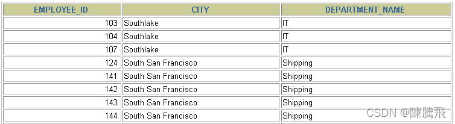

### 6.3.3 外连接(OUTER JOIN)的实现

#### 6.3.3.1 左外连接(LEFT OUTER JOIN)

* 语法：

  #实现查询结果是A
  SELECT 字段列表
  FROM A表 LEFT JOIN B表
  ON 关联条件
  WHERE 等其他子句;

* 举例：

  SELECT e.last_name, e.department_id, d.department_name
  FROM   employees e
  LEFT OUTER JOIN departments d
  ON   (e.department_id = d.department_id) ;

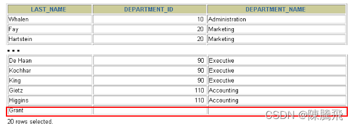

#### 6.3.3.2 右外连接(RIGHT OUTER JOIN)

* 语法：

  #实现查询结果是B
  SELECT 字段列表
  FROM A表 RIGHT JOIN B表
  ON 关联条件
  WHERE 等其他子句;

* 举例：

  SELECT e.last_name, e.department_id, d.department_name
  FROM   employees e
  RIGHT OUTER JOIN departments d
  ON    (e.department_id = d.department_id) ;

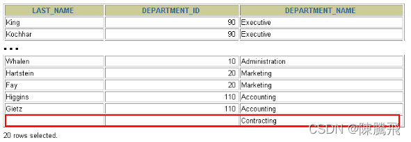

> 需要注意的是，LEFT JOIN 和 RIGHT JOIN 只存在于 SQL99 及以后的标准中，在 SQL92 中不存在，只能用 (+) 表示。

#### 6.3.3.3 满外连接(FULL OUTER JOIN)

> *   满外连接的结果 = 左右表匹配的数据 + 左表没有匹配到的数据 + 右表没有匹配到的数据。
> *   SQL99是支持满外连接的。使用FULL JOIN 或 FULL OUTER JOIN来实现。
> *   需要注意的是，MySQL不支持FULL JOIN，但是可以用 LEFT JOIN UNION RIGHT join代替。

6.4 UNION的使用
------------

> **合并查询结果**  
> 利用UNION关键字，可以给出多条SELECT语句，并将它们的结果组合成单个结果集。合并时，两个表对应的列数和数据类型必须相同，并且相互对应。各个SELECT语句之间使用UNION或UNION ALL关键字分隔。

语法格式：

    SELECT column,... FROM table1
    UNION [ALL]
    SELECT column,... FROM table2

**UNION操作符**  
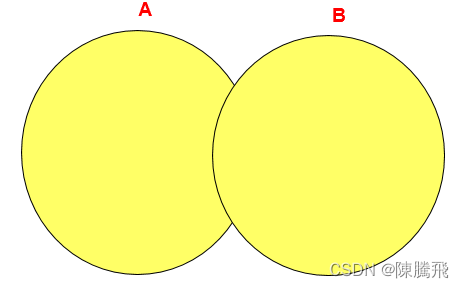  
UNION 操作符返回两个查询的结果集的并集，去除重复记录。  
**UNION ALL操作符**  
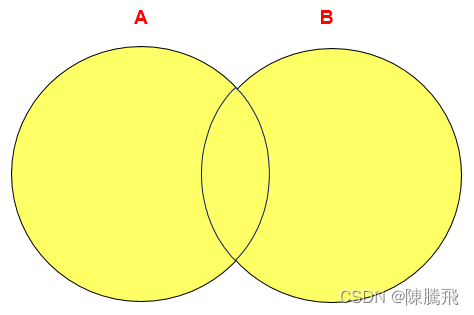  
UNION ALL操作符返回两个查询的结果集的并集。对于两个结果集的重复部分，不去重。

> 注意：执行UNION ALL语句时所需要的资源比UNION语句少。如果明确知道合并数据后的结果数据不存在重复数据，或者不需要去除重复的数据，则尽量使用UNION ALL语句，以提高数据查询的效率。

举例：查询部门编号>90或邮箱包含a的员工信息

    #方式1
    SELECT * FROM employees WHERE email LIKE '%a%' OR department_id>90;


    #方式2
    SELECT * FROM employees  WHERE email LIKE '%a%'
    UNION
    SELECT * FROM employees  WHERE department_id>90;


举例：查询中国用户中男性的信息以及美国用户中年男性的用户信息

    SELECT id,cname FROM t_chinamale WHERE csex='男'
    UNION ALL
    SELECT id,tname FROM t_usmale WHERE tGender='male';


6.5 7种SQL JOINS的实现
------------------

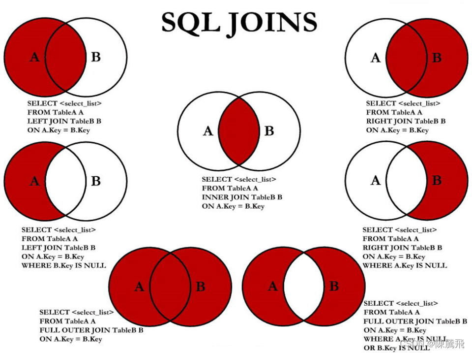

### 6.5.1 sql实现

    #中图：内连接 A∩B
    SELECT employee_id,last_name,department_name
    FROM employees e JOIN departments d
    ON e.`department_id` = d.`department_id`;


    #左上图：左外连接
    SELECT employee_id,last_name,department_name
    FROM employees e LEFT JOIN departments d
    ON e.`department_id` = d.`department_id`;


    #右上图：右外连接
    SELECT employee_id,last_name,department_name
    FROM employees e RIGHT JOIN departments d
    ON e.`department_id` = d.`department_id`;


    #左中图：A - A∩B
    SELECT employee_id,last_name,department_name
    FROM employees e LEFT JOIN departments d
    ON e.`department_id` = d.`department_id`
    WHERE d.`department_id` IS NULL


    #右中图：B-A∩B
    SELECT employee_id,last_name,department_name
    FROM employees e RIGHT JOIN departments d
    ON e.`department_id` = d.`department_id`
    WHERE e.`department_id` IS NULL


    #左下图：满外连接
    # 左中图 + 右上图  A∪B
    SELECT employee_id,last_name,department_name
    FROM employees e LEFT JOIN departments d
    ON e.`department_id` = d.`department_id`
    WHERE d.`department_id` IS NULL
    UNION ALL  #没有去重操作，效率高
    SELECT employee_id,last_name,department_name
    FROM employees e RIGHT JOIN departments d
    ON e.`department_id` = d.`department_id`;


    #右下图
    #左中图 + 右中图  A ∪B- A∩B 或者 (A -  A∩B) ∪ （B - A∩B）
    SELECT employee_id,last_name,department_name
    FROM employees e LEFT JOIN departments d
    ON e.`department_id` = d.`department_id`
    WHERE d.`department_id` IS NULL
    UNION ALL
    SELECT employee_id,last_name,department_name
    FROM employees e RIGHT JOIN departments d
    ON e.`department_id` = d.`department_id`
    WHERE e.`department_id` IS NULL


### 6.5.2 语法格式小结

* 左中图

  #实现A -  A∩B
  select 字段列表
  from A表 left join B表
  on 关联条件
  where 从表关联字段 is null and 等其他子句;

* 右中图

  #实现B -  A∩B
  select 字段列表
  from A表 right join B表
  on 关联条件
  where 从表关联字段 is null and 等其他子句;

* 左下图

  #实现查询结果是A∪B
  #用左外的A，union 右外的B
  select 字段列表
  from A表 left join B表
  on 关联条件
  where 等其他子句

  union 

  select 字段列表
  from A表 right join B表
  on 关联条件
  where 等其他子句;

* 右下图

  #实现A∪B -  A∩B  或   (A -  A∩B) ∪ （B - A∩B）
  #使用左外的 (A -  A∩B)  union 右外的（B - A∩B）
  select 字段列表
  from A表 left join B表
  on 关联条件
  where 从表关联字段 is null and 等其他子句

  union

  select 字段列表
  from A表 right join B表
  on 关联条件
  where 从表关联字段 is null and 等其他子句

6.6 SQL99语法新特性
--------------

### 6.6.1 自然连接

> SQL99 在 SQL92 的基础上提供了一些特殊语法，比如 NATURAL JOIN 用来表示自然连接。我们可以把自然连接理解为 SQL92 中的等值连接。它会帮你自动查询两张连接表中所有相同的字段，然后进行等值连接。  
> 在SQL92标准中：

    SELECT employee_id,last_name,department_name
    FROM employees e JOIN departments d
    ON e.`department_id` = d.`department_id`
    AND e.`manager_id` = d.`manager_id`;


在 SQL99 中你可以写成：

    SELECT employee_id,last_name,department_name
    FROM employees e NATURAL JOIN departments d;


### 6.6.2 USING连接

> 当我们进行连接的时候，SQL99还支持使用 USING 指定数据表里的同名字段进行等值连接。但是只能配合JOIN一起使用。比如：

    SELECT employee_id,last_name,department_name
    FROM employees e JOIN departments d
    USING (department_id);


> 你能看出与自然连接 NATURAL JOIN 不同的是，USING 指定了具体的相同的字段名称，你需要在 USING 的括号 () 中填入要指定的同名字段。同时使用 ==JOIN…USING ==可以简化 JOIN ON 的等值连接。它与下面的 SQL 查询结果是相同的：

    SELECT employee_id,last_name,department_name
    FROM employees e ,departments d
    WHERE e.department_id = d.department_id;


6.7 小结
------

> 表连接的约束条件可以有三种方式：WHERE, ON, USING
>
> *   WHERE：适用于所有关联查询
> *   ON：只能和JOIN一起使用，只能写关联条件。虽然关联条件可以并到WHERE中和其他条件一起写，但分开写可读性更好。
> *   USING：只能和JOIN一起使用，而且要求两个关联字段在关联表中名称一致，而且只能表示关联字段值相等

    #关联条件
    #把关联条件写在where后面
    SELECT last_name,department_name 
    FROM employees,departments 
    WHERE employees.department_id = departments.department_id;
    
    #把关联条件写在on后面，只能和JOIN一起使用
    SELECT last_name,department_name 
    FROM employees INNER JOIN departments 
    ON employees.department_id = departments.department_id;
    
    SELECT last_name,department_name 
    FROM employees CROSS JOIN departments 
    ON employees.department_id = departments.department_id;
    
    SELECT last_name,department_name  
    FROM employees JOIN departments 
    ON employees.department_id = departments.department_id;
    
    #把关联字段写在using()中，只能和JOIN一起使用
    #而且两个表中的关联字段必须名称相同，而且只能表示=
    #查询员工姓名与基本工资
    SELECT last_name,job_title
    FROM employees INNER JOIN jobs USING(job_id);
    
    #n张表关联，需要n-1个关联条件
    #查询员工姓名，基本工资，部门名称
    SELECT last_name,job_title,department_name FROM employees,departments,jobs 
    WHERE employees.department_id = departments.department_id 
    AND employees.job_id = jobs.job_id;
    
    SELECT last_name,job_title,department_name 
    FROM employees INNER JOIN departments INNER JOIN jobs 
    ON employees.department_id = departments.department_id 
    AND employees.job_id = jobs.job_id;


> **注意：**  
> 我们要控制连接表的数量。多表连接就相当于嵌套 for 循环一样，非常消耗资源，会让 SQL 查询性能下降得很严重，因此不要连接不必要的表。在许多 DBMS 中，也都会有最大连接表的限制。

> 【强制】超过三个表禁止 join。需要 join 的字段，数据类型保持绝对一致；多表关联查询时， 保证被关联的字段需要有索引。  
> 说明：即使双表 join 也要注意表索引、SQL 性能。  
> 来源：阿里巴巴《Java开发手册》

**常用的 SQL 标准有哪些**

> *   在正式开始讲连接表的种类时，我们首先需要知道 SQL 存在不同版本的标准规范，因为不同规范下的表连接操作是有区别的。
> *   SQL 有两个主要的标准，分别是== SQL92== 和 SQL99。92 和 99 代表了标准提出的时间，SQL92 就是 92 年提出的标准规范。当然除了 SQL92 和 SQL99 以外，还存在 SQL-86、SQL-89、SQL:2003、SQL:2008、SQL:2011 和 SQL:2016 等其他的标准。
> *   这么多标准，到底该学习哪个呢？==实际上最重要的 SQL 标准就是 SQL92 和 SQL99。==一般来说 SQL92 的形式更简单，但是写的 SQL 语句会比较长，可读性较差。而 SQL99 相比于 SQL92 来说，语法更加复杂，但可读性更强。我们从这两个标准发布的页数也能看出，SQL92 的标准有 500 页，而 SQL99 标准超过了 1000 页。实际上从 SQL99 之后，很少有人能掌握所有内容，因为确实太多了。就好比我们使用 Windows、Linux 和 Office 的时候，很少有人能掌握全部内容一样。我们只需要掌握一些核心的功能，满足日常工作的需求即可。
> *   SQL92 和 SQL99 是经典的 SQL 标准，也分别叫做 SQL-2 和 SQL-3 标准。也正是在这两个标准发布之后，SQL 影响力越来越大，甚至超越了数据库领域。现如今 SQL 已经不仅仅是数据库领域的主流语言，还是信息领域中信息处理的主流语言。在图形检索、图像检索以及语音检索中都能看到 SQL 语言的使用。
>

## 6.8. 练习sql

> ```sql
> # 第06章_多表查询
> 
> /*
>SELECT ...,....,....
> FROM ....
> WHERE .... AND / OR / NOT....
> ORDER BY .... (ASC/DESC),....,...
> LIMIT ...,...
> 
> */
> #1. 熟悉常见的几个表
> DESC employees;
> 
> DESC departments;
> 
> DESC locations;
> 
> #查询员工名为'Abel'的人在哪个城市工作？
> SELECT * 
> FROM employees
> WHERE last_name = 'Abel';
> 
> SELECT *
> FROM departments
> WHERE department_id = 80;
> 
> 
> SELECT *
> FROM locations 
> WHERE location_id = 2500;
> 
> #2. 出现笛卡尔积的错误
> #错误的原因：缺少了多表的连接条件
> 
> #错误的实现方式：每个员工都与每个部门匹配了一遍。
> SELECT employee_id,department_name
> FROM employees,departments;  #查询出2889条记录
> 
> #错误的方式
> SELECT employee_id,department_name
> FROM employees CROSS JOIN departments;#查询出2889条记录
> 
> 
> SELECT *
> FROM employees;  #107条记录
> 
> SELECT 2889 / 107
> FROM DUAL;
> 
> SELECT *
> FROM departments; # 27条记录
> 
> 
> #3. 多表查询的正确方式：需要有连接条件
> 
> SELECT employee_id,department_name
> FROM employees,departments
> #两个表的连接条件
> WHERE employees.`department_id` = departments.department_id;
> 
> #4. 如果查询语句中出现了多个表中都存在的字段，则必须指明此字段所在的表。
> SELECT employees.employee_id,departments.department_name,employees.department_id
> FROM employees,departments
> WHERE employees.`department_id` = departments.department_id;
> 
> #建议：从sql优化的角度，建议多表查询时，每个字段前都指明其所在的表。
> 
> #5. 可以给表起别名，在SELECT和WHERE中使用表的别名。
> SELECT emp.employee_id,dept.department_name,emp.department_id
> FROM employees emp,departments dept
> WHERE emp.`department_id` = dept.department_id;
> 
> #如果给表起了别名，一旦在SELECT或WHERE中使用表名的话，则必须使用表的别名，而不能再使用表的原名。
> #如下的操作是错误的：
> SELECT emp.employee_id,departments.department_name,emp.department_id
> FROM employees emp,departments dept
> WHERE emp.`department_id` = departments.department_id;
> 
> 
> #6. 结论：如果有n个表实现多表的查询，则需要至少n-1个连接条件
> #练习：查询员工的employee_id,last_name,department_name,city
> SELECT e.employee_id,e.last_name,d.department_name,l.city,e.department_id,l.location_id
> FROM employees e,departments d,locations l
> WHERE e.`department_id` = d.`department_id`
> AND d.`location_id` = l.`location_id`;
> 
> /*
> 演绎式：提出问题1 ---> 解决问题1 ----> 提出问题2 ---> 解决问题2 ....
> 
> 归纳式：总--分
> 
> */
> #7. 多表查询的分类
> /*
> 
> 角度1：等值连接  vs  非等值连接
> 
> 角度2：自连接  vs  非自连接
> 
> 角度3：内连接  vs  外连接
> 
> 
> */
> 
> # 7.1 等值连接  vs  非等值连接
> 
> #非等值连接的例子：
> SELECT *
> FROM job_grades;
> 
> SELECT e.last_name,e.salary,j.grade_level
> FROM employees e,job_grades j
> #where e.`salary` between j.`lowest_sal` and j.`highest_sal`;
> WHERE e.`salary` >= j.`lowest_sal` AND e.`salary` <= j.`highest_sal`;
> 
> #7.2 自连接  vs  非自连接
> 
> SELECT * FROM employees;
> 
> #自连接的例子：
> #练习：查询员工id,员工姓名及其管理者的id和姓名
> 
> SELECT emp.employee_id,emp.last_name,mgr.employee_id,mgr.last_name
> FROM employees emp ,employees mgr
> WHERE emp.`manager_id` = mgr.`employee_id`;
> 
> 
> #7.3 内连接  vs  外连接
> 
> # 内连接：合并具有同一列的两个以上的表的行, 结果集中不包含一个表与另一个表不匹配的行
> SELECT employee_id,department_name
> FROM employees e,departments d
> WHERE e.`department_id` = d.department_id;  #只有106条记录
> 
> # 外连接：合并具有同一列的两个以上的表的行, 结果集中除了包含一个表与另一个表匹配的行之外，
> #         还查询到了左表 或 右表中不匹配的行。
> 
> # 外连接的分类：左外连接、右外连接、满外连接
> 
> # 左外连接：两个表在连接过程中除了返回满足连接条件的行以外还返回左表中不满足条件的行，这种连接称为左外连接。
> # 右外连接：两个表在连接过程中除了返回满足连接条件的行以外还返回右表中不满足条件的行，这种连接称为右外连接。
> 
> #练习：查询所有的员工的last_name,department_name信息 
> 
> SELECT employee_id,department_name
> FROM employees e,departments d
> WHERE e.`department_id` = d.department_id;   # 需要使用左外连接
> 
> #SQL92语法实现内连接：见上，略
> #SQL92语法实现外连接：使用 +  ----------MySQL不支持SQL92语法中外连接的写法！
> #不支持：
> SELECT employee_id,department_name
> FROM employees e,departments d
> WHERE e.`department_id` = d.department_id(+);
> 
> #SQL99语法中使用 JOIN ...ON 的方式实现多表的查询。这种方式也能解决外连接的问题。MySQL是支持此种方式的。
> #SQL99语法如何实现多表的查询。
> 
> #SQL99语法实现内连接：
> SELECT last_name,department_name
> FROM employees e INNER JOIN departments d
> ON e.`department_id` = d.`department_id`;
> 
> SELECT last_name,department_name,city
> FROM employees e JOIN departments d
> ON e.`department_id` = d.`department_id`
> JOIN locations l
> ON d.`location_id` = l.`location_id`;
> 
> #SQL99语法实现外连接：
> 
> #练习：查询所有的员工的last_name,department_name信息 
> # 左外连接：
> SELECT last_name,department_name
> FROM employees e LEFT JOIN departments d
> ON e.`department_id` = d.`department_id`;
> 
> #右外连接：
> SELECT last_name,department_name
> FROM employees e RIGHT OUTER JOIN departments d
> ON e.`department_id` = d.`department_id`;
> 
> 
> #满外连接：mysql不支持FULL OUTER JOIN
> SELECT last_name,department_name
> FROM employees e FULL OUTER JOIN departments d
> ON e.`department_id` = d.`department_id`;
> 
> #8. UNION  和 UNION ALL的使用
> # UNION：会执行去重操作
> # UNION ALL:不会执行去重操作
> #结论：如果明确知道合并数据后的结果数据不存在重复数据，或者不需要去除重复的数据，
> #则尽量使用UNION ALL语句，以提高数据查询的效率。
> 
> #9. 7种JOIN的实现：
> 
> # 中图：内连接
> SELECT employee_id,department_name
> FROM employees e JOIN departments d
> ON e.`department_id` = d.`department_id`;
> 
> # 左上图：左外连接
> SELECT employee_id,department_name
> FROM employees e LEFT JOIN departments d
> ON e.`department_id` = d.`department_id`;
> 
> # 右上图：右外连接
> SELECT employee_id,department_name
> FROM employees e RIGHT JOIN departments d
> ON e.`department_id` = d.`department_id`;
> 
> # 左中图：
> SELECT employee_id,department_name
> FROM employees e LEFT JOIN departments d
> ON e.`department_id` = d.`department_id`
> WHERE d.`department_id` IS NULL;
> 
> # 右中图：
> SELECT employee_id,department_name
> FROM employees e RIGHT JOIN departments d
> ON e.`department_id` = d.`department_id`
> WHERE e.`department_id` IS NULL;
> 
> 
> # 左下图：满外连接
> # 方式1：左上图 UNION ALL 右中图
> 
> SELECT employee_id,department_name
> FROM employees e LEFT JOIN departments d
> ON e.`department_id` = d.`department_id`
> UNION ALL
> SELECT employee_id,department_name
> FROM employees e RIGHT JOIN departments d
> ON e.`department_id` = d.`department_id`
> WHERE e.`department_id` IS NULL;
> 
> 
> # 方式2：左中图 UNION ALL 右上图
> 
> SELECT employee_id,department_name
> FROM employees e LEFT JOIN departments d
> ON e.`department_id` = d.`department_id`
> WHERE d.`department_id` IS NULL
> UNION ALL
> SELECT employee_id,department_name
> FROM employees e RIGHT JOIN departments d
> ON e.`department_id` = d.`department_id`;
> 
> # 右下图：左中图  UNION ALL 右中图
> SELECT employee_id,department_name
> FROM employees e LEFT JOIN departments d
> ON e.`department_id` = d.`department_id`
> WHERE d.`department_id` IS NULL
> UNION ALL
> SELECT employee_id,department_name
> FROM employees e RIGHT JOIN departments d
> ON e.`department_id` = d.`department_id`
> WHERE e.`department_id` IS NULL;
> 
> #10. SQL99语法的新特性1:自然连接
> 
> SELECT employee_id,last_name,department_name
> FROM employees e JOIN departments d
> ON e.`department_id` = d.`department_id`
> AND e.`manager_id` = d.`manager_id`;
> 
> # NATURAL JOIN : 它会帮你自动查询两张连接表中`所有相同的字段`，然后进行`等值连接`。
> SELECT employee_id,last_name,department_name
> FROM employees e NATURAL JOIN departments d;
> 
> 
> #11. SQL99语法的新特性2:USING
> SELECT employee_id,last_name,department_name
> FROM employees e JOIN departments d
> ON e.department_id = d.department_id;
> 
> SELECT employee_id,last_name,department_name
> FROM employees e JOIN departments d
> USING (department_id);
> 
> 
> #拓展：
> SELECT last_name,job_title,department_name 
> FROM employees INNER JOIN departments INNER JOIN jobs 
> ON employees.department_id = departments.department_id 
> AND employees.job_id = jobs.job_id;
> 
> ```

```sql

# 第06章_多表查询的课后练习

# 1.显示所有员工的姓名，部门号和部门名称。
SELECT e.last_name,e.department_id,d.department_name
FROM employees e LEFT OUTER JOIN departments d
ON e.`department_id` = d.`department_id`;

# 2.查询90号部门员工的job_id和90号部门的location_id

SELECT e.job_id,d.location_id
FROM employees e JOIN departments d
ON e.`department_id` = d.`department_id`
WHERE d.`department_id` = 90;


DESC departments;

# 3.选择所有有奖金的员工的 last_name , department_name , location_id , city
SELECT e.last_name ,e.`commission_pct`, d.department_name , d.location_id , l.city
FROM employees e LEFT JOIN departments d
ON e.`department_id` = d.`department_id`
LEFT JOIN locations l
ON d.`location_id` = l.`location_id`
WHERE e.`commission_pct` IS NOT NULL; #也应该是35条记录


SELECT *
FROM employees
WHERE commission_pct IS NOT NULL; #35条记录


# 4.选择city在Toronto工作的员工的 last_name , job_id , department_id , department_name 

SELECT e.last_name , e.job_id , e.department_id , d.department_name
FROM employees e JOIN departments d
ON e.`department_id` = d.`department_id`
JOIN locations l
ON d.`location_id` = l.`location_id`
WHERE l.`city` = 'Toronto';

#sql92语法：
SELECT e.last_name , e.job_id , e.department_id , d.department_name
FROM employees e,departments d ,locations l
WHERE e.`department_id` = d.`department_id` 
AND d.`location_id` = l.`location_id`
AND l.`city` = 'Toronto';


# 5.查询员工所在的部门名称、部门地址、姓名、工作、工资，其中员工所在部门的部门名称为’Executive’

SELECT d.department_name,l.street_address,e.last_name,e.job_id,e.salary
FROM departments d LEFT JOIN employees e
ON e.`department_id` = d.`department_id`
LEFT JOIN locations l
ON d.`location_id` = l.`location_id`
WHERE d.`department_name` = 'Executive';


DESC departments;

DESC locations;

# 6.选择指定员工的姓名，员工号，以及他的管理者的姓名和员工号，结果类似于下面的格式
employees	Emp#	manager	Mgr#
kochhar		101	king	100

SELECT emp.last_name "employees",emp.employee_id "Emp#",mgr.last_name "manager", mgr.employee_id "Mgr#"
FROM employees emp LEFT JOIN employees mgr
ON emp.manager_id = mgr.employee_id;


# 7.查询哪些部门没有员工

SELECT d.department_id
FROM departments d LEFT JOIN employees e
ON d.`department_id` = e.`department_id`
WHERE e.`department_id` IS NULL;

#本题也可以使用子查询：暂时不讲

# 8. 查询哪个城市没有部门 

SELECT l.location_id,l.city
FROM locations l LEFT JOIN departments d
ON l.`location_id` = d.`location_id`
WHERE d.`location_id` IS NULL;

SELECT department_id
FROM departments
WHERE department_id IN (1000,1100,1200,1300,1600);


# 9. 查询部门名为 Sales 或 IT 的员工信息

SELECT e.employee_id,e.last_name,e.department_id
FROM employees e JOIN departments d
ON e.`department_id` = d.`department_id`
WHERE d.`department_name` IN ('Sales','IT');


```


========

7.1 函数的理解
---------

### 7.1.1 什么是函数

> 函数在计算机语言的使用中贯穿始终，函数的作用是什么呢？它可以把我们经常使用的代码封装起来，需要的时候直接调用即可。这样既提高了代码效率，又提高了可维护性。在 SQL 中我们也可以使用函数对检索出来的数据进行函数操作。使用这些函数，可以极大地提高用户对数据库的管理效率。


> 从函数定义的角度出发，我们可以将函数分成内置函数和自定义函数。在 SQL 语言中，同样也包括了内置函数和自定义函数。内置函数是系统内置的通用函数，而自定义函数是我们根据自己的需要编写的，本章及下一章讲解的是 SQL 的内置函数。

### 7.1.2 不同DBMS函数的差异

> 我们在使用 SQL 语言的时候，不是直接和这门语言打交道，而是通过它使用不同的数据库软件，即 DBMS。DBMS 之间的差异性很大，远大于同一个语言不同版本之间的差异。实际上，只有很少的函数是被 DBMS 同时支持的。比如，大多数 DBMS 使用（||）或者（+）来做拼接符，而在 MySQL 中的字符串拼接函数为concat()。大部分 DBMS 会有自己特定的函数，这就意味着采用 SQL 函数的代码可移植性是很差的，因此在使用函数的时候需要特别注意。

### 7.1.3 MySQL的内置函数及分类

> *   MySQL提供了丰富的内置函数，这些函数使得数据的维护与管理更加方便，能够更好地提供数据的分析与统计功能，在一定程度上提高了开发人员进行数据分析与统计的效率。
> *   MySQL提供的内置函数从实现的功能角度可以分为数值函数、字符串函数、日期和时间函数、流程控制函数、加密与解密函数、获取MySQL信息函数、聚合函数等。这里，我将这些丰富的内置函数再分为两类：单行函数、聚合函数（或分组函数）。

**两种SQL函数**  
  
**单行函数**

> *   操作数据对象
> *   接受参数返回一个结果
> *   只对一行进行变换
> *   每行返回一个结果
> *   可以嵌套
> *   参数可以是一列或一个值

7.2 数值函数
--------

### 7.2.1 基本函数

函数

用法

ABS(x)

返回x的绝对值

SIGN(X)

返回X的符号。正数返回1，负数返回-1，0返回0

PI()

返回圆周率的值

CEIL(x)，CEILING(x)

返回大于或等于某个值的最小整数

FLOOR(x)

返回小于或等于某个值的最大整数

LEAST(e1,e2,e3…)

返回列表中的最小值

GREATEST(e1,e2,e3…)

返回列表中的最大值

MOD(x,y)

返回X除以Y后的余数

RAND()

返回0~1的随机值

RAND(x)

返回0~1的随机值，其中x的值用作种子值，相同的X值会产生相同的随机数

ROUND(x)

返回一个对x的值进行四舍五入后，最接近于X的整数

ROUND(x,y)

返回一个对x的值进行四舍五入后最接近X的值，并保留到小数点后面Y位

TRUNCATE(x,y)

返回数字x截断为y位小数的结果

SQRT(x)

返回x的平方根。当X的值为负数时，返回NULL

**举例**

    SELECT ABS(-123),ABS(123),SIGN(-23),SIGN(23),PI(),CEIL(32.32),
    	   CEILING(-43.23),FLOOR(32.32),FLOOR(-43.23),MOD(12,5)
    FROM DUAL;


    SELECT RAND(),RAND(),RAND(10),RAND(10),RAND(-1),RAND(-1)
    FROM DUAL;


    SELECT ROUND(12.33),ROUND(12.343,2),ROUND(12.324,-1),TRUNCATE(12.66,1),TRUNCATE(12.66,-1)
    FROM DUAL;


### 7.2.2 角度与弧度互换函数

函数

用法

RADIANS(x)

将角度转化为弧度，其中，参数x为角度值

DEGREES(x)

将弧度转化为角度，其中，参数x为弧度值

    SELECT RADIANS(30),RADIANS(60),RADIANS(90),DEGREES(2*PI()),DEGREES(RADIANS(90))
    FROM DUAL;


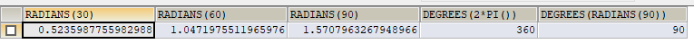

### 7.2.3 三角函数

函数

用法

SIN(x)

返回x的正弦值，其中，参数x为弧度值

ASIN(x)

返回x的反正弦值，即获取正弦为x的值。如果x的值不在-1到1之间，则返回NULL

COS(x)

返回x的余弦值，其中，参数x为弧度值

ACOS(x)

返回x的反余弦值，即获取余弦为x的值。如果x的值不在-1到1之间，则返回NULL

TAN(x)

返回x的正切值，其中，参数x为弧度值

ATAN(x)

返回x的反正切值，即返回正切值为x的值

ATAN2(m,n)

返回两个参数的反正切值

COT(x)

返回x的余切值，其中，X为弧度值

**举例**

> ATAN2(M,N)函数返回两个参数的反正切值。  
> 与ATAN(X)函数相比，ATAN2(M,N)需要两个参数，例如有两个点point(x1,y1)和point(x2,y2)，使用ATAN(X)函数计算反正切值为ATAN((y2-y1)/(x2-x1))，使用ATAN2(M,N)计算反正切值则为ATAN2(y2-y1,x2-x1)。由使用方式可以看出，当x2-x1等于0时，ATAN(X)函数会报错，而ATAN2(M,N)函数则仍然可以计算。

ATAN2(M,N)函数的使用示例如下：

    SELECT SIN(RADIANS(30)),DEGREES(ASIN(1)),TAN(RADIANS(45)),DEGREES(ATAN(1)),DEGREES(ATAN2(1,1))
    FROM DUAL;


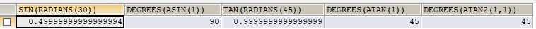

### 7.2.4 三角函数

函数

用法

POW(x,y)，

POWER(X,Y) 返回x的y次方

EXP(X)

返回e的X次方，其中e是一个常数，2.718281828459045

LN(X)，LOG(X)

返回以e为底的X的对数，当X <= 0 时，返回的结果为NULL

LOG10(X)

返回以10为底的X的对数，当X <= 0 时，返回的结果为NULL

LOG2(X)

返回以2为底的X的对数，当X <= 0 时，返回NULL

    SELECT POW(2,5),POWER(2,4),EXP(2),LN(10),LOG10(10),LOG2(4)
    FROM DUAL;


### 7.2.5 进制间的转换

函数

用法

BIN(x)

返回x的二进制编码

HEX(x)

返回x的十六进制编码

OCT(x)

返回x的八进制编码

CONV(x,f1,f2)

返回f1进制数变成f2进制数

    SELECT BIN(10),HEX(10),OCT(10),CONV(10,2,8)
    FROM DUAL;


7.3 字符串函数
---------

函数

用法

ASCII(S)

返回字符串S中的第一个字符的ASCII码值

CHAR\_LENGTH(s)

返回字符串s的字符数。作用与CHARACTER\_LENGTH(s)相同

LENGTH(s)

返回字符串s的字节数，和字符集有关

CONCAT(s1,s2,…,sn)

连接s1,s2,…,sn为一个字符串

CONCAT\_WS(x, s1,s2,…,sn)

同CONCAT(s1,s2,…)函数，但是每个字符串之间要加上x

INSERT(str, idx, len, replacestr)

将字符串str从第idx位置开始，len个字符长的子串替换为字符串replacestr

REPLACE(str, a, b)

用字符串b替换字符串str中所有出现的字符串a

UPPER(s) 或 UCASE(s)

将字符串s的所有字母转成大写字母

LOWER(s) 或LCASE(s)

将字符串s的所有字母转成小写字母

LEFT(str,n)

返回字符串str最左边的n个字符

RIGHT(str,n)

返回字符串str最右边的n个字符

LPAD(str, len, pad)

用字符串pad对str最左边进行填充，直到str的长度为len个字符

RPAD(str ,len, pad)

用字符串pad对str最右边进行填充，直到str的长度为len个字符

LTRIM(s)

去掉字符串s左侧的空格

RTRIM(s)

去掉字符串s右侧的空格

TRIM(s)

去掉字符串s开始与结尾的空格

TRIM(s1 FROM s)

去掉字符串s开始与结尾的s1

TRIM(LEADING s1 FROM s)

去掉字符串s开始处的s1

TRIM(TRAILING s1 FROM s)

去掉字符串s结尾处的s1

REPEAT(str, n)

返回str重复n次的结果

SPACE(n)

返回n个空格

STRCMP(s1,s2)

比较字符串s1,s2的ASCII码值的大小

SUBSTR(s,index,len)

返回从字符串s的index位置其len个字符，作用与SUBSTRING(s,n,len)、MID(s,n,len)相同

LOCATE(substr,str)

返回字符串substr在字符串str中首次出现的位置，作用于POSITION(substr IN str)、INSTR(str,substr)相同。未找到，返回0

ELT(m,s1,s2,…,sn)

返回指定位置的字符串，如果m=1，则返回s1，如果m=2，则返回s2，如果m=n，则返回sn

FIELD(s,s1,s2,…,sn)

返回字符串s在字符串列表中第一次出现的位置

FIND\_IN\_SET(s1,s2)

返回字符串s1在字符串s2中出现的位置。其中，字符串s2是一个以逗号分隔的字符串

REVERSE(s)

返回s反转后的字符串

NULLIF(value1,value2)

比较两个字符串，如果value1与value2相等，则返回NULL，否则返回value1

> 注意：MySQL中，字符串的位置是从1开始的。

    SELECT FIELD('mm','hello','msm','amma'),FIND_IN_SET('mm','hello,mm,amma')
    FROM DUAL;


    SELECT NULLIF('mysql','mysql'),NULLIF('mysql', '');


7.4 日期和时间函数
-----------

### 7.4.1 获取日期、时间

函数

用法

CURDATE() ，CURRENT\_DATE()

返回当前日期，只包含年、月、日

CURTIME() ， CURRENT\_TIME()

返回当前时间，只包含时、分、秒

NOW() / SYSDATE() / CURRENT\_TIMESTAMP() / LOCALTIME() / LOCALTIMESTAMP()

返回当前系统日期和时间

UTC\_DATE()

返回UTC（世界标准时间）日期

UTC\_TIME()

返回UTC（世界标准时间）时间

    SELECT CURDATE(),CURTIME(),NOW(),SYSDATE()+0,UTC_DATE(),UTC_DATE()+0,UTC_TIME(),UTC_TIME()+0
    FROM DUAL;


### 7.4.2 日期与时间戳的转换

函数

用法

UNIX\_TIMESTAMP()

以UNIX时间戳的形式返回当前时间。SELECT UNIX\_TIMESTAMP() ->1634348884

UNIX\_TIMESTAMP(date)

将时间date以UNIX时间戳的形式返回。

FROM\_UNIXTIME(timestamp)

将UNIX时间戳的时间转换为普通格式的时间

**举例**

    SELECT UNIX_TIMESTAMP(NOW());


    SELECT UNIX_TIMESTAMP(CURDATE());


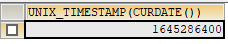

    SELECT UNIX_TIMESTAMP('2011-11-11 11:11:11')


    SELECT FROM_UNIXTIME(1576380910);


### 7.4.3 获取月份、星期、星期数、天数等函数

函数

用法

YEAR(date) / MONTH(date) / DAY(date)

返回具体的日期值

HOUR(time) / MINUTE(time) / SECOND(time)

返回具体的时间值

MONTHNAME(date)

返回月份：January，…

DAYNAME(date)

返回星期几：MONDAY，TUESDAY…SUNDAY

WEEKDAY(date)

返回周几，注意，周1是0，周2是1，。。。周日是6

QUARTER(date)

返回日期对应的季度，范围为1～4

WEEK(date) ， WEEKOFYEAR(date)

返回一年中的第几周

DAYOFYEAR(date)

返回日期是一年中的第几天

DAYOFMONTH(date)

返回日期位于所在月份的第几天

DAYOFWEEK(date)

返回周几，注意：周日是1，周一是2，。。。周六是7

    SELECT YEAR(CURDATE()),MONTH(CURDATE()),DAY(CURDATE()),
    HOUR(CURTIME()),MINUTE(NOW()),SECOND(SYSDATE())
    FROM DUAL;


    SELECT MONTHNAME('2021-10-26'),DAYNAME('2021-10-26'),WEEKDAY('2021-10-26'),
    QUARTER(CURDATE()),WEEK(CURDATE()),DAYOFYEAR(NOW()),
    DAYOFMONTH(NOW()),DAYOFWEEK(NOW())
    FROM DUAL;


### 7.4.4 日期的操作函数

函数

用法

EXTRACT(type FROM date)

返回指定日期中特定的部分，type指定返回的值

**EXTRACT(type FROM date)函数中type的取值与含义：**

type取值

含义

–

–

MICROSECOND

返回毫秒值

SECOND

返回秒数

MINUTE

返回分钟数

HOUR

返回小时数

DAY

返回天数

WEEK

返回日期在一年中的第几个星期

MONTH

返回日期在一年中的第几个月

QUARTER

返回日期在一年中的第几个季度

YEAR

返回日期的年丰

SECOND\_MICROSECOND

返回秒和毫秒值

MINUTE\_MICROSECOND

返回分钟和毫秒值

MINUTE\_SECOND

返回分钟和秒值

HOUR\_MICROSECOND

返回小时和毫秒值

HOUR\_SECOND

返回小时和秒值

HOUR\_MINUTE

返回小时和分钟值

DAY\_MICROSECOND

返回天和毫秒值

DAY\_SECOND

返回天和秒值

DAY\_MINUTE

返回天和分钟值

DAY\_HOUR

返回天和小时

YEAR\_MONTH

返回年和月

    SELECT EXTRACT(MINUTE FROM NOW()),EXTRACT( WEEK FROM NOW()),
    EXTRACT( QUARTER FROM NOW()),EXTRACT( MINUTE_SECOND FROM NOW())
    FROM DUAL;


### 7.4.5 时间和秒钟转换的函数

函数

用法

TIME\_TO\_SEC(time)

将 time 转化为秒并返回结果值。转化的公式为：小时_3600+分钟_60+秒

SEC\_TO\_TIME(seconds)

将 seconds 描述转化为包含小时、分钟和秒的时间

    SELECT TIME_TO_SEC(NOW());


    SELECT SEC_TO_TIME(71507);


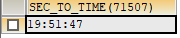

### 7.4.6 计算日期和时间的函数

第一组:

函数

用法

DATE\_ADD(datetime, INTERVAL expr type)，ADDDATE(date,INTERVAL expr type)

返回与给定日期时间相差INTERVAL时间段的日期时间

DATE\_SUB(date,INTERVAL expr type)，SUBDATE(date,INTERVAL expr type)

返回与date相差INTERVAL时间间隔的日期

上述函数中type的取值:

间隔类型

含义

HOUR

小时

MINUTE

分钟

SECOND

秒

YEAR

年

MONTH

月

DAY

日

YEAR\_MONTH

年和月

DAY\_HOUR

日和小时

DAY\_MINUTE

日和分钟

DAY\_SECOND

日和秒

HOUR\_MINUTE

小时和分钟

HOUR\_SECOND

小时和秒

MINUTE\_SECOND

分钟和秒

    SELECT DATE_ADD(NOW(), INTERVAL 1 DAY) AS col1,DATE_ADD('2022-2-26 20:02:02',INTERVAL 1 SECOND) AS col2,
           ADDDATE('2022-2-26 20:02:02',INTERVAL 1 SECOND) AS col3,
           DATE_ADD('2022-2-26 20:02:02',INTERVAL '1_1' MINUTE_SECOND) AS col4,
           DATE_ADD(NOW(), INTERVAL -1 YEAR) AS col5, #可以是负数
           DATE_ADD(NOW(), INTERVAL '1_1' YEAR_MONTH) AS col6 #需要单引号
    FROM DUAL;


    SELECT DATE_SUB('2022-2-26',INTERVAL 31 DAY) AS col1,
           SUBDATE('2022-2-26',INTERVAL 31 DAY) AS col2,
           DATE_SUB('2022-2-26 20:04:02',INTERVAL '1 1' DAY_HOUR) AS col3
    FROM DUAL;


  
第二组:

函数

用法

ADDTIME(time1,time2)

返回time1加上time2的时间。当time2为一个数字时，代表的是`秒`，可以为负数

SUBTIME(time1,time2)

返回time1减去time2后的时间。当time2为一个数字时，代表的是`秒`，可以为负数

DATEDIFF(date1,date2)

返回date1 - date2的日期间隔天数

TIMEDIFF(time1, time2)

返回time1 - time2的时间间隔

FROM\_DAYS(N)

返回从0000年1月1日起，N天以后的日期

TO\_DAYS(date)

返回日期date距离0000年1月1日的天数

LAST\_DAY(date)

返回date所在月份的最后一天的日期

MAKEDATE(year,n)

针对给定年份与所在年份中的天数返回一个日期

MAKETIME(hour,minute,second)

将给定的小时、分钟和秒组合成时间并返回

PERIOD\_ADD(time,n)

返回time加上n后的时间

    SELECT ADDTIME(NOW(),20),SUBTIME(NOW(),30),SUBTIME(NOW(),'1:1:3'),DATEDIFF(NOW(),'2022-2-26'),
           TIMEDIFF(NOW(),'2022-2-26 20:06:52'),FROM_DAYS(366),TO_DAYS('0000-12-25'),
           LAST_DAY(NOW()),MAKEDATE(YEAR(NOW()),12),MAKETIME(10,21,23),PERIOD_ADD(20200101010101,10)
    FROM DUAL;


    SELECT ADDTIME(NOW(),50); #当期时间加50秒


    SELECT ADDTIME(NOW(),'1:1:1'); #当前时间加1小时1分钟1秒


    SELECT SUBTIME(NOW(),'1:1:1'); #当前时间减1小时1分钟1秒


    SELECT SUBTIME(NOW(), '-1:-1:-1'); 


    SELECT FROM_DAYS(366);


    SELECT MAKEDATE(2022,1);


    SELECT MAKETIME(1,1,1);


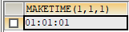

    SELECT PERIOD_ADD(20200101010101,1);


    SELECT TO_DAYS(NOW());


    #查询 7 天内的新增用户数有多少？
    SELECT COUNT(*) AS num FROM new_user WHERE TO_DAYS(NOW())-TO_DAYS(regist_time)<=7


### 7.4.7 日期的格式化与解析

函数

用法

DATE\_FORMAT(date,fmt)

按照字符串fmt格式化日期date值

TIME\_FORMAT(time,fmt)

按照字符串fmt格式化时间time值

GET\_FORMAT(date\_type,format\_type)

返回日期字符串的显示格式

STR\_TO\_DATE(str, fmt)

按照字符串fmt对str进行解析，解析为一个日期

上述非GET\_FORMAT函数中fmt参数常用的格式符：

格式符

说明

格式符

说明

%Y

4位数字表示年份

%y

表示两位数字表示年份

%M

月名表示月份（January,…）

%m

两位数字表示月份（01,02,03。。。）

%b

缩写的月名（Jan.，Feb.，…）

%c

数字表示月份（1,2,3,…）

%D

英文后缀表示月中的天数（1st,2nd,3rd,…）

%d

两位数字表示月中的天数(01,02…)

%e

数字形式表示月中的天数（1,2,3,4,5…）

%H

两位数字表示小数，24小时制（01,02…）

%h和%I

两位数字表示小时，12小时制（01,02…）

%k

数字形式的小时，24小时制(1,2,3)

%l

数字形式表示小时，12小时制（1,2,3,4…）

%i

两位数字表示分钟（00,01,02）

%S和%s

两位数字表示秒(00,01,02…)

%W

一周中的星期名称（Sunday…）

%a

一周中的星期缩写（Sun.，Mon.,Tues.，…）

%w

以数字表示周中的天数(0=Sunday,1=Monday…)

%j

以3位数字表示年中的天数(001,002…)

%U

以数字表示年中的第几周，（1,2,3。。）其中Sunday为周中第一天

%u

以数字表示年中的第几周，（1,2,3。。）其中Monday为周中第一天

%T

24小时制

%r

12小时制

%p

AM或PM

%%

表示%

GET\_FORMAT函数中date\_type和format\_type参数取值如下：


    SELECT DATE_FORMAT(NOW(), '%H:%i:%s');


    SELECT STR_TO_DATE('09/01/2009','%m/%d/%Y')
    FROM DUAL;


    SELECT STR_TO_DATE('20140422154706','%Y%m%d%H%i%s')
    FROM DUAL;


    SELECT STR_TO_DATE('2014-04-22 15:47:06','%Y-%m-%d %H:%i:%s')
    FROM DUAL;


    SELECT GET_FORMAT(DATE, 'USA');


    SELECT DATE_FORMAT(NOW(),GET_FORMAT(DATE,'USA')) FROM DUAL;


    SELECT STR_TO_DATE('2020-01-01 00:00:00','%Y-%m-%d');


7.5 流程控制函数
----------

> 流程处理函数可以根据不同的条件，执行不同的处理流程，可以在SQL语句中实现不同的条件选择。MySQL中的流程处理函数主要包括IF()、IFNULL()和CASE()函数。

函数

用法

IF(value,value1,value2)

如果value的值为TRUE，返回value1，否则返回value2

IFNULL(value1, value2)

如果value1不为NULL，返回value1，否则返回value2

CASE WHEN 条件1 THEN 结果1 WHEN 条件2 THEN 结果2 … \[ELSE resultn\] END

相当于Java的if…else if…else…

CASE expr WHEN 常量值1 THEN 值1 WHEN 常量值1 THEN 值1 … \[ELSE 值n\] END

相当于Java的switch…case…

    SELECT IF(1>0,'正确','错误')


    SELECT IFNULL(NULL,'Hello Word');


    SELECT CASE WHEN 1 > 0 THEN '1>0'
                WHEN 2 > 0 THEN '2>0'
           ELSE '3 > 0'
           END;


    SELECT employee_id,salary, CASE WHEN salary>=15000 THEN '高薪' 
    				  WHEN salary>=10000 THEN '潜力股'  
    				  WHEN salary>=8000 THEN '屌丝' 
    				  ELSE '草根' END  "描述"
    FROM employees; 
    SELECT oid,`status`, CASE `status` WHEN 1 THEN '未付款' 
    								   WHEN 2 THEN '已付款' 
    								   WHEN 3 THEN '已发货'  
    								   WHEN 4 THEN '确认收货'  
    								   ELSE '无效订单' END 
    FROM t_order;


7.6 流程控制函数
----------

> 加密与解密函数主要用于对数据库中的数据进行加密和解密处理，以防止数据被他人窃取。这些函数在保证数据库安全时非常有用。

函数

用法

PASSWORD(str)

返回字符串str的加密版本，41位长的字符串。加密结果不可逆，常用于用户的密码加密

MD5(str)

返回字符串str的md5加密后的值，也是一种加密方式。若参数为NULL，则会返回NULL

SHA(str)

从原明文密码str计算并返回加密后的密码字符串，当参数为NULL时，返回NULL。SHA加密算法比MD5更加安全。

ENCODE(value,password\_seed)

返回使用password\_seed作为加密密码加密value

DECODE(value,password\_seed)

返回使用password\_seed作为加密密码解密value

> 可以看到，ENCODE(value,password\_seed)函数与DECODE(value,password\_seed)函数互为反函数。

    mysql> SELECT PASSWORD('mysql'), PASSWORD(NULL);
    +-------------------------------------------+----------------+
    | PASSWORD('mysql')                         | PASSWORD(NULL) |
    +-------------------------------------------+----------------+
    | *E74858DB86EBA20BC33D0AECAE8A8108C56B17FA |                |
    +-------------------------------------------+----------------+
    1 row in set, 1 warning (0.00 sec)


    SELECT md5('123')
    ->202cb962ac59075b964b07152d234b70


    SELECT SHA('Tom123')
    ->c7c506980abc31cc390a2438c90861d0f1216d50


    mysql> SELECT ENCODE('mysql', 'mysql');
    +--------------------------+
    | ENCODE('mysql', 'mysql') |
    +--------------------------+
    | íg　¼　ìÉ                  |
    +--------------------------+
    1 row in set, 1 warning (0.01 sec)


    mysql> SELECT DECODE(ENCODE('mysql','mysql'),'mysql');
    +-----------------------------------------+
    | DECODE(ENCODE('mysql','mysql'),'mysql') |
    +-----------------------------------------+
    | mysql                                   |
    +-----------------------------------------+
    1 row in set, 2 warnings (0.00 sec)


7.7 MySQL信息函数
-------------

> MySQL中内置了一些可以查询MySQL信息的函数，这些函数主要用于帮助数据库开发或运维人员更好地对数据库进行维护工作。

函数

用法

VERSION()

返回当前MySQL的版本号

CONNECTION\_ID()

返回当前MySQL服务器的连接数

DATABASE()，SCHEMA()

返回MySQL命令行当前所在的数据库

USER()，CURRENT\_USER()、SYSTEM\_USER()，SESSION\_USER()

返回当前连接MySQL的用户名，返回结果格式为“主机名@用户名”

CHARSET(value)

返回字符串value自变量的字符集

COLLATION(value)

返回字符串value的比较规则

     SELECT DATABASE();


    SELECT USER(), CURRENT_USER(), SYSTEM_USER(),SESSION_USER();


    SELECT CHARSET('ABC');


    SELECT COLLATION('ABC');


7.8 其他函数
--------

> MySQL中有些函数无法对其进行具体的分类，但是这些函数在MySQL的开发和运维过程中也是不容忽视的。

函数

用法

FORMAT(value,n)

返回对数字value进行格式化后的结果数据。n表示四舍五入后保留到小数点后n位

CONV(value,from,to)

将value的值进行不同进制之间的转换

INET\_ATON(ipvalue)

将以点分隔的IP地址转化为一个数字

INET\_NTOA(value)

将数字形式的IP地址转化为以点分隔的IP地址

BENCHMARK(n,expr)

将表达式expr重复执行n次。用于测试MySQL处理expr表达式所耗费的时间

CONVERT(value USING char\_code)

将value所使用的字符编码修改为char\_code

    # 如果n的值小于或者等于0，则只保留整数部分
    SELECT FORMAT(123.123, 2), FORMAT(123.523, 0), FORMAT(123.123, -2);


    SELECT CONV(16, 10, 2), CONV(8888,10,16), CONV(NULL, 10, 2);


    SELECT INET_ATON('192.168.1.100');
    # 以“192.168.1.100”为例，计算方式为192乘以256的3次方，加上168乘以256的2次方，加上1乘以256，再加上100。


    SELECT INET_NTOA(3232235876);


    SELECT BENCHMARK(1, MD5('mysql'));


    SELECT BENCHMARK(1000000, MD5('mysql')); 


    SELECT CHARSET('mysql'), CHARSET(CONVERT('mysql' USING 'utf8'));


## 7.9. 练习sql

```sql
#第07章_单行函数

#1.数值函数
#基本的操作
SELECT ABS(-123),ABS(32),SIGN(-23),SIGN(43),PI(),CEIL(32.32),CEILING(-43.23),FLOOR(32.32),
FLOOR(-43.23),MOD(12,5),12 MOD 5,12 % 5
FROM DUAL;

#取随机数
SELECT RAND(),RAND(),RAND(10),RAND(10),RAND(-1),RAND(-1)
FROM DUAL;

#四舍五入，截断操作
SELECT ROUND(123.556),ROUND(123.456,0),ROUND(123.456,1),ROUND(123.456,2),
ROUND(123.456,-1),ROUND(153.456,-2)
FROM DUAL;

SELECT TRUNCATE(123.456,0),TRUNCATE(123.496,1),TRUNCATE(129.45,-1)
FROM DUAL;

#单行函数可以嵌套
SELECT TRUNCATE(ROUND(123.456,2),0)
FROM DUAL;

#角度与弧度的互换

SELECT RADIANS(30),RADIANS(45),RADIANS(60),RADIANS(90),
DEGREES(2*PI()),DEGREES(RADIANS(60))
FROM DUAL;


#三角函数
SELECT SIN(RADIANS(30)),DEGREES(ASIN(1)),TAN(RADIANS(45)),DEGREES(ATAN(1))
FROM DUAL;

#指数和对数
SELECT POW(2,5),POWER(2,4),EXP(2)
FROM DUAL;

SELECT LN(EXP(2)),LOG(EXP(2)),LOG10(10),LOG2(4)
FROM DUAL;

#进制间的转换
SELECT BIN(10),HEX(10),OCT(10),CONV(10,10,8)
FROM DUAL;


#2. 字符串函数

SELECT ASCII('Abcdfsf'),CHAR_LENGTH('hello'),CHAR_LENGTH('我们'),
LENGTH('hello'),LENGTH('我们')
FROM DUAL;

# xxx worked for yyy
SELECT CONCAT(emp.last_name,' worked for ',mgr.last_name) "details"
FROM employees emp JOIN employees mgr
WHERE emp.`manager_id` = mgr.employee_id;

SELECT CONCAT_WS('-','hello','world','hello','beijing')
FROM DUAL;
#字符串的索引是从1开始的！
SELECT INSERT('helloworld',2,3,'aaaaa'),REPLACE('hello','lol','mmm')
FROM DUAL;

SELECT UPPER('HelLo'),LOWER('HelLo')
FROM DUAL;

SELECT last_name,salary
FROM employees
WHERE LOWER(last_name) = 'King';

SELECT LEFT('hello',2),RIGHT('hello',3),RIGHT('hello',13)
FROM DUAL;

# LPAD:实现右对齐效果
# RPAD:实现左对齐效果
SELECT employee_id,last_name,LPAD(salary,10,' ')
FROM employees;

SELECT CONCAT('---',LTRIM('    h  el  lo   '),'***'),
TRIM('oo' FROM 'ooheollo')
FROM DUAL;

SELECT REPEAT('hello',4),LENGTH(SPACE(5)),STRCMP('abc','abe')
FROM DUAL;


SELECT SUBSTR('hello',2,2),LOCATE('lll','hello')
FROM DUAL;

SELECT ELT(2,'a','b','c','d'),FIELD('mm','gg','jj','mm','dd','mm'),
FIND_IN_SET('mm','gg,mm,jj,dd,mm,gg')
FROM DUAL;

SELECT employee_id,NULLIF(LENGTH(first_name),LENGTH(last_name)) "compare"
FROM employees;

#3. 日期和时间函数

#3.1  获取日期、时间
SELECT CURDATE(),CURRENT_DATE(),CURTIME(),NOW(),SYSDATE(),
UTC_DATE(),UTC_TIME()
FROM DUAL;

SELECT CURDATE(),CURDATE() + 0,CURTIME() + 0,NOW() + 0
FROM DUAL;

#3.2 日期与时间戳的转换
SELECT UNIX_TIMESTAMP(),UNIX_TIMESTAMP('2021-10-01 12:12:32'),
FROM_UNIXTIME(1635173853),FROM_UNIXTIME(1633061552)
FROM DUAL;

#3.3 获取月份、星期、星期数、天数等函数
SELECT YEAR(CURDATE()),MONTH(CURDATE()),DAY(CURDATE()),
HOUR(CURTIME()),MINUTE(NOW()),SECOND(SYSDATE())
FROM DUAL;


SELECT MONTHNAME('2021-10-26'),DAYNAME('2021-10-26'),WEEKDAY('2021-10-26'),
QUARTER(CURDATE()),WEEK(CURDATE()),DAYOFYEAR(NOW()),
DAYOFMONTH(NOW()),DAYOFWEEK(NOW())
FROM DUAL;

#3.4 日期的操作函数

SELECT EXTRACT(SECOND FROM NOW()),EXTRACT(DAY FROM NOW()),
EXTRACT(HOUR_MINUTE FROM NOW()),EXTRACT(QUARTER FROM '2021-05-12')
FROM DUAL;

#3.5 时间和秒钟转换的函数
SELECT TIME_TO_SEC(CURTIME()),
SEC_TO_TIME(83355)
FROM DUAL;

#3.6 计算日期和时间的函数

SELECT NOW(),DATE_ADD(NOW(),INTERVAL 1 YEAR),
DATE_ADD(NOW(),INTERVAL -1 YEAR),
DATE_SUB(NOW(),INTERVAL 1 YEAR)
FROM DUAL;


SELECT DATE_ADD(NOW(), INTERVAL 1 DAY) AS col1,DATE_ADD('2021-10-21 23:32:12',INTERVAL 1 SECOND) AS col2,
ADDDATE('2021-10-21 23:32:12',INTERVAL 1 SECOND) AS col3,
DATE_ADD('2021-10-21 23:32:12',INTERVAL '1_1' MINUTE_SECOND) AS col4,
DATE_ADD(NOW(), INTERVAL -1 YEAR) AS col5, #可以是负数
DATE_ADD(NOW(), INTERVAL '1_1' YEAR_MONTH) AS col6 #需要单引号
FROM DUAL;


SELECT ADDTIME(NOW(),20),SUBTIME(NOW(),30),SUBTIME(NOW(),'1:1:3'),DATEDIFF(NOW(),'2021-10-01'),
TIMEDIFF(NOW(),'2021-10-25 22:10:10'),FROM_DAYS(366),TO_DAYS('0000-12-25'),
LAST_DAY(NOW()),MAKEDATE(YEAR(NOW()),32),MAKETIME(10,21,23),PERIOD_ADD(20200101010101,10)
FROM DUAL;

#3.7 日期的格式化与解析
# 格式化：日期 ---> 字符串
# 解析：  字符串 ----> 日期

#此时我们谈的是日期的显式格式化和解析

#之前，我们接触过隐式的格式化或解析
SELECT *
FROM employees
WHERE hire_date = '1993-01-13';

#格式化：
SELECT DATE_FORMAT(CURDATE(),'%Y-%M-%D'),
DATE_FORMAT(NOW(),'%Y-%m-%d'),TIME_FORMAT(CURTIME(),'%h:%i:%S'),
DATE_FORMAT(NOW(),'%Y-%M-%D %h:%i:%S %W %w %T %r')
FROM DUAL;

#解析：格式化的逆过程
SELECT STR_TO_DATE('2021-October-25th 11:37:30 Monday 1','%Y-%M-%D %h:%i:%S %W %w')
FROM DUAL;

SELECT GET_FORMAT(DATE,'USA')
FROM DUAL;

SELECT DATE_FORMAT(CURDATE(),GET_FORMAT(DATE,'USA'))
FROM DUAL;

#4.流程控制函数
#4.1 IF(VALUE,VALUE1,VALUE2)

SELECT last_name,salary,IF(salary >= 6000,'高工资','低工资') "details"
FROM employees;

SELECT last_name,commission_pct,IF(commission_pct IS NOT NULL,commission_pct,0) "details",
salary * 12 * (1 + IF(commission_pct IS NOT NULL,commission_pct,0)) "annual_sal"
FROM employees;

#4.2 IFNULL(VALUE1,VALUE2):看做是IF(VALUE,VALUE1,VALUE2)的特殊情况
SELECT last_name,commission_pct,IFNULL(commission_pct,0) "details"
FROM employees;

#4.3 CASE WHEN ... THEN ...WHEN ... THEN ... ELSE ... END
# 类似于java的if ... else if ... else if ... else
SELECT last_name,salary,CASE WHEN salary >= 15000 THEN '白骨精' 
			     WHEN salary >= 10000 THEN '潜力股'
			     WHEN salary >= 8000 THEN '小屌丝'
			     ELSE '草根' END "details",department_id
FROM employees;

SELECT last_name,salary,CASE WHEN salary >= 15000 THEN '白骨精' 
			     WHEN salary >= 10000 THEN '潜力股'
			     WHEN salary >= 8000 THEN '小屌丝'
			     END "details"
FROM employees;

#4.4 CASE ... WHEN ... THEN ... WHEN ... THEN ... ELSE ... END
# 类似于java的swich ... case...
/*

练习1
查询部门号为 10,20, 30 的员工信息, 
若部门号为 10, 则打印其工资的 1.1 倍, 
20 号部门, 则打印其工资的 1.2 倍, 
30 号部门,打印其工资的 1.3 倍数,
其他部门,打印其工资的 1.4 倍数

*/
SELECT employee_id,last_name,department_id,salary,CASE department_id WHEN 10 THEN salary * 1.1
								     WHEN 20 THEN salary * 1.2
								     WHEN 30 THEN salary * 1.3
								     ELSE salary * 1.4 END "details"
FROM employees;

/*

练习2
查询部门号为 10,20, 30 的员工信息, 
若部门号为 10, 则打印其工资的 1.1 倍, 
20 号部门, 则打印其工资的 1.2 倍, 
30 号部门打印其工资的 1.3 倍数

*/
SELECT employee_id,last_name,department_id,salary,CASE department_id WHEN 10 THEN salary * 1.1
								     WHEN 20 THEN salary * 1.2
								     WHEN 30 THEN salary * 1.3
								     END "details"
FROM employees
WHERE department_id IN (10,20,30);

#5. 加密与解密的函数
# PASSWORD()在mysql8.0中弃用。
SELECT MD5('mysql'),SHA('mysql'),MD5(MD5('mysql'))
FROM DUAL;

#ENCODE()\DECODE() 在mysql8.0中弃用。
/*
SELECT ENCODE('atguigu','mysql'),DECODE(ENCODE('atguigu','mysql'),'mysql')
FROM DUAL;
*/

#6. MySQL信息函数

SELECT VERSION(),CONNECTION_ID(),DATABASE(),SCHEMA(),
USER(),CURRENT_USER(),CHARSET('尚硅谷'),COLLATION('尚硅谷')
FROM DUAL;

#7. 其他函数
#如果n的值小于或者等于0，则只保留整数部分
SELECT FORMAT(123.125,2),FORMAT(123.125,0),FORMAT(123.125,-2)
FROM DUAL;

SELECT CONV(16, 10, 2), CONV(8888,10,16), CONV(NULL, 10, 2)
FROM DUAL;
#以“192.168.1.100”为例，计算方式为192乘以256的3次方，加上168乘以256的2次方，加上1乘以256，再加上100。
SELECT INET_ATON('192.168.1.100'),INET_NTOA(3232235876)
FROM DUAL;

#BENCHMARK()用于测试表达式的执行效率
SELECT BENCHMARK(100000,MD5('mysql'))
FROM DUAL;
# CONVERT():可以实现字符集的转换
SELECT CHARSET('atguigu'),CHARSET(CONVERT('atguigu' USING 'gbk'))
FROM DUAL;


```

```sql
