# mysq详细笔记

[toc]

第7章 单行函数
========

7.1 函数的理解
---------

### 7.1.1 什么是函数

> 函数在计算机语言的使用中贯穿始终，函数的作用是什么呢？它可以把我们经常使用的代码封装起来，需要的时候直接调用即可。这样既提高了代码效率，又提高了可维护性。在 SQL 中我们也可以使用函数对检索出来的数据进行函数操作。使用这些函数，可以极大地提高用户对数据库的管理效率。

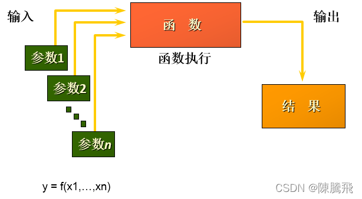

> 从函数定义的角度出发，我们可以将函数分成内置函数和自定义函数。在 SQL 语言中，同样也包括了内置函数和自定义函数。内置函数是系统内置的通用函数，而自定义函数是我们根据自己的需要编写的，本章及下一章讲解的是 SQL 的内置函数。

### 7.1.2 不同DBMS函数的差异

> 我们在使用 SQL 语言的时候，不是直接和这门语言打交道，而是通过它使用不同的数据库软件，即 DBMS。DBMS 之间的差异性很大，远大于同一个语言不同版本之间的差异。实际上，只有很少的函数是被 DBMS 同时支持的。比如，大多数 DBMS 使用（||）或者（+）来做拼接符，而在 MySQL 中的字符串拼接函数为concat()。大部分 DBMS 会有自己特定的函数，这就意味着采用 SQL 函数的代码可移植性是很差的，因此在使用函数的时候需要特别注意。

### 7.1.3 MySQL的内置函数及分类

> *   MySQL提供了丰富的内置函数，这些函数使得数据的维护与管理更加方便，能够更好地提供数据的分析与统计功能，在一定程度上提高了开发人员进行数据分析与统计的效率。
> *   MySQL提供的内置函数从实现的功能角度可以分为数值函数、字符串函数、日期和时间函数、流程控制函数、加密与解密函数、获取MySQL信息函数、聚合函数等。这里，我将这些丰富的内置函数再分为两类：单行函数、聚合函数（或分组函数）。

**两种SQL函数**  
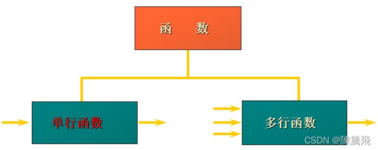  
**单行函数**

> *   操作数据对象
> *   接受参数返回一个结果
> *   只对一行进行变换
> *   每行返回一个结果
> *   可以嵌套
> *   参数可以是一列或一个值

7.2 数值函数
--------

### 7.2.1 基本函数

函数

用法

ABS(x)

返回x的绝对值

SIGN(X)

返回X的符号。正数返回1，负数返回-1，0返回0

PI()

返回圆周率的值

CEIL(x)，CEILING(x)

返回大于或等于某个值的最小整数

FLOOR(x)

返回小于或等于某个值的最大整数

LEAST(e1,e2,e3…)

返回列表中的最小值

GREATEST(e1,e2,e3…)

返回列表中的最大值

MOD(x,y)

返回X除以Y后的余数

RAND()

返回0~1的随机值

RAND(x)

返回0~1的随机值，其中x的值用作种子值，相同的X值会产生相同的随机数

ROUND(x)

返回一个对x的值进行四舍五入后，最接近于X的整数

ROUND(x,y)

返回一个对x的值进行四舍五入后最接近X的值，并保留到小数点后面Y位

TRUNCATE(x,y)

返回数字x截断为y位小数的结果

SQRT(x)

返回x的平方根。当X的值为负数时，返回NULL

**举例**

    SELECT ABS(-123),ABS(123),SIGN(-23),SIGN(23),PI(),CEIL(32.32),
    	   CEILING(-43.23),FLOOR(32.32),FLOOR(-43.23),MOD(12,5)
    FROM DUAL;


    SELECT RAND(),RAND(),RAND(10),RAND(10),RAND(-1),RAND(-1)
    FROM DUAL;


    SELECT ROUND(12.33),ROUND(12.343,2),ROUND(12.324,-1),TRUNCATE(12.66,1),TRUNCATE(12.66,-1)
    FROM DUAL;


### 7.2.2 角度与弧度互换函数

函数

用法

RADIANS(x)

将角度转化为弧度，其中，参数x为角度值

DEGREES(x)

将弧度转化为角度，其中，参数x为弧度值

    SELECT RADIANS(30),RADIANS(60),RADIANS(90),DEGREES(2*PI()),DEGREES(RADIANS(90))
    FROM DUAL;


### 7.2.3 三角函数

函数

用法

SIN(x)

返回x的正弦值，其中，参数x为弧度值

ASIN(x)

返回x的反正弦值，即获取正弦为x的值。如果x的值不在-1到1之间，则返回NULL

COS(x)

返回x的余弦值，其中，参数x为弧度值

ACOS(x)

返回x的反余弦值，即获取余弦为x的值。如果x的值不在-1到1之间，则返回NULL

TAN(x)

返回x的正切值，其中，参数x为弧度值

ATAN(x)

返回x的反正切值，即返回正切值为x的值

ATAN2(m,n)

返回两个参数的反正切值

COT(x)

返回x的余切值，其中，X为弧度值

**举例**

> ATAN2(M,N)函数返回两个参数的反正切值。  
> 与ATAN(X)函数相比，ATAN2(M,N)需要两个参数，例如有两个点point(x1,y1)和point(x2,y2)，使用ATAN(X)函数计算反正切值为ATAN((y2-y1)/(x2-x1))，使用ATAN2(M,N)计算反正切值则为ATAN2(y2-y1,x2-x1)。由使用方式可以看出，当x2-x1等于0时，ATAN(X)函数会报错，而ATAN2(M,N)函数则仍然可以计算。

ATAN2(M,N)函数的使用示例如下：

    SELECT SIN(RADIANS(30)),DEGREES(ASIN(1)),TAN(RADIANS(45)),DEGREES(ATAN(1)),DEGREES(ATAN2(1,1))
    FROM DUAL;


### 7.2.4 三角函数

函数

用法

POW(x,y)，

POWER(X,Y) 返回x的y次方

EXP(X)

返回e的X次方，其中e是一个常数，2.718281828459045

LN(X)，LOG(X)

返回以e为底的X的对数，当X <= 0 时，返回的结果为NULL

LOG10(X)

返回以10为底的X的对数，当X <= 0 时，返回的结果为NULL

LOG2(X)

返回以2为底的X的对数，当X <= 0 时，返回NULL

    SELECT POW(2,5),POWER(2,4),EXP(2),LN(10),LOG10(10),LOG2(4)
    FROM DUAL;


### 7.2.5 进制间的转换

函数

用法

BIN(x)

返回x的二进制编码

HEX(x)

返回x的十六进制编码

OCT(x)

返回x的八进制编码

CONV(x,f1,f2)

返回f1进制数变成f2进制数

    SELECT BIN(10),HEX(10),OCT(10),CONV(10,2,8)
    FROM DUAL;


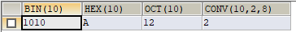

7.3 字符串函数
---------

函数

用法

ASCII(S)

返回字符串S中的第一个字符的ASCII码值

CHAR\_LENGTH(s)

返回字符串s的字符数。作用与CHARACTER\_LENGTH(s)相同

LENGTH(s)

返回字符串s的字节数，和字符集有关

CONCAT(s1,s2,…,sn)

连接s1,s2,…,sn为一个字符串

CONCAT\_WS(x, s1,s2,…,sn)

同CONCAT(s1,s2,…)函数，但是每个字符串之间要加上x

INSERT(str, idx, len, replacestr)

将字符串str从第idx位置开始，len个字符长的子串替换为字符串replacestr

REPLACE(str, a, b)

用字符串b替换字符串str中所有出现的字符串a

UPPER(s) 或 UCASE(s)

将字符串s的所有字母转成大写字母

LOWER(s) 或LCASE(s)

将字符串s的所有字母转成小写字母

LEFT(str,n)

返回字符串str最左边的n个字符

RIGHT(str,n)

返回字符串str最右边的n个字符

LPAD(str, len, pad)

用字符串pad对str最左边进行填充，直到str的长度为len个字符

RPAD(str ,len, pad)

用字符串pad对str最右边进行填充，直到str的长度为len个字符

LTRIM(s)

去掉字符串s左侧的空格

RTRIM(s)

去掉字符串s右侧的空格

TRIM(s)

去掉字符串s开始与结尾的空格

TRIM(s1 FROM s)

去掉字符串s开始与结尾的s1

TRIM(LEADING s1 FROM s)

去掉字符串s开始处的s1

TRIM(TRAILING s1 FROM s)

去掉字符串s结尾处的s1

REPEAT(str, n)

返回str重复n次的结果

SPACE(n)

返回n个空格

STRCMP(s1,s2)

比较字符串s1,s2的ASCII码值的大小

SUBSTR(s,index,len)

返回从字符串s的index位置其len个字符，作用与SUBSTRING(s,n,len)、MID(s,n,len)相同

LOCATE(substr,str)

返回字符串substr在字符串str中首次出现的位置，作用于POSITION(substr IN str)、INSTR(str,substr)相同。未找到，返回0

ELT(m,s1,s2,…,sn)

返回指定位置的字符串，如果m=1，则返回s1，如果m=2，则返回s2，如果m=n，则返回sn

FIELD(s,s1,s2,…,sn)

返回字符串s在字符串列表中第一次出现的位置

FIND\_IN\_SET(s1,s2)

返回字符串s1在字符串s2中出现的位置。其中，字符串s2是一个以逗号分隔的字符串

REVERSE(s)

返回s反转后的字符串

NULLIF(value1,value2)

比较两个字符串，如果value1与value2相等，则返回NULL，否则返回value1

> 注意：MySQL中，字符串的位置是从1开始的。

    SELECT FIELD('mm','hello','msm','amma'),FIND_IN_SET('mm','hello,mm,amma')
    FROM DUAL;


    SELECT NULLIF('mysql','mysql'),NULLIF('mysql', '');


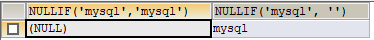

7.4 日期和时间函数
-----------

### 7.4.1 获取日期、时间

函数

用法

CURDATE() ，CURRENT\_DATE()

返回当前日期，只包含年、月、日

CURTIME() ， CURRENT\_TIME()

返回当前时间，只包含时、分、秒

NOW() / SYSDATE() / CURRENT\_TIMESTAMP() / LOCALTIME() / LOCALTIMESTAMP()

返回当前系统日期和时间

UTC\_DATE()

返回UTC（世界标准时间）日期

UTC\_TIME()

返回UTC（世界标准时间）时间

    SELECT CURDATE(),CURTIME(),NOW(),SYSDATE()+0,UTC_DATE(),UTC_DATE()+0,UTC_TIME(),UTC_TIME()+0
    FROM DUAL;


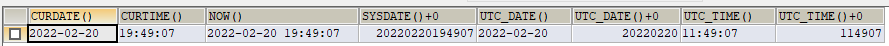

### 7.4.2 日期与时间戳的转换

函数

用法

UNIX\_TIMESTAMP()

以UNIX时间戳的形式返回当前时间。SELECT UNIX\_TIMESTAMP() ->1634348884

UNIX\_TIMESTAMP(date)

将时间date以UNIX时间戳的形式返回。

FROM\_UNIXTIME(timestamp)

将UNIX时间戳的时间转换为普通格式的时间

**举例**

    SELECT UNIX_TIMESTAMP(NOW());


    SELECT UNIX_TIMESTAMP(CURDATE());


    SELECT UNIX_TIMESTAMP('2011-11-11 11:11:11')


    SELECT FROM_UNIXTIME(1576380910);


### 7.4.3 获取月份、星期、星期数、天数等函数

函数

用法

YEAR(date) / MONTH(date) / DAY(date)

返回具体的日期值

HOUR(time) / MINUTE(time) / SECOND(time)

返回具体的时间值

MONTHNAME(date)

返回月份：January，…

DAYNAME(date)

返回星期几：MONDAY，TUESDAY…SUNDAY

WEEKDAY(date)

返回周几，注意，周1是0，周2是1，。。。周日是6

QUARTER(date)

返回日期对应的季度，范围为1～4

WEEK(date) ， WEEKOFYEAR(date)

返回一年中的第几周

DAYOFYEAR(date)

返回日期是一年中的第几天

DAYOFMONTH(date)

返回日期位于所在月份的第几天

DAYOFWEEK(date)

返回周几，注意：周日是1，周一是2，。。。周六是7

    SELECT YEAR(CURDATE()),MONTH(CURDATE()),DAY(CURDATE()),
    HOUR(CURTIME()),MINUTE(NOW()),SECOND(SYSDATE())
    FROM DUAL;


    SELECT MONTHNAME('2021-10-26'),DAYNAME('2021-10-26'),WEEKDAY('2021-10-26'),
    QUARTER(CURDATE()),WEEK(CURDATE()),DAYOFYEAR(NOW()),
    DAYOFMONTH(NOW()),DAYOFWEEK(NOW())
    FROM DUAL;


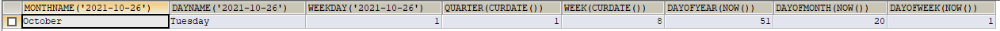

### 7.4.4 日期的操作函数

函数

用法

EXTRACT(type FROM date)

返回指定日期中特定的部分，type指定返回的值

**EXTRACT(type FROM date)函数中type的取值与含义：**

type取值

含义

–

–

MICROSECOND

返回毫秒值

SECOND

返回秒数

MINUTE

返回分钟数

HOUR

返回小时数

DAY

返回天数

WEEK

返回日期在一年中的第几个星期

MONTH

返回日期在一年中的第几个月

QUARTER

返回日期在一年中的第几个季度

YEAR

返回日期的年丰

SECOND\_MICROSECOND

返回秒和毫秒值

MINUTE\_MICROSECOND

返回分钟和毫秒值

MINUTE\_SECOND

返回分钟和秒值

HOUR\_MICROSECOND

返回小时和毫秒值

HOUR\_SECOND

返回小时和秒值

HOUR\_MINUTE

返回小时和分钟值

DAY\_MICROSECOND

返回天和毫秒值

DAY\_SECOND

返回天和秒值

DAY\_MINUTE

返回天和分钟值

DAY\_HOUR

返回天和小时

YEAR\_MONTH

返回年和月

    SELECT EXTRACT(MINUTE FROM NOW()),EXTRACT( WEEK FROM NOW()),
    EXTRACT( QUARTER FROM NOW()),EXTRACT( MINUTE_SECOND FROM NOW())
    FROM DUAL;


### 7.4.5 时间和秒钟转换的函数

函数

用法

TIME\_TO\_SEC(time)

将 time 转化为秒并返回结果值。转化的公式为：小时_3600+分钟_60+秒

SEC\_TO\_TIME(seconds)

将 seconds 描述转化为包含小时、分钟和秒的时间

    SELECT TIME_TO_SEC(NOW());


    SELECT SEC_TO_TIME(71507);


### 7.4.6 计算日期和时间的函数

第一组:

函数

用法

DATE\_ADD(datetime, INTERVAL expr type)，ADDDATE(date,INTERVAL expr type)

返回与给定日期时间相差INTERVAL时间段的日期时间

DATE\_SUB(date,INTERVAL expr type)，SUBDATE(date,INTERVAL expr type)

返回与date相差INTERVAL时间间隔的日期

上述函数中type的取值:

间隔类型

含义

HOUR

小时

MINUTE

分钟

SECOND

秒

YEAR

年

MONTH

月

DAY

日

YEAR\_MONTH

年和月

DAY\_HOUR

日和小时

DAY\_MINUTE

日和分钟

DAY\_SECOND

日和秒

HOUR\_MINUTE

小时和分钟

HOUR\_SECOND

小时和秒

MINUTE\_SECOND

分钟和秒

    SELECT DATE_ADD(NOW(), INTERVAL 1 DAY) AS col1,DATE_ADD('2022-2-26 20:02:02',INTERVAL 1 SECOND) AS col2,
           ADDDATE('2022-2-26 20:02:02',INTERVAL 1 SECOND) AS col3,
           DATE_ADD('2022-2-26 20:02:02',INTERVAL '1_1' MINUTE_SECOND) AS col4,
           DATE_ADD(NOW(), INTERVAL -1 YEAR) AS col5, #可以是负数
           DATE_ADD(NOW(), INTERVAL '1_1' YEAR_MONTH) AS col6 #需要单引号
    FROM DUAL;


    SELECT DATE_SUB('2022-2-26',INTERVAL 31 DAY) AS col1,
           SUBDATE('2022-2-26',INTERVAL 31 DAY) AS col2,
           DATE_SUB('2022-2-26 20:04:02',INTERVAL '1 1' DAY_HOUR) AS col3
    FROM DUAL;


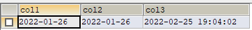  
第二组:

函数

用法

ADDTIME(time1,time2)

返回time1加上time2的时间。当time2为一个数字时，代表的是`秒`，可以为负数

SUBTIME(time1,time2)

返回time1减去time2后的时间。当time2为一个数字时，代表的是`秒`，可以为负数

DATEDIFF(date1,date2)

返回date1 - date2的日期间隔天数

TIMEDIFF(time1, time2)

返回time1 - time2的时间间隔

FROM\_DAYS(N)

返回从0000年1月1日起，N天以后的日期

TO\_DAYS(date)

返回日期date距离0000年1月1日的天数

LAST\_DAY(date)

返回date所在月份的最后一天的日期

MAKEDATE(year,n)

针对给定年份与所在年份中的天数返回一个日期

MAKETIME(hour,minute,second)

将给定的小时、分钟和秒组合成时间并返回

PERIOD\_ADD(time,n)

返回time加上n后的时间

    SELECT ADDTIME(NOW(),20),SUBTIME(NOW(),30),SUBTIME(NOW(),'1:1:3'),DATEDIFF(NOW(),'2022-2-26'),
           TIMEDIFF(NOW(),'2022-2-26 20:06:52'),FROM_DAYS(366),TO_DAYS('0000-12-25'),
           LAST_DAY(NOW()),MAKEDATE(YEAR(NOW()),12),MAKETIME(10,21,23),PERIOD_ADD(20200101010101,10)
    FROM DUAL;


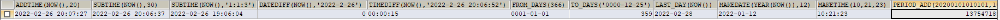

    SELECT ADDTIME(NOW(),50); #当期时间加50秒


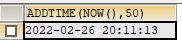

    SELECT ADDTIME(NOW(),'1:1:1'); #当前时间加1小时1分钟1秒


    SELECT SUBTIME(NOW(),'1:1:1'); #当前时间减1小时1分钟1秒


    SELECT SUBTIME(NOW(), '-1:-1:-1'); 


    SELECT FROM_DAYS(366);


    SELECT MAKEDATE(2022,1);


    SELECT MAKETIME(1,1,1);


    SELECT PERIOD_ADD(20200101010101,1);


    SELECT TO_DAYS(NOW());


    #查询 7 天内的新增用户数有多少？
    SELECT COUNT(*) AS num FROM new_user WHERE TO_DAYS(NOW())-TO_DAYS(regist_time)<=7


### 7.4.7 日期的格式化与解析

函数

用法

DATE\_FORMAT(date,fmt)

按照字符串fmt格式化日期date值

TIME\_FORMAT(time,fmt)

按照字符串fmt格式化时间time值

GET\_FORMAT(date\_type,format\_type)

返回日期字符串的显示格式

STR\_TO\_DATE(str, fmt)

按照字符串fmt对str进行解析，解析为一个日期

上述非GET\_FORMAT函数中fmt参数常用的格式符：

格式符

说明

格式符

说明

%Y

4位数字表示年份

%y

表示两位数字表示年份

%M

月名表示月份（January,…）

%m

两位数字表示月份（01,02,03。。。）

%b

缩写的月名（Jan.，Feb.，…）

%c

数字表示月份（1,2,3,…）

%D

英文后缀表示月中的天数（1st,2nd,3rd,…）

%d

两位数字表示月中的天数(01,02…)

%e

数字形式表示月中的天数（1,2,3,4,5…）

%H

两位数字表示小数，24小时制（01,02…）

%h和%I

两位数字表示小时，12小时制（01,02…）

%k

数字形式的小时，24小时制(1,2,3)

%l

数字形式表示小时，12小时制（1,2,3,4…）

%i

两位数字表示分钟（00,01,02）

%S和%s

两位数字表示秒(00,01,02…)

%W

一周中的星期名称（Sunday…）

%a

一周中的星期缩写（Sun.，Mon.,Tues.，…）

%w

以数字表示周中的天数(0=Sunday,1=Monday…)

%j

以3位数字表示年中的天数(001,002…)

%U

以数字表示年中的第几周，（1,2,3。。）其中Sunday为周中第一天

%u

以数字表示年中的第几周，（1,2,3。。）其中Monday为周中第一天

%T

24小时制

%r

12小时制

%p

AM或PM

%%

表示%

GET\_FORMAT函数中date\_type和format\_type参数取值如下：

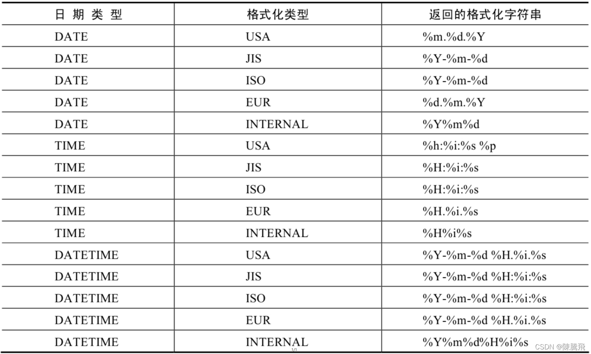

    SELECT DATE_FORMAT(NOW(), '%H:%i:%s');


    SELECT STR_TO_DATE('09/01/2009','%m/%d/%Y')
    FROM DUAL;


    SELECT STR_TO_DATE('20140422154706','%Y%m%d%H%i%s')
    FROM DUAL;


    SELECT STR_TO_DATE('2014-04-22 15:47:06','%Y-%m-%d %H:%i:%s')
    FROM DUAL;


    SELECT GET_FORMAT(DATE, 'USA');


    SELECT DATE_FORMAT(NOW(),GET_FORMAT(DATE,'USA')) FROM DUAL;


    SELECT STR_TO_DATE('2020-01-01 00:00:00','%Y-%m-%d');


7.5 流程控制函数
----------

> 流程处理函数可以根据不同的条件，执行不同的处理流程，可以在SQL语句中实现不同的条件选择。MySQL中的流程处理函数主要包括IF()、IFNULL()和CASE()函数。

函数

用法

IF(value,value1,value2)

如果value的值为TRUE，返回value1，否则返回value2

IFNULL(value1, value2)

如果value1不为NULL，返回value1，否则返回value2

CASE WHEN 条件1 THEN 结果1 WHEN 条件2 THEN 结果2 … \[ELSE resultn\] END

相当于Java的if…else if…else…

CASE expr WHEN 常量值1 THEN 值1 WHEN 常量值1 THEN 值1 … \[ELSE 值n\] END

相当于Java的switch…case…

    SELECT IF(1>0,'正确','错误')


    SELECT IFNULL(NULL,'Hello Word');


    SELECT CASE WHEN 1 > 0 THEN '1>0'
                WHEN 2 > 0 THEN '2>0'
           ELSE '3 > 0'
           END;


    SELECT employee_id,salary, CASE WHEN salary>=15000 THEN '高薪' 
    				  WHEN salary>=10000 THEN '潜力股'  
    				  WHEN salary>=8000 THEN '屌丝' 
    				  ELSE '草根' END  "描述"
    FROM employees; 
    SELECT oid,`status`, CASE `status` WHEN 1 THEN '未付款' 
    								   WHEN 2 THEN '已付款' 
    								   WHEN 3 THEN '已发货'  
    								   WHEN 4 THEN '确认收货'  
    								   ELSE '无效订单' END 
    FROM t_order;


7.6 流程控制函数
----------

> 加密与解密函数主要用于对数据库中的数据进行加密和解密处理，以防止数据被他人窃取。这些函数在保证数据库安全时非常有用。

函数

用法

PASSWORD(str)

返回字符串str的加密版本，41位长的字符串。加密结果不可逆，常用于用户的密码加密

MD5(str)

返回字符串str的md5加密后的值，也是一种加密方式。若参数为NULL，则会返回NULL

SHA(str)

从原明文密码str计算并返回加密后的密码字符串，当参数为NULL时，返回NULL。SHA加密算法比MD5更加安全。

ENCODE(value,password\_seed)

返回使用password\_seed作为加密密码加密value

DECODE(value,password\_seed)

返回使用password\_seed作为加密密码解密value

> 可以看到，ENCODE(value,password\_seed)函数与DECODE(value,password\_seed)函数互为反函数。

    mysql> SELECT PASSWORD('mysql'), PASSWORD(NULL);
    +-------------------------------------------+----------------+
    | PASSWORD('mysql')                         | PASSWORD(NULL) |
    +-------------------------------------------+----------------+
    | *E74858DB86EBA20BC33D0AECAE8A8108C56B17FA |                |
    +-------------------------------------------+----------------+
    1 row in set, 1 warning (0.00 sec)


    SELECT md5('123')
    ->202cb962ac59075b964b07152d234b70


    SELECT SHA('Tom123')
    ->c7c506980abc31cc390a2438c90861d0f1216d50


    mysql> SELECT ENCODE('mysql', 'mysql');
    +--------------------------+
    | ENCODE('mysql', 'mysql') |
    +--------------------------+
    | íg　¼　ìÉ                  |
    +--------------------------+
    1 row in set, 1 warning (0.01 sec)


    mysql> SELECT DECODE(ENCODE('mysql','mysql'),'mysql');
    +-----------------------------------------+
    | DECODE(ENCODE('mysql','mysql'),'mysql') |
    +-----------------------------------------+
    | mysql                                   |
    +-----------------------------------------+
    1 row in set, 2 warnings (0.00 sec)


7.7 MySQL信息函数
-------------

> MySQL中内置了一些可以查询MySQL信息的函数，这些函数主要用于帮助数据库开发或运维人员更好地对数据库进行维护工作。

函数

用法

VERSION()

返回当前MySQL的版本号

CONNECTION\_ID()

返回当前MySQL服务器的连接数

DATABASE()，SCHEMA()

返回MySQL命令行当前所在的数据库

USER()，CURRENT\_USER()、SYSTEM\_USER()，SESSION\_USER()

返回当前连接MySQL的用户名，返回结果格式为“主机名@用户名”

CHARSET(value)

返回字符串value自变量的字符集

COLLATION(value)

返回字符串value的比较规则

     SELECT DATABASE();


    SELECT USER(), CURRENT_USER(), SYSTEM_USER(),SESSION_USER();


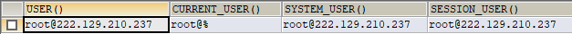

    SELECT CHARSET('ABC');


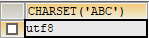

    SELECT COLLATION('ABC');


7.8 其他函数
--------

> MySQL中有些函数无法对其进行具体的分类，但是这些函数在MySQL的开发和运维过程中也是不容忽视的。

函数

用法

FORMAT(value,n)

返回对数字value进行格式化后的结果数据。n表示四舍五入后保留到小数点后n位

CONV(value,from,to)

将value的值进行不同进制之间的转换

INET\_ATON(ipvalue)

将以点分隔的IP地址转化为一个数字

INET\_NTOA(value)

将数字形式的IP地址转化为以点分隔的IP地址

BENCHMARK(n,expr)

将表达式expr重复执行n次。用于测试MySQL处理expr表达式所耗费的时间

CONVERT(value USING char\_code)

将value所使用的字符编码修改为char\_code

    # 如果n的值小于或者等于0，则只保留整数部分
    SELECT FORMAT(123.123, 2), FORMAT(123.523, 0), FORMAT(123.123, -2);


    SELECT CONV(16, 10, 2), CONV(8888,10,16), CONV(NULL, 10, 2);


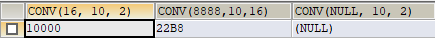

    SELECT INET_ATON('192.168.1.100');
    # 以“192.168.1.100”为例，计算方式为192乘以256的3次方，加上168乘以256的2次方，加上1乘以256，再加上100。


    SELECT INET_NTOA(3232235876);


    SELECT BENCHMARK(1, MD5('mysql'));


    SELECT BENCHMARK(1000000, MD5('mysql')); 


    SELECT CHARSET('mysql'), CHARSET(CONVERT('mysql' USING 'utf8'));


## 7.9. 练习sql

```sql
#第07章_单行函数

#1.数值函数
#基本的操作
SELECT ABS(-123),ABS(32),SIGN(-23),SIGN(43),PI(),CEIL(32.32),CEILING(-43.23),FLOOR(32.32),
FLOOR(-43.23),MOD(12,5),12 MOD 5,12 % 5
FROM DUAL;

#取随机数
SELECT RAND(),RAND(),RAND(10),RAND(10),RAND(-1),RAND(-1)
FROM DUAL;

#四舍五入，截断操作
SELECT ROUND(123.556),ROUND(123.456,0),ROUND(123.456,1),ROUND(123.456,2),
ROUND(123.456,-1),ROUND(153.456,-2)
FROM DUAL;

SELECT TRUNCATE(123.456,0),TRUNCATE(123.496,1),TRUNCATE(129.45,-1)
FROM DUAL;

#单行函数可以嵌套
SELECT TRUNCATE(ROUND(123.456,2),0)
FROM DUAL;

#角度与弧度的互换

SELECT RADIANS(30),RADIANS(45),RADIANS(60),RADIANS(90),
DEGREES(2*PI()),DEGREES(RADIANS(60))
FROM DUAL;


#三角函数
SELECT SIN(RADIANS(30)),DEGREES(ASIN(1)),TAN(RADIANS(45)),DEGREES(ATAN(1))
FROM DUAL;

#指数和对数
SELECT POW(2,5),POWER(2,4),EXP(2)
FROM DUAL;

SELECT LN(EXP(2)),LOG(EXP(2)),LOG10(10),LOG2(4)
FROM DUAL;

#进制间的转换
SELECT BIN(10),HEX(10),OCT(10),CONV(10,10,8)
FROM DUAL;


#2. 字符串函数

SELECT ASCII('Abcdfsf'),CHAR_LENGTH('hello'),CHAR_LENGTH('我们'),
LENGTH('hello'),LENGTH('我们')
FROM DUAL;

# xxx worked for yyy
SELECT CONCAT(emp.last_name,' worked for ',mgr.last_name) "details"
FROM employees emp JOIN employees mgr
WHERE emp.`manager_id` = mgr.employee_id;

SELECT CONCAT_WS('-','hello','world','hello','beijing')
FROM DUAL;
#字符串的索引是从1开始的！
SELECT INSERT('helloworld',2,3,'aaaaa'),REPLACE('hello','lol','mmm')
FROM DUAL;

SELECT UPPER('HelLo'),LOWER('HelLo')
FROM DUAL;

SELECT last_name,salary
FROM employees
WHERE LOWER(last_name) = 'King';

SELECT LEFT('hello',2),RIGHT('hello',3),RIGHT('hello',13)
FROM DUAL;

# LPAD:实现右对齐效果
# RPAD:实现左对齐效果
SELECT employee_id,last_name,LPAD(salary,10,' ')
FROM employees;

SELECT CONCAT('---',LTRIM('    h  el  lo   '),'***'),
TRIM('oo' FROM 'ooheollo')
FROM DUAL;

SELECT REPEAT('hello',4),LENGTH(SPACE(5)),STRCMP('abc','abe')
FROM DUAL;


SELECT SUBSTR('hello',2,2),LOCATE('lll','hello')
FROM DUAL;

SELECT ELT(2,'a','b','c','d'),FIELD('mm','gg','jj','mm','dd','mm'),
FIND_IN_SET('mm','gg,mm,jj,dd,mm,gg')
FROM DUAL;

SELECT employee_id,NULLIF(LENGTH(first_name),LENGTH(last_name)) "compare"
FROM employees;

#3. 日期和时间函数

#3.1  获取日期、时间
SELECT CURDATE(),CURRENT_DATE(),CURTIME(),NOW(),SYSDATE(),
UTC_DATE(),UTC_TIME()
FROM DUAL;

SELECT CURDATE(),CURDATE() + 0,CURTIME() + 0,NOW() + 0
FROM DUAL;

#3.2 日期与时间戳的转换
SELECT UNIX_TIMESTAMP(),UNIX_TIMESTAMP('2021-10-01 12:12:32'),
FROM_UNIXTIME(1635173853),FROM_UNIXTIME(1633061552)
FROM DUAL;

#3.3 获取月份、星期、星期数、天数等函数
SELECT YEAR(CURDATE()),MONTH(CURDATE()),DAY(CURDATE()),
HOUR(CURTIME()),MINUTE(NOW()),SECOND(SYSDATE())
FROM DUAL;


SELECT MONTHNAME('2021-10-26'),DAYNAME('2021-10-26'),WEEKDAY('2021-10-26'),
QUARTER(CURDATE()),WEEK(CURDATE()),DAYOFYEAR(NOW()),
DAYOFMONTH(NOW()),DAYOFWEEK(NOW())
FROM DUAL;

#3.4 日期的操作函数

SELECT EXTRACT(SECOND FROM NOW()),EXTRACT(DAY FROM NOW()),
EXTRACT(HOUR_MINUTE FROM NOW()),EXTRACT(QUARTER FROM '2021-05-12')
FROM DUAL;

#3.5 时间和秒钟转换的函数
SELECT TIME_TO_SEC(CURTIME()),
SEC_TO_TIME(83355)
FROM DUAL;

#3.6 计算日期和时间的函数

SELECT NOW(),DATE_ADD(NOW(),INTERVAL 1 YEAR),
DATE_ADD(NOW(),INTERVAL -1 YEAR),
DATE_SUB(NOW(),INTERVAL 1 YEAR)
FROM DUAL;


SELECT DATE_ADD(NOW(), INTERVAL 1 DAY) AS col1,DATE_ADD('2021-10-21 23:32:12',INTERVAL 1 SECOND) AS col2,
ADDDATE('2021-10-21 23:32:12',INTERVAL 1 SECOND) AS col3,
DATE_ADD('2021-10-21 23:32:12',INTERVAL '1_1' MINUTE_SECOND) AS col4,
DATE_ADD(NOW(), INTERVAL -1 YEAR) AS col5, #可以是负数
DATE_ADD(NOW(), INTERVAL '1_1' YEAR_MONTH) AS col6 #需要单引号
FROM DUAL;


SELECT ADDTIME(NOW(),20),SUBTIME(NOW(),30),SUBTIME(NOW(),'1:1:3'),DATEDIFF(NOW(),'2021-10-01'),
TIMEDIFF(NOW(),'2021-10-25 22:10:10'),FROM_DAYS(366),TO_DAYS('0000-12-25'),
LAST_DAY(NOW()),MAKEDATE(YEAR(NOW()),32),MAKETIME(10,21,23),PERIOD_ADD(20200101010101,10)
FROM DUAL;

#3.7 日期的格式化与解析
# 格式化：日期 ---> 字符串
# 解析：  字符串 ----> 日期

#此时我们谈的是日期的显式格式化和解析

#之前，我们接触过隐式的格式化或解析
SELECT *
FROM employees
WHERE hire_date = '1993-01-13';

#格式化：
SELECT DATE_FORMAT(CURDATE(),'%Y-%M-%D'),
DATE_FORMAT(NOW(),'%Y-%m-%d'),TIME_FORMAT(CURTIME(),'%h:%i:%S'),
DATE_FORMAT(NOW(),'%Y-%M-%D %h:%i:%S %W %w %T %r')
FROM DUAL;

#解析：格式化的逆过程
SELECT STR_TO_DATE('2021-October-25th 11:37:30 Monday 1','%Y-%M-%D %h:%i:%S %W %w')
FROM DUAL;

SELECT GET_FORMAT(DATE,'USA')
FROM DUAL;

SELECT DATE_FORMAT(CURDATE(),GET_FORMAT(DATE,'USA'))
FROM DUAL;

#4.流程控制函数
#4.1 IF(VALUE,VALUE1,VALUE2)

SELECT last_name,salary,IF(salary >= 6000,'高工资','低工资') "details"
FROM employees;

SELECT last_name,commission_pct,IF(commission_pct IS NOT NULL,commission_pct,0) "details",
salary * 12 * (1 + IF(commission_pct IS NOT NULL,commission_pct,0)) "annual_sal"
FROM employees;

#4.2 IFNULL(VALUE1,VALUE2):看做是IF(VALUE,VALUE1,VALUE2)的特殊情况
SELECT last_name,commission_pct,IFNULL(commission_pct,0) "details"
FROM employees;

#4.3 CASE WHEN ... THEN ...WHEN ... THEN ... ELSE ... END
# 类似于java的if ... else if ... else if ... else
SELECT last_name,salary,CASE WHEN salary >= 15000 THEN '白骨精' 
			     WHEN salary >= 10000 THEN '潜力股'
			     WHEN salary >= 8000 THEN '小屌丝'
			     ELSE '草根' END "details",department_id
FROM employees;

SELECT last_name,salary,CASE WHEN salary >= 15000 THEN '白骨精' 
			     WHEN salary >= 10000 THEN '潜力股'
			     WHEN salary >= 8000 THEN '小屌丝'
			     END "details"
FROM employees;

#4.4 CASE ... WHEN ... THEN ... WHEN ... THEN ... ELSE ... END
# 类似于java的swich ... case...
/*

练习1
查询部门号为 10,20, 30 的员工信息, 
若部门号为 10, 则打印其工资的 1.1 倍, 
20 号部门, 则打印其工资的 1.2 倍, 
30 号部门,打印其工资的 1.3 倍数,
其他部门,打印其工资的 1.4 倍数

*/
SELECT employee_id,last_name,department_id,salary,CASE department_id WHEN 10 THEN salary * 1.1
								     WHEN 20 THEN salary * 1.2
								     WHEN 30 THEN salary * 1.3
								     ELSE salary * 1.4 END "details"
FROM employees;

/*

练习2
查询部门号为 10,20, 30 的员工信息, 
若部门号为 10, 则打印其工资的 1.1 倍, 
20 号部门, 则打印其工资的 1.2 倍, 
30 号部门打印其工资的 1.3 倍数

*/
SELECT employee_id,last_name,department_id,salary,CASE department_id WHEN 10 THEN salary * 1.1
								     WHEN 20 THEN salary * 1.2
								     WHEN 30 THEN salary * 1.3
								     END "details"
FROM employees
WHERE department_id IN (10,20,30);

#5. 加密与解密的函数
# PASSWORD()在mysql8.0中弃用。
SELECT MD5('mysql'),SHA('mysql'),MD5(MD5('mysql'))
FROM DUAL;

#ENCODE()\DECODE() 在mysql8.0中弃用。
/*
SELECT ENCODE('atguigu','mysql'),DECODE(ENCODE('atguigu','mysql'),'mysql')
FROM DUAL;
*/

#6. MySQL信息函数

SELECT VERSION(),CONNECTION_ID(),DATABASE(),SCHEMA(),
USER(),CURRENT_USER(),CHARSET('尚硅谷'),COLLATION('尚硅谷')
FROM DUAL;

#7. 其他函数
#如果n的值小于或者等于0，则只保留整数部分
SELECT FORMAT(123.125,2),FORMAT(123.125,0),FORMAT(123.125,-2)
FROM DUAL;

SELECT CONV(16, 10, 2), CONV(8888,10,16), CONV(NULL, 10, 2)
FROM DUAL;
#以“192.168.1.100”为例，计算方式为192乘以256的3次方，加上168乘以256的2次方，加上1乘以256，再加上100。
SELECT INET_ATON('192.168.1.100'),INET_NTOA(3232235876)
FROM DUAL;

#BENCHMARK()用于测试表达式的执行效率
SELECT BENCHMARK(100000,MD5('mysql'))
FROM DUAL;
# CONVERT():可以实现字符集的转换
SELECT CHARSET('atguigu'),CHARSET(CONVERT('atguigu' USING 'gbk'))
FROM DUAL;


```

```sql
#第07章_单行函数的课后练习


# 1.显示系统时间(注：日期+时间)
SELECT NOW(),SYSDATE(),CURRENT_TIMESTAMP(),LOCALTIME(),LOCALTIMESTAMP() #大家只需要掌握一个函数就可以了
FROM DUAL;

# 2.查询员工号，姓名，工资，以及工资提高百分之20%后的结果（new salary）
SELECT employee_id,last_name,salary,salary * 1.2 "new salary"
FROM employees;


# 3.将员工的姓名按首字母排序，并写出姓名的长度（length）
SELECT last_name,LENGTH(last_name) "name_length"
FROM employees
#order by last_name asc;
ORDER BY name_length ASC;


# 4.查询员工id,last_name,salary，并作为一个列输出，别名为OUT_PUT

SELECT CONCAT(employee_id,',',last_name,',',salary) "OUT_PUT"
FROM employees;


# 5.查询公司各员工工作的年数、工作的天数，并按工作年数的降序排序

SELECT employee_id,DATEDIFF(CURDATE(),hire_date)/365 "worked_years",DATEDIFF(CURDATE(),hire_date) "worked_days",
TO_DAYS(CURDATE()) - TO_DAYS(hire_date) "worked_days1"
FROM employees
ORDER BY worked_years DESC;

# 6.查询员工姓名，hire_date , department_id，满足以下条件：
#雇用时间在1997年之后，department_id 为80 或 90 或110, commission_pct不为空
SELECT last_name,hire_date,department_id
FROM employees
WHERE department_id IN (80,90,110)
AND commission_pct IS NOT NULL
#and hire_date >= '1997-01-01';  #存在着隐式转换
#and  date_format(hire_date,'%Y-%m-%d') >= '1997-01-01';  # 显式转换操作，格式化：日期---> 字符串
#and  date_format(hire_date,'%Y') >= '1997';   # 显式转换操作，格式化
AND hire_date >= STR_TO_DATE('1997-01-01','%Y-%m-%d');# 显式转换操作，解析：字符串 ----> 日期

# 7.查询公司中入职超过10000天的员工姓名、入职时间
SELECT last_name,hire_date
FROM employees
WHERE DATEDIFF(CURDATE(),hire_date) >= 10000;


# 8.做一个查询，产生下面的结果
#<last_name> earns <salary> monthly but wants <salary*3> 

SELECT CONCAT(last_name,' earns ',TRUNCATE(salary,0), ' monthly but wants ',TRUNCATE(salary * 3,0)) "Dream Salary"
FROM employees;


# 9.使用case-when，按照下面的条件：
/*job                  grade
AD_PRES              	A
ST_MAN               	B
IT_PROG              	C
SA_REP               	D
ST_CLERK             	E

产生下面的结果:
*/

SELECT last_name "Last_name",job_id "Job_id",CASE job_id WHEN 'AD_PRES' THEN 'A'
							 WHEN 'ST_MAN' THEN 'B'
							 WHEN 'IT_PROG' THEN 'C'
							 WHEN 'SA_REP' THEN 'D'
							 WHEN 'ST_CLERK' THEN 'E'
							 END "Grade"
FROM employees;


SELECT last_name "Last_name",job_id "Job_id",CASE job_id WHEN 'AD_PRES' THEN 'A'
							 WHEN 'ST_MAN' THEN 'B'
							 WHEN 'IT_PROG' THEN 'C'
							 WHEN 'SA_REP' THEN 'D'
							 WHEN 'ST_CLERK' THEN 'E'
							 ELSE "undefined" END "Grade"
FROM employees;


```


第8章 聚合函数
========

> 我们上一章讲到了 SQL 单行函数。实际上 SQL 函数还有一类，叫做聚合（或聚集、分组）函数，它是对一组数据进行汇总的函数，输入的是一组数据的集合，输出的是单个值。

8.1 聚合函数介绍
----------

**什么是聚合函数**

> 聚合函数作用于一组数据，并对一组数据返回一个值。

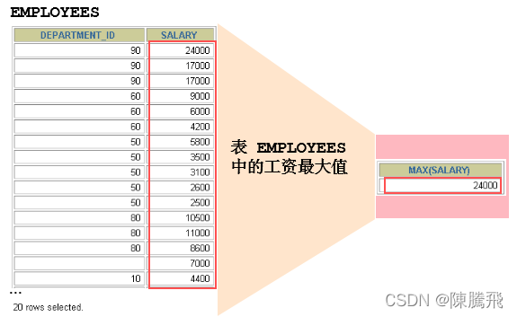

> 聚合函数类型
>
> *   AVG()
> *   SUM()
> *   MAX()
> *   MIN()
> *   COUNT()

**聚合函数语法**  
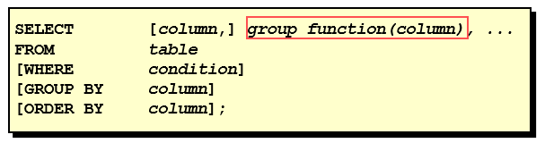

> 聚合函数不能嵌套调用。比如不能出现类似“AVG(SUM(字段名称))”形式的调用

### 8.1.1 AVG和SUM函数

> 可以对数值型数据使用AVG 和 SUM 函数。

    SELECT AVG(salary), MAX(salary),MIN(salary), SUM(salary)
    FROM   employees
    WHERE  job_id LIKE '%REP%';


### 8.1.2 MIN和MAX函数

> 可以对任意数据类型的数据使用 MIN 和 MAX 函数。

    SELECT MIN(hire_date), MAX(hire_date)
    FROM	  employees;


### 8.1.3 COUNT函数

> COUNT(\*)返回表中记录总数，适用于任意数据类型。

    SELECT COUNT(*)
    FROM	  employees
    WHERE  department_id = 50;


> COUNT(expr) 返回expr不为空的记录总数。

    SELECT COUNT(commission_pct)
    FROM   employees
    WHERE  department_id = 50;


> 问题：用count(\*)，count(1)，count(列名)谁好呢?
>
> *   其实，对于MyISAM引擎的表是没有区别的。这种引擎内部有一计数器在维护着行数。
> *   Innodb引擎的表用count(\*),count(1)直接读行数，复杂度是O(n)，因为innodb真的要去数一遍。但好于具体的count(列名)。

> 问题：能不能使用count(列名)替换count(\*)?
>
> *   不要使用 count(列名)来替代 count(_)，count(_)是 SQL92 定义的标准统计行数的语法，跟数据库无关，跟 NULL 和非 NULL 无关。
> *   说明：count(\*)会统计值为 NULL 的行，而 count(列名)不会统计此列为 NULL 值的行。

8.2 GROUP BY
------------

### 8.2.1 基本使用

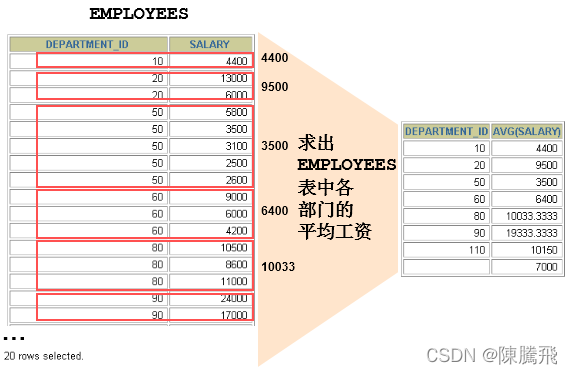  
**可以使用GROUP BY子句将表中的数据分成若干组**

    SELECT column, group_function(column)
    FROM table
    [WHERE	condition]
    [GROUP BY	group_by_expression]
    [ORDER BY	column];


**在SELECT列表中所有未包含在组函数中的列都应该包含在 GROUP BY子句中**

    SELECT   department_id, AVG(salary)
    FROM     employees
    GROUP BY department_id ;


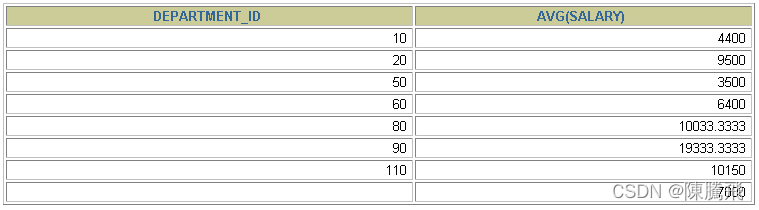  
包含在 GROUP BY 子句中的列不必包含在SELECT 列表中

    SELECT   AVG(salary)
    FROM     employees
    GROUP BY department_id ;


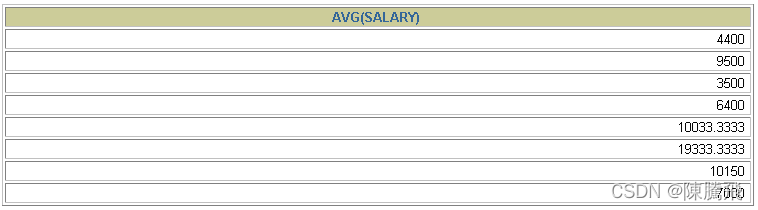

### 8.2.2 使用多个列分组

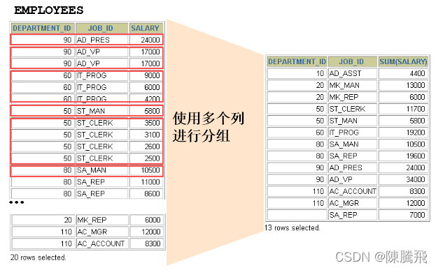

    SELECT   department_id dept_id, job_id, SUM(salary)
    FROM     employees
    GROUP BY department_id, job_id ;


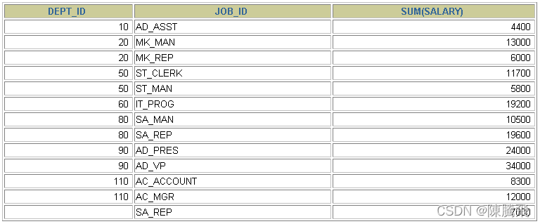

### 8.2.3 GROUP BY中使用WITH ROLLUP

> 使用`WITH ROLLUP`关键字之后，在所有查询出的分组记录之后增加一条记录，该记录计算查询出的所有记录的总和，即统计记录数量。

    SELECT department_id,AVG(salary)
    FROM employees
    WHERE department_id > 80
    GROUP BY department_id WITH ROLLUP;


> 注意：`当使用ROLLUP时，不能同时使用ORDER BY子句进行结果排序，即ROLLUP和ORDER BY是互相排斥的。`

8.3 HAVING
----------

### 8.3.1 基本使用

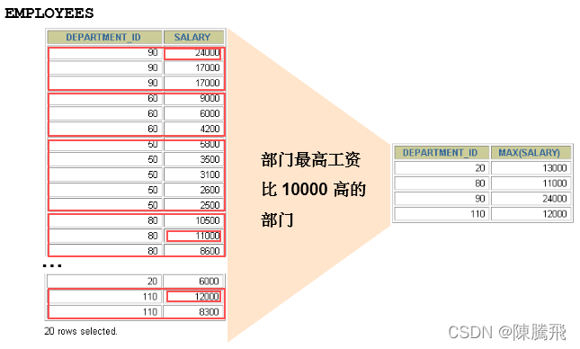

> **过滤分组：HAVING子句**
>
> *   行已经被分组。
> *   使用了聚合函数。
> *   满足HAVING 子句中条件的分组将被显示。
> *   HAVING 不能单独使用，必须要跟 GROUP BY 一起使用。


    SELECT   department_id, MAX(salary)
    FROM     employees
    GROUP BY department_id
    HAVING   MAX(salary)>10000 ;


  
\*\*非法使用聚合函数 ： 不能在 WHERE 子句中使用聚合函数。\*\*如下：

    SELECT   department_id, AVG(salary)
    FROM     employees
    WHERE    AVG(salary) > 8000
    GROUP BY department_id;


### 8.3.2 WHERE和HAVING的对比

> **区别1：WHERE 可以直接使用表中的字段作为筛选条件，但不能使用分组中的计算函数作为筛选条件；HAVING 必须要与 GROUP BY 配合使用，可以把分组计算的函数和分组字段作为筛选条件。**

> 这决定了，在需要对数据进行分组统计的时候，HAVING 可以完成 WHERE 不能完成的任务。这是因为，在查询语法结构中，WHERE 在 GROUP BY 之前，所以无法对分组结果进行筛选。HAVING 在 GROUP BY 之后，可以使用分组字段和分组中的计算函数，对分组的结果集进行筛选，这个功能是 WHERE 无法完成的。另外，WHERE排除的记录不再包括在分组中。

> **区别2：如果需要通过连接从关联表中获取需要的数据，WHERE 是先筛选后连接，而 HAVING 是先连接后筛选。** 这一点，就决定了在关联查询中，WHERE 比 HAVING 更高效。因为 WHERE 可以先筛选，用一个筛选后的较小数据集和关联表进行连接，这样占用的资源比较少，执行效率也比较高。HAVING 则需要先把结果集准备好，也就是用未被筛选的数据集进行关联，然后对这个大的数据集进行筛选，这样占用的资源就比较多，执行效率也较低。

小结如下：

优点

缺点

WHERE

先筛选数据再关联，执行效率高 不能使用分组中的计算函数进行筛选

HAVING

可以使用分组中的计算函数 在最后的结果集中进行筛选，执行效率较低

**开发中的选择：**

> WHERE 和 HAVING 也不是互相排斥的，我们可以在一个查询里面同时使用 WHERE 和 HAVING。包含分组统计函数的条件用 HAVING，普通条件用 WHERE。这样，我们就既利用了 WHERE 条件的高效快速，又发挥了 HAVING 可以使用包含分组统计函数的查询条件的优点。当数据量特别大的时候，运行效率会有很大的差别。

8.4 SELECT的执行过程
---------------

### 8.4.1 查询的结构

    #方式1：
    SELECT ...,....,...
    FROM ...,...,....
    WHERE 多表的连接条件
    AND 不包含组函数的过滤条件
    GROUP BY ...,...
    HAVING 包含组函数的过滤条件
    ORDER BY ... ASC/DESC
    LIMIT ...,...
    
    #方式2：
    SELECT ...,....,...
    FROM ... JOIN ... 
    ON 多表的连接条件
    JOIN ...
    ON ...
    WHERE 不包含组函数的过滤条件
    AND/OR 不包含组函数的过滤条件
    GROUP BY ...,...
    HAVING 包含组函数的过滤条件
    ORDER BY ... ASC/DESC
    LIMIT ...,...
    
    #其中：
    #（1）from：从哪些表中筛选
    #（2）on：关联多表查询时，去除笛卡尔积
    #（3）where：从表中筛选的条件
    #（4）group by：分组依据
    #（5）having：在统计结果中再次筛选
    #（6）order by：排序
    #（7）limit：分页


### 8.4.2 SELECT执行顺序

你需要记住 SELECT 查询时的两个顺序：

**关键字的顺序是不能颠倒的：**

    SELECT ... FROM ... WHERE ... GROUP BY ... HAVING ... ORDER BY ... LIMIT...


**SELECT 语句的执行顺序（在 MySQL 和 Oracle 中，SELECT 执行顺序基本相同）：**

    FROM -> WHERE -> GROUP BY -> HAVING -> SELECT 的字段 -> DISTINCT -> ORDER BY -> LIMIT


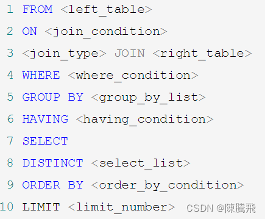  
比如你写了一个 SQL 语句，那么它的关键字顺序和执行顺序是下面这样的：

    SELECT DISTINCT player_id, player_name, count(*) as num # 顺序 5
    FROM player JOIN team ON player.team_id = team.team_id # 顺序 1
    WHERE height > 1.80 # 顺序 2
    GROUP BY player.team_id # 顺序 3
    HAVING num > 2 # 顺序 4
    ORDER BY num DESC # 顺序 6
    LIMIT 2 # 顺序 7


> 在 SELECT 语句执行这些步骤的时候，每个步骤都会产生一个虚拟表，然后将这个虚拟表传入下一个步骤中作为输入。需要注意的是，这些步骤隐含在 SQL 的执行过程中，对于我们来说是不可见的。

### 8.4.3 SQL 的执行原理

> *   SELECT 是先执行 FROM 这一步的。在这个阶段，如果是多张表联查，还会经历下面的几个步骤：
>     *   首先先通过 CROSS JOIN 求笛卡尔积，相当于得到虚拟表 vt（virtual table）1-1；
>     *   通过 ON 进行筛选，在虚拟表 vt1-1 的基础上进行筛选，得到虚拟表 vt1-2；
>     *   添加外部行。如果我们使用的是左连接、右链接或者全连接，就会涉及到外部行，也就是在虚拟表 vt1-2 的基础上增加外部行，得到虚拟表 vt1-3。
> *   当然如果我们操作的是两张以上的表，还会重复上面的步骤，直到所有表都被处理完为止。这个过程得到是我们的原始数据。
> *   当我们拿到了查询数据表的原始数据，也就是最终的虚拟表 vt1，就可以在此基础上再进行 WHERE 阶段。在这个阶段中，会根据 vt1 表的结果进行筛选过滤，得到虚拟表 vt2。
> *   然后进入第三步和第四步，也就是 GROUP 和 HAVING 阶段。在这个阶段中，实际上是在虚拟表 vt2 的基础上进行分组和分组过滤，得到中间的虚拟表 vt3 和 vt4。
> *   当我们完成了条件筛选部分之后，就可以筛选表中提取的字段，也就是进入到 SELECT 和 DISTINCT 阶段。
> *   首先在 SELECT 阶段会提取想要的字段，然后在 DISTINCT 阶段过滤掉重复的行，分别得到中间的虚拟表 vt5-1 和 vt5-2。
> *   当我们提取了想要的字段数据之后，就可以按照指定的字段进行排序，也就是 ORDER BY 阶段，得到虚拟表 vt6。
> *   最后在 vt6 的基础上，取出指定行的记录，也就是 LIMIT 阶段，得到最终的结果，对应的是虚拟表 vt7。
> *   当然我们在写 SELECT 语句的时候，不一定存在所有的关键字，相应的阶段就会省略。
> *   同时因为 SQL 是一门类似英语的结构化查询语言，所以我们在写 SELECT 语句的时候，还要注意相应的关键字顺序，**所谓底层运行的原理，就是我们刚才讲到的执行顺序。*
>
> ## 8.4. 练习sql
>
> ```sql
> # 第08章_聚合函数
> 
> #1. 常见的几个聚合函数
> #1.1 AVG / SUM ：只适用于数值类型的字段（或变量）
> 
> SELECT AVG(salary),SUM(salary),AVG(salary) * 107
> FROM employees;
> #如下的操作没有意义
> SELECT SUM(last_name),AVG(last_name),SUM(hire_date)
> FROM employees;
> 
> 
> #1.2 MAX / MIN :适用于数值类型、字符串类型、日期时间类型的字段（或变量）
> 
> SELECT MAX(salary),MIN(salary)
> FROM employees;
> 
> SELECT MAX(last_name),MIN(last_name),MAX(hire_date),MIN(hire_date)
> FROM employees;
> 
> 
> #1.3 COUNT：
> # ① 作用：计算指定字段在查询结构中出现的个数（不包含NULL值的）
> 
> SELECT COUNT(employee_id),COUNT(salary),COUNT(2 * salary),COUNT(1),COUNT(2),COUNT(*)
> FROM employees ;
> 
> SELECT *
> FROM employees;
> 
> #如果计算表中有多少条记录，如何实现？
> #方式1：COUNT(*)
> #方式2：COUNT(1)
> #方式3：COUNT(具体字段) : 不一定对！
> 
> #② 注意：计算指定字段出现的个数时，是不计算NULL值的。
> SELECT COUNT(commission_pct)
> FROM employees;
> 
> SELECT commission_pct
> FROM employees
> WHERE commission_pct IS NOT NULL;
> 
> #③ 公式：AVG = SUM / COUNT
> SELECT AVG(salary),SUM(salary)/COUNT(salary),
> AVG(commission_pct),SUM(commission_pct)/COUNT(commission_pct),
> SUM(commission_pct) / 107
> FROM employees;
> 
> #需求：查询公司中平均奖金率
> #错误的！
> SELECT AVG(commission_pct)
> FROM employees;
> 
> #正确的：
> SELECT SUM(commission_pct) / COUNT(IFNULL(commission_pct,0)),
> AVG(IFNULL(commission_pct,0))
> FROM employees;
> 
> # 如何需要统计表中的记录数，使用COUNT(*)、COUNT(1)、COUNT(具体字段) 哪个效率更高呢？
> # 如果使用的是MyISAM 存储引擎，则三者效率相同，都是O(1)
> # 如果使用的是InnoDB 存储引擎，则三者效率：COUNT(*) = COUNT(1)> COUNT(字段)
> 
> 
> #其他：方差、标准差、中位数
> 
> #2. GROUP BY 的使用
> 
> #需求：查询各个部门的平均工资，最高工资
> SELECT department_id,AVG(salary),SUM(salary)
> FROM employees
> GROUP BY department_id
> 
> #需求：查询各个job_id的平均工资
> SELECT job_id,AVG(salary)
> FROM employees
> GROUP BY job_id;
> 
> #需求：查询各个department_id,job_id的平均工资
> #方式1：
> SELECT department_id,job_id,AVG(salary)
> FROM employees
> GROUP BY  department_id,job_id;
> #方式2：
> SELECT job_id,department_id,AVG(salary)
> FROM employees
> GROUP BY job_id,department_id;
> 
> 
> #错误的！
> SELECT department_id,job_id,AVG(salary)
> FROM employees
> GROUP BY department_id;
> 
> #结论1：SELECT中出现的非组函数的字段必须声明在GROUP BY 中。
> #      反之，GROUP BY中声明的字段可以不出现在SELECT中。
> 
> #结论2：GROUP BY 声明在FROM后面、WHERE后面，ORDER BY 前面、LIMIT前面
> 
> #结论3：MySQL中GROUP BY中使用WITH ROLLUP
> 
> SELECT department_id,AVG(salary)
> FROM employees
> GROUP BY department_id WITH ROLLUP;
> 
> #需求：查询各个部门的平均工资，按照平均工资升序排列
> SELECT department_id,AVG(salary) avg_sal
> FROM employees
> GROUP BY department_id
> ORDER BY avg_sal ASC;
> 
> #说明：当使用ROLLUP时，不能同时使用ORDER BY子句进行结果排序，即ROLLUP和ORDER BY是互相排斥的。
> #错误的：
> SELECT department_id,AVG(salary) avg_sal
> FROM employees
> GROUP BY department_id WITH ROLLUP
> ORDER BY avg_sal ASC;
> 
> #3. HAVING的使用 (作用：用来过滤数据的)
> #练习：查询各个部门中最高工资比10000高的部门信息
> #错误的写法：
> SELECT department_id,MAX(salary)
> FROM employees
> WHERE MAX(salary) > 10000
> GROUP BY department_id;
> 
> 
> #要求1：如果过滤条件中使用了聚合函数，则必须使用HAVING来替换WHERE。否则，报错。
> #要求2：HAVING 必须声明在 GROUP BY 的后面。
> 
> #正确的写法：
> SELECT department_id,MAX(salary)
> FROM employees
> GROUP BY department_id
> HAVING MAX(salary) > 10000;
> 
> #要求3：开发中，我们使用HAVING的前提是SQL中使用了GROUP BY。
> 
> 
> #练习：查询部门id为10,20,30,40这4个部门中最高工资比10000高的部门信息
> #方式1：推荐，执行效率高于方式2.
> SELECT department_id,MAX(salary)
> FROM employees
> WHERE department_id IN (10,20,30,40)
> GROUP BY department_id
> HAVING MAX(salary) > 10000;
> 
> #方式2：
> SELECT department_id,MAX(salary)
> FROM employees
> GROUP BY department_id
> HAVING MAX(salary) > 10000 AND department_id IN (10,20,30,40);
> 
> #结论：当过滤条件中有聚合函数时，则此过滤条件必须声明在HAVING中。
> #      当过滤条件中没有聚合函数时，则此过滤条件声明在WHERE中或HAVING中都可以。但是，建议大家声明在WHERE中。
> 
> /*
>   WHERE 与 HAVING 的对比
> 1. 从适用范围上来讲，HAVING的适用范围更广。 
> 2. 如果过滤条件中没有聚合函数：这种情况下，WHERE的执行效率要高于HAVING
> */
> 
> #4. SQL底层执行原理
> #4.1 SELECT 语句的完整结构
> /*
> 
> #sql92语法：
> SELECT ....,....,....(存在聚合函数)
> FROM ...,....,....
> WHERE 多表的连接条件 AND 不包含聚合函数的过滤条件
> GROUP BY ...,....
> HAVING 包含聚合函数的过滤条件
> ORDER BY ....,...(ASC / DESC )
> LIMIT ...,....
> 
> 
> #sql99语法：
> SELECT ....,....,....(存在聚合函数)
> FROM ... (LEFT / RIGHT)JOIN ....ON 多表的连接条件 
> (LEFT / RIGHT)JOIN ... ON ....
> WHERE 不包含聚合函数的过滤条件
> GROUP BY ...,....
> HAVING 包含聚合函数的过滤条件
> ORDER BY ....,...(ASC / DESC )
> LIMIT ...,....
> 
> 
> */
> 
> #4.2 SQL语句的执行过程：
> #FROM ...,...-> ON -> (LEFT/RIGNT  JOIN) -> WHERE -> GROUP BY -> HAVING -> SELECT -> DISTINCT -> 
> # ORDER BY -> LIMIT
> 
> 
> 
> ```


```sql

# 第08章_聚合函数的课后练习

#1.where子句可否使用组函数进行过滤?  No!

#2.查询公司员工工资的最大值，最小值，平均值，总和
SELECT MAX(salary) max_sal ,MIN(salary) mim_sal,AVG(salary) avg_sal,SUM(salary) sum_sal
FROM employees;

#3.查询各job_id的员工工资的最大值，最小值，平均值，总和

SELECT job_id,MAX(salary),MIN(salary),AVG(salary),SUM(salary)
FROM employees
GROUP BY job_id;

#4.选择具有各个job_id的员工人数
SELECT job_id,COUNT(*)
FROM employees
GROUP BY job_id;

# 5.查询员工最高工资和最低工资的差距（DIFFERENCE）  #DATEDIFF
SELECT MAX(salary) - MIN(salary) "DIFFERENCE"
FROM employees;


# 6.查询各个管理者手下员工的最低工资，其中最低工资不能低于6000，没有管理者的员工不计算在内

SELECT manager_id,MIN(salary)
FROM employees
WHERE manager_id IS NOT NULL
GROUP BY manager_id
HAVING MIN(salary) >= 6000;


# 7.查询所有部门的名字，location_id，员工数量和平均工资，并按平均工资降序 

SELECT d.department_name,d.location_id,COUNT(employee_id),AVG(salary)
FROM departments d LEFT JOIN employees e
ON d.`department_id` = e.`department_id`
GROUP BY department_name,location_id


# 8.查询每个工种、每个部门的部门名、工种名和最低工资 

SELECT d.department_name,e.job_id,MIN(salary)
FROM departments d LEFT JOIN employees e
ON d.`department_id` = e.`department_id`
GROUP BY department_name,job_id


```

