第9章 子查询
=======

> *   子查询指一个查询语句嵌套在另一个查询语句内部的查询，这个特性从MySQL 4.1开始引入。
> *   SQL 中子查询的使用大大增强了 SELECT 查询的能力，因为很多时候查询需要从结果集中获取数据，或者需要从同一个表中先计算得出一个数据结果，然后与这个数据结果（可能是某个标量，也可能是某个集合）进行比较。

9.1 需求分析与问题解决
-------------

### 9.1.1 实际问题

  
现有解决方式：

    #方式一：
    SELECT salary
    FROM employees
    WHERE last_name = 'Abel';
    SELECT last_name,salary
    FROM employees
    WHERE salary > 11000;
    
    #方式二：自连接
    SELECT e2.last_name,e2.salary
    FROM employees e1,employees e2
    WHERE e1.last_name = 'Abel'
    AND e1.`salary` < e2.`salary`


    #方式三：子查询
    SELECT last_name,salary
    FROM employees
    WHERE salary > (
    		SELECT salary
    		FROM employees
    		WHERE last_name = 'Abel'
    		);


### 9.1.2 子查询的基本使用

**子查询的基本语法结构：**  


> *   子查询（内查询）在主查询之前一次执行完成。
> *   子查询的结果被主查询（外查询）使用 。
> *   **注意事项**
>     *   子查询要包含在括号内
>     *   将子查询放在比较条件的右侧
>     *   单行操作符对应单行子查询，多行操作符对应多行子查询

### 9.1.3 子查询的分类

**分类方式1：**

> 我们按内查询的结果返回一条还是多条记录，将子查询分为`单行子查询`、`多行子查询`。

**单行子查询**  
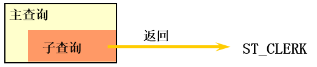  
**多行子查询**  
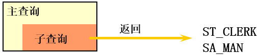  
**分类方式2：**

> *   我们按内查询是否被执行多次，将子查询划分为`相关(或关联)子查询`和`不相关(或非关联)子查询`。
> *   子查询从数据表中查询了数据结果，如果这个数据结果只执行一次，然后这个数据结果作为主查询的条件进行执行，那么这样的子查询叫做不相关子查询。
> *   同样，如果子查询需要执行多次，即采用循环的方式，先从外部查询开始，每次都传入子查询进行查询，然后再将结果反馈给外部，这种嵌套的执行方式就称为相关子查询。

9.2 单行子查询
---------

### 9.2.1 单行比较操作符

操作符

含义

\=

equal to

\>

greater than

\>=

greater than or equal to

<

less than

<=

less than or equal to

<>

not equal to

### 9.2.2 代码示例

**题目：查询工资大于149号员工工资的员工的信息**  
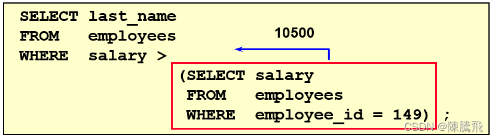  
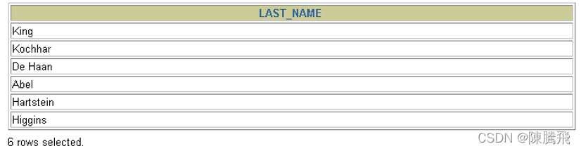  
**题目：返回公司工资最少的员工的last\_name,job\_id和salary**

    SELECT last_name, job_id, salary
    FROM   employees
    WHERE  salary = 
                    (SELECT MIN(salary)
                     FROM   employees);


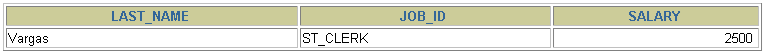  
**题目：查询与141号或174号员工的manager\_id和department\_id相同的其他员工的employee\_id，manager\_id，department\_id**  
实现方式1：不成对比较

    SELECT  employee_id, manager_id, department_id
    FROM    employees
    WHERE   manager_id IN
    		  (SELECT  manager_id
                       FROM    employees
                       WHERE   employee_id IN (174,141))
    AND     department_id IN 
    		  (SELECT  department_id
                       FROM    employees
                       WHERE   employee_id IN (174,141))
    AND	employee_id NOT IN(174,141);


实现方式2：成对比较

    SELECT	employee_id, manager_id, department_id
    FROM	employees
    WHERE  (manager_id, department_id) IN
                          (SELECT manager_id, department_id
                           FROM   employees
                           WHERE  employee_id IN (141,174))
    AND	employee_id NOT IN (141,174);


### 9.2.3 HAVING 中的子查询

> *   首先执行子查询。
> *   向主查询中的HAVING 子句返回结果。

**题目：查询最低工资大于50号部门最低工资的部门id和其最低工资**

    SELECT   department_id, MIN(salary)
    FROM     employees
    GROUP BY department_id
    HAVING   MIN(salary) >
                           (SELECT MIN(salary)
                            FROM   employees
                            WHERE  department_id = 50);


### 9.2.4 CASE中的子查询

在CASE表达式中使用单列子查询：

**题目：显式员工的employee\_id,last\_name和location。其中，若员工department\_id与location\_id为1800的department\_id相同，则location为’Canada’，其余则为’USA’。**

    SELECT employee_id, last_name,
           (CASE department_id
            WHEN
                 (SELECT department_id FROM departments
    	      WHERE location_id = 1800)           
            THEN 'Canada' ELSE 'USA' END) location
    FROM   employees;


### 9.2.5 子查询中的空值问题

    SELECT last_name, job_id
    FROM   employees
    WHERE  job_id =
                    (SELECT job_id
                     FROM   employees
                     WHERE  last_name = 'Haas');


> `子查询不返回任何行`

### 9.2.6 非法使用子查询

    SELECT employee_id, last_name
    FROM   employees
    WHERE  salary =
                    (SELECT   MIN(salary)
                     FROM     employees
                     GROUP BY department_id);


> `多行子查询使用单行比较符`

9.3. 多行子查询
----------

> *   也称为集合比较子查询
> *   内查询返回多行
> *   使用多行比较操作符

### 9.3.1 多行比较操作符

操作符

含义

IN

等于列表中的**任意一个**

ANY

需要和单行比较操作符一起使用，和子查询返回的**某一个**值比较

ALL

需要和单行比较操作符一起使用，和子查询返回的**所有**值比较

SOME

实际上是ANY的别名，作用相同，一般常使用ANY

**体会 ANY 和 ALL 的区别**

### 9.3.2 代码示例

**题目：返回其它job\_id中比job\_id为‘IT\_PROG’部门任一工资低的员工的员工号、姓名、job\_id 以及salary**  
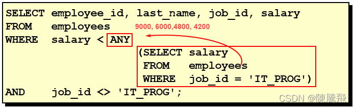  
  
**题目：查询平均工资最低的部门id**

    #方式1：
    SELECT department_id
    FROM employees
    GROUP BY department_id
    HAVING AVG(salary) = (
    			SELECT MIN(avg_sal)
    			FROM (
    				SELECT AVG(salary) avg_sal
    				FROM employees
    				GROUP BY department_id
    				) dept_avg_sal
    			)


    #方式2：
    SELECT department_id
    FROM employees
    GROUP BY department_id
    HAVING AVG(salary) <= ALL (
    				SELECT AVG(salary) avg_sal
    				FROM employees
    				GROUP BY department_id
    )


### 9.3.4 空值问题

    SELECT last_name
    FROM employees
    WHERE employee_id NOT IN (
    			SELECT manager_id
    			FROM employees
    			);


9.4 相关子查询
---------

### 9.4.1 相关子查询执行流程

> *   如果子查询的执行依赖于外部查询，通常情况下都是因为子查询中的表用到了外部的表，并进行了条件关联，因此每执行一次外部查询，子查询都要重新计算一次，这样的子查询就称之为`关联子查询`。
> *   相关子查询按照一行接一行的顺序执行，主查询的每一行都执行一次子查询。  
>     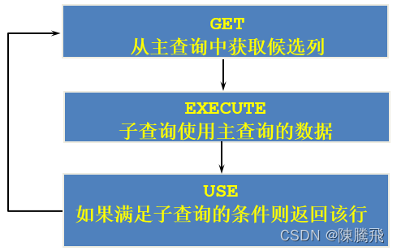  
>     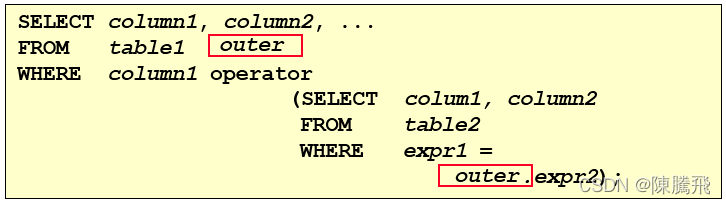

> 说明：`子查询中使用主查询中的列`

### 9.4.2 代码示例

**题目：查询员工中工资大于本部门平均工资的员工的last\_name,salary和其department\_id**  
**方式一：相关子查询**  
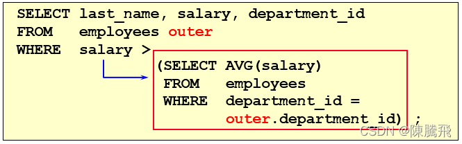  
**方式二：在 FROM 中使用子查询**

    SELECT last_name,salary,e1.department_id
    FROM employees e1,(SELECT department_id,AVG(salary) dept_avg_sal FROM employees GROUP BY department_id) e2
    WHERE e1.`department_id` = e2.department_id
    AND e2.dept_avg_sal < e1.`salary`;


> **from型的子查询：子查询是作为from的一部分，子查询要用()引起来，并且要给这个子查询取别名，把它当成一张“临时的虚拟的表”来使用。**

在ORDER BY 中使用子查询：  
**题目：查询员工的id,salary,按照department\_name 排序**

    SELECT employee_id,salary
    FROM employees e
    ORDER BY (
    	  SELECT department_name
    	  FROM departments d
    	  WHERE e.`department_id` = d.`department_id`
    	);


**题目：若employees表中employee\_id与job\_history表中employee\_id相同的数目不小于2，输出这些相同id的员工的employee\_id,last\_name和其job\_id**

    SELECT e.employee_id, last_name,e.job_id
    FROM   employees e 
    WHERE  2 <= (SELECT COUNT(*)
                 FROM   job_history 
                 WHERE  employee_id = e.employee_id);


### 9.4.3 EXISTS 与 NOT EXISTS关键字

> *   关联子查询通常也会和 EXISTS操作符一起来使用，用来检查在子查询中是否存在满足条件的行。
> *   **如果在子查询中不存在满足条件的行：**
>     *   条件返回 FALSE
>     *   继续在子查询中查找
> *   **如果在子查询中存在满足条件的行：**
>     *   不在子查询中继续查找
>     *   条件返回 TRUE
> *   NOT EXISTS关键字表示如果不存在某种条件，则返回TRUE，否则返回FALSE。

**题目：查询公司管理者的employee\_id，last\_name，job\_id，department\_id信息**  
方式一：

    SELECT employee_id, last_name, job_id, department_id
    FROM   employees e1
    WHERE  EXISTS ( SELECT *
                     FROM   employees e2
                     WHERE  e2.manager_id = 
                            e1.employee_id);


方式二：自连接

    SELECT DISTINCT e1.employee_id, e1.last_name, e1.job_id, e1.department_id
    FROM   employees e1 JOIN employees e2
    WHERE e1.employee_id = e2.manager_id;


方式三：

    SELECT employee_id,last_name,job_id,department_id
    FROM employees
    WHERE employee_id IN (
    		     SELECT DISTINCT manager_id
    		     FROM employees
    
    		     );


**题目：查询departments表中，不存在于employees表中的部门的department\_id和department\_name**

    SELECT department_id, department_name
    FROM departments d
    WHERE NOT EXISTS (SELECT 'X'
                      FROM   employees
                      WHERE  department_id = d.department_id);


### 9.4.4 相关更新

    UPDATE table1 alias1
    SET    column = (SELECT expression
                     FROM   table2 alias2
                     WHERE  alias1.column = alias2.column);


使用相关子查询依据一个表中的数据更新另一个表的数据。

**题目：在employees中增加一个department\_name字段，数据为员工对应的部门名称**

    # 1）
    ALTER TABLE employees
    ADD(department_name VARCHAR2(14));
    
    # 2）
    UPDATE employees e
    SET department_name =  (SELECT department_name 
    	                       FROM   departments d
    	                       WHERE  e.department_id = d.department_id);


​    

### 9.4.5 相关删除

     DELETE FROM table1 alias1
     WHERE column operator (SELECT expression
                            FROM   table2 alias2
                            WHERE  alias1.column = alias2.column);


使用相关子查询依据一个表中的数据删除另一个表的数据。

**题目：删除表employees中，其与emp\_history表皆有的数据**

    DELETE FROM employees e
    WHERE employee_id in  
               (SELECT employee_id
                FROM   emp_history 
                WHERE  employee_id = e.employee_id);


9.5 抛一个思考题
----------

问题：谁的工资比Abel的高？  
**解答：**

    #方式1：自连接
    SELECT e2.last_name,e2.salary
    FROM employees e1,employees e2
    WHERE e1.last_name = 'Abel'
    AND e1.`salary` < e2.`salary`


    #方式2：子查询
    SELECT last_name,salary
    FROM employees
    WHERE salary > (
    		SELECT salary
    		FROM employees
    		WHERE last_name = 'Abel'
    		);


> 问题：以上两种方式有好坏之分吗？  
> 解答：自连接方式好！
>
> *   题目中可以使用子查询，也可以使用自连接。一般情况建议你使用自连接，因为在许多 DBMS 的处理过程中，对于自连接的处理速度要比子查询快得多。
> *   可以这样理解：子查询实际上是通过未知表进行查询后的条件判断，而自连接是通过已知的自身数据表进行条件判断，因此在大部分 DBMS 中都对自连接处理进行了优化。

## 9.6. 练习sql

```sql
# 第09章_子查询

#1. 由一个具体的需求，引入子查询
#需求：谁的工资比Abel的高？
#方式1：
SELECT salary
FROM employees
WHERE last_name = 'Abel';

SELECT last_name,salary
FROM employees
WHERE salary > 11000;

#方式2：自连接
SELECT e2.last_name,e2.salary
FROM employees e1,employees e2
WHERE e2.`salary` > e1.`salary` #多表的连接条件
AND e1.last_name = 'Abel';

#方式3：子查询
SELECT last_name,salary
FROM employees
WHERE salary > (
		SELECT salary
		FROM employees
		WHERE last_name = 'Abel'
		);

#2. 称谓的规范：外查询（或主查询）、内查询（或子查询）

/*
- 子查询（内查询）在主查询之前一次执行完成。
- 子查询的结果被主查询（外查询）使用 。
- 注意事项
  - 子查询要包含在括号内
  - 将子查询放在比较条件的右侧
  - 单行操作符对应单行子查询，多行操作符对应多行子查询

*/

#不推荐：
SELECT last_name,salary
FROM employees
WHERE  (
	SELECT salary
	FROM employees
	WHERE last_name = 'Abel'
		) < salary;
		
/*
3. 子查询的分类
角度1：从内查询返回的结果的条目数
	单行子查询  vs  多行子查询

角度2：内查询是否被执行多次
	相关子查询  vs  不相关子查询
	
 比如：相关子查询的需求：查询工资大于本部门平均工资的员工信息。
       不相关子查询的需求：查询工资大于本公司平均工资的员工信息。
 
*/

#子查询的编写技巧（或步骤）：① 从里往外写  ② 从外往里写

#4. 单行子查询
#4.1 单行操作符： =  !=  >   >=  <  <= 
#题目：查询工资大于149号员工工资的员工的信息

SELECT employee_id,last_name,salary
FROM employees
WHERE salary > (
		SELECT salary
		FROM employees
		WHERE employee_id = 149
		);

#题目：返回job_id与141号员工相同，salary比143号员工多的员工姓名，job_id和工资

SELECT last_name,job_id,salary
FROM employees
WHERE job_id = (
		SELECT job_id
		FROM employees
		WHERE employee_id = 141
		)
AND salary > (
		SELECT salary
		FROM employees
		WHERE employee_id = 143
		);


#题目：返回公司工资最少的员工的last_name,job_id和salary

SELECT last_name,job_id,salary
FROM employees
WHERE salary = (
		SELECT MIN(salary)
		FROM employees
		);

#题目：查询与141号员工的manager_id和department_id相同的其他员工
#的employee_id，manager_id，department_id。
#方式1：
SELECT employee_id,manager_id,department_id
FROM employees
WHERE manager_id = (
		    SELECT manager_id
		    FROM employees
		    WHERE employee_id = 141
		   )
AND department_id = (
		    SELECT department_id
		    FROM employees
		    WHERE employee_id = 141
		   )
AND employee_id <> 141;

#方式2：了解
SELECT employee_id,manager_id,department_id
FROM employees
WHERE (manager_id,department_id) = (
				    SELECT manager_id,department_id
			            FROM employees
				    WHERE employee_id = 141
				   )
AND employee_id <> 141;

#题目：查询最低工资大于110号部门最低工资的部门id和其最低工资

SELECT department_id,MIN(salary)
FROM employees
WHERE department_id IS NOT NULL
GROUP BY department_id
HAVING MIN(salary) > (
			SELECT MIN(salary)
			FROM employees
			WHERE department_id = 110
		     );

#题目：显式员工的employee_id,last_name和location。
#其中，若员工department_id与location_id为1800的department_id相同，
#则location为’Canada’，其余则为’USA’。

SELECT employee_id,last_name,CASE department_id WHEN (SELECT department_id FROM departments WHERE location_id = 1800) THEN 'Canada'
						ELSE 'USA' END "location"
FROM employees;

#4.2 子查询中的空值问题
SELECT last_name, job_id
FROM   employees
WHERE  job_id =
                (SELECT job_id
                 FROM   employees
                 WHERE  last_name = 'Haas');
                 
#4.3 非法使用子查询
#错误：Subquery returns more than 1 row
SELECT employee_id, last_name
FROM   employees
WHERE  salary =
                (SELECT   MIN(salary)
                 FROM     employees
                 GROUP BY department_id);         

#5.多行子查询
#5.1 多行子查询的操作符： IN  ANY ALL SOME(同ANY)

#5.2举例：
# IN:
SELECT employee_id, last_name
FROM   employees
WHERE  salary IN
                (SELECT   MIN(salary)
                 FROM     employees
                 GROUP BY department_id); 
                 
# ANY / ALL:
#题目：返回其它job_id中比job_id为‘IT_PROG’部门任一工资低的员工的员工号、
#姓名、job_id 以及salary

SELECT employee_id,last_name,job_id,salary
FROM employees
WHERE job_id <> 'IT_PROG'
AND salary < ANY (
		SELECT salary
		FROM employees
		WHERE job_id = 'IT_PROG'
		);

#题目：返回其它job_id中比job_id为‘IT_PROG’部门所有工资低的员工的员工号、
#姓名、job_id 以及salary
SELECT employee_id,last_name,job_id,salary
FROM employees
WHERE job_id <> 'IT_PROG'
AND salary < ALL (
		SELECT salary
		FROM employees
		WHERE job_id = 'IT_PROG'
		);
		
#题目：查询平均工资最低的部门id
#MySQL中聚合函数是不能嵌套使用的。
#方式1：
SELECT department_id
FROM employees
GROUP BY department_id
HAVING AVG(salary) = (
			SELECT MIN(avg_sal)
			FROM(
				SELECT AVG(salary) avg_sal
				FROM employees
				GROUP BY department_id
				) t_dept_avg_sal
			);

#方式2：
SELECT department_id
FROM employees
GROUP BY department_id
HAVING AVG(salary) <= ALL(	
			SELECT AVG(salary) avg_sal
			FROM employees
			GROUP BY department_id
			) 
#5.3 空值问题
SELECT last_name
FROM employees
WHERE employee_id NOT IN (
			SELECT manager_id
			FROM employees
			);
			
#6. 相关子查询
#回顾：查询员工中工资大于公司平均工资的员工的last_name,salary和其department_id
#6.1 
SELECT last_name,salary,department_id
FROM employees
WHERE salary > (
		SELECT AVG(salary)
		FROM employees
		);
		
#题目：查询员工中工资大于本部门平均工资的员工的last_name,salary和其department_id
#方式1：使用相关子查询
SELECT last_name,salary,department_id
FROM employees e1
WHERE salary > (
		SELECT AVG(salary)
		FROM employees e2
		WHERE department_id = e1.`department_id`
		);

#方式2：在FROM中声明子查询
SELECT e.last_name,e.salary,e.department_id
FROM employees e,(
		SELECT department_id,AVG(salary) avg_sal
		FROM employees
		GROUP BY department_id) t_dept_avg_sal
WHERE e.department_id = t_dept_avg_sal.department_id
AND e.salary > t_dept_avg_sal.avg_sal


#题目：查询员工的id,salary,按照department_name 排序

SELECT employee_id,salary
FROM employees e
ORDER BY (
	 SELECT department_name
	 FROM departments d
	 WHERE e.`department_id` = d.`department_id`
	) ASC;

#结论：在SELECT中，除了GROUP BY 和 LIMIT之外，其他位置都可以声明子查询！
/*
SELECT ....,....,....(存在聚合函数)
FROM ... (LEFT / RIGHT)JOIN ....ON 多表的连接条件 
(LEFT / RIGHT)JOIN ... ON ....
WHERE 不包含聚合函数的过滤条件
GROUP BY ...,....
HAVING 包含聚合函数的过滤条件
ORDER BY ....,...(ASC / DESC )
LIMIT ...,....
*/

#题目：若employees表中employee_id与job_history表中employee_id相同的数目不小于2，
#输出这些相同id的员工的employee_id,last_name和其job_id

SELECT *
FROM job_history;

SELECT employee_id,last_name,job_id
FROM employees e
WHERE 2 <= (
	    SELECT COUNT(*)
	    FROM job_history j
	    WHERE e.`employee_id` = j.`employee_id`
		)

#6.2 EXISTS 与 NOT EXISTS关键字

#题目：查询公司管理者的employee_id，last_name，job_id，department_id信息
#方式1：自连接
SELECT DISTINCT mgr.employee_id,mgr.last_name,mgr.job_id,mgr.department_id
FROM employees emp JOIN employees mgr
ON emp.manager_id = mgr.employee_id;

#方式2：子查询

SELECT employee_id,last_name,job_id,department_id
FROM employees
WHERE employee_id IN (
			SELECT DISTINCT manager_id
			FROM employees
			);

#方式3：使用EXISTS
SELECT employee_id,last_name,job_id,department_id
FROM employees e1
WHERE EXISTS (
	       SELECT *
	       FROM employees e2
	       WHERE e1.`employee_id` = e2.`manager_id`
	     );

#题目：查询departments表中，不存在于employees表中的部门的department_id和department_name

#方式1：
SELECT d.department_id,d.department_name
FROM employees e RIGHT JOIN departments d
ON e.`department_id` = d.`department_id`
WHERE e.`department_id` IS NULL;

#方式2：
SELECT department_id,department_name
FROM departments d
WHERE NOT EXISTS (
		SELECT *
		FROM employees e
		WHERE d.`department_id` = e.`department_id`
		);

SELECT COUNT(*)
FROM departments;


```


```sql

# 第09章_子查询的课后练习


#1.查询和Zlotkey相同部门的员工姓名和工资

SELECT last_name,salary
FROM employees
WHERE department_id IN (
			SELECT department_id
			FROM employees
			WHERE last_name = 'Zlotkey'
			);

#2.查询工资比公司平均工资高的员工的员工号，姓名和工资。

SELECT employee_id,last_name,salary
FROM employees
WHERE salary > (
		SELECT AVG(salary)
		FROM employees
		);

#3.选择工资大于所有JOB_ID = 'SA_MAN'的员工的工资的员工的last_name, job_id, salary

SELECT last_name,job_id,salary
FROM employees
WHERE salary > ALL(
		SELECT salary
		FROM employees
		WHERE job_id = 'SA_MAN'
		);


#4.查询和姓名中包含字母u的员工在相同部门的员工的员工号和姓名

SELECT employee_id,last_name
FROM employees 
WHERE department_id IN (
			SELECT DISTINCT department_id
			FROM employees
			WHERE last_name LIKE '%u%'
			);


#5.查询在部门的location_id为1700的部门工作的员工的员工号

SELECT employee_id
FROM employees
WHERE department_id IN (
			SELECT department_id
			FROM departments
			WHERE location_id = 1700
			);


#6.查询管理者是King的员工姓名和工资

SELECT last_name,salary,manager_id
FROM employees
WHERE manager_id IN (
			SELECT employee_id
			FROM employees
			WHERE last_name = 'King'
			);


#7.查询工资最低的员工信息: last_name, salary

SELECT last_name,salary
FROM employees
WHERE salary = (
		SELECT MIN(salary)
		FROM employees
		);


#8.查询平均工资最低的部门信息
#方式1：
SELECT *
FROM departments
WHERE department_id = (
			SELECT department_id
			FROM employees
			GROUP BY department_id
			HAVING AVG(salary ) = (
						SELECT MIN(avg_sal)
						FROM (
							SELECT AVG(salary) avg_sal
							FROM employees
							GROUP BY department_id
							) t_dept_avg_sal

						)
			);
#方式2：

SELECT *
FROM departments
WHERE department_id = (
			SELECT department_id
			FROM employees
			GROUP BY department_id
			HAVING AVG(salary ) <= ALL(
						SELECT AVG(salary)
						FROM employees
						GROUP BY department_id
						)
			);

#方式3： LIMIT

SELECT *
FROM departments
WHERE department_id = (
			SELECT department_id
			FROM employees
			GROUP BY department_id
			HAVING AVG(salary ) =(
						SELECT AVG(salary) avg_sal
						FROM employees
						GROUP BY department_id
						ORDER BY avg_sal ASC
						LIMIT 1		
						)
			);

#方式4：

SELECT d.*
FROM departments d,(
		SELECT department_id,AVG(salary) avg_sal
		FROM employees
		GROUP BY department_id
		ORDER BY avg_sal ASC
		LIMIT 0,1
		) t_dept_avg_sal
WHERE d.`department_id` = t_dept_avg_sal.department_id
		
#9.查询平均工资最低的部门信息和该部门的平均工资（相关子查询）
#方式1：
SELECT d.*,(SELECT AVG(salary) FROM employees WHERE department_id = d.`department_id`) avg_sal
FROM departments d
WHERE department_id = (
			SELECT department_id
			FROM employees
			GROUP BY department_id
			HAVING AVG(salary ) = (
						SELECT MIN(avg_sal)
						FROM (
							SELECT AVG(salary) avg_sal
							FROM employees
							GROUP BY department_id
							) t_dept_avg_sal

						)
			);

#方式2：

SELECT d.*,(SELECT AVG(salary) FROM employees WHERE department_id = d.`department_id`) avg_sal
FROM departments d
WHERE department_id = (
			SELECT department_id
			FROM employees
			GROUP BY department_id
			HAVING AVG(salary ) <= ALL(
						SELECT AVG(salary)
						FROM employees
						GROUP BY department_id
						)
			);

#方式3： LIMIT

SELECT d.*,(SELECT AVG(salary) FROM employees WHERE department_id = d.`department_id`) avg_sal
FROM departments d
WHERE department_id = (
			SELECT department_id
			FROM employees
			GROUP BY department_id
			HAVING AVG(salary ) =(
						SELECT AVG(salary) avg_sal
						FROM employees
						GROUP BY department_id
						ORDER BY avg_sal ASC
						LIMIT 1		
						)
			);

#方式4：

SELECT d.*,(SELECT AVG(salary) FROM employees WHERE department_id = d.`department_id`) avg_sal
FROM departments d,(
		SELECT department_id,AVG(salary) avg_sal
		FROM employees
		GROUP BY department_id
		ORDER BY avg_sal ASC
		LIMIT 0,1
		) t_dept_avg_sal
WHERE d.`department_id` = t_dept_avg_sal.department_id

#10.查询平均工资最高的 job 信息

#方式1：
SELECT *
FROM jobs
WHERE job_id = (
		SELECT job_id
		FROM employees
		GROUP BY job_id
		HAVING AVG(salary) = (
					SELECT MAX(avg_sal)
					FROM (
						SELECT AVG(salary) avg_sal
						FROM employees
						GROUP BY job_id
						) t_job_avg_sal
					)
		);

#方式2：
SELECT *
FROM jobs
WHERE job_id = (
		SELECT job_id
		FROM employees
		GROUP BY job_id
		HAVING AVG(salary) >= ALL(
				     SELECT AVG(salary) 
				     FROM employees
				     GROUP BY job_id
				     )
		);

#方式3：
SELECT *
FROM jobs
WHERE job_id = (
		SELECT job_id
		FROM employees
		GROUP BY job_id
		HAVING AVG(salary) =(
				     SELECT AVG(salary) avg_sal
				     FROM employees
				     GROUP BY job_id
				     ORDER BY avg_sal DESC
				     LIMIT 0,1
				     )
		);

#方式4：
SELECT j.*
FROM jobs j,(
		SELECT job_id,AVG(salary) avg_sal
		FROM employees
		GROUP BY job_id
		ORDER BY avg_sal DESC
		LIMIT 0,1		
		) t_job_avg_sal
WHERE j.job_id = t_job_avg_sal.job_id
		
#11.查询平均工资高于公司平均工资的部门有哪些?

SELECT department_id
FROM employees
WHERE department_id IS NOT NULL
GROUP BY department_id
HAVING AVG(salary) > (
			SELECT AVG(salary)
			FROM employees
			);


#12.查询出公司中所有 manager 的详细信息

#方式1：自连接  xxx worked for yyy
SELECT DISTINCT mgr.employee_id,mgr.last_name,mgr.job_id,mgr.department_id
FROM employees emp JOIN employees mgr
ON emp.manager_id = mgr.employee_id;

#方式2：子查询

SELECT employee_id,last_name,job_id,department_id
FROM employees
WHERE employee_id IN (
			SELECT DISTINCT manager_id
			FROM employees
			);

#方式3：使用EXISTS
SELECT employee_id,last_name,job_id,department_id
FROM employees e1
WHERE EXISTS (
	       SELECT *
	       FROM employees e2
	       WHERE e1.`employee_id` = e2.`manager_id`
	     );

	
#13.各个部门中 最高工资中最低的那个部门的 最低工资是多少?

#方式1：
SELECT MIN(salary)
FROM employees
WHERE department_id = (
			SELECT department_id
			FROM employees
			GROUP BY department_id
			HAVING MAX(salary) = (
						SELECT MIN(max_sal)
						FROM (
							SELECT MAX(salary) max_sal
							FROM employees
							GROUP BY department_id
							) t_dept_max_sal
						)
			);

SELECT *
FROM employees
WHERE department_id = 10;

#方式2：
SELECT MIN(salary)
FROM employees
WHERE department_id = (
			SELECT department_id
			FROM employees
			GROUP BY department_id
			HAVING MAX(salary) <= ALL (
						SELECT MAX(salary)
						FROM employees
						GROUP BY department_id
						)
			);

#方式3：
SELECT MIN(salary)
FROM employees
WHERE department_id = (
			SELECT department_id
			FROM employees
			GROUP BY department_id
			HAVING MAX(salary) = (
						SELECT MAX(salary) max_sal
						FROM employees
						GROUP BY department_id
						ORDER BY max_sal ASC
						LIMIT 0,1
						)
			);
			
#方式4：
SELECT MIN(salary)
FROM employees e,(
		SELECT department_id,MAX(salary) max_sal
		FROM employees
		GROUP BY department_id
		ORDER BY max_sal ASC
		LIMIT 0,1
		) t_dept_max_sal
WHERE e.department_id = t_dept_max_sal.department_id


#14.查询平均工资最高的部门的 manager 的详细信息: last_name, department_id, email, salary
#方式1：
SELECT last_name, department_id, email, salary
FROM employees
WHERE employee_id = ANY (
			SELECT DISTINCT manager_id
			FROM employees
			WHERE department_id = (
						SELECT department_id
						FROM employees
						GROUP BY department_id
						HAVING AVG(salary) = (
									SELECT MAX(avg_sal)
									FROM (
										SELECT AVG(salary) avg_sal
										FROM employees
										GROUP BY department_id
										) t_dept_avg_sal
									)
						)
			);

#方式2：
SELECT last_name, department_id, email, salary
FROM employees
WHERE employee_id = ANY (
			SELECT DISTINCT manager_id
			FROM employees
			WHERE department_id = (
						SELECT department_id
						FROM employees
						GROUP BY department_id
						HAVING AVG(salary) >= ALL (
								SELECT AVG(salary) avg_sal
								FROM employees
								GROUP BY department_id
								)
						)
			);

#方式3：
SELECT last_name, department_id, email, salary
FROM employees
WHERE employee_id IN (
			SELECT DISTINCT manager_id
			FROM employees e,(
					SELECT department_id,AVG(salary) avg_sal
					FROM employees
					GROUP BY department_id
					ORDER BY avg_sal DESC
					LIMIT 0,1
					) t_dept_avg_sal
			WHERE e.`department_id` = t_dept_avg_sal.department_id
			);


#15. 查询部门的部门号，其中不包括job_id是"ST_CLERK"的部门号
#方式1：
SELECT department_id
FROM departments
WHERE department_id NOT IN (
			SELECT DISTINCT department_id
			FROM employees
			WHERE job_id = 'ST_CLERK'
			);

#方式2：
SELECT department_id
FROM departments d
WHERE NOT EXISTS (
		SELECT *
		FROM employees e
		WHERE d.`department_id` = e.`department_id`
		AND e.`job_id` = 'ST_CLERK'
		);


#16. 选择所有没有管理者的员工的last_name

SELECT last_name
FROM employees emp
WHERE NOT EXISTS (
		SELECT *
		FROM employees mgr
		WHERE emp.`manager_id` = mgr.`employee_id`
		);

#17．查询员工号、姓名、雇用时间、工资，其中员工的管理者为 'De Haan'
#方式1：
SELECT employee_id,last_name,hire_date,salary
FROM employees
WHERE manager_id IN (
		SELECT employee_id
		FROM employees
		WHERE last_name = 'De Haan'
		);

#方式2：
SELECT employee_id,last_name,hire_date,salary
FROM employees e1
WHERE EXISTS (
		SELECT *
		FROM employees e2
		WHERE e1.`manager_id` = e2.`employee_id`
		AND e2.last_name = 'De Haan'
		); 


#18.查询各部门中工资比本部门平均工资高的员工的员工号, 姓名和工资（相关子查询）

#方式1：使用相关子查询
SELECT last_name,salary,department_id
FROM employees e1
WHERE salary > (
		SELECT AVG(salary)
		FROM employees e2
		WHERE department_id = e1.`department_id`
		);

#方式2：在FROM中声明子查询
SELECT e.last_name,e.salary,e.department_id
FROM employees e,(
		SELECT department_id,AVG(salary) avg_sal
		FROM employees
		GROUP BY department_id) t_dept_avg_sal
WHERE e.department_id = t_dept_avg_sal.department_id
AND e.salary > t_dept_avg_sal.avg_sal


#19.查询每个部门下的部门人数大于 5 的部门名称（相关子查询）

SELECT department_name
FROM departments d
WHERE 5 < (
	   SELECT COUNT(*)
	   FROM employees e
	   WHERE d.department_id = e.`department_id`
	  );


#20.查询每个国家下的部门个数大于 2 的国家编号（相关子查询）

SELECT * FROM locations;

SELECT country_id
FROM locations l
WHERE 2 < (
	   SELECT COUNT(*)
	   FROM departments d
	   WHERE l.`location_id` = d.`location_id`
	 );

/* 
子查询的编写技巧（或步骤）：① 从里往外写  ② 从外往里写

如何选择？
① 如果子查询相对较简单，建议从外往里写。一旦子查询结构较复杂，则建议从里往外写
② 如果是相关子查询的话，通常都是从外往里写。

*/

```


第10章 创建和管理表
===========

10.1 基础知识
---------

### 10.1.1 一条数据存储的过程

> *   `存储数据是处理数据的第一步`。只有正确地把数据存储起来，我们才能进行有效的处理和分析。否则，只能是一团乱麻，无从下手。
> *   那么，怎样才能把用户各种经营相关的、纷繁复杂的数据，有序、高效地存储起来呢？ 在 MySQL 中，一个完整的数据存储过程总共有 4 步，分别是创建数据库、确认字段、创建数据表、插入数据。


> 我们要先创建一个数据库，而不是直接创建数据表呢？
>
> *   因为从系统架构的层次上看，MySQL 数据库系统从大到小依次是`数据库服务器`、`数据库`、`数据表`、数据表的`行与列`。
> *   MySQL 数据库服务器之前已经安装。所以，我们就从创建数据库开始。

### 10.1.2 标识符命名规则

> *   数据库名、表名不得超过30个字符，变量名限制为29个
> *   必须只能包含 A–Z, a–z, 0–9, \_共63个字符
> *   数据库名、表名、字段名等对象名中间不要包含空格
> *   同一个MySQL软件中，数据库不能同名；同一个库中，表不能重名；同一个表中，字段不能重名
> *   必须保证你的字段没有和保留字、数据库系统或常用方法冲突。如果坚持使用，请在SQL语句中使用\`（着重号）引起来
> *   保持字段名和类型的一致性：在命名字段并为其指定数据类型的时候一定要保证一致性，假如数据类型在一个表里是整数，那在另一个表里可就别变成字符型了

### 10.1.3 MySQL中的数据类型

类型

类型举例

整数类型

TINYINT、SMALLINT、MEDIUMINT、**INT(或INTEGER)**、BIGINT

浮点类型

FLOAT、DOUBLE

定点数类型

**DECIMAL**

位类型

BIT

日期时间类型

YEAR、TIME、**DATE**、DATETIME、TIMESTAMP

文本字符串类型

CHAR、**VARCHAR**、TINYTEXT、TEXT、MEDIUMTEXT、LONGTEXT

枚举类型

ENUM

集合类型

SET

二进制字符串类型

BINARY、VARBINARY、TINYBLOB、BLOB、MEDIUMBLOB、LONGBLOB

JSON类型

JSON对象、JSON数组

空间数据类型

单值：GEOMETRY、POINT、LINESTRING、POLYGON；  
集合：MULTIPOINT、MULTILINESTRING、MULTIPOLYGON、GEOMETRYCOLLECTION

其中，常用的几类类型介绍如下：

数据类型

描述

INT

从-231到231-1的整型数据。存储大小为 4个字节

CHAR(size)

定长字符数据。若未指定，默认为1个字符，最大长度255

VARCHAR(size)

可变长字符数据，根据字符串实际长度保存，**必须指定长度**

FLOAT(M,D)

单精度，占用4个字节，M=整数位+小数位，D=小数位。 D<=M<=255,0<=D<=30，默认M+D<=6

DOUBLE(M,D)

双精度，占用8个字节，D<=M<=255,0<=D<=30，默认M+D<=15

DECIMAL(M,D)

高精度小数，占用M+2个字节，D<=M<=65，0<=D<=30，最大取值范围与DOUBLE相同。

DATE

日期型数据，格式’YYYY-MM-DD’

BLOB

二进制形式的长文本数据，最大可达4G

TEXT

长文本数据，最大可达4G

10.2 创建和管理数据库
-------------

### 10.2.1 创建数据库

**方式1：创建数据库**

    CREATE DATABASE 数据库名; 


**方式2：创建数据库并指定字符集**

    CREATE DATABASE 数据库名 CHARACTER SET 字符集;


**`方式3：判断数据库是否已经存在，不存在则创建数据库（`推荐`）`**

    # 如果MySQL中已经存在相关的数据库，则忽略创建语句，不再创建数据库。
    CREATE DATABASE IF NOT EXISTS 数据库名; 


> 注意：DATABASE 不能改名。一些可视化工具可以改名，它是建新库，把所有表复制到新库，再删旧库完成的。

### 10.2.2 使用数据库

**查看当前所有的数据库**

    SHOW DATABASES; #有一个S，代表多个数据库


**查看当前正在使用的数据库**

    SELECT DATABASE();  #使用的一个 mysql 中的全局函数


**查看指定库下所有的表**

    SHOW TABLES FROM 数据库名;


**查看数据库的创建信息**

    SHOW CREATE DATABASE 数据库名;
    或者：
    SHOW CREATE DATABASE 数据库名\G


**使用/切换数据库**

    USE 数据库名;


> 注意：要操作表格和数据之前必须先说明是对哪个数据库进行操作，否则就要对所有对象加上“数据库名.”。

### 10.2.3 修改数据库

**更改数据库字符集**

    ALTER DATABASE 数据库名 CHARACTER SET 字符集;  #比如：gbk、utf8等


### 10.2.4 删除数据库

**方式1：删除指定的数据库**

    DROP DATABASE 数据库名;


**方式2：删除指定的数据库（`推荐`）**

    DROP DATABASE IF EXISTS 数据库名;


10.3 创建表
--------

### 10.3.1 创建方式1

**必须具备：**

> *   CREATE TABLE权限
> *   存储空间

**语法格式：**

    CREATE TABLE [IF NOT EXISTS] 表名(
    	字段1, 数据类型 [约束条件] [默认值],
    	字段2, 数据类型 [约束条件] [默认值],
    	字段3, 数据类型 [约束条件] [默认值],
    	……
    	[表约束条件]
    );


> 加上了IF NOT EXISTS关键字，则表示：如果当前数据库中不存在要创建的数据表，则创建数据表；如果当前数据库中已经存在要创建的数据表，则忽略建表语句，不再创建数据表。

**必须指定：**

> *   表名
> *   列名(或字段名)，数据类型，**长度**

**可选指定：**

> *   约束条件
> *   默认值

*   创建表举例1：

    -- 创建表
    CREATE TABLE emp (
      -- int类型
      emp_id INT,
      -- 最多保存20个中英文字符
      emp_name VARCHAR(20),
      -- 总位数不超过15位
      salary DOUBLE,
      -- 日期类型
      birthday DATE
    );
    

> DESC emp; #查看表结构

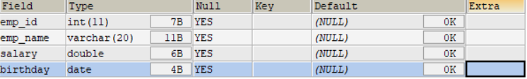

> MySQL在执行建表语句时，将id字段的类型设置为int(11)，这里的11实际上是int类型指定的显示宽度，默认的显示宽度为11。也可以在创建数据表的时候指定数据的显示宽度。

*   创建表举例2：

    CREATE TABLE dept(
        -- int类型，自增
    	deptno INT(2) AUTO_INCREMENT,
    	dname VARCHAR(14),
    	loc VARCHAR(13),
        -- 主键
        PRIMARY KEY (deptno)
    );
    

> DESCRIBE dept; #获取表结构信息

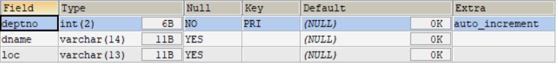

> 在MySQL 8.x版本中，不再推荐为INT类型指定显示长度，并在未来的版本中可能去掉这样的语法。

### 10.3.2 创建方式2

> *   使用 AS subquery 选项，**将创建表和插入数据结合起来**  
>     
> *   指定的列和子查询中的列要一一对应
> *   通过列名和默认值定义列

    CREATE TABLE emp1 AS SELECT * FROM employees;
    
    CREATE TABLE emp2 AS SELECT * FROM employees WHERE 1=2; -- 创建的emp2是空表


    CREATE TABLE dept80
    AS 
    SELECT  employee_id, last_name, salary*12 ANNSAL, hire_date
    FROM    employees
    WHERE   department_id = 80;


> DESCRIBE dept80; #获取表结构

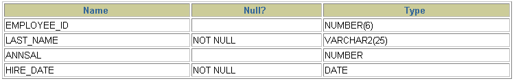

### 10.3.3 查看数据表结构

> 在MySQL中创建好数据表之后，可以查看数据表的结构。MySQL支持使用`DESCRIBE/DESC`语句查看数据表结构，也支持使用`SHOW CREATE TABLE`语句查看数据表结构。

    语法格式如下：
    SHOW CREATE TABLE 表名\G


> 使用SHOW CREATE TABLE语句不仅可以查看表创建时的详细语句，还可以查看存储引擎和字符编码。

10.4 修改表
--------

> 修改表指的是修改数据库中已经存在的数据表的结构。

> **使用 ALTER TABLE 语句可以实现：**
>
> *   向已有的表中添加列
> *   修改现有表中的列
> *   删除现有表中的列
> *   重命名现有表中的列

### 10.4.1 追加一个列

    语法格式如下：
    ALTER TABLE 表名 ADD 【COLUMN】 字段名 字段类型 【FIRST|AFTER 字段名】;


    ALTER TABLE dept80 ADD job_id varchar(15);


### 10.4.2 修改一个列

> *   可以修改列的数据类型，长度、默认值和位置
> *   修改字段数据类型、长度、默认值、位置的语法格式如下：

    ALTER TABLE 表名 MODIFY 【COLUMN】 字段名1 字段类型 【DEFAULT 默认值】【FIRST|AFTER 字段名2】;


    ALTER TABLE	dept80 MODIFY last_name VARCHAR(30);
    ALTER TABLE	dept80 MODIFY salary double(9,2) default 1000;


> *   对默认值的修改只影响今后对表的修改
> *   此外，还可以通过此种方式修改列的约束。这里暂先不讲。

### 10.4.3 重命名一个列

> 使用 CHANGE old\_column new\_column dataType子句重命名列。语法格式如下：

    ALTER TABLE 表名 CHANGE 【column】 列名 新列名 新数据类型;


    ALTER TABLE  dept80 CHANGE department_name dept_name varchar(15); 


### 10.4.4 删除一个列

> 删除表中某个字段的语法格式如下：

    ALTER TABLE 表名 DROP 【COLUMN】字段名


    ALTER TABLE  dept80 DROP COLUMN  job_id; 


10.5 重命名表
---------

*   方式一：使用RENAME

    RENAME TABLE emp TO myemp;
    
*   方式二：

    ALTER table dept RENAME [TO] detail_dept;  -- [TO]可以省略
    

> 必须是对象的拥有者

10.6 删除表
--------

> *   在MySQL中，当一张数据表`没有与其他任何数据表形成关联关系`时，可以将当前数据表直接删除。
> *   数据和结构都被删除
> *   所有正在运行的相关事务被提交
> *   所有相关索引被删除
> *   语法格式：

    DROP TABLE [IF EXISTS] 数据表1 [, 数据表2, …, 数据表n];


> `IF EXISTS`的含义为：如果当前数据库中存在相应的数据表，则删除数据表；如果当前数据库中不存在相应的数据表，则忽略删除语句，不再执行删除数据表的操作。

    DROP TABLE dept80;


> *   DROP TABLE 语句不能回滚

10.7 清空表
--------

> TRUNCATE TABLE语句：
>
> *   删除表中所有的数据
> *   释放表的存储空间

    TRUNCATE TABLE detail_dept;


> *   TRUNCATE语句**不能回滚**，而使用 DELETE 语句删除数据，可以回滚

    对比:
    SET autocommit = FALSE;
    
    DELETE FROM emp2; 
    #TRUNCATE TABLE emp2;
    
    SELECT * FROM emp2;
    
    ROLLBACK;
    
    SELECT * FROM emp2;


> 阿里开发规范：
>
> *   【参考】TRUNCATE TABLE 比 DELETE 速度快，且使用的系统和事务日志资源少，但 TRUNCATE 无事务且不触发 TRIGGER，有可能造成事故，故不建议在开发代码中使用此语句。
> *   说明：TRUNCATE TABLE 在功能上与不带 WHERE 子句的 DELETE 语句相同。

10.8 内容拓展
---------

### 拓展1：阿里巴巴《Java开发手册》之MySQL字段命名

> *   【`强制`】表名、字段名必须使用小写字母或数字，禁止出现数字开头，禁止两个下划线中间只出现数字。数据库字段名的修改代价很大，因为无法进行预发布，所以字段名称需要慎重考虑。
>     *   正例：aliyun\_admin，rdc\_config，level3\_name
>     *   反例：AliyunAdmin，rdcConfig，level\_3\_name
> *   【`强制`】禁用保留字，如 desc、range、match、delayed 等，请参考 MySQL 官方保留字。
> *   【`强制`】表必备三字段：id, gmt\_create, gmt\_modified。
>     *   说明：其中 id 必为主键，类型为BIGINT UNSIGNED、单表时自增、步长为 1。gmt\_create, gmt\_modified 的类型均为 DATETIME 类型，前者现在时表示主动式创建，后者过去分词表示被动式更新
> *   【`推荐`】表的命名最好是遵循 “业务名称\_表的作用”。
>     *   正例：alipay\_task 、 force\_project、 trade\_config
> *   【`推荐`】库名与应用名称尽量一致。
> *   【参考】合适的字符存储长度，不但节约数据库表空间、节约索引存储，更重要的是提升检索速度。
>     *   正例：无符号值可以避免误存负数，且扩大了表示范围。  
>         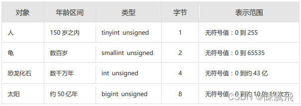

### 拓展2：如何理解清空表、删除表等操作需谨慎？！

> *   `表删除`操作将把表的定义和表中的数据一起删除，并且MySQL在执行删除操作时，不会有任何的确认信息提示，因此执行删除操时应当慎重。在删除表前，最好对表中的数据进行`备份`，这样当操作失误时可以对数据进行恢复，以免造成无法挽回的后果。
> *   同样的，在使用 `ALTER TABLE` 进行表的基本修改操作时，在执行操作过程之前，也应该确保对数据进行完整的`备份`，因为数据库的改变是`无法撤销`的，如果添加了一个不需要的字段，可以将其删除；相同的，如果删除了一个需要的列，该列下面的所有数据都将会丢失。

### 拓展3：MySQL8新特性—DDL的原子化

> *   在MySQL 8.0版本中，InnoDB表的DDL支持事务完整性，即`DDL操作要么成功要么回滚`。DDL操作回滚日志写入到data dictionary数据字典表mysql.innodb\_ddl\_log（该表是隐藏的表，通过show tables无法看到）中，用于回滚操作。通过设置参数，可将DDL操作日志打印输出到MySQL错误日志中。

> *   分别在MySQL 5.7版本和MySQL 8.0版本中创建数据库和数据表，结果如下：

    CREATE DATABASE mytest;
    
    USE mytest;
    
    CREATE TABLE book1(
    book_id INT ,
    book_name VARCHAR(255)
    );
    
    SHOW TABLES;


> 1.在MySQL 5.7版本中，测试步骤如下：删除数据表book1和数据表book2，结果如下：

    mysql> DROP TABLE book1,book2;
    ERROR 1051 (42S02): Unknown table 'mytest.book2'


> 再次查询数据库中的数据表名称，结果如下：

    mysql> SHOW TABLES;
    Empty set (0.00 sec)


> 从结果可以看出，虽然删除操作时报错了，但是仍然删除了数据表book1

> 2.在MySQL 8.0版本中，测试步骤如下：删除数据表book1和数据表book2，结果如下：

    mysql> DROP TABLE book1,book2;
    ERROR 1051 (42S02): Unknown table 'mytest.book2'


> 再次查询数据库中的数据表名称，结果如下：

    mysql> show tables;
    +------------------+
    | Tables_in_mytest |
    +------------------+
    | book1            |
    +------------------+
    1 row in set (0.00 sec)


> 从结果可以看出，数据表book1并没有被删除。


