# 设计模式

> 设计模式禁忌：手里有锤子，看啥都是钉子；不能为了使用设计模式而使用设计模式，应该根据实际业务场景使用合适的设计模式，有时候业务不适合使用某个设计模式，宁可代码写规整就好，也不要硬套某个模式


## 1.设计模式准则

### 1.1 单一职责

每个类的功能应该是完成单一职责，不应该把多个不相关功能点放到同一个类中


**反例**

一个类中的方法用if else隔离复杂功能

```java
public void serveGrade(String userType){
    if ("VIP用户".equals(userType)){
        System.out.println("VIP用户，视频1080P蓝光");
    } else if ("普通用户".equals(userType)){
        System.out.println("普通用户，视频720P超清");
    } else if ("访客用户".equals(userType)){
        System.out.println("访客用户，视频480P高清");
    }
}
```


**使用接口隔离**

1. 定义接口

```java
public interface IVideoUserService {

    void definition();

    void advertisement();

}
```

2. 继承接口，根据实际职责去实现接口方法

```java
public class GuestVideoUserService implements IVideoUserService {

    public void definition() {
        System.out.println("访客用户，视频480P高清");
    }

    public void advertisement() {
        System.out.println("访客用户，视频有广告");
    }

}
```

```java
public class OrdinaryVideoUserService implements IVideoUserService {

    public void definition() {
        System.out.println("普通用户，视频720P超清");
    }

    public void advertisement() {
        System.out.println("普通用户，视频有广告");
    }
}
```

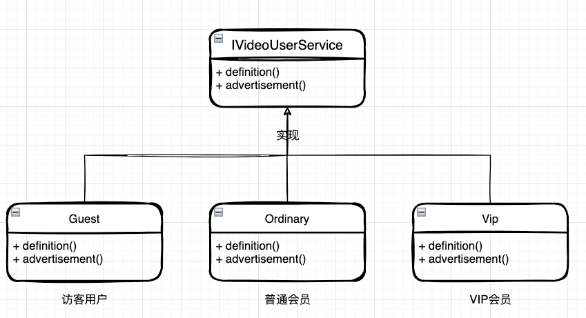


### 1.2 开闭原则

扩展开放，修改关闭，开用原则规定“软件中的对象（类，模块，函数等等）应该对子扩展是开放的，但是对于修改是封的”

#### 例子：面积计算

接口

```java
public interface ICalculationArea {

    /**
     * 计算面积，长方形
     *
     * @param x 长
     * @param y 宽
     * @return 面积
     */
    double rectangle(double x, double y);

    /**
     * 计算面积，三角形
     * @param x 边长x
     * @param y 边长y
     * @param z 边长z
     * @return  面积
     *
     * 海伦公式：S=√[p(p-a)(p-b)(p-c)] 其中：p=(a+b+c)/2
     */
    double triangle(double x, double y, double z);

    /**
     * 计算面积，圆形
     * @param r 半径
     * @return 面积
     *
     * 圆面积公式：S=πr²
     */
    double circular(double r);

}
```


实现接口，实现需求

```java
public class CalculationArea implements ICalculationArea {

    private final static double π = 3.14D;

    public double rectangle(double x, double y) {
        return x * y;
    }

    public double triangle(double x, double y, double z) {
        double p = (x + y + z) / 2;
        return Math.sqrt(p * (p - x) * (p - y) * (p - z));
    }

    public double circular(double r) {
        return π * r * r;
    }

}
```


继承实现类，重写方法，扩展需求

扩展需求：我的pai需要精度更高

```java
public class CalculationAreaExt extends CalculationArea {

    private final static double π = 3.141592653D;

    @Override
    public double circular(double r) {
        return π * r * r;
    }

}
```


### 1.3 里氏替换原则

如果S是T的子类型，对于S类型的任意对象，如果将他们看作是T类型的对象，则对象的行为也理应与期望的行为一致。

子类型（subtype）必须能够替换掉他们的基类型（base type）

#### 案例：银行卡

信用卡、储蓄卡、地铁卡、饭卡

储蓄卡和信用卡 都是银行卡，都有银行卡的特性，银行卡的标准


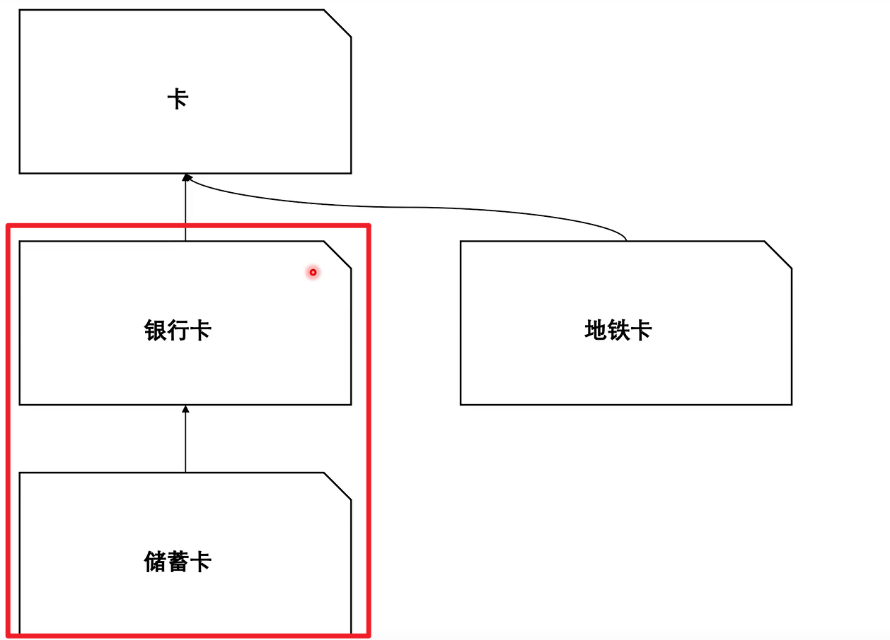

1. 银行卡

```java
public abstract class BankCard {

    private Logger logger = LoggerFactory.getLogger(BankCard.class);

    private String cardNo;   // 卡号
    private String cardDate; // 开卡时间

    public BankCard(String cardNo, String cardDate) {
        this.cardNo = cardNo;
        this.cardDate = cardDate;
    }

    abstract boolean rule(BigDecimal amount);

    // 正向入账，+ 钱
    public String positive(String orderId, BigDecimal amount) {
        // 入款成功，存款、还款
        logger.info("卡号{} 入款成功，单号：{} 金额：{}", cardNo, orderId, amount);
        return "0000";
    }

    // 逆向入账，- 钱
    public String negative(String orderId, BigDecimal amount) {
        // 入款成功，存款、还款
        logger.info("卡号{} 出款成功，单号：{} 金额：{}", cardNo, orderId, amount);
        return "0000";
    }

    /**
     * 交易流水查询
     *
     * @return 交易流水
     */
    public List<String> tradeFlow() {
        logger.info("交易流水查询成功");
        List<String> tradeList = new ArrayList<String>();
        tradeList.add("100001,100.00");
        tradeList.add("100001,80.00");
        tradeList.add("100001,76.50");
        tradeList.add("100001,126.00");
        return tradeList;
    }

    public String getCardNo() {
        return cardNo;
    }

    public String getCardDate() {
        return cardDate;
    }
}
```

2. 模拟储蓄卡功能

```java
public class CashCard extends BankCard {

    private Logger logger = LoggerFactory.getLogger(CashCard.class);

    public CashCard(String cardNo, String cardDate) {
        super(cardNo, cardDate);
    }

    boolean rule(BigDecimal amount) {
        return true;
    }

    /**
     * 提现
     *
     * @param orderId 单号
     * @param amount  金额
     * @return 状态码 0000成功、0001失败、0002重复
     */
    public String withdrawal(String orderId, BigDecimal amount) {
        // 模拟支付成功
        logger.info("提现成功，单号：{} 金额：{}", orderId, amount);
        return super.negative(orderId, amount);
    }

    /**
     * 储蓄
     *
     * @param orderId 单号
     * @param amount  金额
     */
    public String recharge(String orderId, BigDecimal amount) {
        // 模拟充值成功
        logger.info("储蓄成功，单号：{} 金额：{}", orderId, amount);
        return super.positive(orderId, amount);
    }

    /**
     * 风险校验
     *
     * @param cardNo  卡号
     * @param orderId 单号
     * @param amount  金额
     * @return 状态
     */
    public boolean checkRisk(String cardNo, String orderId, BigDecimal amount) {
        // 模拟风控校验
        logger.info("风控校验，卡号：{} 单号：{} 金额：{}", cardNo, orderId, amount);
        return true;
    }

}

```

2. 模拟信用卡功能

```java
public class CreditCard extends CashCard {

    private Logger logger = LoggerFactory.getLogger(CreditCard.class);

    public CreditCard(String cardNo, String cardDate) {
        super(cardNo, cardDate);
    }

    boolean rule2(BigDecimal amount) {
        return amount.compareTo(new BigDecimal(1000)) <= 0;
    }

    /**
     * 提现，信用卡贷款
     *
     * @param orderId 单号
     * @param amount  金额
     * @return 状态码
     */
    public String loan(String orderId, BigDecimal amount) {
        boolean rule = rule2(amount);
        if (!rule) {
            logger.info("生成贷款单失败，金额超限。单号：{} 金额：{}", orderId, amount);
            return "0001";
        }
        // 模拟生成贷款单
        logger.info("生成贷款单，单号：{} 金额：{}", orderId, amount);
        // 模拟支付成功
        logger.info("贷款成功，单号：{} 金额：{}", orderId, amount);
        return super.negative(orderId, amount);

    }

    /**
     * 还款，信用卡还款
     *
     * @param orderId 单号
     * @param amount  金额
     * @return 状态码
     */
    public String repayment(String orderId, BigDecimal amount) {
        // 模拟生成还款单
        logger.info("生成还款单，单号：{} 金额：{}", orderId, amount);
        // 模拟还款成功
        logger.info("还款成功，单号：{} 金额：{}", orderId, amount);
        return super.positive(orderId, amount);
    }

}

```


### 1.4 迪米特原则

最少知道、减少依赖；**talk only to your immediate friends**

#### 学校管理的案例2.4.1

让校长关注老师，老师关注学生

校长不直接关注学生

1. 老师

```java
public class Teacher {

    private String name;                // 老师名称
    private String clazz;               // 班级
    private static List<Student> studentList;  // 学生

    public Teacher() {
    }

    public Teacher(String name, String clazz) {
        this.name = name;
        this.clazz = clazz;
    }

    static {
        studentList = new ArrayList<>();
        studentList.add(new Student("花花", 10, 589));
        studentList.add(new Student("豆豆", 54, 356));
        studentList.add(new Student("秋雅", 23, 439));
        studentList.add(new Student("皮皮", 2, 665));
        studentList.add(new Student("蛋蛋", 19, 502));
    }

    // 总分
    public double clazzTotalScore() {
        double totalScore = 0;
        for (Student stu : studentList) {
            totalScore += stu.getGrade();
        }
        return totalScore;
    }

    // 平均分
    public double clazzAverageScore(){
        double totalScore = 0;
        for (Student stu : studentList) {
            totalScore += stu.getGrade();
        }
        return totalScore / studentList.size();
    }

    // 班级人数
    public int clazzStudentCount(){
        return studentList.size();
    }

    public static List<Student> getStudentList() {
        return studentList;
    }

    public String getName() {
        return name;
    }

    public String getClazz() {
        return clazz;
    }
}

```

2. 学生

```java
public class Student {

    private String name;    // 学生姓名
    private int rank;       // 考试排名(总排名)
    private double grade;   // 考试分数(总分)

    public Student() {
    }

    public Student(String name, int rank, double grade) {
        this.name = name;
        this.rank = rank;
        this.grade = grade;
    }

    public String getName() {
        return name;
    }

    public void setName(String name) {
        this.name = name;
    }

    public int getRank() {
        return rank;
    }

    public void setRank(int rank) {
        this.rank = rank;
    }

    public double getGrade() {
        return grade;
    }

    public void setGrade(double grade) {
        this.grade = grade;
    }
}
```


3. 校长

```java
public class Principal {

    private Teacher teacher = new Teacher("丽华", "3年1班");

    // 查询班级信息，总分数、学生人数、平均值
    public Map<String, Object> queryClazzInfo(String clazzId) {
        // 获取班级信息；学生总人数、总分、平均分
        int stuCount = teacher.clazzStudentCount();
        double totalScore = teacher.clazzTotalScore();
        double averageScore = teacher.clazzAverageScore();

        // 组装对象，实际业务开发会有对应的类
        Map<String, Object> mapObj = new HashMap<>();
        mapObj.put("班级", teacher.getClazz());
        mapObj.put("老师", teacher.getName());
        mapObj.put("学生人数", stuCount);
        mapObj.put("班级总分数", totalScore);
        mapObj.put("班级平均分", averageScore);
        return mapObj;
    }
}

```


### 1.5 接口隔离原则

更小的接口、更具体的接口

分治，抽象成更小的功能点

#### 案例：王者荣耀技能

王者英雄，英雄技能接口，不使用设计模式

```java
public interface ISkill {

    // 射箭
    void doArchery();

    // 隐袭
    void doInvisible();

    // 沉默
    void doSilent();

    // 眩晕
    void doVertigo();

}
```

**优化**：分解接口

```java
public interface ISkillArchery {

    // 射箭
    void doArchery();

}
```

```java
public interface ISkillInvisible {

    // 隐袭
    void doInvisible();

}
```

```java
public interface ISkillSilent {

    // 沉默
    void doSilent();

}
```

```java
public interface ISkillVertigo {

    // 眩晕
    void doVertigo();

}
```


**实现接口**

王者英雄，后裔

```java
public class HeroHouYi implements ISkillArchery, ISkillInvisible, ISkillSilent {

    @Override
    public void doArchery() {
        System.out.println("后裔的灼日之矢");
    }

    @Override
    public void doInvisible() {
        System.out.println("后裔的隐身技能");
    }

    @Override
    public void doSilent() {
        System.out.println("后裔的沉默技能");
    }

}
```


### 1.6 依赖倒置原则

下级依赖上级，细节依赖抽象；依赖接口、降低耦合

程序要依赖于抽象接口，不要依赖于具体实现。

#### 案例：用户抽奖

随机抽奖、权重抽奖

* 抽奖用户

```java
public class BetUser {

    private String userName;  // 用户姓名
    private int userWeight;   // 用户权重

    public BetUser() {
    }

    public BetUser(String userName, int userWeight) {
        this.userName = userName;
        this.userWeight = userWeight;
    }

    public String getUserName() {
        return userName;
    }

    public void setUserName(String userName) {
        this.userName = userName;
    }

    public int getUserWeight() {
        return userWeight;
    }

    public void setUserWeight(int userWeight) {
        this.userWeight = userWeight;
    }
}
```


* 抽奖接口

```java
public interface IDraw {

    List<BetUser> prize(List<BetUser> list, int count);

}
```

* 随机抽奖实现类

```java
public class DrawRandom implements IDraw {

    @Override
    public List<BetUser> prize(List<BetUser> list, int count) {
        // 集合数量很小直接返回
        if (list.size() <= count) return list;
        // 乱序集合
        Collections.shuffle(list);
        // 取出指定数量的中奖用户
        List<BetUser> prizeList = new ArrayList<>(count);
        for (int i = 0; i < count; i++) {
            prizeList.add(list.get(i));
        }
        return prizeList;
    }

}
```


* 权重抽奖实现类

```java
public class DrawWeightRank implements IDraw {

    @Override
    public List<BetUser> prize(List<BetUser> list, int count) {
        // 按照权重排序
        list.sort((o1, o2) -> {
            int e = o2.getUserWeight() - o1.getUserWeight();
            if (0 == e) return 0;
            return e > 0 ? 1 : -1;
        });
        // 取出指定数量的中奖用户
        List<BetUser> prizeList = new ArrayList<>(count);
        for (int i = 0; i < count; i++) {
            prizeList.add(list.get(i));
        }
        return prizeList;
    }

}
```


* 抽奖控制

```java
public class DrawControl {

    private IDraw draw;

    public List<BetUser> doDraw(IDraw draw, List<BetUser> betUserList, int count) {
        return draw.prize(betUserList, count);
    }

}
```


### 1.7 总结

以上就是6个设计模式准则，重申一遍，准则很重要，不遵守以上准则，可能写代码很爽，但是改代码就你懂得~

接下来就是设计模式的落地，这个阶段会发现，案例特别简单，但是实际使用设计模式的时候，结合业务分析，就会显得特别复杂；因此，设计模式的应用或者落地，离不开开发经验和大量的实践试错等。

tips：

很多时候我们觉得不需要设计模式，可能需求简单不需要？项目周期短，设计模式浪费时间？不知道用哪个？

经验告诉我，如果代码需要长期维护，那么初期开始使用设计模式对于后续改代码的帮助是很大的，特别是需求变更，补丁修复等，都不至于变成*山代码~

有时间的话，最好留下“图纸”

## 2. 创建者模式（5节）

### 2.1 工厂(方法)模式

工厂方法模式，经常和策略模式等结合使用

#### 一般开发步骤

1. 定义属性
2. 定义方法
3. 调用展示


* 简单工厂
  * 提供方法的工厂

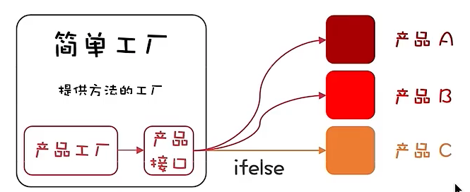

工厂模式又称工厂方法模式，是一种创建型设计模式，其在父类中提供一个创建对象的方法，允许子类决定实例化对象的模型。

* 工厂方法模式
  * 提供工厂的方法

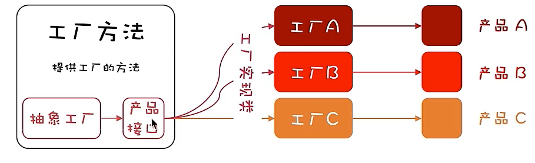

* 抽象工厂模式
  * 提供组合工厂的方法

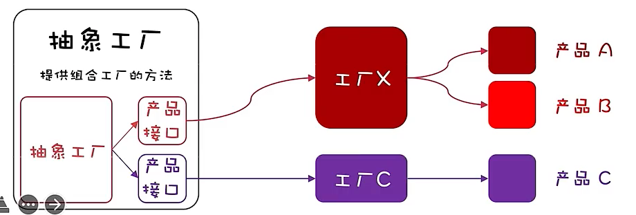

#### 案例（简单工厂）

多种类型商品不同 接⼝，统⼀发奖服务搭建场景

* 发放商品接口

```java
public interface ICommodity {

    void sendCommodity(String uId, String commodityId, String bizId, Map<String, String> extMap) throws Exception;

}
```


* 商品类型一：爱奇艺兑换卡，实现类

```java
public class CardCommodityService implements ICommodity {

    private Logger logger = LoggerFactory.getLogger(CardCommodityService.class);

    // 模拟注入
    private IQiYiCardService iQiYiCardService = new IQiYiCardService();

    public void sendCommodity(String uId, String commodityId, String bizId, Map<String, String> extMap) throws Exception {
        String mobile = queryUserMobile(uId);
        iQiYiCardService.grantToken(mobile, bizId);
        logger.info("请求参数[爱奇艺兑换卡] => uId：{} commodityId：{} bizId：{} extMap：{}", uId, commodityId, bizId, JSON.toJSON(extMap));
        logger.info("测试结果[爱奇艺兑换卡]：success");
    }

    private String queryUserMobile(String uId) {
        return "15200101232";
    }

}
```

* 商品类型二：优惠券，实现类

```java
public class CouponCommodityService implements ICommodity {

    private Logger logger = LoggerFactory.getLogger(CouponCommodityService.class);

    private CouponService couponService = new CouponService();

    public void sendCommodity(String uId, String commodityId, String bizId, Map<String, String> extMap) throws Exception {
        CouponResult couponResult = couponService.sendCoupon(uId, commodityId, bizId);
        logger.info("请求参数[优惠券] => uId：{} commodityId：{} bizId：{} extMap：{}", uId, commodityId, bizId, JSON.toJSON(extMap));
        logger.info("测试结果[优惠券]：{}", JSON.toJSON(couponResult));
        if (!"0000".equals(couponResult.getCode())) throw new RuntimeException(couponResult.getInfo());
    }

}
```

* 商品类型三：实物商品，实现类

```java
public class GoodsCommodityService implements ICommodity {

    private Logger logger = LoggerFactory.getLogger(GoodsCommodityService.class);

    private GoodsService goodsService = new GoodsService();

    public void sendCommodity(String uId, String commodityId, String bizId, Map<String, String> extMap) throws Exception {
        DeliverReq deliverReq = new DeliverReq();
        deliverReq.setUserName(queryUserName(uId));
        deliverReq.setUserPhone(queryUserPhoneNumber(uId));
        deliverReq.setSku(commodityId);
        deliverReq.setOrderId(bizId);
        deliverReq.setConsigneeUserName(extMap.get("consigneeUserName"));
        deliverReq.setConsigneeUserPhone(extMap.get("consigneeUserPhone"));
        deliverReq.setConsigneeUserAddress(extMap.get("consigneeUserAddress"));

        Boolean isSuccess = goodsService.deliverGoods(deliverReq);

        logger.info("请求参数[实物商品] => uId：{} commodityId：{} bizId：{} extMap：{}", uId, commodityId, bizId, JSON.toJSON(extMap));
        logger.info("测试结果[实物商品]：{}", isSuccess);

        if (!isSuccess) throw new RuntimeException("实物商品发放失败");
    }

    private String queryUserName(String uId) {
        return "花花";
    }

    private String queryUserPhoneNumber(String uId) {
        return "15200101232";
    }

}
```

* 工厂类

根据不同的配置，可以生成不同的实例，发放不同的商品，经常使用在spring项目中，根据不同配置，调用不同的实现类的方法

```java
public class StoreFactory {

    /**
     * 奖品类型方式实例化
     * @param commodityType 奖品类型
     * @return              实例化对象
     */
    public ICommodity getCommodityService(Integer commodityType) {
        if (null == commodityType) return null;
        if (1 == commodityType) return new CouponCommodityService();
        if (2 == commodityType) return new GoodsCommodityService();
        if (3 == commodityType) return new CardCommodityService();
        throw new RuntimeException("不存在的奖品服务类型");
    }

    /**
     * 奖品类信息方式实例化
     * @param clazz 奖品类
     * @return      实例化对象
     */
    public ICommodity getCommodityService(Class<? extends ICommodity> clazz) throws IllegalAccessException, InstantiationException {
        if (null == clazz) return null;
        return clazz.newInstance();
    }

}
```


### 2.2 抽象工厂

相比工厂，多了一层车间适配器，作用是生产对应的工厂


#### 案例

集群扩展搭建

### 2.3 建造者模式

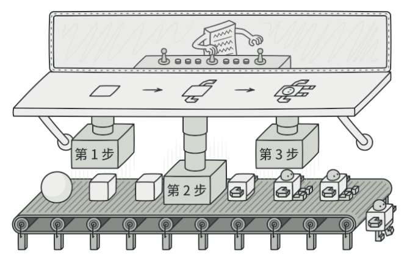

建造者模式所完成的内容就是通过将多个简单对象通过⼀步步的组装构建出⼀个复杂对象的过程。

#### 案例

装修材料组合成特定装修风格

代码参考：6.0-2

### 2.4 原型模式

用于创建重复的对象，但是又能保证性能

#### 案例

在线考试，题目和答案混排

代码参考7.0-2


### 2.5 单例模式

创建一个对象，大家共用

**创建原则**

1. 私有构造（阻止类被通过常规方法实例化）
2. 以静态方法或者枚举返回实例。（保证实例的唯一性）
3. 确保实例只有一个，尤其是多线程环境。(保证在创建实例时
   的线程安全）
4. 确保反序列化时不会重新构建对条。(在有序列化反序列化的
   场景下防止单例被莫名破坏，造成未考虑到的后果）


**主要处理手段**

1. 主动处理
   * synchronize
   * volatile
   * cas
2. jvm机制
   * 由静态初始化器（在静态字段上或static{}块中的初始化器）初始化数据时
   * 访问firial字段时
   * 在创建线程之前创建对象时
   * 线程可以看见它将要处理的对象时


单例模式分类

饿汉模式、懒汉模式（线程安全）、双重锁懒汉模式（线程不安全）、静态内部类模式、枚举模式


## 3. 结构型模式(7节)

### 3.1 适配器模式

汽车的变速箱

适配器可以理解是两个不兼容的接口之间的桥梁

#### 案例

mq消息和接口适配

参考9.0-2

相当于，我提供一个接口，把一个接口返回的数据，**转换**成另一个接口可以接受的数据


### 3.2 桥接模式

植物嫁接，秃头植发

支付渠道（微信，支付宝）<<------ 桥接 ------>>支付模式（人脸识别，指纹识别，密码识别）

#### 案例：支付

代码参考10.0-2


### 3.3 组合模式

组合模式（Composite Pattern），又叫部分整体模式，是用于把一组相似的对象当作一个单一的对象。

组合模式依据树形结构来组合对象，用来表示部分以及整体层次。这种类型的设计模式属于结构型模式，它创建了对象组的树形结构。

二叉决策树

#### 案例：根据性别年龄进行营销

代码参考11.0-2


### 3.4 装饰器模式

装饰器模式（Decorator Pattern）允许向一个现有的对象添加新的功能，同时又不改变其结构。它是作为现有的类的一个包装。

QQ秀，包装

抽象类实现接口，扩展类继承抽象类，

#### 案例：扩展SSO登录

代码参考12.0-2

抽象类实现原有接口，扩展类继承抽象类，再扩展原有功能（添加新的特性，比如说sso校验通过后，再校验某个字段）

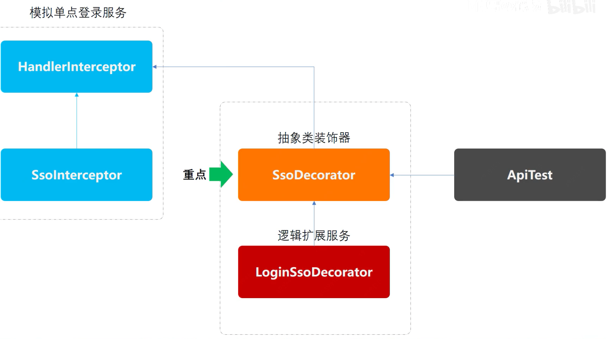


### 3.5 外观模式

外观（Facade）模式又叫作门面模式，是一种通过为多个复杂的子系统提供一个一致的接口，而使这些子系统更加容易被访问的模式。该模式对外有一个统一接口，外部应用程序不用关心内部子系统的具体细节，这样会大大降低应用程序的复杂度，提高了程序的可维护性。

服务治理，封装子系统，切面编程，提供统一白名单

#### 案例：统一白名单

代码参考13.0-2

一般是配置注解，使用切面，进行门面验证等


### 3.6 享元模式

享元模式（Flyweight Pattern）主要用于减少创建对象的数量，以减少内存占用和提高性能。这种类型的设计模式属于结构型模式，它提供了减少对象数量从而改善应用所需的对象结构的方式。

享元模式的主要优点是：相同对象只要保存一份，这降低了系统中对象的数量，从而降低了系统中细粒度对象给内存带来的压力。

其主要缺点是：

1. 为了使对象可以共享，需要将一些不能共享的状态外部化，这将增加程序的复杂性。
2. 读取享元模式的外部状态会使得运行时间稍微变长。

#### 案例：从缓存中取数据

代码参考14.0-2


### 3.7 代理模式

代理模式的定义：由于某些原因需要给某对象提供一个代理以控制对该对象的访问。这时，访问对象不适合或者不能直接引用目标对象，代理对象作为访问对象和目标对象之间的中介。

代理模式的主要优点有：

- 代理模式在客户端与目标对象之间起到一个中介作用和保护目标对象的作用；
- 代理对象可以扩展目标对象的功能；
- 代理模式能将客户端与目标对象分离，在一定程度上降低了系统的耦合度，增加了程序的可扩展性


其主要缺点是：

- 代理模式会造成系统设计中类的数量增加
- 在客户端和目标对象之间增加一个代理对象，会造成请求处理速度变慢；
- 增加了系统的复杂度；

> 那么如何解决以上提到的缺点呢？答案是可以使用动态代理方式


#### 案例：模拟mybatis定义DAO接口，使用代理方式操作数据库

代码参考15.0-0


## 4. 行为模式(10节）


### 4.1 责任链模式

责任链（Chain of Responsibility）模式的定义：为了避免请求发送者与多个请求处理者耦合在一起，于是将所有请求的处理者通过前一对象记住其下一个对象的引用而连成一条链；当有请求发生时，可将请求沿着这条链传递，直到有对象处理它为止。

#### 案例：流程多级负责人审批场景

责任链抽象类

代码参考16.0-2


### 4.2 命令模式

命令（Command）模式的定义如下：将一个请求封装为一个对象，使发出请求的责任和执行请求的责任分割开。这样两者之间通过**命令对象**进行沟通，这样方便将命令对象进行储存、传递、调用、增加与管理。


#### 案例：模拟高档餐厅八大菜系，小二点单厨师烹饪场景

代码参考17.0-2


### 4.3 迭代器模式

迭代器（Iterator）模式的定义：提供一个对象来顺序访问聚合对象中的一系列数据，而**不暴露聚合对象的内部表示**。迭代器模式是一种对象行为型模式，其主要优点如下。

1. 访问一个聚合对象的内容而无须暴露它的内部表示。
2. 遍历任务交由迭代器完成，这简化了聚合类。
3. 它支持以不同方式遍历一个聚合，甚至可以自定义迭代器的子类以支持新的遍历。
4. 增加新的聚合类和迭代器类都很方便，无须修改原有代码。
5. 封装性良好，为遍历不同的聚合结构提供一个统一的接口。


其主要缺点是：增加了类的个数，这在一定程度上增加了系统的复杂性。

在日常开发中，我们几乎不会自己写迭代器。除非需要定制一个自己实现的数据结构对应的迭代器，否则，开源框架提供的 API 完全够用。

lambda

#### 案例：深度迭代遍历人员信息输出场景

代码参考18.0-0


### 4.4 中介者模式

中介者（Mediator）模式的定义：定义一个中介对象来封装一系列对象之间的交互，使原有对象之间的耦合松散，且可以独立地改变它们之间的交互。中介者模式又叫调停模式，它是迪米特法则的典型应用。

中介者模式是一种对象行为型模式，其主要优点如下。

1. 类之间各司其职，符合迪米特法则。
2. 降低了对象之间的耦合性，使得对象易于独立地被复用。
3. 将对象间的一对多关联转变为一对一的关联，提高系统的灵活性，使得系统易于维护和扩展。


其主要缺点是：中介者模式将原本多个对象直接的相互依赖变成了中介者和多个同事类的依赖关系。当同事类越多时，中介者就会越臃肿，变得复杂且难以维护。

交警，中介

#### 案例：按照Mybatis原理手写ORM框架，给JDBC方式操作数据库增加中介者场景

代码参考19.0-2


### 4.5 备忘录模式

备忘录（Memento）模式的定义：在**不破坏封装性的前提下**，捕获一个对象的内部状态，并在该对象之外保存这个状态，以便以后当需要时能将该对象恢复到原先保存的状态。该模式又叫**快照模式**。

备忘录模式是一种对象行为型模式，其主要优点如下。

- 提供了一种可以恢复状态的机制。当用户需要时能够比较方便地将数据恢复到某个历史的状态。
- 实现了内部状态的封装。除了创建它的发起人之外，其他对象都不能够访问这些状态信息。
- 简化了发起人类。发起人不需要管理和保存其内部状态的各个备份，所有状态信息都保存在备忘录中，并由管理者进行管理，这符合单一职责原则。


其主要缺点是：资源消耗大。如果要保存的内部状态信息过多或者特别频繁，将会占用比较大的内存资源。

#### 案例：模拟互联网系统上线过程中，配置文件回滚场景

代码参考20.0-0

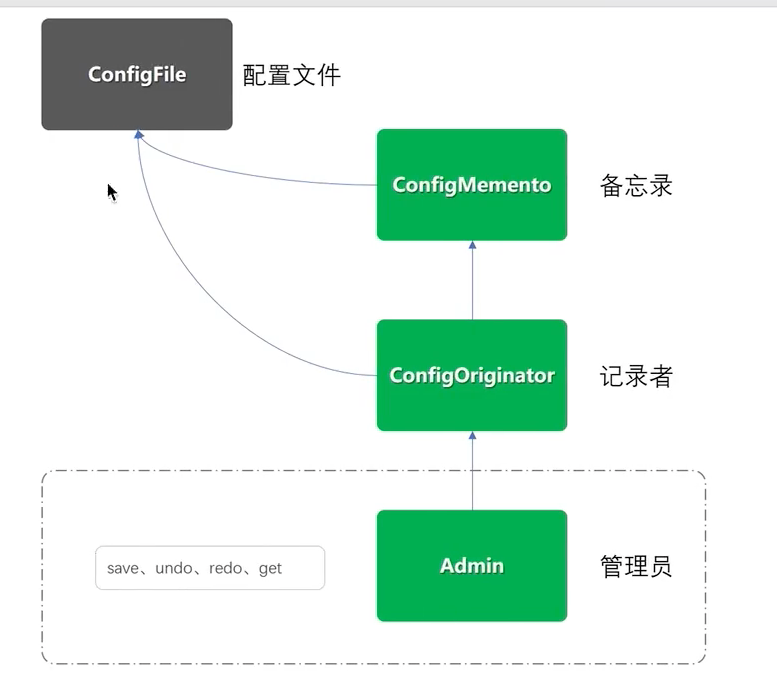


### 4.6 观察者模式

观察者（Observer）模式的定义：指多个对象间存在**一对多的依赖关系**，当一个对象的状态发生改变时，所有依赖于它的对象都得到通知并被自动更新。这种模式有时又称作**发布-订阅模式**、**模型-视图模式**，它是对象行为型模式。

观察者模式是一种对象行为型模式，其主要优点如下。

1. 降低了目标与观察者之间的耦合关系，两者之间是抽象耦合关系。符合依赖倒置原则。
2. 目标与观察者之间建立了一套触发机制。


它的主要缺点如下。

1. 目标与观察者之间的依赖关系并没有完全解除，而且有可能出现循环引用。
2. 当观察者对象很多时，通知的发布会花费很多时间，影响程序的效率。


关键词：监听，观察，一对多

#### 案例：模拟类似小客车指标摇号过程，监听消息通知用户中签场景

代码参考21.0-2

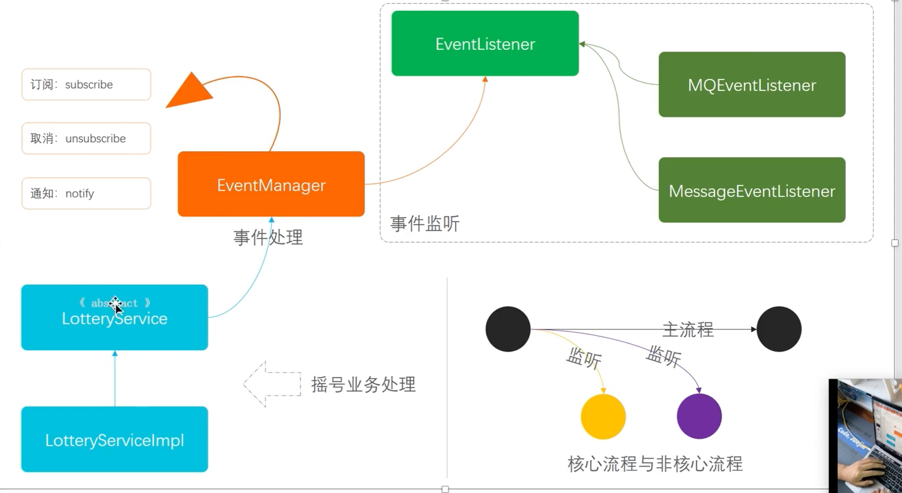


### 4.7 状态模式

状态（State）模式的定义：对有状态的对象，把复杂的“判断逻辑”提取到不同的状态对象中，允许状态对象在其内部状态发生改变时改变其行为。

状态模式是一种对象行为型模式，其主要优点如下。

1. 结构清晰，状态模式将与特定状态相关的行为局部化到一个状态中，并且将不同状态的行为分割开来，满足“单一职责原则”。
2. 将状态转换显示化，减少对象间的相互依赖。将不同的状态引入独立的对象中会使得状态转换变得更加明确，且减少对象间的相互依赖。
3. 状态类职责明确，有利于程序的扩展。通过定义新的子类很容易地增加新的状态和转换。


状态模式的主要缺点如下。

1. 状态模式的使用必然会增加系统的类与对象的个数。
2. 状态模式的结构与实现都较为复杂，如果使用不当会导致程序结构和代码的混乱。
3. 状态模式对开闭原则的支持并不太好，对于可以切换状态的状态模式，增加新的状态类需要修改那些负责状态转换的源码，否则无法切换到新增状态，而且修改某个状态类的行为也需要修改对应类的源码。


关键词：状态，内部状态，

#### 案例：营销活动审核状态流转

代码参考22.0-2

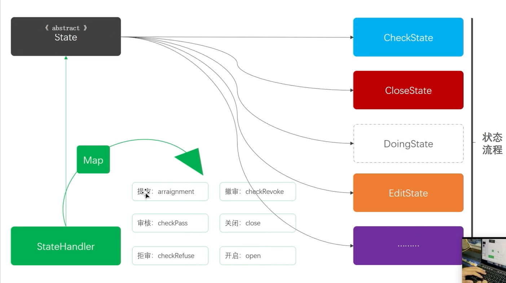


### 4.8 策略模式

策略（Strategy）模式的定义：该模式定义了一系列算法，并将每个算法封装起来，使它们可以相互替换，且算法的变化不会影响使用算法的客户。策略模式属于对象行为模式，它通过对算法进行封装，把使用算法的责任和算法的实现分割开来，并委派给不同的对象对这些算法进行管理。

策略模式的主要优点如下。

1. 多重条件语句不易维护，而使用策略模式可以避免使用多重条件语句，如 if...else 语句、switch...case 语句。
2. 策略模式提供了一系列的可供重用的算法族，恰当使用继承可以把算法族的公共代码转移到父类里面，从而避免重复的代码。
3. 策略模式可以提供相同行为的不同实现，客户可以根据不同时间或空间要求选择不同的。
4. 策略模式提供了对开闭原则的完美支持，可以在不修改原代码的情况下，灵活增加新算法。
5. 策略模式把算法的使用放到环境类中，而算法的实现移到具体策略类中，实现了二者的分离。


其主要缺点如下。

1. 客户端必须理解所有策略算法的区别，以便适时选择恰当的算法类。
2. 策略模式造成很多的策略类，增加维护难度。


关键词：算法封装，功能组

#### 案例：模拟多种营销类型优惠券，折扣金额计算策略场景

代码参考23.0-2

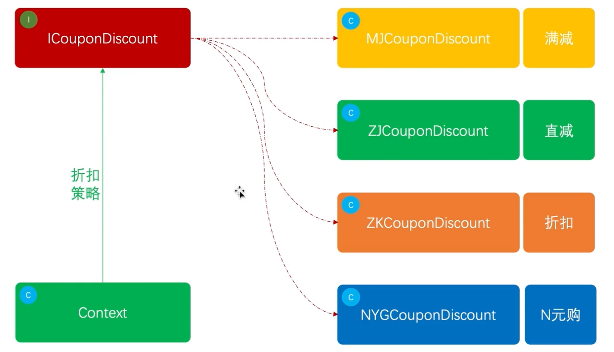


### 4.9 模板模式

模板方法（Template Method）模式的定义如下：定义一个操作中的算法骨架，而将算法的一些步骤延迟到子类中，使得子类可以不改变该算法结构的情况下重定义该算法的某些特定步骤。它是一种类行为型模式。

该模式的主要优点如下。

1. 它封装了不变部分，扩展可变部分。它把认为是不变部分的算法封装到父类中实现，而把可变部分算法由子类继承实现，便于子类继续扩展。
2. 它在父类中提取了公共的部分代码，便于代码复用。
3. 部分方法是由子类实现的，因此子类可以通过扩展方式增加相应的功能，符合开闭原则。


该模式的主要缺点如下。

1. 对每个不同的实现都需要定义一个子类，这会导致类的个数增加，系统更加庞大，设计也更加抽象，间接地增加了系统实现的复杂度。
2. 父类中的抽象方法由子类实现，子类执行的结果会影响父类的结果，这导致一种反向的控制结构，它提高了代码阅读的难度。
3. 由于继承关系自身的缺点，如果父类添加新的抽象方法，则所有子类都要改一遍。


关键词：定义模板（抽象方法），根据实际业务实现继承类

#### 案例：模拟爬虫各类电商商品，生成营销推广海报场景

代码参考24.0-0


### 4.10 访问者模式

访问者（Visitor）模式的定义：将作用于某种数据结构中的各元素的操作分离出来封装成独立的类，使其在不改变数据结构的前提下可以添加作用于这些元素的新的操作，为数据结构中的每个元素**提供多种访问方式**。它将**对数据的操作与数据结构进行分离**，是行为类模式中最复杂的一种模式。

访问者（Visitor）模式是一种对象行为型模式，其主要优点如下。

1. 扩展性好。能够在不修改对象结构中的元素的情况下，为对象结构中的元素添加新的功能。
2. 复用性好。可以通过访问者来定义整个对象结构通用的功能，从而提高系统的复用程度。
3. 灵活性好。访问者模式将数据结构与作用于结构上的操作解耦，使得操作集合可相对自由地演化而不影响系统的数据结构。
4. 符合单一职责原则。访问者模式把相关的行为封装在一起，构成一个访问者，使每一个访问者的功能都比较单一。


访问者（Visitor）模式的主要缺点如下。

1. 增加新的元素类很困难。在访问者模式中，每增加一个新的元素类，都要在每一个具体访问者类中增加相应的具体操作，这违背了“开闭原则”。
2. 破坏封装。访问者模式中具体元素对访问者公布细节，这破坏了对象的封装性。
3. 违反了依赖倒置原则。访问者模式依赖了具体类，而没有依赖抽象类。

关键词：封装属性访问方式，提供访问者多种访问属性的方式，扩展性好

#### 案例：模拟家长与校长，对学生和老师的不同视角信息的访问场景

代码参考25.0-0


完结撒花~

记得主要是实践中体会设计模式的精髓，切记不能硬套某个设计模式，往往会产生反作用


