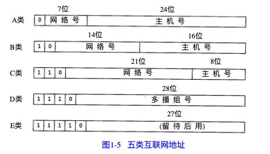
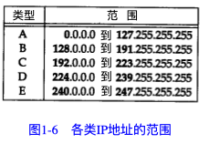
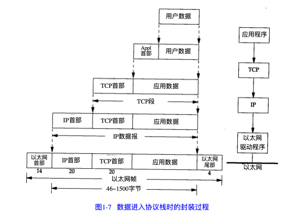
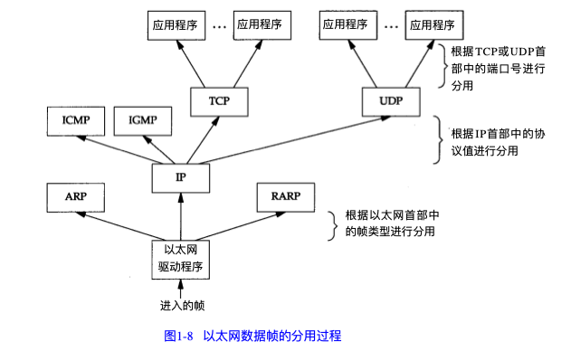
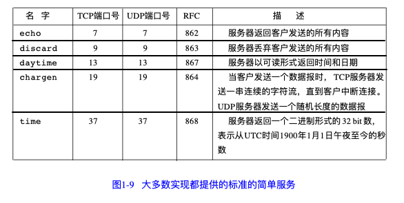
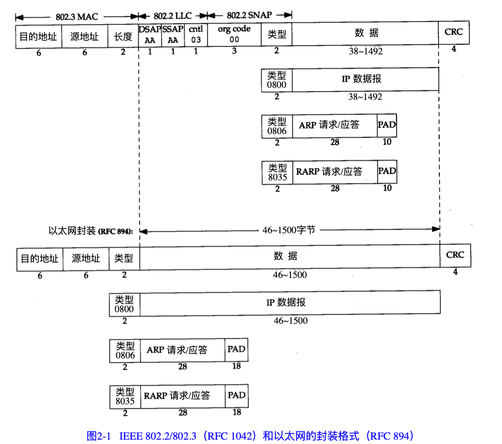
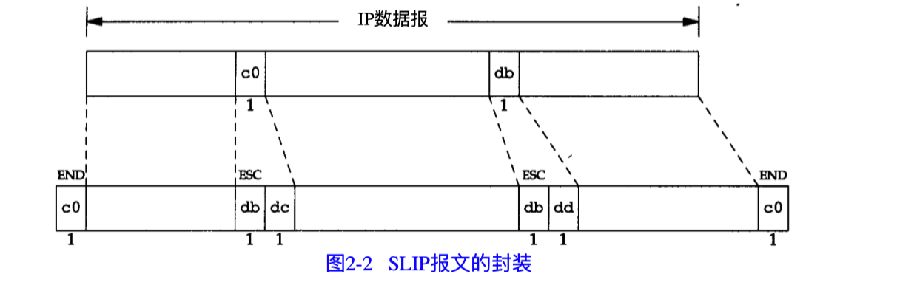
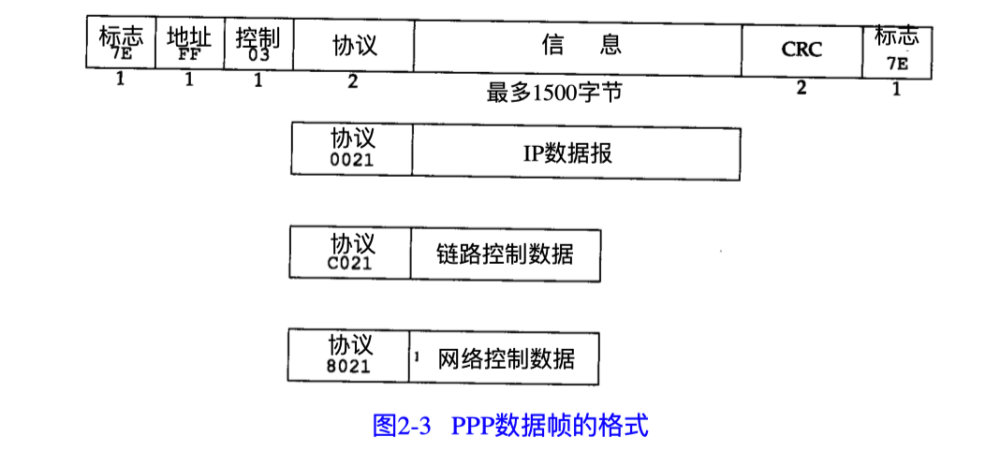
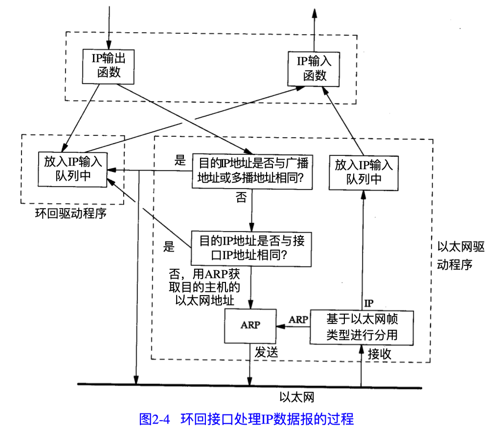
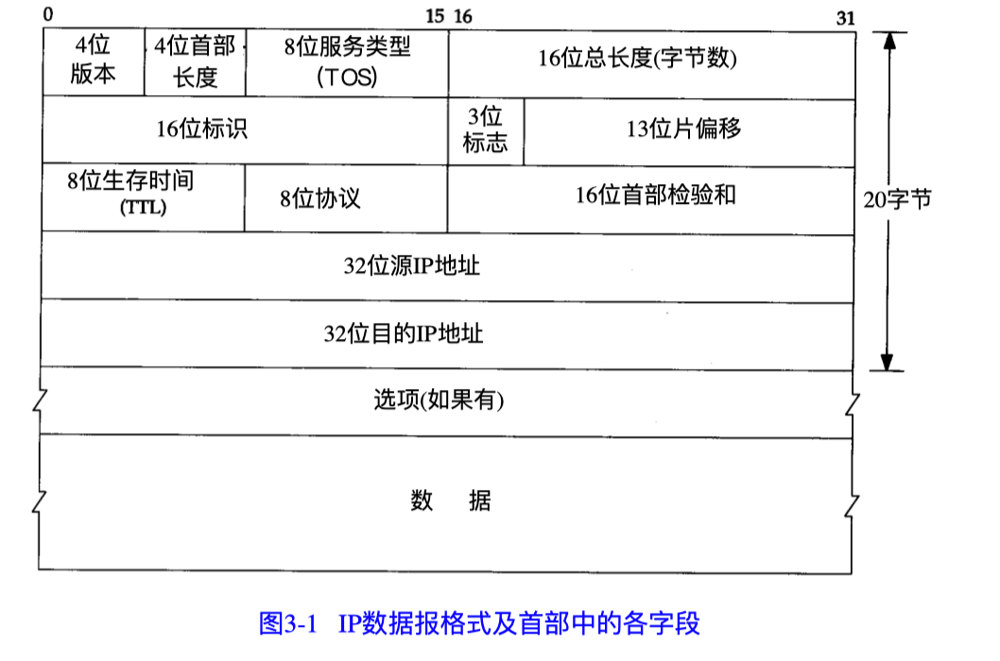

---
使用书籍TCP/IP详解卷1 第一版
---


# 第1章：概述

### 1.4 互联网的地址

互联网上的每个接口必须有一个唯一的 Internet地址（也称作 I P地址）。 I P地址长32 bit。 Internet地址并不采用平面形式的地址空间，如 1、2、3等。 IP地址具有一定的结构，五类不同 的互联网地址格式如图1-5所示。



各类IP地址的范围：




### 1.5 域名系统

在 TCP/IP领域中，域名系统（ D N S）是一个分布的数据库，由它来提供 I P地址和 主机名之间的映射信息。

### 1.6 封装

每一层对收到的数据都要增加一些首部信息（有时还要增加尾部 信息），该过程如图 1 - 7所示。




TCP传给I P的数据单元称作 TCP报文段或简称为 TCP段（TCP segment）。IP传给网络接口层的数据单元称作 IP数据报(IP datagram)。通过以太网传输的比特 流称作帧(Frame)。

U D P数据与 TCP数据基本一致。 唯一的不同是 U D P传给I P的信息单元称作 U D P数据报 （UDP datagram），而且UDP的首部长为8字节。


### 1.7 分用

当目的主机收到一个以太网数据帧时， 数据就开始从协议栈中由底向上升， 同时去掉各 层协议加上的报文首部。 每层协议盒都要去检查报文首部中的协议标识， 以确定接收数据的 上层协议。这个过程称作分用（ Demultiplexing），图1-8显示了该过程是如何发生的。



### 1.8 客户-服务器模型

大部分网络应用程序在编写时都假设一端是客户， 另一端是服务器， 其目的是为了让服 务器为客户提供一些特定的服务。 可以将这种服务分为两种类型：重复型或并发型。


重复型服务器主要的问题发生在 **处理客户请求** 状态。在这个时候，它不能为其他客户机提供服务。


并发服务器的优点在于它是利用生成其他服务器的方法来处理客户的请求。 也就是说， 每个客户都有它自己对应的服务器。 如果操作系统允许多任务， 那么就可以同时为多个客户服务。


一般来说， TCP服务器是并发的，而 U D P服务器是重复的， 但也存在一些例外。


### 1.9 端口号

前面已经指出过， TCP和U D P采用16 bit的端口号来识别应用程序。 那么这些端口号是如 何选择的呢？

任何TCP/IP实现所提供的服务都用知名的 1～1 0 2 3之间的端 口号。这些知名端口号由 Internet号分配机构（ Internet Assigned Numbers Authority, IANA） 来管理。


客户端通常对它所使用的端口号并不关心， 只需保证该端口号在本机上是唯一的就可以 了。客户端口号又称作临时端口号（即存在时间很短暂）。这是因为它通常只是在用户运行该 客户程序时才存在，而服务器则只要主机开着的，其服务就运行。

大多数TCP/IP实现给临时端口分配 1 0 2 4～5 0 0 0之间的端口号。


### 1.10 标准化过程

究竟是谁控制着 TCP/IP协议族， 又是谁在定义新的标准以及其他类似的事情？事实上， 有四个小组在负责Internet技术。

1. Internet协会（ISOC， Internet Society）
2. Internet体系结构委员会（IAB，Internet Architecture Board）
3. Internet工程专门小组（IETF，Internet Engineering Task Force）
4. Internet研究专门小组（IRIF，Internet Research Task Force）


### 1.11 RFC

所有关于Internet的正式标准都以R F C（Request for Comment）文档出版。另外，大量的 R F C并不是正式的标准，出版的目的只是为了提供信息。


### 1.12 标准的简单服务

有一些标准的简单服务几乎每种实现都要提供。




### 1.13 互联网

internet意思是用一个共同的协议族把多个网络连接在一起。而 Internet指的是世界范围内 通过TCP/IP互相通信的所有主机集合（超过 100万台）。Internet是一个internet，但internet不等 于Internet。


### 1.14 实现

### 1.15 应用编程接口

使用T C P / I P协议的应用程序通常采用两种应用编程接口（A P I）：s o c k e t和T L I（运输层接口：Transport Layer Interface）

### 1.16 测试网络

### 1.17 小结

T C P / I P协议族分为四层：链路层、网络层、运输层和应用层， 每一层各有不同的责任。

在T C P / I P中，网络层和运输层之间的区别是最为关键的：网络层（ I P）提供点到点的服务， 而运输层（TCP和UDP）提供端到端的服务。

构造互联网的共同基石是路由器，它们在 I P层把网络连在一 起。

在一个互联网上，每个接口都用 I P地址来标识，尽管用户习惯使用主机名而不是 I P地址。 域名系统为主机名和 I P地址之间提供动态的映射。 端口号用来标识互相通信的应用程序。 服 务器使用知名端口号，而客户使用临时设定的端口号。


# 第2章：链路层

### 2.1 引言

链路层主要有三个目的

1. 为I P模块发送和 接收I P数据报
2. 为A R P模块发送A R P请求和接收A R P应答；
3. 为R A R P发送R A R P请 求和接收RARP应答

M T U（最大传输单元）

FDDI（光纤分布式数据接口）

RS-232串行线路

环回（ l o o p b a c k）驱动程序


### 2.2 以太网和IEEE 802封装

以太网这个术语一般是指数字设备公司（ Digital Equipment Corp.）、英特尔公司（ I n t e l C o r p .）和X e r o x公司在1 9 8 2年联合公布的一个标准。

以太网的类型字段定义了后续数据的类型。


这里要注意不同协议定义的帧格式不同




### 2.3 尾部封装

RFC 893[Leffler and Karels 1984]

这是一个早期 B S D系统在DEC VA X机上运行时的试验格式， 它通过 调整I P数据报中字段的次序来提高性能。

尾部封装已遭到反对


### 2.4 SLIP：串行线路IP

SLIP的全称是Serial Line IP。它是一种在串行线路上对 IP数据报进行封装的简单形式

下面的规则描述了SLIP协议定义的帧格式：

1. IP数据报以一个称作 E N D（0 x c 0）的特殊字符结束。 同时， 为了防止数据报到来之前 的线路噪声被当成数据报内容，大多数实现在数据报的开始处也传一个 E N D字符
2. 如果I P报文中某个字符为 E N D， 那么就要连续传输两个字节 0 x d b和0 x d c来取代它。
3. 如果I P报文中某个字符为 S L I P的E S C字符，那么就要连续传输两个字节 0 x d b和0 x d d来 取代它。





SLIP是一种简单的帧封装方法，缺点

1. 每一端必须知道对方的IP地址。没有办法把本端的 IP地址通知给另一端
2. 数据帧中没有类型字段（类似于以太网中的类型字段）。如果一条串行线路用于 S L I P， 那么它不能同时使用其他协议。
3. S L I P没有在数据帧中加上检验和（类似于以太网中的 C R C字段）。如果S L I P传输的报 文被线路噪声影响而发生错误， 只能通过上层协议来发现

尽管存在这些缺点， SLIP仍然是一种广泛使用的协议。

### 2.5 压缩的SLIP

由于串行线路的速率通常较低（ 19200 b/s或更低），而且通信经常是交互式的

因为这些性能上的缺陷，于是人们提出一个被称作 C S L I P（即压缩S L I P）的新协议， 它在RFC 1144[Jacobson 1990a]中被详细描述。


### 2.6 PPP：点对点协议

PPP，点对点协议修改了SLIP协议中的所有缺陷。 PPP包括以下三个部分：

1. 在串行链路上封装 I P数据报的方法。 P P P既支持数据为 8位和无奇偶检验的异步模式 （如大多数计算机上都普遍存在的串行接口），还支持面向比特的同步链接。
2. 建立、配置及测试数据链路的链路控制协议（ LCP：Link Control Protocol）。它允许通 信双方进行协商，以确定不同的选项。
3. 针对不同网络层协议的网络控制协议（ N C P：Network Control Protocol）体系。


P P P数据 帧的格式。




**数据帧的组成**

前3个字节：每一帧都以标志字符0x7e开始和结束。紧接着是一个地址字节，值始终是 0xff，然后是一 个值为0x03的控制字节。

协议字段，类似于以太网中类型字段的功能。当它的值为 0 x 0 0 2 1时， 表示信息 字段是一个 I P数据报；值为 0 x c 0 2 1时，表示信息字段是链路控制数据；值为 0 x 8 0 2 1时， 表示 信息字段是网络控制数据。

每一帧都以标志字符0x7e开始和结束。紧接着是一个地址字节，值始终是 0xff，然后是一 个值为0x03的控制字节。


**优点**

PPP比SLIP具有下面这些优点：

1. PPP支持在单根串行线路上运行多种协议， 不只是I P协议；
2. 每一帧都有循环冗余检验； 
3. 通信双方可以进行 I P地址的动态协商(使用 I P网络控制协议)； 
4. 与C S L I P类似，对T C P和I P报文首部进行压缩； 
5. 链路控制协议可以 对多个数据链路选项进行设置。


为这些优点付出的代价是在每一帧的首部增加 3个字节，当建 立链路时要发送几帧协商数据，以及更为复杂的实现。


### 2.7 环回接口

大多数的产品都支持环回接口（ Loopback Interface），以允许运行在同一台主机上的客户 程序和服务器程序通过 T C P / I P进行通信。 A类网络号1 2 7就是为环回接口预留的。 根据惯例， 大多数系统把I P地址1 2 7 . 0 . 0 . 1分配给这个接口，并命名为 l o c a l h o s t。一个传给环回接口的 I P数 据报不能在任何网络上出现。


一旦传输层检测到目的端地址是环回地址时， 应该可以省略部分传输层和所 有网络层的逻辑操作




### 2.8 最大传输单元MTU

以太网和 802.3对数据帧的长度都有一个限制，其最大值分别是 1 5 0 0和1 4 9 2字节。

链路层的这个特性称作 网 络 MTU字节 M T U， 最大传输单元。

如果 I P层有一个数据报要传， 而且数 据的长度比链路层的 M T U还大，那么 I P层就需要进行分片（ f r a g m e n t a t i o n）， 把数据 报分成若干片， 这样每一片都小于 M T U。


### 2.9 路径MTU

两台通信主机路径中的最小 M T U。它被称作路 径MTU。


### 2.10 串行线路吞吐量计算


### 2.11 小结

本章讨论了 I n t e r n e t协议族中的最底层协议， 链路层协议。 我们比较了以太网和 I E E E 8 0 2 . 2 / 8 0 2 . 3的封装格式，以及 S L I P和P P P的封装格式。

大多数的实现都提供环回接口。 访问这个接口可以通过特殊的环回地址， 一般为 127.0.0.1。

我们描述了很多链路都具有的一个重要特性， M T U，相关的一个概念是路径 M T U。


本章的内容只覆盖了当今 T C P / I P所采用的部分数据链路公共技术。 T C P / I P成功的原因之 一是它几乎能在任何数据链路技术上运行。


# 第3章：IP：网际协议

### 3.1 引言


IP是TCP/IP协议族中最为核心的协议。所有的 TCP、UDP、ICMP及IGMP数据都以IP数据 报格式传输

不可靠（u n r e l i a b l e）的意思是它不能保证 I P数据报能成功地到达目的地。任何要求的可靠性必须由上层来 提供（如TCP）。

无连接（c o n n e c t i o n l e s s）这个术语的意思是 I P并不维护任何关于后续数据报的状态信息。每个数据报的处理是相互独立的。

IP地址由网络号、子网号、主机号组成

#### 什么是网络号，主机号，主机地址，网络地址，主机地址，子网号，子网地址

```
什么是网络号，主机号，主机地址，网络地址，主机地址，子网号，子网地址
在其他地方看到这段话，说的很详细，也很容易理解，所以有必要多发一遍共享。

一般一个网络，比如172.16.0.0/16，这个就是一个b类网址，有16位的掩码。也就是说前面的172.16是这个网络的网络位，后面的两个数是主机位。按照这个计算，这个网络里面就可以有2的16次方个ip，也就是从172.16.0.0一直到172.16.255.255.在这个网络里，主机位全为0的就表示网络号，标示这个网络的。也就是说172.16不变，后面的主机位都为0（二进制），所以172.16.0.0就是网络172.16.0.0/16的网络号。而网络位不变，主机位全为1，也就是172.16不变，后面变成11111111.11111111，化成十进制就是255.255，合起来就是172.16.255.255就是网络172.16.0.0/16的广播号。网络号和广播号就是这么定义的，主机位全为0的就是网络号，全为1的就是广播号。至于主机地址，就是可以分配给主机使用的地址，一个网络里面除去网络号和广播后剩下的都可以分配给主机使用，就是主机地址。我举例的这个网络里就是172.16.0.1一直到172.16.255.254。至于子网号，就是你把网络划分成多个子网之后，每个子网的网络号，和前面一样的算法。只不过子网的掩码增多了而已。还是刚才的172.16.0.0/16，最简单的把它划分为256个子网，也就是子网掩码用24位。那么也就是172.16依然是网络位不变，只不过第三个数也被用来作网络位了，这叫借位。也就是划分子网之后子网的网络地址就是前面的24位，172.16是固定的，第三个八位可以从00000000一直到11111111，每一个作为一个子网。由于子网号要求主机位为0，所以对应的每个子网的网络号就是172.16.00000000.0到172.16.11111111.0，化为10进制也就是172.16.0.0到172,16.255.0，一共256个子网。
```


### 3.2 IP首部

IP数据报的格式如图3-1所示。普通的IP首部长为20个字节，除非含有选项字段。




最高位在左边，记为 0 bit；最低位在右边，记为31 bit。

4个字节的32 bit值以下面的次序传输：首先是 0～7 bit，其次8～15 bit，然后16～23 bit， 最后是24~31 bit。这种传输次序称作big endian字节序，又称作网络字节序

TTL（time-to-live）生存时间字段设置了数据报可以经过的最多路由器数。它指定了数据 报的生存时间。 TTL的初始值由源主机设置（通常为 32或64），一旦经过一个处理它的路由器， 它的值就减去 1。当该字段的值为 0时，数据报就被丢弃，并发送 I C M P报文通知源主机。


### 3.3 IP路由选择

简单路由算法：主机把数据报发往一默认的路由器上，由路由器来转发该数据报。大多 数的主机都是采用这种简单机制

主机从不把数据报从一个接口转发到另一个接口，而路由器则要转发数据报。

I P层在 内存中有一个路由表。路由表中的每一项都包含下面这些信息：

*  目的I P地址。
  * 它既可以是一个完整的主机地址，也可以是一个网络地址
* 下一站（下一跳）
  * 下一站路由器是指一个在直接相连网络上的路由器，通过它可以转发数据报。下 一站路由器不是最终的目的，但是它可以把传送给它的数据报转发到最终目的。
* 标志
  * 其中一个标志指明目的 I P地址是网络地址还是主机地址，另一个标志指明下一 站路由器是否为真正的下一站路由器，还是一个直接相连的接口
* 网络接口
  * 为数据报的传输指定一个端口


I P路由选择是逐跳地（h o p - b y - h o p）进行的，所以IP并不知道传输过程的完整路径（主机直接相连的当我没说）

IP路由选择情况：

1. 搜索路由表，找网络号和主机号都要匹配的目的IP地址
2. 搜索路由表，寻找能与目的网络号相匹配的表目。
3. 搜索路由表，寻找标为“默认（ d e f a u l t）”的表目

如果上面这些步骤都没有成功，那么该数据报就不能被传送

### 3.4 子网寻址

不是把I P地址 看成由单纯的一个网络号和一个主机号组成，而是把主机号再分成一个子网号和一个主机号


### 3.5 子网掩码

除了I P地址以外，主机还需要知道有多少比特用于子网号及多少比特用于主机号。这是 在引导过程中通过子网掩码来确定的。这个掩码是一个 32 bit的值，其中值为 1的比特留给网 络号和子网号，为0的比特留给主机号


### 3.6 特殊情况的IP地址

### 3.7 一个子网的例子

### 3.8 ifconfig命令


### 3.9 netstat


# 第4章：ARP：地址解析协议


# 第5章：RARP：逆地址解析协议
# 第6章：ICMP：Internet控制报文协议
# 第7章：Ping程序
# 第8章：Traceroute程序
# 第9章：IP选路
# 第10章：动态选路协议
# 第11章：UDP 用户数据报协议
# 第12章：广播和多播
# 第13章：IGMP Internet组管理协议
# 第14章：DNS 域名系统
# 第15章：TFTP 简单文件传送协议
# 第16章：BOOTP：引导程序协议
# 第17章：TCP：传输控制协议
# 第18章：TCP连接的建立与终止
# 第19章：TCP的交互数据流
# 第20章：TCP的成块数据流
# 第21章：TCP的超时与重传
# 第22章：TCP的坚持定时器
# 第23章：TCP的保活定时器
# 第24章：TCP的未来和性能
# 第25章：SNMP：简单网络管理协议
# 第26章：Telnet和Rlogin：远程登录
# 第27章：FTP：文件传送协议
# 第28章：SMTP：简单邮件传送协议
# 第29章：网络文件系统
# 第30章：其他的TCP/IP应用程序
