---
中科大郑烇、杨坚全套《计算机网络（自顶向下方法 第7版，James F.Kurose，Keith W.Ross）》课程

---


# 计算机网络和互联网

Computer network and the Internet 

### 分层作用

解耦合，每一层都具备功能和向上层提供服务


### 应用层

交换应用报文，

### 传输层

为应用进程提供服务，网络层是主机到主机，传输层是进程到进程，细化了。

解决网络层不可靠，通常在这一层，TCP

### 网络端

路由器工作在网络层

提供端到端（end to end）的（源主机到目标主机，通过很多跳）（ip数据报），无保障的，是尽力而为的

路由（算出路由表，给IP协议使用）和转发是网络层的主要功能

传统的网络层的工作方式：一个IP分组传输到我这里，我查路由表，查到对应表项就转发，查不到就给到默认的路径，不具备灵活性，不具备升级和扩展的可能，不可编程扩展

现在的工作方式，SDN，分为控制平面和数据平面，具备可编程，可扩展，功能更多

#### 数据平面（交换机）


#### 控制平面

安装网络操作系统，跑网络操作应用，算流表，学习功能和应用

### 数据链路层

交换机工作在链路层

点到点的服务，通过网卡，以帧为单位

### 物理层

把数字信号，变成物理信号或者光信号灯，电磁波信号，进行发送


### 协议

让不同的厂商


### 什么是Internet


# 第一章：提纲

### 1.1 什么是Internet？


#### 网络

网络可以理解是一张图，点和路径组成

蜘蛛网，神经中枢

#### 计算机网络

##### **组成**：节点，链路，协议

**节点**：是一个点，可以是源和目的，或者是数据交换节点，取决于作用

主机及其上运行的应用程序
路由器、交换机等冈络交换设备

一般方形是主机节点（源和目的），圆形是数据交换节点（路由器，交换机，中继器）

**链路**：边，分为两类

接入网链路：主机连接到互联网的链路（连接方圆）
主干链路：路由器间的链路（连接圆圆）

**协议**：每一层相对应的实体，所遵守的一些规则，语法，语义，时序等

协议包括，报文格式、次序、动作

PDU 协议数据单元，在每一层上都有不同的语法语义

#### 互联网Internet

##### 什么是互联网

以TCP/IP为主的一簇协议，叫做互联网，目前用户最多的

从构成的角度，互联网是计算机网络的一种，所以对应计算机网络的节点+链路+协议

```
**端设备**：主机=端系统，网络应用程序，方的；分组交换设备，圆的

**通信链路**

**协议**：作用对象是对等层的实体（应用层传输层等），协议是一个规则，比方我如何解析这个报文，这个字段是什么意思，字段等于1我做什么？这些就是协议内容

互联网也叫做网络的网络，每个网络可以通过路由器等和其它网络进行互联，网络也可以包含一个小的网络

ROT 物联网
```

从服务的角度，互联网是使用通信设施进行通信的分布式应用+通信基础设施（为分布式应用提供通信服务）

```
**分布式应用**：web，email，游戏，电商，社交网络

**通信基础设施**：提供的服务类似快递服务，服务分为无连接服务和面向连接的服务


```


### 1.2 网络边缘


网络按照服务的角度可以分为这三个子系统

1. edge 边缘 **主机分布式应用**，组成是主机和应用程序，比方iPhone上的游戏
2. core 核心  **通信基础设施**，作用是数据交换（switch），组成是互联的路由器，网络的网络
3. access **接入网** 就是把边缘接入到网络核心，核心连接着各式各样的主机，这让你可以和不同主机通信，组成是有线或者无线的通信链路


#### 端系统

运行应用程序

比如web，email，在网络的边缘

#### B/S模式

主从的模式

比如邮箱，普遍的网页服务，客户端向服务端请求数据

#### P2P模式（peer-peer）

对等体模式

比如迅雷，电驴等文件下载应用，这种通讯是分布式的，我可以从其它迅雷客户端下载文件片段，别人也可以从我这个客户端下载文件片段

这些应用可能甚至没有专门的服务器，比如KaZaA、Emule


---

#### 面向连接

**可靠性**

端系统（边缘）维持面向连接（可靠的，有序的），中间（core）并不维持这种连接

这里TCP发挥的是面向连接的作用，下层提供的服务是不可靠的，但是我要有一些协议（一些语法，语义等）保证我向上层提供的是可靠的服务（RDT（Reliable data transmission）），这个后面传输层怎么做到RDT的，后续再展开

**流量控制**

也是在传输层TCP控制的

**拥塞控制**

当网络拥塞时，发送方降低发送速率


#### 无连接

如果我上层的端系统的应用不在乎数据传输的可靠性，那么可以考虑UDP协议（无连接）

不先建立连接，直接发送数据报文，缺点不可靠无控制，优点简单速度快

你想想，TCP你考虑对方的接受速率（流量控制），考虑网络的拥塞情况（拥塞控制），还要先通知对方先建立连接（握手 可靠性），你这么多愁善感，是要有时间和空间的成本，所以不如无连接的UDP简单迅速

无连接适合事务简短，对数据可靠性不在乎


### 1.3 网络核心

* 网络核心：路由器的网状网络
* 基本问题：数据怎样通过网络进行输？
  * 电路交换：为每个呼叫预留一条专有电路：如电话网
  * 分组交换：
    * 将要传送的数据分成一个个单位：分组
    * 将分组从一个路由器传到相邻路由器（hop），一段段最终从源端传到目标端
    * 每段：采用链路的最大传输能力（带宽）


#### 电路交换

独享，保证性能，线路建立，

电路（链路）（交换节点）之间分为多个片（piece），为呼叫分配片，如果某个呼叫没有数据，那么资源片会处于空闲状态（不共享）

带宽分成片的方式：

1. 频分 FDM(Frequency-division multiplexing)
2. 时分 TDM(Time-division multiplexing)
3. 波分 WDM(Wave-division multiplexing)
   1. 光通信


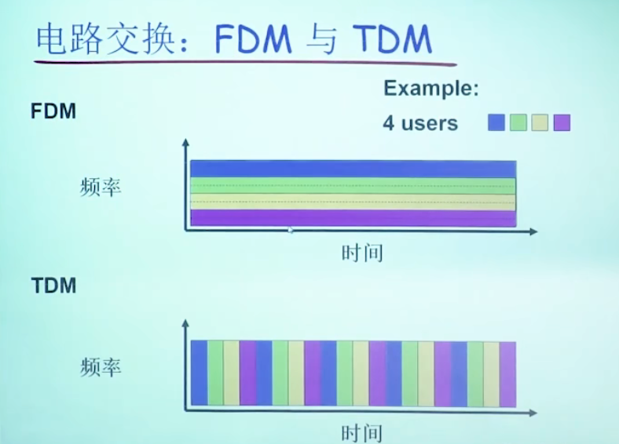


总结：电路交换不适合计算机之间的通信

1. 连接建立时间长
2. 计算机之间的通信有突发性，如果使用线路交换，则浪费的片较多
   1. 即使这个呼叫没有数据传递，其所占据的片也不能够被别的呼叫使用
3. 可靠性不高？


#### 分组交换

1. 电路（链路）（交换节点）之间不分片，使用全部带宽
2. 把数据分块进行传输，称为分组（packet switch）
3. 分组在每个节点之间进行存储转发，每个跳
4. 为什么要先存储再转发？
   1. 为了可以链路复用，为了共享链路，不至于传输大文件时占用全部的链路，使得分组一跳一跳的时候可以进行按需使用
5. 缺点，分组交换比电路交换的时间延迟长，排队延迟和延迟
6. 优点，获得网络的共享性


计算时间的时候，发送和接受是一个事件的两个方面，所以计算时间算一份，而不是发送5s，接收5s，这是错误的，应该是这个事件的总时间为5s

##### 排队和延迟

如果太多分组经过我这个节点，我的传输速率是1Mb/s，分组a的传输是100Mb/s，那我会让它等待，如果等待队列过长，超出我路由器的缓存，分组将会被我抛弃

##### 分组交换：统计多路复用

分组传输没有固定的模式，把这种模式称为统计多路复用


##### 定性和定量分析为什么分组交换比电路交换的网络共享性更好

 


##### 分组交换的关键功能

###### 存储

###### 转发


分组交换：分组的存储转发一段段从源端传到日标端，拔照有无网络层的连接，分成：

1. 数据包(datagram)
   1. 无连接
   2. 无状态路由器，不维护主机与主机的通信状态
   3. 是否UDP协议？
2. 虚电路(virtual circuit)
   1. 有连接
   2. 通过信令建立虚电路，维持主机和主机的通信状态


### 1.4 接入网和物理媒体

怎么把边缘（主机）接入网络核心（通信主体）

bps（bits per second），带宽，每秒传输多少bit

端系统和边缘路由器连接，按照接入方式分为：

1. 住宅接入网络（modem）
2. 公司（单位）接入网络
3. 无线接入网络


接入网:digital subscriber line (DSL)

接入网：线缆网络


住宅接入：电缆模式

接入网：家庭网络

企业接入网络(Ethernet)

无线接入网络

物理媒体

物理媒体：同轴电缆、光纤


物理媒介：无线链路


### 1.5 Internet结构和ISP

#### 互联网络结构：网络的网络

 端系统通过接入ISPs (Internet Service Providers)连 接到互联网

 接入ISPs相应的必须是互联的

### 1.6 分组延时、丢失和吞吐量


#### 分组丢失和延时是怎样发生的？

* 在路由器缓冲区的分组队列
  * 分组到达链路的速率超过了链路输出的能力
  * 分组等待排到队头、被传输


#### 四种分组延时

1. 节点处理延时： 
   1. 检查 bit级差错 
   2. 检查分组首部和决定将分组导向何处
2. 排队延时
   1. 在输出链路上等待传输的 时间
   2. 依赖于路由器的拥塞程度
3. 传输延时
   1.  R=链路带宽(bps) 
   2.  L=分组长度(bits) 
   3. 将分组发送到链路上的 时间= L/R
   4. 存储转发延时
4. 传播延时
   1. d = 物理链路的长度
   2. s = 在媒体上的传播速度 (~2x108 m/sec)
   3. 传播延时 = d/s


#### 节点延时

等于四种分组延时相加

* dproc = 处理延时
  *  通常是微秒数量级或更少
* dqueue = 排队延时
  * 取决于拥塞程度
* dtrans = 传输延时 = L/R, 对低速率的链路而言很大（如拨号），
  * 通常为微秒级 到毫秒级 
* dprop = 传播延时
  *  几微秒到几百毫秒


#### 排队延时取决于什么？

R=链路带宽 (bps)

L=分组长度 (bits) 

a=分组到达队列的平均速率

`流量强度 = La/R`


#### 互联网控制报文协议

ICMP

有一个字段是TTL（time to live），每一跳都减一，一旦TTL为0，那么这个分组将被删除


#### 分组丢失

链路的队列缓冲区容量有限

当分组到达一个满的队列时，该分组将会丢失

丢失的分组可能会被前一个节点或源端系统重 传，或根本不重传


#### 吞吐量

吞吐量: 在源端和目标端之间传输的速率（数 据量/单位时间）

瞬间吞吐量: 在一个时间点的速率

平均吞吐量: 在一个长时间内平均

吞吐量取决于链路上最小吞吐量

瓶颈链路上的瓶颈带宽 限制了这条链路的吞吐量


### 1.7 协议层次及服务模型

网络是一个非常复杂的系统

复杂的系统可以使用模块化分解，进行模块之间的调用和被调用

本层协议实体相互交互执行本层的协议动作，目的是实现本层功能， 通过接口为上层提供更好的服务

将网络复杂的功能分层功能明确的层次，每一层实现了其中一个或一 组功能，功能中有其上层可以使用的功能：服务

在实现本层协议的时候，直接利用了下层所提供的服务


#### 协议

协议(protocol) ：对等层实体(peer entity)之间在相互 通信的过程中，需要遵循的规则的集合，水平

#### 服务

服务(Service)：低层实体向上层实体提供它们之间的 通信的能力，是通过原语(primitive)来操作的，在层间接口，垂直


#### 服务与协议的联系

本层协议的实现要靠下层提供的服务来实现

本层实体通过协议为上层提供更高级的


#### 服务(Service)：

低层实体向上层实体提供它们之间的
通信的能力

* 服务用户(service user)
* 服务提供者(service provider)


#### 服务访问点 SAP (Services Access Point) ：

上层使用下层提供的服务通过层间的接口—地点；

服务访问点区分是哪个服务提供者来使用，给到哪个服务访问者

socket


#### 原语(primitive)：

服务用户使用什么形式来访问服务提供者,上层使用下层服务的形式，高层使用 低层提供的服务，以及低层向高层提供服务都是通过 服务访问原语来进行交互的---形式


#### 服务的类型


1. 面向连接(Connection-oriented Service)
2. 无连接的服务(Connectionless Service)


#### 数据单元(DU)


SAP（ Service Access Point） = 服务访问点
IDU（Interface Data Unit） = 接口数据单元
SDU（Service Data Unit） = 服务数据单元
PDU（Prolocol Data Unit） = 协议数据单元
ICI（ Interface Control Information） = 接口控制信息


SDU：上层要求我传的数据包，称为SDU

ICI：控制信息，上层传给我的数据包，主要包括SDU+ICI


IDU=ICI+SDU

本层生成的数据包是PDU=header+SDU

#### 每一层的PDU叫法不同：

应用层：应用报文（message）

传输层：段（segment），报文段

网络层：分组（面向连接）（package），数据包（无连接）（datagram）

链路层：帧（frame)

物理层：Wave（波） bit（比特）


#### Internet协议栈

1. 应用层
2. 传输层
3. 网络层
4. 链路层
5. 物理层

####  OSI参考模型

1. 应用层
2. 表示层
   1. 表示层：允许应用解释传输的数据，比如，加密，压缩，机器相关的表示转换
3. 会话层
   1. 会话层：数据交换的同步，检查点，恢复
4. 传输层
5. 网络层
6. 链路层
7. 物理层

这两个Internet协议没有的层（表示，会话），对应的功能给到应用层去做


### 1.8 历史


# 第二章：应用层 Application layer 


2.1 应用层协议原理
-----------

**网络应用的体系结构**

可能的应用架构:  
客户-服务器模式（C/S:client/server)  
对等模式(P2P:Peer To Peer)  
混合体:客户-服务器和对等体系结构

### 客户-服务器（C/S）体系结构

服务器:

*   一直运行
*   固定的IP地址和周知的端口号（约定)
*   扩展性:服务器场数据中心进行扩展扩展性差

客户端:

*   主动与服务器通信
*   与互联网有间歇性的连接)
*   可能是动态IP地址
*   不直接与其它客户端通信

**缺点 ：可拓展性差 达到一定能限（阈值），性能暴跌 可靠性差**

### 对等体（P2P）体系结构

*   (几乎）没有一直运行的服务器
*   任意端系统之间可以进行通信
*   每一个节点既是客户端又是服务器
    *   **自扩展性-新peer节点带来新的**  
        **服务能力，当然也带来新的服务请求**
*   参与的主机间歇性连接且可以改变地址
    *   **难以管理（缺点）**
*   例子:Gnutella，迅雷

### C/S和P2P体系结构的混合体

Napster

*   \*\*文件搜索：集中 \*\*
    *   ** 主机在中心服务器上注册其资源**
    *   ** 主机向中心服务器查询资源位置**
*   **文件传输：P2P**
    *   ** 任意Peer节点之间**

即时通信

*   **在线检测：集中**
    *   当用户上线时，向中心服务器注册其IP地址
    *   用户与中心服务器联系，以找到其在线好友的位置
*   **两个用户之间聊天：P2P**

### 进程通信

进程:在主机上运行的应用程序

*   在同一个主机内，使用  
    **进程间通信机制**通信（操作系统定义)
*   不同主机，通过\*\*交换报文(Message）\*\*来通信
    *   使用OS提供的通信服  
        务
    *   按照应用协议交换报文
        *   借助传输层提供的服务

**客户端进程：发起通信 的进程 服务器进程：等待连接 的进程**

**注意：P2P架构的应用也 有客户端进程和服务器进程之分**

### 分布式进程通信需要解决的问题（应用进程如何使用传输层提供的服务交换报文）

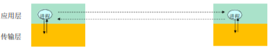

 问题1：**进程标示和寻址问题 (对于进程 谁发/谁收，对等层实体之间)**

 问题2：**传输层-应用层提供服务是如何 (上下层间)**

*    位置：层间界面的SAP （TCP/IP ：socket）
*    形式：应用程序接口API （TCP/IP ：socket API）

 问题3：**如何使用传输层提供的服务，实现应用进程之间的报文交换，实现应用 （本层间）**

 定义应用层协议：报文格式，解释，时序等

 编制程序，使用OS提供的API ，调用网络基础设施提 供通信服务传报文，实现应用时序等；

#### 问题1：对进程进行编址（addressing）

*   进程为了接收报文，必须有一个标识  
    即: SAP(发送也需要标示)
    *   **主机:唯一的32位IP地址**  
        仅仅有IP地址不能够唯一标示一个进程;在一台端系统上有很多应用进程在运行
    *   **所采用的传输层协议:TCP or UDP**
    *   \*\*端口号(Port Numbers) 用来区分不同的应用进程 \*\*
*   一些知名端口号的例子:
    *   HTTP: TCP 80 Mail: TCP 25 ftp: TCP 21
*   一个进程:用IP+port标示端节点
*   本质上，一对主机进程之间的通信由2个端节点构成

#### 问题2：传输层提供的服务-需要穿过层间的信息

层间接口必须要携带的信息

*   **要传输的报文(对于本层来说:SDU)** (SDU——未经本层封装的) （发的什么）
*   **谁传的:对方的应用进程的标示:IP+TCP(UDP)端口** （谁发的）
*   **传给谁:对方的应用进程的标示:对方的IP+TCP(UDP)端口号** （发给谁）

传输层实体（tcp或者udp实体）根据这些信息进行TCP报文段(UDP数据报)的封装

*   源端口号，目标端口号，数据等
*   将IP地址往下交IP实体，用于封装IP数据报:源IP,目标IP

> *   如果Socket API（原语）每次传输报文（穿过层间），都携带如此多的信息，太繁琐易错，不便于管理
> *   用个代号标示通信的双方或者单方: socket
> *   就像OS打开文件返回的句柄一样  
>     对句柄的操作，就是对文件的操作

#### TCP socket

**TCP socket:**

*   TCP服务，两个进程之间的通信需要之前要建立连扫  
    两个进程通信会持续一段时间，通信关系稳定
*   可以用一个整数表示两个应用实体之间的通信关系  
    ，本地标示
*   穿过层间接口的信息量最小
*   TCP socket: 源IP,源端口，目标IP，目标IP,目标

**TCP socket 是一个整数（类似文件描述符）代表一个四元组（我的IP和端口号 对方的IP和端口号）**  
**便于管理 使得穿过层间的信息量最小**  
**是应用层和传输层的一个约定 本地会话的标识**

**对于使用面向连接服务(TCP）的应用而言，套接字是4元组的一个具有本地意义的标识**

*   4元组: (源IP，源port，目标IP，目标port)
    
*   唯一的指定了一个会话（2个进程之间的会话关系)o应用使用这个标示，与远程的应用进程通信
    
*   不必在每一个报文的发送都要指定这4元组
    
*   就像使用操作系统打开一个文件，OS返回一个文件句柄一样，以后使用这个文件句柄，而不是使用这个文件的目录名、文件名
    
*   简单，便于管理
    

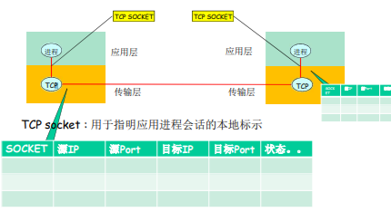

**穿过层间接口的包括 ICI 和 SDU**

#### UDP socket

**UDP socket：**

*   UDP服务，两个进程之间的通信需要之前无需建立连接  
    每个报文都是独立传输的  
    前后报文可能给不同的分布式进程
*   因此，只能用一个整数表示本应用实体的标示  
    因为这个报文可能传给另外一个分布式进程·穿过层间接口的信息大小最小
*   **UDP socket:本IP,本端口**
    *   **但是传输报文时:必须要提供对方IP，port**
    *   **接收报文时:传输层需要上传对方的IP，port**

**对于使用无连接服务(UDP）的应用而言，套接字是2元组的一个具有本地意义的标识**

*   2元组: IP，port(源端指定)
*   UDP套接字指定了应用所在的一个端节点(endpoint>
*   在发送数据报时，采用创建好的本地套接字(标示ID），就不必在发送每个报文中指明自己所采用的ip和port
*   但是在发送报文时，必须要指定对方的ip和udpport(另外一个段节点)

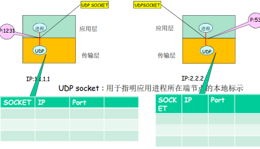

套接字（Socket）

**进程向套接字发送报文或从套接字接收报文**

套接字<->门户

*   发送进程将报文推出门户，发送进程依赖于传输层设施在另外一侧的  
    门将报文交付给接受进程
*   接收进程从另外一端的门户收到报文（依赖于传输层设施)

#### 问题3：如何使用传输层提供的服务实现应用

1.  定义应用层协议：报文格式，解释，时序等
2.  编制程序，**通过API调用网络基础设施提供通信服务**传报文，解析报文，实现应用时序等

### 应用层协议

定义了:运行在不同端系统上的应用进程如何相互交换报文

*   交换的报文类型:请求和应答报文
*   各种报文类型的**语法**:报文中的客个字段及其描述
*   字段的**语义**:即字段取值的含义进程何时、如何发送报文及对报文进行响应的**规则**

应用协议仅仅是应用的一个组成部分  
Web应用:HTTP协议，web客户端，web服务器，HTML(超文本标记语言)

公开协议：  由RFC文档定义  允许互操作  如HTTP, SMTP  
专用（私有）协议：  协议不公开  如：Skype

### 应用需要传输层提供什么样的服务？

如何描述传输层的服务？

> 数据丢失率  
> 有些应用则要求100%的可  
> 靠数据传输（如文件)  
> 有些应用(如音频)能容忍  
> 一定比例以下的数据丢失
>
> 延迟  
> 一些应用出于有效性考虑，对  
> 数据传输有严格的时间限制  
> Internet电话、交互式游戏o延迟、延迟差
>
> 吞吐  
> 一些应用(如多媒体）必须  
> 需要最小限度的吞吐，从而使得应用能够有效运转一些应用能充分利用可供使  
> 用的吞吐(弹性应用)
>
> 安全性  
> 机密性完整性  
> 可认证性（鉴别)

### 常见应用对传输服务的要求

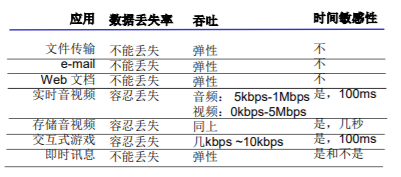

### Internet 传输层提供的服务

实体：实行网络协议的软件模块或硬件模块（运行中的）

TCP服务:  
可靠的传输服务  
流量控制:发送方不会淹没接受方  
拥塞控制:当网络出现拥塞时，能抑制发送方
不能提供的服务:时间保证、最小吞吐保证和安全面向连接:要求在客户端进程和服务器进程之间建立连接

UDP服务:  
不可靠数据传输
不提供的服务:可靠,流量控制、拥塞控制、时间、带宽保证、建立连接  
Q:为什么要有UDP?

**UDP存在的必要性**

*   能够区分不同的进程，而IP服务不能
    *   在IP提供的主机到主机端到端功能的基础上，区分了主机的  
        应用进程
*   无需建立连接，省去了建立连接时间，适合事务性的应用
*   不做可靠性的工作，例如检错重发，适合那些对实时性要求比较高而对正确性要求不高的应用
    *   因为为了实现可靠性（准确性、保序等），必须付出时间代  
        价（检错重发〉
*   没有拥塞控制和流量控制，应用能够按照设定的速度发送数据
    *   而在TCP上面的应用，应用发送数据的速度和主机向网络发送  
        的实际速度是不一致的，因为有流量控制和拥塞控制

### Internet应用及其应用层协议和传输协议

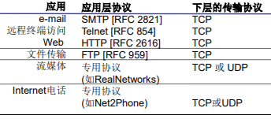

**安全TCP**

TCP & UDP  
 都没有加密  明文通过互联网传输 ，甚至密码

SSL 提供安全性  
 在TCP上面实现，提供加密的TCP连接  私密性  数据完整性  端到端的鉴别

SSL在应用层  应用采用SSL库，SSL 库使用TCP通信

SSL socket API 应用通过API将明文交 给socket，SSL将其加 密在互联网上传输 详见第8章

Https 跑在 SSL + TCP 上

2.2 Web and HTTP
----------------

一些术语

*   Web页:由一些对象组成
    
*   对象可以是HTML文件、JPEG图像、Java小程序、声音剪辑文件等
    
*   Web页含有一个基本的HTML文件，该基本HTML文件又包含若干对象的引用（链接)
    
*   通过URL对每个对象进行引用  
    访问协议，用户名，口令字，端口等；
    
*   URL格式:
    
    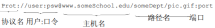
    

### HTTP概况

HTTP: 超文本传输协议  
 Web的应用层协议  
 客户/服务器模式  
 客户: 请求、接收和显示 Web对象的浏览器  
 服务器: 对请求进行响应， 发送对象的Web服务器  
 HTTP 1.0: RFC 1945  
 HTTP 1.1: RFC 206

**使用TCP:**

*   **客户发起一个与服务器的**  
    **TCP连接(建立套接字)，端口号为80**
*   **服务器接受客户的TCP连接**
*   **在浏览器(HTTP客户端)**  
    **与Web服务器(HTTP服务器server)**  
    **交换HTTP报文(应用层协议报文)**
*   **TCP连接关闭**

HTTP是无状态的  服务器并不维护关于客户的任何信息，是一个没有记忆的人~

> 维护状态的协议很复杂！  
> 必须维护历史信息(状态)  
> 如果服务器/客户端死机，它们的状态信息可能不一致， 二者的信息必须是一致  
> 无状态的服务器能够支持更 多的客户端

### HTTP连接

非持久HTTP  

最多只有一个对象在 TCP连接上发送  下载多个对象需要多 个TCP连接  HTTP/1.0使用非持 久连接

持久HTTP  

多个对象可以在一个 （在客户端和服务器 之间的）TCP连接上 传输  HTTP/1.1 默认使用 持久连接


非持久HTTP

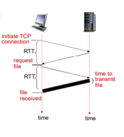

响应时间模型

往返时间RTT（round-trip time）：一个小的分组从客 户端到服务器，在回到客户 端的时间（传输时间忽略）

响应时间：  一个RTT用来发起TCP连接  一个 RTT用来HTTP请求并 等待HTTP响应  文件传输时间  
总共：2个RTT + 一个对象的传输时间

持久HTTP


非持久HTTP的缺点：  
 每个对象要2个 RTT  
 操作系统必须为每个TCP连接分 配资源  
 但浏览器通常打开并行TCP连接 ，以获取引用对象

持久HTTP  
 服务器在发送响应后，仍保持 TCP连接  
 在相同客户端和服务器之间的后 续请求和响应报文通过相同的连 接进行传送  
 客户端在遇到一个引用对象的时 候，就可以尽快发送该对象的请求

**非流水方式的持久HTTP：  客户端只能在收到前一个响应后 才能发出新的请求  每个引用对象花费一个RTT**

**流水方式的持久HTTP：  HTTP/1.1的默认模式  客户端遇到一个引用对象就立即 产生一个请求  所有引用（小）对象只花费一个RTT是可能的**

### HTTP请求报文

 两种类型的HTTP报文：请求、响应  
 HTTP请求报文:

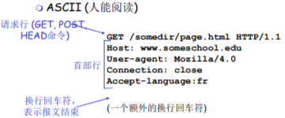

HTTP请求报文：通用格式

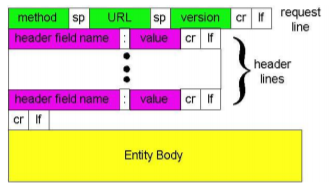

提交表单输入（向服务器提交信息）

Post方式：  网页通常包括表单输 入  包含在实体主体 (entity body )中的 输入被提交到服务器

URL方式：  方法：GET  输入通过请求行的 URL字段上载

例子  
www. somesite.com/animalsearch?monkeys&banana  
http: //www. baidu.com/s?wd=xx+yy+zzz&cl=3

参数：wd，cl 参数值：XX+YY+zzz，3

方法类型

HTTP/1.0  
 GET  POST  
 HEAD  
 要求服务器在响应报文中 不包含请求对象 -> 故障跟踪

HTTP/1.1  GET, POST, HEAD  
 PUT  将实体主体中的文件上载 到URL字段规定的路径  
 DELETE  删除URL字段规定的文件

### HTTP响应报文

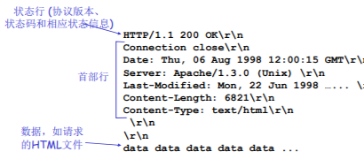

HTTP响应状态码

位于服务器→客户端的响应报文中的首行一些状态码的例子:

200 OK

*   请求成功，请求对象包含在响应报文的后续部分

301 Moved Permanently

*   请求的对象己经被永久转移了;新的URL在响应报文的Location:首部行中指定  
    客户端软件自动用新的URL去获取对象

400 Bad Request

*   一个通用的差错代码，表示该请求不能被服务器解读

404 Not Found

*   请求的文档在该服务上没有找到

505 HTTP version Not supported

Trying out HTTP (client side) for yourself

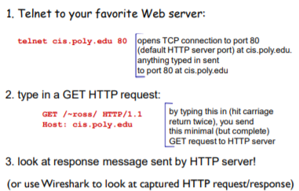

### 用户-服务器状态：cookies

为什么要有cookies：因为http不维护用户状态（无状态协议），所以需要有一个机制在服务器维护客户端状态

**大多数主要的门户网站使 用 cookies 4个组成部分：**

**1) 在HTTP响应报文中有 一个cookie的首部行**

**2)在HTTP请求报文含有 一个cookie的首部行**

**3) 在用户端系统中保留有 一个cookie文件，由用户的浏览器管理**

**4) 在Web站点有一个后 端数据库**

例子：  
 Susan总是用同一个PC使 用Internet Explore上网  
 她第一次访问了一个使 用了Cookie的电子商务网站  
 当最初的HTTP请求到达 服务器时，该Web站点 产生一个唯一的ID，并 以此作为索引在它的后 端数据库中产生一个项

Cookies: 维护状态

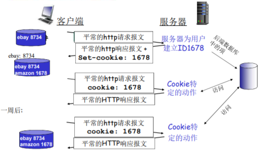

Cookies能带来什么：  用户验证  购物车  推荐  用户状态 (Web e-mail)

如何维持状态： 协议端节点：在多个事务上 ，发送端和接收端维持状态 cookies: http报文携带状 态信息

Cookies与隐私：  
 Cookies允许站点知道许多关于 用户的信息  
 可能将它知道的东西卖给第三方  
 使用重定向和cookie的搜索引 擎还能知道用户更多的信息  
 如通过某个用户在大量站点 上的行为，了解其个人浏览方式的大致模式  
 广告公司从站点获得信息

### Web缓存 (代理服务器)

目标：不访问\*\*原始服务器\*\*，就满足客户的请求

 用户设置浏览器： 通 过缓存访问Web

 浏览器将所有的HTTP 请求发给缓存  
 在缓存中的对象：缓存 直接返回对象  
 如对象不在缓存，缓存 请求原始服务器，然后 再将对象返回给客户端

 缓存既是客户端又是服务器  通常缓存是由ISP安 装 (大学、公司、居 民区ISP)

为什么要使用Web缓存 ？  
** 降低客户端的请求响应时间 **
** 可以大大减少一个机构内 部网络与Internent接入 链路上的流量 **
** 互联网大量采用了缓存： 可以使较弱的ICP也能够 有效提供内容 **

缓存示例

假设  平均对象大小 = 100kb  机构内浏览器对原始服务器的 平均请求率为 = 15请求/s  平均到浏览器的速率：1.5Mbps  机构内部路由器到原始服务器 再返回到路由器的的延时 （ Internet 延时）= 2s  接入链路带宽：1.54Mbps 结果  LAN的流量强度 = 15%  
** 接入链路上的流量强度 = 99%**  
 总延时 = LAN延时 + 接入延时 + Internet 延时 = ms + 分

**t (queue) = I/(1 - I) \* L / R**  
**I——流量强度 L/R——一个分组的传输时间 排队延迟非常大**

缓存示例：更快的接入链路

假设  平均对象大小 = 100kb  机构内浏览器对原始服务器的 平均请求率为 = 15请求/s  平均到浏览器的速率：1.5Mbps  机构内部路由器到原始服务器 再返回到路由器的的延时 （ Internet 延时）= 2s ** 接入链路带宽：1.54Mbps——> 154Mbps** 结果  LAN的流量强度 = 15%  接入链路上的流量强度 = 99%  
** 总延时 = LAN延时 + 接入延时 + Internet 延时 = ms + 分 + 2s**  
**代价: 增加了接入链路带宽（非常昂贵！）**

**排队延迟降低**

### 缓存例子：安装本地缓存

假设  平均对象大小 = 100kb  机构内浏览器对原始服务器的平均 请求率为 = 15请求/s  平均到浏览器的速率：1.5Mbps ** 机构内部路由器到原始服务器再返回到路由器的的延时 （Internet 延 时）= 2s**  接入链路带宽：1.54Mbps 结果LAN 利用率: 15% 接入网络利用率： ？ 总体延迟= ? ? How to compute link utilization, delay? **代价: web缓存(廉价!)**

计算链路利用率，有缓存的延迟： 假设缓存命中率0.4  40%请求在缓存中被满足，其他60%的请求 需要被原始服务器满足 接入链路利用率: 60%的请求采用接入链路 进过接入链路到达浏览器的数据速 率 = 0.6\*1.50 Mbps = .9 Mbps 利用率= 0.9/1.54 = .58 总体延迟： = 0.6 \* (从原始服务器获取对象的 延迟) +0.4 \* (从缓存获取对象的延迟)  
**= 0.6 (2.01) + 0.4 (msecs) = 1.2 secs 比安装154Mbps链路还来得小 (而且 比较便宜!)**

**条件GET方法（对象版本和服务器版本一致性问题）**

 目标：如果缓存器中的对 象拷贝是最新的，就不要发送对象  
 缓存器: 在HTTP请求中指 定缓存拷贝的日期 If-modified-since: <date>  
 服务器: 如果缓存拷贝陈 旧，则响应报文没包含对象: HTTP/1.0 304 Not Modified

2.3 FTP\*
---------

FTP: 文件传输协议

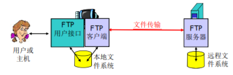

 向远程主机上传输文件或从远程主机接收文件  
 客户/服务器模式  
 客户端：发起传输的一方  
 服务器：远程主机  
 ftp: RFC 959  
 ftp服务器：端口号为21

### FTP: 控制连接与数据连接分开

 FTP客户端与FTP服务器通过端口21联系，并使用TCP为传输协议  
 客户端通过控制连接获得身份确认  
 客户端通过控制连接发送命令浏览远程目录  
 收到一个文件传输命令时，服务器打开一个到客户端的数据连接  
 一个文件传输完成后，服务器关闭连接

** 服务器打开 第二个TCP 数据连接用来传输另一个文件（服务器主动）**  
** 控制连接： 带外（ “out of band” ）传送**  
** FTP服务器维护用户的状态信息： 当前路径、用户帐户与控制连接对应**  
**有状态的协议**

### FTP命令、响应

命令样例：  
 在控制连接上以ASCII文本方式传送  
 USER username  
 PASS password  
 LIST：请服务器返回远程主 机当前目录的文件列表  
 RETR filename：从远程主 机的当前目录检索文件 (gets)  
 STOR filename：向远程主 机的当前目录存放文件 (puts)  
返回码样例：  
 状态码和状态信息 (同HTTP)  
 331 Username OK, password required  
 125 data connection already open; transfer starting  
 425 Can’t open data connection  452 Error writing file

### FTP协议与HTTP协议的差别

**FTP协议是有状态的，FTP协议的控制命令和数据传输分别在两个TCP上进行**

2.4 EMail
---------

3个主要组成部分： 

用户代理  

邮件服务器  

简单邮件传输协议：SMTP


用户代理 （客户端软件）  
 又名 “邮件阅读器”  
 撰写、编辑和阅读邮件  
 如Outlook、Foxmail  
 输出和输入邮件保存在服务器 上

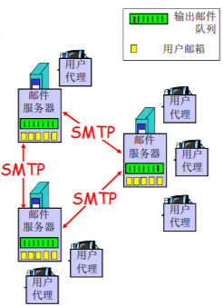

邮件服务器  
 邮箱中管理和维护发送给用户的邮件  
 输出报文队列保持待发送邮件报文  
 邮件服务器之间的SMTP协议 ：发送email报文  
 客户：发送方邮件服务器  
 服务器：接收端邮件服务器

### EMail: SMTP \[RFC 2821\] 原理

 使用TCP在客户端和服务器之间传送报文，端口号为25  
 直接传输：从发送方服务器到接收方服务器  
 传输的3个阶段 握手 传输报文 关闭  
 命令/响应交互  
命令：ASCII文本  
响应：状态码和状态信息  
 报文必须为7位ASCII码 （规范传输内容）

举例：Alice给Bob发送报文

1.  Alice使用用户代理撰写邮件并发送给 bob@someschool.edu  
    **2) Alice的用户代理将邮件发送到她的邮件服务器；邮件放在报文队列中**
2.  SMTP的客户端打开到Bob邮件服务器的TCP连接  
    **4) SMTP客户端通过TCP连接发送Alice的邮件**  
    **5) Bob的邮件服务器将邮件放到Bob的邮箱**
3.  Bob调用他的用户代理阅读邮件

### 简单的SMTP交互


### SMTP：总结

 **SMTP使用持久连接**  
** SMTP要求报文（首部 和主体）为7位ASCII编 码**  
 **SMTP服务器使用 CRLF.CRLF决定报文的 尾部**

HTTP比较：  
 HTTP：拉（pull）  
 SMTP：推（push）  
 二者都是ASCII形式的命令/ 响应交互、状态码  
 HTTP：**每个对象封装在各自的响应报文中**  
 SMTP：**多个对象包含在一个报文中**

### 邮件报文格式

SMTP：交换email报文的协议 RFC 822: 文本报文的标准：  
 首部行：如,  
 To:  From:  Subject:  
 主体  
 报文，只能是ASCII码字符

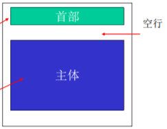

报文格式：多媒体扩展

 MIME：多媒体邮件扩展（multimedia mail extension）, RFC 2045, 2056  
 在报文首部用额外的行申明MIME内容类型

[常用Base64 对STMP的ASCII码进行拓展 传输更多内容](https://juejin.cn/post/6844904197519835150)

> Base64 常用于在处理文本数据的场合，表示、传输、存储一些二进制数据，包括 MIME 的电子邮件及 XML 的一些复杂数据。\*\*在 MIME 格式的电子邮件中，base64 可以用来将二进制的字节序列数据编码成 ASCII 字符序列构成的文本。\*\*使用时，在传输编码方式中指定 base64。使用的字符包括大小写拉丁字母各 26 个、数字 10 个、加号 + 和斜杠 /，共 64 个字符，等号 = 用来作为后缀用途。

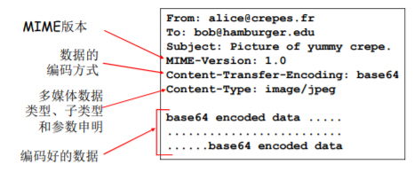

### 邮件访问协议


两推一拉

 SMTP: 传送到接收方的邮件服务器  
 邮件访问协议：从服务器访问邮件 （3种方式）  
 POP：邮局访问协议（Post Office Protocol）\[RFC 1939\]  
 用户身份确认 (代理<–>服务器) 并下载  
 IMAP：Internet邮件访问协议（Internet Mail Access Protocol）\[RFC 1730\]  
 更多特性和功能 (更复杂)  
 在服务器上处理存储的报文  
 HTTP：Hotmail , Yahoo! Mail等  
 方便

**POP3协议**  
用户确认阶段  客户端命令：  user: 申明用户名  pass: 口令  服务器响应  +OK  -ERR  
事物处理阶段 客户端：  list: 报文号列表  retr: 根据报文号检索报文  dele: 删除  quit

用户确认阶段

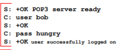

事物处理阶段,

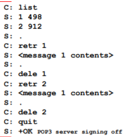

POP3  
 先前的例子使用 “下载 并删除”模式。  
 如果改变客户机，Bob不 能阅读邮件  
 “下载并保留”：不同 客户机上为报文的拷贝  
 POP3在会话中是无状态的

**IMAP**  
 IMAP服务器将每个报文 与一个文件夹联系起来  
 允许用户用目录来组织 报文  
 允许用户读取报文组件  
 IMAP在会话过程中保留 用户状态：  
 目录名、报文ID与目录名 之间映射

2.5 DNS
-------

DNS(Domain Name System)

从域名到IP地址的转换（主要功能）

### DNS的必要性

  IP地址标识主机、路由器  
  **但IP地址不好记忆，不便人类使用(没有意义)**  
  **人类一般倾向于使用一些有意义的字符串来标识 Internet上的设备**  
 **例如：qzheng@ustc.edu.cn**  
 **所在的邮件服务器 www.ustc.edu.cn 所在的web服务器**

  存在着“字符串”—IP地址的转换的必要性  
  人类用户提供要访问机器的“字符串”名称  
  由DNS负责转换成为二进制的网络地址

DNS系统需要解决的问题

 问题1：如何命名设备  
 用有意义的字符串：好记，便于人类用使用  
 解决一个平面命名的重名问题：层次化命名  
 问题2：如何完成名字到IP地址的转换  
 分布式的数据库维护和响应名字查询  
 问题3：如何维护：增加或者删除一个域，需 要在域名系统中做哪些工作

DNS(Domain Name System)的历史

 ARPANET的名字解析解决方案  
 主机名：没有层次的一个字符串（一个平面）  
 存在着一个（集中）维护站：维护着一张 主机名-IP地址 的映射文件：Hosts.txt  
 每台主机定时从维护站取文件  
 ARPANET解决方案的问题  当网络中主机数量很大时  没有层次的主机名称很难分配

### DNS(Domain Name System)总体思路和目标

 DNS的主要思路  
 **分层的、基于域的命名机制**  
 **若干分布式的数据库完成名字到IP地址的转换**  
 **运行在UDP之上端口号为53的应用服务**  
 核心的Internet功能，但以应用层协议实现  
 **在网络边缘处理复杂性 （互联网最核心的功能（DNS）在边缘系统实现的）**

 DNS主要目的：  
 实现主机名-IP地址的转换(name/IP translate) （主要功能）  
 其它目的  
 **主机别名到 规范名字 的转换：Host aliasing**  
 **邮件服务器别名到邮件服务器的 正规名字 的转换：Mail server aliasing**  
 **负载均衡：Load Distribution（分配具体的服务器提供服务）**

### 问题1：DNS名字空间(The DNS Name Space)

 DNS域名结构  
 一个层面命名设备会有很多重名  
 NDS采用层次树状结构的 命名方法  
 **Internet 根被划为几百个顶级域(top lever domains)**  
通用的(generic) .com; .edu ; .gov ; .int ; .mil ; .net ; .org .firm ; .hsop ; .web ; .arts ; .rec ;  
**国家的(countries) .cn ; .us ; .nl ; .jp**  
 每个(子)域下面可划分为若干子域(subdomains)  
 树叶是主机

#### DNS: 根名字服务器

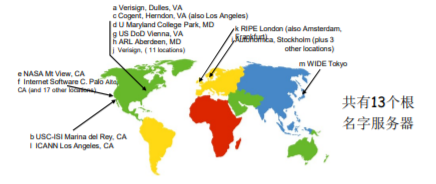

DNS名字空间(The DNS Name Space)

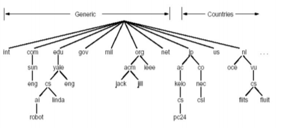

域名(Domain Name)  
**从本域往上，直到树根**  
**中间使用“.”间隔不同的级别**  
例如：ustc.edu.cn  
 auto.ustc.edu.cn  
 www.auto. ustc.edu.cn  
域的域名：可以用于表示一个域  
主机的域名：一个域上的一个主机

 域名的管理  
 一个域管理其下的子域  
.jp 被划分为 ac.jp co.jp  
.cn 被划分为 edu.cn com.cn  
 **创建一个新的域，必须征得它所属域的同意**  
 **域与物理网络无关**  
 **域遵从组织界限，而不是物理网络**  
 一个域的主机可以不在一个网络  
 一个网络的主机不一定在一个域  
 **域的划分是逻辑的，而不是物理的**

### 问题2：解析问题-名字服务器(Name Server)

 **一个名字服务器的问题**  
 **可靠性问题：单点故障**  
 **扩展性问题：通信容量**  
 **维护问题：远距离的集中式数据库**

 **区域(zone)**  
 区域的划分有区域管理者自己决定  
 将DNS名字空间划分为互不相交的区域，每个区域都是 树的一部分  
 名字服务器：  
 每个区域都有一个名字服务器：维护着它所管辖区域的权威信息 (authoritative record)  
 名字服务器允许被放置在区域之外，以保障可靠性

#### 名字空间划分为若干区域：Zone

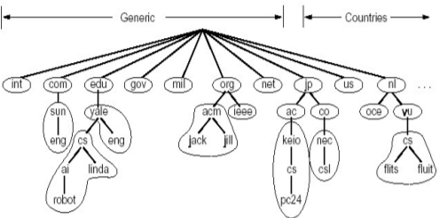

**权威DNS服务器：组织机构的DNS服务器， 提供组织机构服务器（如 Web和mail）可访问的主机和IP之间的映射**  
组织机构可以选择实现自己维护或由某个服务提供商来维护

#### TLD服务器

 顶级域(TLD)服务器：负责顶级域名（如com, org, net, edu和gov）和所有国家级的顶级域名（如cn, uk, fr, ca, jp ）  
 Network solutions 公司维护com TLD服务器  
 Educause公司维护edu TLD服务器

#### 区域名字服务器维护资源记录

资源记录(resource records)  
作用：维护 域名-IP地址(其它)的映射关系  
位置：Name Server的分布式数据库中  
 RR格式: (domain\_name, ttl, type,class,Value)  
Domain\_name: 域名  
**Ttl: time to live : 生存时间(权威记录，缓冲记录)** **缓冲是为了性能 删除是为了一致性**  
Class 类别 ：对于Internet，值为IN **说明是Internet网**  
Value 值：可以是数字，域名或ASCII串 **对应的IP地址**  
Type 类别：资源记录的类型—见下页

DNS记录

DNS ：保存资源记录(RR)的分布式数据库  
RR 格式：(name, value, type, ttl)

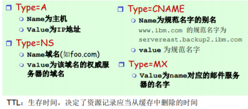

信息1 （叫什么）  
**TYPE = NS Name放的是子域的名字  
Value 子域名字服务器（权威DNS服务器）的名字**

信息2 （在哪）  
**Type = A Name放的是名字（子域的名字）**  
**Value 对应服务器的IP地址**

### DNS大致工作过程

**一台设备上网必备的IP信息**  
**我的IP地址 我的子网掩码 我的local name serve 我的default getway（路由器）**

 应用调用 解析器(resolver)  
 解析器作为客户 向Name Server发出查询报文 （封装在UDP段中）  
 Name Server返回响应报文(name/ip)

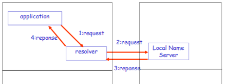

#### 本地名字服务器（Local Name Server）

 并不严格属于层次结构  
 每个ISP (居民区的ISP、公司、大学）都有一 个本地DNS服务器  
 也称为“默认名字服务器”  
 当一个主机发起一个DNS查询时，查询被送到 其本地DNS服务器  
 起着代理的作用，将查询转发到层次结构中

#### 名字服务器(Name Server)

名字解析过程  
目标名字在Local Name Server中  
情况1：查询的名字在该区域内部  
情况2：缓存(cashing)

当与本地名字服务器不能解析名字时，联系根名字服务器 顺着根-TLD 一直找到 权威名字服务器

递归查询  
 **名字解析负担都 放在当前联络的 名字服务器上**  
 问题：根服务器 的负担太重  
 解决： 迭代查询 (iterated queries)

迭代查询

 主机cis.poly.edu 想知道主机 gaia.cs.umass.edu 的IP地址  
**根（及各级域名）服务器返回的不是查询结果，而 是下一个NS的地址**  
**最后由权威名字服务器给出解析结果**  
当前联络的服务器给出可以联系的服务器的名字  
“我不知道这个名字，但可以向这个服务器请求

### DNS协议、报文

DNS协议：查询和响应报文的报文格式相同

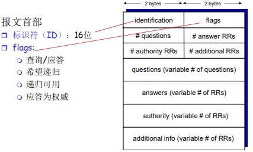

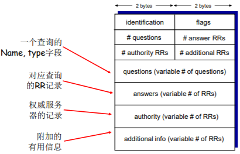

提高性能：缓存

 一旦名字服务器学到了一个映射，就将该映射 缓存起来  
 根服务器通常都在本地服务器中缓存着  
使得根服务器不用经常被访问  
 目的：提高效率  
 可能存在的问题：如果情况变化，缓存结果和 权威资源记录不一致  
 解决方案：TTL（默认2天）

### 问题3：维护问题：新增一个域

*   **在上级域的名字服务器中增加两条记录，指向这个新增的子域的域名和域名服务器的地址**  
    （Type = NS、 Type = A 相当于指针）
*   在新增子域的名字服务器上运行名字服务器，负责本域  
    的名字解析:名字->IP地址  
    例子:在com域中建立一个“Network Utopia”
*   到注册登记机构注册域名networkutopia.com
    *   需要向该机构提供权威DNS服务器（基本的、和辅助的）的名字  
        和IP地址
    *   登记机构在com TLD服务器中插入两条RR记录:  
        ( networkutopia.com,dns1.networkutopia.com,NS )( dns1.networkutopia.com,212.212.212.1,A)
*   在networkutopia.com的权威服务器中确保有
    *   用于Web服务器的www.networkuptopia.com的类型为A的记录
    *   用于邮件服务器mail.networkutopia.com的类型为MX的记录

攻击DNS 总的说来，DNS比较健壮

DDoS 攻击  
 对根服务器进行流量轰炸 攻击：发送大量ping  
 没有成功  
 原因１：根目录服务器配置 了流量过滤器，防火墙  
 原因２：Local DNS 服务器 缓存了TLD服务器的IP地址, 因此无需查询根服务器

 向TLD服务器流量轰炸攻击 ：发送大量查询  
 可能更危险  
 效果一般，大部分DNS缓存 了TLD

重定向攻击  
 中间人攻击  截获查询，伪造回答，从而攻击 某个（DNS回答指定的IP）站点  
 DNS中毒  发送伪造的应答给DNS服务器，希 望它能够缓存这个虚假的结果  
 技术上较困难：分布式截获和伪造 利用DNS基础设施进行DDoS  
 伪造某个IP进行查询， 攻击这个 目标IP  
 查询放大，响应报文比查询报文大  
 效果有限

流量是分布式 查询有几乎都有缓存，基本不需要根 ——> 无根也基本安全

2.6 P2P 应用
----------

 没有（或极少）一直运行的 服务器  
 任意端系统都可以直接通信  
 利用peer的服务能力  
 Peer节点间歇上网，每次IP 地址都有可能变化  
例子:  
 文件分发 (BitTorrent)  
 流媒体(KanKan)  
 VoIP (Skype)

### 文件分发: C/S vs P2P

问题: 从一台服务器分发文件（大小F）到N个peer 需要多少时间？

文件分发时间: C/S模式

 服务器传输： 都是由服务器 发送给peer，服务器必须顺序 传输（上载）N个文件拷贝:

*   **发送一个copy: F/us（上载）**
*   **发送N个copy： NF/us （上载）**

客户端: 每个客户端必须下 载一个文件拷贝

*   dmin = 客户端最小的下载速率
*   **下载带宽最小的客户端下载的 时间：F/dmin （下载）**

**采用C-S方法 将一个F大小的文件 分发给N个客户端耗时 Dc-s > max{NF/us（随着N线性增长 ）,F/dmin}**  
**(瓶颈却决于服务器的性能和客户端性能的相对强弱)**

文件分发时间: P2P模式

 服务器传输：最少需要**上载**一份 拷贝

*   **发送一个拷贝的时间：F/us （上载）**

客户端: 每个客户端必须**下载**一 个拷贝

*   **最小下载带宽客户单耗时: F/dmin（下载）**

客户端: 所有客户端总体下载量NF

*   **最大上载带宽是：us（服务器的） + Sui（所有客户端的） （上载）**
*   **除了服务器可以上载，其他所有的peer节点都可以上载**

**采用P2P方法 将一个F大小的文件 分发给N个客户端耗时 Dp2p > max{F/us,F/dmin,NF/(us + Sui)}**

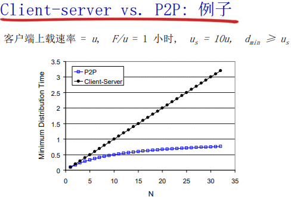

C-S 线性  
P2P 非线性 性能高 可拓展性强 难管理（动态性强）

非结构化P2P 任意连接  
DHT 结构化P2P 如：环形、树 **节点哈希 内容哈希 按一定规律存内容**

### P2P文件共享

例子  
 Alice在其笔记本电脑上 运行P2P客户端程序  间歇性地连接到 Internet，每次从其 ISP得到新的IP地址  请求“双截棍.MP3”  应用程序显示其他有“ 双截棍.MP3” 拷贝的对 等方

 Alice选择其中一个对等方， 如Bob.  文件从Bob’s PC传送到 Alice的笔记本上：HTTP  当Alice下载时，其他用户也 可以从Alice处下载  Alice的对等方既是一个Web 客户端，也是一个瞬时Web 服务器

所有的对等方都是服务器 = 可扩展性好！

#### 两大问题

 如何定位所需资源  
 如何处理对等方的 加入与离开

可能的方案  
集中  
分散  
半分散

### 1、集中式目录

最初的“Napster”设计

1.  当对等方连接时，它告知  
    中心服务器：  IP地址  内容
2.  Alice查询 “双截棍 .MP3”
3.  Alice从Bob处请求文件

** 单点故障  性能瓶颈  侵犯版权**  
文件传输是分散的， 而定位内容则是高度集中的

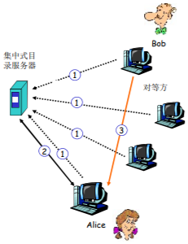

### 2、查询洪泛：Gnutella（完全分布式）

 **全分布式**  
 **没有中心服务器**  
 开放文件共享协议  
 **许多Gnutella客户端 实现了Gnutella协议**  
 类似HTTP有许多的 浏览器

覆盖网络：图  
 **如果X和Y之间有一个 TCP连接，则二者之间存在一条边**  
 **所有活动的对等方和边就是覆盖网络**  
 边并不是物理链路  
 给定一个对等方，通常 所连接的节点少于10个

>  在已有的TCP连接上发送查询报文  
>  对等方转发查询报文  
>  **以反方向返回查询命中报文**

#### 泛洪查询 flooding

我的客户端向所有邻居发出查询 所有邻居的客户端向其邻居发出查询 …  
拥有资源的节点通过反向的方法将查询的结果发回来

**我的客户端就知道那个节点有资源——解决目录的问题——再向拥有资源的节点发出请求，得到资源**

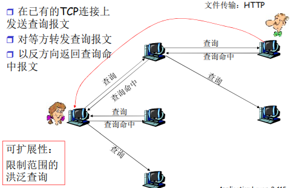

Gnutella：对等方加入（网络的建立）

1.  对等方X必须首先发现某些已经在覆盖网络中的其他对 等方：使用可用对等方列表 **自己维持一张对等方列表（经常开机的对等方的IP、死党列表）** 联系维持列表的Gnutella站点
2.  X接着试图与该列表上的对等方建立TCP连接，直到与某个对等方Y建立连接
3.  X向Y发送一个Ping报文，Y转发该Ping报文
4.  **所有收到Ping报文的对等方以Pong报文响应 IP地址、共享文件的数量及总字节数**
5.  **X收到许多Pong报文，然后它能建立其他TCP连接**

### 3、利用不匀称性：KaZaA（混合体）

**每个对等方要么是一个组长，要么隶属于一个组长**

*   对等方与其组长之间有 TCP连接
*   组长对之间有TCP连接

组长跟踪其所有的孩子的内容

组长与其他组长联系

*   转发查询到其他组长
*   获得其他组长的数据拷贝

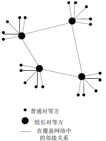

#### KaZaA：查询

 **每个文件有一个散列标识码（唯一Hash，上载时赋予）和一个描述符**  
 客户端向其组长发送关键字查询  
 组长用匹配（描述）进行响应：  
 对每个匹配：元数据、散列标识码和IP地址  
 如果组长将查询转发给其他组长，其他组长也 以匹配进行响应  
 客户端选择要下载的文件  
 向拥有文件的对等方发送一个带散列标识码的 HTTP请求

#### Kazaa小技巧

请求排队

*   限制并行上载的数量
*   确保每个被传输的文件从上载节点接收一定量的带宽

激励优先权

*   鼓励用户上载文件
*   加强系统的扩展性

并行下载

*   从多个对等方下载同一个文件的不同部分
    *   HTTP的字节范围首部
    *   更快地检索一个文件

#### Distributed Hash Table (DHT)

** 哈希表  DHT方案  环形DHT 以及覆盖网络  Peer波动**

### （实际的例子）P2P文件分发： BitTorrent

**文件被分为一个个块256KB**  
**每个节点有一个bit map（hash），用map标记是否具备，有则标识为1否则为0**  
**网络中的这些peers发送接收文件块，相互服务**

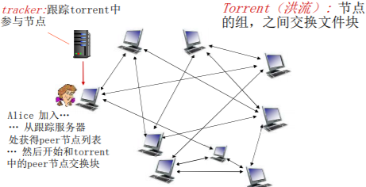

 Peer加入torrent:  
 **一开始没有块（吸血鬼），但是将会通 过其他节点处累积文件块**  
 向跟踪服务器注册，获得 peer节点列表，和部分peer 节点构成邻居关系 (“连接 ”)  
**当peer下载时，该peer可以同时向其他节点提供上载服务**  
Peer可能会变换用于交换块的peer节点  
**扰动churn: peer节点可能会上线或者下线**  
**一旦一个peer拥有整个文件（种子）**，它会（自私的）离开或者保留（利他主义）在torrent中

#### BitTorrent: 请求，发送文件块

请求块：  
 在任何给定时间，不同 peer节点拥有一个文件块 的子集  
 周期性的，Alice节点向 邻居询问他们拥有哪些块 的信息  
 **Alice向peer节点请求它 希望的块，稀缺的块（稀缺优先，对集体有利）**

**1、（集体提出）客户端优先请求稀缺的（稀缺优先，对集体有利）**  
**2、（集体定的规则）优先向提供服务好的客户端服务（个人利益与集体利益绑定）**  
**3、（造成个人遵守）客户端优先请求稀缺的 （利他等于利己）**

发送块：一报还一报titfor-tat  
**Alice向4个peer发送块，这些块向它自己提供最大带宽的服务**  
其他peer被Alice阻塞 (将不会 从Alice处获得服务)  
**每10秒重新评估（谁对它好）一次：前4位**  
**每个30秒：随机选择其他peer 节点，向这个节点发送块**  
“优化疏通” 这个节点  
**新选择的节点可以加入这个top 4**

(1) Alice “优化疏通” Bob  
(2) Alice 变成了Bob的前4位提供者; Bob答谢Alice  
(3) Bob 变成了Alice的前4提供者

**更高的上载速率： 发现更好的交易伙伴，获得更快的文件传输速率!**

2.7 CDN
-------

视频流化服务和CDN：上下文

*   视频流量：占据着互联网大部分的带宽
    *   Netflix, YouTube: 占据37%, 16% 的ISP下行流 量
    *   ~1B YouTube 用户, ~75M Netflix用户
*   挑战：规模性-如何服务者 ~1B 用户?
    *   单个超级服务器无法提供服务（为什么）
*   挑战：异构性
    *   不同用户拥有不同的能力（例如：有线接入和移 动用户；带宽丰富和受限用户）
*   **解决方案: 分布式的，应用层面的基础设施**

> 多媒体: 视频
>
> 视频：固定速度显示的图像序 列
>
> *   e.g. 24 images/sec
>
> 网络视频特点：
>
> *   高码率：>10x于音频,高的网络带 宽需求
> *   可以被压缩
> *   90%以上的网络流量是视频
>
> 数字化图像：像素的阵列
>
> *   每个像素被若干bits表示
>
> 编码：使用图像内和图像间的 冗余来降低编码的比特数
>
> *   空间冗余(图像内)
> *   时间冗余(相邻的图像间)
>
> CBR: (constant bit rate): 以固定速率编码
>
> VBR: (variable bit rate): 视频编码速率随 时间的变化而变化

### 多媒体流化服务：DASH

DASH: Dynamic, Adaptive Streaming over HTTP 动态自适应

服务器:  
将视频文件**分割成多个块** （流化）  
每个块独立存储，**编码于不同码率（8-10种）**  
**告示文件（manifest file）: 提供不同块的URL** （自适应：自己选择）

客户端:  
先获取告示文件  
周期性地测量服务器到客户端的带宽  
查询告示文件,在一个时刻请求一个块，HTTP头部指定字 节范围  
如果带宽足够，选择最大码率的视频块  
会话中的不同时刻，可以切换请求不同的编码块 (取 决于当时的可用带宽)

“智能”客户端: 客户端自适应决定

*   什么时候去请求块 (不至于缓存挨饿，或者溢出)
*   **请求什么编码速率的视频块 (当带宽够用时，请求高质量的视频块)**
*   哪里去请求块 (可以向离自己近的服务器发送URL，或 者向高可用带宽的服务器请求)

挑战: 服务器如何通过网络向上百万用户同时流化视频内容 (上百万视频内容)?

#### 选择1: 单个的、大的超级服务中心“megaserver”

  服务器到客户端路径上跳数较多，瓶颈链路的带宽 小导致停顿  
  “二八规律”决定了网络同时充斥着同一个视频的 多个拷贝，效率低（付费高、带宽浪费、效果差）  
  单点故障点，性能瓶颈  
  周边网络的拥塞

相当简单，但是这个方法不可扩展

#### 选项2: 通过CDN（content distribution network），全网部署缓存节点，存储服务内容，就近为用户提供服务，提高用户体验 （内容加速服务）

*   enter deep: 将CDN服务器**深入到许多接入网**
    *   **更接近用户**，数量多，离用户近，管理困难
    *   Akamai, 1700个位置
*   bring home: **部署在少数(10个左右)关键位置（到用户的跳数较多）**，如将服务器簇安装于POP附近（离若干1stISP POP较近）
    *   采用租用线路将服务器簇连接起来
    *   Limelight

CDN: **在CDN节点中存储内容的多个拷贝** 让内容靠近用户  
e.g. Netflix stores copies of MadMen

用户从CDN中请求内容\*\*（先从原服务器获取告知文件manifest file，自适应选择块）\*\*  
(域名解析的重定向)重定向到最近的拷贝，请求内容  
如果网络路径拥塞，可能选择不同的拷贝

**互联网络主机-主机之间的通信作为一种服务向用户提供**

#### OTT 挑战: 在拥塞的互联网上复制内容

OTT(互联网公司越过运营商，发展基于开放互联网的各种视频及数据服务业务)，over the top

*   从哪个CDN节点中获取内容？
*   用户在网络拥塞时的行为？
*   在哪些CDN节点中存储什么内容？

案例学习: Netflix

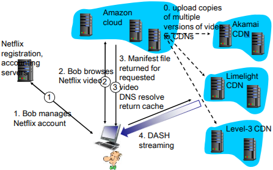

2.8 TCP 套接字编程
-------------

Socket编程

应用进程使用传输层提供的服务能够交换报文，实现应用协议，实现应用  
TCP/IP：应用进程使用Socket API访问传输服务  
地点：界面上的SAP(Socket） 方式：Socket API  
**目标: 学习如何构建能借助sockets进行通信的C/S应用程序**

socket: **分布式应用进程之间的门**，传输层协议提供的端到端服务接口

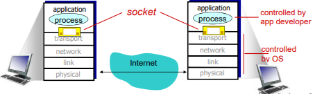

2种传输层服务的socket类型:  
 TCP: 可靠的、\*\*字节流\*\*的服务  
 UDP: 不可靠（数据UDP数据报）服务

套接字：应用进程与端到端传输协议（TCP或UDP）之间 的门户  
TCP服务：从一个进程向另一个进程可靠地传输字节流

### 过程

服务器首先运行，等待连接建立

1：服务器进程必须先处于运行状态  
 **创建欢迎socket**  
 **和本地端口捆绑**  
 在欢迎socket上**阻塞式等待**接收用户的连接

客户端主动和服务器建立连接：

2：创建客户端本地套接字（隐式捆绑到本地port）  
 指定服务器**进程的IP地址和端口号**，**与服务器进程连接**

3 ：当与客户端连接请求到来时  
**服务器接受来自用户端的请求 ，解除阻塞式等待，返回一个新的socket（与欢迎socket不 一样），与客户端通信**  
 允许服务器与多个客户端通信  
 使用源IP和源端口来区分不同的客户端

4：连接API调用有效时，客户端P与服务器建立了TCP连接

从应用程序的角度  
TCP在客户端和服务器进程之间 提供了可靠的、字节流（管道）服务

### C/S模式的应用样例

1.  客户端从标准输入装置读 取一行字符，发送给服务 器
2.  服务器从socket读取字符
3.  服务器将字符转换成大写 ，然后返回给客户端
4.  客户端从socket中读取一 行字符，然后打印出来

实际上，这里描述了C-S之间交互的动作次序

**数据结构 sockaddr\_in**  
IP地址和port捆绑关系的数据结构（标示进程的端节点）

    struct sockaddr_in {
    short sin_family; //AF_INET
    u_short sin_port; // port
    struct in_addr sin_addr ;// IP address, unsigned long
    char sin_zero[8]; // align 校准
    }; 

**数据结构 hostent**  
域名和IP地址的数据结构

    struct hostent { 
    char *h_name;	//域名
    char **h_aliases;	/别名
    int h_addrtype;	
    int h_length; /*地址长度*/
    char **h_addr_list;	//IP地址
    #define h_addr h_addr_list[0];
    } 


作为调用域名解析函数时的参数 返回后，将IP地址拷贝到 sockaddr\_in的IP地址部分

### C/S socket 交互: TCP

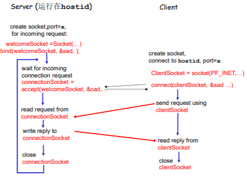

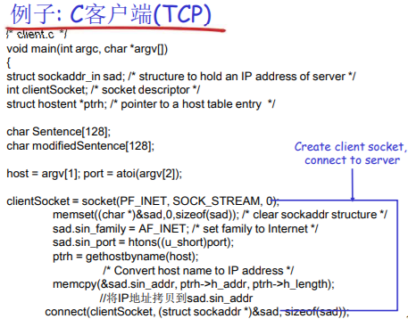

系统自己默认使用了bind，自动分配

argv\[1\] 主机的名字 argv\[2\] 端口号 argv\[0\] 程序的名字

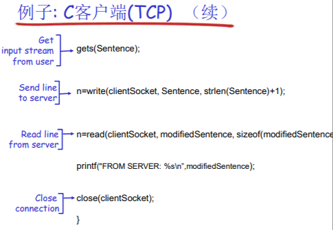

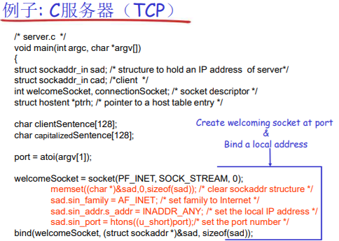

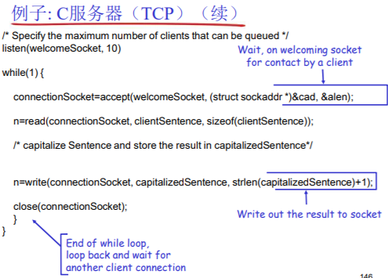

2.9 UDP 套接字编程
-------------

UDP: 在客户端和服务器之间 没有连接  
• 没有握手  
• 发送端在**每一个报文中明确地指定目标的IP地址和端口号**  
• 服务器必须从收到的分组中**提·取出发送端的IP地址和端口号**

UDP: 传送的数据可能乱序，也可能丢失

进程视角看UDP服务 UDP 为客户端和服务器提供**不可靠的字节组**的传送服务

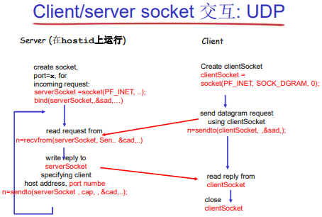

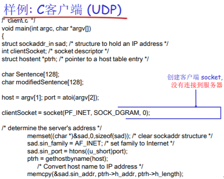

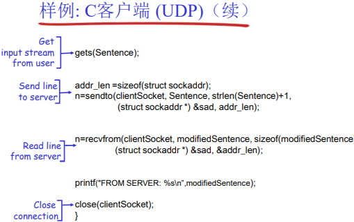

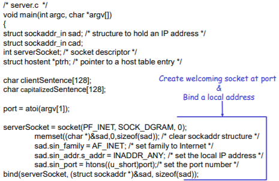

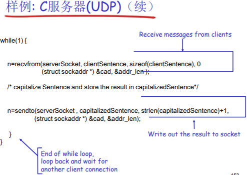

## 第2章：小结

 应用程序体系结构  
 客户-服务器  P2P  混合

 应用程序需要的服务品质描 述:  
 可靠性、带宽、延时、安全

 Internet传输层服务模式  
 可靠的、面向连接的服务： TCP  
 不可靠的数据报：UDP

 流行的应用层协议:  
 HTTP  
 FTP  
 SMTP, POP, IMAP  
 DNS

 Socket编程

更重要的：学习协议的知识

 应用层协议报文类型：请求/响应报文：  
 客户端请求信息或服务  
 服务器以数据、状态码进 行响应

 报文格式：  
 首部：关于数据信息的字段  
 数据：被交换的信息

 控制报文 vs. 数据报文  
 带内（一个TCP传两种报文）、带外 （两个TCP）  
 集中式 vs. 分散式  
 无状态 vs. 维护状态  
 可靠的 vs. 不可靠的报文传输  
 在网络边缘处理复杂性

一个协议定义了在两个或多个通信实体之间交换报文的格式和 次序、以及就一条报文传输和接收或其他事件采取的动作


# 第三层：传输层 Transmission layer 

### 文章3.1 概述和传输层服务

传输服务和协议

*   为运行在不同主机上的应 用进程提供逻辑通信
*   传输协议运行在端系统
    *   发送方：将应用层的报文分成报文段，然后传递给网络层
    *   接收方：将报文段重组成报文，然后传递给应用层
*   有多个传输层协议可供应用选择
    *   Internet: TCP(字节流的服务，不保证界限) 和 UDP

### 传输层 vs. 网络层

*   网络层服务：主机之间的逻辑通信
    
*   传输层服务：进程间的逻辑通信
    
    *   依赖于网络层的服务
        *   延时、带宽
    *   并对网络层的服务进行增强
        *   数据丢失、顺序混乱、 加密

有些服务是可以加强的：不可靠 -> 可靠；安全  
但有些服务是不可以被加强的：带宽，延迟

### Internet传输层协议

可靠的、保序的传输： TCP(字节流的服务)

*   多路复用、解复用
*   拥塞控制
*   流量控制
*   建立连接

不可靠、不保序的传输：UDP(数据包的服务)

*   多路复用、解复用
*   没有为尽力而为的IP服务添加更多的其它额外服务

**都不提供的服务： 延时保证 带宽保证**

3.2 多路复用与解复用
------------

多路复用/解复用（一个TCP/UDP实体上有很多应用进程借助其发送）

在发送方主机多路复用  
从多个套接字接收来自多个进程的报文，**根据套接字对应的IP地址和端口号**等信息对报文段用头部加以封装 (该头部信息用于以后的**解复用**)

在接收方主机多路解复用  
根据报文段的头部信息中的**IP地址和端口号将接收到的报文段发给正确的套接字**(和对应的应用进程)

多路解复用工作原理

*   解复用作用：TCP或者UDP实体采 用哪些信息，将报文段的数据部分 交给正确的socket，从而交给正确 的进程
*   主机收到IP数据报
    *   每个数据报有源IP地址和目标地 址
    *   每个数据报承载一个传输层报 文段
    *   每个报文段有一个源端口号和 目标端口号 (特定应用有著名的端口号)
*   主机联合使用IP地址和端口号将报文段发送给合适的套接字

无连接(UDP)多路解复用

当创建UDP段采用端口号，可以指定： • 目标IP地址 • 目标端口号  
当主机接收到UDP段时： • 检查UDP段中的目标端 口号 • 将UDP段交给具备那个端口号的套接字  
**目标IP地址，目标端口号一样发送给同一个进程**

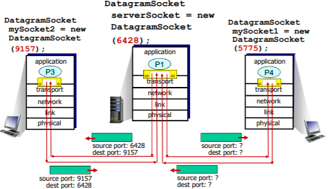

面向连接(TCP)的多路复用

TCP套接字:四元组本 地标识：  源IP地址  源端口号  目的IP地址  目的端口号  
解复用：接收主机用 这四个值来将数据报 定位到合适的套接字

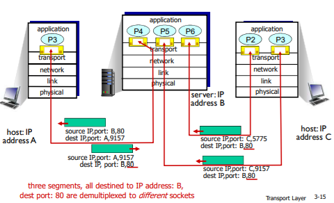

socket 和message

3.3 无连接传输：UDP
-------------

UDP: User Datagram Protocol 用户数据包协议  
在IP（主机到主机）所提供的基础上增加了一个多路复用/解复用（进程到进程）的服务

*   “尽力而为”的服务，报文 段可能
    
    *   丢失
    *   送到应用进程的报文段乱序（延迟不一样）
*   无连接：
    
    *   UDP发送端和接收端之间没有握手
    *   每个UDP报文段都被独立地处理
*   UDP 被用于:
    
    *   （实时）流媒体（丢失不敏感， 速率敏感、应用可控制 传输速率）
    *   DNS
    *   SNMP
    *   事务性的应用(一次性往返搞定)
*   在UDP上可行可靠传输:
    
    *   **在应用层增加可靠性**
    *   **应用特定的差错恢复**

### UDP：用户数据报协议

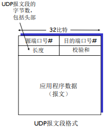

### 为什么要有UDP?

1.  不建立连接 (会增加延时)
    
2.  简单：在发送端和接收端没有连接状态
    
3.  **报文段的头部很小(开销小)**
    
4.  **无拥塞控制和流量控制**：UDP可以尽可能快的发送报文段
    
5.  **应用->传输的速率 = 主机->网络的速率 (忽略头部时)**
    

UDP校验和  
目标： 检测在被传输报文段中的差错 (如比特反转)

发送方：  
 将报文段的内容视为16 比特的整数  
 校验和：报文段的加法和（1的补运算）  
 发送方将校验和放在 UDP的校验和字段

接收方：  
 计算接收到的报文段的校验和  
 检查计算出的校验和与校验和字段的内容是否相等：  
 不相等––检测到差错  
 **相等––没有检测到差错 ，但也许还是有差错 (残存错误，为检测出来)**

### Internet校验和的例子

注意：当数字相加时，在最高位的进位要回卷（加到最低位上），再加到结果上

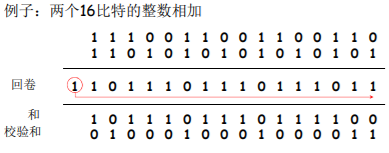

 **目标端：校验范围+校验和=1111111111111111 通过校验**  
 否则没有通过校验  
 注：求和时，必须将进位回卷到结果上

3.4 可靠数据传输的原理
-------------

可靠数据传输（rdt）的原理 rdt(Reliable Data Transfer)

 rdt在应用层、传输层和数据链路层都很重要  
 是网络Top 10问题之一

 信道的不可靠特点决定了可靠数据传输协议（ rdt ）的复杂性

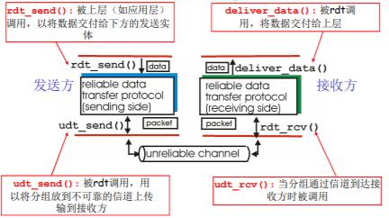

 渐增式地开发可靠数据传输协议（ rdt ）的发送方和接收方  
 只考虑单向数据传输  
 但控制信息是双向流动的！  
 **双向的数据传输问题实际上是2个单向数据传输问题的综合**  
 使用**有限状态机 (FSM)** 来描述发送方和接收方

### Rdt1.0： 在可靠信道上的可靠数据传输

**下层的信道是完全可靠的**

*   没有比特出错
*   没有分组丢失

发送方和接收方的FSM

*   发送方将数据发送到下层信道
*   接收方从下层信道接收数据

发送方：接收–封装–打走 接收方：解封装–交付 什么都不用干

### Rdt2.0：具有比特差错的信道

下层信道可能会出错：将分组中的比特翻转  
 用校验和来检测比特差错

 问题：怎样从差错中恢复：  
 确认(ACK)：接收方显式地告诉发送方分组已被正确接收  
 否定确认( NAK): 接收方显式地告诉发送方分组发生了差错  
• 发送方收到NAK后，发送方重传分组

 rdt2.0中的新机制：采用差错控制编码进行差错检测  
 发送方差错控制编码、缓存  
 接收方使用编码检错  
 接收方的反馈：控制报文（ACK，NAK）：接收方->发送方  
 发送方收到反馈相应的动作

#### Rdt2.0：FSM描述

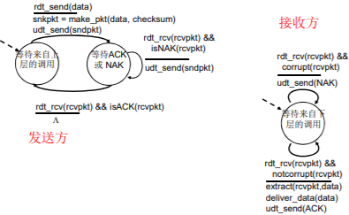

发送方接收nak (接收方检测出错) ，将之前封装的package重传，直到收到ack才开始下一轮的发送

### rdt2.0的致命缺陷！-> rdt2.1

如果ACK/NAK出错？  
 发送方不知道接收方发生了什么事情！  
 **发送方如何做？**  
 **重传？可能重复**  
 **不重传？可能死锁(或出 错)**  
 **需要引入新的机制**  
 **序号**

处理重复：  
 发送方在每个分组中加 入序号  
 如果ACK/NAK出错，发送方重传当前分组  
 **接收方丢弃（不发给上层）重复分组**  
**接收方通过序号判断，是否重复接收同样的包，在进行下一次流程/发送ack**

**停等协议: 发送方发送一个分组， 然后等待接收方的应答**

发送方：

1.  在分组中加入序列号  
     两个序列号（0，1）就 足够了  
     一次只发送一个未经确认 的分组
2.  必须检测ACK/NAK是否 出错（需要EDC ）  
    状态数变成了两倍  
    必须记住当前分组的序列号为0还是1

接收方：

1.  必须检测接收到的分组是否是重复的  
     状态会指示希望接收到的 分组的序号为0还是1

注意：接收方并不知道 发送方是否正确收到了 其ACK/NAK

**rdt2.1的运行**

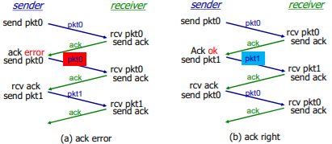

接收方不知道它最后发送的ACK/NAK是否被正确地收到  
 发送方不对收到的ack/nak给确认，**没有所谓的确认的确认**；  
 接收方发送ack，如果后面接收方收到的是：  
 **老分组p0？则ack 错误**  
 **下一个分组？P1，ack正确**

### rdt2.2：无NAK的协议

*   功能同rdt2.1，但只使用ACK(ack 要编号）
*   接收方对最后正确接收的分组发ACK，以替代NAK
    *   接收方必须显式地包含被正确接收分组的序号
*   **当收到重复的ACK（如：再次收到ack0）时，发送方与收到NAK采取相同的动作：重传当前分组**
*   为后面的一次发送多个数据单位做一个准备
    *   一次能够发送多个
    *   每一个的应答都有：ACK，NACK；麻烦
    *   使用对前一个数据单位的ACK，代替本数据单位的nak
    *   确认信息减少一半，协议处理简单

NAK free


**rdt2.2的运行**


1、No error 2、packet error 3、ack error

### rdt3.0：具有比特差错和分组丢失的信道

**新的假设：下层信道可 能会丢失分组（数据或ACK）**  
 会死锁  
 机制还不够处理这种 状况：  
• 检验和  
• 序列号  
• ACK  
• 重传

*   方法：发送方等待ACK一段合理的时间  
    发送端**超时重传**：如果到时没有 收到ACK->重传
*   问题：如果分组（或ACK ）只 是被延迟了：  
    重传将会导致数据重复，但利用序列号已经可以处理这 个问题  
    接收方必须指明被正确接收的序列号
*   需要一个倒计数定时器

链路层的timeout时间确定的 （比较集中）  
传输层timeout时间是适应式的 （不太集中）

#### rdt3.0的运行


1、no loss 2、packet loss 3、ACK loss **4、premature timeout/ delayed ACK**

 **过早超时（延迟的ACK）也能够正常工作；但是效率较低，一半的分组和确认是重复的；**  
 设置一个合理的超时时间也是比较重要的；

#### rdt3.0的性能

**rdt3.0可以工作，但链路容量比较大的情况下，性能很差**

*   链路容量比较大，一次发一个PDU 的不能够充分利用链路的传输能力


*   U sender：利用率 – 忙于发送的时间比例
*   每30ms发送1KB的分组 -> 270kbps=33.75kB/s 的吞吐量（在1 Gbps 链路上）
*   瓶颈在于：网络协议限制了物理资源的利用！

### rdt3.0：停-等操作 stop-wait


**一次收发一个**

### 流水线：提高链路利用率

pipeline


 增加n,能提高链路利用率  
 但当达到某个n,其u=100%时,无法再通过增加n，提高利用率  
 瓶颈转移了->链路带宽

#### 流水线协议/管道化协议

流水线：允许发送方在未得到对方确认的情况下一次发送多个 分组  
 必须增加序号的范围:用多个bit表示分组的序号  
 在发送方/接收方要有缓冲区  
• 发送方缓冲：未得到确认，可能需要重传；  
• 接收方缓存：上层用户取用数据的速率≠接收到的数据速率；接收到的数据可 能乱序，排序交付（可靠）

slide window

sw(sending window)

rw(receiving window)

\=1

\=1

stop-wait

流水线协议

\>1

\=1

GBN

流水线协议

\>1

\>1

SR

两种通用的流水线协议：回退N步(GBN)和选择重传(SR)

#### 发送缓冲区

*   **形式：内存中的一个区域，落入缓冲区的分组可以发送**
*   **功能：用于存放已发送，但是没有得到确认的分组**
*   **必要性：需要重发时可用**

发送缓冲区的大小：一次最多可以发送多少个未经确认的分组

*   停止等待协议=1
*   流水线协议>1，合理的值，不能很大，链路利用率不能够超100%

发送缓冲区中的分组

*   未发送的：落入发送缓冲区的分组，可以连续发送出去；
*   **已经发送出去的、等待对方确认的分组：发送缓冲区的分组只有得到确认才能删除**

#### 发送窗口

采用相对移动方式表示，分组不动  
可缓冲范围移动，代表一段可以发送的权力

**发送窗口：发送缓冲区内容的一个范围**

*   那些已发送但是未经确认分组的序号构成的空间

发送窗口的最大值<=发送缓冲区的值  
一开始：没有发送任何一个分组

*   后沿=前沿
*   之间为发送窗口的尺寸=0

每发送一个分组，前沿前移一个单位


发送窗口前沿移动的极限：不能够超过**发送缓冲区的大小**

发送窗口后沿移动  
条件：收到老分组的确认  
结果：发送缓冲区罩住新的分组，来了分组可以发送  
移动的极限：不能够超过前沿


#### 接收窗口

slide window

sw (sending window)

rw (receiving window)

\=1

\=1

stop-wait

流水线协议

\>1

\=1

GBN

流水线协议

\>1

\>1

SR

**两种通用的流水线协议：回退N步(GBN)和选择重传(SR)**

接收窗口 (receiving window)=接收缓冲区

*   接收窗口用于控制哪些分组可以接收；
    *   只有收到的分组序号落入接收窗口内才允许接收
    *   若序号在接收窗口之外，则丢弃；
*   **接收窗口尺寸Wr=1，则只能顺序接收；**
*   **接收窗口尺寸Wr>1 ，则可以乱序接收**
    *   但提交给上层的分组，要按序

例子：Wr＝1，在0的位置；只有0号分组可以接收；向前滑动一个，罩在1的位置，如果来了第2号分组，则丢 弃。

接收窗口的滑动和发送确认

*   滑动：
    *   低序号的分组到来，接收窗口移动；
    *   高序号分组乱序到，缓存但不交付（因为要实现rdt，不允许失序），不滑动
*   发送确认：
    *   **接收窗口尺寸=1 ； 发送连续收到的最大的分组确认（累计确认）**
    *   **接收窗口尺寸>1 ； 收到分组，发送那个分组的确认（非累计确认）**


#### 正常情况下的2个窗口互动


#### 异常情况下GBN的2窗口互动

发送窗口

*   新分组落入发送缓冲区范围，发送->前沿滑动
    
*   **超时重发机制让发送端将发送窗口中的所有分组发送出去**
    
*   来了老分组的重复确认->后沿不向前滑动->新的分组无法落入发送缓冲区的范围团(此时如果发送缓冲区有新的分组可以发送)
    

接收窗口

*   收到乱序分组，没有落入到接收窗口范界内，抛弃
*   (重复）发送老分组的确认，**累计确认**

#### 异常情况下SR的2窗口互动

发送窗口

*   新分组落入发送缓冲区范围，发送->前沿滑动
*   **超时重发机制让发送端将超对的分组重新发送出去**
*   来了乱序分组的确认->后沿不向前滑动->新的分组无法落入发送缓冲区的范围（此时如果发送缓冲率有新的分组可以发送)

接收窗口

*   收到乱序分组，落入到接收窗口范围内，接收
*   发送该分组的确认，**单独确认**

#### GBN协议和SR协议的异同

相同之处  发送窗口>1  一次能够可发送多个 未经确认的分组

不同之处

GBN :接收窗口尺寸=1

*   **接收端：只能顺序接收**
*   **发送端：从表现来看，一旦一个 分组没有发成功，如：0,1,2,3,4 ; 假如1未成功，234都发送出去 了，要返回1再发送；GB1(go back 1)**

SR: 接收窗口尺寸>1

*   **接收端：可以乱序接收**
*   **发送端：发送0,1,2,3,4，一旦1 未成功，2,3,4,已发送，无需重发，选择性发送1**

**Go-back-N:**  
 发送端最多在流水线中有N个未确认的分组  
 **接收端只是发送累计型确认(cumulative ack)**  
 接收端如果发现gap，不确认新到来的分组

发送端拥有对最老的 未确认分组的定时器  
只需设置一个定时器  
**当定时器到时时，重传所有未确认分组**

**Selective Repeat:**  
 发送端最多在流水线中有N个未确认的分组  
 接收方对每个到来的分组单独确认individual ack （非累计确认）

发送方为每个未确认的分组保持一个定时器  
当超时定时器到时，只是重发到时的未确认分组

#### 运行中的GBN


#### 选择重传SR的运行

 发送窗口的最大值（发送缓冲区）限制发送未确认分组的个数

发送方

> 从上层接收数据：  
>  如果下一个可用于该分组的序 号可在发送窗口中，则发送  
> timeout(n):  
>  重新发送分组n，重新设定定时器  
> ACK(n) in \[sendbase,sendbase+N\]:  
>  将分组n标记为已接收  
>  如n为最小未确认的分组序号， 将base移到下一个未确认序号

接收方

> 分组n \[rcvbase, rcvbase+N-1\]  
>  发送ACK(n)  
>  乱序：缓存  
>  有序：该分组及以前缓存的 序号连续的分组交付给上层 ，然后将窗口移到下一个仍 未被接收的分组  
> 分组n \[rcvbase-N, rcvbase-1\]  
>  ACK(n) 其它：  
>  忽略该分组


#### 对比GBN和SR

GBN

SR

优点

简单，所需资源少（接收方一个 缓存单元）

出错时，重传一个代价小

缺点

一旦出错，回退N步代价大

复杂，所需要资源多（接收方多个 缓存单元）

**适用范围**

*   出错率低：比较适合GBN，出错非常罕见，没有必 要用复杂的SR，为罕见的事件做日常的准备和复杂处理
*   链路容量大\*\*（延迟大、带宽大）\*\*：比较适合SR而不 是GBN，一点出错代价太大

**窗口的最大尺寸**

 GBN: 2^n -1  
 SR:2^(n-1) 例  
如：n=2; 序列号：0, 1, 2, 3  
 GBN =3  
 SR=2  
SR的例子：  接收方看不到二者的区别！  将重复数据误认为新数据 (a)

Q: 序号大小与窗口大小 之间的关系？

3.5 面向连接的传输： TCP
----------------

点对点：一个发送方，一个接收方

可靠的、按顺序的字节流：没有报文边界

管道化（流水线）：TCP拥塞控制和流量控制设置窗口大小

发送和接收缓存

全双工数据：

*   在同一连接中数据流双向 流动
*   MSS：最大报文段大小 MSS的大小 + TCP头部 + IP头部 = 一个报文段

面向连接：在数据交换之前，通过握 手（交换控制报文） 初始 化发送方、接收方的状态 变量

有流量控制：发送方不会淹没接收方

### TCP报文段结构


**序号：报文段首字节的在字节流的编号**

**确认号：1、期望从另一方收到的下一个字节的序号 2、累积确认**


#### TCP序号和确认号

\[外链图片转存失败,源站可能有防盗链机制,建议将图片保存下来直接上传(img-fPifywE9-1627286415551)(C:\\Users\\20662\\AppData\\Roaming\\Typora\\typora-user-images\\image-20210726075010148.png)\]

#### TCP 往返延时（RTT）和超时

怎样设置TCP 超时？  
比RTT要长 ，但RTT是变化的  
太短：太早超时 ，不必要的重传  
太长：对报文段丢失反应太慢，消极

怎样估计RTT？  
SampleRTT：测量从报文段发出到 收到确认的时间  如果有重传，忽略此次测量  
SampleRTT会变化，因此估计的 RTT应该比较平滑  对几个最近的测量值求平均，而 不是仅用当前的SampleRTT

EstimatedRTT = (1- a)\*EstimatedRTT + a\*SampleRTT  
 **指数加权移动平均**  
 **过去样本的影响呈指数衰减**  
 推荐值：a = 0.125


#### 设置超时


### TCP：可靠数据传输

TCP在IP不可靠服务的基础上 建立了rdt  
 管道化的报文段 • GBN or SR

 **累积确认（像GBN）**  
 **单个重传定时器（像GBN）**  
 **是否可以接受乱序的，没有规范**

通过以下事件**触发重传**  
 **超时（只重发那个最早的未确认段：SR）**  
 **重复的确认**  
• 例子：收到了ACK50,之后又收到3 个ACK50

首先考虑简化的TCP发送方：  忽略重复的确认  忽略流量控制和拥塞控 制

#### TCP发送方事件：

从应用层接收数据：  
 用nextseq创建报文段  
 序号nextseq为报文段首字节的字节流编号  
 如果还没有运行，启动定时器

超时：  
 **重传后沿最老的报文段**  
 **重新启动定时器**

收到确认：  
 如果是对尚未确认的报文段确认  
 更新已被确认的报文序号  
 如果当前还有未被确认的报文段，重新启动定时器 (发完，就关掉定时器)

TCP重传


ACK丢失 过早超时 对顺序收到的最高字节确认


**产生TCP ACK的建议**

接收方的事件

TCP接收方动作

所期望序号的报文段按序到达。 所有在期望序号之前的数据都已经被确认

延迟的ACK（提高效率，少发一个ACK）。对另一个按序报文段的到达最多等待500ms。如果下一个报文段**在这个时间间隔内没有到达**，则发送一个ACK。

有期望序号的报文段到达。 另一个按序报文段等待发送ACK

**立即发送单个累积ACK，以确认两个按序报文段。**

比期望序号大的报文段乱序到达。 检测出数据流中的间隔

立即发送重复的ACK，**指明下一个期待字节的序号**

能部分或完全填充接收数据间隔 的报文段到达

若该报文段起始于间隔（gap）的低端， 则立即发送ACK（给确认。反映下一段的需求）。

### 快速重传

超时周期往往太长：  
在重传丢失报文段之前的延时太长

通过重复的ACK来检测 报文段丢失  
 发送方通常连续发送大量 报文段  
 如果报文段丢失，通常会引起多个重复的ACK


如果发送方收到同一数据 的3个冗余ACK，重传最 小序号的段：  
 **快速重传：在定时器过时之前重发报文段**

 它假设跟在被确认的数据 后面的数据丢失了

• 第一个ACK是正常的；

• 收到第二个该段的ACK，表 示接收方收到一个该段后的乱序段；

• 收到第3，4个该段的ack，表 示接收方收到该段之后的2个 ，3个乱序段，可能性非常大段丢失了

**三重ACK接收后的快速重传**


### TCP 流量控制

流量控制  
接收方控制发送方，不让发送方发送的太多、太快以至于让 接收方的缓冲区溢出

接收方在其向发送方的TCP段 头部的rwnd字段“通告”其空闲buffer大小

*   RcvBuffer大小通过socket选项 设置 (典型默认大小为4096 字 节)
*   很多操作系统自动调整 RcvBuffer

发送方限制未确认(“inflight”)字节的个数≤接收 方发送过来的 rwnd 值

保证接收方不会被淹没


RcvWindow = 缓冲区空间 - 已经接收到未读取的空间

### TCP连接管理

在正式交换数据之前，发送方和接收方握手建立通 信关系:  
 **同意建立连接（每一方都知道对方愿意建立连接）**  
 **同意连接参数**

#### 同意建立连接

在网络中，2次握手建 立连接总是可行吗？  
 变化的延迟（连接请求的段没有丢，但可能超时）  
 由于丢失造成的重传 (e.g. req\_conn(x))  
 报文乱序  
 相互看不到对方

2次握手的失败场景：


1、可能发送半连接（只在服务器维护了连接）  
2、老的数据被当成新的数据接收了 **seq x 和 x + 1**

TCP 3次握手


**解决方案：变化的初始序号+双方确认对方的序号 (3次握手)**

第一次：seq 第二次：ACK + seq 第三次：ACK

#### 3次握手解决：半连接和接收老数据问题


**二次握手：可能发送半连接（只在服务器维护了连接）**  
**三次握手：客户端在第三次握手拒绝连接请求 服务器二次握手后的连接请求**

**二次握手：老的数据被当成新的数据接收了**  
**三次握手：未建立连接（无半连接），故将发来的数据丢掉**

扔掉：连接不存在， 没建立起来；连接的 序号不在当前连接的 范围之内

**若一个数据滞留时间足够长导致**  
**在TCP第二次连接（两个三次握手后）到来，这个数据包大概率也会被丢弃，因为seq不一样，而seq又与时间有关**

#### TCP: 关闭连接

*   **客户端，服务器分别关闭它自己这一侧的连接**
    *   **发送FIN bit = 1的TCP段**
*   **一旦接收到FIN，用ACK回应**
    *   **接到FIN段，ACK可以和它自己发出的FIN段一起发 送**
*   **可以处理同时的FIN交换**


3.6 拥塞控制原理
----------

拥塞:  
 非正式的定义: “太多的数据需要网络传输，超过了网络的处理能力”  
 与流量控制不同  
 拥塞的表现:  
 **分组丢失 (路由器缓冲区溢出)**  
 **分组经历比较长的延迟(在路由器的队列中排队)**  
 网络中前10位的问题!

### 拥塞的原因/代价: 场景1


### 拥塞的原因/代价: 场景2

 一个路由器，有限的缓冲  
 分组丢失时，发送端重传  
应用层的输入=应用层输出: λ(in) = λ(out)  
传输层的输入包括重传: λ(in‘) >= λ(in)


理想化: 发送端有完美的信息  
发送端知道什么时候路由器的缓冲是可用的  
 只在缓冲可用时发送  
 不会丢失: λ(in‘’) = λ(in)

理想化: 掌握丢失信息 分组可以丢失，在路由器由 于缓冲器满而被丢弃  如果知道分组丢失了，发 送方重传分组

现实情况: 重复  分组可能丢失，由于缓冲器 满而被丢弃  发送端最终超时，发送第2 个拷贝，2个分组都被传出

现实情况: 重复  分组可能丢失，由于缓冲器 满而被丢弃  发送端最终超时，发送第2 个拷贝，2个分组都传到

拥塞的“代价”:  
 为了达到一个有效输出，网络需要做更多的工作（重传）  
 没有必要的重传，链路中包括了多个分组的拷贝  
 是那些没有丢失，经历的时间比较长（拥塞状态）但是 超时的分组  
 降低了的“goodput”

**输出比输入少原因：1）重传的丢失分组；2） 没有必要重传的重复分组**

### 拥塞的原因/代价: 场景3

1、4个发送端 2、多重路径 3、超时／重传


又一个拥塞的代价:  
 当分组丢失时，**任何“关于这个分组的上游传输能力” 都被浪费了**

### 拥塞控制方法

2种常用的拥塞控制方法:

端到端拥塞控制:  
 没有来自网络的显式反馈  
 **端系统根据延迟和丢失事件推断是否有拥塞**  
 TCP采用的方法

网络辅助的拥塞控制:  
 **路由器提供给端系统以反馈信息**  
 单个bit置位，显示有拥塞 (SNA, DECbit, TCP/IP ECN, ATM)  
 显式提供发送端可以采用的速率

### 案例学习: ATM ABR 拥塞控制

ABR: available bit rate:  
 “弹性服务”  
 **如果发送端的路径“轻载 ” 发送方使用可用带宽**  
 **如果发送方的路径拥塞了 发送方限制其发送的速度到一个 最小保障速率 上**

**RM (资源管理) 信元:**  
 由发送端发送,在数据信元中间隔插入  
 RM信元中的比特被交换机设置 (“网络辅助”) 有无拥塞  
 **NI bit: no increase in rate (轻微拥塞)速率不要增加了**  
 **CI bit: congestion indication 拥塞指示**  
 发送端发送的RM 信元被接收端返回, 接收端不做任何 改变

在RM信元中的2个字节 ER (explicit rate)字段 多大带宽  
 **拥塞的交换机可能会降低信元中ER的值**  
 **发送端发送速度因此是 最低的可支持速率(交换机)**

数据信元中的EFCI bit: 被拥塞的交换机设置成1  
 如果在管理信元RM前面的数据信元EFCI被设置成了1, 接收端在 返回的RM信元中设置CI bit

总结：网络提供一些信息，包括一些标志位的置位以及字段 (为两主机间的通信提供多大的带宽)

3.7 TCP 拥塞控制
------------

### TCP 拥塞控制：机制

端到端的拥塞控制机制  
 路由器不向主机有关拥塞的反馈信息  
• 路由器的负担较轻  
• **符合网络核心简单的 TCP/IP架构原则**

 **端系统根据自身得到的信息** ，判断是否发生拥塞，从而 采取动作

拥塞控制的几个问题  
 如何检测拥塞  
 轻微拥塞  
 拥塞  
 控制策略  
 在拥塞发送时如何动 作，降低速率  
• 轻微拥塞，如何降低  
• 拥塞时，如何降低  
 在拥塞缓解时如何动 作，增加速率

### TCP 拥塞控制：拥塞感知

发送端如何探测到拥塞?

1.  某个段超时了（丢失事件 ）：拥塞  
     超时时间到，某个段的确认没有来  
     **原因1：网络拥塞（某个路由器缓冲区没空间了，被丢弃）概率大**  
     **原因2：出错被丢弃了（各级错误，没有通过校验，被丢弃）概率小**  
     一旦超时，就认为拥塞了，有一定误判，但是总体控制方向是对的
    
2.  **有关某个段的3次重复ACK：轻微拥塞**  
     段的第1个ack，正常，确认绿段，期待红段  
     段的第2个重复ack，意味着红段的后一段收到了，蓝段乱序到达  
     段的第2、3、4个ack重复，意味着红段的后第2、3、4个段收到了 ，橙段乱序到达，同时红段丢失的可能性很大（后面3个段都到了， 红段都没到）  
     **网络这时还能够进行一定程度的传输，拥塞但情况要比第一种好**
    

### TCP 拥塞控制：速率控制方法

如何控制发送端发送的速率  
 **维持一个拥塞窗口的值：CongWin (主要手段)**  
 发送端限制 **已发送但是未确认** 的数据量\*\*（的上限）**: LastByteSent-LastByteAcked <= CongWin  
 从而**粗略地控制\*\*发送方的往网络中注入的速率

**RTT 往返延时**


如何控制发送端发送的速率  
 CongWin是动态的，是感知到的网络拥塞程度的函数  
 **超时或者3个重复ack，CongWin↓（下降）**  
• 超时时：**CongWin降为1MSS**，**进入SS阶段**然后再倍增到 CongWin(原) / 2（每个RTT），从而**进入CA阶段**  
• 3个重复ack ：CongWin降为CongWin/2,CA阶段  
 否则（正常收到Ack，没有发送以上情况）：CongWin跃跃欲试↑ （上升）  
• **SS阶段：加倍增加(每个RTT)**  
• **CA阶段：线性增加(每个RTT)**

### TCP拥塞控制和流量控制的联合动作

联合控制的方法:  
 发送端控制发送但是未确认的量同时也不能够超过接收 窗口，满足流量控制要求  
 **SendWin=min{CongWin, RecvWin}**  
 同时满足 拥塞控制和流量控制要求

### 拥塞控制策略

 慢启动  
 AIMD：线性增、乘性减少  
 超时事件后的保守策略

#### TCP 慢启动

连接刚建立, CongWin = 1 MSS

*   如: MSS = 1460bytes & RTT = 200 msec  初始速率 = 58.4kbps

可用带宽可能>> MSS/RTT

*   应该尽快加速，到达希望的速率

当连接开始时，指数性增加发送速率，直到发生丢失的事件

*   1、启动初值很低 2、但是速度很快

当连接开始时，指数性增 加（每个RTT）发送速率 直到发生丢失事件  
 每一个RTT， CongWin加倍  
 每收到一个ACK时， CongWin加1（why）  
 慢启动阶段：只要不超时或 3个重复ack，一个RTT， CongWin加倍

总结: 初始速率很慢，但是加速却是指数性的  指数增加，SS时间很短，长期来看可以忽略

#### TCP 拥塞控制：AIMD

乘性减: 丢失事件后将CongWin降为1(ss阶段通常可忽略，故相当于直接减少到 CongWin/2 )，将CongWin/2作为阈值，进入慢启动阶段（倍增直到 CongWin/2）

加性增： **当 CongWin >阈值时**，一个 RTT 如没有发生丢失事件，将 CongWin 加1MSS : 探 测

当收到3个重复的ACKs:

*   CongWin 减半
*   窗口（缓冲区大小）之后 线性增长

当超时事件发生时:

*   CongWin被设置成 1 MSS，进入SS阶段
*   之后窗口指数增长
*   增长到一个阈值（上次发 生拥塞的窗口的一半）时 ，再线性增加

### 总结: TCP拥塞控制

出现丢失，Threshold设置成 CongWin的1/2

*   当CongWin＜Threshold, 发送端处于慢启动阶段（ slow-start）, 窗口指数性增长.
    
*   当CongWin > Threshold, 发送端处于拥塞避免阶段 （congestion-avoidance）, 窗口线性增长.
    
*   当收到三个重复的ACKs (triple duplicate ACK), Threshold设置成 CongWin/2， CongWin=Threshold+3.
    
*   当超时事件发生时timeout, Threshold=CongWin/2 CongWin=1 MSS，进入SS阶段
    

#### TCP 发送端拥塞控制

状态转换


### TCP 吞吐量

TCP的平均吞吐量是多少，使用窗口window尺寸W和RTT来 描述?  
 忽略慢启动阶段，假设发送端总有数据传输

W：发生丢失事件时的窗口尺寸（单位：字节）  
 **平均窗口尺寸（#in-flight字节）：3/4W**  
 **平均吞吐量：一个RTT时间吞吐3/4W， avg TCP thruput = 3/4 \* (W/RTT) bytes/sec**

### TCP 公平性

**公平性目标**: 如果 **K个TCP会话**分享一个链路带宽为R的 瓶颈，每一个会话的有效带宽为 **R/K**

2个竞争的TCP会话:  
 加性增加，斜率为1, 吞吐量增加  
 乘性减，吞吐量比例减少

**往返延迟相同时，TCP会话竞争的最终，双方的 有效的带宽 将收敛到 链路带宽 的一半。**  
**所以相互竞争时 应用建立的TCP会话越多，占有带宽一般越大。**

公平性和 UDP  
 多媒体应用通常不是用 TCP  
 应用发送的数据速率希望 不受拥塞控制的节制  
使用UDP:  音视频应用泵出数据的速率是恒定的, 忽略数据的丢失  研究领域: TCP 友好性

公平性和并行TCP连接  
 2个主机间可以打开多个并行的TCP连接  
 Web浏览器

*   例如: 带宽为R的链路支持了 9个连接;
    *   如果新的应用要求建1个TCP连接,获得带宽R/10
    *   如果新的应用要求建11个TCP连接,获得带宽R/2

第三章 总结
------

*   传输层提供的服务
    
    *   应用进程间的逻辑通信
        *   Vs 网络层提供的是主机到主机的通信服务
    *   互联网上传输层协议：UDP TCP
        *   特性
*   多路复用和解复用
    
    *   端口：传输层的SAP
    *   无连接的多路复用和解复用
    *   面向连接的多路复用和解复用
*   实例1：无连接传输层协议 UDP
    
    *   多路复用解复用
    *   UDP报文格式
    *   检错机制：校验和
*   可靠数据传输原理
    
    *   问题描述
    *   停止等待协议
        *   Rdt1.0 rdt2.0,2.1 ,2.2 Rdt 3.0
    *   流水线协议
        *   GBN
        *   SR（Selective Repeat）
*   实例2：面向连接的 传输层协议-TCP
    
    *   概述：TCP特性
    *   报文段格式
        *   序号，超时机制及时间
    *   TCP可靠传输机制
    *   重传，快速重传
    *   流量控制
    *   连接管理
        *   三次握手
        *   对称连接释放
    *   拥塞控制原理
        *   网络辅助的拥塞控制
        *   端到端的拥塞控制
    *   TCP的拥塞控制
        *   AIMD
        *   慢启动
        *   超时之后的保守策略


# 第四章：网络层：数据平面 Network layer: data plane 


4.1 导论
------

 数据平面  
 控制平面

### 网络层服务

 在发送主机和接收主机对之间 传送段\*\*（segment）\*\*  
 在发送端将段封装到数据报中  
 在接收端，将段上交给传输层 实体  
 网络层协议存在于每一个主机 和路由器  
 路由器检查每一个经过它的IP 数据报的头部


### 网络层的关键功能

网络层功能：  
 转发: 将分组从路由器的输入接口转发到合适的输出接口  
 路由: 使用路由算法来决定分组从发送主机到目标接收主机的路径  
路由选择算法  
路由选择协议

**旅行的类比：**

*   **转发: 通过单个路口的过程** —— 数据平面
*   **路由: 从源到目的的路由路径规划过程** —— 控制平面

### 网络层：数据平面、控制平面

*   数据平面
    
    *   本地，每个路由器功能
    *   **决定从路由器输入端口到达的分组如何转发到输出端口**
    *   转发功能：
        *   传统方式：基于目标 地址+转发表
        *   **SDN方式：基于多个字段+流表**
*   控制平面
    
    *   网络范围内的逻辑
    *   **决定数据报如何在路由器之间 路由，决定数据报从源到目标主机之间的端到端路径**
    *   2个控制平面方法:
        *   **传统的路由算法: 在路由器中被实现 —— 功能单一：根据目标的IP地址进行转发**
        *   **software-defined networking (SDN): 在远程的服务器中实现**  
            软件定义网 —— 匹配很多字段，功能更多：泛洪、转发、修改字段

#### 传统方式：每-路由器(Per-router)控制平面

**在每一个路由器中的单独路由器算法元件，在控制平面进行交互**  
**紧耦合，难以修改**


#### SDN方式：逻辑集中的控制平面

**一个不同的（通常是远程的）控制器与本地控制代理（CAs） 交互**  
网络操作系统运行在集中的控制器上


### 网络服务模型

Q: 从发送方主机到接收方主机传输数据报的“通道” ，网络提供什么样的服务模型？

*   对于单个数据报的服务:
    *   可靠传送
    *   延迟保证，如：少于 40ms的延迟
*   对于数据报流的服务:
    *   保序数据报传送
    *   保证流的最小带宽
    *   分组之间的延迟差

### 连接建立

 在某些网络架构中是第三个重要的功能  
 ATM, frame relay, X.25

 在分组传输之前，在两个主机之间，在通过一些 路由器所构成的路径上建立一个网络层连接  
 涉及到路由器

 **网络层和传输层连接服务区别:**  
 **网络层: 在2个主机之间，涉及到路径上的一些路由器** —— 有连接  
 **传输层: 在2个进程之间，很可能只体现在端系统上 (TCP连接)** —— 面向连接

### 一些网络层服务模型


4.2 路由器组成
---------

### 路由器结构概况 (传统)

高层面(非常简化的)通用路由器体系架构

*   路由：运行路由选择算法／协议 (RIP, OSPF, BGP) - 生成 路由表
*   转发：从输入到输出链路交换数据报 - 根据路由表进行分组的转发


### 输入端口功能

输入端口有个队列


#### 输入端口缓存

*   当交换机构的速率小于输入端口的汇聚速率时， 在输入端口可能要排队
    *   **排队延迟以及由于输入缓存溢出造成丢失!**
*   Head-of-the-Line (HOL) blocking: 排在队头的数据报 阻止了队列中其他数据报向前移动


### 交换结构

 将分组从输入缓冲区传输到合适的输出端口  
 交换速率：分组可以按照该速率从输入传输到输 出  
 运行速度经常是输入/输出链路速率的若干倍  
 N 个输入端口：交换机构的交换速度是输入线路速度的N倍比较理 想，才不会成为瓶颈  
 3种典型的交换机构


#### 通过内存交换

第一代路由器:

*   在CPU直接控制下的交换，采用传统的计算机
*   **分组被拷贝到系统内存，CPU从分组的头部提取出目标地址，查找转发表，找到对应的输出端口，拷贝到输出端口**
*   **转发速率被内存的带宽限制(数据报通过BUS两遍)**
*   一次只能转发一个分组


#### 通过总线交换

*   数据报通过共享总线，从输入端
    *   转发到输出端口
*   **总线竞争: 交换速度受限于总线带宽**
*   1次处理一个分组
*   1 Gbps bus, Cisco 1900； 32 Gbps bus, Cisco 5600；  
    对于接 入或企业级路由器，速度足够（ 但不适合区域或骨干网络）


#### 通过互联网络(crossbar等)的交换

**同时并发转发多个分组，克服总线带宽限制**

*   Banyan(榕树〉网络，crossbar(纵横)和其它的互联网络被开发，将多个处理器连接成多处理器
*   当分组从端口A到达，转给端口Y;控制器短接相应的两个总线
*   高级设计:将数据报分片为固定长度的信元，通过交换网络交换
*   Cisco12000:以60Gbps的交换速率通过互联网络


### 输出端口


 当数据报从交换机构的到达速度比传输速率快 就需要输出端口缓存

 由调度规则选择排队的数据报进行传输

优先权调度-谁会获得最优性能， 网络中立？

#### 输出端口排队


*   假设交换速率Rswitch是Rline的N倍（N：输入端口的数量）
*   当多个输入端口同时向输出端口发送时，缓冲该分组（当通 过交换网络到达的速率超过输出速率则缓存）
*   **排队带来延迟，由于输出端口缓存溢出则丢弃数据报！**

#### 需要多少缓存?


### 调度机制

**调度: 选择下一个要通过链路传输的分组**

*   FIFO (first in first out) scheduling: 按照分组到来的次序发送
    *   现实例子?
    *   丢弃策略: 如果分组到达一个满的队列，哪个分组将会 被抛弃?
        *   tail drop: 丢弃刚到达的分组
        *   priority: 根据优先权丢失/移除分组
        *   random: 随机地丢弃/移除

#### 调度策略：优先权

优先权调度：发送最高优先 权的分组

*   多类，不同类别有不同的 优先权
    *   类别可能依赖于标记或者其 他的头部字段, e.g. IP source/dest, port numbers, ds，etc.
    *   先传高优先级的队列中的分 组，除非没有
    *   高（低）优先权中的分组传 输次序：FIFO
    *   现实生活中的例子?

有红的不传绿的


#### 调度策略：其他的

Round Robin (RR) scheduling:  
 多类  
 **循环扫描不同类型的队列, 发送完一类的一个分组 ，再发送下一个类的一个分组，循环所有类**  
 现实例子?


Weighted Fair Queuing (WFQ):  
 一般化的Round Robin  
 \*_在一段时间内，每个队列得到的服务时间是： Wi /(XIGMA(Wi )) _t ，和权重成正比__  
 每个类在每一个循环中获得不同权重的服务量  
 现实例子


4.3 IP: Internet Protocol
-------------------------

互联网的网络层  
主机,路由器中的网络层功能：

IP协议主要实现的是数据平面的转发功能


### IP 数据报格式


、

**16-bit identifier flgs fragment offset —— 分片/重组使用**

### IP 分片和重组(Fragmentation & Reassembly)

*   **网络链路有MTU (最大传输单元) –链路层帧所携带的最大数据长度**
    *   [不同的链路类型](https://blog.csdn.net/qq_42248536/article/details/88819222) —— **Access链路**、**Trunk链路**、
    *   不同的MTU
*   大的IP数据报在网络上被分片 (“fragmented”)
    *   一个数据报被分割成若干个小 的数据报
        *   相同的ID
        *   不同的偏移量
        *   最后一个分片标记为0
    *   “重组”只在最终的目标主机进行
    *   IP头部的信息被用于标识，排序相关分片


flagflag —— 标识后面还有没有

### IP 编址: 引论

*   IP 地址: 32位标示，对 主机或者路由器的接口编址
*   接口: 主机/路由器和物 理链路的连接处
    *   路由器通常拥有多个接口
    *   主机也有可能有多个接口
    *   IP地址和每一个接口关联
*   一个IP地址和一个接口相关联


#### 子网(Subnets)

*   **IP地址:**
    *   子网部分(高位bits)
    *   主机部分(低位bits)
*   **什么是子网(subnet) ?**
    *   **一个子网内的节点（主 机或者路由器）它们的 IP地址的高位部分相同 ，这些节点构成的网络的一部分叫做子网**
    *   **无需路由器介入，子网内各主机可以在物理上相互直接到达** —— 只需要交换机即可，一跳可达


**长途链路 —— 点到点的形式 中国到日本的链路**  
**计算机局域网 —— 多点连接的方式**

方法：  
 **要判断一个子网, 将每一个接口从主机或者路由 器上分开,构成了一个个网络的孤岛**  
 **每一个孤岛（网络）都 是一个都可以被称之为 subnet.**

子网掩码：11111111 11111111 11111111 00000000  
Subnet mask: /24

#### IP 地址分类

 Class A：126 networks ，16 million hosts  
 Class B：16382networks ，64 K hosts  
 Class C：2 million networks ，254 host  
 Class D：multicast  
 Class E：reserved for future  
全0全1不用


#### 特殊IP地址

*   一些约定：
    *   **子网部分: 全为 0—本网络** **127 Loopback —— 回路地址**
    *   **主机部分: 全为0—本主机**
    *   **主机部分: 全为1–广播地址，这个网络的所有主机**
    *   **全为1——在本地网络广播**
*   特殊IP地址


#### 内网(专用)IP地址

*   **专用地址：地址空间的一部份供专用地址使用**
*   永远不会被当做公用地址来分配, 不会与公用地址重复
    *   只在局部网络中有意义，区分不同的设备
*   **路由器不对目标地址是专用地址的分组进行转发**
*   专用地址范围
    *   **Class A 10.0.0.0-10.255.255.255 MASK 255.0.0.0**
    *   **Class B 172.16.0.0-172.31.255.255 MASK 255.255.0.0**
    *   **Class C 192.168.0.0-192.168.255.255 MASK 255.255.255.0**

#### IP 编址: CIDR

CIDR: Classless InterDomain Routing （无类域间路由）

*   子网部分可以在任意的位置
*   地址格式: a.b.c.d/x, 其中 x 是 地址中子网号的长度


#### 子网掩码(subnet mask)

*   32bits ,0 or 1 in each bito
    *   1: bit位置表示子网部分
    *   0:bit位置表示主机部分
*   原始的A、B、C类网络的子网掩码分别是
    *   A:255.0.0.0 : 11111111 00000000 00000000 00000000
    *   B:255,255.0.0:11111111 11111111 0000000 00000000
    *   C:255,255,255.0:11111111 11111111 11111111 00000000
*   CIDR下的子网掩码例子:
    *   1111111111111111 11111100 0o0000oo
*   另外的一种表示子网掩码的表达方式
    *   /#
    *   例:/22:表示前面22个bit为子网部分

#### 转发表和转发算法


*   获得IP数据报的目标地址
*   对于转发表中的每一个表项
    *   如 (IP Des addr) & (mask)== destination, 则按照表项 对应的接口转发该数据报
    *   如果都没有找到,则使用默认表项转发数据报

### 如何获得一个IP地址 主机

Q: 主机如何获得一个IP地址?

*   系统管理员将地址配置在一个文件中
    *   Wintel: control-panel->network- >configuration->tcp/ip->properties
    *   UNIX: /etc/rc.config
*   **DHCP: Dynamic Host Configuration Protocol: 从服务器中动态获得一个IP地址**
    *   “plug-and-play

#### DHCP: Dynamic Host Configuration Protocol

*   目标:允许主机在加入网络的时候，动态地从服务器那里获得IP地址:
    *   **可以更新对主机在用IP地址的租用期-租期快到了**
    *   **重新启动时，允许重新使用以前用过的IP地址**
    *   **支持移动用户加入到该网络（短期在网）**
*   DHCP工作概况:
    *   主机广播“DHCP discover”报文\[可选\]
    *   DHCP服务器用“DHCP offer”提供报文响应\[可选\]
    *   主机请求IP地址:发送“DHCP request”报文
    *   DHCP服务器发送地址:“DHCP ack”报文

#### DHCP client-server scenario

**第二次是因为可能有多个DHCP 服务器，要确认用哪一个**


#### DHCP: 不仅仅是IP addresses

DHCP 返回:

*   IP 地址
*   第一跳路由器的IP地址（默认网关）
*   DNS服务器的域名和IP地址
*   子网掩码 (指示地址部分的网络号和主机号)

#### DHCP: 实例


第一次握手

联网笔记本需要获取自己的IP地址，第一跳路由器地址和DNS服务器:采用DHCP协议  
DHCP请求被封装在UDP段中,封装在IP数据报中，封装在以太网的帧中  
以太网帧在局域网范围内广播(dest: FFFFFFFFFFFF)  
被运行DHCP服务的路由器收到  
以太网帧解封装成IP，IP解封装成UDP，解封装成DHCP

DHCP服务器生成DHCP ACK,包含客户端的IP地址，第一跳路由器的IP地址和DNS域名服务器的IP地址  
DHCP服务器封装的报文所在的帧转发到客户端，在客户端解封装成DHCP报文  
客户端知道它自己的IP地址，DNS服务器的名字和IP地址，第一跳路由器的IP地址

第二次握手 略

### 如何获得一个IP地址 机构

Q: 如何获得一个网络的子网部分?  
A: 从ISP获得地址块中分配一个小地址块

ISP’s block 11001000 00010111 00010000 00000000 200.23.16.0/20  
Organization 0 11001000 00010111 00010000 00000000 200.23.16.0/23  
Organization 1 11001000 00010111 00010010 00000000 200.23.18.0/23  
Organization 2 11001000 00010111 00010100 00000000 200.23.20.0/23  
… …… …. ….  
Organization 7 11001000 00010111 00011110 00000000 200.23.30.0/23

#### 层次编址: 路由聚集（route aggregation） 聚集


#### 层次编址: 特殊路由信息(more specific routes)

**匹配冲突时候，采取的是最长前缀匹配**


### IP 编址: 如何获得一块地址 ISP

Q: 一个ISP如何获得一个地址块?  
A: ICANN: Internet Corporation for Assigned Names and Numbers

*   分配地址
*   管理DNS
*   分配域名，解决冲突

### NAT: Network Address Translation 网络地址转换(内网)


*   动机: 本地网络只有一个有效IP地址: 分配更多地址
    *   **不需要从ISP分配一块地址，可用一个IP地址用于所有的（局域网）设备–省钱**
    *   **可以在局域网改变设备的地址情况下而无须通知 外界**
    *   **可以改变ISP（地址变化）而不需要改变内部的 设备地址**
    *   **局域网内部的设备没有明确的地址，对外是不可 见的–安全**

**实现: NAT 路由器必须:**

*   **外出数据包：替换源地址和端口号为NAT IP地址 和新的端口号，**  
    目标IP和端口不变 …远端的C/S将会用NAP IP地址，新端口号作为目标地址
*   记住每个转换替换对（在NAT转换表中）  
    **… 源IP，端口 vs NAP IP ，新端口**
*   **进入数据包：替换目标IP地址和端口号，**  
    采用存储在NAT表中的mapping表项，用（源IP，端口）

**实际上就是用外网的某个IP代替内网里面的网络号，**  
**出去的时候替换 原来IP 和 端口号**  
**进来的时候替换 目标IP 和 端口号**


#### NAT 穿越问题（略）


*   客户端需要连接地址为 10.0.0.1的服务器
    
    *   服务器地址10.0.0.1 LAN本地地址 (客户端不能够使用其作为目标地址)
    *   整网只有一个外部可见地址: 138.76.29.7
*   **方案1: 静态配置NAT：转发 进来的对服务器特定端口连接 请求**
    
    *   e.g., (123.76.29.7, port 2500) 总是转发到10.0.0.1 port 25000
    
    
    
*   **方案2: Universal Plug and Play (UPnP) Internet Gateway Device (IGD) 协议. 允许 NATted主机可以:** 动态分配端口
    
    *    获知网络的公共 IP地址 (138.76.29.7)
    *    列举存在的端口映射
    *    增/删端口映射 (在租用时间内 )
*   i.e., 自动化静态NAT端口映射配 置
    


*   **方案 3: 中继 (used in Skype)**
    *    NAT后面的服务器建立和中继的连接
    *    外部的客户端链接到中继
    *    中继在2个连接之间桥接

### IPv6

#### IPv6：动机

*   初始动机: 32-bit地址空间将会被很快用完
*   另外的动机:
    *   头部格式改变帮助加速处理和转发 、
        *   TTL-1
        *   头部checksum
        *   分片
    *   头部格式改变帮助QoS

IPv6 数据报格式:

*   固定的40 字节头部
*   数据报传输过程中，不允许分片

#### IPv6 头部 (Cont)

Priority: 标示流中数据报的优先级  
Flow Label: 标示数据报在一个“flow.” ( “flow”的概念没有被严格的定义)  
Next header: 标示上层协议


#### 和IPv4的其它变化

*   Checksum: 被移除掉，降低在每一段中的处理 速度
*   Options: 允许，但是在头部之外, 被 “Next Header” 字段标示
*   ICMPv6: ICMP的新版本
    *   附加了报文类型, e.g. “Packet Too Big”
    *   多播组管理功能

#### 从IPv4到IPv6的平移

*   不是所有的路由器都能够同时升级的
    *   没有一个标记日 “flag days”
    *   在IPv4和IPv6路由器混合时，网络如何运转?
*   **隧道: 在IPv4路由器之间传输的IPv4数据报中携 带IPv6数据报**


#### 隧道(Tunneling)


#### IPv6: 应用

*   Google: 8% 的客户通过IPv6访问谷歌服务
*   NIST: 全美国1/3的政府域支持IPv6
*   估计还需要很长时间进行部署
    *   20年以上!
    *   看看过去20年来应用层面的变化: WWW, Facebook, streaming media, Skype, …
    *   为什么?

4.4 通用转发和SDN
------------

### 网络层功能为例的数据平面和控制平面

**网络层功能：**

*   转发： 对于从某个端口 到来的分组转发到合适的 输出端口
*   路由： 决定分组从源端 到目标端的路径
    *   路由算法

**类比: 旅行**

*   转发： 一个多岔路口的进入和转出过程
*   路由: 规划从源到目标的旅行路径

**数据平面** **细节**

*   本地的、每个路由器的 功能
*   决定某个从某个端口进 入的分组从从哪个端口 输出
*   转发功能

**控制平面** **整体**

*   网络范围的逻辑
*   决定分组端到端穿行于各个路 由器的路径

### 每个路由器(Per Route)的控制平面 （传统）

**每个路由器上都有实现路由算法元件（它们之间需要相互交 互）- 形成传统IP实现方式的控制平面**

**控制平面式分布式的，由各个路由器的各自完成，难于管理**


#### 数量众多、功能各异的中间盒

*   路由器的网络层功能：
    *   IP转发：对于到来的分组按照路由表决定如何转发，数 据平面
    *   路由：决定路径，计算路由表；处在控制平面
*   还有其他种类繁多网络设备（中间盒）：
    *   交换机；防火墙；NAT；IDS；负载均衡设备
    *   未来：不断增加的需求和相应的网络设备
    *   **需要不同的设备去实现不同的网络功能**
        *   **每台设备集成了控制平面和数据平面的功能**
        *   **控制平面分布式地实现了各种控制平面功能**
        *   **升级和部署网络设备非常困难**

#### 网络设备控制平面的实现方式特点

*   **互联网网络设备：传统方式都是通过分布式，每台 备的方法来实现数据平面和控制平面功能**
    
    *   垂直集成：每台路由器或其他网络设备，包括：
        *   1）硬件、在私有的操作系统；
        *   2）互联网标准协议(IP, RIP, IS-IS, OSPF, BGP)的私有实现
        *   从上到下都由一个厂商提供（代价大、被设备上“绑架”“）
    *   每个设备都实现了数据平面和控制平面的事情
        *   控制平面的功能是分布式实现的
    *   设备基本上只能（分布式升级困难）按照固定方式工作， 控制逻辑固化。不同的网络功能需要不同的 “middleboxes”：防火墙、负载均衡设备、NAT boxes, .
*   （数据+控制平面）集成>（控制逻辑）分布->固化
    
    *   代价大；升级困难；管理困难等

#### 传统方式实现网络功能的问题

*   问题：
    *   **垂直集成>昂贵、不便于创新的生态**
    *   **分布式、固化设备功能==网络设备种类繁多**
        *   无法改变路由等工作逻辑，无法实现流量工程等高级 特性
        *   配置错误影响全网运行；升级和维护会涉及到全网设 备：管理困难
        *   要增加新的网络功能，需要设计、实现以及部署新的 特定设备，设备种类繁多
*   ~2005: 开始重新思考网络控制平面的处理方式
    *   集中：远程的控制器集中实现控制逻辑
    *   远程：数据平面和控制平面的分离

### SDN：逻辑上集中的控制平面 （新）

一个不同的（通常是远程）控制器和CA交互，控制器决定分组 转发的逻辑（可编程），CA所在设备执行逻辑。


#### SDN的主要思路

*   网络设备数据平面和控制平面分离
*   数据平面-分组交换机
    *   将路由器、交换机和目前大多数网络设备的功能进一步抽 象成：按照流表（由控制平面设置的控制逻辑）进行PDU （帧、分组）的动作（包括转发、丢弃、拷贝、泛洪、阻 塞）
    *   统一化设备功能：SDN交换机（分组交换机），执行控制 逻辑
*   控制平面-控制器+网络应用
    *   分离、集中
    *   计算和下发控制逻辑：流表

#### SDN控制平面和数据平面分离的优势

*   **水平集成控制平面**的**开放实现**（而非私有实 现），创造出好的产业生态，促进发展
    *   分组交换机、控制器和各种控制逻辑网络应用app可由不同 厂商生产，专业化，引入竞争形成良好生态
*   **集中式**实现控制逻辑，网络**管理容易**：
    *   集中式控制器了解网络状况，编程简单，传统方式困难
    *   避免路由器的误配置
*   **基于流表的匹配+行动的工作方式允许“可编程的”分组交换机**
    *   实现流量工程等高级特性
    *   在此框架下实现各种新型（未来）的网络设备

#### 类比: 主框架到PC的演变

**要买硬件 就要买操作系统 就要买专用的软件**


### 流量工程: 传统路由比较困难


**Q: 网管如果需要u到z的流量走uvwz,x到z的流量走xwyz，怎么办？**

A: **需要定义链路的代价**，流量路由算法以此运算\*\*（ IP路由面向目标，无法操作）\*\* (或者需要新的路由算法)!

链路权重只是控制旋钮，错！

#### 流量工程：困难


Q: 如果网管需要将u到z的流量分成2路：uvwz 和uxyz ( 负载均衡)，怎么办?（IP路由面向目标）

A: 无法完成(在原有体系下只有使用新的路由选择算法 ，而在全网部署新的路由算法是个大的事情)


Q:如果需要w对蓝色的和红色的流量采用不同的路由，怎么办？

A: 无法操作 (基于目标的转发，采用LS, DV 路由)

#### SDN特点


### SDN 架构

#### SDN 架构: 数据平面交换机

数据平面交换机

*   快速，简单，商业化交换设备 采用硬件实现通用转发功能
*   流表被控制器计算和安装
*   **基于南向API（例如OpenFlow ），SDN控制器访问基于流的交换机**
    *   定义了哪些可以被控制哪些不能
*   也定义了和控制器的协议 (e.g., OpenFlow)

#### SDN 架构: SDN控制器

SDN 控制器(网络OS):

*   维护网络状态信息
*   **通过上面的北向API和网络 控制应用交互** 向上
*   **通过下面的南向API和网络 交换机交互** 向下
*   逻辑上集中，但是在实现上通常由于性能、可扩展性、 容错性以及鲁棒性采用分布式方法

#### SDN 架构: 控制应用

网络控制应用:

*   控制的大脑： 采用下层提供 的服务（SDN控制器提供的 API)，实现网络功能
    *   路由器 交换机
    *   接入控制 防火墙
    *   负载均衡
    *   其他功能
*   非绑定：可以被第三方提供 ，与控制器厂商以通常上不 同，与分组交换机厂商也可 以不同

#### 通用转发和SDN

每个路由器包含一个流表（被逻辑上集中的控制器计算和分发）


### OpenFlow协议

通用flow-bascd基于流的匹配+行动(c.g,DpcnFlow)

**OpenFlow**，一种网络通信协议，属于[数据链路层](https://baike.baidu.com/item/%E6%95%B0%E6%8D%AE%E9%93%BE%E8%B7%AF%E5%B1%82)，**能够控制网上交换器或[路由器](https://baike.baidu.com/item/%E8%B7%AF%E7%94%B1%E5%99%A8)的转发平面（forwarding plane），借此改变网络数据包所走的网络路径。**

> OpenFlow能够启动远程的控制器，经由[网络交换器](https://baike.baidu.com/item/%E7%BD%91%E7%BB%9C%E4%BA%A4%E6%8D%A2%E5%99%A8/8534019)，决定网络数据包要由何种路径通过[网络交换机](https://baike.baidu.com/item/%E7%BD%91%E7%BB%9C%E4%BA%A4%E6%8D%A2%E6%9C%BA/2105356)。这个协议的发明者，将它当成[软件定义网络](https://baike.baidu.com/item/%E8%BD%AF%E4%BB%B6%E5%AE%9A%E4%B9%89%E7%BD%91%E7%BB%9C)（Software-defined networking）的启动器。 \[1\]
>
> OpenFlow允许从远程控制网络交换器的[数据包](https://baike.baidu.com/item/%E6%95%B0%E6%8D%AE%E5%8C%85)转送表，透过新增、修改与移除数据包控制规则与行动，来改变数据包转送的路径。比起用[访问控制表](https://baike.baidu.com/item/%E8%AE%BF%E9%97%AE%E6%8E%A7%E5%88%B6%E8%A1%A8)(ACLs) 和路由协议，允许更复杂的流量管理。同时，OpenFlow允许不同供应商用一个简单，开源的协议去远程管理交换机（通常提供专有的接口和描述语言）。
>
> OpenFlow[协议](https://baike.baidu.com/item/%E5%8D%8F%E8%AE%AE)用来描述控制器和交换机之间交互所用信息的标准，以及控制器和交换机的接口标准。协议的核心部分是用于OpenFlow协议信息结构的集合。
>
> OpenFlow[协议支持](https://baike.baidu.com/item/%E5%8D%8F%E8%AE%AE%E6%94%AF%E6%8C%81)三种信息类型：Controller-to-Switch，Asynchronous和Symmetric，每一个类型都有多个子类型。Controller-to-Switch信息由控制器发起并且直接用于检测交换机的状态。Asynchronous信息由交换机发起并通常用于更新控制器的网络事件和改变交换机的状态。Symmetric信息可以在没有请求的情况下由控制器或交换机发起。

#### OpenFlow 数据平面抽象

*   **流: 由分组（帧）头部字段所定义**
*   通用转发: 简单的分组处理规则
    *   模式: 将分组头部字段和流表进行匹配
    *   行动：对于匹配上的分组，可以是丢弃、转发、修改、 将匹配的分组发送给控制器
    *   优先权Priority: 几个模式匹配了，优先采用哪个，消除歧 义
    *   计数器Counters: #bytes 以及 #packets


#### OpenFlow: 流表的表项结构


#### 例子 基于目标的转发


#### OpenFlow 抽象


#### OpenFlow 例子


问题: 转发表(基于目标的转发)和 流表（通用转发）是如何计算出 来的？ 答案: 通过控制平面(下一章)


# 第五章：网络层：控制平面 Network layer: control plane 


5.1 导论
------

### 网络层功能

回顾:2个网络层功能:

*   **转发:将分组从路由器的一数据平面**  
    **个输入端口移到合适的输出端口**
*   **路由:确定分组从源到目标控制平面的路径**

2种构建网络控制平面功能的方法:

*   **每个路由器控制功能实现（传统)**
    
*   **逻辑上集中的控制功能实现(software defined networking)**
    

#### 传统方式：每-路由器(Per-router)控制平面

在每一个路由器中的单独路由器算法元件，在控制平面进行 交互


#### SDN方式：逻辑上集中的控制平面

一个不同的（通常是远程的）控制器与本地控制代理（CAs） 交互.

上发状态，下发流表


5.2 路由选择算法
----------

 link state  distance vector

### 路由(route)的概念

*   **路由:按照某种指标(传输延迟,所经过的站点数目等)找到一条从源节点到目标节点的较好路径**
    
    *   较好路径: 按照某种指标较小的路径
    *   指标:站数, 延迟,费用,队列长度等, 或者是一些单纯指标的加权平均
    *   采用什么样的指标,表示网络使用者希望网络在什么方面表现突出,什么指标网络使用者比较重视
*   **以网络为单位进行路由（路由信息通告+路由计算）** **一个子网 一个子网 进行路由**
    
    *   网络为单位进行路由，路由信息传输、计算和匹配的代价低
    *   前提条件是：一个网络所有节点地址前缀相同，且物理上聚集
    *   路由就是：计算网络 到其他网络如何走的问题
*   **网络到网络的路由= 路由器-路由器之间路由**
    
    *   网络对应的路由器 到 其他网络对应的路由器的路由
    *   **在一个网络中：路由器-主机之间的通信，链路层解决**
*   到了这个路由器就是到了这个网络
    

#### 网络的图抽象


**N = 路由器集合 = { u, v, w, x, y, z }**  
**E = 链路集合 ={ (u,v), (u,x), (v,x), (v,w), (x,w), (x,y), (w,y), (w,z), (y,z) } 边有代价**

#### 图抽象：边和路径的代价

• c(x,x’) = 链路的代价 (x,x’) - e.g., c(w,z) = 5  
•代价可能总为１  
•或是 链路带宽的倒数  
•或是 拥塞情况的倒数


路由的输入：拓扑、边的代价、源节点  
输出的输出：源节点的汇集树

#### 最优化原则(optimality principle)

*   汇集树(sink tree) —— Dijkstra算法、Bellman-Ford算法
    *   **此节点到所有其它节点的最优路径形成的树** **(源节点)** 到源节点的最短距离
    *   **路由选择算法就是为所有路由器找到并使用汇集树**


### 路由的原则

路由选择算法的原则

*   正确性(correctness):算法必须是正确的和完整的,使分 组一站一站接力，正确发向目标站；完整：目标所有的 站地址，在路由表中都能找到相应的表项；没有处理不 了的目标站地址；
*   简单性(simplicity):算法在计算机上应简单：最优但复杂 的算法，时间上延迟很大，不实用，不应为了获取路由 信息增加很多的通信量；
*   健壮性(robustness):算法应能适应通信量和网络拓扑的 变化：通信量变化，网络拓扑的变化算法能很快适应； 不向很拥挤的链路发数据，不向断了的链路发送数据；
*   稳定性(stability)：产生的路由不应该摇摆
*   公平性(fairness)：对每一个站点都公平
*   最优性(optimality)：某一个指标的最优，时间上，费用 上，等指标，或综合指标；实际上，获取最优的结果代价较高，可以是次优的

#### 路由算法分类

全局或者局部路由信息?

全局:  
 所有的路由器拥有完整的拓和边的代价的信息  
 **“link state” 算法**

分布式:  
 路由器只知道与它有物理连接 关系的邻居路由器，和到相应 邻居路由器的代价值  
 叠代地与邻居交换路由信息、 计算路由信息  
 **“distance vector” 算法**

静态或者动态的?

*   **静态:**  
    ** 路由随时间变化缓慢**  
    **非自适应算法(non-adaptive algorithm)： 不能适应网络拓扑和通信量的变化,路由表是事先计算好的**
*   **动态:**  
    ** 路由变化很快**  
    ** 周期性更新**  
    ** 根据链路代价的变化而变化**  
    **自适应路由选择(adaptive algorithm)：能适应网络拓扑和通信量的变化** —— 网络拓扑状态和边的代价状态

### 路由选择算法 link state （全局）

#### LS路由的工作过程

配置LS路由选择算法的路由工作过程

*   各点通过各种渠道获得整个网络拓扑, 网络中所有链路代价等信息\*\*（这部分和算法没关系，属于协议和实现）\*\*
*   使用LS路由算法,计算本站点到其它站点的最优路径(汇集树),得到路由表
*   按照此路由表转发分组(datagram方式)
    *   严格意义上说不是路由的一个步骤
    *   分发到输入端口的网络层


#### 链路状态路由选择(link state routing)

LS路由的基本工作过程

1.  **发现相邻节点,获知对方网络地址**
    
2.  **测量到相邻节点的代价(延迟,开销)**
    
3.  **组装一个LS分组,描述它到相邻节点的代价情况**
    
4.  **将分组通过扩散的方法发到所有其它路由器 以上4步让每个路由器获得拓扑和边代价**
    
5.  **通过Dijkstra算法找出最短路径（这才是路由算法）**
    
    1.  每个节点独立算出来到其他节点（路由器=网络）的最 短路径
        
    2.  迭代算法：第k步能够知道本节点到k个其他节点的最 短路径
        

[200\. 岛屿数量](https://leetcode-cn.com/problems/number-of-islands/) —— 类似泛洪 FloodFill 算法

1.  发现相邻节点,获知对方网络地址  
     **一个路由器上电之后,向所有线路发送HELLO分组**  
     **其它路由器收到HELLO分组,回送应答,在应答分组中,告知自己的名字(全局唯一)**  
     **在LAN中,通过广播HELLO分组,获得其它路由器的信息, 可以认为引入一个人工节点**


2.  测量到相邻节点的代价(延迟,开销)  
     **实测法,发送一个分组要求对方立即响应**  
     回送一个ECHO分组  
     通过测量时间可以估算出延迟情况
    
3.  组装一个分组,描述相邻节点的情况  
     **发送者名称**  
     序号,年龄  
     列表: 给出它相邻节点,和它到相邻节点的延迟
    


4.  将分组通过扩散的方法发到所有其它路由器
    
    *   **顺序号:用于控制无穷的扩散,每个路由器都记录( 源路由器,顺序号),发现重复的或老的就不扩散**
        
        *   具体问题1: 循环使用问题
        *   具体问题2: 路由器崩溃之后序号从0开始
        *   具体问题3:序号出现错误
    *   **解决问题的办法:年龄字段(age)**
        
        *   **生成一个分组时,年龄字段不为0**
        *   **每个一个时间段,AGE字段减1**
        *   **AGE字段为0的分组将被抛弃**
    *   关于扩散分组的数据结构  
         **Source** :从哪个节点收到LS分组  
         **Seq,Age**:序号,年龄  
         **Send flags**:发送标记,必须向指定的哪些相邻站点转发LS分组  
         **ACK flags**:本站点必须向哪些相邻站点发送应答  
         **DATA**:来自source站点的LS分组
        
    *   节点B的数据结构
        
        
    
5.  通过Dijkstra算法找出最短路径
    
    1.  路由器获得各站点LS分组和整个网络的拓扑
    2.  通过Dijkstra算法计算出到其它各路由器的最短 路径(汇集树)
    3.  将计算结果安装到路由表中

#### LS路由选择算法的工作原理

*   LS (link state) 的应用情况
    
    *   OSPF协议是一种LS协议,被用于Internet上
    *   IS-IS(intermediate system- intermediate system): 被用于Internet主干中, Netware
*   符号标记:  
    c(i,j): 从节点i 到j链路代价(初始状态下非相邻节点之间的 链路代价为∞)  
    D(v): 从源节点到节点V的当前路径代价(节点的代价)  
    p(v): 从源到节点V的路径前序节点  
    N’: 当前已经知道最优路径的的节点集合(永久节点的集合)
    
    
    
*   LS路由选择算法的工作原理
    
    *   节点标记: 每一个节点使用(D(v),p(v)) 如： (3,B)标记
        *   D(v)从源节点由已知最优路径到达本节点的距离
        *   P(v)前序节点来标注
    *   2类节点
        *   临时节点(tentative node) :还没有找到从源 节点到此节点的最优路径的节点
        *   永久节点(permanent node) N’:已经找到了从 源节点到此节点的最优路径的节点
*    初始化
    
    *   除了源节点外,所有节点都为临时节点
    *   节点代价除了与源节点代价相邻的节点外,都为∞
*    **从所有临时节点中找到一个节点代价最小的临时节点,将 之变成永久节点(当前节点)W —— 选择**
    
*    **对此节点的所有在临时节点集合中的邻节点(V) —— 更新**
    
    *    如 D(v)>D(w) + c(w,v), 则重新标注此点, (D(W)+C(W,V), W)
    *    否则，不重新标注
*    **开始一个新的循环 —— 循环**
    

例子:


Dijkstra算法的例子

\[外链图片转存失败,源站可能有防盗链机制,建议将图片保存下来直接上传(img-tnnTCzZk-1633167453948)(C:\\Users\\20662\\AppData\\Roaming\\Typora\\typora-user-images\\image-20211002004517248.png)\]

#### Dijkstra算法的讨论

算法复杂度: n节点  
 每一次迭代: 需要检查所有不在永久集合N中节点  
 n(n+1)/2 次比较: O(n2 )  
 有很有效的实现: O(nlogn)  
可能的震荡：  
 e.g.,链路代价=链路承载的流量  
路径改变次数过多


### 路由选择算法 distance vector （分布式）

#### 距离矢量路由选择(distance vector routing)

动态路由算法之一

DV算法历史及应用情况

*   1957 Bellman, 1962 Ford Fulkerson
*   用于ARPANET, Internet(RIP) DECnet , Novell, ApplTalk

距离矢量路由选择的基本思想 **以每个点为中心 更新路由表**

*   各路由器维护一张路由表,结构如图(其它代价)
*   各路由器与相邻路由器交换路由表(待续) **邻居与邻居交换代价**
*   根据获得的路由信息,更新路由表(待续) **每个节点算出代价值，改变路径，更新路由表**


*   代价及相邻节点间代价的获得
    *   **跳数(hops), 延迟(delay),队列长度**
    *   **相邻节点间代价的获得：通过实测**
*   路由信息的更新
    *   **根据实测 得到本节点A到相邻站点的代价（如:延迟）**
    *   **根据各相邻站点声称它们到目标站点B的代价**
    *   **计算出本站点A经过各相邻站点到目标站点B的代价**
    *   **找到一个最小的代价，和相应的下一个节点Z，到达节点 B经过此节点Z，并且代价为A-Z-B的代价**
    *   **其它所有的目标节点同样的计算方法**


#### 距离矢量路由：例子1

*   以当前节点J为例,相邻节点 A,I,H,K
*   J测得到A,I,H,K的延迟为 8ms,10ms,12ms,6ms
*   通过交换DV, 从A,I,H,K获得到 它们到G的延迟为 18ms,31ms,6ms,31ms
*   因此从J经过A,I,H,K到G的延迟 为26ms,41ms,18ms, 37ms
*   将到G的路由表项更新为18ms, 下一跳为：H
*   其它目标一样，除了本节点J


#### 距离矢量算法

递归风车


#### [Bellman-Ford例子](https://www.bilibili.com/video/BV14x411H7x9?from=search&seid=2324818079252436290&spm_id_from=333.337.0.0)

SPFA —— 优化后的Bellman-Ford


*   Dx (y) = 节点x到y代价最小值的估计
    *   x 节点维护距离矢量Dx = \[Dx (y): y є N \]
*   节点x:
    *   知道到所有邻居v的代价: c(x,v)
    *   收到并维护一个它邻居的距离矢量集
    *   对于每个邻居, x 维护 Dv = \[Dv (y): y є N \]


#### 距离矢量算法特点和问题


*   DV的无穷计算问题
    
    *   DV的特点
        *   好消息传的快 坏消息传的慢
    *   好消息的传播以每一个交换周期前进一个路由器 的速度进行
        *   好消息:某个路由器接入或有更短的路径
        *   举例  
            
*   DV的无穷计算问题
    
    *   坏消息的传播速度非常慢(无穷计算问题)
    *   例子:
        *   第一次交换之后, B从C处获得信息,C可以到达A(C-A, 要经过B本身),但是路径是2,因此B变成3,从C处走
        *   第二次交换,C从B处获得消息, B可以到达A,路径为3, 因此,C到A从B走,代价为3
        *   无限此之后, 到A的距离变成INF,不可达


#### 水平分裂(split horizon)算法

*   一种对无穷计算问题的解决办法 —— 结局坏消息传的慢的问题
    *   **C知道要经过B才能到达A，所以C向B报告它到A的距离 为INF；C 告诉D它到A的真实距离**
    *   D告诉E,它到A的距离,但D告诉C它通向A的距离为INF
    *   第一次交换: B通过测试发现到A的路径为INF,而C也告 诉B到A的距离为INF,因此,B到A的距离为INF
    *   第二次交换: C从B和D那里获知,到A的距离为INF,因此 将它到A的距离为INF
    *   ……坏消息以一次交换一个节点的速度传播


告诉B 无穷，D真实值

#### 距离矢量算法例子


### LS 和 DV 算法的比较

**消息复杂度（DV胜出）** O(NE)

**收敛时间（LS胜出）** O(NlogN)

**健壮性（LS胜出）** 节点之间影响较小


5.3 因特网中自治系统内部的路由选择 (实际的、内部的)
-----------------------------

### RIP ( Routing Information Protocol)

在 1982年发布的BSD-UNIX 中实现

*   **Distance vector 算法**
*   距离矢量:每条链路cost=1，# of hops (max = 15 hops) 跳数
*   DV每隔30秒和邻居交换DV，通告
*   每个通告包括：最多25个目标子网


#### RIP 通告（advertisements）

*   DV: 在邻居之间每30秒交换通告报文
    *   定期，而且在改变路由的时候发送通告报文
    *   在对方的请求下可以发送通告报文
*   每一个通告: 至多AS内部的25个目标网络的 DV
    *   目标网络+跳数  
        一次公告最多25个 子网 最大跳数为16

#### RIP: 例子


#### RIP: 链路失效和恢复

如果180秒没有收到通告信息–>邻居或者链路失效

*   发现经过这个邻居的路由已失效
*   新的通告报文会传递给邻居
*   邻居因此发出新的通告 (如果路由变化的话)
*   链路失效快速(?)地在整网中传输
*   使用毒性逆转（poison reverse）阻止ping-pong回路 ( 不可达的距离：跳数无限 = 16 段)

#### RIP 进程处理

*   RIP 以应用进程的方式实现：route-d (daemon)
*   通告报文通过UDP报文传送，周期性重复
*   网络层的协议使用了传输层的服务，以应用层实体的 方式实现


### OSPF (Open Shortest Path First)

*   “open”: 标准可公开获得
*   **使用LS算法**
    *   LS 分组在网络中（一个AS内部）分发
    *   全局网络拓扑、代价在每一个节点中都保持
    *   路由计算采用Dijkstra算法
*   OSPF通告信息中携带：每一个邻居路由器一个表项
*   通告信息会传遍AS全部（通过泛洪）
    *   在IP数据报上直接传送OSPF报文 (而不是通过UDP和TCP)
*   IS-IS路由协议：几乎和OSPF一样

#### OSPF “高级” 特性(在RIP中的没有的)

*   安全:所有的OSPF报文都是经过认证的(防止恶意的攻击)
*   允许有多个代价相同的路径存在(在RIP协议中只有一个)
*   对于每一个链路，对于不同的TOS有多重代价矩阵
    *   例如:卫星链路代价对于尽力而为的服务代价设置比较低，对实  
        时服务代价设置的比较高
    *   支持按照不同的代价计算最优路径，如:按照时间和延迟分别计  
        算最优路径
*   对单播和多播的集成支持:
    *   Multicast OSPF(MOSPF)使用相同的拓扑数据库，就像在OSPF中一样
*   在大型网络中支持层次性OSPF

#### 层次化的OSPF路由


#### 层次性的OSPF路由

*   2个级别的层次性: 本地, 骨干
    *   链路状态通告仅仅在本地区域Area范围内进行
    *   每一个节点拥有本地区域的拓扑信息；
*   关于其他区域，知道去它的方向，通过区域边界路 由器（最短路径）
*   区域边界路由器: “汇总（聚集）”到自己区域 内网络的距离, 向其它区域边界路由器通告.
*   骨干路由器: 仅仅在骨干区域内，运行OSPF路由
*   边界路由器: 连接其它的AS’s.

5.4 ISP之间的路由选择: BGP
-------------------

### 层次路由

一个平面的路由

*   一个网络中的所有路 由器的地位一样
*   通过LS, DV，或者其 他路由算法，所有路 由器都要知道其他所 有路由器（子网）如 何走
*   所有路由器在一个平 面

平面路由的问题

*   **规模巨大的网络中，路由信息的存储、传输和计算代价 巨大**
    *   DV: 距离矢量很大，且不能够 收敛
    *   LS：几百万个节点的LS分组 的泛洪传输，存储以及最短路 径算法的计算
*   **管理问题：** （一个平面搞不定）
    *   不同的网络所有者希望按照自 己的方式管理网络
    *   希望对外隐藏自己网络的细节
    *   当然，还希望和其它网络互联

#### 层次路由的实现

*   层次路由：将互联网 分成一个个AS(路由器 区域)
    
    *   **某个区域内的路由器集 合，自治系统 “autonomous systems” (AS)**
    *   一个AS用AS Number （ASN)唯一标示
    *   一个ISP可能包括1个 或者多个AS
*   路由变成了: 2个层次路由
    
    *   **AS内部路由：在同一个AS 内路由器运行相同的路由协议**
        *   “intra-AS” routing protocol：内部网关协议
        *   不同的AS可能运行着不同的 内部网关协议
        *   能够解决规模和管理问题
        *   如：RIP,OSPF,IGRP
        *   网关路由器：AS边缘路由器 ，可以连接到其他AS
    *   **AS间运行AS间路由协议**
        *   **“inter-AS” routing protocol：外部网关协议**
        *   **解决AS之间的路由问题，完成AS之间的互联互通**

#### 层次路由的优点

*   解决了**规模问题**
    *   **内部网关协议解决:AS内部数量有限的路由器相互到达的间题，AS内部规模可控**
        *   如AS节点太多，可分割AS，使得AS内部的节点数量有限
    *   AS之间的路由的规模问题
        *   增加一个As，对于AS之间的路由从总体上来说，只是增加了一个节点=子网(每个AS可以用一个点来表示)
        *   对于其他AS来说只是增加了一个表项，就是这个新增的AS如何走的问题
        *   **扩展性强:规模增大，性能不会减得太多**
*   解决了**管理问题**
    *   **各个AS可以运行不 同的内部网关协议**
    *   **可以使自己网络的细节不向外透露**

### 互联网AS间路由：BGP 边界网关协议

*   BGP (Border Gateway Protocol):自治区域间路由协议"事实上的"标准  
    o **"将互联网各个AS粘在一起的胶水”**
*   BGP提供给每个AS以以下方法:  
    o **eBGP:从相邻的ASes那里获得子网可达信息** —— 从外部获取  
    o **iBGP:将获得的子网可达信息传遍到AS内部的所有路由器** —— 向内部传  
    o **根据子网可达信息和策略来决定到达子网的"好"路径**
*   允许子网向互联网其他网络通告"我在这里”
*   基于距离矢量算法(路径矢量)  
    o不仅仅是距离矢量，还包括到达各个目标网络的详细路径（AS  
    序号的列表）能够避免简单DV算法的路由环路问题

#### eBGP, iBGP 连接


5.5 SDN控制平面
-----------

### Software defined networking (SDN)

*    互联网络网络层：历史上都是通过分布式、每个 路由器的实现
    *    单个路由器包含了：交换设备硬件、私有路由器OS（ 如：思科IOS）和其上运行的互联网标准协议(IP, RIP, IS-IS, OSPF, BGP)的私有实现
    *    需要不同的中间盒来实现不同网络层功能：防火墙， 负载均衡设备和NAT…

#### SDN: 面临的挑战

*   强化控制平面：可信、可靠、性能可扩展性、 安全的分布式系统
    *   对于失效的鲁棒性： 利用为控制平面可靠分布式系 统的强大理论
    *   可信任，安全：从开始就进行铸造
*   网络、协议满足特殊任务的需求
    *   e.g., 实时性，超高可靠性、超高安全性
*   互联网络范围内的扩展性
    *   而不是仅仅在一个AS的内部部署，全网部署

5.6 ICMP: 因特网控制报 文协议
--------------------

### ICMP: Internet Control Message Protocol


5.7 网络管理和SNMP(略）
----------------

### 什么是网络管理?

自治系统（autonomous systems, aka “network”): 1000多个 相互的软件和硬件部件

其他复杂系统也需要被监视和控制:  喷气飞机  核电站  其他例子？

> “网络管理”包括了硬件、软件和人类元素的设置，综合和协 调，以便监测，测试，轮询，配置，分析，评价和控制网络 和网元资源，用合理的成本满足实时性，运行能和服务质量 的要求；

性能管理:  
О性能(利用率、吞吐量)量化、测量、报告、分析和控制不同网络部件的性能  
o 涉及到的部件:单独部件（网卡，协议实体），端到端的路径故障管理:记录、检测和响应故障;  
○ 性能管理为长期监测设备性能

故障管理:突然发生的强度大的性能降低，强调对故障的响应配置管理:跟踪设备的配置，管理设备配置信息

账户管理:定义、记录和控制用户和设备访问网络资源  
o限额使用、给予使用的收费，以及分配资源访问权限

安全管理:定义安全策略，控制对网络资源的使用

### 网络管理架构


### SNMP协议


#### SNMP 协议: 报文类型


第五章：总结
------

*   网络层控制平面的方法  
    o\*\*每个路由器控制（传统方法)\*\*  
    o\*\*逻辑上集中的控制(software defined networking)\*\* SDN
*   传统路由选择算法  
    o\*\*在互联网上的实现:RIP，OSPF，BGP\*\*
*   SDN控制器  
    o **实际中的实现:ODL,ONOS**
*   Internet Control Message Protocol
*   网络管理和SNMP协议


# 第六章：数据链路层和局域网Data link layer and local area network 

 

数据链路层和局域网
---------

WAN—— 广域网，LAN —— 局域网

*   **WAN:网络形式采用点到点链路**  
     带宽大、距离远（延迟大）
    
    > 带宽延迟积大  
    >  如果采用多点连接方式  
    > • 竞争方式：一旦冲突代价 大  
    > • 令牌等协调方式：在其中 协调节点的发送代价大
    
*   **点到点链路的链路层服务 实现非常简单，封装和解 封装**
    
*   **LAN一般采用多点连接方式**  
     连接节点非常方便  接到共享型介质上（或网络 交换机），就可以连接所有其他节点
    
*   **多点连接方式网络的链路层 功能实现相当复杂**  
     多点接入：协调各节点对共 享性介质的访问和使用  
     竞争方式：冲突之后的协调 ；  
     令牌方式：令牌产生，占有 和释放等
    

6.1 引论和服务
---------

### 链路层: 导论

一些术语:

*   **主机和路由器是节点（网桥和交换机也是）: nodes**
*   **沿着通信路径,连接个相邻节点通信信道的是链路:links**
    *   有线链路
    *   无线链路
    *   局域网，共享性链路
*   **第二层协议数据单元帧frame，封装数据报**

**数据链路层负责从一个节点通过链路将(帧中的）数据报发送到相邻的物理节点(一个子网内部的2节点)**

#### 链路层: 上下文

*   数据报（分组）在不同的链路上**以不同的链路协议**传送：  
     **第一跳链路**：以太网  
     **中间链路**：帧中继链路  
     **最后一跳**：802.11 (无线局域网通用的标准)
    
*   不同的链路协议提供不同 的服务
    
    *   e.g.,比如在链路层上提供（ 或没有）可靠数据传送

传输类比

*   从Princeton到Lausanne
    *   轿车: Princeton to JFK
    *   飞机: JFK to Geneva
    *   火车: Geneva to Lausanne
*   **旅行者=数据报**datagram
*   **交通段=通信链路** communication link
*   **交通模式=链路层协议** : 数 据链路层和局域网 protocol
*   **票务代理=路由算法** routing algorithm

#### 链路层服务

*   **成帧，链路接入**：
    *   将数据报封装在帧中，加上帧头、帧尾部
    *   如果采用的是共享性介质，信道接入获得信道访问权
    *   在帧头部使用“MAC”（物理）地址来标示源和目的  
        • 不同于IP地址
*   **在（一个网络内）相邻两个节点完成可靠数据传递**
    *   已经学过了（第三章） —— 传输层
    *   在低出错率的链路上（光纤和双绞线电缆）很少使用
    *   在无线链路经常使用：出错率高

**Q: 为什么在链路层和传输层都实现了可靠性？**

> 一般化的链路层服务，不是所有的链路层都提供这些服务  
> 一个特定的链路层只是提供其中一部分的服务

*   在相邻节点间（一个子网内）进行可靠的转发
    
    *   我们已经学习过（见第三章）！
    *   **在低差错链路上很少使用 (光纤,一些双绞线)**
        *   出错率低，没有必要在每一个帧中做差错控制的工作，协议复杂
            *   发送端对每一帧进行差错控制编码，根据反馈做相应的动作
            *   接收端进行差错控制解码，反馈给发送端（ACK，NAK）
        *   在本层放弃可靠控制的工作，在网络层或者是传输层做可靠控制的工作，或者根本就不做可靠控制的工作
    *   在高差错链路上需要进行可靠的数据传送
        *   高差错链路：无线链路：
            *   **Q：为什么要在采用无线链路的网络上，链路层做可靠数据传输工作 ；还要在传输层做端到端的可靠性工作？**
            *   **原因：出错率高，如果在链路层不做差错控制工作，漏出去的错误比较高；到了上层如果需要可靠控制的数据传输代价会很大** —— 出错率较大的时候，传到上层再纠错代价大
                *   **如不做local recovery 工作，总体代价大**
*   **流量控制：**
    
    *   使得相邻的发送和接收方节点的速度匹配
*   **错误检测：**
    
    *   差错由信号衰减和噪声引起
    *   接收方检测出的错误:
        *   通知发送端进行重传或丢弃帧
*   **差错纠正:**
    
    *   接收端检查和纠正bit错误，不通过重传来纠正错误
*   **半双工和全双工:**
    
    *   半双工：链路可以双向传输，但一次只有一个方向

#### 链路层在哪里实现？

*   在每一个主机上
    *   也在每个路由器上
    *   交换机的每个端口上
*   链路层功能在“适配器”上 实现 (aka network interface card NIC) 或 者在一个芯片组上
    *   以太网卡，802.11 网卡 ; 以太网芯片组
    *   实现链路层和相应的物 理层功能
*   接到主机的系统总线上
*   硬件、软件和固件的综合 体


#### 适配器通信


*   发送方:
    *   在帧中封装数据报
    *   加上差错控制编码，实现RDT和流量控制功能等
*   接收方：
    *   检查有无出错，执行rdt和流量控制功能等
    *   解封装数据报，将至交 给上层

## 6.2 差错检测和纠正

#### 错误检测

EDC=差错检测和纠正位（冗余位）

D =数据由差错检测保护，可以包含头部字段错误检测不是100%可靠的!

错误检测不是100%可靠的!

*   协议会漏检一些错误，但是很少
*   更长的EDC字段可以得到更好的检测和纠正效果


### 奇偶校验


### Internet校验和

目标: 检测在传输报文段时的错误（如位翻转），（注：仅仅用在传输层）

*   发送方:
    
    *   将报文段看成16-bit整 数
    *   报文段的校验和: 和 (1’ 的补码和)
    *   发送方将checksum的 值放在‘UDP校验和’ 字段
*   接收方:
    
    *   计算接收到的报文段的校验和
    *   检查是否与携带校验和字 段值一致:
        *   不一致：检出错误
        *   一致：没有检出错误，但可能还是有错误

有更简单的检查方法 全部加起来看是不是全1

### 检验和：CRC（循环冗余校验）

1、模二运算 —— 异或运算

2、位串的两种表示


3、生成多项式，r次方

**G = X^3 + 1 r + 1位** 例子：1001

4、发送方:根据r位 CRC 计算r位冗余位，使得

*   正好被 G整除 (modulo 2)
*   接收方知道 G, 将除以 G. 如果非0余数: 检查出错误!
*   能检出所有少于r+1位的突发错误

**D ——发送的数据 （左移r位）+ R —— 冗余位 （r位）**

**G —— 生成多项式（r - 1次方)**


*   强大的差错检测码
*   将数据比特 D, 看成是二进制的数据
*   生成多项式G：双方协商r+1位模式（r次方）
    *   生成和检查所使用的位模式
*   目标:选择r位 CRC附加位R，使得
    *   正好被 G整除 (modulo 2)
    *   接收方知道 G, 将 除以 G. 如果非0余数: 检查出错误!
    *   能检出所有少于r+1位的突发错误
*   实际中广泛使用（以太网、802.11 WiFi、ATM）


### CRC 例子

*   需要: D.2r **XOR** R = nG
*   等价于: D.2r = nG **XOR** R
*   等价于: 两边同除G 得到余数 R=… 

remainder —— 余数 、当余数R不足r位，补0


### CRC性能分析

*   突发错误和突发长度
*   CRC检错性能描述
    *   

## 6.3 多点访问协议

### 多路访问链路和协议

两种类型的链路（一个子网内部链路连接形式）：

*   点对点
    *   拨号访问的PPP
    *   以太网交换机和主机之间的点对点链路
*   广播 (共享线路或媒体)
    *   传统以太网
    *   HFC上行链路
    *   802.11无线局域网


### 多路访问协议

*   单个共享的广播型链路
*   2个或更多站点同时传送: 冲突（collision）
    *   多个节点在同一个时刻发送，则会收到2个或多个信号 叠加

**多路访问协议（介质访问控制协议：MAC）**

*   **分布式算法-决定节点如何使用共享信道，即：决定节点什么时候可以发送？**
*   关于共享控制的通信必须用借助信道本身传输！
    *   没有带外的信道，各节点使用其协调信道使用
    *   用于传输控制信息

### 理想的多路访问协议

*   给定：Rbps带宽的广播信道

必要条件：

1.  当一个节点要发送时，可以**以R速率发送**.
    
2.  当M个节点要发送，每个可以**以R/M的平均速率**发送
    
3.  完全分布的:
    
    1.  **没有特殊节点协调发送**
    2.  **没有时钟和时隙的同步**
4.  简单
    

### MAC（媒体访问控制）协议：分类

3大类

*   **信道划分**  
    o把信道划分成小片（时间、频率、编码)  
    o分配片给每个节点专用
*   **随机访问**  
    o信道不划分，允许冲突  
    ○冲突后恢复
*   **依次轮流**  
    o节点依次轮流  
    ○但是有很多数据传输的节点可以获得较长的信道使用权

#### a.信道划分MAC协议：TDMA 时分复用


#### a.信道划分MAC协议：FDMA 频分复用


#### a.码分多路访问（CDMA）


#### b.随机存取协议

检错冲突 与 冲突解决/冲突避免


#### b.1 时隙ALOHA


时隙ALOHA的效率( Efficiency )


#### b.2 纯ALOHA(非时隙)


纯ALOHA的效率


#### b.3 CSMA(载波侦听多路访问)


CSMA冲突


#### b.4 CSMA/CD(冲突检测)


CSMA/CD（冲突检测）


以太网CSMA/CD算法


CSMA/CD效率


#### b.5 无线局域网 CSMA/CA


无线局域网中的 MAC：CSMA/CA


冲突避免(续)


冲突避免：RTS-CTS 交换


#### b.5 线缆接入网络


#### c.轮流(Taking Turns)MAC协议


### MAC 协议总结

多点接入问题：对于一个共享型介质，各个节点 如何协调对它的访问和使用?

*   信道划分：按时间、频率或者编码
    *   TDMA、FDMA、CDMA
*   随机访问 (动态)
    *   ALOHA, S-ALOHA, CSMA, CSMA/CD
    *   载波侦听: 在有些介质上很容易 (wire：有线介质), 但在有些 介质上比较困难 (wireless：无线)
    *   CSMA/CD ：802.3 Ethernet网中使用
    *   CSMA/CA ：802.11WLAN中使用
*   依次轮流协议
    *   **集中：由一个中心节点轮询；**  
        **分布：通过令牌控制**
    *   蓝牙、FDDI、令牌环

6.4 LANs
--------

addressing, ARP

### MAC 地址和ARP

*   32bit IP地址:
    *   网络层地址
    *   前n-1跳：用于使数据报到达目的IP子网
    *   最后一跳：到达子网中的目标节点
*   LAN（MAC/物理/以太网）地址: —— （在一个物理网络的内部来标识每一个节点）
    *   **用于使帧从一个网卡传递到与其物理连接的另一个网卡 (在同一个物理网络中)**
    *   **48bit MAC地址固化在适配器的ROM，有时也可以通过软件设定**
    *   **理论上全球任何2个网卡的MAC地址都不相同**
    *   e.g.: 1A-2F-BB-76-09-AD —— ( 16进制表示 (每一位代表4个bits) )

#### 网络地址和mac地址分离

*   IP地址和MAC地址的作用不同  
    a) **IP地址是分层的** —— 二层
    
    *   **一个子网所有站点网络号一致，路由聚集，减少路由表**
        *   需要一个网络中的站点地址网络号一致，如果捆绑需要定制网卡非常麻烦
    *   **希望网络层地址是配置的；IP地址完成网络到网络的交付**
    
    b) **mac地址是一个平面的**
    
    *   网**卡在生产时不知道被用于哪个网络，因此给网卡一个 唯一的标示，用于区分一个网络内部不同的网卡即可**
    *   **可以完成一个物理网络内部的节点到节点的数据交付**

从 IP 的角度，是从一个路由器到另一个路由器。  
从 链路层的角度，是从一个网卡当另一个网卡。

1.  分离好处  
    a) **网卡坏了，ip不变，可以捆绑到另外一个网卡的 mac上**  
    b) **物理网络还可以除IP之外支持其他网络层协议， 链路协议为任意上层网络协议， 如IPX等**
    
2.  捆绑的问题  
    a) 如果仅仅使用IP地址，不用mac地址，那么它仅支持IP协议  
    b) 每次上电都要重新写入网卡 IP地址；  
    c) 另外一个选择就是不使用任何地址；不用MAC地址，则每到来一个帧都要上传到IP层次，由它判断是不是需要接受，干扰一次
    

#### LAN 地址和ARP

局域网上每个适配器都有一个唯一的LAN地址

全 F 的MAX地址 是 广播地址


*   MAC地址由IEEE管理和分配
*   制造商购入MAC地址空间（保证唯一性）
*   类比:  
    (a)MAC地址：社会安全号  
    (b)IP地址：通讯地址  MAC平面地址 ➜ 支持移动
*   可以将网卡到接到其它网络  IP地址有层次-不能移动
    *   依赖于节点连接的IP子网，与子网的网络号相同（ 有与其相连的子网相同的网络前缀）

#### ARP: Address Resolution Protocol

问题:已知B的IP地址，如何确定B的MAC地址?

*   在LAN上的每个IP节点都有**一个ARP表**
*   **ARP表：包括一些 LAN节点IP/MAC地 址的映射 < IP address; MAC address; TTL>**
    *   TTL时间是指地址映射失效的时间
    *   典型是20min

#### ARP协议：在同一个LAN (网络)

*   A要发送帧给B(B的IP地址 已知)， 但B的MAC地址不 在A的ARP表中
*   A广播包含B的IP地址的 ARP查询包
    *   Dest MAC address = FF-FF-FF-FF-FF-FF
    *   LAN上的所有节点都会收到 该查询包
*   B接收到ARP包，回复A自 己的MAC地址
    *   帧发送给A
    *   用A的MAC地址（单播）
*   A在自己的ARP表中，缓存 IP-to-MAC地址映射关系 ，直到信息超时
    *   软状态: 靠定期刷新维持的系统状态
    *   定期刷新周期之间维护的状态信息可能和原有系统不一 致
*   ARP是即插即用的
    *   节点自己创建ARP的表项
    *   无需网络管理员的干预

#### 路由到其他LAN


#### 编址：路由到其他LAN

*   **A创建数据报，源IP地址：A；目标IP地址：B** 封装一层
    
*   **A创建一个链路层的帧，目标MAC地址是R，该帧包含A 到B的IP数据报**
    


### 以太网

*   目前最主流的LAN技术：98%占有率
*   廉价：30元RMB 100Mbps！
*   最早广泛应用的LAN技术
*   比令牌网和ATM网络简单、廉价
*   带宽不断提升：10M, 100M, 1G, 10G


#### 以太网：物理拓扑

*   **总线：在上个世纪90年代中期很流行**
    *   所有节点在一个碰撞域内，一次只允许一个节点发送
    *   **可靠性差，如果介质破损，截面形成信号的反射，发送节点误认为 是冲突，总是冲突**
*   **星型：目前最主流**
    *   **连接选择: hub(无法并行，一发全收) 或者 switch (并行)**
    *   现在一般是交换机(switch)在中心
    *   **每个节点以及相连的交换机端口使用（独立的）以太网协议（不会和其他节点的发送产生碰撞）**


#### 以太帧结构

发送方适配器在以太网帧中封装IP数据报， 或其他网络层协议数据单元


前导码:

*   **7B 10101010 + 1B 10101011**
    
*   **用来同步接收方和发送方的时钟速率**
    
    *   使得接收方将自己的时钟调到发送端的时钟
    *   从而可以按照发送端的时钟来接收所发送的帧
*   **地址：6字节源MAC地址，目标MAC地址**
    
    *   如：帧目标地址=本站MAC地址，或是广播地址， 接收，递交帧中的数据到网络层
    *   否则，适配器忽略该帧
*   **类型：指出高层协(大多情况下是IP，但也支持其它网络层协议Novell IPX和AppleTalk)**
    
*   **CRC：在接收方校验**
    
    *   如果没有通过校验，丢弃错误帧

#### 以太网：无连接、不可靠的服务

*   **无连接：帧传输前，发送方和接收方之间没有握手**
*   **不可靠：接收方适配器不发送ACKs或NAKs给发送方**
    *   递交给网络层的数据报流可能有gap
    *   如上层使用像传输层TCP协议这样的rdt，gap会被补上( 源主机，TCP实体)
    *   否则，应用层就会看到gap
*   **以太网的MAC协议：采用二进制退避的CSMA/CD 介质访问控制形式**

#### 802.3 以太网标准：链路和物理层


#### 以太网使用CSMA/CD


#### 10BaseT and 100BaseT

*   100 Mbps 速率 也被称之为 “fast ethernet” Base 基带信号
*   T代表双绞线
*   节点连接到HUB上: “star topology”物理上星型
    *   **逻辑上总线型，盒中总线** 一发全收，一次只能发一次
*   节点和HUB间的最大距离是100 m


#### Hubs

*   Hubs 本质上是物理层的中继器:
    *   从一个端口收，转发到所有其他端口
    *   速率一致  没有帧的缓存
    *   在hub端口上没有CSMA/CD机制:适配器检测冲突
    *   提供网络管理功能

#### Manchester 编码 —— 物理层


*   在 10BaseT中使用
*   每一个bit的位时中间有一个信号跳变
*   允许在接收方和发送方节点之间进行时钟同步
    *   节点间不需要集中的和全局的时钟
*   10Mbps，使用20M带宽，效率50%
*   Hey, this is physical-layer stuff!

#### 100BaseT中的4b5b编码


#### 千兆以太网

 采用标准的以太帧格式  
 允许点对点链路和共享广播信道  
 物理编码：8b10b编码  
 在共享模式，继续使用CSMA/CD MAC技术 ，节点间需要较短距离以提高利用率  
 交换模式：全双工千兆可用于点对点链路  
 站点使用专用信道，基本不会冲突，效率高  
 除非发往同一个目标站点  
 10 Gbps now !

### 802.11WLAN


#### 802.11 LAN 体系结构


### switches

#### Hub：集线器


#### 交换机 —— 路由层面(主机)是看不到交换机的，透明的


#### 交换机：多路同时传输

*   **主机有一个专用和直接到交换机的连接**
*   **交换机缓存到来的帧**
*   **对每个帧进入的链路使用以太网协议，没有碰撞；全双工**
    *   每条链路都是一个独立的 碰撞域
    *   MAC协议在其中的作用弱 化了
*   **交换：A-to-A’ 和 B-to-B’ 可 以同时传输，没有碰撞**

#### 交换机转发表

*   Q:交换机如何知道通过接口1到达A，通过接口5到达B’?
    
*   A:每个交换机都有一个交换表switch table，每个表项:
    
    **(主机的MAC地址,到达该MAC经过的接口，时戳)**  
    **比较像路由表!**
    
*   Q: 每个表项是如何创建的？如何维护的？
    
    **有点像路由协议?**
    

#### 交换机：自学习

*   交换机通过学习得到哪些 主机（mac地址）可以通 过哪些端口到达
    
    *   **当接收到帧，交换机 学习到发送站点所在 的端口（网段）**
    *   **记录发送方MAC地址/ 进入端口映射关系， 在交换表中**
    
    
    
    
    

#### 交换机：过滤／转发


#### 自学习，转发的例子 —— 不知道，泛洪

帧的目标： A’, 不知道 其位置在哪：泛洪 A’ A

*   知道目标A对应的链路 ： A’ 4 60 选择性发送到那个端 口


#### 交换机级联

交换机可被级联到一起


Q: A to G的发送 – 交换机S1 如何知道经过从 S4 和S3最终达到F?  
 A: 自学习! (和在一个交换机联接所有站点一 样!)

#### 多交换机自学习的例子

假设C向I发送帧，I给C应答


 Q: 显示交换表和帧在S1 , S2 , S3 , S4的转发


### 交换机 vs. 路由器

*   都是存储转发设备，但层次不同
    *   交换机：链路层设备（检查 链路层头部）
    *   路由器：网络层设备（检查 网络层的头部）
*   都有转发表：
    *   交换机：**维护交换表，按照 MAC地址转发**
        *   执行过滤、自学习和生成树算法
        *   **即插即用；二层设备，速率高**
        *   执行生成树算法，限制广播帧的 转发
        *   **ARP表项随着站点数量增多而增多**
    *   路由器：续


*   路由器维护路由表，执行路由算法
    *   路由算法能够避免环路，无需执行生成树算法，可以以各种拓扑构建网络
    *   对广播分组做限制
    *   **不是即插即用的，配置网络地址（子网前缀）**
    *   **三层设备，速率低**


### VLANS 虚拟局域网

#### VLANs: 动机

考虑场景：

*   CS用户搬到EE大楼办公室 ，但是希望连接到CS的交 换机?
*   接到多个交换机上
    *   麻烦和浪费：96端口 /10个有用
*   如果都接到一个交换机上 ，在一个广播域
    *   所有的层2广播流量 (ARP, DHCP,不知道 MAC地址对应端口的帧 )都必须穿过整个LAN
    *   安全性/私密性的问题


#### 基于端口的VLAN —— 一些端口/mac地址 通过虚拟交换机连在一起


6.5 链路虚拟化：MPLS
--------------

### MPLS概述 —— 标签分发


6.6 数据中心网络
----------


6.7 a day in the life of web request
------------------------------------

回顾: 页面请求的历程

*   Top-down的协议栈旅程结束了!
    *   应用层、运输层、网络层和链路层
*   以一个web页面请求的例子: 综述!
    *   目标: 标示、回顾和理解涉及到的协议（所有层次 ），以一个看似简单的场景: 请求www页面
    *   场景：学生在校园启动一台笔记本电脑：请求和接 受www.google.com

### 日常场景


### 日常场景：… 连接到互联网


*   笔记本需要一个IP地址，第一跳路由器的IP地址，DNS的地址:采用DHCP
    
*   DHCP请求被封装在UDP中，封装在IP，封装在802.3以太网帧中
    
*   以太网的帧在LAN上广播  
    (dest: FFFFFFFFFFFF)，被运行中的DHCP服务器接收到
    
*   以太网帧中解封装IP分组，解封装UDP，解封装DHCP
    
*   DHCP服务器生成DHCPACK包括客户端IP地址，第一跳路由器P地址和DNS名字服务器地址
    
*   在DHCP服务器封装，帧通过LAN转发(交换机学习)在客户端段解封装
    
*   客户端接收DHCP ACK应答
    

客户端有了IP地址，知道了DNS域名服务器的名字和IP地址 第一跳路由器的IP地址

### 日常场景…… ARP (DNS之前, HTTP之前)


*   在发送HTTP request请求之前, 需要知道www.google.com的IP地 址: DNS
*   DNS查询被创建，封装在UDP段中 ，封装在IP数据报中，封装在以 太网的帧中. 将帧传递给路由器 ，但是需要知道路由器的接口： MAC地址：ARP
*   ARP查询广播，被路由器接收， 路由器用ARP应答，给出其IP地 址某个端口的MAC地址
*   客户端现在知道第一跳路由器 MAC地址，所以可以发送DNS查 询帧了

### 日常场景：使用DNS


*   包含了DNS查询的IP数据报 通过LAN交换机转发，从客 户端到第一跳路由器
*   IP 数据报被转发，从校园到达 comcast网络，路由（路由表被 RIP，OSPF，IS-IS 和/或BGP协 议创建）到DNS服务器
*   被DNS服务器解封装
*   DNS服务器回复给客户端： www.google.com的IP地址

### 日常场景： …TCP连接携带HTTP报文


*   为了发送HTTP请求，客户端打开到达web服务器的TCP socket
*   TCP SYN段(3次握手的第1次握手)域间路由到web服务器
*   web服务器用TCP SYNACK应答(3次握手的第2次握手)
*   TCP连接建立了!

#### 日常场景： …… HTTP请求和应答

*   HTTP请求发送到TCPsocket中
*   IP数据报包含HTTP请求，最终路由到www.google.com
*   web服务器用HTTP应答回应(包括请求的页面)
*   IP数据报包含HTTP应答最后被路由到客户端

第6章：总结
------

*   数据链路层服务背后的原理:
    
    *   检错、纠错
    *   共享广播式信道：多路访问
    *   链路编址
*   各种链路层技术的实例和实现
    
    *   Ethernet
    *   交换式LANS, VLANs
    *   虚拟成链路层的网络: MPLS
*   综合：一个web页面请求的日常场景
    
*   自上而下的协议栈的旅行**结束**了 (除了物理层)
    
*   坚实地理解了网络的原理和实践
    
*   …… 可以在这里停一下 … … 但是仍然还有很多有趣的话题!
    
    *   无线网络
    *   多媒体
    *   网络安全


# 网络安全 cyber security


8.1 什么是网络安全？
------------

**机密性**: 只有发送方和预订的接收方能否理解传输的报文内容

*   发送方加密报文
*   接收方解密报文

**认证**: 发送方和接收方需要**确认对方的身份**

**报文完整性**: 发送方、接受方需要**确认报文在传输的过程中或者事后没有被改变**

**访问控制和服务的可用性**: 服务可以接入 以及 对用户而言是可用的

### 朋友和敌人: Alice, Bob, Trudy

网络安全世界比较著名的模型

*   Bob, Alice (lovers!) 需要安全的通信
*   Trudy (intruder) 可以截获，删除和增加报文


### 网络中的坏蛋

Q: “bad guy”可以干什么?

A: 很多!

*   窃听: 截获报文
*   插入：在连接上插入报文
*   伪装: 可以在分组的源地址写上伪装的地址
*   劫持: 将发送方或者接收方踢出，接管连接
*   拒绝服务: 阻止服务被其他正常用户使用 (e.g.,通过 对资源的过载使用)
*   …

### 谁有可能是Bob, Alice?

*   … 现实世界中的Bobs和Alices!
*   电子交易中的Web browser/server (e.g.,在线 购买)
*   在线银行的client/server 
*   DNS servers
*   路由信息的交换
*   其它例子?

8.2 加密原理
--------

### 加密语言

*   plaintext 纯文本  
    ciphertext 密文


*   对称密钥密码学: 发送方和接收方的密钥相同
    
*   公开密钥密码学: 发送方使用接收方的公钥进行加密，接收 方使用自己的私钥进行解密
    

### 对称密钥加密


对称密钥密码: Bob和Alice共享一个对称式的密钥: K

*   e.g., 密钥在单码替换加密方法中是替换模式
*   Q: 但是Bob和Alice如何就这个密钥达成一致呢?

替换密码: 将一个事情换成另外一个事情

*   

Q: 破解这个密码的强度?

*   brute force (how hard?)
*   other?

### 对称密钥加密学: DES

**DES: Data Encryption Standard**

*   US 加密标准\[NIST 1993\]
*   56-bit 对称密钥, 64-bit明文输入
*   DES有多安全?
    *   DES挑战: 56-bit密钥加密的短语 (“Strong cryptography makes the world a safer place”) 被解密，用了4个月的时间
    *   可能有后门
*   使DES更安全:
    *   **使用3个key， 3重DES 运算**
    *   **密文分组成串技术**

DES operation

初始替换  
16 轮一样的函数应用 ，每一轮使用的不 同的48bit密钥  
最终替换


### 块密码

*   **一个循环：一个 输入bit影响8个 输出bit**
*   **多重循环: 每个输入比特影响所有的输出bit**
*   **块密码：DES, 3DES, AES**


### AES: Advanced Encryption Standard

*   **新的对称密钥NIST标准(Nov. 2001) 用于替换 DES**
*   **数据128bit成组加密**
*   **128, 192, or 256 bit keys**
*   **穷尽法解密如果使用1秒钟破解 DES, 需要花 149万亿年破解AES**

### 密码块链

*   密码块：如果输入 块重复，将会得到 相同的密文块
*   密码块链： 异或第i轮 输入 m(i), 与前一轮的密文, c(i-1) —— **与之前所有的 输入和原文 都有关系**
    *   c(0) 明文传输到接收端
    *   what happens in “HTTP/1.1” scenario from above?


### 公开密钥密码学

> 对称密钥密码学
>
> *   需要发送方和接收方对共享式对称密钥达成一 致
> *   Q: 但是他们如何第一次达成一致 (特别是他们永远不可能见面的情况下 )?

**公开密钥密码学**

*   **完全不同的方法 \[Diffie-Hellman76, RSA78\]**
*   **发送方和接收方无需共享密钥**
*   **一个实体的公钥公诸于众**
*   **私钥只有他自己知道**


### 公开密钥加密算法

要求:


### RSA: 选择密钥

**RSA: Rivest, Shamir, Adelson algorithm**


### RSA: 加密,解密


### RSA: 为什么


### RSA 例子:


### RSA: 数字签名 —— 先解密（私钥） 在加密（公钥） 确认身份

下面的特性将在后面非常有用


结果一致!

解密的几种类型

*   加密算法已知，求密钥
*   加密算法和密钥均不知道
*   唯密文攻击
*   已知明文攻击
    *   已经知道部分密文和明文的对应关系
*   选择明文攻击
    *   攻击者能够选择一段明文，并得到密文

8.3 认证
------

*   目标: Bob需要Alice证明她的身份
*   Protocol ap1.0: Alice说“I am Alice”


在网络上Bob看不到 Alice, 因此Trudy可以简单地声称她是 Alice

### 认证:重新尝试

*   **Protocol ap2.0: Alice 说 “I am Alice” ，在她发送的IP数据包 中包括了她的IP地址**
    *   **Trudy可以生成一 个分组，包括伪造 的Alice的地址**


*   **Protocol ap3.0: Alice 说 “I am Alice” ，而且传送她的密码来证明.**
    *   重放攻击playback attack: Trudy记录 Alice 的 分组，事后向Bob重放


*   **Protocol ap3.1: Alice 说 “I am Alice” ，而且传送她的加密之后的密码来证明**
    
    
    

### 目标: 避免重放攻击

*   **Nonce: 一生只用一次的整数 ®** —— **一次性随机数(nonce):一个生命周期内只用1次的数R.**
*   **ap4.0: 为了证明Alice的活跃性, Bob发送给Alice一个nonce, R. Alice 必须返回加密之后的R，使用双方约定好的key**


这个协议的缺点是需要共享秘钥！

### 认证: ap5.0

ap4.0 需要双方共享一个对称式的密钥

*   是否可以通过公开密钥技术进行认证呢?

ap5.0: 使用nonce,公开密钥加密技术


### ap5.0: 安全漏洞 —— 中间攻击

中间攻击: Trudy 在 Alice (to Bob)和 Bob之间 (to Alice)

**Trudy 用自己的私钥加密 R**  
**传给Bob 公钥**

**Trudy 截获 Alice 的信息 和 公钥，用Alice 的 公钥 解密 她的 私钥**

**Bob 与 Alice 之间的信息全被 Trudy 截获**


**1、怎样可靠地拿到一个实体的公钥 —— 公开密钥**  
**2、拿到公钥之后怎样验证对方的身份 —— 利用对称密钥**

8.4 报文完整性
---------

### ap5.0: 安全漏洞

中间攻击: Trudy 在 Alice (to Bob)和 Bob之间 (to Alice)


*   难以检测:
    *   Bob收到了Alice发送的所有报文, 反之亦然. (e.g., so Bob, Alice一个星期以后相见，回忆起以前的会话)
    *   问题时Trudy也接收到了所有的报文!

### 数字签名

数字签名类比于手写签名

*   发送方 (Bob) 数字签署了文件, 前提是他(她)是文件 的拥有者/创建者.
*   **可验证性，不可伪造性，不可抵赖性**
    *   谁签署：接收方 (Alice)可以向他人证明 是 Bob, 而不是其他 人签署了这个文件 (包括Alice)
    *   签署了什么：这份文件，而不是其它文件

### 简单的对ｍ的数字签名：

*   **Bob使用他自己的私钥对m进行了签署 ，创建数字签名 KB (m)**


### 报文摘要

**对长报文进行公开密钥加密 算法的实施需要耗费大量的时间**


*   **Goal: 固定长度，容易计算的 “fingerprint”**
    
    *   对m使用散列函数H，获得 固定长度的 报文摘要 H(m).
*   **散列函数的特性：**
    
    *   **多对1**
    *   **结果固定长度**
    *   **给定一个报文摘要x, 反向计算出原报文在计算上是不可行的x = H(m)**
*   假设Alice收到报文m, 以及数字签名KB (m)
    
*   Alice 使用Bob的公钥KB 对KB (m)进行验证， 判断 KB (KB (m) ) = m是否成立.
    
*   如 KB (KB (m) ) = m成立, 那么签署这个文件的人一定拥有 Bob的私钥. + + - - -
    

**Alice 可以验证:** —— 只有Bob有自己的私钥

*   Bob 签署了m.
*   不是其他人签署了m.
*   Bob签署了m 而不是m’.

**不可抵赖性:**

*   Alice可以拿着m,以及数字签名KB (m)到法庭上， 来证明是Bob签署了这个文件 m.

### Internet校验和: 弱的散列函数 （容易冲突）

Internet 校验和拥有一些散列函数的特性:

*   产生报文m的固定长度的摘要 (16-bit sum)
*   多对1的

但是给定一个散列值，很容易计算出另外一个报文具有同样的散列值:


### 数字签名 = 对报文摘要进行数字签署

**Bob 发送数字签名的报文:**


**Alice校验签名和报文完整性:**


8.5 密钥分发和证书
-----------

### 散列函数算法

*   MD5散列函数(RFC 1321)被广泛地应用
    *   4个步骤计算出128-bit的报文摘要
    *   给定一个任意的128-bit串x, 很难构造出一个报文m 具有相同的摘要x.
*   SHA-1也被使用.
    *   US标准 \[NIST, FIPS PUB 180-1\]
    *   160-bit报文摘要

### 可信赖中介

#### 对称密钥问题

*   相互通信的实体如何分享对  
    称式的密钥?

解决办法: —— 可信赖中介

*   **trusted key distribution center (KDC) 在实体之间扮演可信赖中介的角色**

#### 公共密钥问题 —— 可信赖的CA 证书

*   当Alice获得Bob的公钥 (from web site, e-mail, diskette), 她如何知道就 是Bob的public key, 而不 是Trudy的?

解决办法:

*   **可信赖的certification authority (CA)**

### Key Distribution Center (KDC)

*   **Alice, Bob 需要分享对称式密钥。**
*   **KDC: 服务器和每一个注册用户都分享一个对称式的密钥 (many users)**
*   **Alice, Bob在和KDC通信的时候，知道他们自己的对称式 密钥 KA-KDC、KB-KDC.**


**共享R1，使用R1作为对称式的会话密钥**


### Certification Authorities

*   **Certification authority (CA): 将每一个注册实体E和他的公钥捆绑.**
    
*   E (person, router) 到CA那里注册他的公钥.
    
    *   E 提供给CA，自己身份的证据 “proof of identity”
    *   CA创建一个证书，捆绑了 实体信息和他的公钥.
    *   **Certificate包括了E的公钥，而且是被CA签署的（被CA用自己的私钥加了密的） – CA说 “this is E’s public key”**


当Alice需要拿到Bob公钥

*   **获得Bob的证书certificate (从Bob或者其他地方).**
*   **对Bob的证书，使用CA的公钥来验证**


#### 证书包括:


8.6 各个层次的安全性
------------


### SSL


### SSL: 3阶段


### IPsec: 网络层次的安全性


### ESP 协议


8.6 访问控制：防火墙

8.7 攻击和对策

网络安全 (总结)
---------

*   基本原理
    *   加密 (对称和公开)
    *   报文完整性
    *   端节点的认证（鉴别）
*   在多种安全场景中使用
    *   安全电子邮件
    *   安全传输层 (SSL)
    *   IP sec
    *   802.11
*   **运行中的安全性: firewalls and IDS**


# 无线和移动网络

 Wireless and mobile network 

# 多媒体网络

 Multimedia network 

# 网络管理

 Network management


