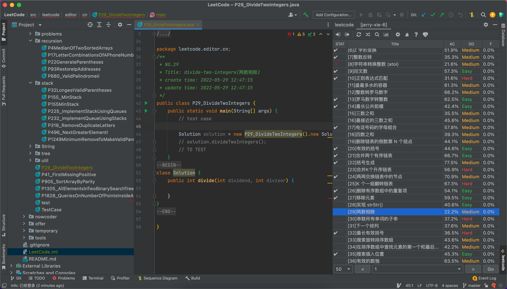
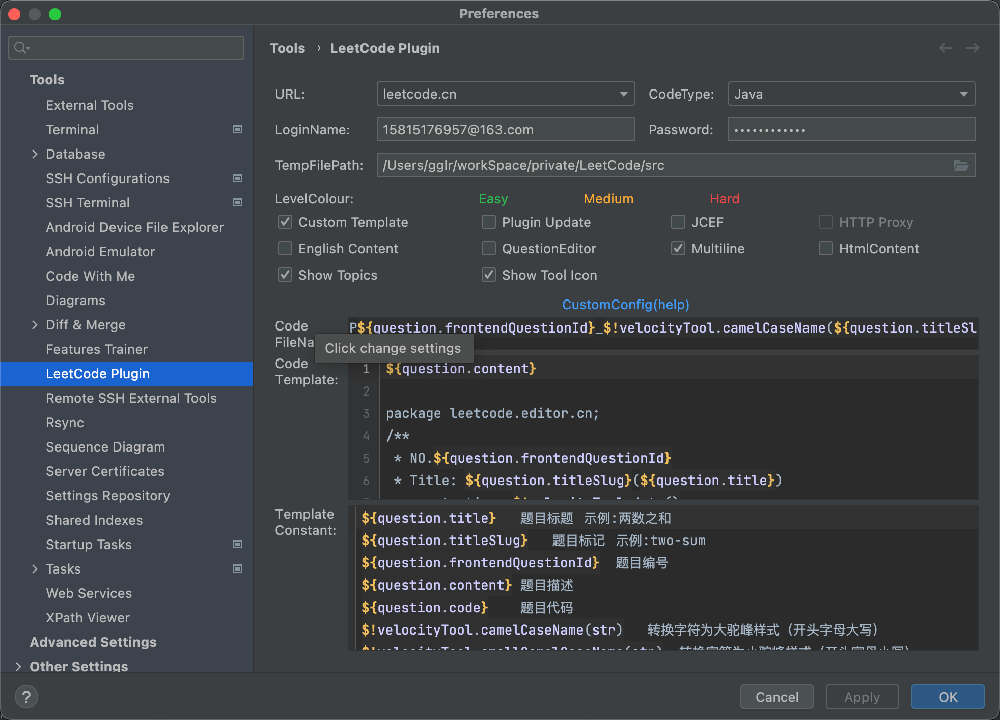

在idea 中使用leetcode插件刷题

## 效果图




## 设置




codeName:

```
P${question.frontendQuestionId}_$!velocityTool.camelCaseName(${question.titleSlug})
```

codeTemplate:

```
${question.content}

package leetcode.editor.cn;
/**
 * NO.${question.frontendQuestionId}
 * Title: ${question.titleSlug}(${question.title})
 * create time: $!velocityTool.date()
 * update time: $!velocityTool.date()
 */
public class P${question.frontendQuestionId}_$!velocityTool.camelCaseName(${question.titleSlug}) {
    public static void main(String[] args) {
        // test case

        Solution solution = new P${question.frontendQuestionId}_$!velocityTool.camelCaseName(${question.titleSlug})().new Solution();
        // solution.$!velocityTool.smallCamelCaseName(${question.titleSlug})();
        // TO TEST
    }
${question.code}
}
```

