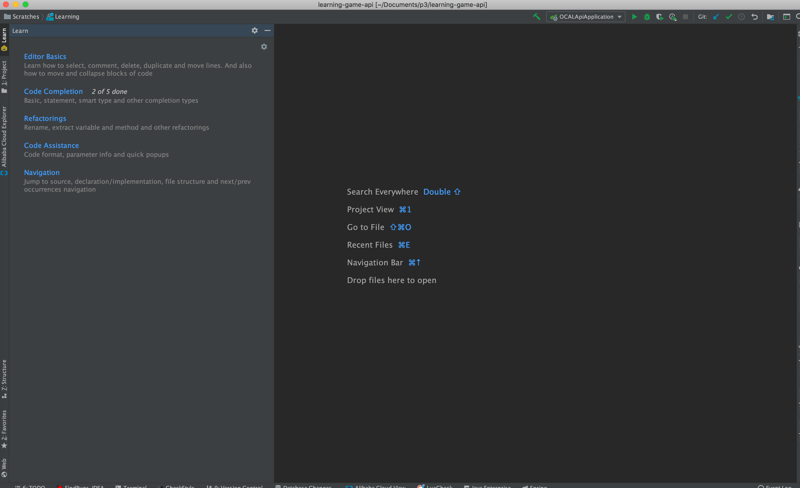
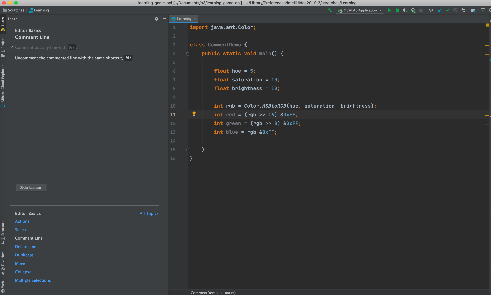

---
title: IDE Features Trainer：IDEA 交互式教程
category: IDEA指南
tag:
  - IDEA
  - IDEA插件
---

**有了这个插件之后，你可以在 IDE 中以交互方式学习IDEA最常用的快捷方式和最基本功能。** 非常非常非常方便！强烈建议大家安装一个，尤其是刚开始使用IDEA的朋友。	

当我们安装了这个插件之后，你会发现我们的IDEA 编辑器的右边多了一个“**Learn**”的选项，我们点击这个选项就可以看到如下界面。

我们选择“Editor Basics”进行，然后就可以看到如下界面，这样你就可以按照指示来练习了！非常不错！

